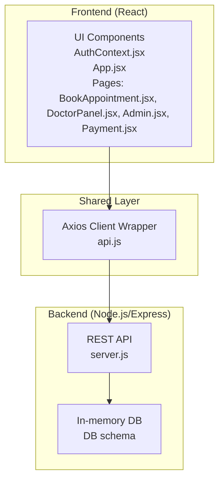
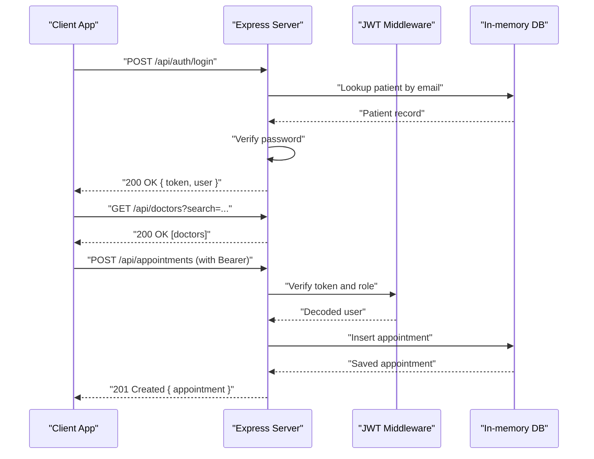
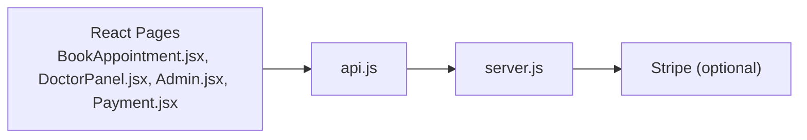

# API Reference

<cite>
**Referenced Files in This Document**
- [server.js](file://server.js)
- [api.js](file://api.js)
- [AuthContext.jsx](file://AuthContext.jsx)
- [App.jsx](file://App.jsx)
- [BookAppointment.jsx](file://BookAppointment.jsx)
- [DoctorPanel.jsx](file://DoctorPanel.jsx)
- [Admin.jsx](file://Admin.jsx)
- [Payment.jsx](file://Payment.jsx)
- [index.html](file://index.html)
- [style.css](file://style.css)
- [data.js](file://data.js)
- [package.json](file://package.json)
- [README.md](file://README.md)
</cite>

## Table of Contents
1. [Introduction](#introduction)
2. [Project Structure](#project-structure)
3. [Core Components](#core-components)
4. [Architecture Overview](#architecture-overview)
5. [Detailed Component Analysis](#detailed-component-analysis)
6. [Dependency Analysis](#dependency-analysis)
7. [Performance Considerations](#performance-considerations)
8. [Troubleshooting Guide](#troubleshooting-guide)
9. [Conclusion](#conclusion)
10. [Appendices](#appendices)

## Introduction
This document provides comprehensive API documentation for the Doctor appointment booking system. It covers all RESTful endpoints grouped by functional domains: authentication, doctor management, appointment booking, payment processing, and admin operations. For each endpoint, you will find HTTP methods, URL patterns, request/response schemas, authentication requirements, validation rules, error response codes, and practical examples. It also explains JWT authentication, role-based access control, CORS configuration, rate limiting considerations, error handling patterns, client integration guidelines, and testing strategies.

## Project Structure
The system consists of:
- Backend: Node.js + Express REST API with in-memory storage
- Frontend: React SPA that consumes the backend API
- Shared client library: Axios-based wrapper for API calls

**Diagram sources**
- [server.js](file://server.js#L1-L390)
- [api.js](file://api.js#L1-L44)
- [AuthContext.jsx](file://AuthContext.jsx#L1-L41)
- [App.jsx](file://App.jsx#L1-L44)
- [BookAppointment.jsx](file://BookAppointment.jsx#L1-L171)
- [DoctorPanel.jsx](file://DoctorPanel.jsx#L1-L96)
- [Admin.jsx](file://Admin.jsx#L1-L194)
- [Payment.jsx](file://Payment.jsx#L1-L350)

**Section sources**
- [server.js](file://server.js#L1-L390)
- [api.js](file://api.js#L1-L44)
- [package.json](file://package.json#L1-L24)

## Core Components
- Authentication middleware enforces JWT-based access control and role checks.
- Public endpoints expose doctor listings and fee information.
- Protected endpoints require Bearer tokens and enforce role-based permissions.
- Payment endpoints integrate with Stripe (when configured) or simulate payments.

Key implementation highlights:
- JWT signing and verification with a configurable secret.
- Role-based access control via middleware decorator.
- CORS enabled globally for development.
- In-memory database simulating relational tables.

**Section sources**
- [server.js](file://server.js#L49-L62)
- [server.js](file://server.js#L22-L24)
- [server.js](file://server.js#L29-L44)

## Architecture Overview
High-level API flow:
- Clients send requests to backend endpoints.
- Requests pass through JWT middleware for protected routes.
- Controllers validate inputs, query/update in-memory DB, and return structured responses.
- Frontend integrates via Axios wrapper and sets Authorization header automatically.

**Diagram sources**
- [server.js](file://server.js#L68-L110)
- [server.js](file://server.js#L116-L131)
- [server.js](file://server.js#L170-L202)
- [AuthContext.jsx](file://AuthContext.jsx#L11-L14)

## Detailed Component Analysis

### Authentication Endpoints
- Purpose: User registration and login for patients, doctors, and admins.
- Authentication: None required for registration/login; returns JWT on success.
- Roles: patient, doctor, admin.

Endpoints:
- POST /api/auth/register
  - Description: Register a new patient.
  - Authentication: None.
  - Request body:
    - name: string, required
    - email: string, required
    - phone: string, required
    - age: number, required
    - password: string, required
  - Response:
    - token: string
    - user: object with id, name, email, phone, age, role
  - Errors:
    - 400: Validation failure (missing fields)
    - 409: Email already registered

- POST /api/auth/login
  - Description: Patient login.
  - Authentication: None.
  - Request body:
    - email: string, required
    - password: string, required
  - Response:
    - token: string
    - user: object with id, name, email, phone, age, role
  - Errors:
    - 401: Invalid email or password

- POST /api/auth/doctor-login
  - Description: Doctor login.
  - Authentication: None.
  - Request body:
    - email: string, required
    - password: string, required
  - Response:
    - token: string
    - user: object with id, name, email, specialization, role
  - Errors:
    - 401: Invalid credentials

- POST /api/auth/admin-login
  - Description: Admin login.
  - Authentication: None.
  - Request body:
    - username: string, required
    - password: string, required
  - Response:
    - token: string
    - user: object with id, name, role
  - Errors:
    - 401: Invalid admin credentials

Example request (patient login):
- POST /api/auth/login
- Headers: none
- Body:
  - email: "patient@example.com"
  - password: "securePassword123"
- Response:
  - token: "eyJhbGciOiJIUzI1NiIsInR5cCI6IkpXVCJ9..."
  - user: { id, name, email, phone, age, role }

Example response (success):
- 200 OK
- Body:
  - token: "..."
  - user: { id, name, email, phone, age, role }

Example response (invalid credentials):
- 401 Unauthorized
- Body:
  - error: "Invalid email or password"

**Section sources**
- [server.js](file://server.js#L68-L110)

### Doctor Management Endpoints
- Purpose: Public listing and details; doctor-specific appointment management; review submission.
- Authentication: Public for listing; JWT required for doctor panel and reviews.

Endpoints:
- GET /api/doctors
  - Description: List doctors with optional filters.
  - Authentication: None.
  - Query parameters:
    - search: string (name or specialization)
    - specialization: string
  - Response: Array of doctor objects (without sensitive fields).

- GET /api/doctors/:id
  - Description: Get doctor details by ID.
  - Authentication: None.
  - Path parameters:
    - id: string, doctor identifier
  - Response: Doctor object (without sensitive fields).
  - Errors:
    - 404: Doctor not found

- GET /api/doctor/appointments
  - Description: Doctor’s incoming appointments.
  - Authentication: Required (doctor).
  - Response: Array of appointments with patient info.

- PATCH /api/doctor/appointments/:id
  - Description: Approve or reject an appointment.
  - Authentication: Required (doctor).
  - Path parameters:
    - id: string, appointment identifier
  - Request body:
    - status: string, one of approved, cancelled
  - Response: Updated appointment.
  - Errors:
    - 404: Appointment not found
    - 400: Invalid status

- POST /api/doctors/:id/review
  - Description: Submit a review for a doctor.
  - Authentication: Required (patient).
  - Path parameters:
    - id: string, doctor identifier
  - Request body:
    - rating: number, integer
    - comment: string, optional
  - Response: { message, rating }
  - Errors:
    - 404: Doctor not found

Example request (approve appointment):
- PATCH /api/doctor/appointments/appt123
- Headers: Authorization: Bearer <token>
- Body:
  - status: "approved"
- Response:
  - 200 OK
  - Body: { appointment fields }

**Section sources**
- [server.js](file://server.js#L116-L164)
- [server.js](file://server.js#L133-L153)

### Appointment Booking Endpoints
- Purpose: Book, view, and cancel appointments; patient profile management.
- Authentication: Patient-only for booking and profile.

Endpoints:
- POST /api/appointments
  - Description: Book an appointment.
  - Authentication: Required (patient).
  - Request body:
    - doctor_id: string
    - date: string (YYYY-MM-DD)
    - time: string (matching doctor’s available_time)
  - Response: Created appointment object.
  - Errors:
    - 400: Missing fields
    - 404: Doctor not found
    - 409: Slot already booked

- GET /api/appointments
  - Description: Get all appointments for the logged-in patient.
  - Authentication: Required (patient).
  - Response: Array of appointments.

- PATCH /api/appointments/:id/cancel
  - Description: Cancel an appointment.
  - Authentication: Required (patient).
  - Path parameters:
    - id: string, appointment identifier
  - Response: Updated appointment.
  - Errors:
    - 404: Not found

- GET /api/profile
  - Description: Retrieve patient profile.
  - Authentication: Required (patient).
  - Response: Patient object (without password).

- PUT /api/profile
  - Description: Update patient profile (including password).
  - Authentication: Required (patient).
  - Request body:
    - name: string, optional
    - phone: string, optional
    - age: number, optional
    - password: string, optional (will be hashed)
  - Response: Updated patient object (without password).
  - Errors:
    - 404: Not found

Example request (book appointment):
- POST /api/appointments
- Headers: Authorization: Bearer <token>
- Body:
  - doctor_id: "d1"
  - date: "2025-06-15"
  - time: "9:00 AM"
- Response:
  - 201 Created
  - Body: { appointment fields }

**Section sources**
- [server.js](file://server.js#L170-L239)

### Payment Processing Endpoints
- Purpose: Create payment intents (Stripe), simulate payments, retrieve receipts, and admin payment overview.
- Authentication: Patient-only for payment-related endpoints; admin for admin payments.

Endpoints:
- POST /api/payments/create-intent
  - Description: Create a Stripe PaymentIntent (requires Stripe secret key).
  - Authentication: Required (patient).
  - Request body:
    - appointment_id: string
    - doctor_id: string
  - Response:
    - clientSecret: string
    - amount: number (paisa/cents)
    - doctor: string
    - specialization: string
  - Errors:
    - 404: Appointment or doctor not found
    - 503: Stripe not configured

- POST /api/payments/simulate
  - Description: Simulate payment processing (no real Stripe).
  - Authentication: Required (patient).
  - Request body:
    - appointment_id: string
    - doctor_id: string
    - card_number: string, optional
    - card_name: string, optional
    - expiry: string, optional
    - cvv: string, optional
    - method: string, optional (card, easypaisa, jazzcash, bank)
    - mobile_number: string, optional
    - account_number: string, optional
  - Response: { success: true, payment: { ... } }
  - Errors:
    - 404: Appointment or doctor not found
    - 400: Invalid card fields

- GET /api/payments/:appointment_id
  - Description: Retrieve payment receipt for a patient.
  - Authentication: Required (patient).
  - Path parameters:
    - appointment_id: string
  - Response: Payment object.
  - Errors:
    - 404: Payment not found

- GET /api/payments/fee/:doctor_id
  - Description: Get consultation fee for a doctor.
  - Authentication: None.
  - Path parameters:
    - doctor_id: string
  - Response: { fee: number, currency: string, specialization: string }
  - Errors:
    - 404: Doctor not found

- GET /api/admin/payments
  - Description: Admin-only view of all payments.
  - Authentication: Required (admin).
  - Response: Array of enriched payments with patient and doctor names.

Example request (simulate payment):
- POST /api/payments/simulate
- Headers: Authorization: Bearer <token>
- Body:
  - appointment_id: "appt123"
  - doctor_id: "d1"
  - method: "card"
  - card_number: "1234567890123456"
  - card_name: "John Doe"
  - expiry: "12/28"
  - cvv: "123"
- Response:
  - 200 OK
  - Body: { success: true, payment: { ... } }

**Section sources**
- [server.js](file://server.js#L287-L377)

### Admin Operations Endpoints
- Purpose: System overview, manage appointments, view patients/doctors, and admin payments.
- Authentication: Admin-only.

Endpoints:
- GET /api/admin/stats
  - Description: System statistics.
  - Authentication: Required (admin).
  - Response: { totalPatients, totalDoctors, totalAppointments, pending, approved, cancelled }

- GET /api/admin/appointments
  - Description: All appointments.
  - Authentication: Required (admin).
  - Response: Array of appointments.

- GET /api/admin/patients
  - Description: All patients (without passwords).
  - Authentication: Required (admin).
  - Response: Array of patients.

- GET /api/admin/doctors
  - Description: All doctors (without passwords).
  - Authentication: Required (admin).
  - Response: Array of doctors.

- PATCH /api/admin/appointments/:id
  - Description: Change appointment status.
  - Authentication: Required (admin).
  - Path parameters:
    - id: string
  - Request body:
    - status: string
  - Response: Updated appointment.

- DELETE /api/admin/doctors/:id
  - Description: Remove a doctor.
  - Authentication: Required (admin).
  - Path parameters:
    - id: string
  - Response: { message: "Doctor removed" }
  - Errors:
    - 404: Not found

Example request (change appointment status):
- PATCH /api/admin/appointments/appt123
- Headers: Authorization: Bearer <admin-token>
- Body:
  - status: "approved"
- Response:
  - 200 OK
  - Body: { appointment fields }

**Section sources**
- [server.js](file://server.js#L242-L280)

## Dependency Analysis
- Frontend-to-backend communication:
  - React components call the Axios wrapper in api.js.
  - api.js targets /api base URL and forwards to server.js routes.
  - AuthContext.jsx sets Authorization header automatically for authenticated requests.

- Backend dependencies:
  - Express for routing and middleware.
  - bcryptjs for password hashing.
  - jsonwebtoken for JWT signing/verification.
  - uuid for generating IDs.
  - stripe for payment intents (optional).

**Diagram sources**
- [api.js](file://api.js#L1-L44)
- [server.js](file://server.js#L1-L390)

**Section sources**
- [api.js](file://api.js#L1-L44)
- [AuthContext.jsx](file://AuthContext.jsx#L11-L14)
- [server.js](file://server.js#L13-L15)

## Performance Considerations
- In-memory storage: Suitable for development and small scale; expect O(n) lookups for filtering and searching.
- Recommendation: Replace in-memory DB with persistent storage (MySQL/MariaDB) for production.
- Stripe integration: Payment intent creation is asynchronous; ensure timeouts and retries are handled gracefully.
- Rate limiting: Not implemented in the current server; consider adding rate limiting middleware for public endpoints (e.g., login/register) to prevent abuse.

[No sources needed since this section provides general guidance]

## Troubleshooting Guide
Common errors and resolutions:
- 401 Unauthorized
  - Cause: Missing or invalid/expired JWT.
  - Resolution: Re-authenticate and ensure Authorization header is present.
- 403 Forbidden
  - Cause: Insufficient role (e.g., patient accessing doctor/admin endpoints).
  - Resolution: Authenticate with correct credentials.
- 400 Bad Request
  - Cause: Missing or invalid fields in request body.
  - Resolution: Validate inputs according to endpoint schemas.
- 404 Not Found
  - Cause: Resource does not exist (doctor, appointment, payment).
  - Resolution: Verify identifiers and existence.
- 409 Conflict
  - Cause: Duplicate booking (same slot/time).
  - Resolution: Select another time or date.
- 503 Service Unavailable
  - Cause: Stripe not configured.
  - Resolution: Set STRIPE_SECRET_KEY environment variable.

Frontend tips:
- Ensure Authorization header is set in axios defaults when a token exists.
- Use toast notifications to surface API errors to users.

**Section sources**
- [server.js](file://server.js#L49-L62)
- [AuthContext.jsx](file://AuthContext.jsx#L11-L14)

## Conclusion
The Doctor appointment booking system provides a clear REST API with role-based access control, JWT authentication, and a cohesive frontend integration. While the current implementation uses in-memory storage and optional Stripe integration, the architecture supports easy migration to persistent storage and production-grade payment processing. The included frontend demonstrates proper client integration patterns, including automatic Authorization header management and step-by-step payment flows.

[No sources needed since this section summarizes without analyzing specific files]

## Appendices

### Authentication and Authorization
- JWT header requirement:
  - Authorization: Bearer <token>
- Roles:
  - patient: Access to booking, profile, and payment receipts.
  - doctor: Access to own appointments and review submission.
  - admin: Full system control and reporting.
- Token expiration:
  - Tokens expire after 7 days.

**Section sources**
- [server.js](file://server.js#L49-L62)
- [AuthContext.jsx](file://AuthContext.jsx#L11-L14)

### API Versioning and Backward Compatibility
- Current state:
  - No explicit API versioning is implemented.
  - Base URL is /api.
- Recommendations:
  - Adopt versioned URLs (e.g., /api/v1/...) to preserve backward compatibility during changes.
  - Maintain deprecation notices and migration timelines for breaking changes.

**Section sources**
- [server.js](file://server.js#L3-L3)
- [api.js](file://api.js#L3)

### Rate Limiting and Usage Quotas
- Current implementation:
  - No rate limiting is enforced.
- Recommended policies (examples):
  - Public endpoints: 60 requests per minute per IP.
  - Authenticated endpoints: 300 requests per minute per user.
  - Payment endpoints: 10 requests per minute per user.
- Implementation approach:
  - Use a middleware like express-rate-limit or Redis-based counters.

[No sources needed since this section provides general guidance]

### CORS Configuration
- Enabled globally:
  - app.use(cors()) allows cross-origin requests for development.
- Production recommendation:
  - Configure allowed origins, methods, and headers explicitly.

**Section sources**
- [server.js](file://server.js#L22)

### Error Handling Patterns
- Standardized error responses:
  - JSON object with error field containing a descriptive message.
- Typical HTTP codes:
  - 400: Validation errors
  - 401: Unauthorized
  - 403: Access denied
  - 404: Not found
  - 409: Conflict
  - 500: Internal server error
  - 503: Service unavailable

**Section sources**
- [server.js](file://server.js#L49-L62)

### Client Integration Examples and SDK Usage Guidelines
- Frontend integration:
  - Use api.js export functions for all API calls.
  - Set Authorization header automatically via AuthContext.jsx.
- Example flows:
  - Patient registers, logs in, books an appointment, and pays.
  - Doctor logs in and approves/rejects requests.
  - Admin views stats, manages appointments, and removes doctors.
- Best practices:
  - Validate inputs before sending requests.
  - Handle errors gracefully with user feedback.
  - Persist tokens securely and refresh as needed.

**Section sources**
- [api.js](file://api.js#L1-L44)
- [AuthContext.jsx](file://AuthContext.jsx#L11-L14)
- [BookAppointment.jsx](file://BookAppointment.jsx#L39-L60)
- [DoctorPanel.jsx](file://DoctorPanel.jsx#L22-L28)
- [Admin.jsx](file://Admin.jsx#L26-L41)
- [Payment.jsx](file://Payment.jsx#L79-L98)

### Testing Strategies and Debugging Techniques
- Unit testing:
  - Mock Express routes and test controller logic.
- Integration testing:
  - Spin up server, hit endpoints, assert responses.
- Frontend testing:
  - Mock axios interceptors and test UI flows.
- Debugging tips:
  - Log requests/responses in development.
  - Use browser dev tools Network tab to inspect headers and payloads.
  - Verify Authorization header presence for protected routes.

**Section sources**
- [server.js](file://server.js#L389-L390)
- [index.html](file://index.html#L1-L531)

### Request/Response Schemas Summary
- Authentication
  - POST /api/auth/register
    - Request: { name, email, phone, age, password }
    - Response: { token, user }
  - POST /api/auth/login
    - Request: { email, password }
    - Response: { token, user }
  - POST /api/auth/doctor-login
    - Request: { email, password }
    - Response: { token, user }
  - POST /api/auth/admin-login
    - Request: { username, password }
    - Response: { token, user }

- Doctor Management
  - GET /api/doctors?search=&specialization=
    - Response: [ { doctor fields } ]
  - GET /api/doctors/:id
    - Response: { doctor fields }
  - GET /api/doctor/appointments
    - Response: [ { appointment fields with patient info } ]
  - PATCH /api/doctor/appointments/:id
    - Request: { status }
    - Response: { appointment fields }
  - POST /api/doctors/:id/review
    - Request: { rating, comment }
    - Response: { message, rating }

- Appointments
  - POST /api/appointments
    - Request: { doctor_id, date, time }
    - Response: { appointment fields }
  - GET /api/appointments
    - Response: [ { appointment fields } ]
  - PATCH /api/appointments/:id/cancel
    - Response: { appointment fields }
  - GET /api/profile
    - Response: { patient fields }
  - PUT /api/profile
    - Request: { name, phone, age, password }
    - Response: { patient fields }

- Payments
  - POST /api/payments/create-intent
    - Request: { appointment_id, doctor_id }
    - Response: { clientSecret, amount, doctor, specialization }
  - POST /api/payments/simulate
    - Request: { appointment_id, doctor_id, ... }
    - Response: { success: true, payment }
  - GET /api/payments/:appointment_id
    - Response: { payment fields }
  - GET /api/payments/fee/:doctor_id
    - Response: { fee, currency, specialization }
  - GET /api/admin/payments
    - Response: [ { payment fields with patient and doctor names } ]

- Admin
  - GET /api/admin/stats
    - Response: { totals and counts }
  - GET /api/admin/appointments
    - Response: [ { appointment fields } ]
  - GET /api/admin/patients
    - Response: [ { patient fields } ]
  - GET /api/admin/doctors
    - Response: [ { doctor fields } ]
  - PATCH /api/admin/appointments/:id
    - Request: { status }
    - Response: { appointment fields }
  - DELETE /api/admin/doctors/:id
    - Response: { message }

**Section sources**
- [server.js](file://server.js#L68-L110)
- [server.js](file://server.js#L116-L164)
- [server.js](file://server.js#L170-L239)
- [server.js](file://server.js#L287-L377)
- [server.js](file://server.js#L242-L280)