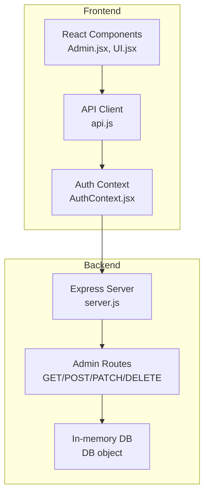
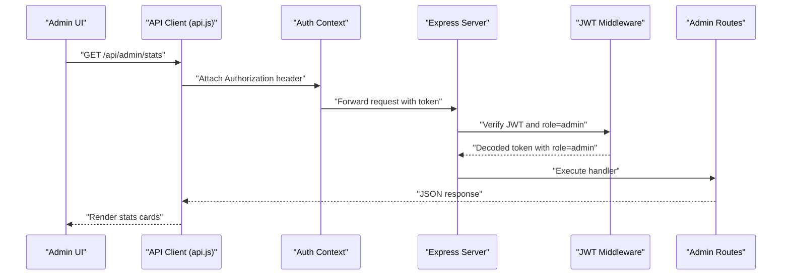
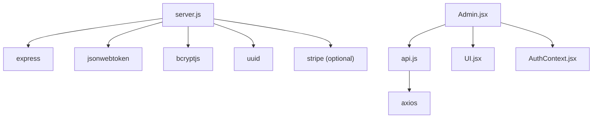

# Admin Dashboard Endpoints

<cite>
**Referenced Files in This Document**
- [server.js](file://server.js)
- [api.js](file://api.js)
- [Admin.jsx](file://Admin.jsx)
- [AuthContext.jsx](file://AuthContext.jsx)
- [index.html](file://index.html)
- [app.js](file://app.js)
- [UI.jsx](file://UI.jsx)
- [style.css](file://style.css)
- [package.json](file://package.json)
- [README.md](file://README.md)
</cite>

## Table of Contents
1. [Introduction](#introduction)
2. [Project Structure](#project-structure)
3. [Core Components](#core-components)
4. [Architecture Overview](#architecture-overview)
5. [Detailed Component Analysis](#detailed-component-analysis)
6. [Dependency Analysis](#dependency-analysis)
7. [Performance Considerations](#performance-considerations)
8. [Troubleshooting Guide](#troubleshooting-guide)
9. [Conclusion](#conclusion)
10. [Appendices](#appendices)

## Introduction
This document provides comprehensive API documentation for the admin dashboard endpoints in the MediBook system. It covers system statistics, user management, appointment monitoring, and doctor administration. The admin endpoints enable privileged operations such as retrieving system analytics, listing and filtering appointments, managing patients and doctors, updating appointment statuses, and removing doctors. Authentication requires a valid JWT token with the admin role.

## Project Structure
The application follows a full-stack architecture with a Node.js/Express backend serving REST APIs and a React frontend consuming those APIs. The admin dashboard is implemented in the frontend and backed by the following backend routes:
- Statistics endpoint for system analytics
- Appointment listing and status updates
- Patient and doctor listings
- Doctor deletion
- Payment enrichment for admin views

**Diagram sources**
- [server.js](file://server.js#L242-L280)
- [api.js](file://api.js#L29-L36)
- [Admin.jsx](file://Admin.jsx#L1-L50)
- [AuthContext.jsx](file://AuthContext.jsx#L1-L41)

**Section sources**
- [server.js](file://server.js#L242-L280)
- [api.js](file://api.js#L29-L36)
- [Admin.jsx](file://Admin.jsx#L1-L50)
- [AuthContext.jsx](file://AuthContext.jsx#L1-L41)

## Core Components
- Admin authentication middleware enforces JWT-based access control for admin endpoints.
- Admin routes provide:
  - GET /api/admin/stats for system analytics
  - GET /api/admin/appointments for comprehensive appointment listing
  - GET /api/admin/patients for patient directory
  - GET /api/admin/doctors for doctor management
  - PATCH /api/admin/appointments/:id for administrative status changes
  - DELETE /api/admin/doctors/:id for doctor removal
- Admin UI integrates with these endpoints to present dashboards and enable administrative workflows.

**Section sources**
- [server.js](file://server.js#L49-L62)
- [server.js](file://server.js#L244-L280)
- [api.js](file://api.js#L29-L36)
- [Admin.jsx](file://Admin.jsx#L1-L50)

## Architecture Overview
The admin dashboard architecture comprises:
- Frontend React components invoking API endpoints via axios.
- Backend Express routes protected by JWT middleware.
- In-memory data store simulating database tables for patients, doctors, appointments, and payments.
- Admin UI rendering tabs for overview, appointments, patients, doctors, and payments.

**Diagram sources**
- [api.js](file://api.js#L30)
- [AuthContext.jsx](file://AuthContext.jsx#L11-L14)
- [server.js](file://server.js#L49-L62)
- [server.js](file://server.js#L244-L253)

## Detailed Component Analysis

### Authentication and Authorization
- JWT middleware verifies tokens and enforces role-based access.
- Admin login endpoint generates a JWT with role=admin.
- Frontend stores the token and attaches it to all authenticated requests.

Key behaviors:
- Missing or invalid token results in 401 Unauthorized.
- Token without admin role yields 403 Forbidden.
- Auth context sets Authorization header for axios requests.

**Section sources**
- [server.js](file://server.js#L49-L62)
- [server.js](file://server.js#L102-L110)
- [AuthContext.jsx](file://AuthContext.jsx#L11-L14)

### Endpoint: GET /api/admin/stats
Purpose:
- Retrieve system analytics including totals and status distributions.

Response schema:
- totalPatients: integer
- totalDoctors: integer
- totalAppointments: integer
- pending: integer
- approved: integer
- cancelled: integer

Example response:
- {
  "totalPatients": 0,
  "totalDoctors": 6,
  "totalAppointments": 0,
  "pending": 0,
  "approved": 0,
  "cancelled": 0
}

Operational notes:
- Aggregates counts from in-memory DB collections.
- Used by the admin overview tab to render summary cards.

**Section sources**
- [server.js](file://server.js#L244-L253)
- [Admin.jsx](file://Admin.jsx#L62-L96)

### Endpoint: GET /api/admin/appointments
Purpose:
- Retrieve all appointments for administrative monitoring.

Response schema:
- Array of appointment objects with fields:
  - appointment_id: string
  - patient_id: string
  - doctor_id: string
  - doctor_name: string
  - doctor_spec: string
  - doctor_emoji: string
  - patient_name: string
  - date: string (YYYY-MM-DD)
  - time: string
  - status: enum("pending","approved","cancelled","completed")
  - confirmation_probability: integer
  - created_at: string (ISO timestamp)
  - updated_at: string (ISO timestamp)

Operational notes:
- Admin UI displays a list with status dropdowns for bulk updates.
- Supports filtering and sorting via frontend logic.

**Section sources**
- [server.js](file://server.js#L255-L257)
- [Admin.jsx](file://Admin.jsx#L99-L120)

### Endpoint: GET /api/admin/patients
Purpose:
- Retrieve all patients excluding sensitive fields.

Response schema:
- Array of patient objects with fields:
  - patient_id: string
  - name: string
  - email: string
  - phone: string
  - age: integer
  - created_at: string (ISO timestamp)

Operational notes:
- Password field is excluded from response.
- Used by the admin patients tab for directory browsing.

**Section sources**
- [server.js](file://server.js#L259-L261)
- [Admin.jsx](file://Admin.jsx#L122-L140)

### Endpoint: GET /api/admin/doctors
Purpose:
- Retrieve all doctors excluding sensitive fields.

Response schema:
- Array of doctor objects with fields:
  - doctor_id: string
  - name: string
  - email: string
  - specialization: string
  - experience: integer
  - available_time: string
  - rating: number
  - reviews: array
  - emoji: string
  - approved: boolean

Operational notes:
- Password field is excluded from response.
- Used by the admin doctors tab for management.

**Section sources**
- [server.js](file://server.js#L263-L265)
- [Admin.jsx](file://Admin.jsx#L142-L159)

### Endpoint: PATCH /api/admin/appointments/:id
Purpose:
- Change the administrative status of an appointment.

Request body:
- status: enum("pending","approved","cancelled","completed")

Response schema:
- Same as appointment object with updated status and timestamps.

Operational notes:
- Admin UI updates the selected appointment’s status via a dropdown.
- Ensures atomic updates and reflects changes immediately.

**Section sources**
- [server.js](file://server.js#L267-L273)
- [Admin.jsx](file://Admin.jsx#L26-L32)

### Endpoint: DELETE /api/admin/doctors/:id
Purpose:
- Remove a doctor from the system.

Response schema:
- {
  "message": "Doctor removed"
}

Operational notes:
- Admin UI triggers deletion with confirmation.
- Removes the doctor record from the in-memory collection.

**Section sources**
- [server.js](file://server.js#L275-L280)
- [Admin.jsx](file://Admin.jsx#L34-L41)

### Enhanced Data Structures for Admin Views
- Admin payments endpoint enriches payment records with patient and doctor names:
  - patient_name: string
  - doctor_name: string
- Admin overview tab displays revenue metrics derived from payments.

**Section sources**
- [server.js](file://server.js#L363-L370)
- [Admin.jsx](file://Admin.jsx#L161-L189)

### API Client Integration
- Frontend API client exports functions for each admin endpoint.
- Auth context injects Authorization header automatically.
- Admin component orchestrates concurrent data loading and state updates.

**Section sources**
- [api.js](file://api.js#L29-L36)
- [AuthContext.jsx](file://AuthContext.jsx#L11-L14)
- [Admin.jsx](file://Admin.jsx#L19-L24)

### Administrative Workflows
- System monitoring dashboard:
  - Overview tab aggregates stats and recent appointments.
  - Payments tab shows total revenue and transaction details.
- User activity tracking:
  - Patients tab lists registrations and contact details.
- Administrative operations:
  - Bulk status updates for appointments.
  - Doctor removal with confirmation.

**Section sources**
- [Admin.jsx](file://Admin.jsx#L45-L96)
- [Admin.jsx](file://Admin.jsx#L161-L189)
- [Admin.jsx](file://Admin.jsx#L34-L41)

## Dependency Analysis
- Backend dependencies include Express, bcrypt, jsonwebtoken, uuid, cors, and stripe (optional).
- Frontend depends on React, react-router-dom, and axios for API communication.
- Admin UI relies on shared UI components and styling.

**Diagram sources**
- [package.json](file://package.json#L14-L22)
- [server.js](file://server.js#L5-L20)
- [api.js](file://api.js#L1)
- [Admin.jsx](file://Admin.jsx#L1-L6)
- [UI.jsx](file://UI.jsx#L1-L4)
- [AuthContext.jsx](file://AuthContext.jsx#L1-L4)

**Section sources**
- [package.json](file://package.json#L14-L22)
- [server.js](file://server.js#L5-L20)
- [api.js](file://api.js#L1)
- [Admin.jsx](file://Admin.jsx#L1-L6)
- [UI.jsx](file://UI.jsx#L1-L4)
- [AuthContext.jsx](file://AuthContext.jsx#L1-L4)

## Performance Considerations
- Current implementation uses an in-memory database; pagination and filtering are not implemented for large datasets.
- Recommendations:
  - Implement server-side pagination for admin endpoints.
  - Add indexing on frequently queried fields (e.g., status, date).
  - Cache static data like doctor lists to reduce compute overhead.
  - Use database cursors or limit/offset for large result sets.

[No sources needed since this section provides general guidance]

## Troubleshooting Guide
Common issues and resolutions:
- 401 Unauthorized:
  - Cause: Missing or invalid Authorization header.
  - Resolution: Ensure admin login and token storage.
- 403 Forbidden:
  - Cause: Token does not include admin role.
  - Resolution: Authenticate as admin and regenerate token.
- 404 Not Found:
  - Cause: Non-existent appointment or doctor ID.
  - Resolution: Verify resource IDs and existence.
- CORS errors:
  - Cause: Frontend origin not permitted.
  - Resolution: Configure CORS in Express to allow frontend origin.

**Section sources**
- [server.js](file://server.js#L49-L62)
- [server.js](file://server.js#L267-L273)
- [server.js](file://server.js#L275-L280)

## Conclusion
The admin dashboard endpoints provide a robust foundation for system oversight, enabling administrators to monitor system health, manage users and providers, and enforce operational controls. The documented schemas and workflows support integration with admin panels and enable scalable enhancements for production deployments.

[No sources needed since this section summarizes without analyzing specific files]

## Appendices

### API Definitions Summary
- GET /api/admin/stats
  - Description: System analytics including totals and status distributions.
  - Auth: admin JWT required.
  - Response: Stats object.
- GET /api/admin/appointments
  - Description: Comprehensive appointment listing.
  - Auth: admin JWT required.
  - Response: Array of appointment objects.
- GET /api/admin/patients
  - Description: Patient directory.
  - Auth: admin JWT required.
  - Response: Array of patient objects (without password).
- GET /api/admin/doctors
  - Description: Doctor management listing.
  - Auth: admin JWT required.
  - Response: Array of doctor objects (without password).
- PATCH /api/admin/appointments/:id
  - Description: Administrative status change.
  - Auth: admin JWT required.
  - Request: { status: enum }
  - Response: Updated appointment object.
- DELETE /api/admin/doctors/:id
  - Description: Remove a doctor.
  - Auth: admin JWT required.
  - Response: { message: "Doctor removed" }

**Section sources**
- [server.js](file://server.js#L244-L280)
- [api.js](file://api.js#L29-L36)

### Frontend Integration Notes
- Admin component loads data concurrently and updates UI state.
- Toast notifications provide feedback for admin actions.
- Status badges and form controls enhance usability.

**Section sources**
- [Admin.jsx](file://Admin.jsx#L19-L41)
- [UI.jsx](file://UI.jsx#L11-L25)