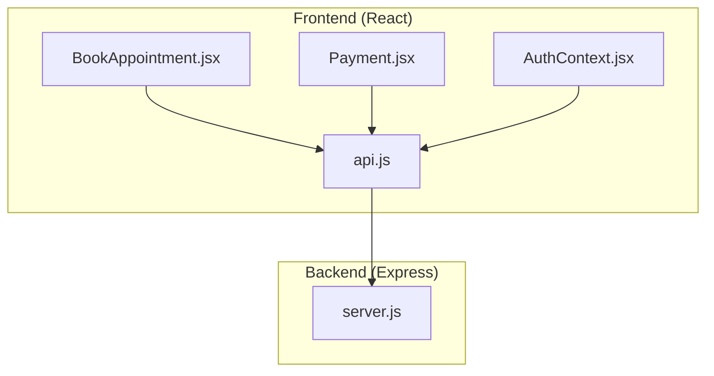
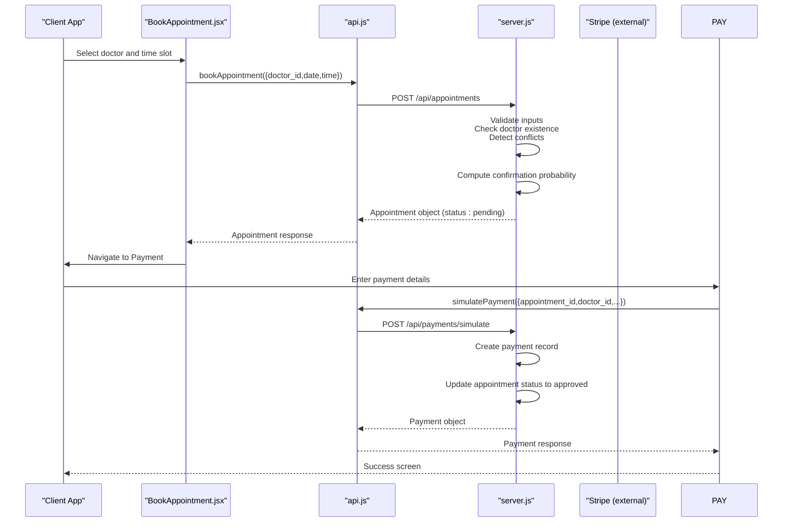
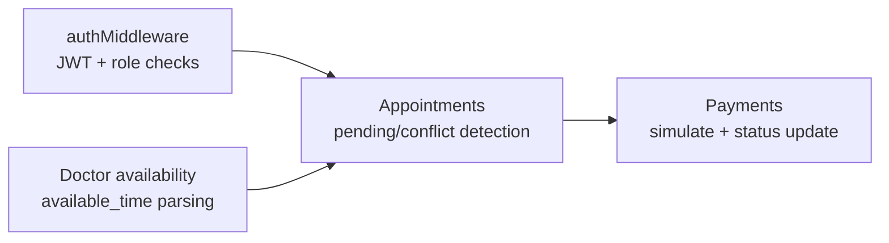

# Appointment Management Endpoints

<cite>
**Referenced Files in This Document**
- [server.js](file://server.js)
- [api.js](file://api.js)
- [AuthContext.jsx](file://AuthContext.jsx)
- [BookAppointment.jsx](file://BookAppointment.jsx)
- [Payment.jsx](file://Payment.jsx)
- [README.md](file://README.md)
</cite>

## Table of Contents
1. [Introduction](#introduction)
2. [Project Structure](#project-structure)
3. [Core Components](#core-components)
4. [Architecture Overview](#architecture-overview)
5. [Detailed Component Analysis](#detailed-component-analysis)
6. [Dependency Analysis](#dependency-analysis)
7. [Performance Considerations](#performance-considerations)
8. [Troubleshooting Guide](#troubleshooting-guide)
9. [Conclusion](#conclusion)
10. [Appendices](#appendices)

## Introduction
This document provides comprehensive API documentation for appointment management endpoints in the MediBook system. It covers:
- Appointment booking (POST /api/appointments)
- Patient appointment retrieval (GET /api/appointments)
- Appointment cancellation (PATCH /api/appointments/:id/cancel)
- Authentication requirements (JWT with patient role)
- Validation rules and error scenarios (404 Not Found, 409 Conflict)
- Confirmation probability algorithm based on doctor availability
- Status management (pending, approved, cancelled)
- Relationship between appointments and payments, including automatic status updates after payment processing

## Project Structure
The application consists of:
- Backend: Node.js/Express REST API with in-memory storage
- Frontend: React SPA with routing and state management
- Authentication: JWT-based with role enforcement
- Payment: Stripe integration with fallback simulation

**Diagram sources**
- [server.js](file://server.js#L1-L390)
- [api.js](file://api.js#L1-L44)
- [AuthContext.jsx](file://AuthContext.jsx#L1-L41)
- [BookAppointment.jsx](file://BookAppointment.jsx#L1-L171)
- [Payment.jsx](file://Payment.jsx#L1-L350)

**Section sources**
- [README.md](file://README.md#L1-L159)

## Core Components
- Authentication middleware enforces JWT and role checks
- Appointment routes implement booking, retrieval, and cancellation
- Payment routes integrate with Stripe and simulate payment processing
- Frontend components coordinate booking and payment flows

Key implementation references:
- Authentication middleware: [authMiddleware](file://server.js#L49-L62)
- Appointment endpoints: [POST /api/appointments](file://server.js#L170-L202), [GET /api/appointments](file://server.js#L204-L208), [PATCH /api/appointments/:id/cancel](file://server.js#L210-L217)
- Payment endpoints: [POST /api/payments/create-intent](file://server.js#L297-L316), [POST /api/payments/simulate](file://server.js#L318-L353), [GET /api/payments/:appointment_id](file://server.js#L355-L360)
- Frontend API bindings: [api.js](file://api.js#L16-L19), [api.js](file://api.js#L39-L43)

**Section sources**
- [server.js](file://server.js#L49-L62)
- [server.js](file://server.js#L170-L217)
- [server.js](file://server.js#L297-L360)
- [api.js](file://api.js#L16-L19)
- [api.js](file://api.js#L39-L43)

## Architecture Overview
The appointment lifecycle spans frontend components and backend endpoints:

**Diagram sources**
- [BookAppointment.jsx](file://BookAppointment.jsx#L39-L60)
- [api.js](file://api.js#L17-L18)
- [server.js](file://server.js#L170-L202)
- [server.js](file://server.js#L318-L353)
- [Payment.jsx](file://Payment.jsx#L62-L98)

## Detailed Component Analysis

### Authentication and Authorization
- JWT middleware verifies tokens and enforces roles
- Patient-only endpoints require role "patient"
- Authorization header format: "Bearer <token>"

Implementation references:
- Middleware definition: [authMiddleware](file://server.js#L49-L62)
- Patient-only routes: [POST /api/appointments](file://server.js#L170-L202), [GET /api/appointments](file://server.js#L204-L208), [PATCH /api/appointments/:id/cancel](file://server.js#L210-L217)
- Frontend auth context: [AuthContext.jsx](file://AuthContext.jsx#L1-L41)

**Section sources**
- [server.js](file://server.js#L49-L62)
- [server.js](file://server.js#L170-L217)
- [AuthContext.jsx](file://AuthContext.jsx#L1-L41)

### POST /api/appointments (Book Appointment)
Purpose: Create a new appointment for a logged-in patient.

Request
- Method: POST
- URL: /api/appointments
- Headers: Authorization: Bearer <JWT>, Content-Type: application/json
- Body (JSON):
  - doctor_id: string (required)
  - date: string (YYYY-MM-DD, required)
  - time: string (HH:MM, required)

Response
- 201 Created: Appointment object
- 400 Bad Request: Missing required fields
- 401 Unauthorized: No/invalid/expired token
- 403 Forbidden: Access denied (wrong role)
- 404 Not Found: Doctor not found
- 409 Conflict: Slot already booked

Appointment object fields:
- appointment_id: string
- patient_id: string
- doctor_id: string
- doctor_name: string
- doctor_spec: string
- doctor_emoji: string
- patient_name: string
- date: string
- time: string
- status: "pending"
- confirmation_probability: integer (20–100)
- created_at: string (ISO 8601)
- updated_at: string (ISO 8601)

Validation rules:
- All fields required in request body
- Doctor must exist
- No existing appointment with same doctor_id, date, time, and non-cancelled status

Confirmation probability algorithm:
- Count existing non-cancelled appointments for the doctor on the same date
- Count total available slots for the doctor
- probability = clamp(20, round(100 - (used_slots / total_slots) * 80))

Example workflow:
1. Patient selects doctor and time slot
2. Frontend calls [bookAppointment](file://api.js#L17-L18)
3. Backend validates inputs and checks conflicts
4. Backend computes probability and creates appointment with status "pending"
5. Frontend navigates to payment

**Section sources**
- [server.js](file://server.js#L170-L202)
- [api.js](file://api.js#L17-L18)
- [BookAppointment.jsx](file://BookAppointment.jsx#L39-L60)

### GET /api/appointments (Patient Appointment History)
Purpose: Retrieve all appointments for the authenticated patient.

Request
- Method: GET
- URL: /api/appointments
- Headers: Authorization: Bearer <JWT>

Response
- 200 OK: Array of appointment objects
- 401 Unauthorized: No/invalid/expired token
- 403 Forbidden: Access denied (wrong role)

Each appointment object includes all fields from the creation response.

**Section sources**
- [server.js](file://server.js#L204-L208)
- [api.js](file://api.js#L18-L18)

### PATCH /api/appointments/:id/cancel (Cancel Appointment)
Purpose: Cancel a patient’s own appointment.

Request
- Method: PATCH
- URL: /api/appointments/:id/cancel
- Headers: Authorization: Bearer <JWT>
- Path parameters:
  - id: string (appointment_id)

Response
- 200 OK: Updated appointment object with status "cancelled"
- 401 Unauthorized: No/invalid/expired token
- 403 Forbidden: Access denied (wrong role)
- 404 Not Found: Appointment not found (either not owned by patient or does not exist)

Cancellation logic:
- Find appointment by id and patient_id
- Set status to "cancelled"
- Update updated_at timestamp

**Section sources**
- [server.js](file://server.js#L210-L217)
- [api.js](file://api.js#L19-L19)

### Payment Integration and Automatic Status Updates
Purpose: Process payments and automatically approve appointments upon successful payment.

Endpoints
- Create Payment Intent: POST /api/payments/create-intent
- Simulate Payment: POST /api/payments/simulate
- Get Payment Receipt: GET /api/payments/:appointment_id

Simulate Payment request
- Method: POST
- URL: /api/payments/simulate
- Headers: Authorization: Bearer <JWT>
- Body (JSON):
  - appointment_id: string (required)
  - doctor_id: string (required)
  - method: string (required)
  - card_number, card_name, expiry, cvv: optional (only for card method)
  - mobile_number, account_number: optional (for wallet/bank methods)

Simulate Payment response
- 200 OK: Payment object with status "paid"
- 401 Unauthorized: No/invalid/expired token
- 404 Not Found: Appointment or doctor not found
- 400 Bad Request: Invalid card fields for card method

Automatic status update
- On successful payment, backend sets appointment.status to "approved"
- Payment object includes transaction reference and amount

Relationship to appointments
- Payment references appointment_id and doctor_id
- After payment, the associated appointment is marked approved

**Section sources**
- [server.js](file://server.js#L297-L360)
- [Payment.jsx](file://Payment.jsx#L62-L98)

### Frontend Integration Notes
- Authentication state is persisted and injected into API requests via [AuthContext.jsx](file://AuthContext.jsx#L1-L41)
- Booking flow coordinates with [BookAppointment.jsx](file://BookAppointment.jsx#L39-L60)
- Payment flow coordinates with [Payment.jsx](file://Payment.jsx#L62-L98)
- API bindings are centralized in [api.js](file://api.js#L16-L19), [api.js](file://api.js#L39-L43)

**Section sources**
- [AuthContext.jsx](file://AuthContext.jsx#L1-L41)
- [BookAppointment.jsx](file://BookAppointment.jsx#L39-L60)
- [Payment.jsx](file://Payment.jsx#L62-L98)
- [api.js](file://api.js#L16-L19)
- [api.js](file://api.js#L39-L43)

## Dependency Analysis
The appointment management flow depends on:
- Authentication middleware for role enforcement
- Doctor availability and slot conflict detection
- Payment processing for automatic status updates

**Diagram sources**
- [server.js](file://server.js#L49-L62)
- [server.js](file://server.js#L170-L202)
- [server.js](file://server.js#L318-L353)

**Section sources**
- [server.js](file://server.js#L49-L62)
- [server.js](file://server.js#L170-L202)
- [server.js](file://server.js#L318-L353)

## Performance Considerations
- In-memory storage: Suitable for development/demo; consider database indexing for production
- Doctor availability calculation: Linear scan over appointments; optimize with database queries
- Payment simulation: Immediate in-memory operation; external Stripe integration adds latency
- Recommendation: Replace in-memory arrays with persistent store and add database indices on doctor_id, date, time, and status

[No sources needed since this section provides general guidance]

## Troubleshooting Guide
Common errors and resolutions:
- 401 Unauthorized
  - Cause: Missing or invalid JWT token
  - Resolution: Re-authenticate and ensure Authorization header is present
- 403 Forbidden
  - Cause: Token present but wrong role (e.g., doctor/admin accessing patient endpoint)
  - Resolution: Use correct credentials or switch roles
- 404 Not Found
  - Causes:
    - Doctor not found when booking
    - Appointment not found during cancellation
    - Payment not found when retrieving receipt
  - Resolution: Verify identifiers and ensure resources exist
- 409 Conflict
  - Cause: Attempting to book an already occupied slot
  - Resolution: Choose another time or date
- Payment failures
  - Cause: Invalid card details or missing fields
  - Resolution: Validate inputs and retry

**Section sources**
- [server.js](file://server.js#L170-L217)
- [server.js](file://server.js#L297-L360)

## Conclusion
The appointment management system provides a clear, role-protected API for patients to book, view, and cancel appointments, with integrated payment processing that automatically approves bookings upon successful payment. The confirmation probability algorithm offers transparency about booking likelihood based on doctor availability. For production, consider replacing in-memory storage with a robust database and integrating real payment providers.

[No sources needed since this section summarizes without analyzing specific files]

## Appendices

### API Definitions

- POST /api/appointments
  - Auth: Patient JWT
  - Body: { doctor_id, date, time }
  - Responses: 201 (created), 400, 401, 403, 404, 409

- GET /api/appointments
  - Auth: Patient JWT
  - Responses: 200 (array), 401, 403

- PATCH /api/appointments/:id/cancel
  - Auth: Patient JWT
  - Responses: 200 (updated), 401, 403, 404

- POST /api/payments/simulate
  - Auth: Patient JWT
  - Body: { appointment_id, doctor_id, method, card_* or mobile_number/account_number }
  - Responses: 200 (payment), 400, 401, 403, 404

### Example Workflows

- Booking workflow
  1. Patient selects doctor and time slot
  2. Frontend calls [bookAppointment](file://api.js#L17-L18)
  3. Backend validates inputs and checks conflicts
  4. Backend computes confirmation probability and creates appointment with status "pending"
  5. Frontend navigates to payment

- Cancellation workflow
  1. Patient views upcoming appointments
  2. Frontend calls [cancelAppointment](file://api.js#L19-L19)
  3. Backend updates status to "cancelled"

- Payment and approval workflow
  1. Patient proceeds to payment
  2. Frontend calls [simulatePayment](file://api.js#L41-L41)
  3. Backend creates payment record and sets appointment status to "approved"
  4. Frontend displays success and receipt

**Section sources**
- [api.js](file://api.js#L17-L19)
- [api.js](file://api.js#L41-L41)
- [BookAppointment.jsx](file://BookAppointment.jsx#L39-L60)
- [Payment.jsx](file://Payment.jsx#L62-L98)