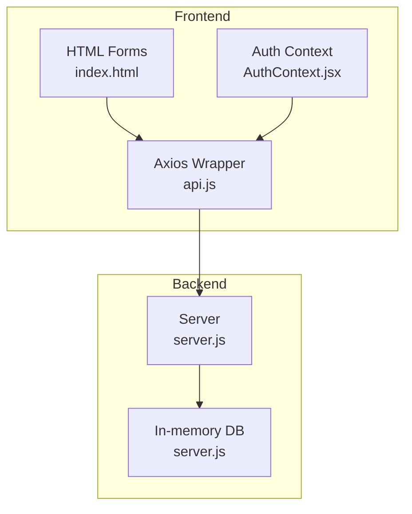
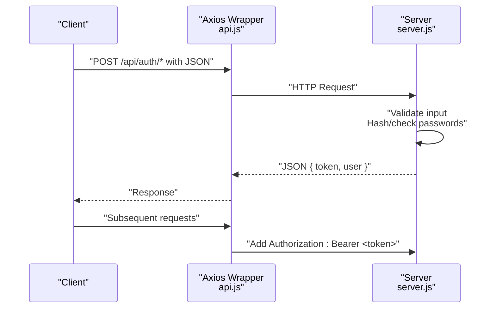
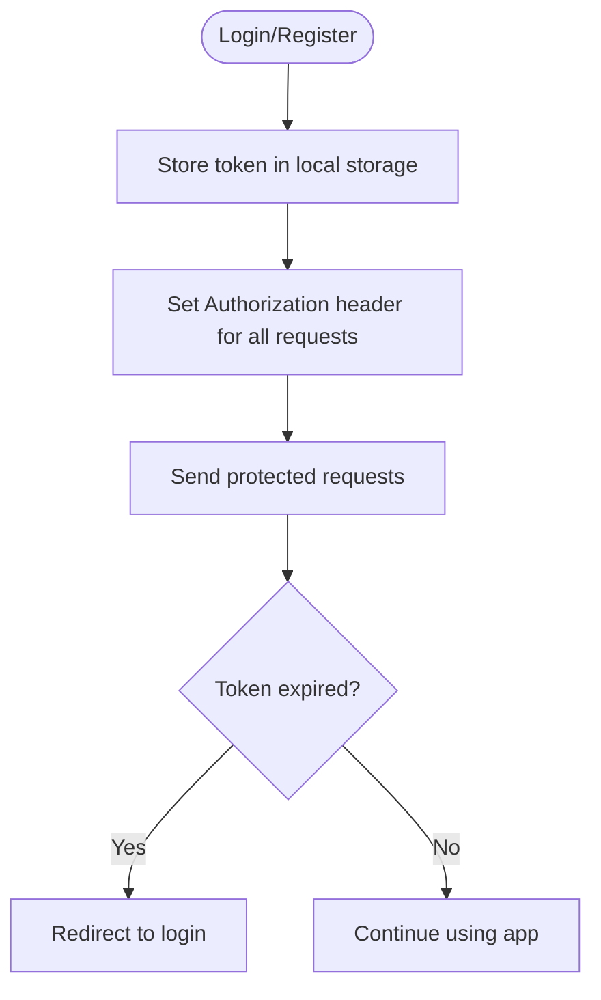
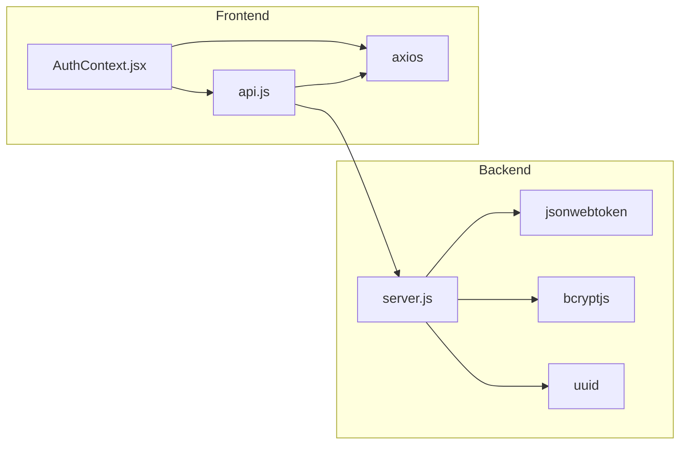

# Authentication Endpoints

<cite>
**Referenced Files in This Document**
- [server.js](file://server.js)
- [api.js](file://api.js)
- [AuthContext.jsx](file://AuthContext.jsx)
- [index.html](file://index.html)
- [package.json](file://package.json)
</cite>

## Table of Contents
1. [Introduction](#introduction)
2. [Project Structure](#project-structure)
3. [Core Components](#core-components)
4. [Architecture Overview](#architecture-overview)
5. [Detailed Component Analysis](#detailed-component-analysis)
6. [Dependency Analysis](#dependency-analysis)
7. [Performance Considerations](#performance-considerations)
8. [Troubleshooting Guide](#troubleshooting-guide)
9. [Conclusion](#conclusion)

## Introduction
This document provides comprehensive API documentation for authentication endpoints used by patients, doctors, and administrators. It covers HTTP methods, URL patterns, request/response schemas, validation rules, error responses, and JWT token behavior. It also includes client-side integration guidance for storing and sending JWT tokens in headers.

## Project Structure
The authentication endpoints are implemented in the backend server and consumed by the frontend via an Axios wrapper. The frontend stores tokens in local storage and attaches Authorization headers automatically.

**Diagram sources**
- [server.js](file://server.js#L1-L390)
- [api.js](file://api.js#L1-L44)
- [AuthContext.jsx](file://AuthContext.jsx#L1-L41)
- [index.html](file://index.html#L129-L249)

**Section sources**
- [server.js](file://server.js#L1-L390)
- [api.js](file://api.js#L1-L44)
- [AuthContext.jsx](file://AuthContext.jsx#L1-L41)
- [index.html](file://index.html#L129-L249)

## Core Components
- Patient Registration: POST /api/auth/register
- Patient Login: POST /api/auth/login
- Doctor Login: POST /api/auth/doctor-login
- Admin Login: POST /api/auth/admin-login

All endpoints accept JSON payloads and return JSON responses. JWT tokens are signed with a 7-day expiration.

**Section sources**
- [server.js](file://server.js#L68-L110)

## Architecture Overview
The authentication flow uses bearer tokens. On successful login or registration, the backend responds with a JWT containing user identity and role. The frontend stores the token and sends it on subsequent requests.

**Diagram sources**
- [api.js](file://api.js#L1-L44)
- [server.js](file://server.js#L49-L62)
- [server.js](file://server.js#L68-L110)

## Detailed Component Analysis

### Patient Registration
- Method: POST
- URL: /api/auth/register
- Purpose: Create a new patient account and return a JWT

Request payload
- name: string, required
- email: string, required
- phone: string, required
- age: number, required
- password: string, required (min length enforced by bcrypt hashing)

Validation rules
- All fields required
- Email must be unique (duplicate email returns conflict)

Error responses
- 400 Bad Request: Missing fields
- 409 Conflict: Email already registered

Success response
- token: string (JWT, expires in 7 days)
- user: object with id, name, email, phone, age, role

Example request
- POST /api/auth/register
- Content-Type: application/json
- Body: {"name":"Ahmed","email":"ahmed@example.com","phone":"+92...","age":30,"password":"securePass"}

Example success response
- 200 OK
- Body: {"token":"<JWT>","user":{"id":"<uuid>","name":"Ahmed","email":"ahmed@example.com","phone":"+92...","age":30,"role":"patient"}}

Security considerations
- Passwords are hashed before storage
- Token expires in 7 days

**Section sources**
- [server.js](file://server.js#L68-L80)

### Patient Login
- Method: POST
- URL: /api/auth/login
- Purpose: Authenticate an existing patient and return a JWT

Request payload
- email: string, required
- password: string, required

Validation rules
- Credentials must match stored record

Error responses
- 401 Unauthorized: Invalid email or password

Success response
- token: string (JWT, expires in 7 days)
- user: object with id, name, email, phone, age, role

Example request
- POST /api/auth/login
- Content-Type: application/json
- Body: {"email":"ahmed@example.com","password":"securePass"}

Example success response
- 200 OK
- Body: {"token":"<JWT>","user":{"id":"<uuid>","name":"Ahmed","email":"ahmed@example.com","phone":"+92...","age":30,"role":"patient"}}

Security considerations
- Password comparison uses bcrypt
- Token expires in 7 days

**Section sources**
- [server.js](file://server.js#L82-L90)

### Doctor Login
- Method: POST
- URL: /api/auth/doctor-login
- Purpose: Authenticate a doctor and return a JWT

Request payload
- email: string, required
- password: string, required

Validation rules
- Credentials must match stored record

Error responses
- 401 Unauthorized: Invalid credentials

Success response
- token: string (JWT, expires in 7 days)
- user: object with id, name, email, specialization, role

Example request
- POST /api/auth/doctor-login
- Content-Type: application/json
- Body: {"email":"sarah@medibook.com","password":"doctor123"}

Example success response
- 200 OK
- Body: {"token":"<JWT>","user":{"id":"d1","name":"Dr. Sarah Ahmed","email":"sarah@medibook.com","specialization":"Cardiologist","role":"doctor"}}

Security considerations
- Password comparison uses bcrypt
- Token expires in 7 days

**Section sources**
- [server.js](file://server.js#L92-L100)

### Admin Login
- Method: POST
- URL: /api/auth/admin-login
- Purpose: Authenticate an administrator and return a JWT

Request payload
- username: string, required
- password: string, required

Validation rules
- Credentials must match stored record

Error responses
- 401 Unauthorized: Invalid admin credentials

Success response
- token: string (JWT, expires in 7 days)
- user: object with id, name, role

Example request
- POST /api/auth/admin-login
- Content-Type: application/json
- Body: {"username":"admin","password":"admin123"}

Example success response
- 200 OK
- Body: {"token":"<JWT>","user":{"id":"a1","name":"Administrator","role":"admin"}}

Security considerations
- Password comparison uses bcrypt
- Token expires in 7 days

**Section sources**
- [server.js](file://server.js#L102-L110)

### JWT Token Behavior
- Signing algorithm and secret: configured via environment variable (default embedded in server)
- Expiration: 7 days
- Payload claims: id, role, name (plus additional fields per user type)
- Client storage: local storage
- Header: Authorization: Bearer <token>

Client-side integration
- Axios defaults Authorization header when a token exists
- Frontend persists token and user data in local storage
- Logout clears persisted token and user

**Diagram sources**
- [AuthContext.jsx](file://AuthContext.jsx#L11-L14)
- [AuthContext.jsx](file://AuthContext.jsx#L21-L31)
- [server.js](file://server.js#L78-L78)
- [server.js](file://server.js#L88-L88)
- [server.js](file://server.js#L98-L98)
- [server.js](file://server.js#L108-L108)

**Section sources**
- [AuthContext.jsx](file://AuthContext.jsx#L1-L41)
- [server.js](file://server.js#L19-L19)
- [server.js](file://server.js#L78-L78)
- [server.js](file://server.js#L88-L88)
- [server.js](file://server.js#L98-L98)
- [server.js](file://server.js#L108-L108)

## Dependency Analysis
- Backend depends on:
  - jsonwebtoken for signing tokens
  - bcryptjs for password hashing/comparison
  - uuid for generating IDs
- Frontend depends on:
  - axios for HTTP requests
  - local storage for token persistence
  - react-router for navigation

**Diagram sources**
- [package.json](file://package.json#L14-L22)
- [server.js](file://server.js#L5-L9)
- [api.js](file://api.js#L1-L1)
- [AuthContext.jsx](file://AuthContext.jsx#L1-L3)

**Section sources**
- [package.json](file://package.json#L1-L24)
- [server.js](file://server.js#L5-L9)
- [api.js](file://api.js#L1-L1)
- [AuthContext.jsx](file://AuthContext.jsx#L1-L3)

## Performance Considerations
- Token signing and verification are lightweight operations
- Password hashing occurs during registration and login; consider rate limiting for brute-force protection
- In-memory database is suitable for development; replace with persistent storage for production

## Troubleshooting Guide
Common errors and resolutions
- 400 Bad Request: Ensure all required fields are present in the request body
- 401 Unauthorized: Verify credentials and token validity; check Authorization header format
- 409 Conflict (registration): Use a different email address
- 403 Forbidden: Access denied for the requested role; ensure token role matches route requirements

Client-side checks
- Confirm Authorization header is set when a token exists
- Clear local storage on logout to avoid stale tokens
- Verify base URL points to the backend API

**Section sources**
- [server.js](file://server.js#L68-L110)
- [server.js](file://server.js#L49-L62)
- [AuthContext.jsx](file://AuthContext.jsx#L11-L14)
- [AuthContext.jsx](file://AuthContext.jsx#L27-L31)

## Conclusion
The authentication system provides secure, role-based access with short-lived JWT tokens. The backend enforces strict validation and returns consistent JSON responses. The frontend integrates seamlessly by persisting tokens and attaching Authorization headers automatically.