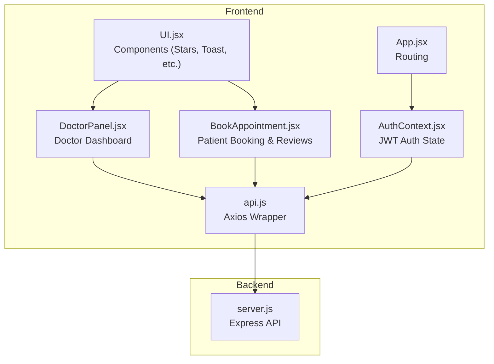
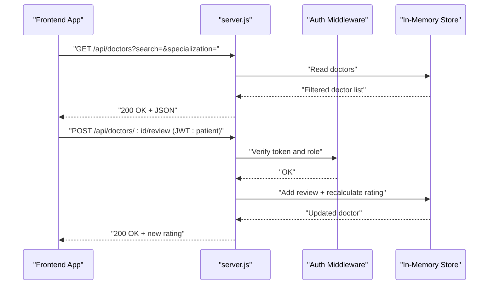
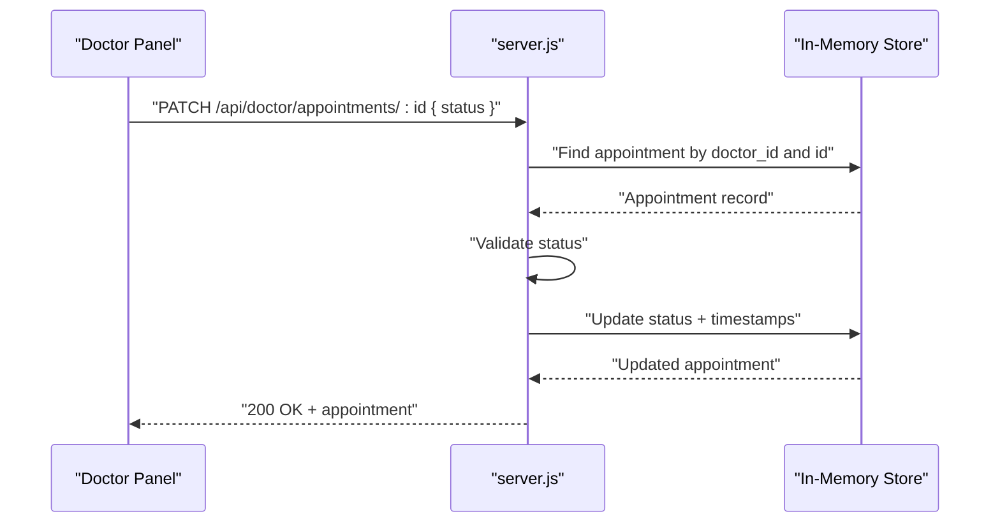
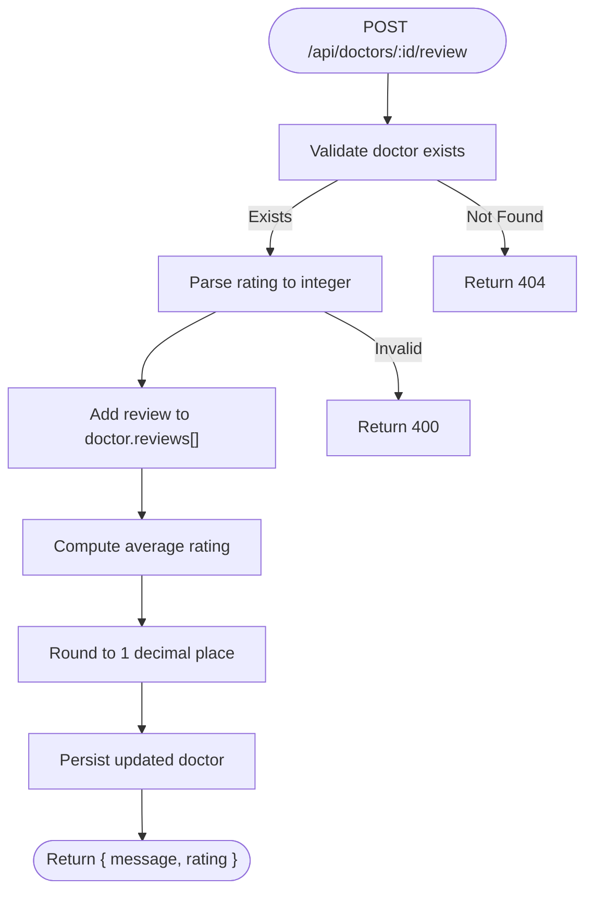
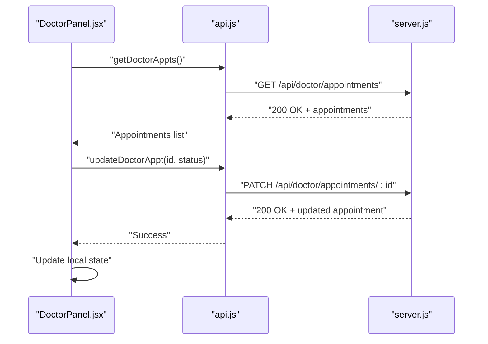
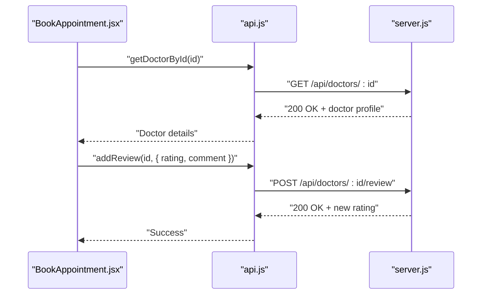
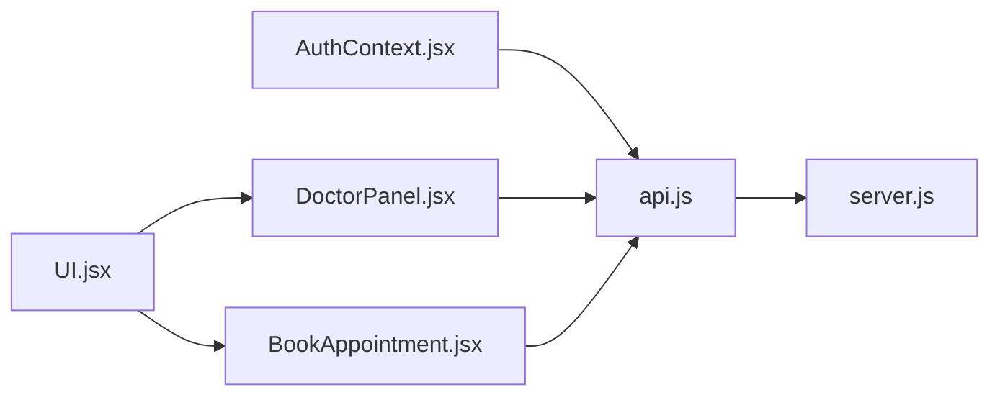

# Doctor Management Endpoints

<cite>
**Referenced Files in This Document**
- [server.js](file://server.js)
- [api.js](file://api.js)
- [AuthContext.jsx](file://AuthContext.jsx)
- [DoctorPanel.jsx](file://DoctorPanel.jsx)
- [BookAppointment.jsx](file://BookAppointment.jsx)
- [UI.jsx](file://UI.jsx)
- [App.jsx](file://App.jsx)
- [README.md](file://README.md)
- [package.json](file://package.json)
</cite>

## Table of Contents
1. [Introduction](#introduction)
2. [Project Structure](#project-structure)
3. [Core Components](#core-components)
4. [Architecture Overview](#architecture-overview)
5. [Detailed Component Analysis](#detailed-component-analysis)
6. [Dependency Analysis](#dependency-analysis)
7. [Performance Considerations](#performance-considerations)
8. [Troubleshooting Guide](#troubleshooting-guide)
9. [Conclusion](#conclusion)
10. [Appendices](#appendices)

## Introduction
This document provides comprehensive API documentation for doctor management endpoints in the MediBook system. It covers:
- Public doctor listing and filtering
- Individual doctor retrieval
- Doctor-specific appointment management
- Patient review submission and rating calculation
- Authentication requirements (JWT with role-based access)
- Parameter validation rules
- Error handling
- Integration examples for doctor dashboard and patient-doctor interactions

The backend is implemented with Node.js and Express, while the frontend is a React application that consumes these APIs.

## Project Structure
The project follows a classic full-stack layout with a separate backend (server.js) and a frontend (React) that communicates via RESTful endpoints.

**Diagram sources**
- [server.js](file://server.js#L1-L390)
- [App.jsx](file://App.jsx#L1-L44)
- [AuthContext.jsx](file://AuthContext.jsx#L1-L41)
- [api.js](file://api.js#L1-L44)
- [DoctorPanel.jsx](file://DoctorPanel.jsx#L1-L96)
- [BookAppointment.jsx](file://BookAppointment.jsx#L1-L171)
- [UI.jsx](file://UI.jsx#L1-L182)

**Section sources**
- [README.md](file://README.md#L1-L159)
- [package.json](file://package.json#L1-L24)

## Core Components
- Backend API server (server.js): Implements all endpoints, middleware, and in-memory data storage.
- Frontend API wrapper (api.js): Centralized Axios client for all API calls.
- Authentication context (AuthContext.jsx): Manages JWT tokens and sets Authorization headers.
- Doctor panel (DoctorPanel.jsx): Doctor-side dashboard for managing appointments.
- Booking page (BookAppointment.jsx): Patient-facing interface for booking and reviewing doctors.
- UI components (UI.jsx): Shared components like Stars, Toast, ProbBar, StatusBadge.

**Section sources**
- [server.js](file://server.js#L1-L390)
- [api.js](file://api.js#L1-L44)
- [AuthContext.jsx](file://AuthContext.jsx#L1-L41)
- [DoctorPanel.jsx](file://DoctorPanel.jsx#L1-L96)
- [BookAppointment.jsx](file://BookAppointment.jsx#L1-L171)
- [UI.jsx](file://UI.jsx#L1-L182)

## Architecture Overview
The system enforces role-based access control using JWT. Requests to protected endpoints must include a Bearer token in the Authorization header. The backend exposes:
- Public endpoints for doctor listings and details
- Doctor-only endpoints for appointment management
- Patient-only endpoints for reviews and booking
- Admin endpoints for system-wide management

**Diagram sources**
- [server.js](file://server.js#L117-L164)
- [api.js](file://api.js#L11-L14)
- [AuthContext.jsx](file://AuthContext.jsx#L21-L25)

## Detailed Component Analysis

### Public Doctor Listing: GET /api/doctors
- Purpose: Retrieve a filtered list of doctors.
- Query Parameters:
  - search: Free-text search across name and specialization.
  - specialization: Exact match filter by doctor specialization.
- Response: Array of doctor objects without sensitive fields.
- Validation:
  - No body required.
  - Filters are applied server-side; empty filters return all approved doctors.
- Example Request:
  - GET /api/doctors?search=cardio&specialization=Cardiologist
- Example Response:
  - 200 OK with an array of doctor profiles.

Notes:
- The in-memory store includes a flag indicating whether a doctor is approved. The endpoint returns only approved doctors.

**Section sources**
- [server.js](file://server.js#L117-L123)

### Individual Doctor Details: GET /api/doctors/:id
- Purpose: Fetch a single doctor’s profile by ID.
- Path Parameters:
  - id: Doctor identifier.
- Response: Doctor object without sensitive fields.
- Validation:
  - Returns 404 if doctor not found.
- Example Request:
  - GET /api/doctors/d1
- Example Response:
  - 200 OK with doctor profile.

**Section sources**
- [server.js](file://server.js#L125-L131)

### Doctor-Specific Appointments: GET /api/doctor/appointments
- Purpose: Retrieve all appointments assigned to the logged-in doctor.
- Authentication:
  - Requires JWT with role "doctor".
- Response: Array of appointments with enriched patient details.
- Validation:
  - Returns 401 if missing/expired token.
  - Returns 403 if role is not "doctor".
- Example Request:
  - Authorization: Bearer <jwt>
  - GET /api/doctor/appointments
- Example Response:
  - 200 OK with appointment list.

**Section sources**
- [server.js](file://server.js#L133-L142)
- [AuthContext.jsx](file://AuthContext.jsx#L11-L14)

### Update Appointment Status: PATCH /api/doctor/appointments/:id
- Purpose: Approve or reject a pending appointment.
- Path Parameters:
  - id: Appointment identifier.
- Request Body:
  - status: Must be "approved" or "cancelled".
- Authentication:
  - Requires JWT with role "doctor".
- Validation:
  - Returns 404 if appointment not found for the doctor.
  - Returns 400 if status is invalid.
- Example Request:
  - Authorization: Bearer <jwt>
  - PATCH /api/doctor/appointments/<id> with { status: "approved" }
- Example Response:
  - 200 OK with updated appointment.

**Diagram sources**
- [server.js](file://server.js#L144-L153)
- [DoctorPanel.jsx](file://DoctorPanel.jsx#L22-L28)

**Section sources**
- [server.js](file://server.js#L144-L153)
- [DoctorPanel.jsx](file://DoctorPanel.jsx#L22-L28)

### Submit Patient Review: POST /api/doctors/:id/review
- Purpose: Allow a patient to submit a review for a doctor.
- Path Parameters:
  - id: Doctor identifier.
- Request Body:
  - rating: Integer rating (mapped to stars).
  - comment: Optional textual review.
- Authentication:
  - Requires JWT with role "patient".
- Validation:
  - Returns 404 if doctor not found.
  - Returns 400 if rating is invalid (parsed to integer).
- Rating Calculation:
  - After adding the review, the average rating is recalculated and rounded to one decimal place.
- Example Request:
  - Authorization: Bearer <jwt>
  - POST /api/doctors/d1/review with { rating: 5, comment: "Great doctor!" }
- Example Response:
  - 200 OK with { message: "...", rating: 4.8 }

**Diagram sources**
- [server.js](file://server.js#L155-L164)

**Section sources**
- [server.js](file://server.js#L155-L164)
- [BookAppointment.jsx](file://BookAppointment.jsx#L62-L69)

### Frontend Integration Examples

#### Doctor Dashboard Workflow
- The doctor panel fetches appointments and allows approving or rejecting pending requests.
- It updates the UI state locally upon successful PATCH requests.

**Diagram sources**
- [DoctorPanel.jsx](file://DoctorPanel.jsx#L15-L31)
- [api.js](file://api.js#L22-L23)
- [server.js](file://server.js#L133-L153)

**Section sources**
- [DoctorPanel.jsx](file://DoctorPanel.jsx#L1-L96)
- [api.js](file://api.js#L22-L23)
- [server.js](file://server.js#L133-L153)

#### Patient Booking and Review Submission
- Patients can view a doctor’s profile, select a time slot, and submit a review.
- The frontend integrates with UI components for star ratings and probability bars.

**Diagram sources**
- [BookAppointment.jsx](file://BookAppointment.jsx#L28-L32)
- [BookAppointment.jsx](file://BookAppointment.jsx#L62-L69)
- [api.js](file://api.js#L12-L14)
- [server.js](file://server.js#L155-L164)

**Section sources**
- [BookAppointment.jsx](file://BookAppointment.jsx#L1-L171)
- [api.js](file://api.js#L11-L14)
- [server.js](file://server.js#L155-L164)

## Dependency Analysis
- Authentication middleware enforces role checks and attaches user claims to requests.
- Frontend uses a shared Axios instance configured with base URL "/api" and automatically injects Authorization headers when a token exists.
- UI components are reused across pages for consistent UX.

**Diagram sources**
- [AuthContext.jsx](file://AuthContext.jsx#L11-L14)
- [api.js](file://api.js#L1-L4)
- [server.js](file://server.js#L49-L62)
- [DoctorPanel.jsx](file://DoctorPanel.jsx#L1-L96)
- [BookAppointment.jsx](file://BookAppointment.jsx#L1-L171)
- [UI.jsx](file://UI.jsx#L1-L182)

**Section sources**
- [AuthContext.jsx](file://AuthContext.jsx#L1-L41)
- [api.js](file://api.js#L1-L44)
- [server.js](file://server.js#L49-L62)

## Performance Considerations
- In-memory storage is suitable for development/demo but not for production. Consider migrating to a relational database (e.g., MySQL) for scalability and persistence.
- Appointment status updates and review submissions are O(n) operations relative to stored records. For high traffic, consider indexing and caching strategies.
- The frontend performs client-side filtering for doctor lists; for large datasets, offload filtering to the backend.

[No sources needed since this section provides general guidance]

## Troubleshooting Guide
Common errors and resolutions:
- Missing or invalid JWT:
  - Symptom: 401 Unauthorized or "Invalid or expired token".
  - Resolution: Ensure Authorization header is present and valid; re-authenticate if needed.
- Access denied:
  - Symptom: 403 Forbidden when accessing role-restricted endpoints.
  - Resolution: Verify the token’s role matches the endpoint requirement.
- Not found:
  - Symptom: 404 for doctor/appointment not found.
  - Resolution: Confirm IDs and filters; ensure the resource exists.
- Invalid status:
  - Symptom: 400 Bad Request when updating appointment status.
  - Resolution: Use only "approved" or "cancelled".

**Section sources**
- [server.js](file://server.js#L49-L62)
- [server.js](file://server.js#L144-L153)

## Conclusion
The doctor management endpoints provide a clean, role-based API surface for listing doctors, retrieving details, managing appointments, and collecting patient reviews. The frontend integrates seamlessly with these endpoints, offering intuitive dashboards for doctors and patients. For production, replace in-memory storage with a persistent database and enhance security and monitoring.

[No sources needed since this section summarizes without analyzing specific files]

## Appendices

### API Reference Summary

- GET /api/doctors
  - Query: search, specialization
  - Response: Array of doctor profiles
  - Auth: None

- GET /api/doctors/:id
  - Path: id
  - Response: Doctor profile
  - Auth: None

- GET /api/doctor/appointments
  - Response: Appointments assigned to the doctor
  - Auth: JWT (doctor)

- PATCH /api/doctor/appointments/:id
  - Path: id
  - Body: { status: "approved" | "cancelled" }
  - Response: Updated appointment
  - Auth: JWT (doctor)

- POST /api/doctors/:id/review
  - Path: id
  - Body: { rating: number, comment: string }
  - Response: { message, rating }
  - Auth: JWT (patient)

**Section sources**
- [server.js](file://server.js#L117-L164)

### Authentication and Authorization
- Token placement: Authorization: Bearer <jwt>
- Roles: patient, doctor, admin
- Middleware: authMiddleware(role) validates token and role

**Section sources**
- [server.js](file://server.js#L49-L62)
- [AuthContext.jsx](file://AuthContext.jsx#L11-L14)

### Frontend Integration Notes
- Axios base URL: /api
- Auth headers are set automatically when a token exists
- UI components support star ratings, toasts, and probability indicators

**Section sources**
- [api.js](file://api.js#L1-L4)
- [AuthContext.jsx](file://AuthContext.jsx#L11-L14)
- [UI.jsx](file://UI.jsx#L33-L58)