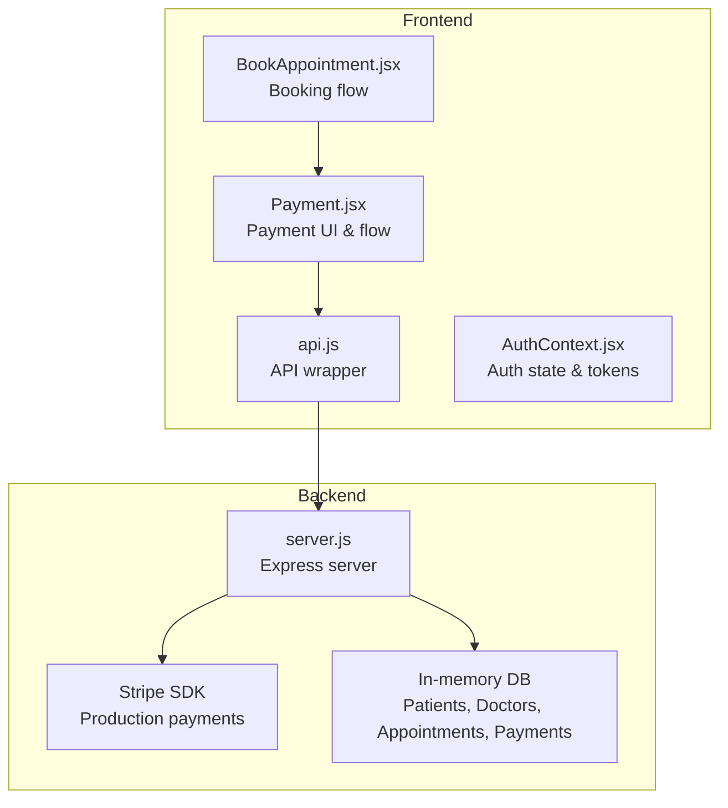
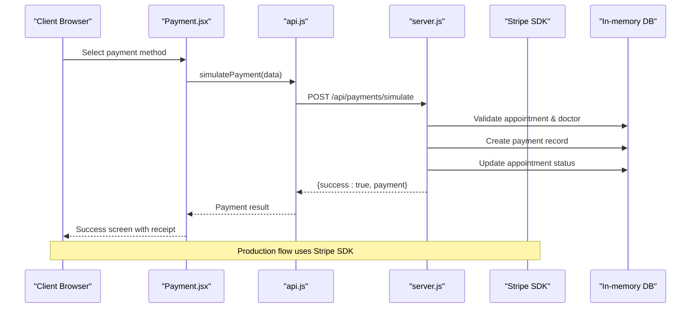
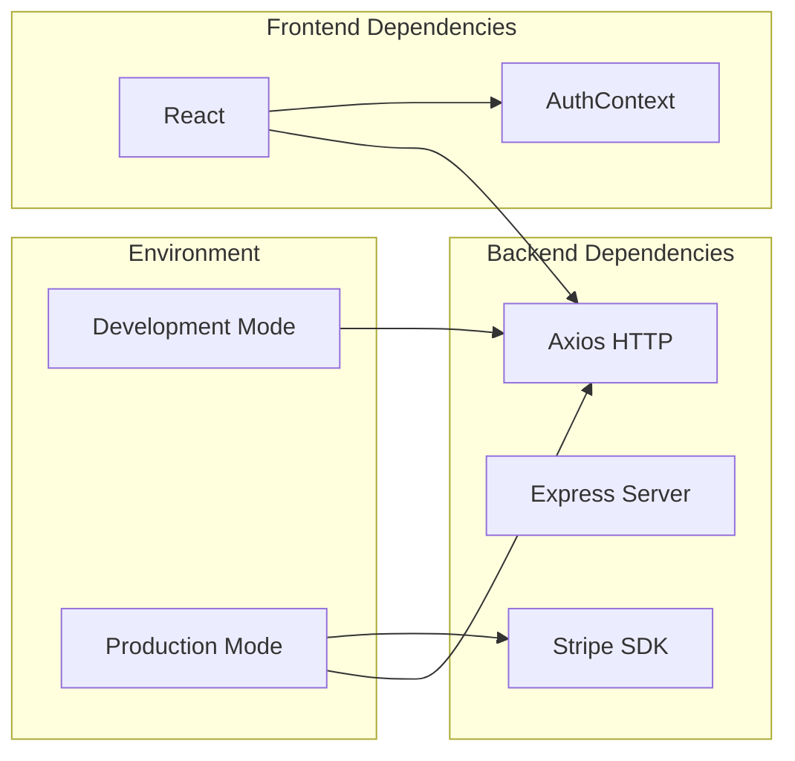

# Payment Processing Endpoints

<cite>
**Referenced Files in This Document**
- [server.js](file://server.js)
- [Payment.jsx](file://Payment.jsx)
- [api.js](file://api.js)
- [package.json](file://package.json)
- [AuthContext.jsx](file://AuthContext.jsx)
- [BookAppointment.jsx](file://BookAppointment.jsx)
- [index.html](file://index.html)
</cite>

## Table of Contents
1. [Introduction](#introduction)
2. [Project Structure](#project-structure)
3. [Core Components](#core-components)
4. [Architecture Overview](#architecture-overview)
5. [Detailed Component Analysis](#detailed-component-analysis)
6. [Dependency Analysis](#dependency-analysis)
7. [Performance Considerations](#performance-considerations)
8. [Troubleshooting Guide](#troubleshooting-guide)
9. [Conclusion](#conclusion)

## Introduction
This document provides comprehensive API documentation for the payment processing endpoints in the MediBook application. It covers Stripe payment intent creation, payment simulation for development/demo environments, receipt retrieval, and consultation fee lookup. The documentation includes endpoint specifications, request/response schemas, error handling, Stripe integration requirements, environment configuration, and client-side integration patterns.

## Project Structure
The payment system spans both backend (Node.js/Express) and frontend (React) components:
- Backend: Express server with payment routes, middleware, and in-memory database
- Frontend: React components for payment flow, booking integration, and API wrappers
- Dependencies: Stripe SDK for production payments, axios for HTTP requests

**Diagram sources**
- [server.js](file://server.js#L1-L390)
- [Payment.jsx](file://Payment.jsx#L1-L350)
- [api.js](file://api.js#L1-L44)
- [AuthContext.jsx](file://AuthContext.jsx#L1-L41)
- [BookAppointment.jsx](file://BookAppointment.jsx#L1-L171)

**Section sources**
- [server.js](file://server.js#L1-L390)
- [Payment.jsx](file://Payment.jsx#L1-L350)
- [api.js](file://api.js#L1-L44)
- [package.json](file://package.json#L1-L24)

## Core Components
The payment system consists of four primary endpoints and supporting frontend components:

### Backend Payment Routes
- POST /api/payments/create-intent: Creates Stripe payment intents for production payments
- POST /api/payments/simulate: Simulates payments for development/demo mode
- GET /api/payments/:appointment_id: Retrieves payment receipts
- GET /api/payments/fee/:doctor_id: Looks up consultation fees by doctor

### Frontend Payment Flow
- Payment.jsx: Handles payment method selection, validation, and submission
- api.js: Exposes payment-related API functions
- AuthContext.jsx: Manages authentication state and JWT tokens
- BookAppointment.jsx: Integrates payment flow after successful booking

**Section sources**
- [server.js](file://server.js#L283-L377)
- [Payment.jsx](file://Payment.jsx#L23-L350)
- [api.js](file://api.js#L39-L44)
- [AuthContext.jsx](file://AuthContext.jsx#L1-L41)
- [BookAppointment.jsx](file://BookAppointment.jsx#L39-L60)

## Architecture Overview
The payment architecture supports both production Stripe payments and development simulation modes:

**Diagram sources**
- [Payment.jsx](file://Payment.jsx#L62-L98)
- [api.js](file://api.js#L41-L42)
- [server.js](file://server.js#L297-L353)

## Detailed Component Analysis

### Stripe Payment Intent Creation (Production)
The create-intent endpoint handles production Stripe payments:

#### Endpoint Specification
- Method: POST
- Path: /api/payments/create-intent
- Authentication: Required (patient role)
- Request Body:
  - appointment_id: string (UUID)
  - doctor_id: string (UUID)
- Response:
  - clientSecret: string (Stripe payment intent secret)
  - amount: number (in paisa/cents)
  - doctor: string (doctor name)
  - specialization: string (doctor specialization)

#### Implementation Details
- Validates patient ownership of appointment
- Calculates amount based on doctor specialization fee
- Creates Stripe payment intent with metadata
- Returns clientSecret for frontend confirmation

#### Error Handling
- 404: Appointment or doctor not found
- 503: Stripe not configured
- 500: Stripe API errors

**Section sources**
- [server.js](file://server.js#L297-L316)

### Payment Simulation (Development/Demo)
The simulate endpoint provides development-friendly payment processing:

#### Endpoint Specification
- Method: POST
- Path: /api/payments/simulate
- Authentication: Required (patient role)
- Request Body:
  - appointment_id: string (UUID)
  - doctor_id: string (UUID)
  - method: string (card/easypaisa/jazzcash/bank)
  - card_number: string (optional)
  - card_name: string (optional)
  - expiry: string (optional)
  - cvv: string (optional)
  - mobile_number: string (optional)
  - account_number: string (optional)

#### Response Schema
- success: boolean
- payment:
  - payment_id: string (UUID)
  - appointment_id: string (UUID)
  - patient_id: string (UUID)
  - doctor_id: string (UUID)
  - amount: number
  - currency: string ("PKR")
  - method: string
  - status: string ("paid")
  - transaction_ref: string
  - paid_at: string (ISO timestamp)

#### Validation Rules
- Card method requires: card_number (≥16 digits), card_name, expiry, cvv
- Mobile wallet methods require 10-digit mobile number
- Bank transfers require account/transaction reference

#### Automatic Approval
- Payment simulation automatically approves the associated appointment
- Sets appointment status to "approved"
- Links payment_id to appointment

**Section sources**
- [server.js](file://server.js#L318-L353)

### Receipt Retrieval
The receipt endpoint provides payment confirmation details:

#### Endpoint Specification
- Method: GET
- Path: /api/payments/:appointment_id
- Authentication: Required (patient role)
- Path Parameter: appointment_id (UUID)

#### Response Schema
Same as payment object from simulation endpoint, with additional fields:
- patient_name: string (from appointment record)
- doctor_name: string (from doctor record)

#### Error Handling
- 404: Payment not found for appointment

**Section sources**
- [server.js](file://server.js#L355-L360)

### Consultation Fee Lookup
The fee endpoint retrieves consultation costs by doctor:

#### Endpoint Specification
- Method: GET
- Path: /api/payments/fee/:doctor_id
- Authentication: Not required
- Path Parameter: doctor_id (UUID)

#### Response Schema
- fee: number (PKR)
- currency: string ("PKR")
- specialization: string

#### Fee Structure
- Cardiologist: 2500 PKR
- Neurologist: 2200 PKR
- Dermatologist: 1500 PKR
- Orthopedic: 2000 PKR
- Pediatrician: 1200 PKR
- General Physician: 800 PKR

**Section sources**
- [server.js](file://server.js#L287-L295)
- [server.js](file://server.js#L372-L377)

### Frontend Integration Patterns
The React frontend provides a complete payment experience:

#### Payment Flow States
- Method selection: Choose payment method (card, easypaisa, jazzcash, bank)
- Details collection: Input required fields based on selected method
- Processing: Simulated 2.2-second delay
- Success: Display receipt with transaction details

#### Client-Side Validation
- Card: 16-digit number, valid expiry (MM/YY), 3+ digit CVV
- Mobile wallets: 10-digit mobile number
- Bank transfers: 8+ digit account/transaction reference

#### Receipt Display
- Transaction reference
- Amount paid
- Doctor name and specialization
- Appointment date/time
- Payment method
- Status indicator

**Section sources**
- [Payment.jsx](file://Payment.jsx#L23-L350)
- [api.js](file://api.js#L39-L44)

## Dependency Analysis
The payment system has clear separation between production and development modes:

**Diagram sources**
- [server.js](file://server.js#L11-L15)
- [package.json](file://package.json#L14-L22)

### Key Dependencies
- Stripe SDK: Production payment processing
- Axios: HTTP client for API communication
- UUID: Unique identifier generation
- JWT: Authentication tokens
- Bcrypt: Password hashing

**Section sources**
- [package.json](file://package.json#L14-L22)
- [server.js](file://server.js#L11-L15)

## Performance Considerations
- Payment simulation is synchronous and fast (≤2.2 seconds)
- Stripe integration adds network latency but provides robust payment processing
- Frontend validation reduces server load by catching invalid inputs early
- In-memory database operations are O(1) for lookups and updates

## Troubleshooting Guide

### Common Issues and Solutions

#### Stripe Configuration Errors
- **Problem**: "Payment service unavailable. Add your Stripe key."
- **Cause**: STRIPE_SECRET_KEY environment variable not set
- **Solution**: Set STRIPE_SECRET_KEY=sk_test_your_key in environment

#### Authentication Failures
- **Problem**: 401 Unauthorized on payment endpoints
- **Cause**: Missing or invalid JWT token
- **Solution**: Ensure user is logged in and token is present in Authorization header

#### Payment Validation Errors
- **Problem**: 400 Bad Request for invalid card details
- **Cause**: Missing or invalid payment fields
- **Solution**: Verify card number (≥16 digits), expiry format (MM/YY), CVV length

#### Appointment Not Found
- **Problem**: 404 Not Found for payment endpoints
- **Cause**: Appointment doesn't belong to current patient
- **Solution**: Ensure appointment_id belongs to authenticated patient

#### Payment Simulation Limitations
- **Problem**: Payment simulation doesn't support all payment methods
- **Cause**: Only basic validation implemented
- **Solution**: Use Stripe integration for full payment method support

**Section sources**
- [server.js](file://server.js#L299-L315)
- [server.js](file://server.js#L327-L330)
- [server.js](file://server.js#L322-L324)

## Conclusion
The MediBook payment system provides a robust foundation for both development and production payment processing. The architecture cleanly separates production Stripe integration from development simulation, enabling rapid prototyping while maintaining production-ready capabilities. The frontend offers a comprehensive payment experience with proper validation, error handling, and receipt generation. The modular design allows for easy extension to additional payment methods and enhanced features.

Key strengths include:
- Clear separation between development and production modes
- Comprehensive frontend validation and user experience
- Automatic appointment approval upon successful payment
- Flexible consultation fee structure by specialization
- Complete receipt generation and retrieval

Future enhancements could include:
- Multi-currency support
- Additional payment method integrations
- Enhanced error reporting and logging
- Payment retry mechanisms
- Webhook integration for payment status updates