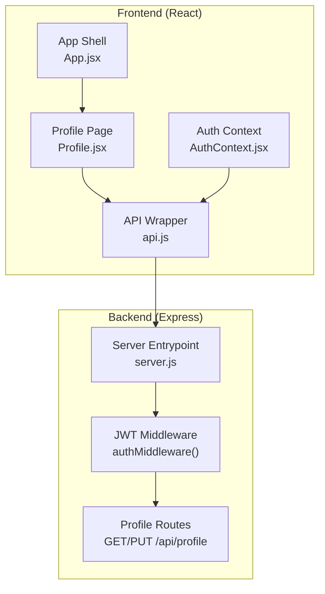
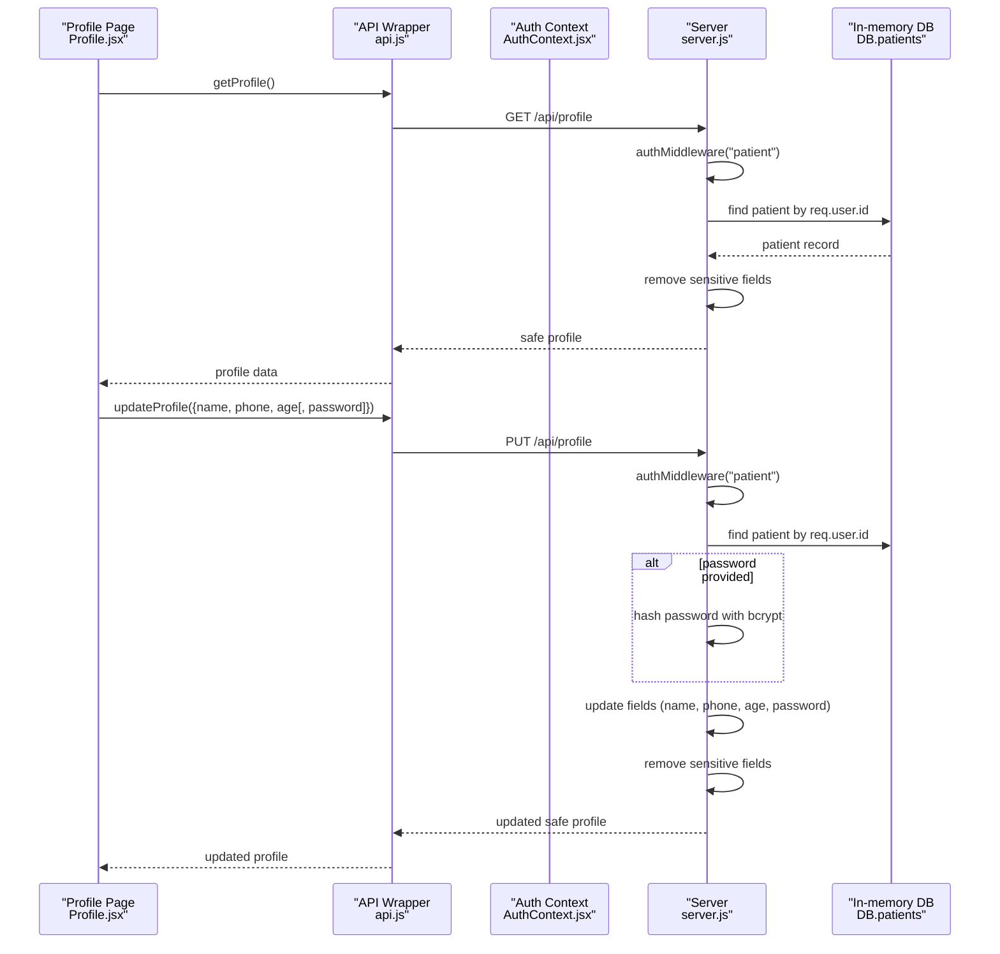
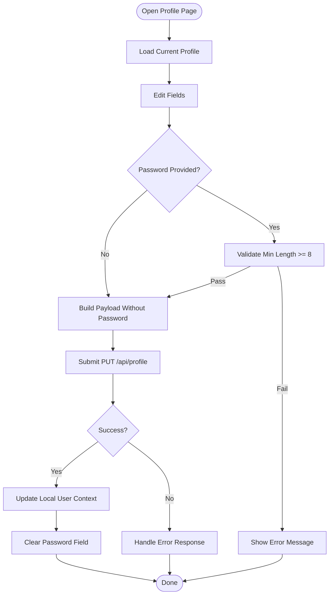
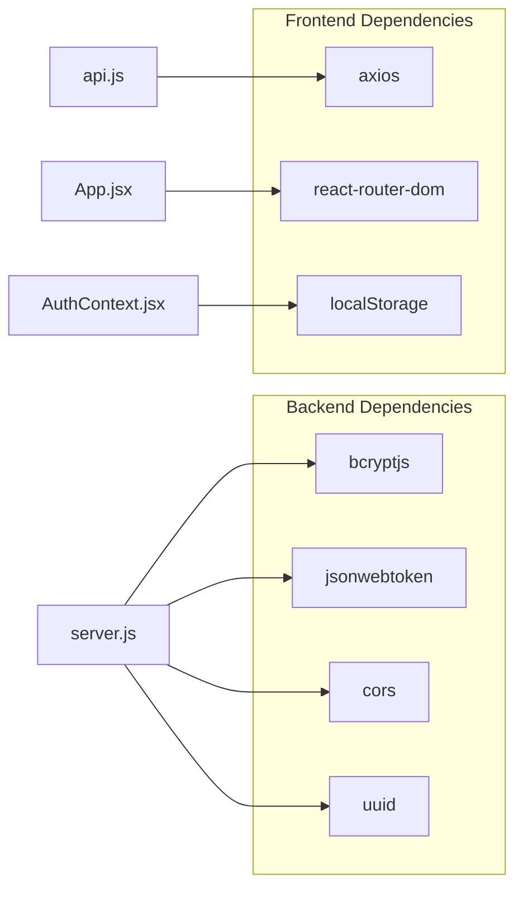

# Profile Management Endpoints

<cite>
**Referenced Files in This Document**
- [server.js](file://server.js)
- [api.js](file://api.js)
- [Profile.jsx](file://Profile.jsx)
- [AuthContext.jsx](file://AuthContext.jsx)
- [App.jsx](file://App.jsx)
- [package.json](file://package.json)
</cite>

## Table of Contents
1. [Introduction](#introduction)
2. [Project Structure](#project-structure)
3. [Core Components](#core-components)
4. [Architecture Overview](#architecture-overview)
5. [Detailed Component Analysis](#detailed-component-analysis)
6. [Dependency Analysis](#dependency-analysis)
7. [Performance Considerations](#performance-considerations)
8. [Troubleshooting Guide](#troubleshooting-guide)
9. [Conclusion](#conclusion)

## Introduction
This document provides comprehensive API documentation for patient profile management endpoints. It covers:
- GET /api/profile for retrieving a patient’s profile with sensitive data excluded
- PUT /api/profile for updating profile details including name, phone, age, and password
- Authentication requirements (JWT with patient role)
- Request validation rules
- Password hashing using bcrypt
- Response schemas
- Examples of profile update workflows and password change procedures
- Data sanitization practices
- Error handling for duplicate emails or invalid data
- Integration examples for patient settings management and account maintenance

## Project Structure
The backend is implemented as a Node.js/Express server with in-memory storage. The frontend is a React application that consumes the backend APIs via an Axios wrapper. Authentication is handled centrally and propagated to API requests.

**Diagram sources**
- [Profile.jsx](file://Profile.jsx#L1-L97)
- [AuthContext.jsx](file://AuthContext.jsx#L1-L41)
- [api.js](file://api.js#L1-L44)
- [App.jsx](file://App.jsx#L1-L44)
- [server.js](file://server.js#L49-L62)
- [server.js](file://server.js#L222-L239)

**Section sources**
- [server.js](file://server.js#L1-L390)
- [api.js](file://api.js#L1-L44)
- [Profile.jsx](file://Profile.jsx#L1-L97)
- [AuthContext.jsx](file://AuthContext.jsx#L1-L41)
- [App.jsx](file://App.jsx#L1-L44)

## Core Components
- Backend server exposes two patient profile endpoints:
  - GET /api/profile: returns sanitized patient profile (without sensitive fields)
  - PUT /api/profile: updates name, phone, age, and optionally password
- Frontend provides a dedicated profile page that fetches and updates the profile via the API wrapper.
- Authentication middleware enforces JWT-based access with role checks.

Key implementation references:
- Profile routes: [GET /api/profile](file://server.js#L222-L227), [PUT /api/profile](file://server.js#L229-L239)
- JWT middleware: [authMiddleware](file://server.js#L49-L62)
- API wrapper: [getProfile](file://api.js#L26), [updateProfile](file://api.js#L27)
- Frontend profile page: [Profile.jsx](file://Profile.jsx#L1-L97)
- Auth context propagates Authorization header: [AuthContext.jsx](file://AuthContext.jsx#L11-L14)

**Section sources**
- [server.js](file://server.js#L222-L239)
- [server.js](file://server.js#L49-L62)
- [api.js](file://api.js#L25-L28)
- [Profile.jsx](file://Profile.jsx#L1-L97)
- [AuthContext.jsx](file://AuthContext.jsx#L11-L14)

## Architecture Overview
The profile management flow integrates frontend UI, API wrapper, authentication context, and backend routes.

**Diagram sources**
- [Profile.jsx](file://Profile.jsx#L16-L40)
- [api.js](file://api.js#L25-L28)
- [AuthContext.jsx](file://AuthContext.jsx#L11-L14)
- [server.js](file://server.js#L222-L239)

## Detailed Component Analysis

### Authentication and Authorization
- JWT middleware verifies tokens and enforces role-based access:
  - Extracts token from Authorization header
  - Verifies signature using a shared secret
  - Enforces role requirement for protected routes
- Frontend sets Authorization header automatically when a token exists.

References:
- [authMiddleware](file://server.js#L49-L62)
- [Axios defaults Authorization header](file://AuthContext.jsx#L11-L14)

**Section sources**
- [server.js](file://server.js#L49-L62)
- [AuthContext.jsx](file://AuthContext.jsx#L11-L14)

### GET /api/profile
- Purpose: Retrieve the authenticated patient’s profile with sensitive data excluded.
- Authentication: Patient JWT required.
- Response: Safe profile object without sensitive fields.
- Error responses:
  - 401 Unauthorized if no token or invalid/expired token
  - 403 Access denied if role is not patient
  - 404 Not Found if patient record does not exist

Response schema (safe profile):
- id: string
- name: string
- email: string
- phone: string
- age: integer
- role: "patient"

References:
- [GET /api/profile](file://server.js#L222-L227)

**Section sources**
- [server.js](file://server.js#L222-L227)

### PUT /api/profile
- Purpose: Update profile details including name, phone, age, and optionally password.
- Authentication: Patient JWT required.
- Request body fields:
  - name: string (optional)
  - phone: string (optional)
  - age: integer (optional)
  - password: string (optional; min length 8 if provided)
- Behavior:
  - Updates provided fields
  - Hashes password with bcrypt if provided
  - Returns sanitized profile (without sensitive fields)
- Validation rules:
  - If password is provided, it must be at least 8 characters long
  - Age is parsed to integer
- Error responses:
  - 400 Bad Request for invalid data
  - 401 Unauthorized if no token or invalid/expired token
  - 403 Access denied if role is not patient
  - 404 Not Found if patient record does not exist

Response schema (updated safe profile):
- id: string
- name: string
- email: string
- phone: string
- age: integer
- role: "patient"

References:
- [PUT /api/profile](file://server.js#L229-L239)
- [Frontend validation and payload construction](file://Profile.jsx#L25-L40)

**Section sources**
- [server.js](file://server.js#L229-L239)
- [Profile.jsx](file://Profile.jsx#L25-L40)

### Frontend Integration
- Profile page:
  - Loads current profile on mount
  - Allows editing name, age, phone, and optional password
  - Validates password length before sending
  - On success, updates local user context and clears password field
- API wrapper:
  - Provides getProfile and updateProfile helpers
- Auth context:
  - Sets Authorization header for all requests

References:
- [Profile page logic](file://Profile.jsx#L16-L40)
- [API wrapper exports](file://api.js#L25-L28)
- [Auth header propagation](file://AuthContext.jsx#L11-L14)

**Section sources**
- [Profile.jsx](file://Profile.jsx#L16-L40)
- [api.js](file://api.js#L25-L28)
- [AuthContext.jsx](file://AuthContext.jsx#L11-L14)

### Data Sanitization and Security
- Sensitive fields are excluded from responses:
  - Password is removed before returning profile data
- Password hashing:
  - bcrypt is used for hashing passwords during registration and updates
- Token-based access control:
  - authMiddleware enforces patient role for profile endpoints

References:
- [Sanitization in GET /api/profile](file://server.js#L225)
- [Sanitization in PUT /api/profile](file://server.js#L237)
- [bcrypt usage](file://server.js#L75-L75)
- [bcrypt usage](file://server.js#L236-L236)
- [JWT middleware](file://server.js#L49-L62)

**Section sources**
- [server.js](file://server.js#L225)
- [server.js](file://server.js#L237)
- [server.js](file://server.js#L75-L75)
- [server.js](file://server.js#L236-L236)
- [server.js](file://server.js#L49-L62)

### Example Workflows

#### Profile Update Workflow
- Fetch current profile
- Modify fields (name, phone, age)
- Optionally provide new password (min 8 chars)
- Submit update
- On success, update local user context and show success feedback

**Diagram sources**
- [Profile.jsx](file://Profile.jsx#L16-L40)
- [api.js](file://api.js#L25-L28)
- [server.js](file://server.js#L229-L239)

#### Password Change Procedure
- Ensure new password meets minimum length requirement
- Include password in request body
- Server hashes the password before persisting
- Frontend clears the password field after successful update

References:
- [Frontend validation](file://Profile.jsx#L30-L31)
- [Server hashing](file://server.js#L236-L236)

**Section sources**
- [Profile.jsx](file://Profile.jsx#L30-L31)
- [server.js](file://server.js#L236-L236)

## Dependency Analysis
- Backend dependencies:
  - bcryptjs for password hashing
  - jsonwebtoken for JWT signing and verification
  - cors for cross-origin support
  - uuid for generating IDs
- Frontend dependencies:
  - axios for HTTP requests
  - react-router-dom for routing
  - Local storage for persistence of auth state

**Diagram sources**
- [package.json](file://package.json#L14-L22)
- [server.js](file://server.js#L5-L9)
- [api.js](file://api.js#L1-L1)
- [App.jsx](file://App.jsx#L1-L1)
- [AuthContext.jsx](file://AuthContext.jsx#L7-L9)

**Section sources**
- [package.json](file://package.json#L14-L22)
- [server.js](file://server.js#L5-L9)
- [api.js](file://api.js#L1-L1)
- [App.jsx](file://App.jsx#L1-L1)
- [AuthContext.jsx](file://AuthContext.jsx#L7-L9)

## Performance Considerations
- In-memory database: Suitable for development/demo; consider replacing with a persistent database for production.
- bcrypt cost: Uses a fixed salt rounds; adjust based on performance requirements.
- JWT overhead: Minimal; ensure token expiration aligns with security policy.
- Frontend caching: Consider caching profile data locally to reduce network calls.

[No sources needed since this section provides general guidance]

## Troubleshooting Guide
Common issues and resolutions:
- 401 Unauthorized
  - Cause: Missing or invalid/expired token
  - Resolution: Re-authenticate and ensure Authorization header is present
- 403 Access Denied
  - Cause: Token present but role is not patient
  - Resolution: Authenticate as a patient
- 404 Not Found
  - Cause: Patient record not found
  - Resolution: Verify user session and ensure account exists
- 400 Bad Request (password validation)
  - Cause: Password shorter than 8 characters
  - Resolution: Provide a password with at least 8 characters
- Duplicate email errors occur during registration, not profile updates

References:
- [JWT middleware error responses](file://server.js#L52-L60)
- [Profile update validation](file://Profile.jsx#L30-L31)
- [Registration duplicate email handling](file://server.js#L73-L74)

**Section sources**
- [server.js](file://server.js#L52-L60)
- [Profile.jsx](file://Profile.jsx#L30-L31)
- [server.js](file://server.js#L73-L74)

## Conclusion
The profile management endpoints provide a secure, role-restricted mechanism for patients to retrieve and update their profiles. The implementation ensures sensitive data is excluded from responses, enforces password hashing with bcrypt, and validates inputs on both frontend and backend. The frontend integrates seamlessly with the backend via an Axios wrapper and centralized authentication context, enabling smooth patient settings management and account maintenance workflows.