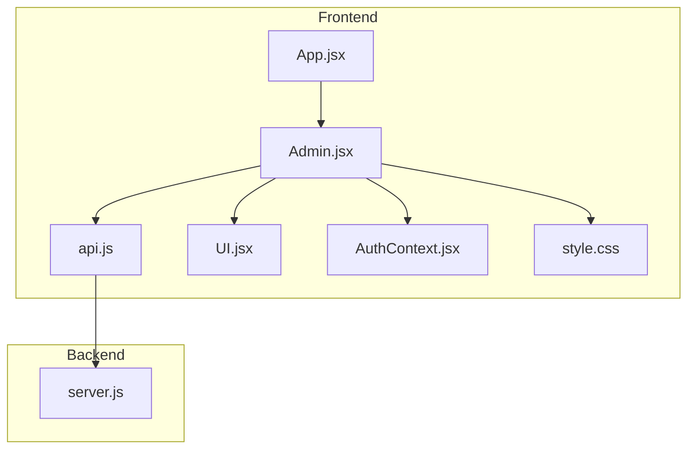
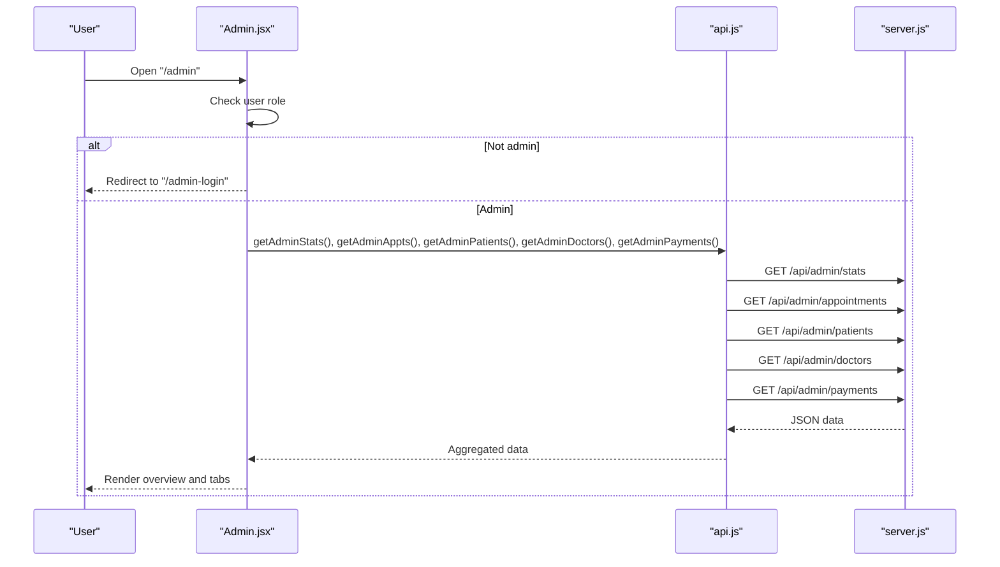
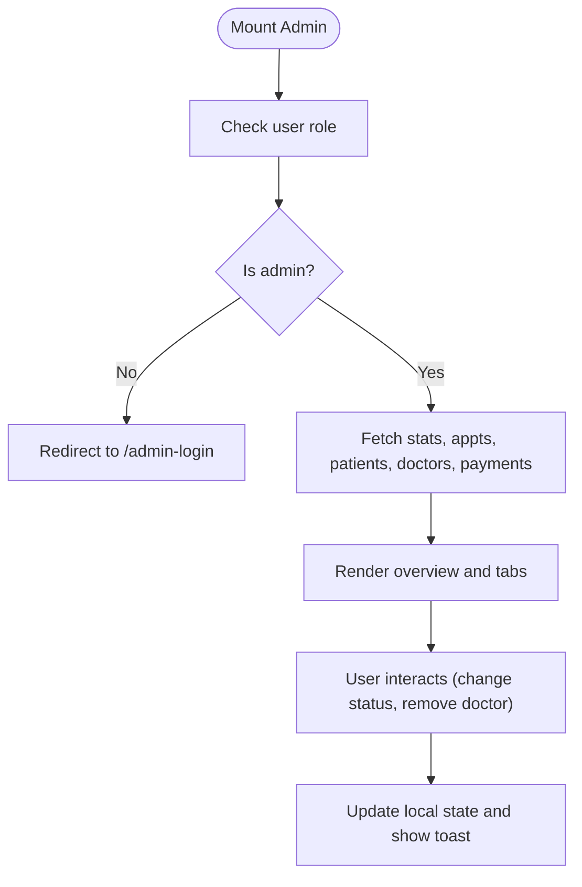
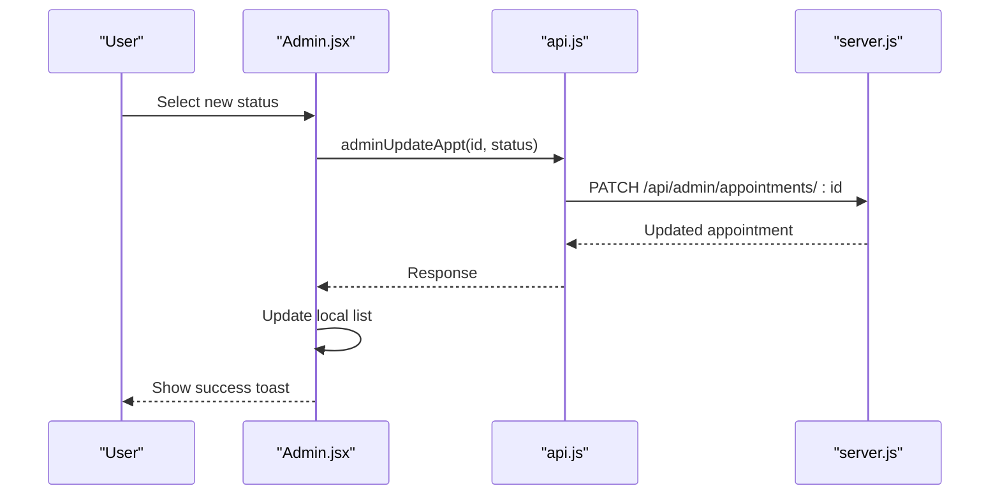
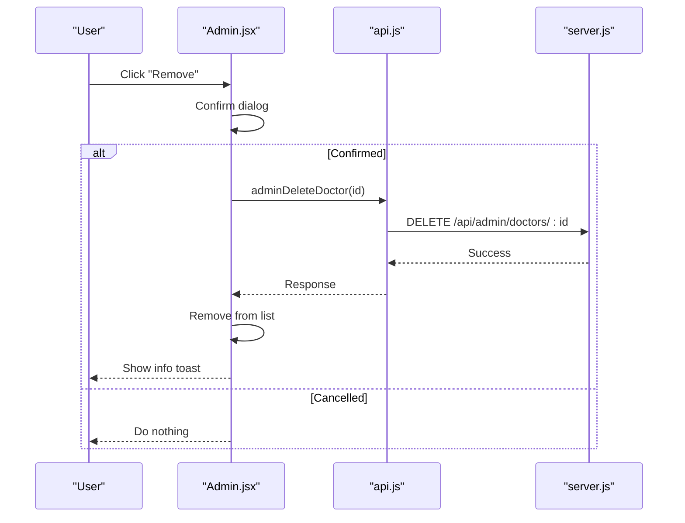
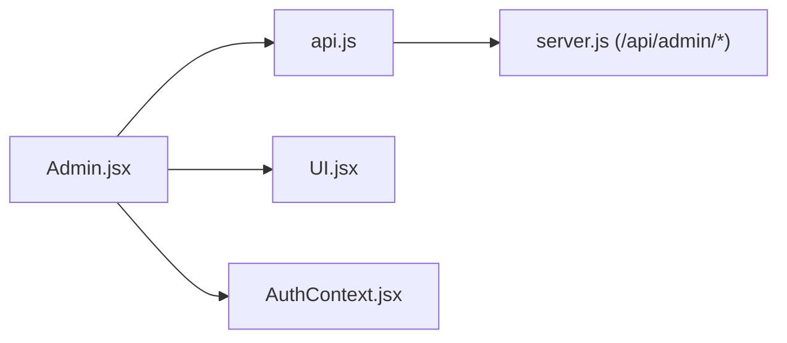

# Admin Dashboard

<cite>
**Referenced Files in This Document**
- [Admin.jsx](file://Admin.jsx)
- [api.js](file://api.js)
- [server.js](file://server.js)
- [App.jsx](file://App.jsx)
- [AuthContext.jsx](file://AuthContext.jsx)
- [UI.jsx](file://UI.jsx)
- [style.css](file://style.css)
- [README.md](file://README.md)
- [package.json](file://package.json)
</cite>

## Table of Contents
1. [Introduction](#introduction)
2. [Project Structure](#project-structure)
3. [Core Components](#core-components)
4. [Architecture Overview](#architecture-overview)
5. [Detailed Component Analysis](#detailed-component-analysis)
6. [Dependency Analysis](#dependency-analysis)
7. [Performance Considerations](#performance-considerations)
8. [Troubleshooting Guide](#troubleshooting-guide)
9. [Conclusion](#conclusion)
10. [Appendices](#appendices)

## Introduction
This document describes the Admin Dashboard for the Doctor appointment booking system. It covers the administrative overview dashboard, user management, appointment monitoring, payment tracking, doctor administration, system health and alerts, reporting and analytics, bulk operations, administrative workflows, data export capabilities, system maintenance, and security considerations including admin access and audit logging.

## Project Structure
The admin dashboard is a React page integrated into the routing system. It fetches data from the backend via API functions and renders tabbed views for overview, appointments, patients, doctors, and payments. Authentication is enforced at the component level and via backend middleware.

**Diagram sources**
- [Admin.jsx](file://Admin.jsx#L1-L194)
- [api.js](file://api.js#L1-L44)
- [App.jsx](file://App.jsx#L15-L43)
- [AuthContext.jsx](file://AuthContext.jsx#L1-L41)
- [UI.jsx](file://UI.jsx#L1-L181)
- [style.css](file://style.css#L1-L765)
- [server.js](file://server.js#L1-L390)

**Section sources**
- [App.jsx](file://App.jsx#L15-L43)
- [README.md](file://README.md#L7-L33)

## Core Components
- Admin page with tabbed interface for overview, appointments, patients, doctors, and payments.
- API module encapsulating all backend endpoints used by admin.
- Backend routes for admin stats, appointments, patients, doctors, and payments.
- Authentication provider and middleware enforcing admin role.
- UI utilities for toasts, spinner, and status badges.

Key responsibilities:
- Overview: system-wide statistics and recent appointments.
- Appointments: view and update statuses across all appointments.
- Patients: list registered patients.
- Doctors: list and remove doctors.
- Payments: list transactions and compute totals.

**Section sources**
- [Admin.jsx](file://Admin.jsx#L7-L194)
- [api.js](file://api.js#L29-L44)
- [server.js](file://server.js#L242-L281)
- [AuthContext.jsx](file://AuthContext.jsx#L1-L41)
- [UI.jsx](file://UI.jsx#L5-L25)

## Architecture Overview
The admin dashboard is a client-side React component that:
- Validates admin role and redirects unauthorized users.
- Fetches data in parallel for stats, appointments, patients, doctors, and payments.
- Renders cards and lists with interactive controls.
- Uses shared UI components for status badges and loading indicators.

**Diagram sources**
- [Admin.jsx](file://Admin.jsx#L19-L24)
- [api.js](file://api.js#L30-L44)
- [server.js](file://server.js#L244-L281)

## Detailed Component Analysis

### Admin Dashboard Page
- Role enforcement: redirects to admin login if not authenticated or role is not admin.
- Parallel data fetching for overview metrics and lists.
- Tabbed UI for overview, appointments, patients, doctors, and payments.
- Real-time updates after status changes and doctor removal.

**Diagram sources**
- [Admin.jsx](file://Admin.jsx#L19-L41)

**Section sources**
- [Admin.jsx](file://Admin.jsx#L7-L194)

### Overview Dashboard
- Displays system KPIs: total patients, total doctors, total appointments, pending, approved, cancelled.
- Shows recent appointments with status badges.

**Section sources**
- [Admin.jsx](file://Admin.jsx#L62-L97)
- [style.css](file://style.css#L539-L556)

### Appointments Monitoring
- Lists all appointments with patient and doctor names, date/time, and specialization.
- Inline dropdown to change status among pending, approved, cancelled, completed.
- Immediate optimistic update and toast feedback.

**Diagram sources**
- [Admin.jsx](file://Admin.jsx#L26-L32)
- [api.js](file://api.js#L34-L35)
- [server.js](file://server.js#L267-L273)

**Section sources**
- [Admin.jsx](file://Admin.jsx#L99-L120)
- [api.js](file://api.js#L34-L35)
- [server.js](file://server.js#L267-L273)

### Patients Management
- Displays registered patients with name, contact, age, and join date.
- No inline actions in current view; supports future bulk operations.

**Section sources**
- [Admin.jsx](file://Admin.jsx#L122-L140)
- [server.js](file://server.js#L259-L261)

### Doctors Administration
- Lists doctors with emoji, specialization, experience, and rating.
- Remove button triggers confirmation and deletes the doctor.
- Optimistic UI update followed by toast feedback.

**Diagram sources**
- [Admin.jsx](file://Admin.jsx#L34-L41)
- [api.js](file://api.js#L35)
- [server.js](file://server.js#L275-L280)

**Section sources**
- [Admin.jsx](file://Admin.jsx#L142-L159)
- [api.js](file://api.js#L35)
- [server.js](file://server.js#L275-L280)

### Payments Tracking
- Lists all payments with patient and doctor names, transaction reference, method, date, and amount.
- Computes total revenue across all payments.

**Section sources**
- [Admin.jsx](file://Admin.jsx#L161-L189)
- [api.js](file://api.js#L43)
- [server.js](file://server.js#L362-L370)

### UI Utilities and Styling
- Toast container displays transient messages for success/error/info events.
- Spinner provides loading indicator during initial fetch.
- StatusBadge renders colored badges for appointment statuses.

**Section sources**
- [UI.jsx](file://UI.jsx#L5-L25)
- [UI.jsx](file://UI.jsx#L178-L181)
- [style.css](file://style.css#L235-L260)

## Dependency Analysis
- Admin.jsx depends on:
  - AuthContext for user role validation.
  - API module for backend calls.
  - UI utilities for toasts, spinner, and status badges.
- API module encapsulates all backend endpoints used by admin.
- Backend routes under /api/admin expose admin-only data and actions.

**Diagram sources**
- [Admin.jsx](file://Admin.jsx#L1-L11)
- [api.js](file://api.js#L29-L44)
- [server.js](file://server.js#L242-L281)

**Section sources**
- [Admin.jsx](file://Admin.jsx#L1-L11)
- [api.js](file://api.js#L1-L44)
- [server.js](file://server.js#L242-L281)

## Performance Considerations
- Initial render performs five concurrent API calls; ensure backend response times are optimized.
- Local state updates are immediate for better UX; consider debouncing or batch updates for frequent status changes.
- Pagination or server-side filtering could improve performance for very large datasets.

## Troubleshooting Guide
Common issues and resolutions:
- Admin login failure: Verify credentials and ensure JWT token is present in Authorization header.
- Unauthorized access: Component checks role and redirects; confirm auth state and middleware.
- API errors: Inspect network tab for 401/403/5xx responses; check backend logs.
- Toast not appearing: Ensure ToastContainer is rendered and useToast hook is called.

**Section sources**
- [AuthContext.jsx](file://AuthContext.jsx#L11-L14)
- [Admin.jsx](file://Admin.jsx#L19-L24)
- [UI.jsx](file://UI.jsx#L11-L25)

## Conclusion
The Admin Dashboard provides a centralized control panel for system oversight, enabling administrators to monitor system health, manage users and appointments, track payments, and maintain the doctor roster. Its modular design and shared UI components support maintainability and extensibility.

## Appendices

### Administrative Workflows
- Approve or reject an appointment:
  - Navigate to Appointments tab.
  - Select desired status from the dropdown.
  - Observe immediate status update and success toast.
- Remove a doctor:
  - Navigate to Doctors tab.
  - Click Remove; confirm dialog.
  - Observe list refresh and info toast.
- View payment summary:
  - Navigate to Payments tab.
  - Review transaction list and computed total.

**Section sources**
- [Admin.jsx](file://Admin.jsx#L26-L41)
- [Admin.jsx](file://Admin.jsx#L99-L120)
- [Admin.jsx](file://Admin.jsx#L161-L189)

### Reporting and Analytics
- Overview tab provides high-level counts and recent activity.
- Payments tab aggregates revenue across all transactions.
- Future enhancements can include date-range filters and export buttons.

**Section sources**
- [Admin.jsx](file://Admin.jsx#L62-L97)
- [Admin.jsx](file://Admin.jsx#L161-L189)

### Bulk Operations and Administrative Tools
- Current implementation supports single-item actions (status change, doctor removal).
- Bulk actions (e.g., mass status updates, batch doctor deletion) can be added by extending the UI and API.

**Section sources**
- [Admin.jsx](file://Admin.jsx#L26-L41)
- [Admin.jsx](file://Admin.jsx#L99-L120)

### System Maintenance Procedures
- Restart backend server to apply environment variable changes (e.g., Stripe secret).
- Update JWT secret and restart backend for security hardening.
- Monitor backend logs for errors and performance metrics.

**Section sources**
- [server.js](file://server.js#L18-L20)
- [server.js](file://server.js#L389)
- [package.json](file://package.json#L14-L22)

### Security Considerations
- Admin role enforcement via JWT middleware ensures only authorized users access admin routes.
- Authorization header is automatically attached to API requests when a token exists.
- Audit logging is not implemented in the current code; consider adding server-side logs for admin actions.

**Section sources**
- [server.js](file://server.js#L49-L62)
- [AuthContext.jsx](file://AuthContext.jsx#L11-L14)
- [README.md](file://README.md#L87-L93)