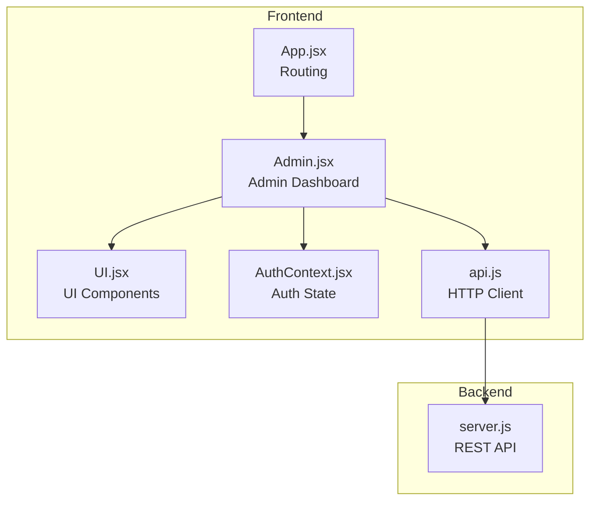
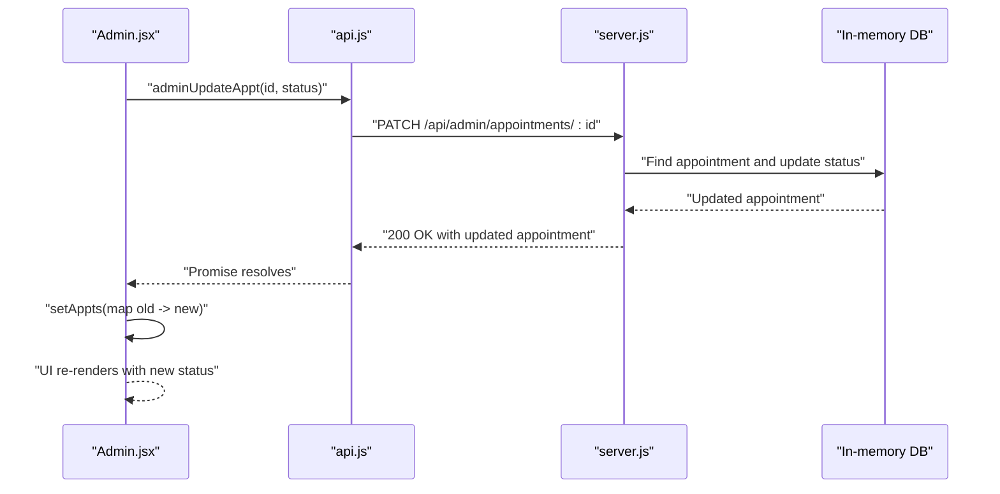
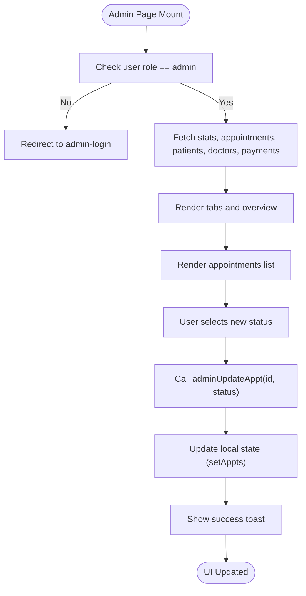
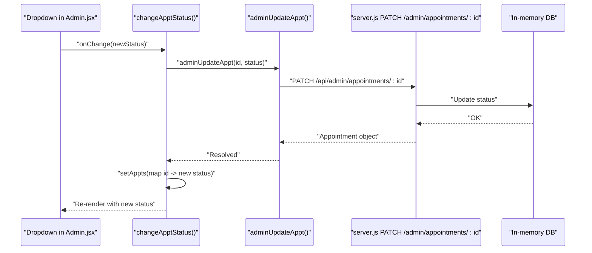
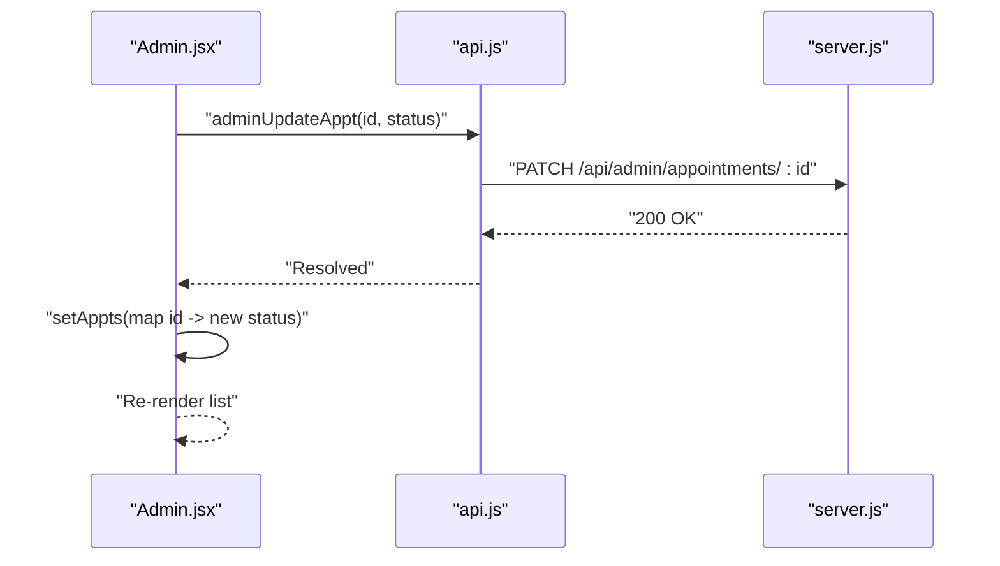
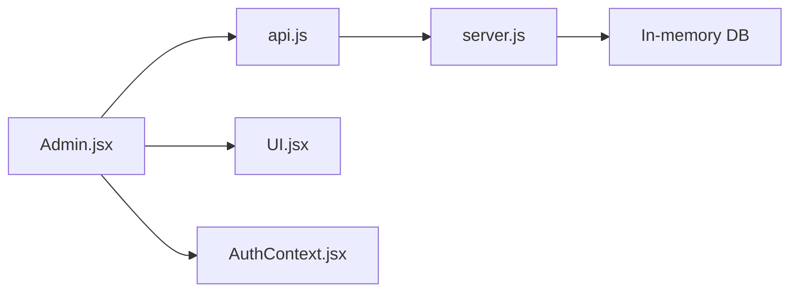

# Appointment Monitoring

<cite>
**Referenced Files in This Document**
- [Admin.jsx](file://Admin.jsx)
- [App.jsx](file://App.jsx)
- [AuthContext.jsx](file://AuthContext.jsx)
- [BookAppointment.jsx](file://BookAppointment.jsx)
- [DoctorPanel.jsx](file://DoctorPanel.jsx)
- [UI.jsx](file://UI.jsx)
- [api.js](file://api.js)
- [server.js](file://server.js)
- [README.md](file://README.md)
</cite>

## Table of Contents
1. [Introduction](#introduction)
2. [Project Structure](#project-structure)
3. [Core Components](#core-components)
4. [Architecture Overview](#architecture-overview)
5. [Detailed Component Analysis](#detailed-component-analysis)
6. [Dependency Analysis](#dependency-analysis)
7. [Performance Considerations](#performance-considerations)
8. [Troubleshooting Guide](#troubleshooting-guide)
9. [Conclusion](#conclusion)
10. [Appendices](#appendices)

## Introduction
This document describes the admin appointment monitoring system, focusing on the admin dashboard’s ability to view, filter, sort, and manage appointments. It explains how administrators can change appointment statuses (pending, approved, cancelled, completed) via dropdown controls, how real-time status updates propagate through the system, and how administrative actions integrate with the booking system and notifications.

## Project Structure
The application is a full-stack React + Node.js/Express system. The admin appointment monitoring resides in the admin page component and integrates with the backend API for retrieving and updating appointments.

**Diagram sources**
- [App.jsx](file://App.jsx#L15-L43)
- [Admin.jsx](file://Admin.jsx#L1-L194)
- [UI.jsx](file://UI.jsx#L1-L182)
- [AuthContext.jsx](file://AuthContext.jsx#L1-L41)
- [api.js](file://api.js#L1-L44)
- [server.js](file://server.js#L1-L390)

**Section sources**
- [App.jsx](file://App.jsx#L15-L43)
- [README.md](file://README.md#L1-L159)

## Core Components
- Admin dashboard page: renders overview statistics, recent appointments, and the full list of appointments with status dropdowns for admin-managed updates.
- API client: centralized HTTP calls for admin endpoints (stats, appointments, patients, doctors, payments) and admin-specific appointment updates.
- Backend routes: admin-only endpoints to fetch aggregated stats, all appointments, all patients/doctors, and to update appointment status or remove a doctor.
- Authentication context: manages JWT tokens and user roles, enforcing admin-only access to the admin route.
- UI components: reusable components like status badges, spinner, and toast notifications.

Key responsibilities:
- Admin dashboard displays patient-doctor relationships, dates, times, and specializations.
- Dropdown controls allow changing appointment status.
- Real-time updates reflect immediately in the UI after successful API updates.
- Administrative actions (status changes, doctor removal) are persisted server-side.

**Section sources**
- [Admin.jsx](file://Admin.jsx#L1-L194)
- [api.js](file://api.js#L29-L36)
- [server.js](file://server.js#L242-L280)
- [AuthContext.jsx](file://AuthContext.jsx#L1-L41)
- [UI.jsx](file://UI.jsx#L178-L181)

## Architecture Overview
The admin appointment monitoring system follows a layered architecture:
- Presentation layer: React components render the admin dashboard and handle user interactions.
- Business logic layer: React components orchestrate data fetching and updates via the API client.
- Data access layer: API client encapsulates HTTP calls to backend endpoints.
- Persistence layer: Backend routes operate on an in-memory database and return structured responses.

**Diagram sources**
- [Admin.jsx](file://Admin.jsx#L26-L32)
- [api.js](file://api.js#L34-L35)
- [server.js](file://server.js#L267-L273)

## Detailed Component Analysis

### Admin Dashboard Page
The admin dashboard page orchestrates:
- Initial load: fetches overview stats, all appointments, patients, doctors, and payments concurrently.
- Tabbed interface: overview, appointments, patients, doctors, payments.
- Appointment listing: shows patient → doctor, specialization, date/time, status badge, and a dropdown to change status.
- Status change handler: updates the backend and reflects the change locally.

**Diagram sources**
- [Admin.jsx](file://Admin.jsx#L19-L32)
- [Admin.jsx](file://Admin.jsx#L100-L120)

**Section sources**
- [Admin.jsx](file://Admin.jsx#L1-L194)

### Status Management and Dropdown Controls
- Each appointment row includes a dropdown with options: pending, approved, cancelled, completed.
- On change, the component calls the admin update function, which:
  - Sends a PATCH request to the backend endpoint.
  - Updates the local state to reflect the new status.
  - Displays a toast notification indicating success or failure.

**Diagram sources**
- [Admin.jsx](file://Admin.jsx#L26-L32)
- [api.js](file://api.js#L34-L35)
- [server.js](file://server.js#L267-L273)

**Section sources**
- [Admin.jsx](file://Admin.jsx#L108-L117)
- [api.js](file://api.js#L34-L35)
- [server.js](file://server.js#L267-L273)

### Appointment Filtering and Sorting
- Overview tab shows recent appointments with patient → doctor, date/time, and status.
- The admin does not implement explicit filters/sorters for status/date/name in the admin page; the backend returns all appointments, and the UI currently renders them as-is.
- Recommendation: Add client-side filtering/sorting controls (by status, date range, participant names) to improve usability.

[No sources needed since this section provides general guidance]

### Real-Time Status Updates and Propagation
- After a successful status update, the UI updates immediately by replacing the affected appointment record in the local state.
- No WebSocket or polling is implemented; updates are immediate upon successful API response.
- Notifications: a toast confirms success/failure of the update.

**Diagram sources**
- [Admin.jsx](file://Admin.jsx#L26-L32)
- [api.js](file://api.js#L34-L35)
- [server.js](file://server.js#L267-L273)

**Section sources**
- [Admin.jsx](file://Admin.jsx#L26-L32)

### Appointment Workflow Management Examples
- Single appointment status change: Select a status from the dropdown in the admin list; the backend persists the change and the UI updates instantly.
- Batch status updates: Not implemented in the admin page; however, the backend supports updating any appointment by ID. A future enhancement could add bulk actions (e.g., select multiple rows and apply a status change).

[No sources needed since this section provides general guidance]

### Appointment History Tracking
- The admin page does not expose a dedicated “history” view; it lists all appointments.
- Recommendation: Add a separate tab or modal to show historical changes per appointment (requires storing audit logs in the backend).

[No sources needed since this section provides general guidance]

### Integration with Booking System and Notifications
- Booking flow: Patients book appointments via the booking page, which posts to the backend and redirects to payment. Payments mark appointments as approved.
- Admin actions: Admins can override statuses directly. There is no explicit notification mechanism for admin-initiated changes in the current code.
- Recommendations:
  - Emit notifications (email/SMS) when statuses change.
  - Track who made changes and when.

**Section sources**
- [BookAppointment.jsx](file://BookAppointment.jsx#L39-L60)
- [server.js](file://server.js#L298-L353)

## Dependency Analysis
The admin appointment monitoring depends on:
- API client for HTTP communication.
- Backend routes for admin-only operations.
- Authentication context to enforce role-based access.
- UI components for rendering status badges and notifications.

**Diagram sources**
- [Admin.jsx](file://Admin.jsx#L1-L194)
- [api.js](file://api.js#L1-L44)
- [server.js](file://server.js#L1-L390)
- [AuthContext.jsx](file://AuthContext.jsx#L1-L41)
- [UI.jsx](file://UI.jsx#L1-L182)

**Section sources**
- [Admin.jsx](file://Admin.jsx#L1-L194)
- [api.js](file://api.js#L1-L44)
- [server.js](file://server.js#L1-L390)
- [AuthContext.jsx](file://AuthContext.jsx#L1-L41)
- [UI.jsx](file://UI.jsx#L1-L182)

## Performance Considerations
- Current implementation fetches all appointments and renders them in a single list. For large datasets, consider pagination or virtualized lists.
- Filtering/sorting is client-side; adding server-side filtering would reduce payload sizes and improve responsiveness.

[No sources needed since this section provides general guidance]

## Troubleshooting Guide
Common issues and resolutions:
- Unauthorized access to admin route: Ensure the user is logged in as admin; otherwise, the component redirects to the admin login page.
- Status update failures: The handler catches errors and shows a toast; verify network connectivity and backend availability.
- Missing notifications: Admin actions do not trigger notifications in the current code; implement notification hooks if needed.

**Section sources**
- [Admin.jsx](file://Admin.jsx#L19-L24)
- [Admin.jsx](file://Admin.jsx#L26-L32)

## Conclusion
The admin appointment monitoring system provides a straightforward interface for administrators to oversee and manage appointments. It supports viewing patient-doctor relationships, dates/times, and specializations, and enables immediate status changes via dropdown controls. While real-time propagation occurs through local state updates, integrating notifications and adding filtering/sorting would enhance operational efficiency.

## Appendices

### API Definitions Relevant to Admin Monitoring
- GET /api/admin/stats
  - Purpose: Retrieve overview statistics (totals and counts by status).
  - Response: Aggregated metrics suitable for cards and charts.
- GET /api/admin/appointments
  - Purpose: Retrieve all appointments for admin review.
  - Response: Array of appointment records with patient and doctor identifiers and metadata.
- PATCH /api/admin/appointments/:id
  - Purpose: Update the status of a specific appointment.
  - Request body: { status: "pending" | "approved" | "cancelled" | "completed" }
  - Response: Updated appointment object.
- DELETE /api/admin/doctors/:id
  - Purpose: Remove a doctor from the system.
  - Response: Success message.

**Section sources**
- [api.js](file://api.js#L29-L36)
- [server.js](file://server.js#L242-L280)

### UI Components Used by Admin
- StatusBadge: Renders a badge with the current status text.
- Spinner: Loading indicator during initial data fetch.
- useToast: Hook to show toast notifications for feedback.

**Section sources**
- [UI.jsx](file://UI.jsx#L178-L181)
- [UI.jsx](file://UI.jsx#L28-L31)
- [UI.jsx](file://UI.jsx#L6-L25)