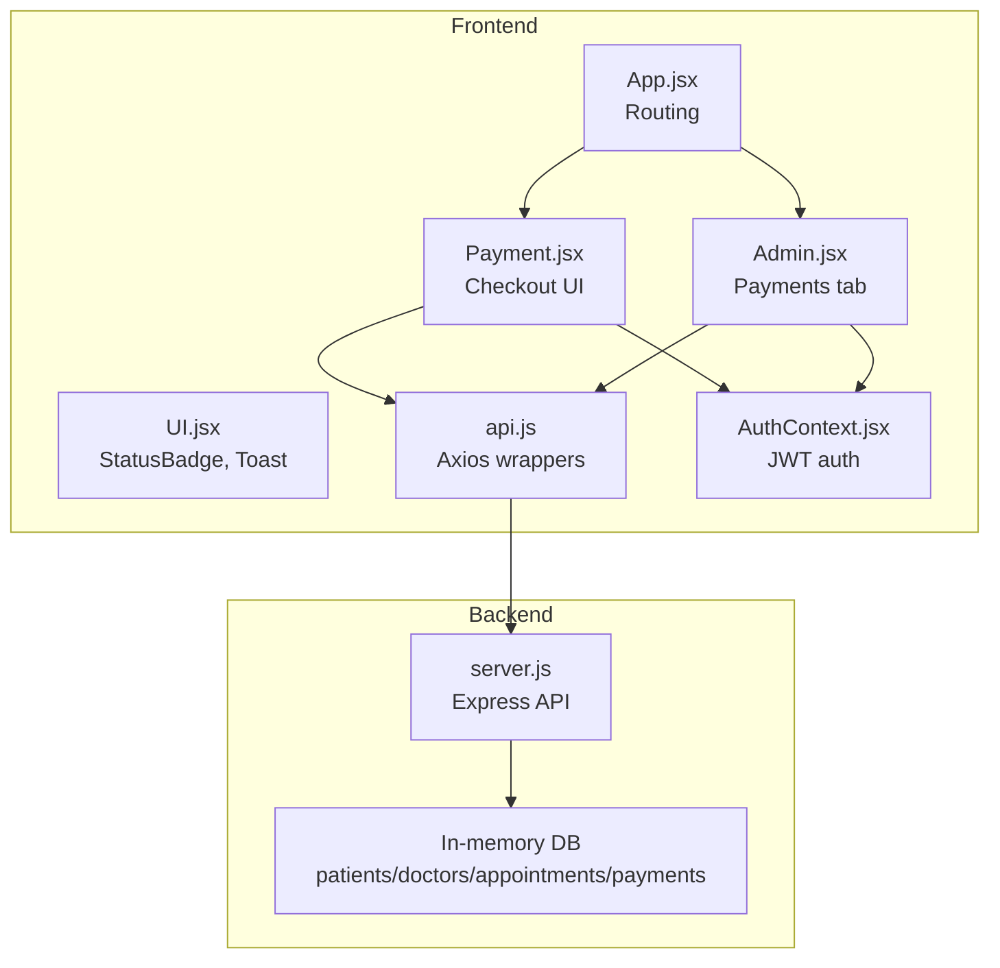
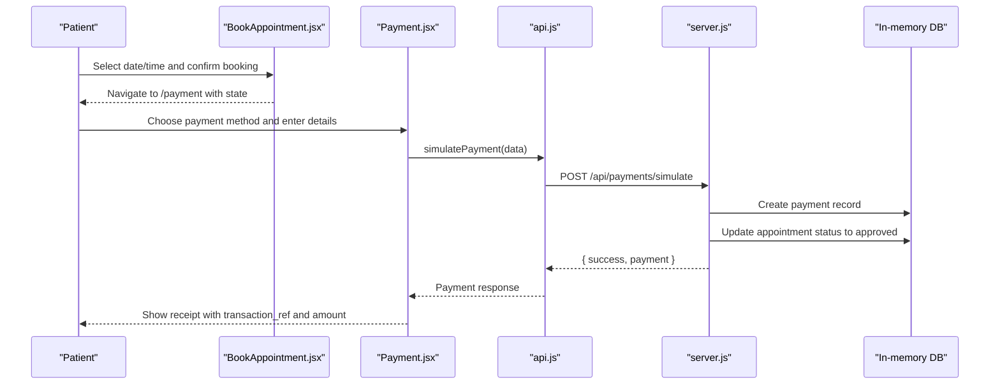
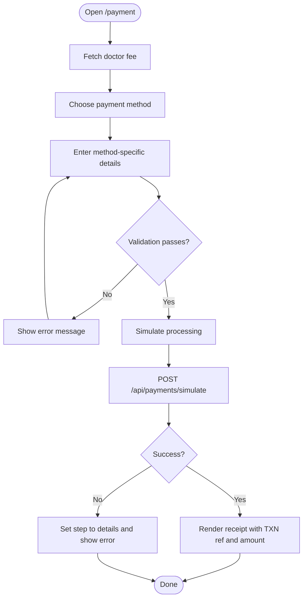
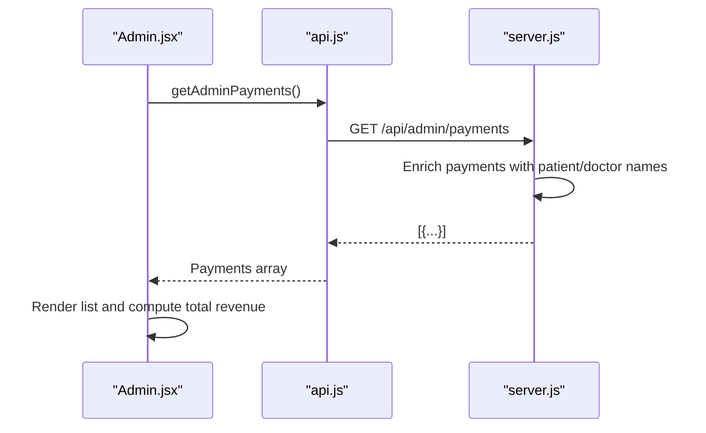
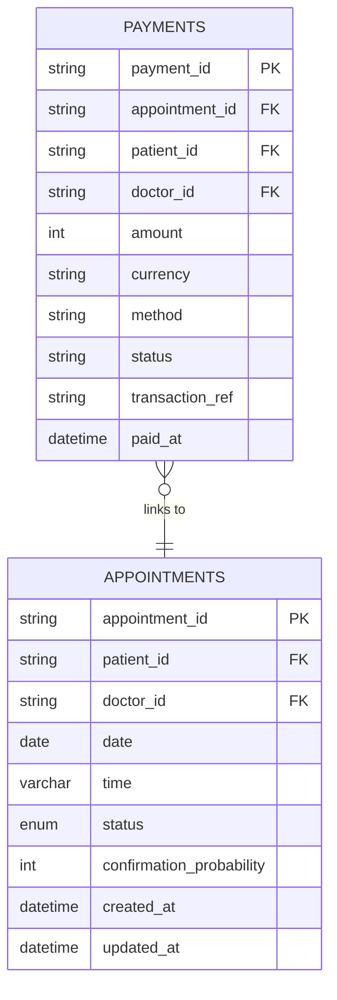
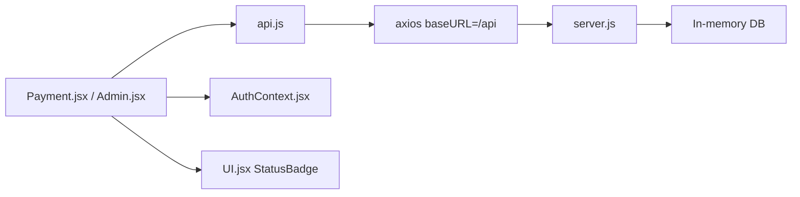

# Payment Tracking

<cite>
**Referenced Files in This Document**
- [Payment.jsx](file://Payment.jsx)
- [Admin.jsx](file://Admin.jsx)
- [server.js](file://server.js)
- [api.js](file://api.js)
- [BookAppointment.jsx](file://BookAppointment.jsx)
- [AuthContext.jsx](file://AuthContext.jsx)
- [UI.jsx](file://UI.jsx)
- [App.jsx](file://App.jsx)
- [README.md](file://README.md)
</cite>

## Table of Contents
1. [Introduction](#introduction)
2. [Project Structure](#project-structure)
3. [Core Components](#core-components)
4. [Architecture Overview](#architecture-overview)
5. [Detailed Component Analysis](#detailed-component-analysis)
6. [Dependency Analysis](#dependency-analysis)
7. [Performance Considerations](#performance-considerations)
8. [Troubleshooting Guide](#troubleshooting-guide)
9. [Conclusion](#conclusion)
10. [Appendices](#appendices)

## Introduction
This document describes the admin payment tracking and financial monitoring system. It explains how payment transactions are recorded, displayed, and summarized; how total revenue is calculated and formatted; how payment verification appears in the UI; and how administrators can view and audit transactions. It also outlines the payment flow from booking to payment confirmation, integration points with the backend, and administrative controls that affect financial reporting.

## Project Structure
The payment tracking system spans the frontend React application and the backend Node/Express API. The frontend includes:
- Payment page for secure checkout and receipt generation
- Admin dashboard for viewing and summarizing transactions
- Supporting UI components for status badges and toast notifications
- Authentication context for protected routes and API headers

The backend exposes:
- Payment endpoints for simulation and receipts
- Admin endpoints for retrieving enriched payment lists
- Shared consultation fee configuration

**Diagram sources**
- [App.jsx](file://App.jsx#L15-L42)
- [Payment.jsx](file://Payment.jsx#L23-L296)
- [Admin.jsx](file://Admin.jsx#L7-L193)
- [UI.jsx](file://UI.jsx#L178-L181)
- [api.js](file://api.js#L1-L44)
- [AuthContext.jsx](file://AuthContext.jsx#L6-L38)
- [server.js](file://server.js#L29-L44)

**Section sources**
- [App.jsx](file://App.jsx#L15-L42)
- [README.md](file://README.md#L1-L159)

## Core Components
- Payment page: Collects payment method and details, validates inputs, simulates payment processing, and displays a receipt with transaction reference and amount.
- Admin payments tab: Lists all payments with patient and doctor names, transaction reference, method, date, and amount; computes total revenue.
- Backend payment endpoints: Enriches payment records with patient/doctor names for admin display and stores payment records upon successful simulation.
- API wrappers: Centralized axios-based API calls for payments and admin data retrieval.
- UI helpers: Status badge and toast notification system for user feedback.

**Section sources**
- [Payment.jsx](file://Payment.jsx#L23-L296)
- [Admin.jsx](file://Admin.jsx#L161-L193)
- [server.js](file://server.js#L362-L377)
- [api.js](file://api.js#L39-L44)
- [UI.jsx](file://UI.jsx#L178-L181)

## Architecture Overview
The payment lifecycle connects the frontend booking and payment flows to backend endpoints that persist payment records and update appointment statuses.

**Diagram sources**
- [BookAppointment.jsx](file://BookAppointment.jsx#L39-L60)
- [Payment.jsx](file://Payment.jsx#L62-L98)
- [api.js](file://api.js#L41-L42)
- [server.js](file://server.js#L318-L353)

## Detailed Component Analysis

### Payment Page: Checkout and Receipt
The payment page orchestrates:
- Method selection (card, EasyPaisa, JazzCash, bank transfer)
- Validation of inputs per method
- Simulation of payment processing
- Receipt rendering with transaction reference, amount, doctor, date/time, method, and status

Key behaviors:
- Consultation fee lookup by doctor specialization
- Monetary formatting with thousands separators
- Step-based UI flow (method → details → processing → success)
- Transaction reference generated on successful simulation

**Diagram sources**
- [Payment.jsx](file://Payment.jsx#L49-L98)
- [server.js](file://server.js#L318-L353)

**Section sources**
- [Payment.jsx](file://Payment.jsx#L23-L296)
- [server.js](file://server.js#L318-L353)

### Admin Payments Tab: Listing and Revenue Sum
The admin dashboard’s payments tab:
- Fetches all payments via the admin endpoint
- Enriches records with patient and doctor names
- Displays each transaction with patient → doctor, transaction reference, method, date, and amount
- Computes total revenue by summing amounts and formatting with thousands separators

**Diagram sources**
- [Admin.jsx](file://Admin.jsx#L16-L24)
- [Admin.jsx](file://Admin.jsx#L161-L193)
- [api.js](file://api.js#L43-L44)
- [server.js](file://server.js#L362-L370)

**Section sources**
- [Admin.jsx](file://Admin.jsx#L161-L193)
- [server.js](file://server.js#L362-L370)

### Backend Payment Endpoints and Data Model
Backend endpoints:
- Consultation fee lookup by doctor
- Payment simulation endpoint that creates a payment record and updates the associated appointment
- Admin endpoint returning enriched payment records

Data model highlights:
- Payment record includes identifiers, amount, currency, method, status, transaction reference, and timestamp
- Appointment status transitions to approved after payment

**Diagram sources**
- [server.js](file://server.js#L333-L350)

**Section sources**
- [server.js](file://server.js#L287-L377)

### UI and Authentication Integration
- Authentication context sets Authorization headers for protected routes and API calls.
- Status badge renders standardized status labels.
- Toast notifications provide user feedback during payment and admin actions.

**Section sources**
- [AuthContext.jsx](file://AuthContext.jsx#L6-L38)
- [UI.jsx](file://UI.jsx#L178-L181)
- [App.jsx](file://App.jsx#L15-L42)

## Dependency Analysis
The payment tracking system exhibits clear separation of concerns:
- Frontend depends on API wrappers for backend communication
- API wrappers depend on axios baseURL configured to /api
- Backend depends on in-memory storage and optional Stripe integration
- Admin dashboard depends on admin endpoints for aggregated data

**Diagram sources**
- [Payment.jsx](file://Payment.jsx#L1-L5)
- [Admin.jsx](file://Admin.jsx#L1-L6)
- [api.js](file://api.js#L1-L4)
- [server.js](file://server.js#L3-L24)
- [AuthContext.jsx](file://AuthContext.jsx#L6-L14)
- [UI.jsx](file://UI.jsx#L178-L181)

**Section sources**
- [api.js](file://api.js#L1-L44)
- [server.js](file://server.js#L3-L24)

## Performance Considerations
- Client-side totals: Admin revenue summation uses a simple reduce operation; acceptable for small datasets but consider pagination or server-side aggregation for large volumes.
- Rendering lists: Virtualization is not implemented; for very large payment histories, consider virtualized lists.
- Network efficiency: Admin fetches all payments; consider adding filters and server-side paging to improve responsiveness.

## Troubleshooting Guide
Common issues and resolutions:
- Payment fails with validation errors: Ensure card number, expiry, CVV, or mobile/account fields meet minimum length requirements depending on the selected method.
- Payment simulation returns an error: Verify that the appointment_id and doctor_id match the current user session and that the doctor exists.
- Admin payments tab shows empty list: Confirm that payments exist and that the admin token is valid; check network tab for 401/403 responses.
- Missing patient/doctor names in admin list: The backend enriches records by joining with stored entities; ensure records exist for the referenced IDs.

**Section sources**
- [Payment.jsx](file://Payment.jsx#L62-L98)
- [server.js](file://server.js#L318-L353)
- [server.js](file://server.js#L362-L370)

## Conclusion
The admin payment tracking system integrates a streamlined frontend payment flow with backend endpoints that persist transactions and update appointment statuses. Administrators can view a comprehensive list of payments, compute total revenue, and rely on consistent formatting for monetary values. While the current implementation uses an in-memory store, the modular design supports migration to persistent storage and real payment provider integration.

## Appendices

### Payment Transaction Listing Fields
- Patient name
- Doctor name
- Transaction reference
- Payment method
- Amount
- Date/time paid
- Status badge

**Section sources**
- [Admin.jsx](file://Admin.jsx#L172-L184)
- [server.js](file://server.js#L364-L369)

### Total Revenue Calculation and Formatting
- Sum all payment amounts in the payments list
- Format with thousands separators and currency prefix

**Section sources**
- [Admin.jsx](file://Admin.jsx#L167-L168)

### Payment Verification Status Indicators
- UI badge displays standardized status labels
- Payment success screen shows “PAID” status

**Section sources**
- [UI.jsx](file://UI.jsx#L178-L181)
- [Payment.jsx](file://Payment.jsx#L271-L272)

### Transaction History Tracking
- Each payment includes a unique transaction reference and timestamp
- Admin endpoint returns enriched records with patient and doctor names

**Section sources**
- [server.js](file://server.js#L342-L344)
- [server.js](file://server.js#L364-L369)

### Filtering Capabilities
- Current admin payments tab does not implement date range, patient name, or method filters
- To add filtering, extend the admin endpoint to accept query parameters and apply server-side filtering

**Section sources**
- [Admin.jsx](file://Admin.jsx#L161-L193)
- [api.js](file://api.js#L43-L44)

### Reconciliation and Audit Examples
- Reconcile daily totals by aggregating payments filtered by date range (requires server-side filtering)
- Audit individual transactions by reviewing the receipt details and associated appointment status
- Generate reports by exporting the admin payments list and applying spreadsheet filters

**Section sources**
- [Admin.jsx](file://Admin.jsx#L161-L193)
- [Payment.jsx](file://Payment.jsx#L266-L272)

### Administrative Actions Impact
- Updating appointment status affects downstream reporting; ensure payment records remain intact
- Removing doctors or patients does not alter existing payment records, but may impact future bookings

**Section sources**
- [server.js](file://server.js#L267-L280)
- [server.js](file://server.js#L347-L350)