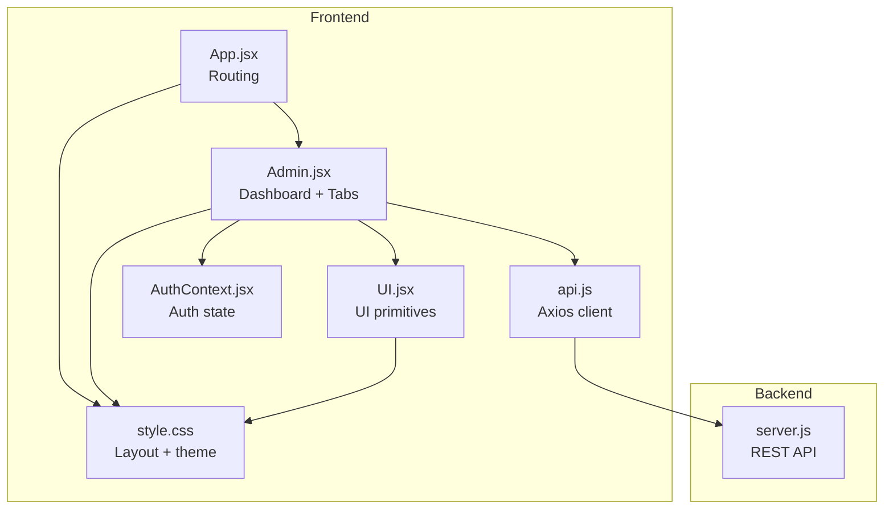
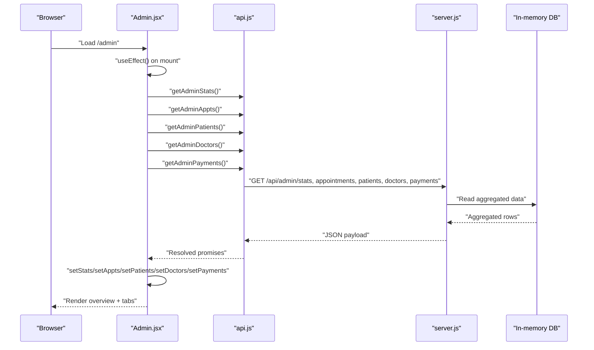
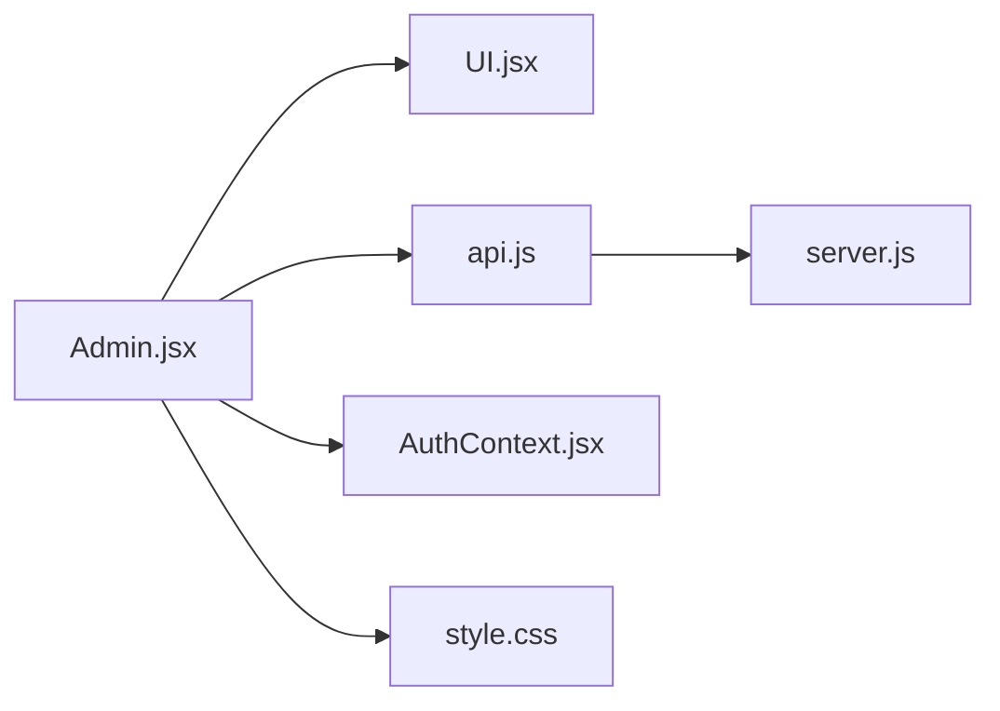

# System Overview and Analytics

<cite>
**Referenced Files in This Document**
- [Admin.jsx](file://Admin.jsx)
- [App.jsx](file://App.jsx)
- [UI.jsx](file://UI.jsx)
- [api.js](file://api.js)
- [AuthContext.jsx](file://AuthContext.jsx)
- [server.js](file://server.js)
- [style.css](file://style.css)
- [README.md](file://README.md)
</cite>

## Table of Contents
1. [Introduction](#introduction)
2. [Project Structure](#project-structure)
3. [Core Components](#core-components)
4. [Architecture Overview](#architecture-overview)
5. [Detailed Component Analysis](#detailed-component-analysis)
6. [Dependency Analysis](#dependency-analysis)
7. [Performance Considerations](#performance-considerations)
8. [Troubleshooting Guide](#troubleshooting-guide)
9. [Conclusion](#conclusion)
10. [Appendices](#appendices)

## Introduction
This document describes the Admin System Overview and Analytics Dashboard. It focuses on the main dashboard interface that presents system-wide statistics, real-time statistics cards, the recent appointments widget, and the tabbed navigation organizing analytics modules. It also explains how metrics are calculated and updated, how the layout behaves responsively, and how the admin can manage appointments and doctors.

## Project Structure
The admin dashboard is part of a React frontend integrated with a Node.js/Express backend. The Admin page composes reusable UI components and orchestrates data fetching from the backend via an API module. Authentication is handled centrally, and global styles define responsive layouts and theme support.

**Diagram sources**
- [App.jsx](file://App.jsx#L15-L43)
- [Admin.jsx](file://Admin.jsx#L1-L194)
- [UI.jsx](file://UI.jsx#L1-L182)
- [api.js](file://api.js#L1-L44)
- [AuthContext.jsx](file://AuthContext.jsx#L1-L41)
- [server.js](file://server.js#L1-L390)
- [style.css](file://style.css#L1-L200)

**Section sources**
- [App.jsx](file://App.jsx#L15-L43)
- [README.md](file://README.md#L7-L33)

## Core Components
- Admin Dashboard: Renders overview statistics, recent appointments, and tabbed views for appointments, patients, doctors, and payments.
- UI Primitives: Reusable components like StatusBadge, Spinner, ToastContainer, and bottom navigation.
- API Layer: Centralized axios client exposing typed endpoints for admin analytics and management.
- Authentication Context: Provides user role checks and persisted theme state.
- Backend Admin Endpoints: Compute and serve system-wide stats and administrative lists.

Key implementation references:
- Overview grid and recent appointments rendering: [Admin.jsx](file://Admin.jsx#L62-L97)
- Tabbed navigation: [Admin.jsx](file://Admin.jsx#L54-L59)
- Admin endpoints: [server.js](file://server.js#L242-L281)
- API bindings: [api.js](file://api.js#L29-L36)
- UI components: [UI.jsx](file://UI.jsx#L11-L25), [UI.jsx](file://UI.jsx#L178-L181)

**Section sources**
- [Admin.jsx](file://Admin.jsx#L62-L97)
- [Admin.jsx](file://Admin.jsx#L54-L59)
- [server.js](file://server.js#L242-L281)
- [api.js](file://api.js#L29-L36)
- [UI.jsx](file://UI.jsx#L11-L25)
- [UI.jsx](file://UI.jsx#L178-L181)

## Architecture Overview
The admin dashboard follows a layered architecture:
- Presentation Layer: Admin.jsx renders the UI and manages state.
- Data Access Layer: api.js encapsulates HTTP calls to backend endpoints.
- Business Logic Layer: server.js implements admin analytics and management endpoints.
- Shared UI Layer: UI.jsx provides reusable components and utilities.
- Authentication and Theme: AuthContext.jsx centralizes auth and theme persistence.

**Diagram sources**
- [Admin.jsx](file://Admin.jsx#L19-L24)
- [api.js](file://api.js#L30-L36)
- [server.js](file://server.js#L242-L281)

## Detailed Component Analysis

### Admin Dashboard Overview
The overview tab displays:
- Real-time statistics cards: total patients, total doctors, total appointments, and counts for pending, approved, and cancelled statuses.
- Recent appointments widget: latest bookings with patient-doctor pairing and timing.

Rendering highlights:
- Grid layout for statistics cards: [Admin.jsx](file://Admin.jsx#L64-L81)
- Recent appointments list: [Admin.jsx](file://Admin.jsx#L84-L96)
- Status badges: [UI.jsx](file://UI.jsx#L178-L181)

Metrics calculation (backend):
- Counts derived from in-memory arrays and filtered by status: [server.js](file://server.js#L244-L252)

Real-time updates:
- On initial load, the dashboard fetches all datasets concurrently and sets state atomically. There is no periodic polling in the frontend; updates occur upon navigation or explicit actions.

Responsive design:
- CSS grid classes enable responsive column layouts: [style.css](file://style.css#L100-L103)
- Flexbox and spacing utilities ensure readable layouts across devices: [style.css](file://style.css#L96-L107)

**Section sources**
- [Admin.jsx](file://Admin.jsx#L62-L97)
- [server.js](file://server.js#L244-L252)
- [UI.jsx](file://UI.jsx#L178-L181)
- [style.css](file://style.css#L100-L103)
- [style.css](file://style.css#L96-L107)

### Tab Navigation System
The dashboard uses a simple button-based tab system:
- Tabs defined as label pairs: [Admin.jsx](file://Admin.jsx#L45-L45)
- Active tab toggled via button clicks: [Admin.jsx](file://Admin.jsx#L56-L58)
- Conditional rendering of each tab’s content: [Admin.jsx](file://Admin.jsx#L100-L189)

Navigation behavior:
- The Navbar and BottomNav provide cross-module navigation; the Admin tab routes to the dashboard page: [App.jsx](file://App.jsx#L34-L34), [UI.jsx](file://UI.jsx#L123-L125), [UI.jsx](file://UI.jsx#L157-L160)

**Section sources**
- [Admin.jsx](file://Admin.jsx#L45-L59)
- [Admin.jsx](file://Admin.jsx#L100-L189)
- [App.jsx](file://App.jsx#L34-L34)
- [UI.jsx](file://UI.jsx#L123-L125)
- [UI.jsx](file://UI.jsx#L157-L160)

### Recent Appointments Widget
The widget shows the five most recent appointments with:
- Patient-to-doctor pairing
- Date and time
- Status indicator

Implementation:
- List slicing to limit entries: [Admin.jsx](file://Admin.jsx#L86-L94)
- StatusBadge component for status display: [UI.jsx](file://UI.jsx#L178-L181)

Backend data:
- Admin endpoint returns raw appointment records: [server.js](file://server.js#L255-L257)

**Section sources**
- [Admin.jsx](file://Admin.jsx#L84-L96)
- [UI.jsx](file://UI.jsx#L178-L181)
- [server.js](file://server.js#L255-L257)

### Data Visualization Components
The overview uses simple, icon-driven cards to visualize metrics:
- Icons and colors per metric category: [Admin.jsx](file://Admin.jsx#L66-L72)
- Card layout via CSS grid: [Admin.jsx](file://Admin.jsx#L64-L81)
- Typography and color tokens from theme: [style.css](file://style.css#L7-L33)

There is no chart library in use; metrics are presented as discrete numeric cards.

**Section sources**
- [Admin.jsx](file://Admin.jsx#L66-L72)
- [Admin.jsx](file://Admin.jsx#L64-L81)
- [style.css](file://style.css#L7-L33)

### Metrics Calculation and Updates
Backend computation:
- Stats endpoint aggregates counts from in-memory collections: [server.js](file://server.js#L244-L252)
- Admin endpoints return full lists for downstream filtering and pagination in the UI: [server.js](file://server.js#L255-L265)

Frontend consumption:
- Concurrent fetch on mount using Promise.all: [Admin.jsx](file://Admin.jsx#L21-L21)
- Local state updates trigger re-renders: [Admin.jsx](file://Admin.jsx#L22-L22)

No real-time streaming is implemented; updates occur when the page reloads or when admin actions mutate data.

**Section sources**
- [server.js](file://server.js#L244-L252)
- [server.js](file://server.js#L255-L265)
- [Admin.jsx](file://Admin.jsx#L21-L22)

### Tabbed Analytics Modules
Overview tab content is complemented by dedicated tabs:
- Appointments: editable status dropdown per appointment: [Admin.jsx](file://Admin.jsx#L100-L120)
- Patients: list with registration date: [Admin.jsx](file://Admin.jsx#L122-L140)
- Doctors: list with specialization and rating; removal action: [Admin.jsx](file://Admin.jsx#L142-L159)
- Payments: totals computed client-side; enriched records from backend: [Admin.jsx](file://Admin.jsx#L161-L189)

Admin actions:
- Update appointment status: [Admin.jsx](file://Admin.jsx#L26-L32)
- Delete doctor: [Admin.jsx](file://Admin.jsx#L34-L41)
- API bindings: [api.js](file://api.js#L34-L35), [api.js](file://api.js#L36-L36)

**Section sources**
- [Admin.jsx](file://Admin.jsx#L100-L189)
- [Admin.jsx](file://Admin.jsx#L26-L41)
- [api.js](file://api.js#L34-L36)
- [server.js](file://server.js#L267-L281)

## Dependency Analysis
The Admin dashboard depends on:
- UI primitives for badges, spinners, and toasts
- API module for backend communication
- Auth context for role checks and theme
- Global styles for responsive grids and theme tokens

**Diagram sources**
- [Admin.jsx](file://Admin.jsx#L1-L11)
- [UI.jsx](file://UI.jsx#L1-L10)
- [api.js](file://api.js#L1-L10)
- [AuthContext.jsx](file://AuthContext.jsx#L1-L10)
- [server.js](file://server.js#L1-L25)
- [style.css](file://style.css#L1-L20)

**Section sources**
- [Admin.jsx](file://Admin.jsx#L1-L11)
- [UI.jsx](file://UI.jsx#L1-L10)
- [api.js](file://api.js#L1-L10)
- [AuthContext.jsx](file://AuthContext.jsx#L1-L10)
- [server.js](file://server.js#L1-L25)
- [style.css](file://style.css#L1-L20)

## Performance Considerations
- Initial load performance: The dashboard fetches multiple datasets concurrently to minimize perceived latency. Consider lazy-loading heavy tabs (e.g., payments) until needed.
- Rendering cost: The overview grid and recent appointments lists are small; keep lists short to reduce DOM nodes.
- Theme switching: CSS variables and minimal JS ensure smooth dark/light mode transitions.
- No polling: Avoids unnecessary network churn; updates rely on explicit actions or navigation.

[No sources needed since this section provides general guidance]

## Troubleshooting Guide
Common issues and remedies:
- Admin route protection: If a non-admin user navigates to the dashboard, they are redirected to the admin login page. Verify role checks and token presence: [Admin.jsx](file://Admin.jsx#L20-L20), [AuthContext.jsx](file://AuthContext.jsx#L21-L31).
- Toast notifications: Ensure ToastContainer is rendered in the app shell so toasts appear consistently: [App.jsx](file://App.jsx#L21-L21), [UI.jsx](file://UI.jsx#L11-L25).
- Status updates: If changing appointment status fails, confirm the backend endpoint responds and the local state update occurs: [Admin.jsx](file://Admin.jsx#L26-L32), [api.js](file://api.js#L34-L34), [server.js](file://server.js#L267-L273).
- Doctor deletion: Confirm confirmation dialog and backend delete response: [Admin.jsx](file://Admin.jsx#L34-L41), [api.js](file://api.js#L36-L36), [server.js](file://server.js#L275-L280).

**Section sources**
- [Admin.jsx](file://Admin.jsx#L20-L20)
- [AuthContext.jsx](file://AuthContext.jsx#L21-L31)
- [App.jsx](file://App.jsx#L21-L21)
- [UI.jsx](file://UI.jsx#L11-L25)
- [Admin.jsx](file://Admin.jsx#L26-L32)
- [Admin.jsx](file://Admin.jsx#L34-L41)
- [api.js](file://api.js#L34-L36)
- [server.js](file://server.js#L267-L280)

## Conclusion
The Admin Dashboard provides a concise, real-time overview of system health and recent activity, backed by straightforward backend endpoints. Its tabbed interface cleanly organizes analytics modules, while reusable UI components and responsive CSS ensure a consistent, accessible experience. For production, consider adding optional polling or WebSocket updates for live metrics, lazy-loading heavy tabs, and pagination for large lists.

[No sources needed since this section summarizes without analyzing specific files]

## Appendices

### Dashboard Layout and Responsive Design
- Grid-based statistics cards adapt to screen size: [Admin.jsx](file://Admin.jsx#L64-L81), [style.css](file://style.css#L100-L103)
- Flexbox spacing and typography scale across breakpoints: [style.css](file://style.css#L96-L107)
- Dark mode theme tokens: [style.css](file://style.css#L7-L33), [style.css](file://style.css#L35-L58)

**Section sources**
- [Admin.jsx](file://Admin.jsx#L64-L81)
- [style.css](file://style.css#L100-L103)
- [style.css](file://style.css#L96-L107)
- [style.css](file://style.css#L7-L33)
- [style.css](file://style.css#L35-L58)

### Real-Time Data Refresh Mechanisms
- Current behavior: Fetches data on mount; no periodic refresh.
- Recommended enhancement: Introduce polling or event-driven updates for live metrics.

[No sources needed since this section provides general guidance]