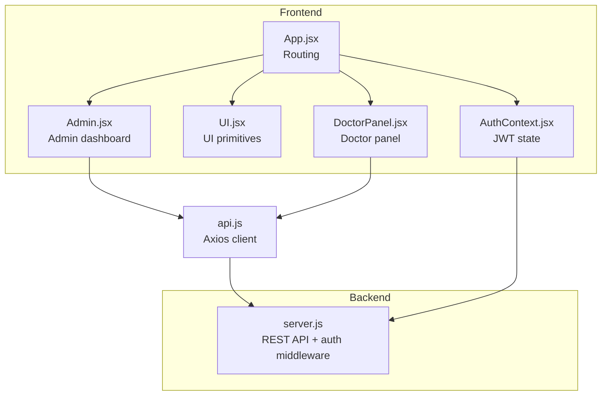
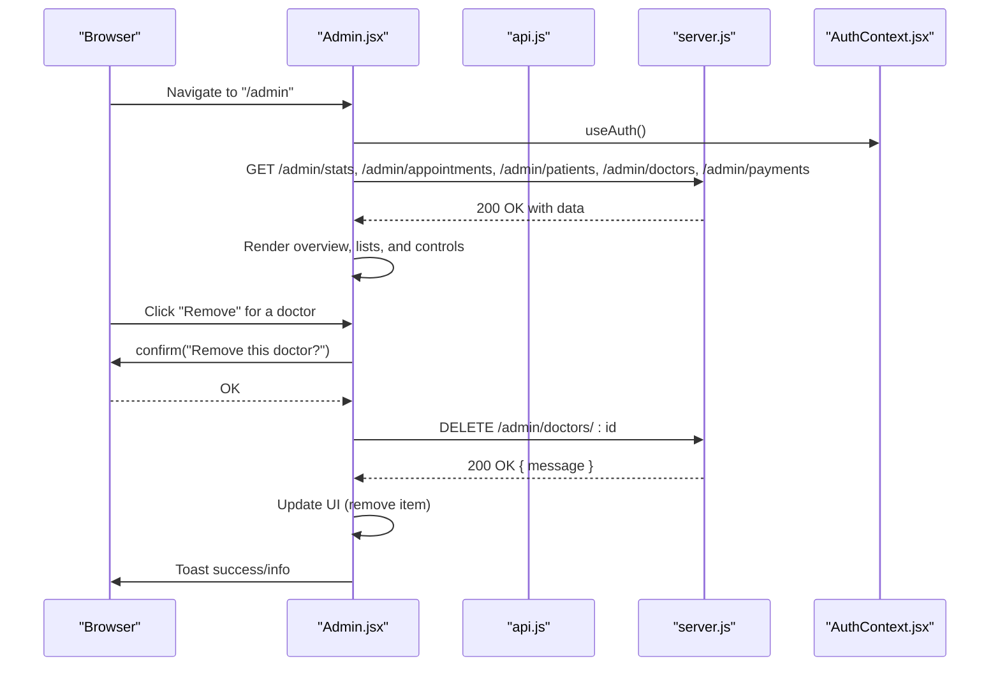
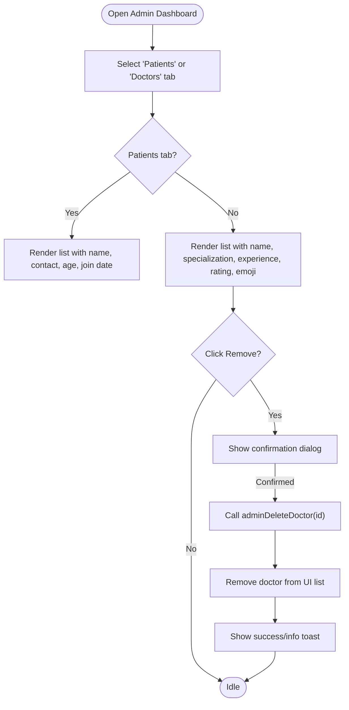
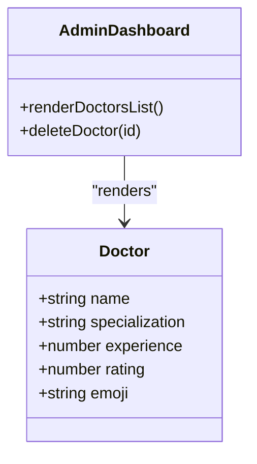
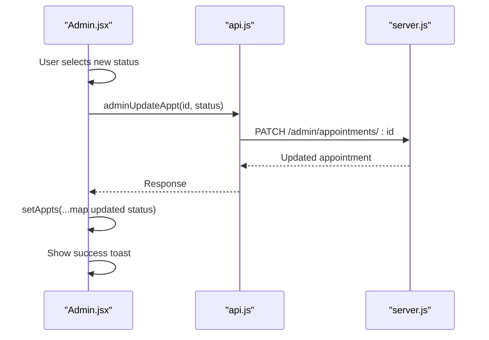
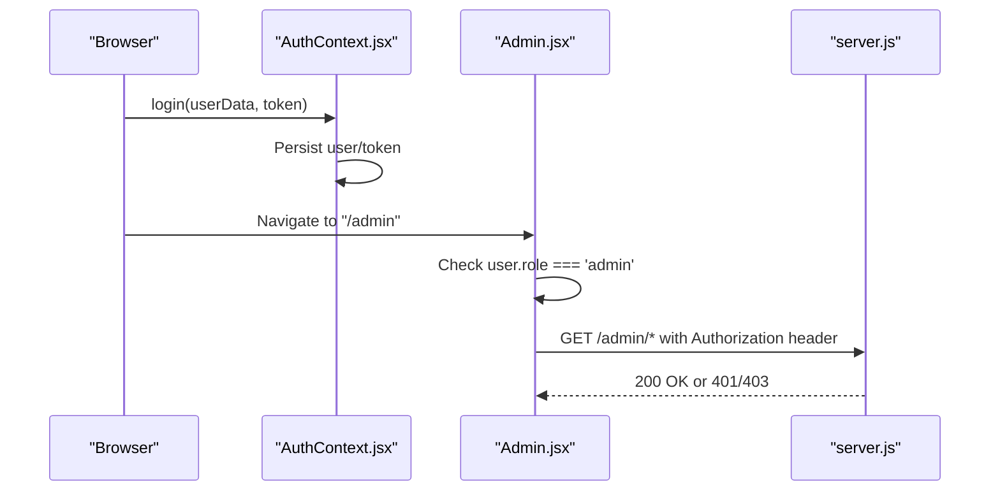
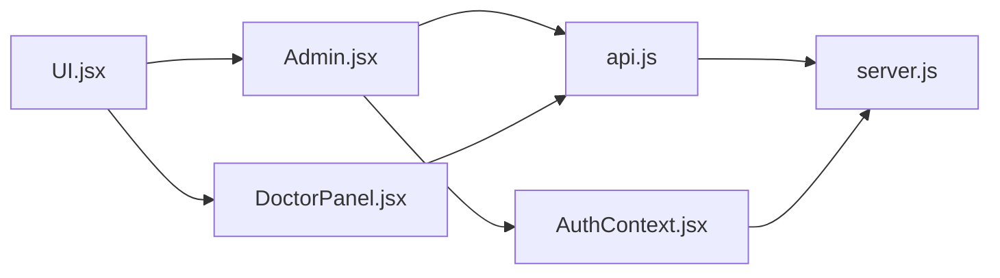

# User Management

<cite>
**Referenced Files in This Document**
- [Admin.jsx](file://Admin.jsx)
- [App.jsx](file://App.jsx)
- [AuthContext.jsx](file://AuthContext.jsx)
- [UI.jsx](file://UI.jsx)
- [api.js](file://api.js)
- [server.js](file://server.js)
- [README.md](file://README.md)
- [data.js](file://data.js)
- [DoctorPanel.jsx](file://DoctorPanel.jsx)
- [package.json](file://package.json)
- [style.css](file://style.css)
</cite>

## Table of Contents
1. [Introduction](#introduction)
2. [Project Structure](#project-structure)
3. [Core Components](#core-components)
4. [Architecture Overview](#architecture-overview)
5. [Detailed Component Analysis](#detailed-component-analysis)
6. [Dependency Analysis](#dependency-analysis)
7. [Performance Considerations](#performance-considerations)
8. [Troubleshooting Guide](#troubleshooting-guide)
9. [Conclusion](#conclusion)
10. [Appendices](#appendices)

## Introduction
This document describes the admin user management system focused on two primary user categories: patients and doctors. It explains how administrators can view and manage user data, how the doctor directory is presented with professional details and emoji representations, and how administrative actions affect user permissions and access. It also documents the doctor removal workflow with confirmation dialogs, user data display formats, search and filtering capabilities, user profile information presentation, verification processes, account status management, and bulk operations. Integration with the authentication system is covered to clarify how administrative privileges are enforced and how user sessions are maintained.

## Project Structure
The application is a full-stack React/Node.js/Express project with a clear separation of concerns:
- Frontend (React): Routing, UI components, authentication context, and page components.
- Backend (Node.js/Express): REST API with in-memory storage, JWT-based authentication middleware, and role-based access control.
- Shared API layer: Axios-based client functions encapsulating backend endpoints.

**Diagram sources**
- [App.jsx](file://App.jsx#L15-L44)
- [AuthContext.jsx](file://AuthContext.jsx#L6-L38)
- [UI.jsx](file://UI.jsx#L1-L182)
- [Admin.jsx](file://Admin.jsx#L1-L194)
- [DoctorPanel.jsx](file://DoctorPanel.jsx#L1-L96)
- [api.js](file://api.js#L1-L44)
- [server.js](file://server.js#L49-L62)

**Section sources**
- [App.jsx](file://App.jsx#L15-L44)
- [README.md](file://README.md#L7-L33)

## Core Components
- Admin dashboard: Provides overview statistics, manages appointments, lists patients, lists doctors, and displays payments.
- Authentication context: Manages JWT tokens, persisted theme preference, and exposes login/logout to the app.
- UI primitives: Toast notifications, spinner, status badges, and other reusable components.
- API client: Centralized axios-based functions for all backend endpoints.
- Backend server: Implements role-based protected routes and CRUD-like operations for admin-managed resources.

Key responsibilities:
- Admin.jsx orchestrates data fetching and rendering for admin tabs, handles appointment status updates, and doctor removal.
- AuthContext.jsx persists user session and sets Authorization headers for authenticated requests.
- UI.jsx provides shared UI elements used across pages.
- api.js defines endpoint contracts for admin, patient, doctor, and payment operations.
- server.js enforces auth via JWT and exposes admin endpoints for stats, appointments, patients, doctors, and payments.

**Section sources**
- [Admin.jsx](file://Admin.jsx#L7-L41)
- [AuthContext.jsx](file://AuthContext.jsx#L6-L38)
- [UI.jsx](file://UI.jsx#L5-L25)
- [api.js](file://api.js#L29-L44)
- [server.js](file://server.js#L242-L280)

## Architecture Overview
The admin user management system integrates frontend and backend components with role-based access control:

**Diagram sources**
- [Admin.jsx](file://Admin.jsx#L19-L41)
- [api.js](file://api.js#L30-L35)
- [server.js](file://server.js#L244-L280)
- [AuthContext.jsx](file://AuthContext.jsx#L21-L31)

## Detailed Component Analysis

### Admin Dashboard (Patients and Doctors)
- Patient directory interface:
  - Displays registration details: name, email, phone, age.
  - Shows join date derived from created_at.
  - Lists all registered patients.
- Doctor management interface:
  - Displays professional details: name, specialization, experience, rating.
  - Uses emoji representations for visual identification.
  - Provides a Remove button per doctor.
- Doctor removal:
  - Confirmation dialog prompt before deletion.
  - Calls adminDeleteDoctor(id) and removes the doctor from the UI list upon success.

**Diagram sources**
- [Admin.jsx](file://Admin.jsx#L122-L159)
- [api.js](file://api.js#L34-L35)
- [server.js](file://server.js#L275-L280)

**Section sources**
- [Admin.jsx](file://Admin.jsx#L122-L159)
- [api.js](file://api.js#L34-L35)
- [server.js](file://server.js#L275-L280)

### Doctor Directory and Professional Details
- The doctor list presents:
  - Name
  - Specialization
  - Experience in years
  - Rating
  - Emoji representation
- These fields are fetched from admin endpoints and rendered consistently across the UI.

**Diagram sources**
- [Admin.jsx](file://Admin.jsx#L142-L159)
- [server.js](file://server.js#L263-L265)

**Section sources**
- [Admin.jsx](file://Admin.jsx#L142-L159)
- [server.js](file://server.js#L263-L265)

### Appointment Status Management (Admin)
- Admins can change appointment statuses across pending, approved, cancelled, and completed.
- The changeApptStatus handler updates the backend and synchronously updates the UI state.

**Diagram sources**
- [Admin.jsx](file://Admin.jsx#L26-L32)
- [api.js](file://api.js#L34-L34)
- [server.js](file://server.js#L267-L273)

**Section sources**
- [Admin.jsx](file://Admin.jsx#L26-L32)
- [api.js](file://api.js#L34-L34)
- [server.js](file://server.js#L267-L273)

### Authentication and Role-Based Access
- Authentication context:
  - Persists user and token in localStorage.
  - Sets Authorization header for axios when a token exists.
  - Provides login and logout functions.
- Admin route protection:
  - Admin dashboard checks user role and redirects unauthorized users to admin login.
  - Backend authMiddleware enforces JWT and role checks for admin endpoints.

**Diagram sources**
- [AuthContext.jsx](file://AuthContext.jsx#L21-L31)
- [Admin.jsx](file://Admin.jsx#L19-L24)
- [server.js](file://server.js#L49-L62)

**Section sources**
- [AuthContext.jsx](file://AuthContext.jsx#L6-L38)
- [Admin.jsx](file://Admin.jsx#L19-L24)
- [server.js](file://server.js#L49-L62)

### UI Primitives Used by Admin
- Toast notifications: Centralized toast container and hook for feedback.
- Spinner: Loading indicator during initial data fetch.
- StatusBadge: Renders status labels with appropriate styling.

**Section sources**
- [UI.jsx](file://UI.jsx#L5-L25)
- [UI.jsx](file://UI.jsx#L178-L181)

### Payments Overview (Admin)
- Admins can view all payments, compute totals, and see enriched details (patient and doctor names).
- Payment data is fetched from admin endpoints and displayed in a list with localized dates and amounts.

**Section sources**
- [Admin.jsx](file://Admin.jsx#L161-L189)
- [api.js](file://api.js#L43-L43)
- [server.js](file://server.js#L362-L370)

### Doctor Panel (Context for Admin Actions)
- The doctor panel illustrates how statuses are managed from the provider’s perspective (pending/approved/cancelled).
- While distinct from admin actions, it demonstrates the broader status lifecycle that admins oversee.

**Section sources**
- [DoctorPanel.jsx](file://DoctorPanel.jsx#L22-L28)
- [server.js](file://server.js#L133-L153)

## Dependency Analysis
- Frontend dependencies:
  - React, react-router-dom, axios, and local storage for persistence.
- Backend dependencies:
  - Express, bcryptjs, jsonwebtoken, uuid, cors, and optional stripe for payments.
- Internal dependencies:
  - Admin.jsx depends on api.js for backend calls and AuthContext.jsx for authentication state.
  - UI.jsx provides shared components used by Admin.jsx and other pages.
  - server.js enforces authMiddleware and exposes admin routes.

**Diagram sources**
- [Admin.jsx](file://Admin.jsx#L1-L5)
- [UI.jsx](file://UI.jsx#L1-L3)
- [DoctorPanel.jsx](file://DoctorPanel.jsx#L1-L5)
- [api.js](file://api.js#L1-L3)
- [AuthContext.jsx](file://AuthContext.jsx#L1-L4)
- [server.js](file://server.js#L1-L25)

**Section sources**
- [package.json](file://package.json#L14-L22)
- [Admin.jsx](file://Admin.jsx#L1-L5)
- [UI.jsx](file://UI.jsx#L1-L3)
- [DoctorPanel.jsx](file://DoctorPanel.jsx#L1-L5)
- [api.js](file://api.js#L1-L3)
- [AuthContext.jsx](file://AuthContext.jsx#L1-L4)
- [server.js](file://server.js#L1-L25)

## Performance Considerations
- Initial data loading: Admin.jsx uses Promise.all to fetch overview, appointments, patients, doctors, and payments concurrently, reducing perceived latency.
- Local state updates: After successful adminUpdateAppt and adminDeleteDoctor, the UI updates immediately without refetching, improving responsiveness.
- Rendering lists: Using map over arrays and memoizing computed values (e.g., counts) helps keep renders efficient.
- Recommendations:
  - Consider pagination for very large datasets (patients/doctors/payments).
  - Debounce search filters if extended search capabilities are added.
  - Lazy-load heavy components if the admin dashboard grows further.

[No sources needed since this section provides general guidance]

## Troubleshooting Guide
Common issues and resolutions:
- Unauthorized access to admin routes:
  - Ensure the user has role=admin and a valid JWT token stored. The admin page redirects unauthenticated users to the admin login.
- Token not applied to requests:
  - Verify that AuthContext sets Authorization header when a token exists.
- Doctor removal fails:
  - Confirm the backend responds with 200 OK and that the client-side filter removes the doctor by ID.
- Appointment status update errors:
  - Check that the selected status is valid and that the backend returns the updated appointment object.

**Section sources**
- [Admin.jsx](file://Admin.jsx#L19-L24)
- [AuthContext.jsx](file://AuthContext.jsx#L11-L14)
- [api.js](file://api.js#L34-L35)
- [server.js](file://server.js#L275-L280)
- [server.js](file://server.js#L267-L273)

## Conclusion
The admin user management system provides a cohesive interface for overseeing patients and doctors, with clear views for registration details, professional profiles, and financial transactions. Role-based authentication ensures secure access, while UI primitives deliver consistent feedback. Administrative actions like changing appointment statuses and removing doctors are straightforward and visually confirmed. The system’s modular design supports future enhancements such as search and filtering, bulk operations, and deeper integration with external services.

[No sources needed since this section summarizes without analyzing specific files]

## Appendices

### User Data Display Formats
- Patients:
  - Name, email, phone, age, joined date (derived from created_at).
- Doctors:
  - Name, specialization, experience (years), rating, emoji.
- Payments:
  - Patient and doctor names, amount, currency, method, transaction reference, paid date.

**Section sources**
- [Admin.jsx](file://Admin.jsx#L127-L134)
- [Admin.jsx](file://Admin.jsx#L147-L154)
- [Admin.jsx](file://Admin.jsx#L172-L184)

### Search and Filtering Capabilities
- Public doctor search and filtering:
  - Endpoint supports query parameters for search and specialization.
- Admin scope:
  - Admins can view all patients and doctors without search filters in the current UI.
- Recommendations:
  - Extend Admin.jsx with search inputs and apply filters client-side or server-side.

**Section sources**
- [server.js](file://server.js#L117-L123)
- [Admin.jsx](file://Admin.jsx#L122-L159)

### User Verification and Account Status Management
- Verification:
  - Admins rely on backend-provided data; no explicit verification UI is present in Admin.jsx.
- Status management:
  - Admins can change appointment statuses (pending, approved, cancelled, completed).
  - Doctor removal is supported via adminDeleteDoctor.

**Section sources**
- [Admin.jsx](file://Admin.jsx#L26-L32)
- [api.js](file://api.js#L34-L35)
- [server.js](file://server.js#L267-L280)

### Bulk Operations
- Not implemented in Admin.jsx.
- Potential approaches:
  - Multi-select checkboxes in the patient/doctor lists.
  - Batch actions invoking backend endpoints for bulk updates/deletes.

[No sources needed since this section proposes conceptual enhancements]

### Theme and Styling
- Dark mode toggle persists in localStorage and applies a theme attribute to the document root.
- Styles define cards, badges, buttons, and responsive layouts.

**Section sources**
- [AuthContext.jsx](file://AuthContext.jsx#L16-L19)
- [style.css](file://style.css#L35-L58)
- [style.css](file://style.css#L158-L165)