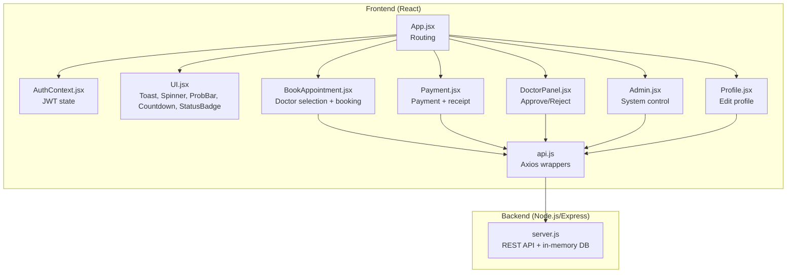
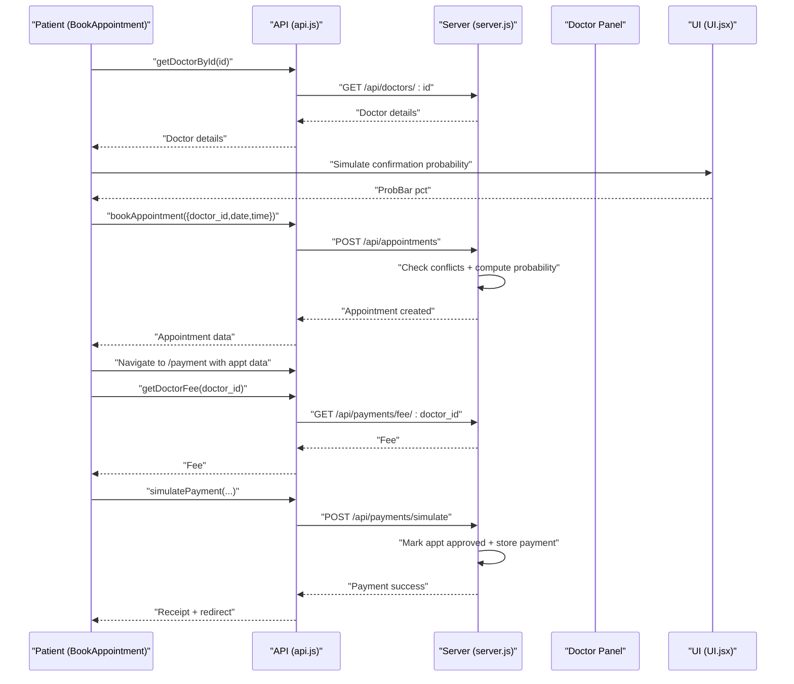
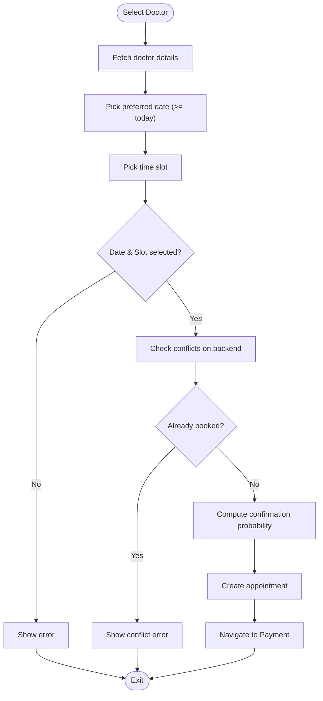
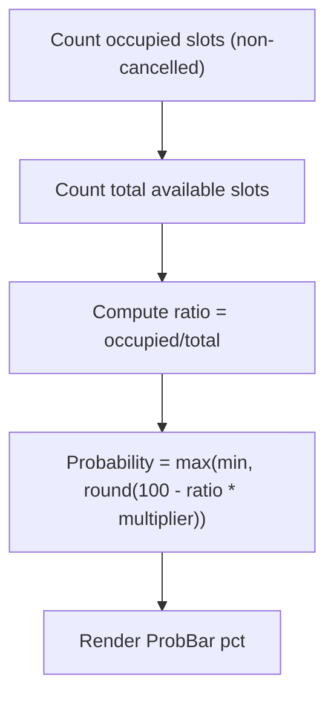
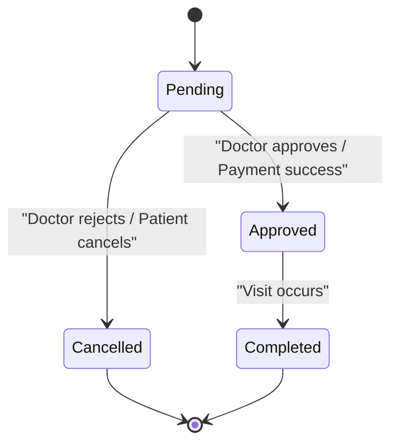
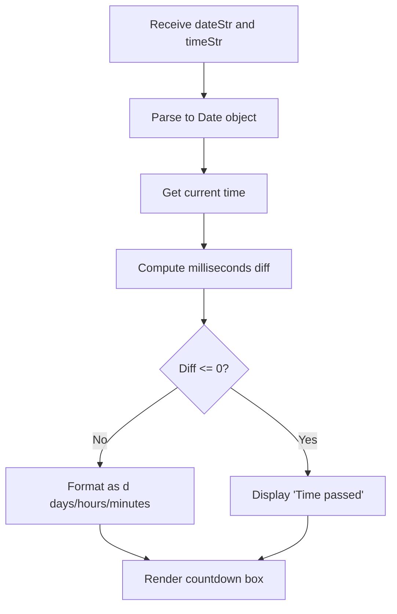
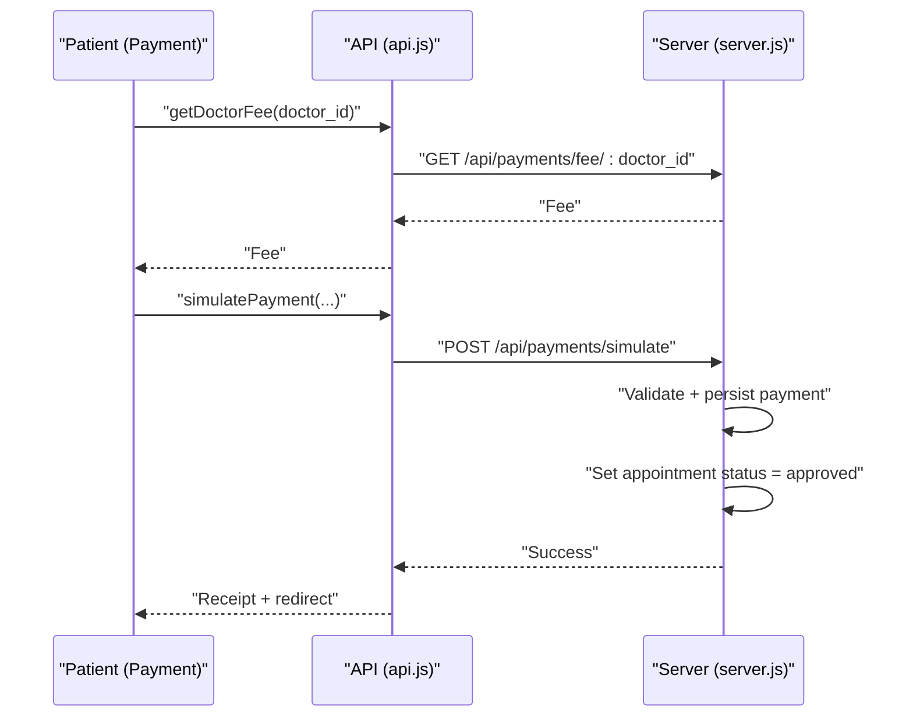
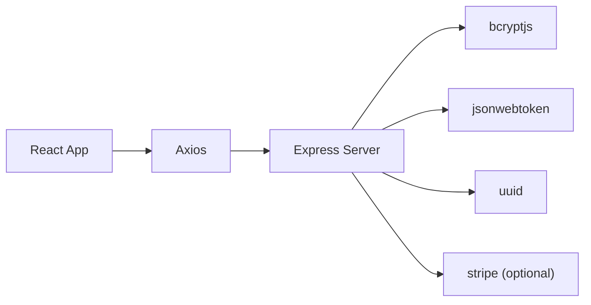

# Appointment Booking System

<cite>
**Referenced Files in This Document**
- [README.md](file://README.md)
- [App.jsx](file://App.jsx)
- [AuthContext.jsx](file://AuthContext.jsx)
- [api.js](file://api.js)
- [BookAppointment.jsx](file://BookAppointment.jsx)
- [DoctorPanel.jsx](file://DoctorPanel.jsx)
- [Payment.jsx](file://Payment.jsx)
- [server.js](file://server.js)
- [UI.jsx](file://UI.jsx)
- [Admin.jsx](file://Admin.jsx)
- [Profile.jsx](file://Profile.jsx)
- [package.json](file://package.json)
</cite>

## Table of Contents
1. [Introduction](#introduction)
2. [Project Structure](#project-structure)
3. [Core Components](#core-components)
4. [Architecture Overview](#architecture-overview)
5. [Detailed Component Analysis](#detailed-component-analysis)
6. [Dependency Analysis](#dependency-analysis)
7. [Performance Considerations](#performance-considerations)
8. [Troubleshooting Guide](#troubleshooting-guide)
9. [Conclusion](#conclusion)
10. [Appendices](#appendices)

## Introduction
This document explains the complete Doctor appointment booking system implemented in a full-stack React + Node.js/Express application. It covers the end-to-end booking workflow from doctor selection to confirmation, the time slot selection interface with real-time availability and conflict detection, the confirmation probability system, appointment status management, countdown timers, receipt generation, cancellation/rescheduling processes, the doctor panel for approvals, and the payment integration for booking fees. It also includes examples of booking scenarios, error handling, and notification systems.

## Project Structure
The system is organized into:
- Frontend (React): routing, authentication context, UI components, and page components for booking, payments, doctor panel, admin, and profile.
- Backend (Node.js/Express): in-memory database, JWT authentication middleware, REST APIs for authentication, doctors, appointments, payments, and admin operations.

**Diagram sources**
- [App.jsx](file://App.jsx#L15-L42)
- [AuthContext.jsx](file://AuthContext.jsx#L6-L37)
- [UI.jsx](file://UI.jsx#L11-L25)
- [BookAppointment.jsx](file://BookAppointment.jsx#L1-L171)
- [Payment.jsx](file://Payment.jsx#L23-L296)
- [DoctorPanel.jsx](file://DoctorPanel.jsx#L7-L96)
- [Admin.jsx](file://Admin.jsx#L7-L194)
- [Profile.jsx](file://Profile.jsx#L7-L97)
- [api.js](file://api.js#L1-L44)
- [server.js](file://server.js#L1-L390)

**Section sources**
- [README.md](file://README.md#L7-L33)
- [App.jsx](file://App.jsx#L1-L44)
- [AuthContext.jsx](file://AuthContext.jsx#L1-L41)
- [api.js](file://api.js#L1-L44)
- [server.js](file://server.js#L29-L44)

## Core Components
- Authentication and routing: centralized in App.jsx with AuthProvider managing JWT tokens and theme persistence.
- Booking workflow: BookAppointment page handles doctor selection, date/time selection, confirmation probability simulation, and redirects to Payment.
- Payment flow: Payment page supports multiple methods, order summary, validation, simulated payment processing, and receipt display with print support.
- Doctor panel: DoctorPanel lists incoming appointments, filters by status, and allows approving or rejecting.
- Admin panel: Admin dashboard aggregates stats, manages appointments, patients, doctors, and payments.
- UI utilities: Toast notifications, spinner, star ratings, confirmation probability bar, countdown timer, and status badges.
- Backend APIs: Authentication, doctor listings, reviews, appointments, payments, and admin controls.

**Section sources**
- [App.jsx](file://App.jsx#L15-L42)
- [BookAppointment.jsx](file://BookAppointment.jsx#L7-L171)
- [Payment.jsx](file://Payment.jsx#L23-L296)
- [DoctorPanel.jsx](file://DoctorPanel.jsx#L7-L96)
- [Admin.jsx](file://Admin.jsx#L7-L194)
- [UI.jsx](file://UI.jsx#L5-L182)
- [server.js](file://server.js#L67-L111)

## Architecture Overview
The frontend communicates with the backend via Axios API wrappers. Authentication is handled with JWT tokens persisted in localStorage. The backend enforces role-based access using middleware and maintains an in-memory database.

**Diagram sources**
- [BookAppointment.jsx](file://BookAppointment.jsx#L28-L60)
- [Payment.jsx](file://Payment.jsx#L49-L98)
- [api.js](file://api.js#L13-L18)
- [server.js](file://server.js#L170-L202)
- [server.js](file://server.js#L318-L353)
- [UI.jsx](file://UI.jsx#L43-L58)

## Detailed Component Analysis

### Booking Workflow: Doctor Selection to Confirmation
- Doctor selection: The BookAppointment page fetches doctor details by ID and displays available time slots parsed from the doctor’s schedule.
- Time slot selection: Users pick a date (min today) and a time slot; the UI highlights the selected slot.
- Real-time availability and conflict detection: On booking submission, the backend checks for existing appointments at the same doctor, date, and time with non-cancelled status and rejects duplicates.
- Confirmation probability: The frontend simulates a probability bar; the backend computes a deterministic probability based on the doctor’s scheduled slots vs. current bookings on that day.
- Redirect to payment: On successful booking, the app navigates to the Payment page with appointment details.

**Diagram sources**
- [BookAppointment.jsx](file://BookAppointment.jsx#L28-L60)
- [server.js](file://server.js#L170-L202)
- [server.js](file://server.js#L181-L184)

**Section sources**
- [BookAppointment.jsx](file://BookAppointment.jsx#L28-L60)
- [server.js](file://server.js#L170-L202)
- [server.js](file://server.js#L181-L184)

### Time Slot Selection Interface and Real-Time Availability
- Date picker enforces minimum date as today and clears the selected slot when date changes.
- Available slots are rendered as selectable buttons; selection updates the local state and probability simulation.
- Backend conflict check prevents double-booking for the same doctor/date/time with non-cancelled status.

**Section sources**
- [BookAppointment.jsx](file://BookAppointment.jsx#L95-L114)
- [server.js](file://server.js#L178-L179)

### Confirmation Probability System
- Calculation methodology: The backend computes the probability as a function of the number of existing bookings versus total available slots for the selected day. The formula caps the probability between a minimum threshold and a maximum derived from the ratio of occupied slots to total slots.
- Frontend visualization: A probability bar renders the percentage and a contextual label (High/Medium/Low) based on thresholds.

**Diagram sources**
- [server.js](file://server.js#L181-L184)
- [UI.jsx](file://UI.jsx#L43-L58)

**Section sources**
- [server.js](file://server.js#L181-L184)
- [UI.jsx](file://UI.jsx#L43-L58)

### Appointment Status Management
Supported statuses: pending, approved, cancelled, completed. The system enforces:
- Patient creates pending appointment.
- Doctor approves or cancels (doctor-specific).
- Admin can override statuses and mark completed.
- Payment flow marks the appointment approved upon successful payment.

**Diagram sources**
- [server.js](file://server.js#L144-L153)
- [server.js](file://server.js#L210-L217)
- [server.js](file://server.js#L267-L272)
- [server.js](file://server.js#L347-L350)

**Section sources**
- [server.js](file://server.js#L144-L153)
- [server.js](file://server.js#L210-L217)
- [server.js](file://server.js#L267-L272)
- [server.js](file://server.js#L347-L350)

### Countdown Timer Implementation
- The Countdown component calculates the difference between the appointment datetime and current time, updating every minute.
- It displays remaining days/hours/minutes and a special label when the time has passed.

**Diagram sources**
- [UI.jsx](file://UI.jsx#L60-L86)

**Section sources**
- [UI.jsx](file://UI.jsx#L60-L86)

### Receipt Generation and Printing
- After payment, the Payment page shows a receipt with transaction reference, amount paid, doctor, date/time, method, and status.
- Users can print the receipt directly from the browser.

**Section sources**
- [Payment.jsx](file://Payment.jsx#L260-L280)

### Cancellation and Rescheduling Processes
- Patient cancellation: The patient can cancel their own appointment; the backend sets status to cancelled.
- Doctor rejection: The doctor can reject pending appointments; the backend sets status to cancelled.
- Rescheduling: Not implemented in the current code; rescheduling would require a new booking and cancellation of the old appointment.
- Policy enforcement: There is no explicit cancellation policy enforced in code; cancellation is allowed and updates status accordingly.

**Section sources**
- [server.js](file://server.js#L210-L217)
- [DoctorPanel.jsx](file://DoctorPanel.jsx#L22-L28)

### Doctor Panel: Approval and Rejection Workflows
- The DoctorPanel lists all incoming appointments for the logged-in doctor, filtered by status.
- Approve or reject actions update the appointment status and show toast notifications.

**Section sources**
- [DoctorPanel.jsx](file://DoctorPanel.jsx#L15-L28)
- [DoctorPanel.jsx](file://DoctorPanel.jsx#L30-L92)
- [server.js](file://server.js#L144-L153)

### Payment Integration for Booking Fees
- Fee lookup: The Payment page queries the doctor’s consultation fee by specialization.
- Payment methods: Card, EasyPaisa, JazzCash, Bank Transfer.
- Validation: Frontend validation per method; backend validation for card details.
- Processing: Simulated payment endpoint updates appointment status to approved and stores payment record.

**Diagram sources**
- [Payment.jsx](file://Payment.jsx#L49-L98)
- [server.js](file://server.js#L318-L353)

**Section sources**
- [Payment.jsx](file://Payment.jsx#L49-L98)
- [server.js](file://server.js#L287-L295)
- [server.js](file://server.js#L318-L353)

### Notification Systems
- Toast notifications: Centralized toast container and hook for displaying success, info, and error messages across components.
- Status badges: Visual indicators for appointment status in doctor and admin panels.

**Section sources**
- [UI.jsx](file://UI.jsx#L11-L25)
- [UI.jsx](file://UI.jsx#L178-L181)
- [DoctorPanel.jsx](file://DoctorPanel.jsx#L26-L27)
- [Admin.jsx](file://Admin.jsx#L30-L31)

### Examples of Booking Scenarios
- Scenario 1: Select a doctor, choose a future date and available slot, confirm booking, proceed to payment, and receive a receipt.
- Scenario 2: Attempt to book the same slot twice on the same day; the backend returns a conflict error.
- Scenario 3: Doctor rejects a pending appointment; the patient receives a toast and the status updates to cancelled.

**Section sources**
- [BookAppointment.jsx](file://BookAppointment.jsx#L39-L60)
- [server.js](file://server.js#L178-L179)
- [DoctorPanel.jsx](file://DoctorPanel.jsx#L22-L28)

## Dependency Analysis
- Frontend depends on:
  - React Router for navigation.
  - Axios for API calls.
  - LocalStorage for JWT and theme persistence.
- Backend depends on:
  - Express for HTTP server.
  - bcrypt for password hashing.
  - jsonwebtoken for JWT signing.
  - uuid for generating IDs.
  - stripe for payment intents (optional; fallback simulated payment endpoint exists).

**Diagram sources**
- [package.json](file://package.json#L14-L22)
- [AuthContext.jsx](file://AuthContext.jsx#L1-L41)
- [api.js](file://api.js#L1-L44)
- [server.js](file://server.js#L5-L20)

**Section sources**
- [package.json](file://package.json#L14-L22)
- [AuthContext.jsx](file://AuthContext.jsx#L1-L41)
- [api.js](file://api.js#L1-L44)
- [server.js](file://server.js#L5-L20)

## Performance Considerations
- In-memory storage: Suitable for demos but not scalable; consider migrating to a relational database for production.
- Frontend rendering: Keep re-renders minimal by avoiding unnecessary state updates during slot selection.
- API calls: Batch admin dashboard requests to reduce network overhead.
- Payment simulation: Introduce realistic delays and handle errors gracefully.

## Troubleshooting Guide
- Authentication failures: Verify JWT presence and validity; ensure Authorization header is set.
- Booking conflicts: Ensure the selected slot is not already booked for the same doctor on the chosen date.
- Payment errors: Validate inputs per method; check simulated payment response for error messages.
- Missing receipts: Confirm the appointment was marked approved and payment recorded.

**Section sources**
- [AuthContext.jsx](file://AuthContext.jsx#L11-L14)
- [server.js](file://server.js#L49-L62)
- [server.js](file://server.js#L178-L179)
- [Payment.jsx](file://Payment.jsx#L94-L98)

## Conclusion
The Doctor appointment booking system provides a complete workflow from doctor discovery to payment and confirmation. It includes real-time conflict detection, a probabilistic confirmation indicator, robust status management, a doctor panel for approvals, and a payment integration with receipts. While designed as a demo with in-memory storage, the modular architecture supports straightforward migration to persistent storage and enhanced features like rescheduling, cancellation policies, and notifications.

## Appendices

### API Reference Summary
- Authentication
  - POST /api/auth/register
  - POST /api/auth/login
  - POST /api/auth/doctor-login
  - POST /api/auth/admin-login
- Doctors
  - GET /api/doctors
  - GET /api/doctors/:id
  - POST /api/doctors/:id/review
- Appointments
  - POST /api/appointments
  - GET /api/appointments
  - PATCH /api/appointments/:id/cancel
- Doctor Panel
  - GET /api/doctor/appointments
  - PATCH /api/doctor/appointments/:id
- Admin
  - GET /api/admin/stats
  - GET /api/admin/appointments
  - GET /api/admin/patients
  - GET /api/admin/doctors
  - PATCH /api/admin/appointments/:id
  - DELETE /api/admin/doctors/:id
  - GET /api/admin/payments
- Payments
  - GET /api/payments/fee/:doctor_id
  - POST /api/payments/simulate
  - GET /api/payments/:appointment_id

**Section sources**
- [api.js](file://api.js#L6-L44)
- [server.js](file://server.js#L67-L377)