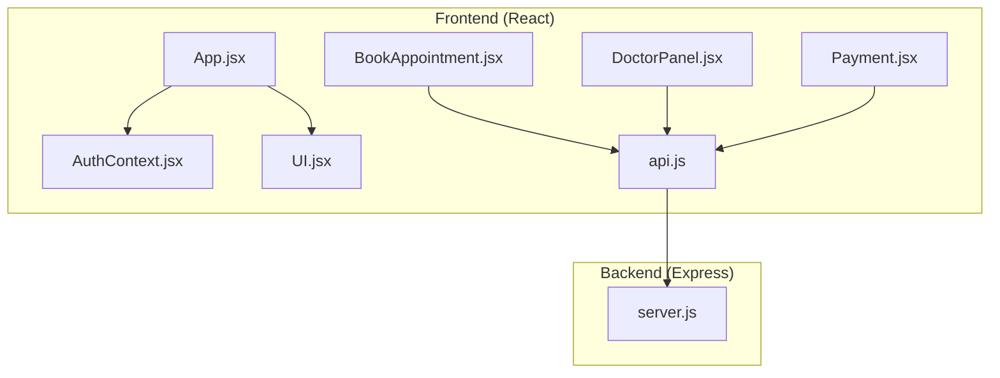
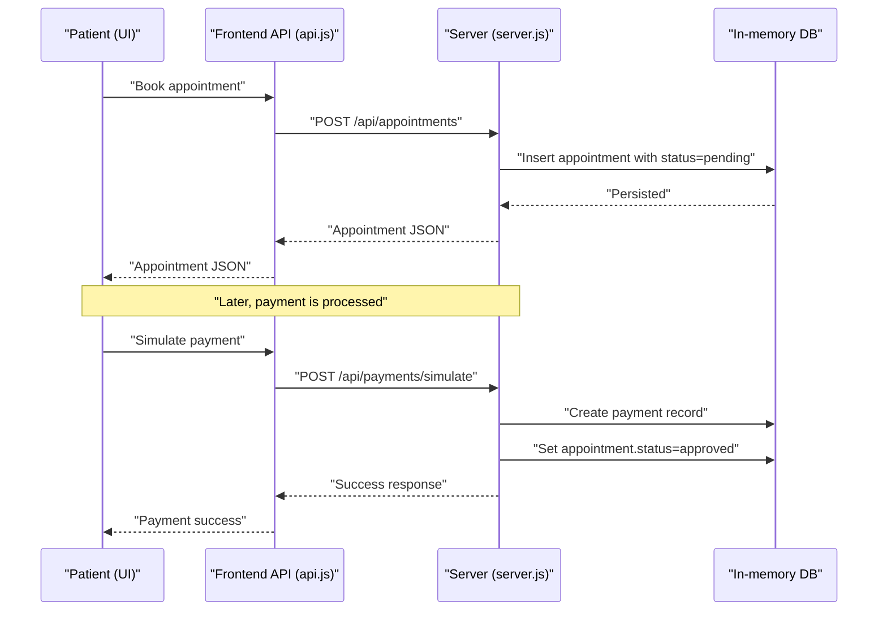
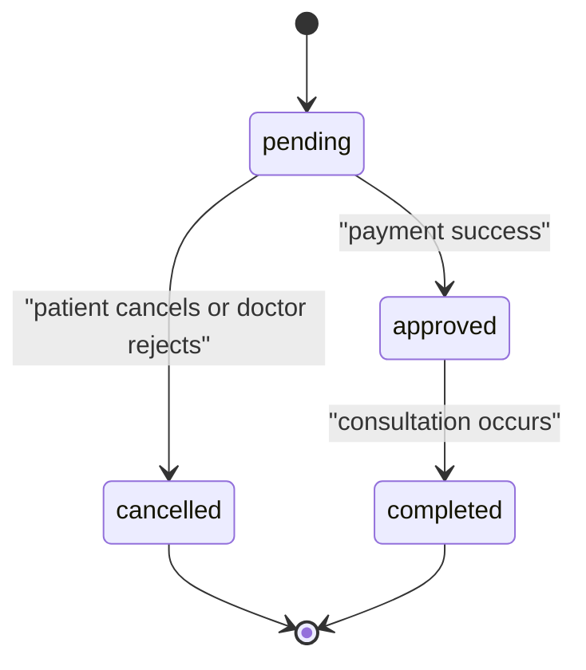
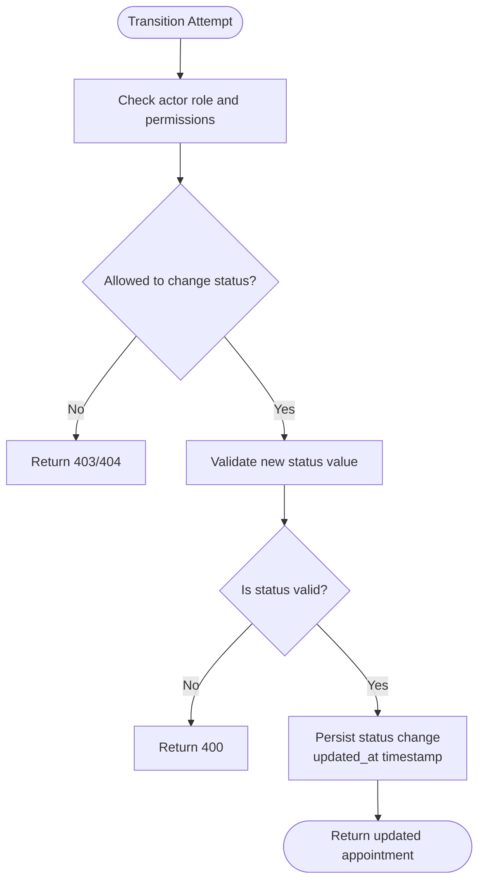
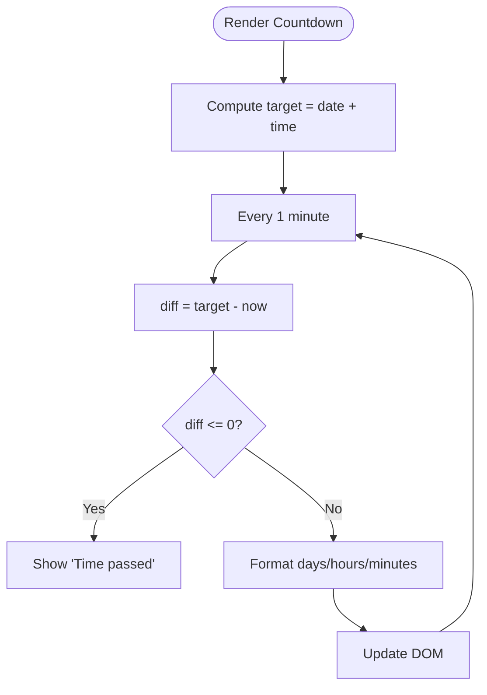
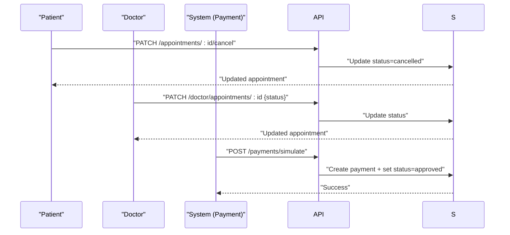
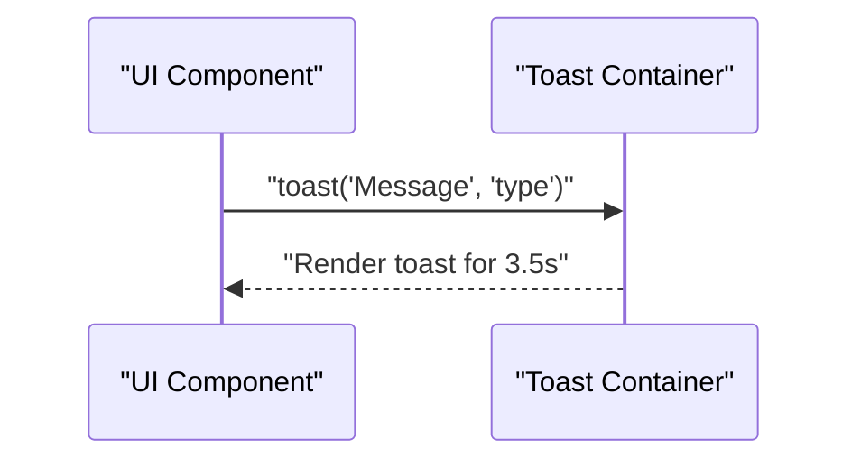
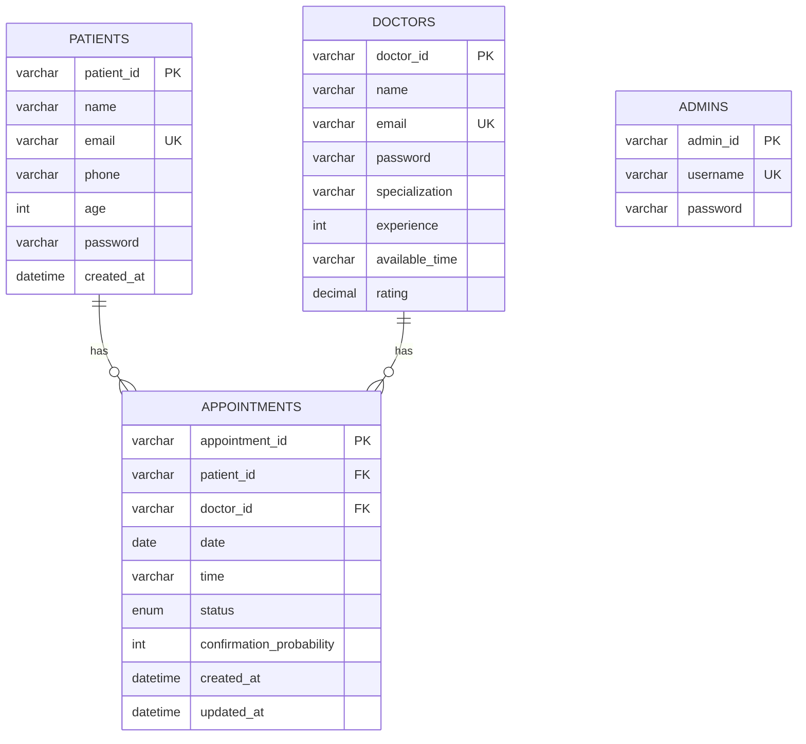
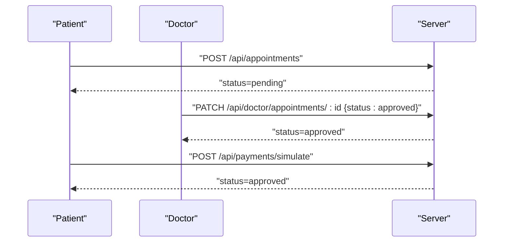
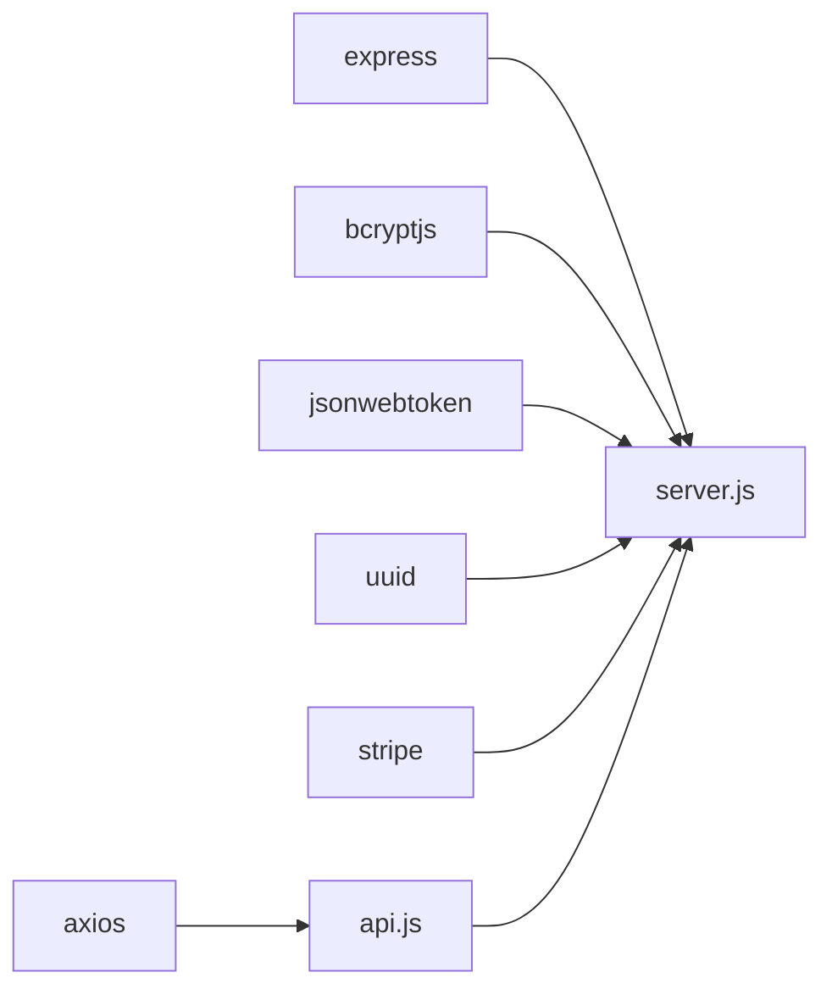

# Appointment Status Management

<cite>
**Referenced Files in This Document**
- [server.js](file://server.js)
- [api.js](file://api.js)
- [BookAppointment.jsx](file://BookAppointment.jsx)
- [DoctorPanel.jsx](file://DoctorPanel.jsx)
- [Payment.jsx](file://Payment.jsx)
- [AuthContext.jsx](file://AuthContext.jsx)
- [App.jsx](file://App.jsx)
- [UI.jsx](file://UI.jsx)
- [README.md](file://README.md)
- [package.json](file://package.json)
</cite>

## Table of Contents
1. [Introduction](#introduction)
2. [Project Structure](#project-structure)
3. [Core Components](#core-components)
4. [Architecture Overview](#architecture-overview)
5. [Detailed Component Analysis](#detailed-component-analysis)
6. [Dependency Analysis](#dependency-analysis)
7. [Performance Considerations](#performance-considerations)
8. [Troubleshooting Guide](#troubleshooting-guide)
9. [Conclusion](#conclusion)
10. [Appendices](#appendices)

## Introduction
This document describes the appointment status management system implemented in the MediBook application. It covers the lifecycle of appointment states (pending, approved, cancelled), state transition logic and validation rules, the countdown timer for reminders, automatic cancellation policies, status update mechanisms triggered by patient actions, doctor approvals, and system events, the notification system for status changes, the database schema for storing appointment status history and audit trails, API endpoints for status queries and updates, typical status workflows, edge cases in state transitions, and error handling for invalid status changes.

## Project Structure
The application follows a classic full-stack separation:
- Backend: Node.js/Express REST API with in-memory storage
- Frontend: React SPA with routing, authentication context, and UI components
- Shared API layer: centralized axios-based API module

**Diagram sources**
- [App.jsx](file://App.jsx#L1-L44)
- [AuthContext.jsx](file://AuthContext.jsx#L1-L41)
- [UI.jsx](file://UI.jsx#L1-L182)
- [BookAppointment.jsx](file://BookAppointment.jsx#L1-L171)
- [DoctorPanel.jsx](file://DoctorPanel.jsx#L1-L96)
- [Payment.jsx](file://Payment.jsx#L1-L350)
- [api.js](file://api.js#L1-L44)
- [server.js](file://server.js#L1-L390)

**Section sources**
- [README.md](file://README.md#L1-L159)
- [App.jsx](file://App.jsx#L1-L44)
- [AuthContext.jsx](file://AuthContext.jsx#L1-L41)
- [UI.jsx](file://UI.jsx#L1-L182)
- [BookAppointment.jsx](file://BookAppointment.jsx#L1-L171)
- [DoctorPanel.jsx](file://DoctorPanel.jsx#L1-L96)
- [Payment.jsx](file://Payment.jsx#L1-L350)
- [api.js](file://api.js#L1-L44)
- [server.js](file://server.js#L1-L390)

## Core Components
- Backend API server exposing endpoints for authentication, doctor listings, appointments, and payments
- Frontend API wrapper encapsulating HTTP calls to the backend
- UI components providing booking, doctor panel, payment, and countdown timer
- Authentication context managing JWT tokens and persisted theme preference
- In-memory database simulating relational tables for patients, doctors, appointments, and payments

Key implementation references:
- Appointment creation and state initialization to pending
- Doctor approval/rejection transitions
- Patient-initiated cancellation
- Payment simulation triggering approval upon successful payment
- Doctor panel filtering and status updates
- Countdown timer rendering

**Section sources**
- [server.js](file://server.js#L168-L218)
- [server.js](file://server.js#L144-L153)
- [server.js](file://server.js#L210-L217)
- [server.js](file://server.js#L297-L353)
- [DoctorPanel.jsx](file://DoctorPanel.jsx#L1-L96)
- [UI.jsx](file://UI.jsx#L60-L86)
- [api.js](file://api.js#L16-L24)
- [api.js](file://api.js#L39-L44)

## Architecture Overview
The system uses a layered architecture:
- Presentation Layer: React pages and components
- Application Layer: API module and route handlers
- Persistence Abstraction: In-memory arrays simulating tables

**Diagram sources**
- [BookAppointment.jsx](file://BookAppointment.jsx#L39-L60)
- [api.js](file://api.js#L17-L19)
- [server.js](file://server.js#L170-L202)
- [server.js](file://server.js#L297-L353)

## Detailed Component Analysis

### Appointment State Lifecycle
Supported statuses: pending, approved, cancelled, completed. The current implementation defines four statuses in the schema but does not expose a completed state endpoint in the backend routes. The primary transitions are:
- pending → approved: upon successful payment
- pending → cancelled: by patient or doctor
- approved → completed: not exposed in current backend routes

**Section sources**
- [README.md](file://README.md#L129-L140)
- [server.js](file://server.js#L195-L196)
- [server.js](file://server.js#L347-L350)

### State Transition Logic and Validation Rules
- Booking creates an appointment with status pending and checks for existing non-cancelled conflicts on the same doctor/time slot.
- Doctor approval/rejection accepts only approved or cancelled.
- Patient cancellation sets status to cancelled.
- Payment simulation sets status to approved and records payment_id.

**Diagram sources**
- [server.js](file://server.js#L144-L153)
- [server.js](file://server.js#L210-L217)
- [server.js](file://server.js#L177-L179)

**Section sources**
- [server.js](file://server.js#L170-L202)
- [server.js](file://server.js#L144-L153)
- [server.js](file://server.js#L210-L217)
- [server.js](file://server.js#L297-L353)

### Countdown Timer Implementation
The frontend renders a countdown until the appointment time. It computes the difference between the current time and the target datetime, updating every minute.

**Diagram sources**
- [UI.jsx](file://UI.jsx#L60-L86)

**Section sources**
- [UI.jsx](file://UI.jsx#L60-L86)

### Automatic Cancellation Policies
Automatic cancellation is not implemented in the current backend. No scheduled jobs or background tasks exist to cancel pending appointments after a timeout. The system relies on explicit actions (patient cancellation or doctor rejection) to move appointments out of pending.

**Section sources**
- [server.js](file://server.js#L177-L179)
- [server.js](file://server.js#L210-L217)
- [server.js](file://server.js#L144-L153)

### Status Update Mechanisms
- Patient actions:
  - Cancel appointment: PATCH /api/appointments/:id/cancel
- Doctor actions:
  - Approve or reject: PATCH /api/doctor/appointments/:id with status approved or cancelled
- System events:
  - Payment success triggers approval via /api/payments/simulate

**Diagram sources**
- [api.js](file://api.js#L19-L19)
- [api.js](file://api.js#L23-L23)
- [api.js](file://api.js#L41-L41)
- [server.js](file://server.js#L210-L217)
- [server.js](file://server.js#L144-L153)
- [server.js](file://server.js#L297-L353)

**Section sources**
- [api.js](file://api.js#L19-L19)
- [api.js](file://api.js#L23-L23)
- [api.js](file://api.js#L41-L41)
- [server.js](file://server.js#L210-L217)
- [server.js](file://server.js#L144-L153)
- [server.js](file://server.js#L297-L353)

### Notification System
- Toast notifications are implemented in the UI for user feedback during status changes and errors.
- Email/SMS alerts are not implemented in the current codebase.

**Diagram sources**
- [UI.jsx](file://UI.jsx#L5-L25)
- [DoctorPanel.jsx](file://DoctorPanel.jsx#L22-L28)

**Section sources**
- [UI.jsx](file://UI.jsx#L5-L25)
- [DoctorPanel.jsx](file://DoctorPanel.jsx#L22-L28)

### Database Schema for Status History and Audit Trails
The schema defines appointment status and timestamps. While the current backend does not maintain a separate status history table, the created_at and updated_at fields serve as audit trail indicators per appointment record.

**Diagram sources**
- [README.md](file://README.md#L103-L148)

**Section sources**
- [README.md](file://README.md#L103-L148)

### API Endpoints for Status Queries and Updates
- GET /api/appointments: List patient’s appointments
- PATCH /api/appointments/:id/cancel: Cancel appointment (patient)
- GET /api/doctor/appointments: List doctor’s appointments
- PATCH /api/doctor/appointments/:id: Update status (doctor)
- POST /api/payments/simulate: Simulate payment; sets status to approved
- GET /api/admin/stats: Admin stats including counts per status
- PATCH /api/admin/appointments/:id: Admin override status

**Section sources**
- [server.js](file://server.js#L204-L208)
- [server.js](file://server.js#L210-L217)
- [server.js](file://server.js#L133-L142)
- [server.js](file://server.js#L144-L153)
- [server.js](file://server.js#L297-L353)
- [server.js](file://server.js#L244-L253)
- [server.js](file://server.js#L267-L273)

### Typical Status Workflows
- Patient books appointment → status pending
- Doctor approves → status approved
- Patient pays → status approved (via payment simulation)
- Doctor rejects → status cancelled
- Patient cancels → status cancelled

**Diagram sources**
- [server.js](file://server.js#L170-L202)
- [server.js](file://server.js#L144-L153)
- [server.js](file://server.js#L297-L353)

**Section sources**
- [server.js](file://server.js#L170-L202)
- [server.js](file://server.js#L144-L153)
- [server.js](file://server.js#L297-L353)

### Edge Cases in State Transitions
- Attempting to approve/reject with invalid status values returns 400
- Cancelling an appointment not owned by the patient returns 404
- Updating a non-existent appointment returns 404
- Booking during a conflicting non-cancelled slot returns 409

**Section sources**
- [server.js](file://server.js#L149-L149)
- [server.js](file://server.js#L212-L213)
- [server.js](file://server.js#L147-L147)
- [server.js](file://server.js#L178-L179)

### Error Handling for Invalid Status Changes
- Validation failures return 400 with error message
- Not found returns 404 with error message
- Access denied returns 403 for unauthorized roles
- Invalid/expired token returns 401

**Section sources**
- [server.js](file://server.js#L149-L149)
- [server.js](file://server.js#L212-L213)
- [server.js](file://server.js#L54-L61)

## Dependency Analysis
External dependencies include Express, bcrypt, JWT, CORS, UUID, and Stripe. These underpin authentication, secure communication, and payment processing.

**Diagram sources**
- [package.json](file://package.json#L14-L22)
- [server.js](file://server.js#L5-L15)
- [api.js](file://api.js#L1-L3)

**Section sources**
- [package.json](file://package.json#L14-L22)
- [server.js](file://server.js#L5-L15)
- [api.js](file://api.js#L1-L3)

## Performance Considerations
- In-memory storage is suitable for development/demo; production requires persistent databases with indexing on foreign keys and status/date/time for efficient queries.
- Frontend rendering of countdown timers updates every minute; consider throttling if many concurrent timers are rendered.
- Payment simulation is synchronous; production should integrate with asynchronous payment providers and handle retries.

[No sources needed since this section provides general guidance]

## Troubleshooting Guide
Common issues and resolutions:
- Missing Stripe key: Payment endpoints return service unavailable; configure STRIPE_SECRET_KEY environment variable.
- Invalid JWT token: Authentication middleware returns 401; ensure Authorization header is present and valid.
- Conflicting appointment: Booking returns 409; choose another slot or date.
- Unauthorized access: Doctor/admin endpoints return 403; verify role claims in token.

**Section sources**
- [server.js](file://server.js#L13-L15)
- [server.js](file://server.js#L54-L61)
- [server.js](file://server.js#L178-L179)
- [server.js](file://server.js#L56-L56)

## Conclusion
The MediBook appointment status management system provides a clear lifecycle with pending, approved, and cancelled states, supported by explicit endpoints for booking, cancellation, doctor approvals, and payment-driven transitions. While the current backend does not implement automatic cancellation or a dedicated status history table, the frontend includes a countdown timer and toast notifications. Extending the system to support completed status, audit history, and automated cancellation would enhance operational robustness.

[No sources needed since this section summarizes without analyzing specific files]

## Appendices

### API Endpoint Reference
- Patient
  - GET /api/appointments
  - PATCH /api/appointments/:id/cancel
- Doctor
  - GET /api/doctor/appointments
  - PATCH /api/doctor/appointments/:id
- Admin
  - GET /api/admin/stats
  - GET /api/admin/appointments
  - PATCH /api/admin/appointments/:id
- Payments
  - POST /api/payments/simulate

**Section sources**
- [server.js](file://server.js#L204-L208)
- [server.js](file://server.js#L210-L217)
- [server.js](file://server.js#L133-L142)
- [server.js](file://server.js#L144-L153)
- [server.js](file://server.js#L244-L253)
- [server.js](file://server.js#L255-L257)
- [server.js](file://server.js#L267-L273)
- [server.js](file://server.js#L297-L353)