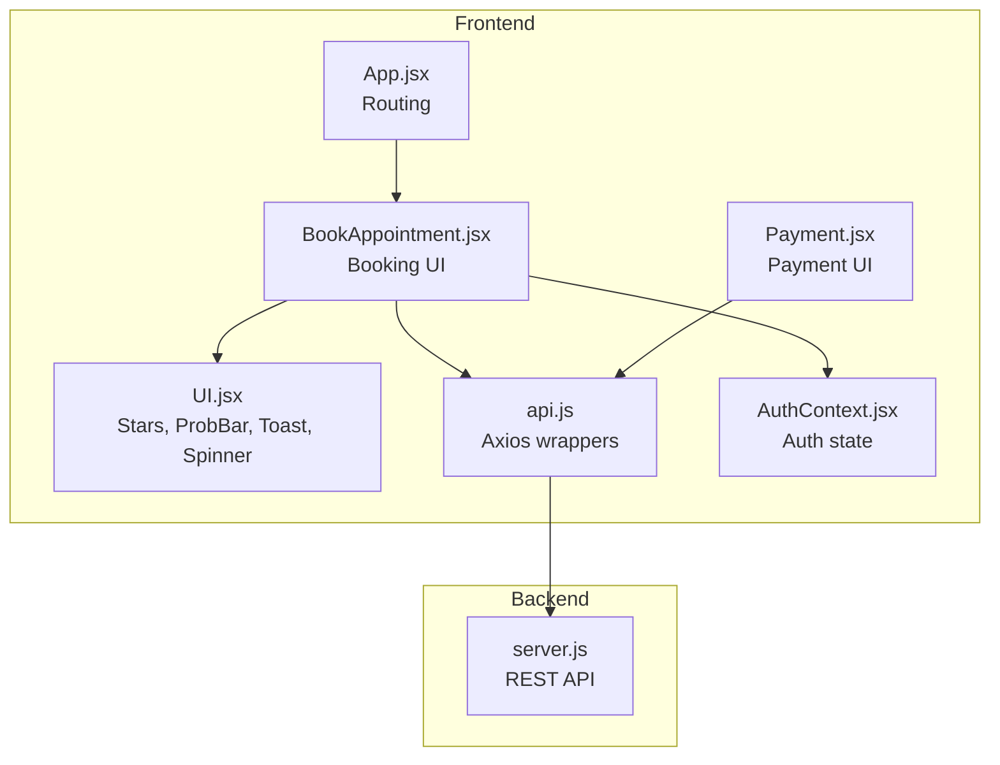
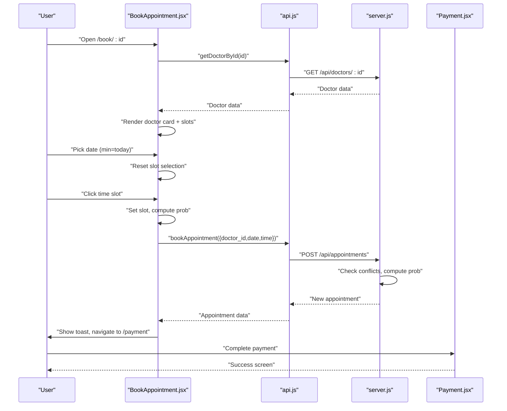
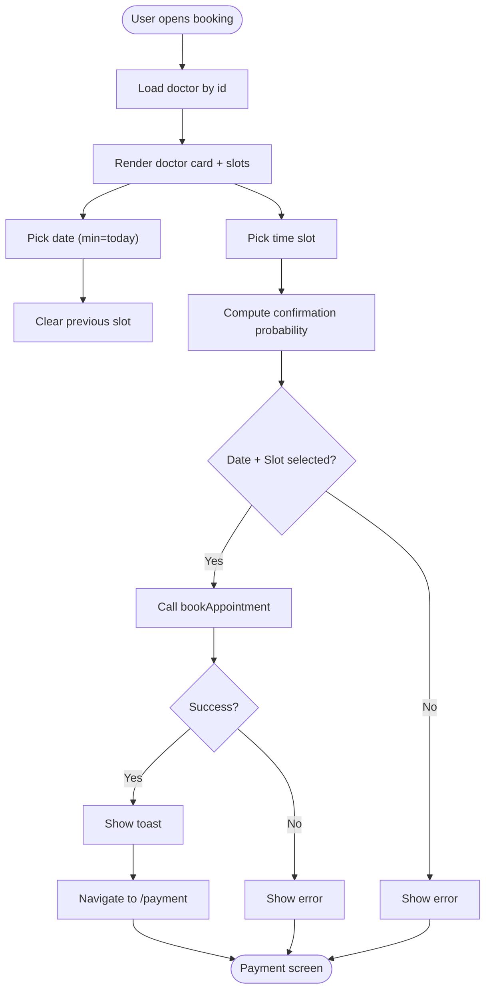
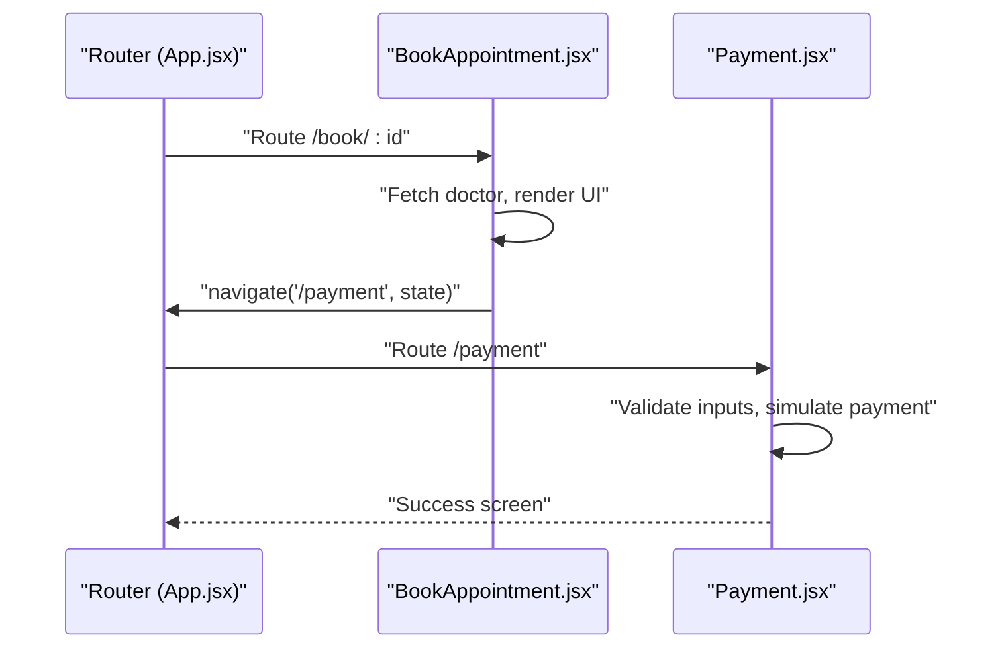
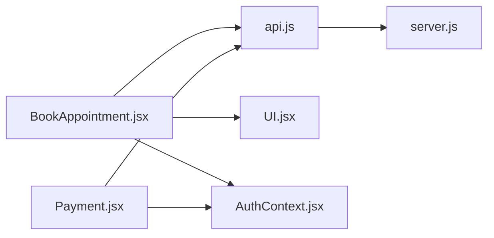

# Booking Interface and Selection

<cite>
**Referenced Files in This Document**
- [BookAppointment.jsx](file://BookAppointment.jsx)
- [App.jsx](file://App.jsx)
- [UI.jsx](file://UI.jsx)
- [api.js](file://api.js)
- [AuthContext.jsx](file://AuthContext.jsx)
- [Payment.jsx](file://Payment.jsx)
- [server.js](file://server.js)
- [data.js](file://data.js)
- [README.md](file://README.md)
</cite>

## Table of Contents
1. [Introduction](#introduction)
2. [Project Structure](#project-structure)
3. [Core Components](#core-components)
4. [Architecture Overview](#architecture-overview)
5. [Detailed Component Analysis](#detailed-component-analysis)
6. [Dependency Analysis](#dependency-analysis)
7. [Performance Considerations](#performance-considerations)
8. [Troubleshooting Guide](#troubleshooting-guide)
9. [Conclusion](#conclusion)
10. [Appendices](#appendices)

## Introduction
This document explains the complete appointment booking interface and selection experience. It covers the end-to-end workflow from selecting a doctor to confirming a time slot, including the date picker with minimum date validation, real-time slot availability display, interactive time slot selection with visual feedback, confirmation probability bar, form validation and error handling, integration with doctor profiles, and the navigation flow to payment processing. It also includes examples of successful booking scenarios, error conditions, and user interaction patterns.

## Project Structure
The booking interface is implemented as a React component integrated into the routing system. Supporting UI components provide reusable elements such as a probability bar, star ratings, toasts, and a spinner. The backend exposes REST endpoints for doctor listings, booking, reviews, and payments.

**Diagram sources**
- [App.jsx](file://App.jsx#L15-L44)
- [BookAppointment.jsx](file://BookAppointment.jsx#L1-L171)
- [UI.jsx](file://UI.jsx#L1-L182)
- [Payment.jsx](file://Payment.jsx#L1-L350)
- [api.js](file://api.js#L1-L44)
- [AuthContext.jsx](file://AuthContext.jsx#L1-L41)
- [server.js](file://server.js#L1-L390)

**Section sources**
- [App.jsx](file://App.jsx#L15-L44)
- [README.md](file://README.md#L7-L33)

## Core Components
- Booking UI: Doctor profile display, date picker with minimum date validation, time slot selection with visual feedback, confirmation probability bar, and confirmation button.
- UI Utilities: Star rating display, confirmation probability bar, toast notifications, and spinner.
- API Layer: Axios-based wrappers for doctor retrieval, booking, reviews, and payments.
- Authentication: Context-managed user state and persisted tokens.
- Payment UI: Multi-step payment form with method selection, input formatting, and simulated payment processing.

**Section sources**
- [BookAppointment.jsx](file://BookAppointment.jsx#L1-L171)
- [UI.jsx](file://UI.jsx#L33-L58)
- [api.js](file://api.js#L1-L44)
- [AuthContext.jsx](file://AuthContext.jsx#L1-L41)
- [Payment.jsx](file://Payment.jsx#L1-L350)

## Architecture Overview
The booking workflow spans frontend components and backend APIs. The frontend renders the booking UI, validates inputs, and posts to the backend. The backend enforces uniqueness of slots, computes a confirmation probability, and persists the appointment. After successful booking, the UI navigates to the payment screen where the user completes secure payment processing.

**Diagram sources**
- [BookAppointment.jsx](file://BookAppointment.jsx#L28-L60)
- [api.js](file://api.js#L17-L17)
- [server.js](file://server.js#L170-L202)
- [Payment.jsx](file://Payment.jsx#L23-L98)

## Detailed Component Analysis

### Booking UI: Doctor Selection to Time Slot Confirmation
- Doctor profile display: Shows name, specialization, experience, emoji, and star rating.
- Date picker: Uses HTML input type date with minimum date set to today’s date. Selecting a date clears the previously selected slot.
- Time slot selection: Renders available slots fetched from the doctor record. Clicking a slot sets it as selected with visual feedback (border, background, and text color changes).
- Confirmation probability: A dynamic bar updates when a slot is chosen, reflecting a simulated likelihood of confirmation based on availability.
- Validation and submission: Requires both date and slot to be selected; otherwise, an error is shown. On success, navigates to the payment route with appointment details.

**Diagram sources**
- [BookAppointment.jsx](file://BookAppointment.jsx#L28-L60)
- [BookAppointment.jsx](file://BookAppointment.jsx#L96-L126)

**Section sources**
- [BookAppointment.jsx](file://BookAppointment.jsx#L13-L37)
- [BookAppointment.jsx](file://BookAppointment.jsx#L96-L126)

### Date Picker Implementation and Minimum Date Validation
- The date input uses the browser-native date picker with the minimum date constrained to today’s date.
- Selecting a date resets the slot selection to prevent invalid combinations.
- The date is validated on submission to ensure it is present before attempting booking.

**Section sources**
- [BookAppointment.jsx](file://BookAppointment.jsx#L26-L26)
- [BookAppointment.jsx](file://BookAppointment.jsx#L96-L98)
- [BookAppointment.jsx](file://BookAppointment.jsx#L39-L42)

### Interactive Time Slot Selection and Visual Feedback
- Available slots are parsed from the doctor’s record and rendered as buttons.
- Clicking a slot sets it as selected and applies visual feedback (selected border, background, and text color).
- The confirmation probability bar updates dynamically when a slot is selected.

**Section sources**
- [BookAppointment.jsx](file://BookAppointment.jsx#L74-L74)
- [BookAppointment.jsx](file://BookAppointment.jsx#L102-L112)
- [BookAppointment.jsx](file://BookAppointment.jsx#L34-L37)

### Confirmation Probability Bar
- A reusable component displays the likelihood of confirmation based on doctor availability.
- Color and label change according to thresholds: high, medium, low.
- The bar is conditionally rendered when a slot is selected.

**Section sources**
- [UI.jsx](file://UI.jsx#L44-L58)
- [BookAppointment.jsx](file://BookAppointment.jsx#L117-L121)

### Form Validation and Error Handling
- Pre-submission checks ensure both date and slot are selected; otherwise, an error is displayed.
- Submission errors are caught and surfaced to the user.
- Toast notifications provide contextual feedback during booking and review submission.

**Section sources**
- [BookAppointment.jsx](file://BookAppointment.jsx#L39-L60)
- [UI.jsx](file://UI.jsx#L11-L25)

### Integration with Doctor Profile Display
- The doctor’s profile is fetched by ID and displayed with name, specialization, experience, emoji, and star rating.
- Reviews are shown below the booking form, and users can submit new reviews.

**Section sources**
- [BookAppointment.jsx](file://BookAppointment.jsx#L28-L32)
- [BookAppointment.jsx](file://BookAppointment.jsx#L80-L90)
- [BookAppointment.jsx](file://BookAppointment.jsx#L129-L167)
- [data.js](file://data.js#L11-L20)

### Navigation Flow: From Doctor Listing to Booking Confirmation and Payment
- Routing: The booking route is defined under /book/:id.
- Post-booking: On success, the UI navigates to /payment and passes appointment details.
- Payment: The payment screen validates inputs, simulates processing, and shows a success screen with a transaction reference.

**Diagram sources**
- [App.jsx](file://App.jsx#L30-L30)
- [BookAppointment.jsx](file://BookAppointment.jsx#L47-L56)
- [Payment.jsx](file://Payment.jsx#L23-L98)

**Section sources**
- [App.jsx](file://App.jsx#L30-L30)
- [BookAppointment.jsx](file://BookAppointment.jsx#L47-L56)
- [Payment.jsx](file://Payment.jsx#L23-L98)

### Backend Booking Logic and Conflict Detection
- The backend enforces uniqueness of slots per doctor per date/time.
- Confirmation probability is computed based on the number of existing appointments versus total available slots.
- On success, the appointment is created with status pending and the computed probability.

**Section sources**
- [server.js](file://server.js#L170-L202)
- [server.js](file://server.js#L181-L184)

### Payment Processing Integration
- The payment screen retrieves the doctor’s consultation fee and presents a multi-method form.
- Input formatting ensures consistent card numbers, expiry, and mobile numbers.
- A simulated payment endpoint validates inputs and marks the appointment as approved upon success.

**Section sources**
- [Payment.jsx](file://Payment.jsx#L49-L98)
- [server.js](file://server.js#L318-L353)
- [server.js](file://server.js#L372-L377)

## Dependency Analysis
- BookAppointment depends on:
  - API wrappers for doctor retrieval and booking.
  - UI utilities for stars, probability bar, spinner, and toast.
  - Auth context for user state.
- Payment depends on:
  - API wrappers for payment simulation and fee retrieval.
  - Auth context for user state.
- UI utilities are standalone and reused across components.

**Diagram sources**
- [BookAppointment.jsx](file://BookAppointment.jsx#L1-L6)
- [Payment.jsx](file://Payment.jsx#L1-L5)
- [api.js](file://api.js#L1-L44)
- [AuthContext.jsx](file://AuthContext.jsx#L1-L41)
- [server.js](file://server.js#L1-L390)

**Section sources**
- [BookAppointment.jsx](file://BookAppointment.jsx#L1-L6)
- [Payment.jsx](file://Payment.jsx#L1-L5)
- [api.js](file://api.js#L1-L44)
- [AuthContext.jsx](file://AuthContext.jsx#L1-L41)
- [server.js](file://server.js#L1-L390)

## Performance Considerations
- Slot computation is O(n) for parsing and rendering, where n is the number of available slots.
- Probability calculation is O(1) after fetching doctor and counting existing appointments.
- UI updates are lightweight; ensure minimal re-renders by avoiding unnecessary state churn.
- Network requests are asynchronous; consider caching doctor data per session to reduce repeated fetches.

[No sources needed since this section provides general guidance]

## Troubleshooting Guide
Common issues and resolutions:
- Booking fails with “This slot is already booked”:
  - Cause: Backend detected a conflict for the selected date/time.
  - Resolution: Choose another time slot or date.
- “Please select a date.” or “Please select a time slot.”:
  - Cause: Missing required fields before submission.
  - Resolution: Select both date and slot before confirming.
- “Booking failed. Please try again.”:
  - Cause: Unexpected server error or network issue.
  - Resolution: Retry after checking connectivity.
- Payment validation errors:
  - Cause: Missing or invalid card/mobile/account details.
  - Resolution: Correct the input fields as indicated by the error message.

**Section sources**
- [BookAppointment.jsx](file://BookAppointment.jsx#L39-L60)
- [server.js](file://server.js#L178-L179)
- [Payment.jsx](file://Payment.jsx#L62-L98)

## Conclusion
The booking interface provides a streamlined, user-friendly experience from doctor selection to payment completion. It integrates real-time slot availability, visual feedback, and a confidence indicator to guide users. Robust validation and error messaging improve reliability, while the modular UI components and clear routing support maintainability and scalability.

[No sources needed since this section summarizes without analyzing specific files]

## Appendices

### Example Scenarios

- Successful booking scenario:
  - User selects a date and a time slot.
  - The confirmation probability bar appears.
  - On clicking confirm, the system navigates to the payment screen with pre-filled details.
  - Payment is processed successfully, and the user sees a success screen with a transaction reference.

- Error conditions:
  - Attempting to book an already taken slot triggers a conflict error.
  - Leaving date or slot empty produces a validation error.
  - Payment failures surface as user-facing errors with guidance to retry.

- User interaction patterns:
  - Users often browse available slots before choosing a date.
  - The probability bar helps inform decisions when slots are limited.
  - Reviews are submitted after successful visits to provide feedback.

[No sources needed since this section provides general guidance]