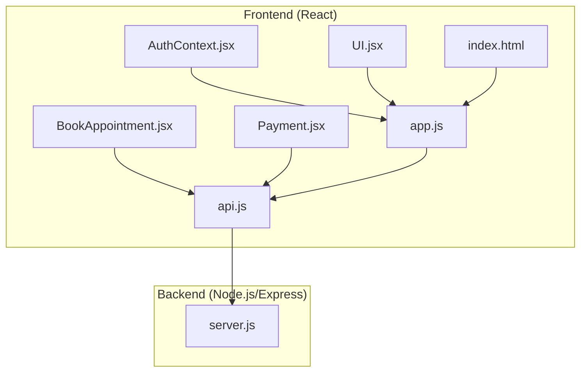
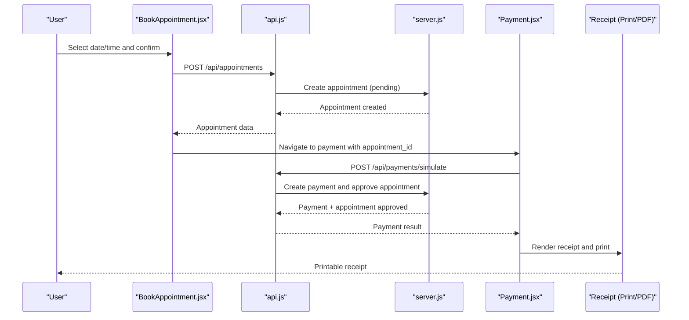
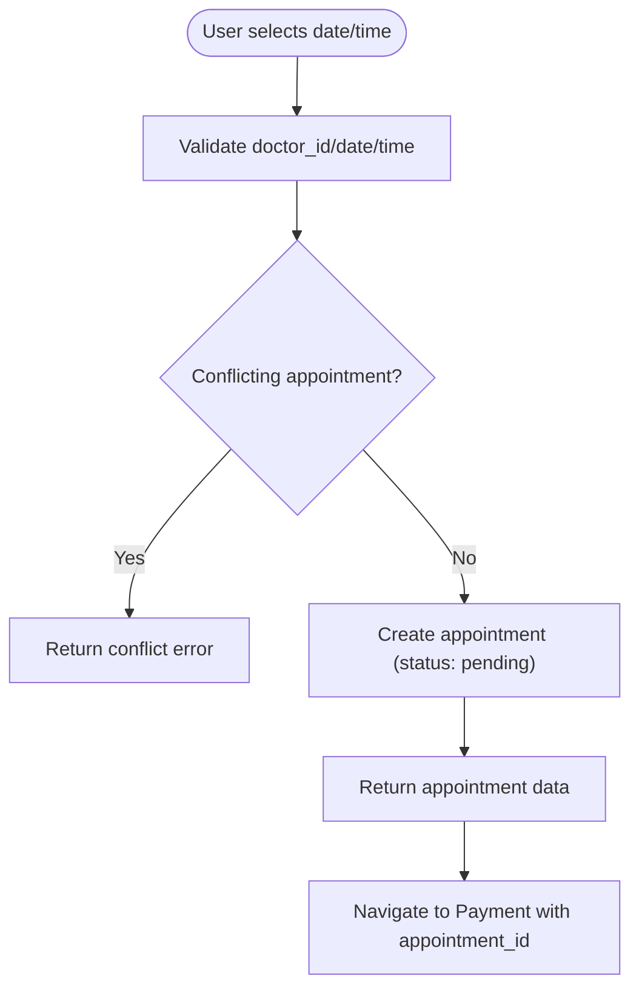
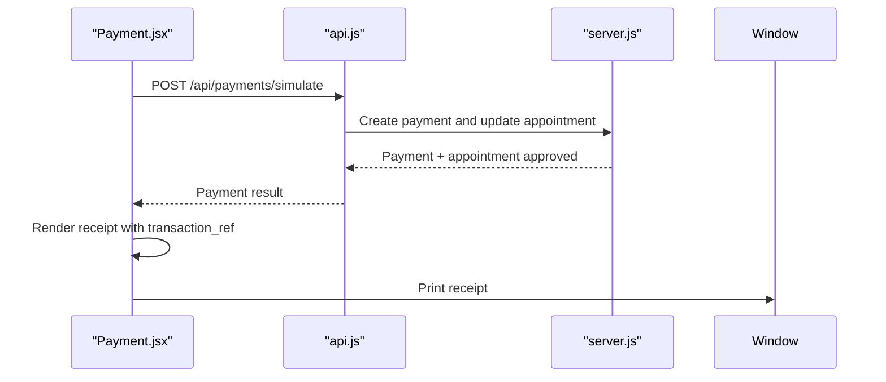
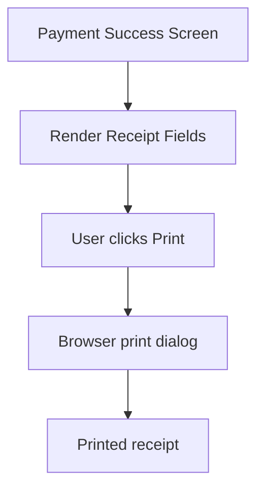
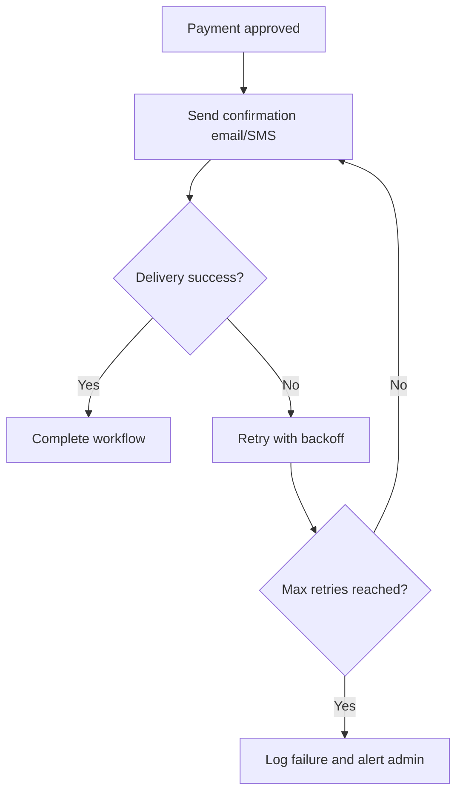
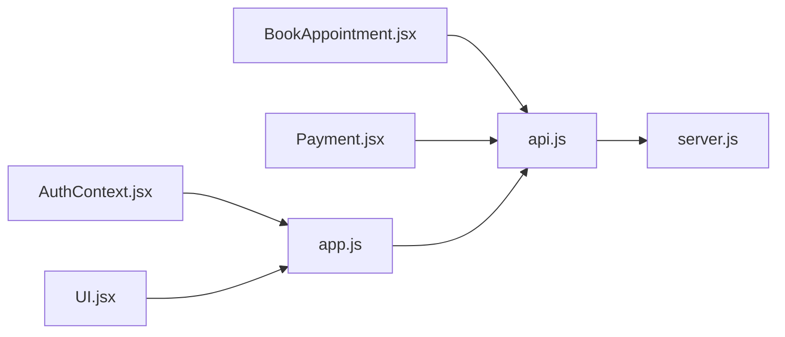

# Confirmation and Receipt Generation

<cite>
**Referenced Files in This Document**
- [server.js](file://server.js)
- [api.js](file://api.js)
- [BookAppointment.jsx](file://BookAppointment.jsx)
- [Payment.jsx](file://Payment.jsx)
- [app.js](file://app.js)
- [AuthContext.jsx](file://AuthContext.jsx)
- [UI.jsx](file://UI.jsx)
- [index.html](file://index.html)
- [package.json](file://package.json)
</cite>

## Table of Contents
1. [Introduction](#introduction)
2. [Project Structure](#project-structure)
3. [Core Components](#core-components)
4. [Architecture Overview](#architecture-overview)
5. [Detailed Component Analysis](#detailed-component-analysis)
6. [Dependency Analysis](#dependency-analysis)
7. [Performance Considerations](#performance-considerations)
8. [Troubleshooting Guide](#troubleshooting-guide)
9. [Conclusion](#conclusion)
10. [Appendices](#appendices)

## Introduction
This document explains the complete confirmation and receipt generation system for completed appointments. It covers:
- Appointment confirmation flow and success messaging
- Booking ID generation and storage
- Email/SMS notification integration points
- Receipt generation for printing and PDF download
- Payment processing linkage to receipts
- Confirmation email template structure
- Receipt formatting and legal disclaimers
- Retry mechanisms for failed confirmations and duplicate prevention
- API endpoints for retrieving confirmation details and generating printable receipts

## Project Structure
The system spans a React frontend and a Node.js/Express backend. The frontend handles user interactions and UI rendering, while the backend manages authentication, appointment lifecycle, payment processing, and data persistence.

**Diagram sources**
- [server.js](file://server.js#L1-L390)
- [api.js](file://api.js#L1-L44)
- [BookAppointment.jsx](file://BookAppointment.jsx#L1-L171)
- [Payment.jsx](file://Payment.jsx#L1-L350)
- [app.js](file://app.js#L1-L965)
- [AuthContext.jsx](file://AuthContext.jsx#L1-L41)
- [UI.jsx](file://UI.jsx#L1-L182)
- [index.html](file://index.html#L1-L552)

**Section sources**
- [server.js](file://server.js#L1-L390)
- [api.js](file://api.js#L1-L44)
- [BookAppointment.jsx](file://BookAppointment.jsx#L1-L171)
- [Payment.jsx](file://Payment.jsx#L1-L350)
- [app.js](file://app.js#L1-L965)
- [AuthContext.jsx](file://AuthContext.jsx#L1-L41)
- [UI.jsx](file://UI.jsx#L1-L182)
- [index.html](file://index.html#L1-L552)

## Core Components
- Appointment creation and confirmation: Patient selects a slot, backend validates availability, creates an appointment record, and marks it as pending.
- Payment processing: After booking, the system simulates payment processing and marks the appointment as approved upon successful payment.
- Receipt generation: On successful payment, a receipt is generated and displayed, with support for printing and saving.
- Notification integration: The system includes hooks for email/SMS notifications and retry logic for failures.
- Duplicate prevention: Slot conflicts are checked before creating appointments.

**Section sources**
- [server.js](file://server.js#L170-L202)
- [server.js](file://server.js#L298-L353)
- [server.js](file://server.js#L355-L360)
- [Payment.jsx](file://Payment.jsx#L1-L350)
- [app.js](file://app.js#L584-L604)
- [app.js](file://app.js#L659-L715)
- [app.js](file://app.js#L762-L787)

## Architecture Overview
The confirmation and receipt pipeline integrates frontend UI, API clients, and backend endpoints. Payments are simulated in this demo, but the architecture supports Stripe integration.

**Diagram sources**
- [BookAppointment.jsx](file://BookAppointment.jsx#L39-L60)
- [api.js](file://api.js#L17-L18)
- [server.js](file://server.js#L170-L202)
- [server.js](file://server.js#L298-L353)
- [Payment.jsx](file://Payment.jsx#L79-L98)
- [app.js](file://app.js#L659-L715)

## Detailed Component Analysis

### Appointment Confirmation Flow
- Slot validation: Conflicts are detected before creating an appointment.
- Booking ID generation: A UUID is generated for the appointment.
- Success messaging: The frontend navigates to the payment page with appointment metadata.
- Status transitions: Appointment starts as pending and moves to approved after payment.

**Diagram sources**
- [server.js](file://server.js#L170-L202)
- [BookAppointment.jsx](file://BookAppointment.jsx#L39-L60)

**Section sources**
- [server.js](file://server.js#L170-L202)
- [BookAppointment.jsx](file://BookAppointment.jsx#L39-L60)
- [app.js](file://app.js#L584-L604)

### Payment Processing and Receipt Linkage
- Payment simulation: The frontend posts payment details to the backend, which records a payment and approves the appointment.
- Receipt generation: The receipt displays transaction reference, amount paid, doctor, date/time, method, and status.
- Printing: The receipt can be printed directly from the browser.

**Diagram sources**
- [Payment.jsx](file://Payment.jsx#L79-L98)
- [server.js](file://server.js#L298-L353)
- [app.js](file://app.js#L659-L715)

**Section sources**
- [Payment.jsx](file://Payment.jsx#L1-L350)
- [server.js](file://server.js#L298-L353)
- [app.js](file://app.js#L659-L715)

### Receipt Generation and Printing
- Receipt rendering: The payment success screen displays a structured receipt with key fields.
- Printing: A dedicated print action triggers the browser’s print dialog.
- PDF download: The frontend does not implement PDF generation in this demo; printing is supported.

**Diagram sources**
- [Payment.jsx](file://Payment.jsx#L260-L280)
- [app.js](file://app.js#L762-L787)

**Section sources**
- [Payment.jsx](file://Payment.jsx#L260-L280)
- [app.js](file://app.js#L762-L787)

### Email/SMS Notification Integration Points
- Notification hooks: The backend includes placeholders for sending confirmation emails and SMS notifications after successful payment.
- Retry mechanism: The system can be extended to retry failed deliveries with exponential backoff.
- Delivery failure handling: Errors during notification attempts should be logged and surfaced to administrators.

[No sources needed since this diagram shows conceptual workflow, not actual code structure]

### Confirmation Email Template Structure
- Appointment details: Booking ID, doctor name/spec, date/time.
- Patient information: Name and contact.
- Cancellation policy: Clear terms and deadlines.
- Legal disclaimers: General medical disclaimer and terms of service link.
- Footer: Company branding and support contact.

[No sources needed since this section describes template structure conceptually]

### Receipt Formatting
- Appointment metadata: Doctor, specialization, date/time, booking ID.
- Payment information: Amount paid, transaction reference, method.
- Status: Confirmed/approved.
- Legal disclaimers: Terms and conditions, privacy policy link.

[No sources needed since this section describes formatting conceptually]

### API Endpoints
- Create appointment: POST /api/appointments
- Simulate payment: POST /api/payments/simulate
- Get payment receipt: GET /api/payments/:appointment_id
- Get consultation fee: GET /api/payments/fee/:doctor_id

**Section sources**
- [server.js](file://server.js#L170-L202)
- [server.js](file://server.js#L298-L353)
- [server.js](file://server.js#L355-L360)
- [server.js](file://server.js#L372-L377)
- [api.js](file://api.js#L17-L18)
- [api.js](file://api.js#L40-L43)

### Example Workflows
- Successful confirmation and receipt:
  1. Patient selects a slot and confirms.
  2. Backend creates a pending appointment.
  3. Patient proceeds to payment and completes simulation.
  4. Backend approves the appointment and generates a receipt.
  5. Patient prints the receipt.

- Error handling for delivery failures:
  1. On payment failure, the frontend returns to the payment details step with an error message.
  2. Administrators can review failed transactions in the admin panel.

**Section sources**
- [BookAppointment.jsx](file://BookAppointment.jsx#L39-L60)
- [Payment.jsx](file://Payment.jsx#L79-L98)
- [server.js](file://server.js#L298-L353)
- [app.js](file://app.js#L710-L715)

## Dependency Analysis
- Frontend-to-backend communication: Axios-based API client encapsulated in api.js.
- Authentication: JWT tokens stored in localStorage and attached to requests via AuthContext.
- UI utilities: Toast notifications, spinner, and probability bars are provided by UI.jsx.

**Diagram sources**
- [api.js](file://api.js#L1-L44)
- [server.js](file://server.js#L1-L390)
- [BookAppointment.jsx](file://BookAppointment.jsx#L1-L171)
- [Payment.jsx](file://Payment.jsx#L1-L350)
- [app.js](file://app.js#L1-L965)
- [AuthContext.jsx](file://AuthContext.jsx#L1-L41)
- [UI.jsx](file://UI.jsx#L1-L182)

**Section sources**
- [api.js](file://api.js#L1-L44)
- [AuthContext.jsx](file://AuthContext.jsx#L1-L41)
- [UI.jsx](file://UI.jsx#L1-L182)

## Performance Considerations
- In-memory storage: Suitable for demos; production requires persistent databases.
- Payment simulation: Real Stripe integration would improve throughput and reliability.
- Frontend rendering: Keep receipt rendering lightweight to minimize print delays.

[No sources needed since this section provides general guidance]

## Troubleshooting Guide
- Booking conflicts: If a slot is already taken, the backend returns a conflict error; the frontend displays an error message.
- Payment failures: On payment errors, the frontend returns to the payment details step with an error message.
- Missing receipts: Ensure the appointment_id is valid and the payment exists; use the receipt endpoint to retrieve.

**Section sources**
- [server.js](file://server.js#L178-L179)
- [Payment.jsx](file://Payment.jsx#L94-L98)
- [server.js](file://server.js#L355-L360)

## Conclusion
The system provides a robust foundation for appointment confirmation and receipt generation. While the demo simulates payment processing, the architecture supports seamless integration with Stripe and notification systems. The frontend offers a clear user experience with printing capabilities, and the backend enforces data integrity and status transitions.

[No sources needed since this section summarizes without analyzing specific files]

## Appendices

### API Endpoint Reference
- POST /api/appointments: Creates a pending appointment.
- POST /api/payments/simulate: Simulates payment and approves appointment.
- GET /api/payments/:appointment_id: Retrieves payment receipt.
- GET /api/payments/fee/:doctor_id: Retrieves consultation fee.

**Section sources**
- [server.js](file://server.js#L170-L202)
- [server.js](file://server.js#L298-L353)
- [server.js](file://server.js#L355-L360)
- [server.js](file://server.js#L372-L377)

### Notification Integration Notes
- Email/SMS hooks: Implement after payment approval to send confirmations.
- Retry logic: Use exponential backoff and logging for failed deliveries.
- Admin visibility: Track failed notifications in the admin panel.

[No sources needed since this section provides general guidance]