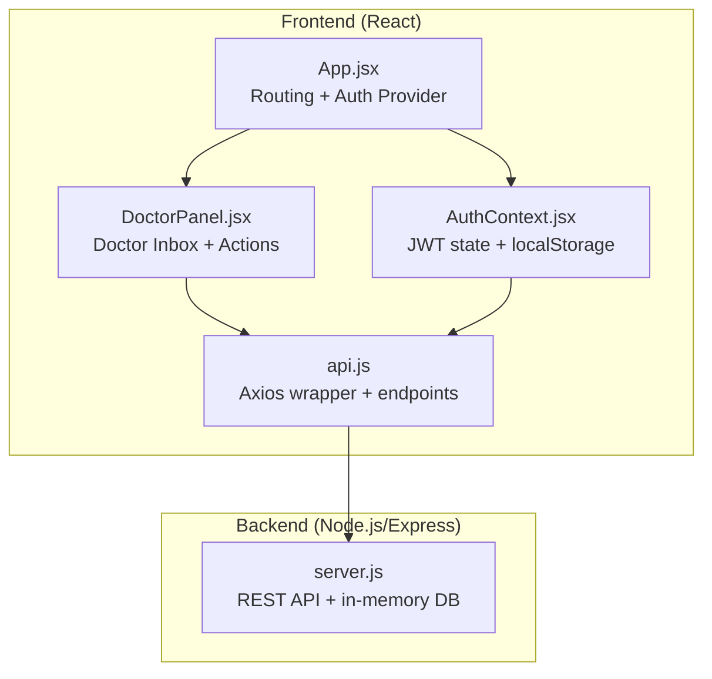
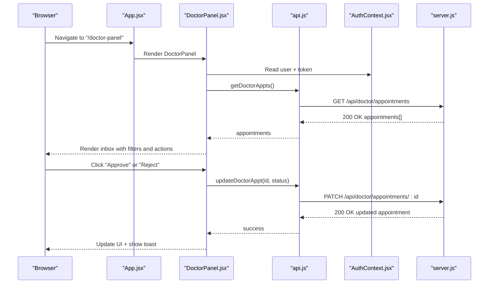
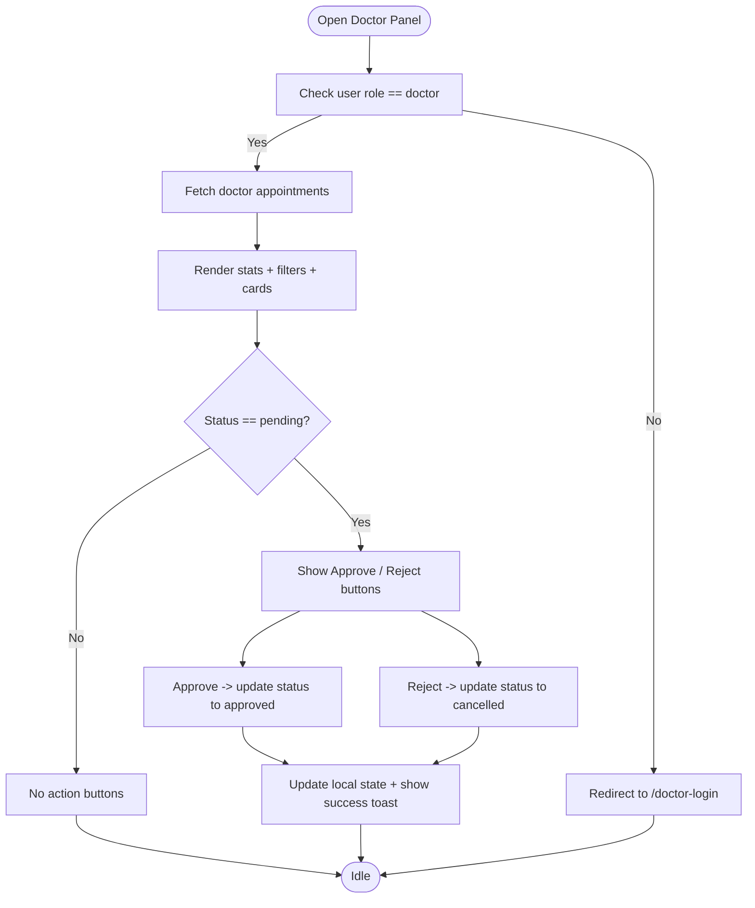
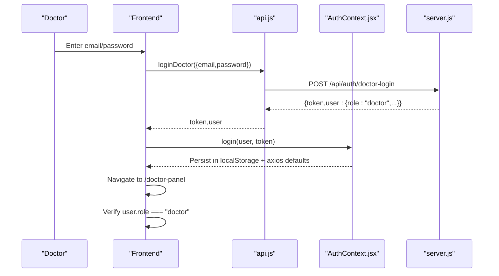
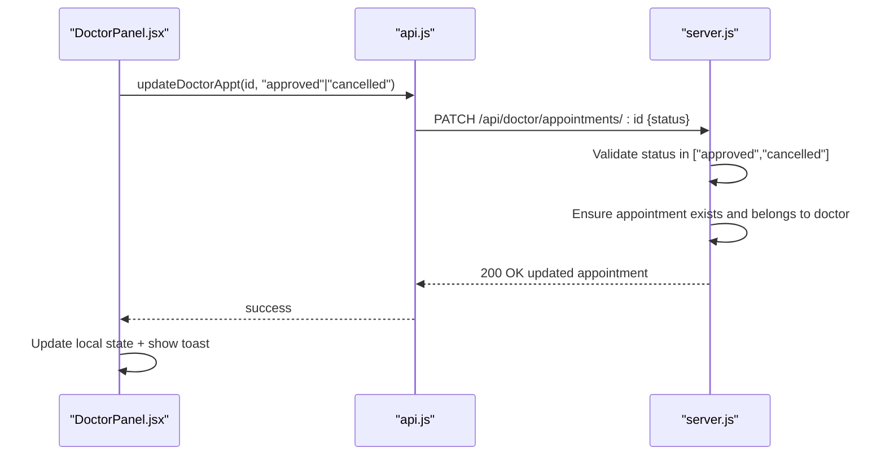
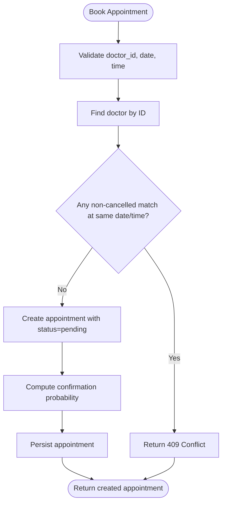
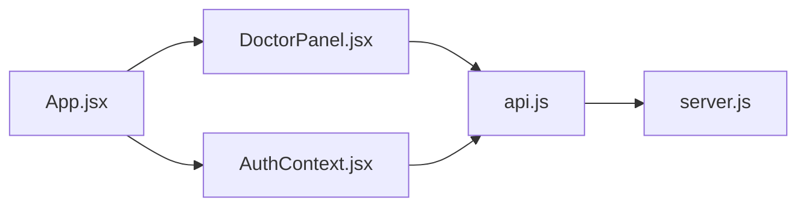

# Doctor Panel and Approval Workflows

<cite>
**Referenced Files in This Document**
- [DoctorPanel.jsx](file://DoctorPanel.jsx)
- [App.jsx](file://App.jsx)
- [AuthContext.jsx](file://AuthContext.jsx)
- [server.js](file://server.js)
- [api.js](file://api.js)
- [README.md](file://README.md)
</cite>

## Table of Contents
1. [Introduction](#introduction)
2. [Project Structure](#project-structure)
3. [Core Components](#core-components)
4. [Architecture Overview](#architecture-overview)
5. [Detailed Component Analysis](#detailed-component-analysis)
6. [Dependency Analysis](#dependency-analysis)
7. [Performance Considerations](#performance-considerations)
8. [Troubleshooting Guide](#troubleshooting-guide)
9. [Conclusion](#conclusion)
10. [Appendices](#appendices)

## Introduction
This document explains the doctor panel system that enables medical professionals to manage incoming appointment requests. It covers the doctor login and authentication flow, the appointment request inbox, approval and rejection workflows, calendar integration, historical views, notifications, and administrative capabilities. The system is a full-stack application built with React (frontend) and Node.js/Express (backend), featuring JWT-based authentication, in-memory persistence, and a clean separation of concerns across modules.

## Project Structure
The application is organized into a frontend React SPA and a backend Express server. The frontend registers routes, manages authentication state, and renders the doctor panel. The backend exposes REST endpoints for authentication, doctor listings, booking, approvals, and administrative operations.

**Diagram sources**
- [App.jsx](file://App.jsx#L15-L43)
- [DoctorPanel.jsx](file://DoctorPanel.jsx#L1-L96)
- [AuthContext.jsx](file://AuthContext.jsx#L1-L41)
- [api.js](file://api.js#L1-L44)
- [server.js](file://server.js#L1-L390)

**Section sources**
- [App.jsx](file://App.jsx#L1-L44)
- [README.md](file://README.md#L7-L33)

## Core Components
- Doctor Panel: Displays incoming appointment requests, filters by status, and allows approval/rejection actions.
- Authentication Context: Manages JWT tokens and user state, persists credentials in localStorage, and applies Authorization headers.
- API Layer: Centralized axios wrapper exposing typed endpoints for authentication, doctor operations, appointments, and admin functions.
- Backend Routes: Implements doctor login, appointment retrieval, status updates, booking conflict checks, and administrative controls.

Key responsibilities:
- Doctor Panel: Fetches doctor-specific appointments, displays patient info, and updates statuses.
- Auth Context: Ensures only authenticated doctors access the doctor panel and sets HTTP headers.
- API Layer: Encapsulates base URL and endpoint definitions for frontend consumption.
- Backend: Enforces role-based access control, validates inputs, and maintains in-memory state.

**Section sources**
- [DoctorPanel.jsx](file://DoctorPanel.jsx#L1-L96)
- [AuthContext.jsx](file://AuthContext.jsx#L1-L41)
- [api.js](file://api.js#L1-L44)
- [server.js](file://server.js#L133-L153)

## Architecture Overview
The doctor panel integrates frontend and backend via REST APIs. Authentication is handled by JWT tokens stored in localStorage and attached to requests via axios defaults. The doctor panel enforces role-based access and delegates data operations to the backend.

**Diagram sources**
- [App.jsx](file://App.jsx#L27-L33)
- [DoctorPanel.jsx](file://DoctorPanel.jsx#L15-L28)
- [api.js](file://api.js#L21-L23)
- [server.js](file://server.js#L133-L153)

## Detailed Component Analysis

### Doctor Panel: Inbox and Approval Workflow
The doctor panel fetches and displays appointment requests assigned to the logged-in doctor. It supports filtering by status and performs approval/rejection actions with immediate UI feedback.

Key behaviors:
- Access control: Redirects unauthenticated or non-doctor users to the doctor login page.
- Data loading: Retrieves doctor-specific appointments and enriches with patient details.
- Filtering: Supports pending, approved, cancelled, and all views.
- Actions: Approve or reject pending appointments; updates local state and shows toast messages.
- Stats: Displays counts for total, pending, and approved appointments.

**Diagram sources**
- [DoctorPanel.jsx](file://DoctorPanel.jsx#L15-L28)
- [DoctorPanel.jsx](file://DoctorPanel.jsx#L30-L92)

**Section sources**
- [DoctorPanel.jsx](file://DoctorPanel.jsx#L1-L96)

### Authentication and Doctor Login Flow
The system supports separate login flows for patients, doctors, and administrators. Doctor login uses a dedicated endpoint and role-based JWT claims.

Flow:
- Doctor submits credentials to the doctor login endpoint.
- Backend verifies credentials against in-memory doctor records.
- On success, a signed JWT is returned with role claim "doctor".
- Frontend stores user and token in localStorage and sets Authorization header for subsequent requests.
- Doctor panel enforces role check and redirects unauthorized users.

**Diagram sources**
- [server.js](file://server.js#L92-L110)
- [AuthContext.jsx](file://AuthContext.jsx#L21-L31)
- [api.js](file://api.js#L8)
- [DoctorPanel.jsx](file://DoctorPanel.jsx#L16)

**Section sources**
- [server.js](file://server.js#L92-L110)
- [AuthContext.jsx](file://AuthContext.jsx#L1-L41)
- [api.js](file://api.js#L1-L10)
- [DoctorPanel.jsx](file://DoctorPanel.jsx#L15-L20)

### Appointment Request Inbox and Patient Details
The backend aggregates doctor-specific appointments and enriches them with patient name and phone. The frontend displays these details alongside date/time and current status badges.

Highlights:
- Endpoint returns only appointments belonging to the authenticated doctor.
- Patient contact info is included for convenience.
- Date formatting uses locale-aware conversion for readability.

**Section sources**
- [server.js](file://server.js#L133-L142)
- [DoctorPanel.jsx](file://DoctorPanel.jsx#L74-L79)

### Approval and Rejection Workflow
When a doctor approves or rejects a pending appointment, the frontend updates the UI immediately and calls the backend to persist the change. The backend validates the status and ensures the appointment belongs to the requesting doctor.

**Diagram sources**
- [DoctorPanel.jsx](file://DoctorPanel.jsx#L22-L28)
- [api.js](file://api.js#L23)
- [server.js](file://server.js#L144-L153)

**Section sources**
- [DoctorPanel.jsx](file://DoctorPanel.jsx#L22-L28)
- [server.js](file://server.js#L144-L153)

### Calendar Integration and Availability Conflicts
While the doctor panel does not render a traditional calendar grid, it surfaces date and time for each appointment. The backend prevents double-booking by checking existing non-cancelled appointments for the same doctor, date, and time.

**Diagram sources**
- [server.js](file://server.js#L170-L202)

**Section sources**
- [server.js](file://server.js#L170-L202)

### Notification System for Requests and Updates
The doctor panel provides inline toast notifications upon successful approval or rejection. While email/SMS are future enhancements, the frontend demonstrates a pattern for user feedback.

**Section sources**
- [DoctorPanel.jsx](file://DoctorPanel.jsx#L26-L27)

### Administrative Features for Managing Appointments
Administrators can view global statistics, manage all appointments, and oversee doctors and patients. These endpoints are protected by admin middleware.

Capabilities:
- View totals and counts across statuses.
- Change any appointment’s status.
- Remove doctors from the system.
- View all patients and doctors.

**Section sources**
- [server.js](file://server.js#L244-L280)

### Doctor Profile Management Integration
Although the doctor panel focuses on approvals, the backend supports doctor profiles and listings. The doctor panel can be extended to integrate with profile updates for availability and specialization changes.

**Section sources**
- [server.js](file://server.js#L117-L131)

## Dependency Analysis
The frontend depends on the API layer, which encapsulates axios and base URLs. The API layer depends on the backend REST endpoints. Authentication state is shared globally via context and influences request headers.

**Diagram sources**
- [DoctorPanel.jsx](file://DoctorPanel.jsx#L1-L96)
- [api.js](file://api.js#L1-L44)
- [server.js](file://server.js#L1-L390)
- [AuthContext.jsx](file://AuthContext.jsx#L1-L41)
- [App.jsx](file://App.jsx#L1-L44)

**Section sources**
- [DoctorPanel.jsx](file://DoctorPanel.jsx#L1-L96)
- [api.js](file://api.js#L1-L44)
- [server.js](file://server.js#L1-L390)
- [AuthContext.jsx](file://AuthContext.jsx#L1-L41)
- [App.jsx](file://App.jsx#L1-L44)

## Performance Considerations
- Frontend rendering: Filtering and local state updates are O(n) per render; acceptable for small datasets.
- Backend queries: In-memory filtering is efficient but should be replaced with indexed database queries for production.
- Token caching: JWTs are stored in localStorage; ensure secure transport (HTTPS) and consider short-lived tokens with refresh mechanisms.
- Conflict detection: O(n) scan for existing appointments; optimize with database indices on doctor_id, date, and time.

## Troubleshooting Guide
Common issues and resolutions:
- Unauthorized access to doctor panel: Ensure the user role is "doctor" and a valid token is present. The panel redirects to the doctor login page otherwise.
- Empty appointment list: Confirm the doctor has associated appointments; the backend filters by doctor_id.
- Update failures: Verify the appointment exists and belongs to the doctor; the backend returns 404 if not found.
- Invalid status updates: Only "approved" or "cancelled" are accepted; attempting other values yields a 400 error.
- Network errors: Check axios defaults and Authorization header propagation via the auth provider.

**Section sources**
- [DoctorPanel.jsx](file://DoctorPanel.jsx#L16-L20)
- [server.js](file://server.js#L144-L153)

## Conclusion
The doctor panel system provides a focused, role-based interface for managing incoming appointment requests. It leverages JWT authentication, a centralized API layer, and straightforward backend endpoints to support approval/rejection workflows. The design cleanly separates concerns and can be extended to include richer calendar views, notifications, and profile management integrations.

## Appendices

### Example Doctor Workflows
- Approve an appointment:
  - Open the doctor panel, locate a pending appointment, click approve, observe the status update and success toast.
- Reject an appointment:
  - Select a pending appointment, click reject, confirm the UI reflects the cancelled status.
- Filter by status:
  - Use the filter tabs to switch between pending, approved, cancelled, and all views.

### Backend Endpoint Reference
- Doctor login: POST /api/auth/doctor-login
- Get doctor appointments: GET /api/doctor/appointments
- Update appointment status: PATCH /api/doctor/appointments/:id
- Book appointment: POST /api/appointments
- Admin stats: GET /api/admin/stats
- Admin manage appointments: PATCH /api/admin/appointments/:id
- Admin manage doctors: DELETE /api/admin/doctors/:id

**Section sources**
- [server.js](file://server.js#L92-L110)
- [server.js](file://server.js#L133-L153)
- [server.js](file://server.js#L170-L202)
- [server.js](file://server.js#L244-L280)