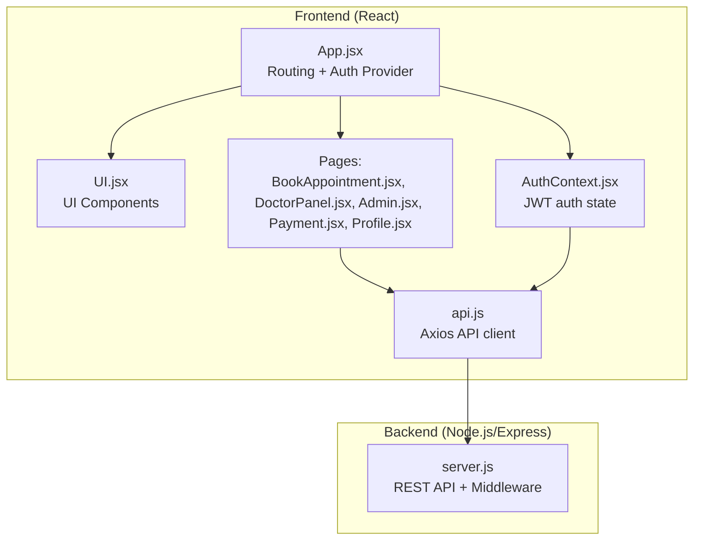
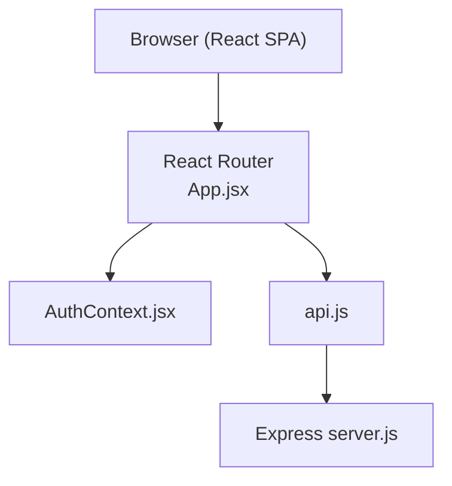
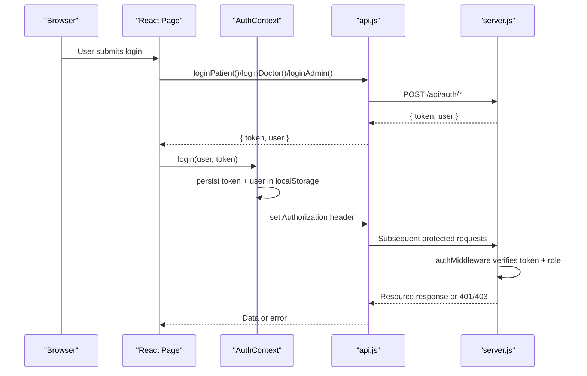
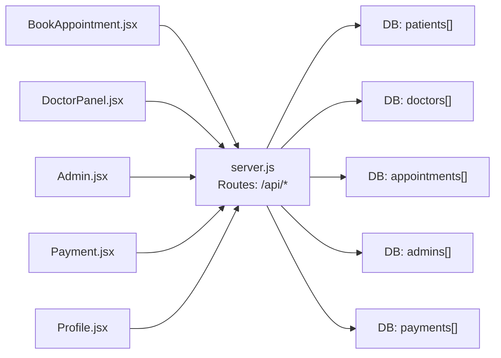
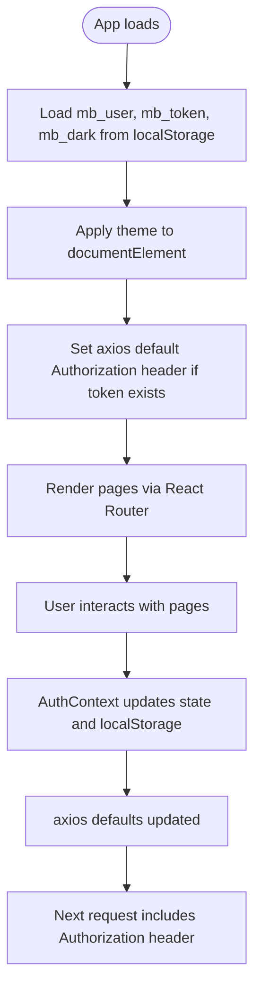
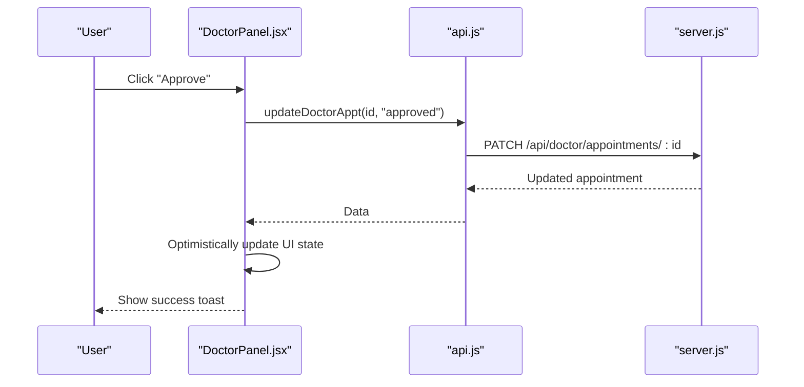
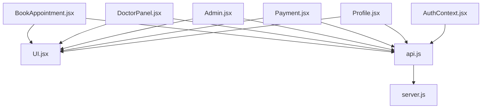
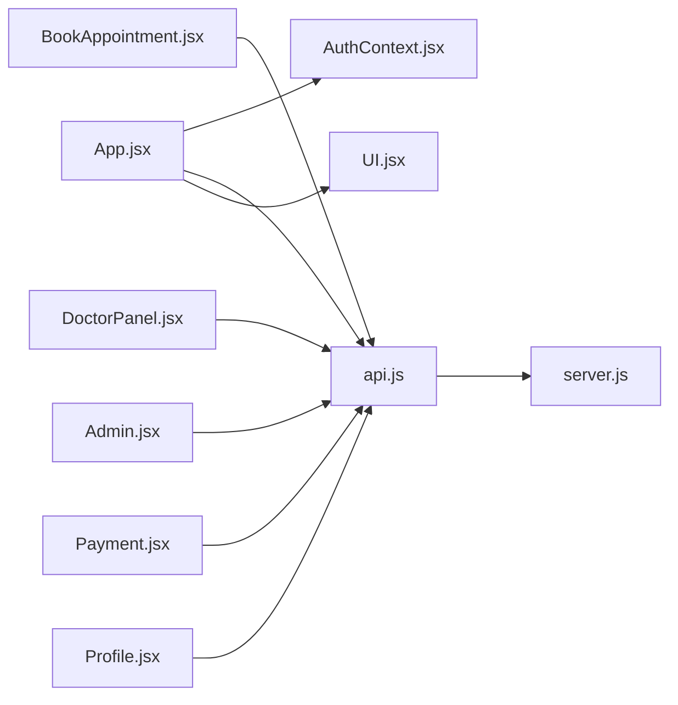

# Architecture Overview

<cite>
**Referenced Files in This Document**
- [README.md](file://README.md)
- [package.json](file://package.json)
- [server.js](file://server.js)
- [App.jsx](file://App.jsx)
- [AuthContext.jsx](file://AuthContext.jsx)
- [api.js](file://api.js)
- [UI.jsx](file://UI.jsx)
- [BookAppointment.jsx](file://BookAppointment.jsx)
- [DoctorPanel.jsx](file://DoctorPanel.jsx)
- [Admin.jsx](file://Admin.jsx)
- [Payment.jsx](file://Payment.jsx)
- [Profile.jsx](file://Profile.jsx)
- [index.html](file://index.html)
</cite>

## Table of Contents
1. [Introduction](#introduction)
2. [Project Structure](#project-structure)
3. [Core Components](#core-components)
4. [Architecture Overview](#architecture-overview)
5. [Detailed Component Analysis](#detailed-component-analysis)
6. [Dependency Analysis](#dependency-analysis)
7. [Performance Considerations](#performance-considerations)
8. [Troubleshooting Guide](#troubleshooting-guide)
9. [Conclusion](#conclusion)
10. [Appendices](#appendices)

## Introduction
This document describes the architecture of the Doctor appointment booking system. It is a full-stack web application built with a React frontend and a Node.js/Express backend. The system follows a client-server architecture with clear separation of concerns:
- React frontend handles UI rendering, routing, user interactions, and state management.
- Node.js/Express backend exposes REST APIs, enforces authentication and role-based access control, and manages in-memory data for demonstration.

Key architectural goals:
- Clear separation between presentation (React) and business/data layers (Express).
- JWT-based authentication with role-aware middleware.
- Stateless API design with predictable request/response contracts.
- In-memory data structures simulating relational tables, with future migration to a persistent database.
- Real-time-like updates via optimistic UI and immediate feedback loops.

## Project Structure
The repository organizes code into frontend and backend modules. The frontend uses React with React Router for navigation and a centralized authentication context. The backend is a single Express server exposing REST endpoints.

**Diagram sources**
- [App.jsx](file://App.jsx#L1-L44)
- [AuthContext.jsx](file://AuthContext.jsx#L1-L41)
- [api.js](file://api.js#L1-L44)
- [UI.jsx](file://UI.jsx#L1-L182)
- [BookAppointment.jsx](file://BookAppointment.jsx#L1-L171)
- [DoctorPanel.jsx](file://DoctorPanel.jsx#L1-L96)
- [Admin.jsx](file://Admin.jsx#L1-L194)
- [Payment.jsx](file://Payment.jsx#L1-L350)
- [Profile.jsx](file://Profile.jsx#L1-L97)
- [server.js](file://server.js#L1-L390)

**Section sources**
- [README.md](file://README.md#L7-L33)
- [App.jsx](file://App.jsx#L1-L44)
- [server.js](file://server.js#L1-L30)

## Core Components
- React Router-based routing orchestrates navigation across pages.
- Centralized authentication context stores JWT tokens and user state, persists theme preference, and injects Authorization headers into outgoing requests.
- Axios-based API client encapsulates all backend endpoints for clean consumption by pages.
- UI component library provides reusable elements (toasts, spinner, stars, countdown, status badges).
- Pages implement domain-specific flows: patient booking, doctor approvals, admin dashboards, payments, and profile management.

Implementation highlights:
- Authentication state is persisted in local storage and synchronized with axios defaults.
- Pages consume typed API functions exported from the API client, ensuring consistent endpoint usage.
- UI components encapsulate presentation logic and reusable behaviors.

**Section sources**
- [App.jsx](file://App.jsx#L15-L42)
- [AuthContext.jsx](file://AuthContext.jsx#L6-L38)
- [api.js](file://api.js#L3-L44)
- [UI.jsx](file://UI.jsx#L11-L176)

## Architecture Overview
The system follows a classic client-server pattern:
- Client (React SPA) communicates with the server via REST endpoints.
- Server validates requests using JWT middleware and enforces role-based access control.
- Data is stored in memory during runtime; schema mirrors SQL tables.

**Diagram sources**
- [App.jsx](file://App.jsx#L1-L44)
- [AuthContext.jsx](file://AuthContext.jsx#L1-L41)
- [api.js](file://api.js#L1-L44)
- [server.js](file://server.js#L49-L62)

## Detailed Component Analysis

### Authentication and Authorization
- JWT-based session management with short-lived tokens.
- Role-aware middleware inspects Authorization headers and decodes tokens to enforce access control.
- Local storage persists user identity and token; axios defaults automatically attach Authorization headers for protected routes.

**Diagram sources**
- [AuthContext.jsx](file://AuthContext.jsx#L21-L31)
- [api.js](file://api.js#L6-L9)
- [server.js](file://server.js#L49-L62)
- [server.js](file://server.js#L83-L110)

**Section sources**
- [AuthContext.jsx](file://AuthContext.jsx#L6-L38)
- [api.js](file://api.js#L6-L9)
- [server.js](file://server.js#L49-L62)

### MVC Pattern Mapping
- Views: React functional components render UI and orchestrate user interactions.
- Controllers: Express routes handle HTTP requests, validate inputs, and delegate to business logic.
- Models: In-memory JavaScript objects mirror relational tables (patients, doctors, appointments, admins, payments).

**Diagram sources**
- [BookAppointment.jsx](file://BookAppointment.jsx#L1-L171)
- [DoctorPanel.jsx](file://DoctorPanel.jsx#L1-L96)
- [Admin.jsx](file://Admin.jsx#L1-L194)
- [Payment.jsx](file://Payment.jsx#L1-L350)
- [Profile.jsx](file://Profile.jsx#L1-L97)
- [server.js](file://server.js#L29-L44)

**Section sources**
- [server.js](file://server.js#L29-L44)
- [server.js](file://server.js#L116-L280)

### API Design Principles
- RESTful resource naming aligned with CRUD semantics.
- Consistent HTTP status codes and JSON error payloads.
- Role-scoped endpoints (e.g., doctor-only, admin-only).
- Input validation and sanitization at route handlers.
- Pagination and filtering via query parameters (e.g., search and specialization filters).

Representative endpoints:
- Auth: POST /api/auth/register, POST /api/auth/login, POST /api/auth/doctor-login, POST /api/auth/admin-login
- Doctors: GET /api/doctors, GET /api/doctors/:id, POST /api/doctors/:id/review
- Appointments: POST /api/appointments, GET /api/appointments, PATCH /api/appointments/:id/cancel
- Doctor Panel: GET /api/doctor/appointments, PATCH /api/doctor/appointments/:id
- Admin: GET /api/admin/stats, GET /api/admin/appointments, GET /api/admin/patients, GET /api/admin/doctors, PATCH /api/admin/appointments/:id, DELETE /api/admin/doctors/:id
- Payments: GET /api/payments/fee/:doctor_id, POST /api/payments/create-intent, POST /api/payments/simulate, GET /api/payments/:appointment_id, GET /api/admin/payments

**Section sources**
- [server.js](file://server.js#L67-L110)
- [server.js](file://server.js#L116-L164)
- [server.js](file://server.js#L170-L217)
- [server.js](file://server.js#L133-L153)
- [server.js](file://server.js#L242-L280)
- [server.js](file://server.js#L297-L377)

### State Management Patterns Using React Context
- Centralized authentication state (user, token, theme) with persistence in localStorage.
- Automatic Authorization header injection for axios requests.
- Theme toggling persisted across sessions.

**Diagram sources**
- [AuthContext.jsx](file://AuthContext.jsx#L7-L19)
- [AuthContext.jsx](file://AuthContext.jsx#L11-L14)

**Section sources**
- [AuthContext.jsx](file://AuthContext.jsx#L6-L38)

### Real-Time Update Mechanisms
- Optimistic UI updates: pages update immediately upon user actions (e.g., approving/rejecting appointments) while awaiting server confirmation.
- Toast notifications provide instant feedback for success/error states.
- Countdown timers and probability bars refresh periodically to reflect live-like changes.

**Diagram sources**
- [DoctorPanel.jsx](file://DoctorPanel.jsx#L22-L28)
- [server.js](file://server.js#L144-L153)

**Section sources**
- [DoctorPanel.jsx](file://DoctorPanel.jsx#L22-L28)
- [UI.jsx](file://UI.jsx#L11-L25)

### Component Interactions and Data Flow
- Pages depend on the API client to fetch and mutate resources.
- UI components encapsulate reusable behaviors (toasts, spinner, countdown).
- Auth context ensures protected routes and automatic header injection.

**Diagram sources**
- [BookAppointment.jsx](file://BookAppointment.jsx#L1-L171)
- [DoctorPanel.jsx](file://DoctorPanel.jsx#L1-L96)
- [Admin.jsx](file://Admin.jsx#L1-L194)
- [Payment.jsx](file://Payment.jsx#L1-L350)
- [Profile.jsx](file://Profile.jsx#L1-L97)
- [UI.jsx](file://UI.jsx#L1-L182)
- [AuthContext.jsx](file://AuthContext.jsx#L1-L41)
- [api.js](file://api.js#L1-L44)
- [server.js](file://server.js#L1-L390)

**Section sources**
- [App.jsx](file://App.jsx#L15-L42)
- [UI.jsx](file://UI.jsx#L1-L182)
- [api.js](file://api.js#L1-L44)

## Dependency Analysis
- Frontend depends on React, React Router, and axios.
- Backend depends on Express, bcryptjs, jsonwebtoken, uuid, cors, and optionally stripe.
- The API client module centralizes endpoint definitions, reducing coupling between pages and server endpoints.

**Diagram sources**
- [App.jsx](file://App.jsx#L1-L44)
- [AuthContext.jsx](file://AuthContext.jsx#L1-L41)
- [api.js](file://api.js#L1-L44)
- [UI.jsx](file://UI.jsx#L1-L182)
- [BookAppointment.jsx](file://BookAppointment.jsx#L1-L171)
- [DoctorPanel.jsx](file://DoctorPanel.jsx#L1-L96)
- [Admin.jsx](file://Admin.jsx#L1-L194)
- [Payment.jsx](file://Payment.jsx#L1-L350)
- [Profile.jsx](file://Profile.jsx#L1-L97)
- [server.js](file://server.js#L1-L30)

**Section sources**
- [package.json](file://package.json#L14-L22)
- [server.js](file://server.js#L5-L24)

## Performance Considerations
- In-memory data structures are efficient for small datasets but will require persistence for scale.
- Client-side optimistic updates reduce perceived latency; ensure fallbacks on network errors.
- Avoid unnecessary re-renders by leveraging stable references and memoization where appropriate.
- Consider pagination for large lists (doctors, appointments, payments).
- Preload frequently accessed data (e.g., doctor details) to improve UX.

[No sources needed since this section provides general guidance]

## Troubleshooting Guide
Common issues and remedies:
- Authentication failures: Verify token presence and validity; ensure Authorization header is attached; check role enforcement.
- CORS errors: Confirm CORS middleware is enabled and origins are properly configured.
- Stripe integration: Ensure STRIPE_SECRET_KEY environment variable is set; otherwise, payment endpoints will return unavailability messages.
- Token expiration: JWT tokens expire after seven days; prompt users to log in again if requests fail with invalid/expired token errors.
- Local storage conflicts: Clear browser local storage entries (mb_user, mb_token, mb_dark) if state becomes inconsistent.

**Section sources**
- [server.js](file://server.js#L22-L24)
- [server.js](file://server.js#L49-L62)
- [server.js](file://server.js#L13-L15)
- [AuthContext.jsx](file://AuthContext.jsx#L11-L14)

## Conclusion
The Doctor appointment booking system demonstrates a clean separation between the React frontend and Node.js/Express backend. JWT-based authentication and role-aware middleware provide robust access control. The API design follows REST principles, and the UI leverages React patterns for maintainable, reusable components. While the current implementation uses in-memory data, the modular structure supports straightforward migration to persistent storage and advanced features such as real-time updates, notifications, and scalable payment integrations.

[No sources needed since this section summarizes without analyzing specific files]

## Appendices

### System Boundaries and Integration Points
- Frontend boundary: React SPA served statically; integrates with backend via axios.
- Backend boundary: Express server exposes REST endpoints; CORS enabled for cross-origin requests.
- Integration points: Stripe payment intents (optional), environment variables for secrets.

**Section sources**
- [server.js](file://server.js#L22-L24)
- [server.js](file://server.js#L13-L15)

### Scalability Considerations
- Replace in-memory stores with a relational or document database.
- Introduce caching (e.g., Redis) for frequently accessed data.
- Add rate limiting and input sanitization.
- Consider microservice decomposition for auth, booking, and payments.

[No sources needed since this section provides general guidance]