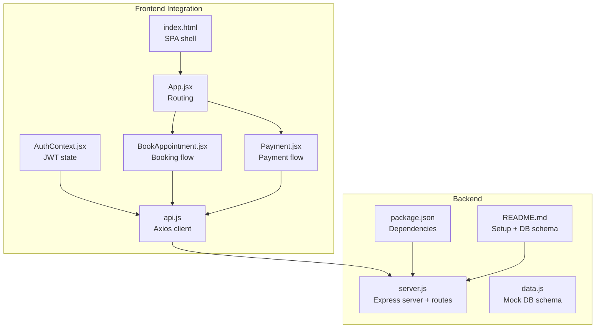
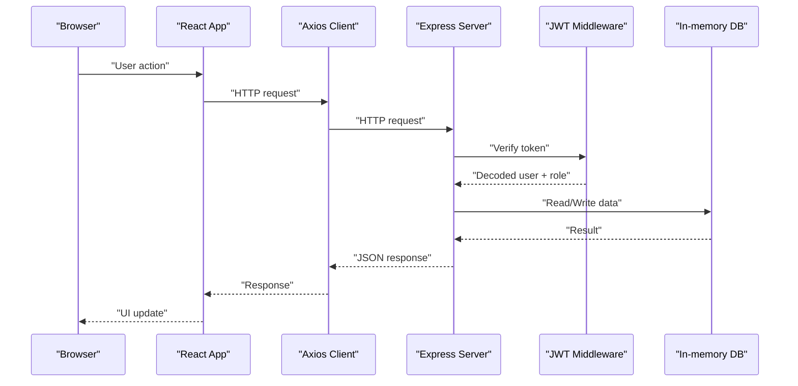
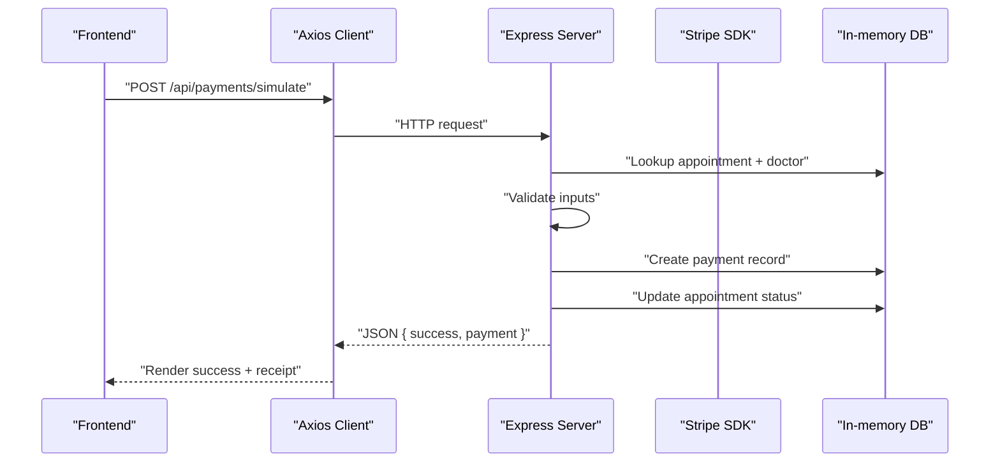
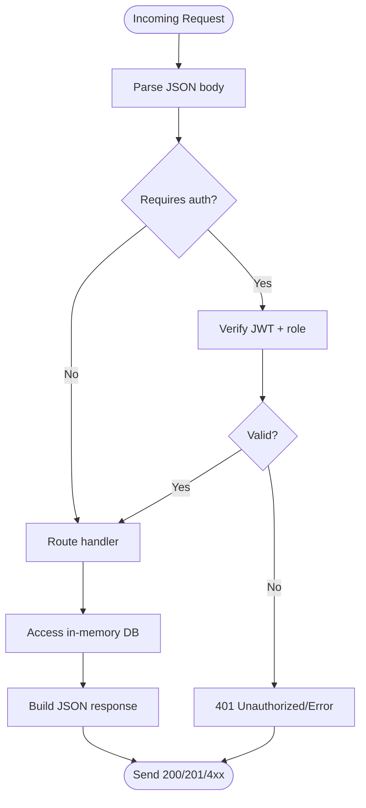
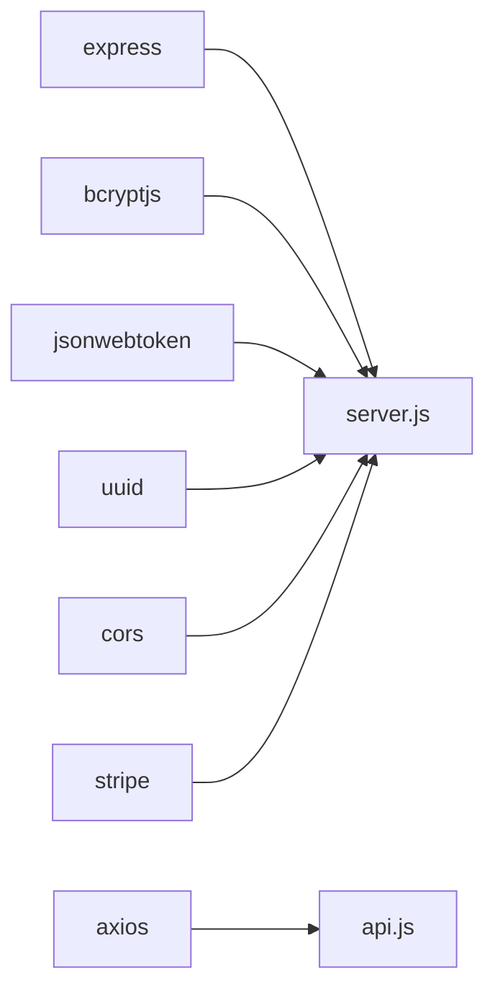

# Backend Architecture

<cite>
**Referenced Files in This Document**
- [server.js](file://server.js)
- [data.js](file://data.js)
- [package.json](file://package.json)
- [README.md](file://README.md)
- [api.js](file://api.js)
- [AuthContext.jsx](file://AuthContext.jsx)
- [index.html](file://index.html)
- [App.jsx](file://App.jsx)
- [BookAppointment.jsx](file://BookAppointment.jsx)
- [Payment.jsx](file://Payment.jsx)
</cite>

## Table of Contents
1. [Introduction](#introduction)
2. [Project Structure](#project-structure)
3. [Core Components](#core-components)
4. [Architecture Overview](#architecture-overview)
5. [Detailed Component Analysis](#detailed-component-analysis)
6. [Dependency Analysis](#dependency-analysis)
7. [Performance Considerations](#performance-considerations)
8. [Troubleshooting Guide](#troubleshooting-guide)
9. [Conclusion](#conclusion)
10. [Appendices](#appendices)

## Introduction
This document describes the backend architecture of a Node.js/Express-based Doctor appointment booking system. It focuses on the Express server configuration, middleware stack, RESTful API organization, in-memory data modeling, and the request-response lifecycle. It also documents the frontend-backend integration via Axios, JWT-based authentication, and the payment simulation flow. The goal is to provide a clear, layered understanding suitable for both technical and non-technical stakeholders.

## Project Structure
The backend is implemented in a single-file Express server with an in-memory data store. Supporting frontend integration is provided via an Axios-based API client and React components that consume the backend endpoints.

**Diagram sources**
- [server.js](file://server.js#L1-L390)
- [data.js](file://data.js#L1-L21)
- [package.json](file://package.json#L1-L24)
- [README.md](file://README.md#L1-L159)
- [api.js](file://api.js#L1-L44)
- [AuthContext.jsx](file://AuthContext.jsx#L1-L41)
- [index.html](file://index.html#L1-L531)
- [App.jsx](file://App.jsx#L1-L44)
- [BookAppointment.jsx](file://BookAppointment.jsx#L1-L171)
- [Payment.jsx](file://Payment.jsx#L1-L350)

**Section sources**
- [server.js](file://server.js#L1-L390)
- [data.js](file://data.js#L1-L21)
- [package.json](file://package.json#L1-L24)
- [README.md](file://README.md#L1-L159)
- [api.js](file://api.js#L1-L44)
- [AuthContext.jsx](file://AuthContext.jsx#L1-L41)
- [index.html](file://index.html#L1-L531)
- [App.jsx](file://App.jsx#L1-L44)
- [BookAppointment.jsx](file://BookAppointment.jsx#L1-L171)
- [Payment.jsx](file://Payment.jsx#L1-L350)

## Core Components
- Express server and middleware stack
  - CORS enabled globally
  - Body parsing for JSON
  - Static serving for SPA
  - Environment-driven port and secrets
- Authentication middleware
  - JWT verification with role gating
- In-memory data store
  - Patients, doctors, appointments, payments, admins
- RESTful API endpoints
  - Authentication, doctor listings, appointment management, patient profile, admin dashboards, payment simulation
- Frontend integration
  - Axios client configured with base URL
  - React components invoking backend endpoints
  - JWT propagation via Authorization header

**Section sources**
- [server.js](file://server.js#L17-L25)
- [server.js](file://server.js#L49-L62)
- [server.js](file://server.js#L29-L44)
- [server.js](file://server.js#L67-L390)
- [api.js](file://api.js#L1-L44)
- [AuthContext.jsx](file://AuthContext.jsx#L1-L41)

## Architecture Overview
The backend follows a thin server pattern with all routes defined in a single file. Middleware handles cross-origin, JSON parsing, and static assets. Authentication is enforced via a custom middleware that validates JWTs and enforces role-based access. The in-memory store simulates a relational schema with arrays and UUIDs. The frontend consumes the API via Axios and manages JWT state in local storage.

**Diagram sources**
- [server.js](file://server.js#L49-L62)
- [server.js](file://server.js#L29-L44)
- [api.js](file://api.js#L1-L44)
- [AuthContext.jsx](file://AuthContext.jsx#L1-L41)

## Detailed Component Analysis

### Express Server and Middleware Stack
- CORS: Enabled globally to allow frontend-origin requests.
- Body parsing: JSON bodies are parsed for all routes.
- Static serving: Serves the SPA index.html for non-API routes.
- Environment configuration:
  - Port defaults to 5000 or reads from environment.
  - JWT secret defaults to a development value or reads from environment.
  - Stripe secret key defaults to a test key or reads from environment.

Key behaviors:
- All API routes are prefixed with /api.
- Non-API GET requests serve the SPA index.html.

**Section sources**
- [server.js](file://server.js#L17-L25)
- [server.js](file://server.js#L18-L19)
- [server.js](file://server.js#L13-L15)
- [server.js](file://server.js#L382-L384)

### Authentication Middleware
A reusable middleware verifies JWTs and enforces role checks:
- Extracts token from Authorization header.
- Verifies signature using the configured secret.
- Enforces role if provided (patient, doctor, admin).
- Attaches decoded user to request for downstream handlers.

Common usage:
- Protects doctor and admin routes.
- Ensures only authorized users can access protected endpoints.

**Section sources**
- [server.js](file://server.js#L49-L62)

### In-Memory Data Model
The in-memory store mirrors a relational schema:
- Patients: unique identifiers, credentials, profile fields.
- Doctors: profile, specialization, experience, availability, ratings, reviews.
- Appointments: foreign keys to patients/doctors, date/time, status, timestamps.
- Payments: transaction records, amounts, methods, statuses.
- Admins: administrative credentials.

Seed data includes multiple doctors with predefined availability and ratings.

Notes:
- UUIDs are generated for new entities.
- Passwords are hashed with bcrypt.
- Ratings are recalculated when reviews are added.

**Section sources**
- [server.js](file://server.js#L29-L44)
- [data.js](file://data.js#L3-L21)

### API Endpoint Organization
Endpoints are grouped by functional area:

- Authentication
  - Patient registration and login
  - Doctor login
  - Admin login
- Doctor Management
  - Public listing and filtering
  - Doctor-specific appointment listing
  - Approve/reject appointments
  - Add reviews
- Appointment Management
  - Book appointment with conflict detection
  - List patient’s appointments
  - Cancel appointment
- Patient Profile
  - Retrieve and update profile
- Admin Dashboard
  - System statistics
  - Manage appointments
  - Manage patients and doctors
- Payments
  - Consultation fee lookup
  - Payment intent creation (Stripe)
  - Payment simulation (no real charges)
  - Receipt retrieval
  - Admin view of payments

Error handling:
- Validation errors return 400 with error messages.
- Not found returns 404 with error messages.
- Access denied returns 403.
- Unauthorized returns 401.
- Stripe unavailability returns 503 when the package is missing.

Response formatting:
- JSON bodies for all responses.
- Errors include an error field for clarity.
- Successful responses include resource data.

**Section sources**
- [server.js](file://server.js#L67-L110)
- [server.js](file://server.js#L116-L164)
- [server.js](file://server.js#L170-L217)
- [server.js](file://server.js#L222-L239)
- [server.js](file://server.js#L244-L280)
- [server.js](file://server.js#L298-L377)

### Frontend Integration and Request-Response Cycle
- Axios client configured with base URL /api.
- React components call API functions exported from api.js.
- AuthContext sets Authorization header when a token exists.
- The SPA serves index.html for non-API routes.

Typical flow:
- User navigates to a page.
- Component invokes an API function.
- Axios sends HTTP request to backend.
- Backend validates JWT (if required), accesses in-memory store, and returns JSON.
- Frontend updates UI state with the response.

**Section sources**
- [api.js](file://api.js#L1-L44)
- [AuthContext.jsx](file://AuthContext.jsx#L1-L41)
- [index.html](file://index.html#L382-L384)
- [App.jsx](file://App.jsx#L1-L44)
- [BookAppointment.jsx](file://BookAppointment.jsx#L1-L171)
- [Payment.jsx](file://Payment.jsx#L1-L350)

### Payment Processing Flow
- Consultation fee is derived from doctor specialization.
- Payment simulation endpoint accepts card/mobile/bank details and marks appointment as approved upon success.
- Receipt retrieval endpoint returns payment details for a given appointment.

**Diagram sources**
- [server.js](file://server.js#L298-L353)
- [server.js](file://server.js#L288-L295)
- [api.js](file://api.js#L39-L44)

**Section sources**
- [server.js](file://server.js#L288-L353)
- [api.js](file://api.js#L39-L44)

### MVC Pattern Implementation
- Model: In-memory data structures in server.js and data.js.
- View: SPA served by Express static middleware.
- Controller: Route handlers in server.js that orchestrate model access and response formatting.

Notes:
- The server.js file acts as both controller and model layer for simplicity.
- There is no separate model file; data.js provides a small subset of seed data.

**Section sources**
- [server.js](file://server.js#L29-L44)
- [data.js](file://data.js#L1-L21)

### Request-Response Cycle and Error Handling
- All routes return JSON responses.
- Errors are standardized with an error field and appropriate HTTP status codes.
- JWT middleware centralizes authentication and role checks.

**Diagram sources**
- [server.js](file://server.js#L49-L62)
- [server.js](file://server.js#L67-L390)

**Section sources**
- [server.js](file://server.js#L49-L62)
- [server.js](file://server.js#L67-L390)

## Dependency Analysis
External dependencies include Express, bcrypt, jsonwebtoken, uuid, cors, stripe, and axios (frontend). The backend uses bcrypt for password hashing and JWT for authentication. Stripe is integrated for payment intents, with a fallback simulation route.

**Diagram sources**
- [package.json](file://package.json#L14-L22)
- [server.js](file://server.js#L5-L24)
- [api.js](file://api.js#L1)

**Section sources**
- [package.json](file://package.json#L14-L22)
- [server.js](file://server.js#L5-L24)
- [api.js](file://api.js#L1)

## Performance Considerations
- In-memory store: Suitable for demos and small loads; consider persistence for production.
- JWT overhead: Minimal; ensure token lifetime aligns with security policy.
- Stripe integration: Optional; ensure environment variables are set in production.
- Static serving: Efficient for SPA delivery.

[No sources needed since this section provides general guidance]

## Troubleshooting Guide
Common issues and resolutions:
- Missing Stripe secret key
  - Symptom: Payment intent creation returns 503.
  - Resolution: Set STRIPE_SECRET_KEY environment variable.
- Invalid or expired JWT
  - Symptom: 401 Unauthorized on protected routes.
  - Resolution: Re-authenticate and ensure token is present in Authorization header.
- Conflicting appointment booking
  - Symptom: 409 Conflict when booking.
  - Resolution: Select another time slot or date.
- Not found resources
  - Symptom: 404 Not Found for doctors/appointments/payments.
  - Resolution: Verify IDs and existence in the in-memory store.

**Section sources**
- [server.js](file://server.js#L13-L15)
- [server.js](file://server.js#L49-L62)
- [server.js](file://server.js#L178-L179)
- [server.js](file://server.js#L298-L316)

## Conclusion
The backend employs a straightforward, single-file Express architecture with in-memory data and JWT-based authentication. It cleanly separates concerns via middleware and route handlers, and integrates seamlessly with a React frontend through Axios. For production, consider replacing the in-memory store with a persistent database, adding rate limiting, input sanitization, and comprehensive logging.

[No sources needed since this section summarizes without analyzing specific files]

## Appendices

### API Design Principles and Standards
- RESTful URLs with plural nouns and hyphens for readability.
- Standardized JSON responses with consistent error fields.
- HTTP status codes aligned with semantics (200/201/4xx/5xx).
- Role-based access control enforced via middleware.

**Section sources**
- [server.js](file://server.js#L67-L390)
- [api.js](file://api.js#L1-L44)

### Environment Configuration
- PORT: Server port (default 5000).
- JWT_SECRET: Secret for signing JWTs (default provided).
- STRIPE_SECRET_KEY: Stripe secret key for payment intents (default test key).

**Section sources**
- [server.js](file://server.js#L18-L19)
- [server.js](file://server.js#L13-L15)

### Database Schema (In-Memory)
- Patients, Doctors, Appointments, Payments, Admins with primary keys and relationships.

**Section sources**
- [README.md](file://README.md#L103-L148)