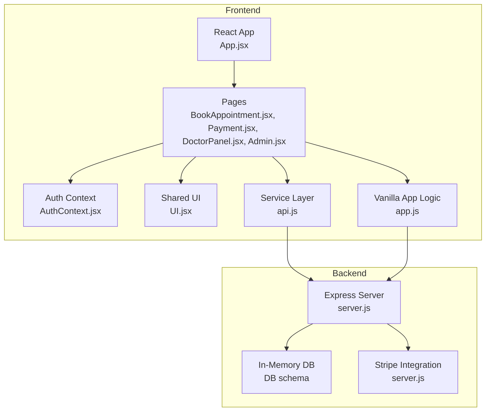
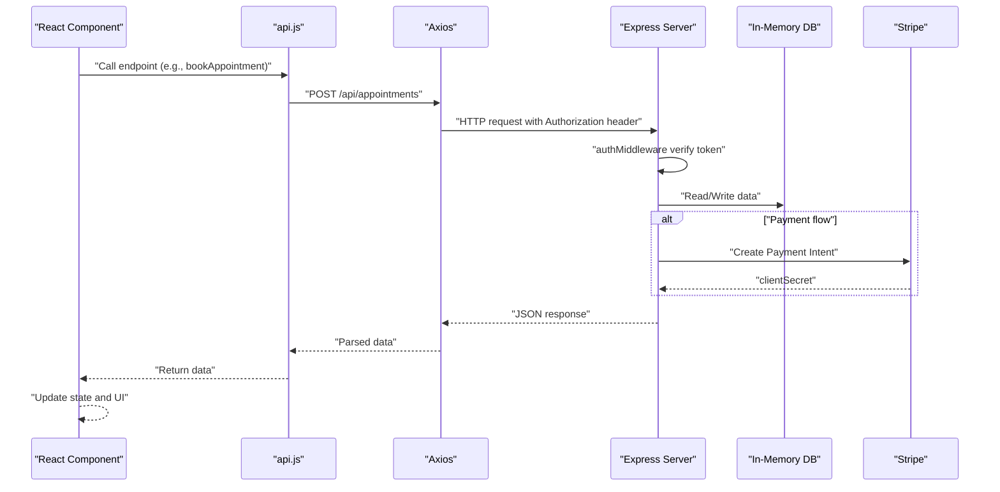
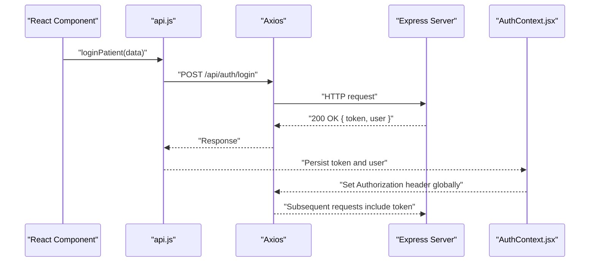
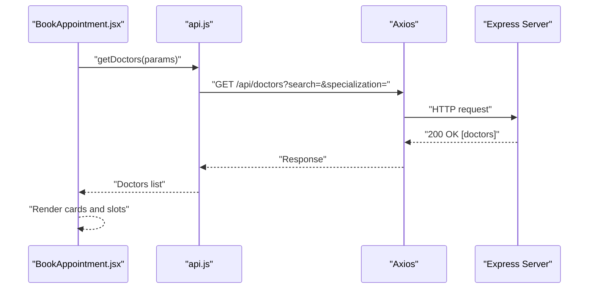
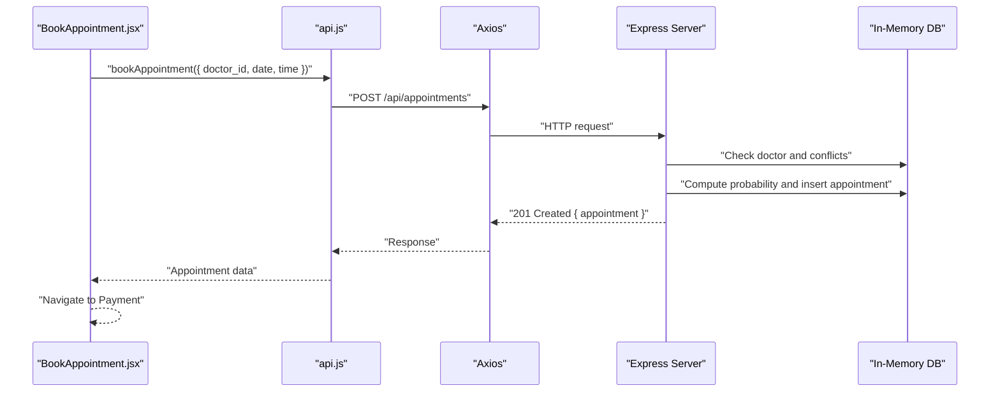
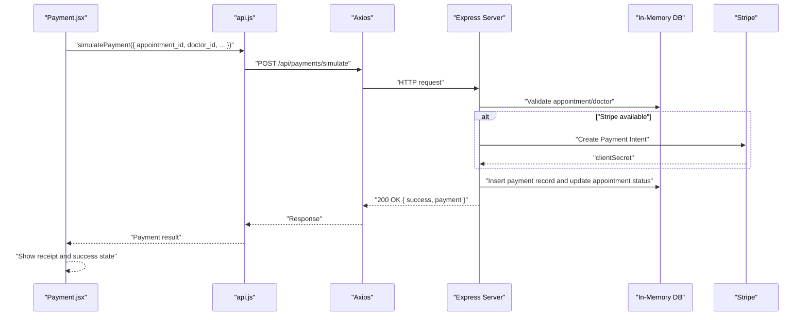
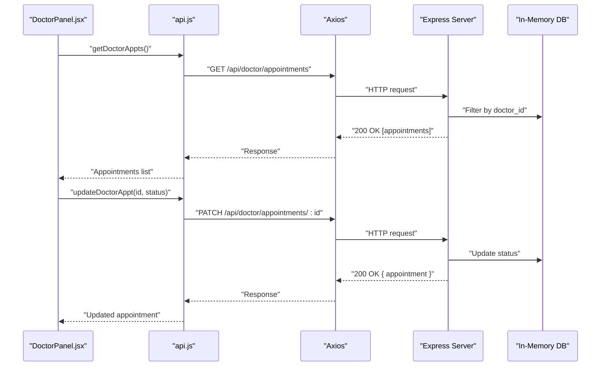
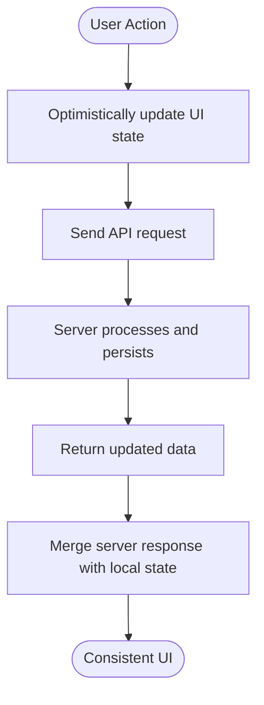
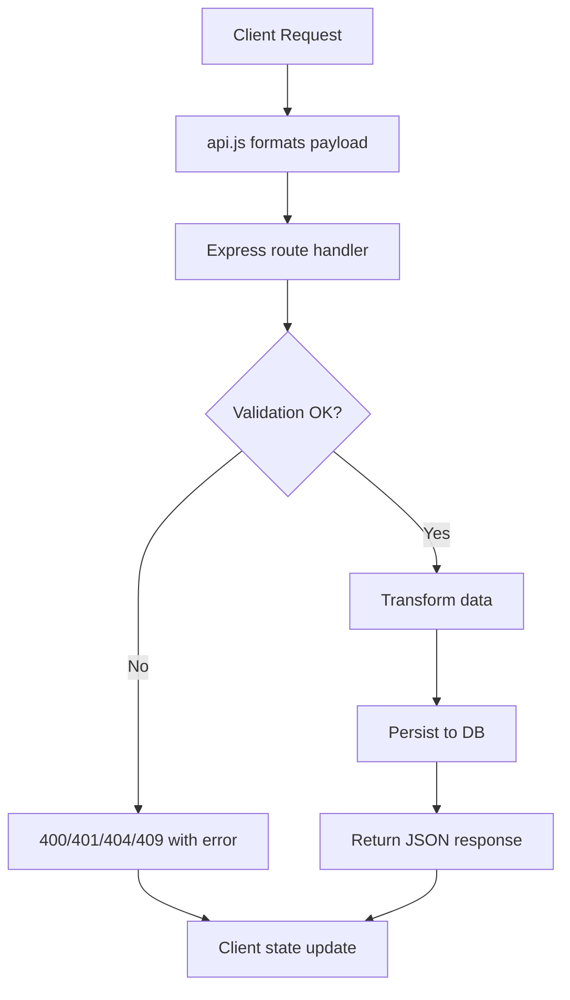
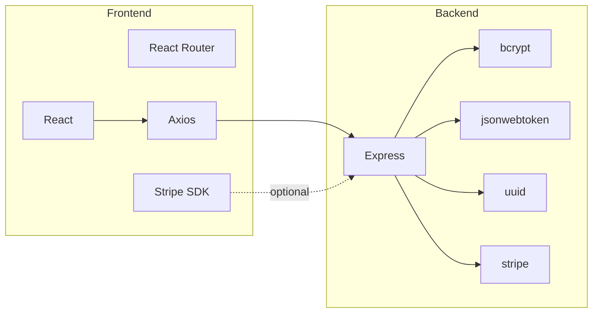

# Data Flow and Communication

<cite>
**Referenced Files in This Document**
- [api.js](file://api.js)
- [server.js](file://server.js)
- [AuthContext.jsx](file://AuthContext.jsx)
- [App.jsx](file://App.jsx)
- [BookAppointment.jsx](file://BookAppointment.jsx)
- [Payment.jsx](file://Payment.jsx)
- [UI.jsx](file://UI.jsx)
- [DoctorPanel.jsx](file://DoctorPanel.jsx)
- [Admin.jsx](file://Admin.jsx)
- [index.html](file://index.html)
- [app.js](file://app.js)
- [package.json](file://package.json)
</cite>

## Table of Contents
1. [Introduction](#introduction)
2. [Project Structure](#project-structure)
3. [Core Components](#core-components)
4. [Architecture Overview](#architecture-overview)
5. [Detailed Component Analysis](#detailed-component-analysis)
6. [Dependency Analysis](#dependency-analysis)
7. [Performance Considerations](#performance-considerations)
8. [Troubleshooting Guide](#troubleshooting-guide)
9. [Conclusion](#conclusion)

## Introduction
This document explains the data flow patterns and communication mechanisms in the Doctor appointment booking system. It covers how React components initiate API requests through a service layer, how the Express backend handles requests and enforces authentication, and how state synchronization occurs across the frontend and backend. It also documents authentication using JWT tokens, data transformation and request/response formatting, error propagation, and integration with external services like Stripe for payments. Practical scenarios such as user authentication, doctor search, appointment booking, and payment processing are included, along with caching strategies, consistency mechanisms, and performance optimizations.

## Project Structure
The system comprises:
- Frontend (React + vanilla JS):
  - React pages and components (App routing, authentication, booking, payment, doctor panel, admin)
  - Shared UI components and utilities
  - A lightweight service layer for API calls
- Backend (Node.js/Express):
  - Authentication middleware and routes for patients, doctors, appointments, profiles, admin, and payments
  - In-memory database mirroring the schema
  - Stripe integration for payment processing

**Diagram sources**
- [App.jsx](file://App.jsx#L15-L43)
- [BookAppointment.jsx](file://BookAppointment.jsx#L1-L171)
- [Payment.jsx](file://Payment.jsx#L1-L350)
- [AuthContext.jsx](file://AuthContext.jsx#L1-L41)
- [UI.jsx](file://UI.jsx#L1-L182)
- [api.js](file://api.js#L1-L44)
- [app.js](file://app.js#L1-L800)
- [server.js](file://server.js#L1-L390)

**Section sources**
- [App.jsx](file://App.jsx#L15-L43)
- [index.html](file://index.html#L1-L552)
- [package.json](file://package.json#L1-L24)

## Core Components
- Service layer (api.js): Centralizes HTTP calls to backend endpoints, grouping operations by domain (auth, doctors, appointments, doctor panel, admin, payments).
- Backend (server.js): Implements Express routes, JWT middleware, in-memory DB, and Stripe integration.
- React components: Pages and shared UI handle user interactions, state updates, and navigation.
- Vanilla app logic (app.js): Provides legacy DOM-driven flows and in-memory cache fallback for offline-like behavior.
- Auth context (AuthContext.jsx): Manages JWT token lifecycle and persists user preferences.

Key responsibilities:
- api.js: Exposes typed functions for each endpoint; injects Authorization header automatically.
- server.js: Validates JWT, enforces role-based access, transforms data, and integrates with Stripe.
- React components: Drive user flows, validate inputs, and update local state.
- app.js: Maintains in-memory DB and theme preferences; restores session on load.
- AuthContext.jsx: Persists tokens and theme; sets global Axios defaults.

**Section sources**
- [api.js](file://api.js#L1-L44)
- [server.js](file://server.js#L49-L62)
- [AuthContext.jsx](file://AuthContext.jsx#L1-L41)
- [app.js](file://app.js#L5-L105)

## Architecture Overview
The system follows a classic client-server model:
- React components call api.js functions to communicate with /api endpoints.
- api.js uses axios with a base URL of /api and attaches JWT tokens via Authorization headers.
- server.js validates tokens, enforces roles, and serves transformed data.
- Stripe is integrated for payment processing; the backend creates Payment Intents and stores receipts.

**Diagram sources**
- [api.js](file://api.js#L16-L20)
- [server.js](file://server.js#L49-L62)
- [server.js](file://server.js#L170-L202)
- [server.js](file://server.js#L297-L316)

## Detailed Component Analysis

### Authentication Flow (JWT)
- Token storage and propagation:
  - api.js attaches Authorization: Bearer token to all requests.
  - AuthContext.jsx stores tokens in localStorage and sets axios defaults.
  - server.js authMiddleware extracts token from Authorization header and verifies it using JWT_SECRET.
- Token lifecycle:
  - Registration/Login: server signs JWT with role and expiration; client stores token and user.
  - Middleware: Protects routes by role; rejects missing/expired tokens.
- Refresh mechanism:
  - No explicit token refresh is implemented; tokens expire after 7 days.

**Diagram sources**
- [api.js](file://api.js#L6-L9)
- [AuthContext.jsx](file://AuthContext.jsx#L11-L14)
- [server.js](file://server.js#L82-L90)

**Section sources**
- [api.js](file://api.js#L1-L44)
- [AuthContext.jsx](file://AuthContext.jsx#L1-L41)
- [server.js](file://server.js#L49-L62)
- [server.js](file://server.js#L68-L110)

### Doctor Search and Listing
- Frontend:
  - React components fetch doctor lists and apply filters (search term, specialization).
  - UI renders cards with ratings, slots, and fees.
- Backend:
  - GET /api/doctors supports query parameters for filtering.
  - Returns sanitized doctor records (without sensitive fields).

**Diagram sources**
- [BookAppointment.jsx](file://BookAppointment.jsx#L28-L32)
- [api.js](file://api.js#L12-L14)
- [server.js](file://server.js#L116-L123)

**Section sources**
- [BookAppointment.jsx](file://BookAppointment.jsx#L1-L171)
- [api.js](file://api.js#L11-L14)
- [server.js](file://server.js#L116-L123)

### Appointment Booking Flow
- Frontend:
  - Select date/time, compute confirmation probability, and navigate to payment.
  - On success, update local state and show receipt.
- Backend:
  - POST /api/appointments validates inputs, checks conflicts, computes confirmation probability, and persists appointment.
  - Responds with created appointment.

**Diagram sources**
- [BookAppointment.jsx](file://BookAppointment.jsx#L39-L60)
- [api.js](file://api.js#L17-L18)
- [server.js](file://server.js#L170-L202)

**Section sources**
- [BookAppointment.jsx](file://BookAppointment.jsx#L1-L171)
- [api.js](file://api.js#L16-L20)
- [server.js](file://server.js#L170-L202)

### Payment Processing (Stripe Integration)
- Frontend:
  - Payment.jsx collects method and details, validates inputs, and posts to /api/payments/simulate.
  - Displays success receipt and allows printing.
- Backend:
  - /api/payments/simulate validates appointment/doctor existence and simulates payment creation.
  - Updates appointment status to approved upon success.
  - Stripe integration is present; if available, Payment Intents are created and clientSecret is returned.

**Diagram sources**
- [Payment.jsx](file://Payment.jsx#L62-L98)
- [api.js](file://api.js#L40-L43)
- [server.js](file://server.js#L318-L353)
- [server.js](file://server.js#L297-L316)

**Section sources**
- [Payment.jsx](file://Payment.jsx#L1-L350)
- [api.js](file://api.js#L39-L43)
- [server.js](file://server.js#L284-L377)

### Doctor Panel and Admin Workflows
- Doctor Panel:
  - Fetches doctor’s appointments, displays statuses, and updates approvals/rejections.
- Admin:
  - Loads stats, manages appointments, patients, doctors, and payments.

**Diagram sources**
- [DoctorPanel.jsx](file://DoctorPanel.jsx#L15-L28)
- [api.js](file://api.js#L22-L23)
- [server.js](file://server.js#L133-L153)

**Section sources**
- [DoctorPanel.jsx](file://DoctorPanel.jsx#L1-L96)
- [Admin.jsx](file://Admin.jsx#L1-L194)
- [api.js](file://api.js#L29-L35)
- [server.js](file://server.js#L242-L280)

### State Synchronization Patterns
- Optimistic UI:
  - Frontend updates state immediately after initiating a request (e.g., selecting a slot, approving an appointment).
  - Subsequent server responses either confirm or reconcile changes.
- Local caching:
  - app.js maintains an in-memory DB for offline-like behavior and theme persistence.
  - AuthContext.jsx persists tokens and theme preferences.
- Real-time updates:
  - No WebSocket or server-sent events are implemented; updates rely on re-fetching data after mutations.

[No sources needed since this diagram shows conceptual workflow, not actual code structure]

**Section sources**
- [app.js](file://app.js#L35-L40)
- [AuthContext.jsx](file://AuthContext.jsx#L7-L25)
- [DoctorPanel.jsx](file://DoctorPanel.jsx#L22-L28)

### Data Transformation and Request/Response Formatting
- Request formatting:
  - api.js centralizes endpoint URLs and request bodies; axios automatically serializes JSON.
- Response shaping:
  - server.js returns sanitized data (e.g., removing passwords) and enriches records (e.g., adding computed fields).
- Error handling:
  - server.js responds with structured errors; api.js throws on non-OK responses; React components catch and display messages.

**Diagram sources**
- [api.js](file://api.js#L1-L44)
- [server.js](file://server.js#L68-L110)
- [server.js](file://server.js#L170-L202)

**Section sources**
- [api.js](file://api.js#L1-L44)
- [server.js](file://server.js#L68-L110)
- [server.js](file://server.js#L170-L202)

### Error Propagation
- Backend:
  - Explicit validation returns 400/401/404/409 with error messages.
  - JWT verification failures return 401.
- Frontend:
  - api.js throws on non-OK responses; React components catch and show user-friendly messages.

**Section sources**
- [server.js](file://server.js#L70-L79)
- [server.js](file://server.js#L82-L90)
- [BookAppointment.jsx](file://BookAppointment.jsx#L57-L59)

## Dependency Analysis
- Frontend dependencies:
  - React ecosystem (routing, context, components)
  - Axios for HTTP requests
  - Stripe SDK for payments (optional)
- Backend dependencies:
  - Express, CORS, bcrypt, jsonwebtoken, uuid, stripe

**Diagram sources**
- [package.json](file://package.json#L14-L22)
- [server.js](file://server.js#L5-L20)

**Section sources**
- [package.json](file://package.json#L14-L22)
- [server.js](file://server.js#L5-L20)

## Performance Considerations
- Caching strategies:
  - In-memory DB in app.js reduces repeated network calls during navigation.
  - LocalStorage persists tokens and theme to avoid re-authentication overhead.
- Request batching:
  - Admin dashboard uses Promise.all to fetch multiple datasets concurrently.
- Data consistency:
  - Optimistic updates improve perceived performance; server responses reconcile discrepancies.
- Network efficiency:
  - Minimal payload sizes; server returns only necessary fields.
- Real-time:
  - No real-time updates; polling is not implemented.

**Section sources**
- [app.js](file://app.js#L35-L40)
- [AuthContext.jsx](file://AuthContext.jsx#L7-L19)
- [Admin.jsx](file://Admin.jsx#L21-L23)

## Troubleshooting Guide
- Authentication issues:
  - Missing or invalid token leads to 401 responses; ensure Authorization header is set.
  - Verify JWT_SECRET and token expiration.
- Payment failures:
  - If Stripe key is missing, backend returns 503; configure STRIPE_SECRET_KEY.
  - Validate appointment/doctor existence before payment simulation.
- Booking conflicts:
  - Ensure selected slot is free; backend prevents double-booking.
- UI not reflecting updates:
  - Confirm optimistic updates are followed by server reconciliation; re-fetch data if needed.

**Section sources**
- [server.js](file://server.js#L49-L62)
- [server.js](file://server.js#L178-L179)
- [server.js](file://server.js#L297-L316)

## Conclusion
The Doctor appointment booking system implements a clean separation between frontend and backend, with a focused service layer and robust JWT-based authentication. Data flows are predictable: React components trigger api.js calls, which reach Express endpoints protected by middleware. Payments integrate with Stripe when configured, otherwise a simulation endpoint provides a demo flow. State synchronization uses optimistic UI with server reconciliation, while caching and localStorage improve performance and UX. The architecture supports extensibility for real-time updates and advanced caching strategies.