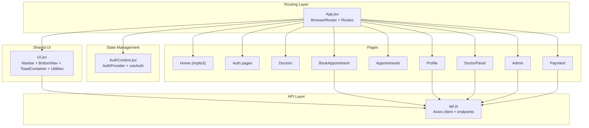
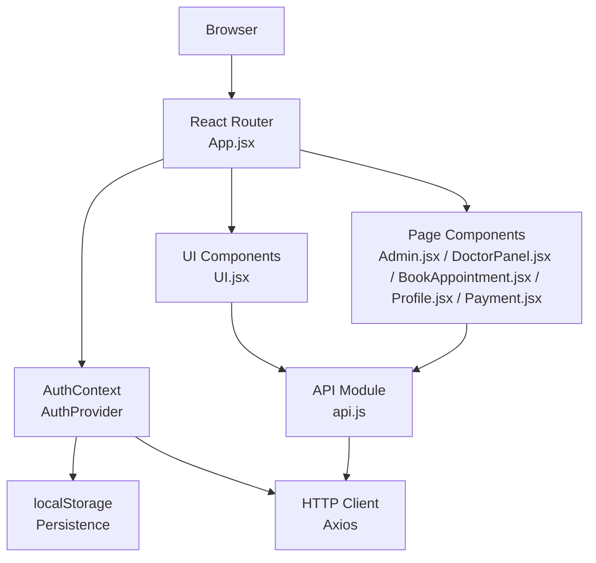
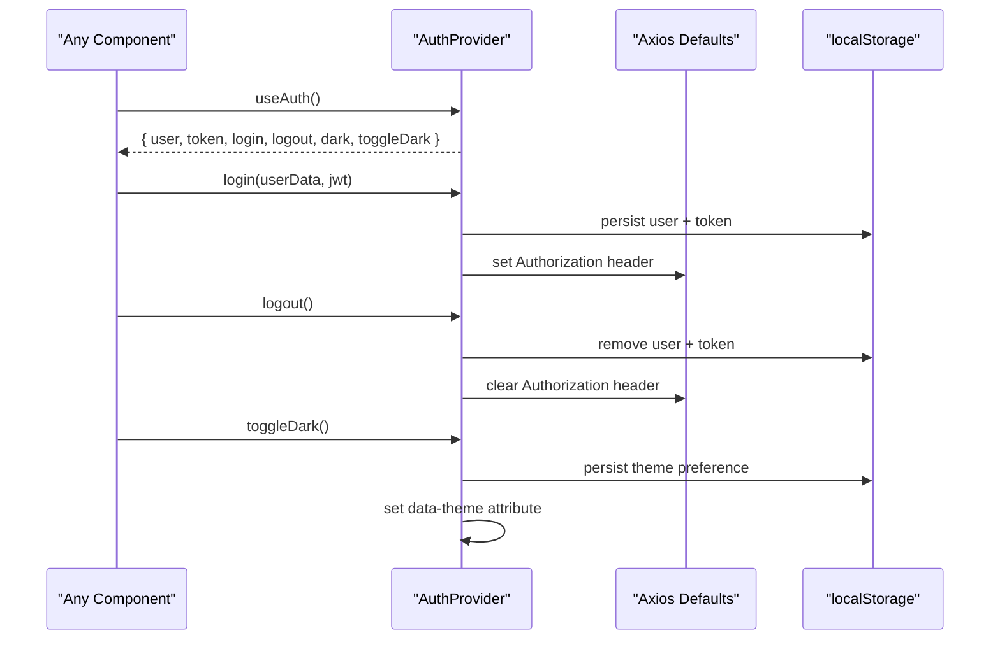
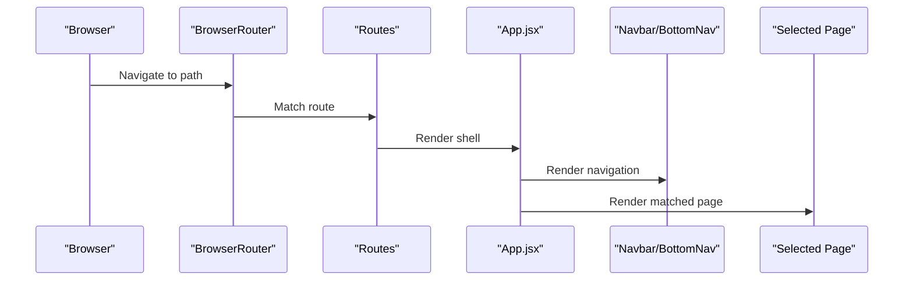
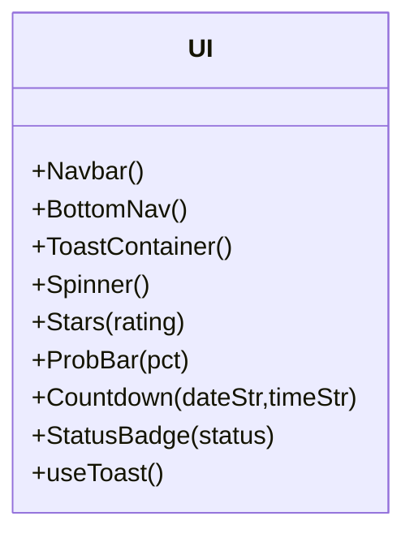
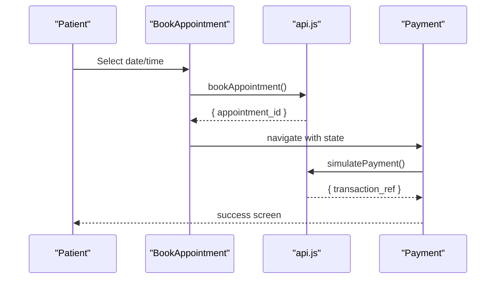
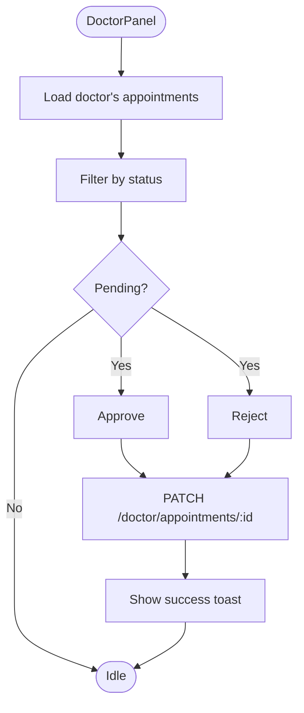
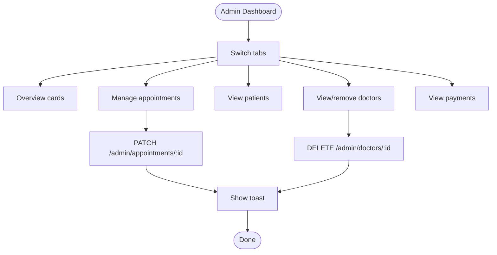
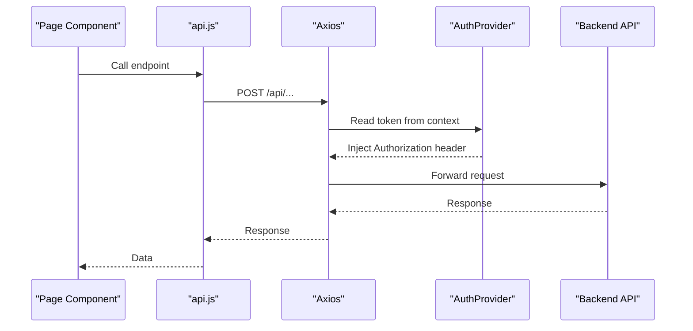
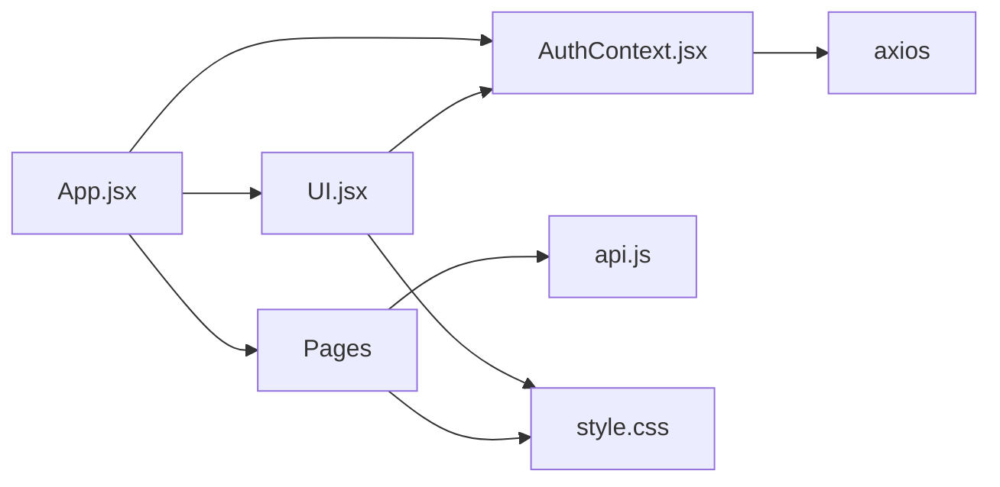

# Frontend Architecture

<cite>
**Referenced Files in This Document**
- [App.jsx](file://App.jsx)
- [AuthContext.jsx](file://AuthContext.jsx)
- [UI.jsx](file://UI.jsx)
- [Admin.jsx](file://Admin.jsx)
- [DoctorPanel.jsx](file://DoctorPanel.jsx)
- [BookAppointment.jsx](file://BookAppointment.jsx)
- [Profile.jsx](file://Profile.jsx)
- [Payment.jsx](file://Payment.jsx)
- [api.js](file://api.js)
- [style.css](file://style.css)
- [README.md](file://README.md)
</cite>

## Table of Contents
1. [Introduction](#introduction)
2. [Project Structure](#project-structure)
3. [Core Components](#core-components)
4. [Architecture Overview](#architecture-overview)
5. [Detailed Component Analysis](#detailed-component-analysis)
6. [Dependency Analysis](#dependency-analysis)
7. [Performance Considerations](#performance-considerations)
8. [Troubleshooting Guide](#troubleshooting-guide)
9. [Conclusion](#conclusion)

## Introduction
This document describes the frontend architecture of a React-based Doctor appointment booking system. It focuses on the component hierarchy, routing with React Router, centralized authentication state management via a Context Provider, reusable UI components, role-based page components, state management patterns, component communication strategies, API integration, responsive design, and performance considerations.

## Project Structure
The frontend is organized around a single-page application with:
- A root component that configures routing and wraps the app with authentication context
- A dedicated UI module exporting shared components (navigation, toasts, spinners)
- Role-specific page components for patients, doctors, and administrators
- An API module encapsulating HTTP client configuration and endpoint definitions
- A global stylesheet supporting light/dark themes and responsive design

**Diagram sources**
- [App.jsx](file://App.jsx#L15-L42)
- [AuthContext.jsx](file://AuthContext.jsx#L6-L38)
- [UI.jsx](file://UI.jsx#L97-L176)
- [api.js](file://api.js#L1-L44)

**Section sources**
- [README.md](file://README.md#L7-L33)
- [App.jsx](file://App.jsx#L1-L44)
- [AuthContext.jsx](file://AuthContext.jsx#L1-L41)
- [UI.jsx](file://UI.jsx#L1-L182)
- [api.js](file://api.js#L1-L44)

## Core Components
- App.jsx: Root component configuring React Router, wrapping children with AuthProvider, rendering Navbar, ToastContainer, and BottomNav, and defining all application routes.
- AuthContext.jsx: Provides centralized authentication state (user, token, theme preference) and exposes login/logout functions and a dark mode toggle. Persists state to localStorage and applies theme to the document element.
- UI.jsx: Reusable UI primitives including Navbar, BottomNav, ToastContainer, Spinner, Stars, ProbBar, Countdown, StatusBadge, and a toast hook. Implements a toast system with message queuing and automatic dismissal.
- api.js: Axios-based HTTP client configured with base URL and a set of exported functions for authentication, doctor listings, appointments, doctor panel actions, admin operations, and payment endpoints.

Key patterns:
- Context API for global state (authentication and theme)
- React Router for declarative navigation
- Encapsulated API module for clean service boundaries
- Utility components for cross-cutting concerns (toasts, spinners)

**Section sources**
- [App.jsx](file://App.jsx#L15-L42)
- [AuthContext.jsx](file://AuthContext.jsx#L6-L40)
- [UI.jsx](file://UI.jsx#L1-L182)
- [api.js](file://api.js#L1-L44)

## Architecture Overview
The frontend follows a layered architecture:
- Presentation layer: Pages and shared UI components
- State management layer: AuthProvider and local storage persistence
- API integration layer: Centralized axios client with typed endpoints
- Styling layer: CSS variables, theme switching, and responsive breakpoints

**Diagram sources**
- [App.jsx](file://App.jsx#L15-L42)
- [AuthContext.jsx](file://AuthContext.jsx#L6-L38)
- [UI.jsx](file://UI.jsx#L1-L182)
- [Admin.jsx](file://Admin.jsx#L1-L194)
- [DoctorPanel.jsx](file://DoctorPanel.jsx#L1-L96)
- [BookAppointment.jsx](file://BookAppointment.jsx#L1-L171)
- [Profile.jsx](file://Profile.jsx#L1-L97)
- [Payment.jsx](file://Payment.jsx#L1-L350)
- [api.js](file://api.js#L1-L44)

## Detailed Component Analysis

### Authentication and State Management
The AuthProvider pattern centralizes authentication state and theme preferences:
- State initialization from localStorage
- Authorization header propagation via axios defaults
- Theme persistence and DOM attribute updates
- Public API: login, logout, dark mode toggle

**Diagram sources**
- [AuthContext.jsx](file://AuthContext.jsx#L6-L38)

**Section sources**
- [AuthContext.jsx](file://AuthContext.jsx#L1-L41)

### Routing and Navigation
App.jsx defines all application routes and renders shared UI:
- Top-level routes for home, auth, doctors, booking, appointments, profile, doctor panel, admin, and payment
- Navbar and BottomNav provide cross-role navigation
- ToastContainer displays transient messages

**Diagram sources**
- [App.jsx](file://App.jsx#L15-L42)
- [UI.jsx](file://UI.jsx#L97-L176)

**Section sources**
- [App.jsx](file://App.jsx#L1-L44)
- [UI.jsx](file://UI.jsx#L97-L176)

### Shared UI Components
UI.jsx exports:
- Navbar: Role-aware links and actions, dark mode toggle, logout
- BottomNav: Mobile-first navigation with role-specific items
- ToastContainer: Queued toast notifications with auto-dismiss
- Utilities: Spinner, Stars, ProbBar, Countdown, StatusBadge

**Diagram sources**
- [UI.jsx](file://UI.jsx#L1-L182)

**Section sources**
- [UI.jsx](file://UI.jsx#L1-L182)

### Patient Role Pages
- BookAppointment: Doctor details, time slot selection, confirmation probability, review submission
- Profile: Personal details editing, password change, optimistic updates
- Appointments: List of bookings, status badges, cancellation flow
- Payment: Multi-step secure payment with method selection and simulated processing

**Diagram sources**
- [BookAppointment.jsx](file://BookAppointment.jsx#L39-L60)
- [Payment.jsx](file://Payment.jsx#L62-L98)
- [api.js](file://api.js#L17-L43)

**Section sources**
- [BookAppointment.jsx](file://BookAppointment.jsx#L1-L171)
- [Profile.jsx](file://Profile.jsx#L1-L97)
- [Payment.jsx](file://Payment.jsx#L1-L350)
- [api.js](file://api.js#L1-L44)

### Doctor Role Page
- DoctorPanel: Incoming appointment requests, status filtering, approve/reject actions

**Diagram sources**
- [DoctorPanel.jsx](file://DoctorPanel.jsx#L15-L28)
- [api.js](file://api.js#L22-L23)

**Section sources**
- [DoctorPanel.jsx](file://DoctorPanel.jsx#L1-L96)
- [api.js](file://api.js#L22-L23)

### Admin Role Page
- Admin: Dashboard with stats, tabbed views for appointments, patients, doctors, payments; bulk actions and deletions

**Diagram sources**
- [Admin.jsx](file://Admin.jsx#L19-L41)
- [api.js](file://api.js#L30-L35)

**Section sources**
- [Admin.jsx](file://Admin.jsx#L1-L194)
- [api.js](file://api.js#L29-L35)

### API Integration Patterns
- Centralized axios client with base URL pointing to backend routes
- Typed endpoints for auth, doctors, appointments, doctor panel, admin, and payments
- Token propagation via Authorization header managed by AuthProvider

**Diagram sources**
- [api.js](file://api.js#L1-L44)
- [AuthContext.jsx](file://AuthContext.jsx#L11-L14)

**Section sources**
- [api.js](file://api.js#L1-L44)
- [AuthContext.jsx](file://AuthContext.jsx#L1-L41)

## Dependency Analysis
- App.jsx depends on AuthProvider, UI components, and page components
- UI.jsx depends on AuthContext and React Router hooks
- Page components depend on API module and UI utilities
- AuthContext depends on axios and localStorage
- Styles rely on CSS variables and media queries

**Diagram sources**
- [App.jsx](file://App.jsx#L1-L44)
- [AuthContext.jsx](file://AuthContext.jsx#L1-L41)
- [UI.jsx](file://UI.jsx#L1-L182)
- [api.js](file://api.js#L1-L44)
- [style.css](file://style.css#L1-L800)

**Section sources**
- [App.jsx](file://App.jsx#L1-L44)
- [AuthContext.jsx](file://AuthContext.jsx#L1-L41)
- [UI.jsx](file://UI.jsx#L1-L182)
- [api.js](file://api.js#L1-L44)
- [style.css](file://style.css#L1-L800)

## Performance Considerations
- Context granularity: AuthProvider holds user, token, and theme; consider splitting if other global state grows
- Rendering: UI.jsx components are lightweight; avoid unnecessary re-renders by memoizing props and using stable references
- Network: API module centralizes axios configuration; ensure minimal requests and batch operations where possible
- Styling: CSS variables enable fast theme switching; avoid layout thrashing by batching DOM writes
- Routing: Keep page components lazy-loaded if bundle size increases; current structure loads synchronously
- Toasts: Automatic dismissal prevents memory leaks; ensure message queues are bounded

## Troubleshooting Guide
Common issues and resolutions:
- Authentication failures: Verify token presence and Authorization header propagation; check localStorage persistence
- Navigation loops: Ensure role checks guard protected routes (e.g., admin, doctor panels)
- Toast not appearing: Confirm ToastContainer is rendered and useToast is called from a child of AuthProvider
- Styling inconsistencies: Confirm data-theme attribute is applied and CSS variables are defined
- API errors: Inspect response handling in page components and show user-friendly messages

**Section sources**
- [AuthContext.jsx](file://AuthContext.jsx#L11-L19)
- [Admin.jsx](file://Admin.jsx#L19-L24)
- [UI.jsx](file://UI.jsx#L11-L25)
- [style.css](file://style.css#L35-L58)

## Conclusion
The frontend employs a clean separation of concerns with React Router for navigation, a focused AuthProvider for state, and a cohesive UI module for shared components. The API module provides a single source of truth for HTTP interactions. The design emphasizes responsiveness, accessibility, and maintainability through CSS variables, mobile-first navigation, and modular components. Future enhancements could include code-splitting, improved error boundaries, and expanded testing coverage.