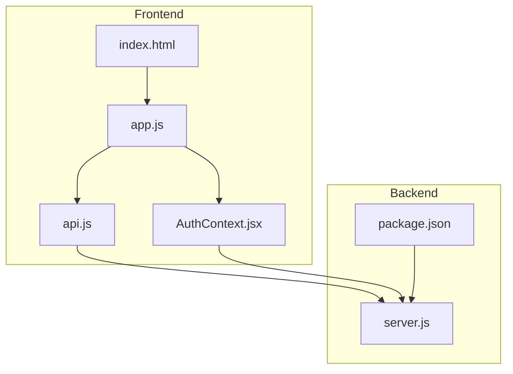
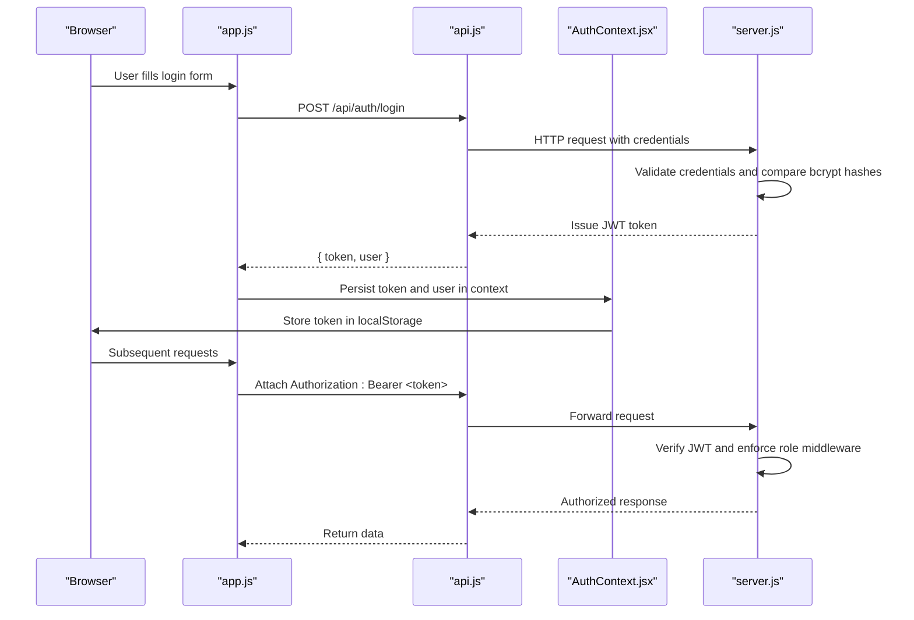
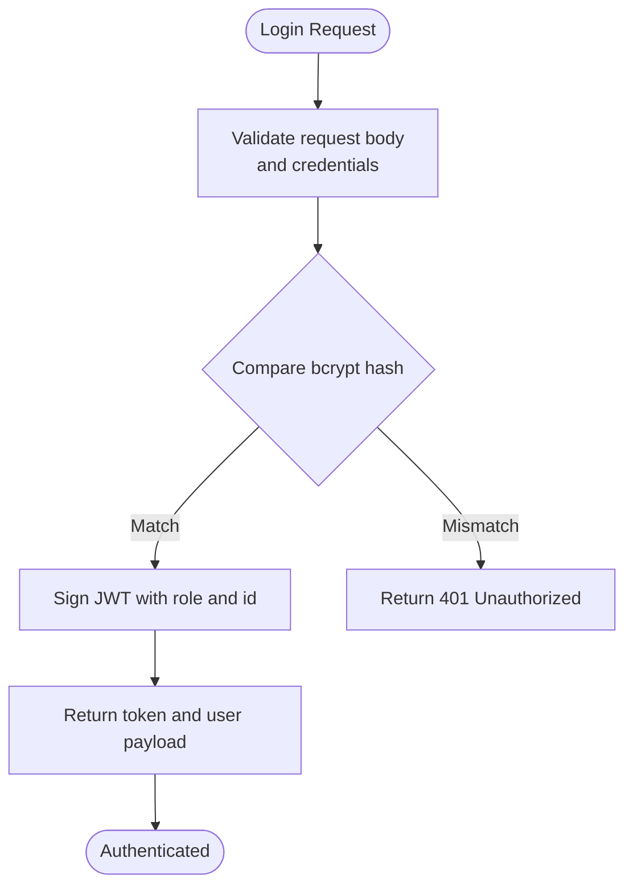
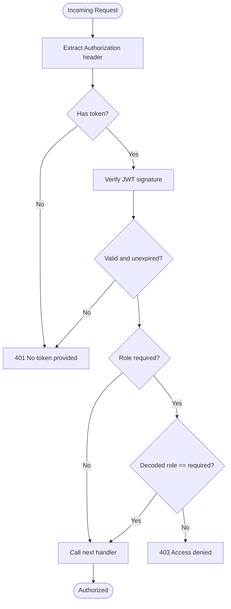
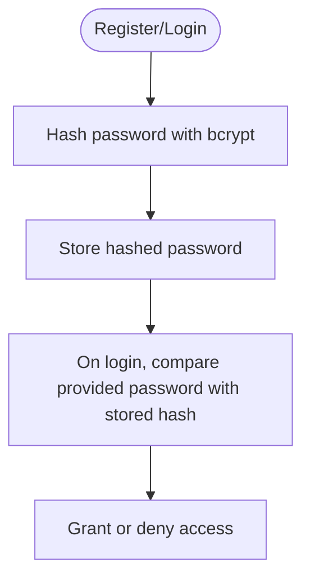
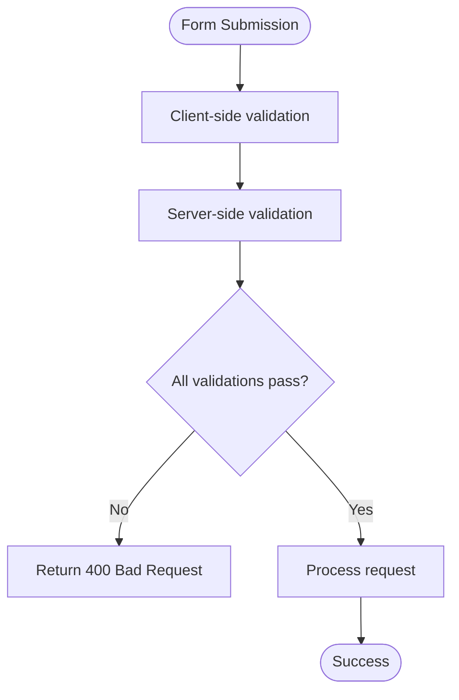
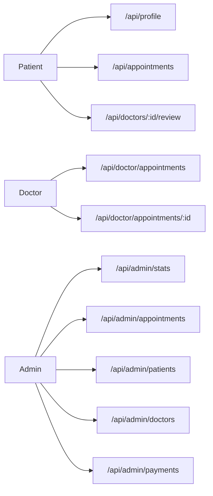
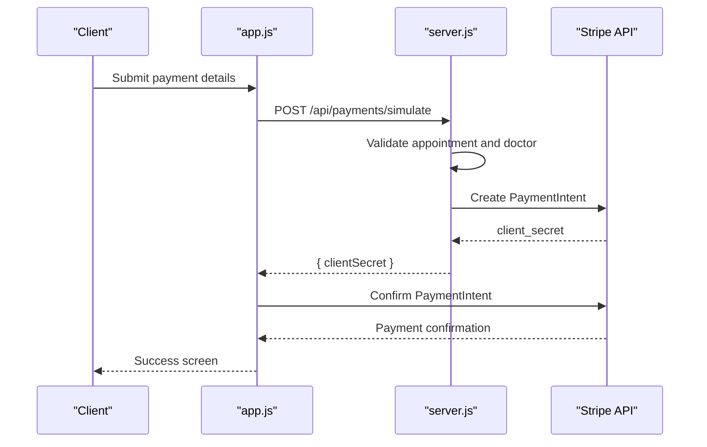
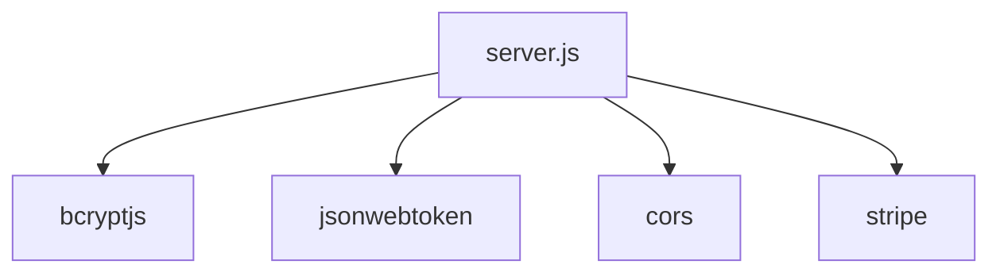

# Security Architecture

<cite>
**Referenced Files in This Document**
- [server.js](file://server.js)
- [AuthContext.jsx](file://AuthContext.jsx)
- [app.js](file://app.js)
- [api.js](file://api.js)
- [index.html](file://index.html)
- [package.json](file://package.json)
- [README.md](file://README.md)
</cite>

## Table of Contents
1. [Introduction](#introduction)
2. [Project Structure](#project-structure)
3. [Core Components](#core-components)
4. [Architecture Overview](#architecture-overview)
5. [Detailed Component Analysis](#detailed-component-analysis)
6. [Dependency Analysis](#dependency-analysis)
7. [Performance Considerations](#performance-considerations)
8. [Troubleshooting Guide](#troubleshooting-guide)
9. [Conclusion](#conclusion)
10. [Appendices](#appendices)

## Introduction
This document presents the security architecture for the Doctor appointment booking system. It focuses on the JWT-based authentication system, role-based access control (RBAC), password hashing, input validation and sanitization, protection against common vulnerabilities, CORS policy, HTTPS enforcement recommendations, secure cookie handling, authorization patterns, security headers, rate limiting strategies, audit logging, data encryption for sensitive health information, secure payment processing with PCI compliance considerations, privacy protection measures, API endpoint best practices, session management, and secure data transmission.

## Project Structure
The system comprises a Node.js/Express backend and a browser-based frontend. The backend exposes REST endpoints for authentication, doctor listings, appointments, payments, and administrative functions. The frontend handles user interactions, form submissions, and maintains local authentication state.

**Diagram sources**
- [server.js](file://server.js#L1-L390)
- [AuthContext.jsx](file://AuthContext.jsx#L1-L41)
- [app.js](file://app.js#L1-L965)
- [api.js](file://api.js#L1-L44)
- [package.json](file://package.json#L1-L24)

**Section sources**
- [README.md](file://README.md#L1-L159)
- [package.json](file://package.json#L1-L24)

## Core Components
- Authentication and Authorization
  - JWT-based authentication with bearer tokens
  - Role-based access control (patient, doctor, admin)
  - Middleware enforcing token presence and role checks
- Password Security
  - bcryptjs for password hashing and comparison
- Input Validation and Sanitization
  - Basic client-side validation for forms
  - Server-side validation for registration and login
- Payment Processing
  - Stripe integration for payment intents
  - Demo payment simulation with basic validation
- CORS and Transport Security
  - CORS enabled globally
  - Recommendations for HTTPS enforcement
- Session Management
  - Local storage for tokens and user state
  - Authorization header propagation

**Section sources**
- [server.js](file://server.js#L49-L62)
- [server.js](file://server.js#L68-L110)
- [AuthContext.jsx](file://AuthContext.jsx#L1-L41)
- [app.js](file://app.js#L402-L472)

## Architecture Overview
The system enforces authentication and authorization at the backend using JWT middleware. The frontend stores tokens locally and attaches Authorization headers to API requests. Payments leverage Stripe for production-grade security and PCI compliance.

**Diagram sources**
- [server.js](file://server.js#L82-L110)
- [AuthContext.jsx](file://AuthContext.jsx#L21-L31)
- [app.js](file://app.js#L423-L438)
- [api.js](file://api.js#L6-L9)

## Detailed Component Analysis

### JWT-Based Authentication System
- Token Generation
  - Tokens are signed with a shared secret and expire in seven days.
  - Claims include user identity, role, and name.
- Token Validation
  - Middleware extracts the Authorization header, splits the Bearer token, verifies the signature, and enforces role checks when required.
- Token Propagation
  - Frontend sets Authorization header for all authenticated requests and clears it on logout.

**Diagram sources**
- [server.js](file://server.js#L82-L110)

**Section sources**
- [server.js](file://server.js#L49-L62)
- [server.js](file://server.js#L82-L110)
- [AuthContext.jsx](file://AuthContext.jsx#L11-L14)
- [AuthContext.jsx](file://AuthContext.jsx#L21-L31)

### Role-Based Access Control (RBAC)
- Roles
  - patient, doctor, admin
- Enforcement
  - Middleware accepts a role argument; if present, rejects requests where the decoded token’s role does not match.
- Protected Routes
  - Doctor-only routes: /api/doctor/appointments, /api/doctors/:id/review
  - Patient-only routes: /api/appointments, /api/profile
  - Admin-only routes: /api/admin/*
- Authorization Patterns
  - Route-level guards using authMiddleware(role)
  - Conditional UI visibility based on role

**Diagram sources**
- [server.js](file://server.js#L49-L62)

**Section sources**
- [server.js](file://server.js#L133-L164)
- [server.js](file://server.js#L204-L217)
- [server.js](file://server.js#L221-L239)
- [server.js](file://server.js#L244-L280)
- [app.js](file://app.js#L140-L147)

### Password Hashing with bcryptjs
- Storage
  - Passwords are hashed using bcrypt with a cost factor before storing.
- Verification
  - During login, bcrypt compares the provided password with the stored hash.
- Change Password
  - Profile updates support changing the password by re-hashing the new value.

**Diagram sources**
- [server.js](file://server.js#L74-L76)
- [server.js](file://server.js#L85-L87)
- [server.js](file://server.js#L95-L97)
- [server.js](file://server.js#L105-L107)
- [server.js](file://server.js#L235-L237)

**Section sources**
- [server.js](file://server.js#L31-L43)
- [server.js](file://server.js#L74-L76)
- [server.js](file://server.js#L85-L87)
- [server.js](file://server.js#L95-L97)
- [server.js](file://server.js#L105-L107)
- [server.js](file://server.js#L235-L237)

### Input Validation and Sanitization
- Client-Side
  - Form validation for required fields, email format, password length, and card/UPI/bank details.
  - Real-time formatting for card number and expiry.
- Server-Side
  - Registration requires all fields and checks for duplicate emails.
  - Login validates presence of credentials and compares bcrypt hashes.
  - Payment simulation validates card fields and UPI format.

**Diagram sources**
- [app.js](file://app.js#L402-L421)
- [app.js](file://app.js#L423-L438)
- [app.js](file://app.js#L440-L455)
- [app.js](file://app.js#L457-L472)
- [app.js](file://app.js#L659-L715)

**Section sources**
- [server.js](file://server.js#L69-L80)
- [server.js](file://server.js#L82-L110)
- [app.js](file://app.js#L402-L421)
- [app.js](file://app.js#L659-L715)

### Protection Against Common Vulnerabilities
- XSS
  - The frontend renders dynamic content using innerHTML. While this can introduce XSS risks, the current implementation primarily displays trusted data and UI elements. To mitigate XSS:
    - Sanitize all dynamic HTML content before insertion.
    - Prefer templating libraries or frameworks with built-in XSS protections.
    - Use Content Security Policy (CSP) headers to restrict script execution.
- CSRF
  - The backend enables CORS globally without CSRF protection. To mitigate CSRF:
    - Implement CSRF tokens for state-changing requests.
    - Enforce SameSite cookies for session cookies if cookies are used.
    - Use Origin/Referer checks for cross-origin requests.
- SQL Injection
  - The backend uses an in-memory store. There is no SQL injection risk in the current implementation. If a database is introduced, use parameterized queries and ORM with strict typing.

**Section sources**
- [server.js](file://server.js#L22-L24)
- [index.html](file://index.html#L1-L552)

### CORS Policy Configuration
- Current State
  - CORS is enabled globally without explicit origin restrictions.
- Recommendations
  - Configure allowed origins, methods, and headers.
  - Set credentials flag appropriately if cookies are used.
  - Limit exposed headers and methods to those required.

**Section sources**
- [server.js](file://server.js#L22-L24)

### HTTPS Enforcement Recommendations
- Deploy behind TLS termination (reverse proxy or CDN).
- Redirect HTTP to HTTPS.
- Use strong cipher suites and modern TLS versions.
- Implement HSTS headers.

[No sources needed since this section provides general guidance]

### Secure Cookie Handling
- Current State
  - Tokens are stored in localStorage; no cookies are used.
- Recommendations
  - If cookies are adopted:
    - Set HttpOnly, Secure, SameSite attributes.
    - Enforce HTTPS-only cookies.
    - Use short-lived session cookies with sliding expiration.

**Section sources**
- [AuthContext.jsx](file://AuthContext.jsx#L7-L8)
- [AuthContext.jsx](file://AuthContext.jsx#L23-L24)

### Authorization Patterns for Different User Roles
- Patient
  - Can view and manage own profile, appointments, and reviews.
- Doctor
  - Can view and approve/reject own incoming appointments.
- Admin
  - Full access to system statistics, manage appointments, patients, and doctors.

**Diagram sources**
- [server.js](file://server.js#L133-L164)
- [server.js](file://server.js#L204-L217)
- [server.js](file://server.js#L221-L239)
- [server.js](file://server.js#L244-L280)

**Section sources**
- [server.js](file://server.js#L133-L164)
- [server.js](file://server.js#L204-L217)
- [server.js](file://server.js#L221-L239)
- [server.js](file://server.js#L244-L280)

### Security Headers Configuration
- Recommendations
  - Content-Security-Policy: Restrict sources for scripts, styles, and resources.
  - X-Content-Type-Options: nosniff
  - X-Frame-Options: DENY or SAMEORIGIN
  - X-XSS-Protection: 1; mode=block
  - Referrer-Policy: strict-origin-when-cross-origin
  - Permissions-Policy: limit browser features

[No sources needed since this section provides general guidance]

### Rate Limiting Strategies
- Recommendations
  - Implement rate limiting per IP for authentication endpoints.
  - Use sliding windows or token bucket algorithms.
  - Integrate with Redis for distributed rate limiting.
  - Log and alert on suspicious spikes.

[No sources needed since this section provides general guidance]

### Audit Logging for Security Events
- Recommendations
  - Log authentication attempts (success/failure), token issuance, role changes, and administrative actions.
  - Include timestamps, user IDs, IP addresses, and user agents.
  - Store logs securely and retain for compliance periods.

[No sources needed since this section provides general guidance]

### Data Encryption for Sensitive Health Information
- Recommendations
  - Encrypt at rest using strong symmetric encryption.
  - Protect in transit with TLS 1.3+.
  - Use key rotation and secure key management (HSM or KMS).
  - Minimize retention of PHI.

[No sources needed since this section provides general guidance]

### Secure Payment Processing and PCI Compliance
- Stripe Integration
  - Payment intents are created server-side using Stripe SDK.
  - Client secret is returned to the frontend for confirmation.
- Demo Payment Simulation
  - Basic validation for card/UPI/bank fields.
- PCI Compliance Considerations
  - Do not store, process, or transmit primary account numbers (PAN) or CVV.
  - Use PCI-compliant payment providers (Stripe).
  - Implement tokenization and PCI-exempt flows.

**Diagram sources**
- [server.js](file://server.js#L297-L353)
- [app.js](file://app.js#L659-L715)

**Section sources**
- [server.js](file://server.js#L13-L15)
- [server.js](file://server.js#L297-L353)
- [app.js](file://app.js#L659-L715)

### Privacy Protection Measures
- Recommendations
  - Implement data minimization and purpose limitation.
  - Provide privacy controls (opt-out, deletion requests).
  - Use pseudonymization/anonymization where feasible.
  - Comply with applicable privacy regulations (GDPR, HIPAA).

[No sources needed since this section provides general guidance]

### API Endpoint Security Best Practices
- Recommendations
  - Validate and sanitize all inputs.
  - Use HTTPS everywhere.
  - Implement rate limiting and DDoS protection.
  - Add request/response logging with redaction.
  - Use strong error messages without leaking internal details.

[No sources needed since this section provides general guidance]

### Session Management
- Current Implementation
  - Stateless JWT tokens stored in localStorage.
- Recommendations
  - Consider refresh tokens with secure storage.
  - Implement token rotation and revocation on logout.
  - Add device fingerprinting and anomaly detection.

**Section sources**
- [AuthContext.jsx](file://AuthContext.jsx#L7-L8)
- [AuthContext.jsx](file://AuthContext.jsx#L23-L24)

### Secure Data Transmission
- Recommendations
  - Enforce TLS 1.3+.
  - Disable weak ciphers and protocols.
  - Use certificate pinning if applicable.
  - Monitor for TLS misconfigurations.

[No sources needed since this section provides general guidance]

## Dependency Analysis
External dependencies relevant to security:
- bcryptjs: Password hashing and verification
- jsonwebtoken: JWT signing and verification
- cors: Cross-origin resource sharing
- stripe: Secure payment processing

**Diagram sources**
- [package.json](file://package.json#L14-L22)
- [server.js](file://server.js#L6-L15)

**Section sources**
- [package.json](file://package.json#L14-L22)

## Performance Considerations
- Token verification is lightweight; ensure minimal overhead.
- bcrypt hashing cost affects login latency; balance security and performance.
- CORS configuration should be tuned for production environments.
- Payment processing latency depends on external APIs; implement timeouts and retries.

[No sources needed since this section provides general guidance]

## Troubleshooting Guide
- Authentication Failures
  - Verify JWT secret consistency across deployments.
  - Check token expiration and renewal.
- Authorization Errors
  - Ensure role claims match expected values.
  - Confirm middleware is applied to protected routes.
- Payment Issues
  - Validate Stripe secret key configuration.
  - Check payment intent creation and client secret handling.

**Section sources**
- [server.js](file://server.js#L19-L19)
- [server.js](file://server.js#L49-L62)
- [server.js](file://server.js#L297-L353)

## Conclusion
The Doctor appointment booking system implements a robust JWT-based authentication and RBAC model with bcrypt password hashing and basic input validation. The frontend manages tokens securely in localStorage and propagates Authorization headers. Payment processing integrates with Stripe for secure, PCI-compliant handling. To harden the system for production, implement CORS restrictions, enforce HTTPS, add CSRF protection, deploy security headers, introduce rate limiting, establish audit logging, and adopt secure cookie handling if cookies are used. These enhancements will strengthen defenses against XSS, CSRF, SQL injection, and other common vulnerabilities while maintaining a seamless user experience.

## Appendices
- Deployment Checklist
  - Enable HTTPS and HSTS
  - Configure CORS with allowed origins
  - Add security headers
  - Implement rate limiting
  - Set up audit logging
  - Adopt secure cookie handling
  - Validate Stripe integration
  - Review CSP policies

[No sources needed since this section provides general guidance]