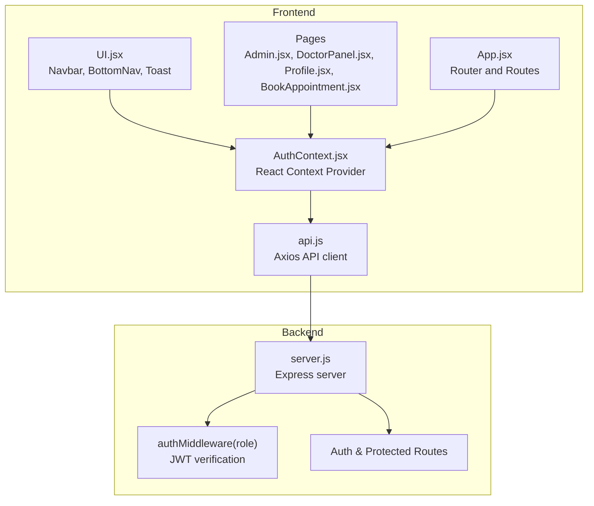
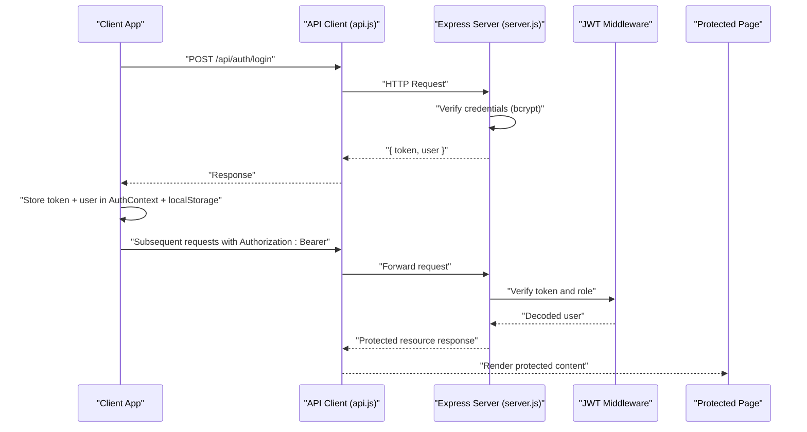
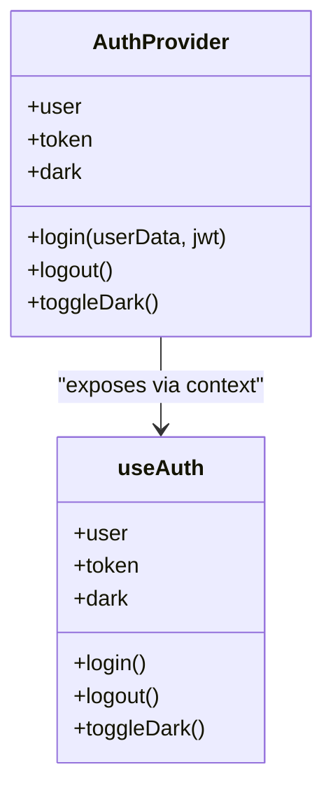
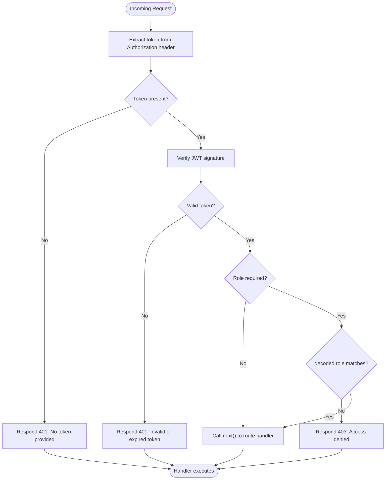
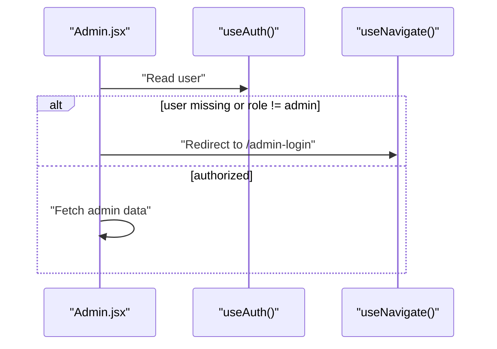
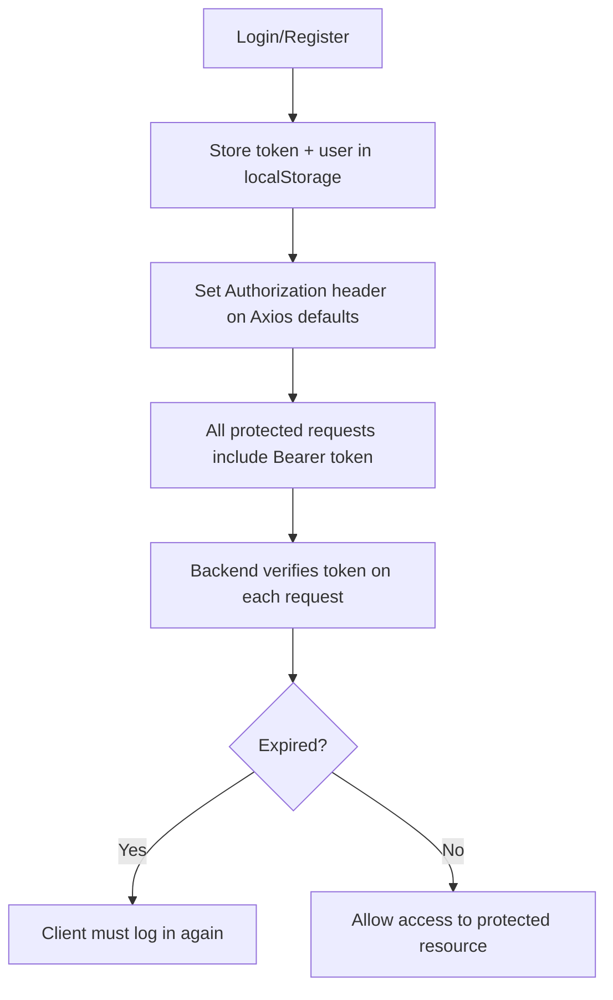
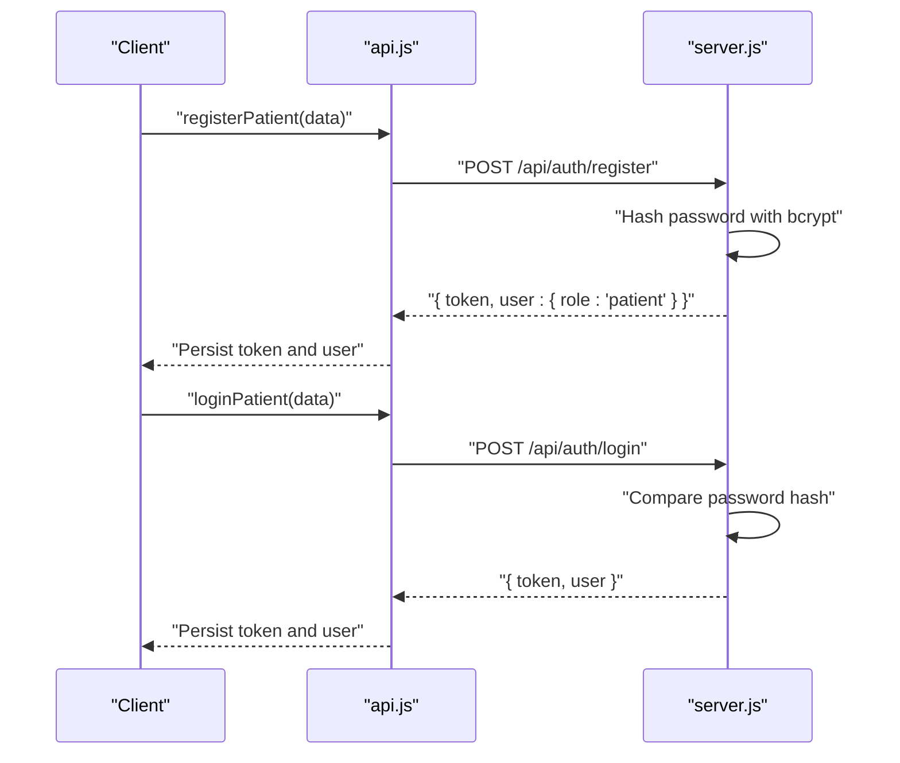
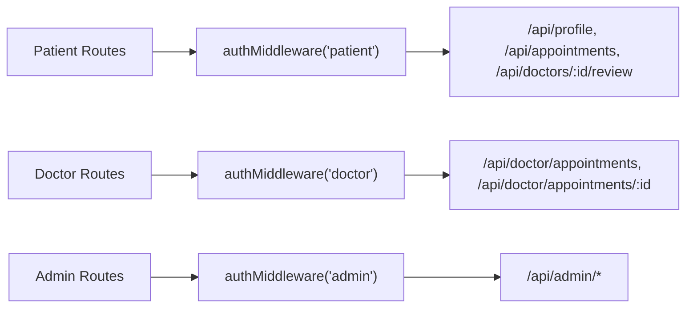
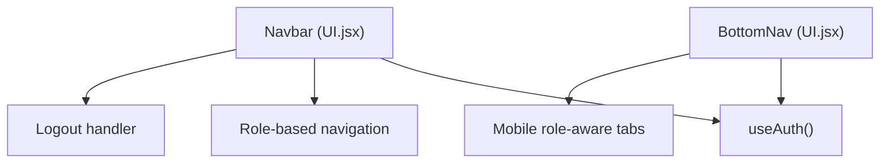
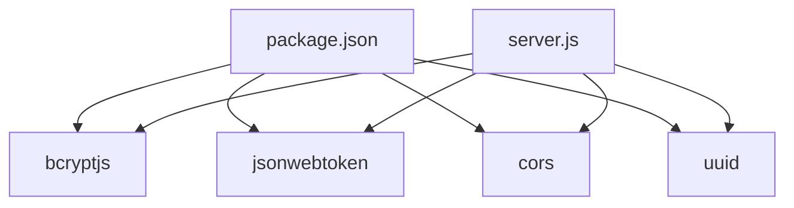

# Authentication System

<cite>
**Referenced Files in This Document**
- [AuthContext.jsx](file://AuthContext.jsx)
- [server.js](file://server.js)
- [api.js](file://api.js)
- [App.jsx](file://App.jsx)
- [UI.jsx](file://UI.jsx)
- [Admin.jsx](file://Admin.jsx)
- [DoctorPanel.jsx](file://DoctorPanel.jsx)
- [Profile.jsx](file://Profile.jsx)
- [BookAppointment.jsx](file://BookAppointment.jsx)
- [package.json](file://package.json)
- [README.md](file://README.md)
</cite>

## Table of Contents
1. [Introduction](#introduction)
2. [Project Structure](#project-structure)
3. [Core Components](#core-components)
4. [Architecture Overview](#architecture-overview)
5. [Detailed Component Analysis](#detailed-component-analysis)
6. [Dependency Analysis](#dependency-analysis)
7. [Performance Considerations](#performance-considerations)
8. [Troubleshooting Guide](#troubleshooting-guide)
9. [Conclusion](#conclusion)
10. [Appendices](#appendices)

## Introduction
This document describes the authentication system for the Doctor appointment booking system. It covers the multi-role architecture supporting patients, doctors, and administrators, JWT-based authentication with token generation and validation, React Context-based authentication state management, secure user registration and login flows, role-based access control (RBAC), protected route handling, token storage and expiration, and API endpoints for authentication operations. Security considerations and best practices are included to prevent common attacks and ensure robust credential management.

## Project Structure
The authentication system spans the frontend React application and the backend Node.js/Express server. The frontend manages authentication state via a React Context provider and persists tokens and user data in local storage. The backend exposes REST endpoints for registration and login, validates JWT tokens for protected routes, and enforces role-based access control.

**Diagram sources**
- [AuthContext.jsx](file://AuthContext.jsx#L1-L41)
- [UI.jsx](file://UI.jsx#L96-L138)
- [Admin.jsx](file://Admin.jsx#L1-L194)
- [DoctorPanel.jsx](file://DoctorPanel.jsx#L1-L96)
- [Profile.jsx](file://Profile.jsx#L1-L97)
- [BookAppointment.jsx](file://BookAppointment.jsx#L1-L171)
- [api.js](file://api.js#L1-L44)
- [App.jsx](file://App.jsx#L1-L44)
- [server.js](file://server.js#L49-L62)

**Section sources**
- [AuthContext.jsx](file://AuthContext.jsx#L1-L41)
- [server.js](file://server.js#L49-L62)
- [api.js](file://api.js#L1-L44)
- [App.jsx](file://App.jsx#L1-L44)

## Core Components
- Authentication Context (React): Centralized state for user, token, and theme persistence; provides login/logout actions and propagates state to all components.
- API Client: Axios-based wrapper exposing typed endpoints for authentication, doctors, appointments, profiles, admin, and payments.
- Backend Server: Express server with JWT middleware, bcrypt password hashing, and RBAC enforcement for protected routes.
- UI Components: Navbar and BottomNav integrate with AuthContext to show role-specific navigation and logout.

Key implementation references:
- Authentication Context provider and state persistence: [AuthContext.jsx](file://AuthContext.jsx#L6-L38)
- Token propagation to Axios defaults: [AuthContext.jsx](file://AuthContext.jsx#L11-L14)
- API endpoints for auth and protected resources: [api.js](file://api.js#L6-L44)
- JWT middleware and RBAC: [server.js](file://server.js#L49-L62)
- Protected route checks in pages: [Admin.jsx](file://Admin.jsx#L19-L24), [DoctorPanel.jsx](file://DoctorPanel.jsx#L15-L20), [Profile.jsx](file://Profile.jsx#L16-L21)

**Section sources**
- [AuthContext.jsx](file://AuthContext.jsx#L1-L41)
- [api.js](file://api.js#L1-L44)
- [server.js](file://server.js#L49-L62)
- [Admin.jsx](file://Admin.jsx#L1-L194)
- [DoctorPanel.jsx](file://DoctorPanel.jsx#L1-L96)
- [Profile.jsx](file://Profile.jsx#L1-L97)

## Architecture Overview
The authentication architecture follows a JWT-based flow:
- Registration/Login returns a signed JWT with role claims.
- Frontend stores token and user data in local storage and attaches Authorization header to Axios requests.
- Backend verifies tokens and enforces role-based access for protected routes.
- Protected pages redirect unauthenticated or unauthorized users to login.

**Diagram sources**
- [api.js](file://api.js#L6-L9)
- [server.js](file://server.js#L82-L90)
- [AuthContext.jsx](file://AuthContext.jsx#L21-L31)
- [server.js](file://server.js#L49-L62)

## Detailed Component Analysis

### Authentication Context (React)
The AuthContext provider manages:
- User state and token persistence in localStorage.
- Authorization header injection for Axios requests.
- Theme persistence and toggling.
- Public login and logout actions.

**Diagram sources**
- [AuthContext.jsx](file://AuthContext.jsx#L6-L38)

**Section sources**
- [AuthContext.jsx](file://AuthContext.jsx#L1-L41)

### JWT Middleware and RBAC
The backend enforces authentication and roles:
- Extracts token from Authorization header.
- Verifies signature and decodes payload.
- Enforces role-based access when required.
- Returns appropriate HTTP status codes for missing/expired/invalid tokens.

**Diagram sources**
- [server.js](file://server.js#L49-L62)

**Section sources**
- [server.js](file://server.js#L49-L62)

### Protected Route Handling
Protected pages check user role and redirect if unauthorized:
- Admin dashboard requires role 'admin'.
- Doctor panel requires role 'doctor'.
- Patient-only routes rely on presence of a valid JWT.

**Diagram sources**
- [Admin.jsx](file://Admin.jsx#L19-L24)
- [DoctorPanel.jsx](file://DoctorPanel.jsx#L15-L20)

**Section sources**
- [Admin.jsx](file://Admin.jsx#L1-L194)
- [DoctorPanel.jsx](file://DoctorPanel.jsx#L1-L96)

### Token Storage and Expiration
- Frontend stores token and user in localStorage and sets Axios Authorization header automatically when a token exists.
- Backend signs JWT with a fixed expiration (e.g., 7 days) and verifies validity on each protected request.
- No refresh token mechanism is implemented; token expiration is handled by re-authentication.

**Diagram sources**
- [AuthContext.jsx](file://AuthContext.jsx#L7-L14)
- [server.js](file://server.js#L78-L89)

**Section sources**
- [AuthContext.jsx](file://AuthContext.jsx#L1-L41)
- [server.js](file://server.js#L78-L89)

### User Registration and Login Flows
- Patient registration hashes password with bcrypt and returns a JWT with role 'patient'.
- Patient and doctor login verify credentials against stored bcrypt hashes and issue JWTs with respective roles.
- Admin login verifies admin credentials and issues a JWT with role 'admin'.

**Diagram sources**
- [api.js](file://api.js#L6-L9)
- [server.js](file://server.js#L68-L90)

**Section sources**
- [server.js](file://server.js#L68-L110)
- [api.js](file://api.js#L1-L44)

### Protected Resource Access
- Patient-only endpoints: profile, appointments, reviews.
- Doctor-only endpoints: doctor’s appointments, status updates.
- Admin-only endpoints: stats, manage appointments/doctors/patients/payments.

**Diagram sources**
- [server.js](file://server.js#L222-L239)
- [server.js](file://server.js#L134-L153)
- [server.js](file://server.js#L244-L280)

**Section sources**
- [server.js](file://server.js#L134-L153)
- [server.js](file://server.js#L222-L239)
- [server.js](file://server.js#L244-L280)

### UI Integration and Navigation
- Navbar displays role-specific links and logout button.
- Bottom navigation adapts to user role.
- Toast notifications provide feedback for authentication events.

**Diagram sources**
- [UI.jsx](file://UI.jsx#L96-L138)
- [UI.jsx](file://UI.jsx#L140-L176)

**Section sources**
- [UI.jsx](file://UI.jsx#L96-L176)

## Dependency Analysis
External libraries and their roles:
- bcryptjs: password hashing for secure credential storage.
- jsonwebtoken: JWT signing and verification.
- cors: cross-origin support for development.
- uuid: generating unique identifiers for entities.
- axios: HTTP client for API calls.

**Diagram sources**
- [package.json](file://package.json#L14-L22)
- [server.js](file://server.js#L5-L10)

**Section sources**
- [package.json](file://package.json#L1-L24)
- [server.js](file://server.js#L1-L30)

## Performance Considerations
- Token verification occurs on every protected request; keep JWT_SECRET secure and avoid excessive middleware overhead.
- bcrypt cost factor is set to a reasonable default; adjust as needed for your environment.
- Local storage usage avoids frequent network calls but increases browser memory footprint; consider clearing sensitive data on logout.
- Axios defaults set Authorization header only when a token exists to minimize unnecessary headers.

[No sources needed since this section provides general guidance]

## Troubleshooting Guide
Common issues and resolutions:
- 401 Unauthorized during protected requests:
  - Ensure Authorization header is present and formatted as "Bearer <token>".
  - Verify token was issued by the backend and not expired.
  - Confirm the user role matches the route requirement.
  - Reference: [server.js](file://server.js#L49-L62)
- 403 Access Denied:
  - Occurs when the token’s role does not match the required role.
  - Reference: [server.js](file://server.js#L55-L56)
- Login/Register fails:
  - Check required fields and uniqueness constraints (e.g., email).
  - Verify bcrypt comparison succeeds for passwords.
  - Reference: [server.js](file://server.js#L68-L90), [server.js](file://server.js#L102-L110)
- Protected page redirects unexpectedly:
  - Pages enforce role checks and redirect to login when user is missing or role mismatch occurs.
  - Reference: [Admin.jsx](file://Admin.jsx#L19-L24), [DoctorPanel.jsx](file://DoctorPanel.jsx#L15-L20)

**Section sources**
- [server.js](file://server.js#L49-L62)
- [server.js](file://server.js#L68-L110)
- [Admin.jsx](file://Admin.jsx#L1-L194)
- [DoctorPanel.jsx](file://DoctorPanel.jsx#L1-L96)

## Conclusion
The authentication system integrates React Context for centralized state management, JWT for secure token-based authentication, and role-based access control enforced by middleware. Passwords are securely hashed with bcrypt, and protected routes ensure only authorized users access sensitive data and operations. While token refresh is not implemented, the system provides a solid foundation for secure multi-role access with clear separation of concerns between frontend and backend.

[No sources needed since this section summarizes without analyzing specific files]

## Appendices

### API Endpoint Documentation

- Patient Registration
  - Method: POST
  - Path: /api/auth/register
  - Body: { name, email, phone, age, password }
  - Response: { token, user: { id, name, email, phone, age, role: 'patient' } }
  - Notes: Password is hashed before storage; email must be unique.

- Patient Login
  - Method: POST
  - Path: /api/auth/login
  - Body: { email, password }
  - Response: { token, user: { id, name, email, phone, age, role: 'patient' } }

- Doctor Login
  - Method: POST
  - Path: /api/auth/doctor-login
  - Body: { email, password }
  - Response: { token, user: { id, name, email, specialization, role: 'doctor' } }

- Admin Login
  - Method: POST
  - Path: /api/auth/admin-login
  - Body: { username, password }
  - Response: { token, user: { id, name, role: 'admin' } }

- Protected Routes (require Authorization header)
  - Patient-only:
    - GET /api/profile
    - PUT /api/profile
    - GET /api/appointments
    - POST /api/appointments
    - PATCH /api/appointments/:id/cancel
    - POST /api/doctors/:id/review
  - Doctor-only:
    - GET /api/doctor/appointments
    - PATCH /api/doctor/appointments/:id
  - Admin-only:
    - GET /api/admin/stats
    - GET /api/admin/appointments
    - GET /api/admin/patients
    - GET /api/admin/doctors
    - PATCH /api/admin/appointments/:id
    - DELETE /api/admin/doctors/:id
    - GET /api/admin/payments

- Payments
  - GET /api/payments/fee/:doctor_id
  - POST /api/payments/create-intent
  - POST /api/payments/simulate
  - GET /api/payments/:appointment_id

**Section sources**
- [server.js](file://server.js#L68-L110)
- [server.js](file://server.js#L134-L153)
- [server.js](file://server.js#L222-L239)
- [server.js](file://server.js#L244-L280)
- [server.js](file://server.js#L297-L377)

### Security Considerations and Best Practices
- Credential Management
  - Use HTTPS in production to protect tokens in transit.
  - Avoid storing secrets in client-side code; configure JWT_SECRET and Stripe keys via environment variables.
  - Enforce minimum password length and discourage reuse.
- Token Handling
  - Store tokens securely (localStorage is used here) and clear them on logout.
  - Consider short-lived tokens with a secure refresh mechanism in production.
- Attack Prevention
  - Rate-limit authentication endpoints to mitigate brute-force attacks.
  - Validate and sanitize all inputs; enforce strong password policies.
  - Use role-based access control consistently on all protected routes.
- Audit and Monitoring
  - Log authentication failures and suspicious activities.
  - Regularly rotate JWT_SECRET and monitor token lifetimes.

[No sources needed since this section provides general guidance]