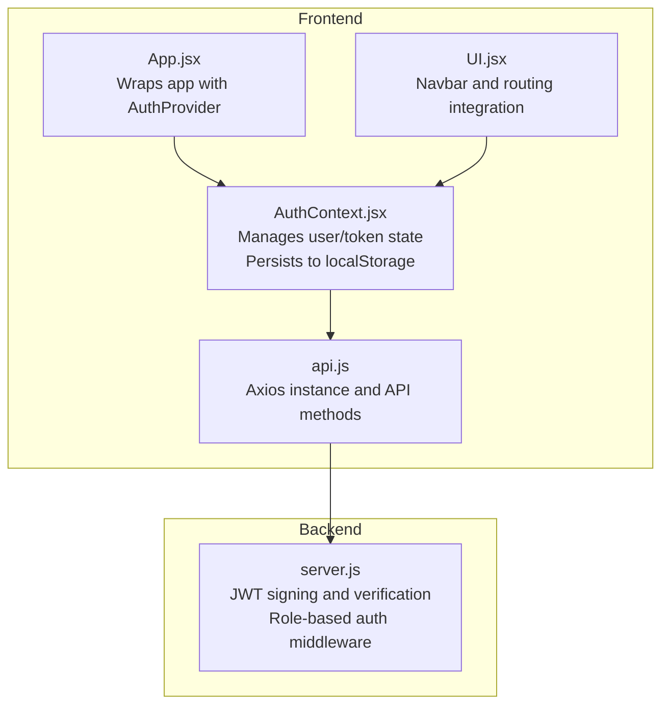
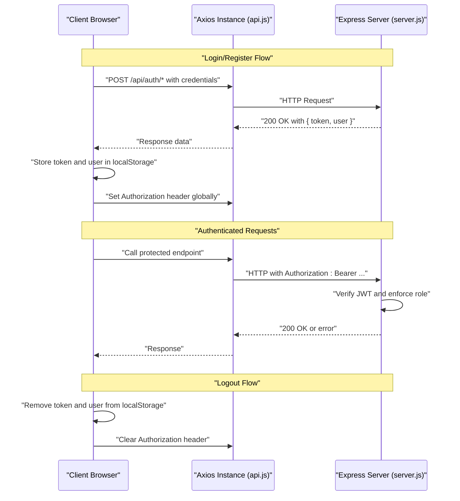
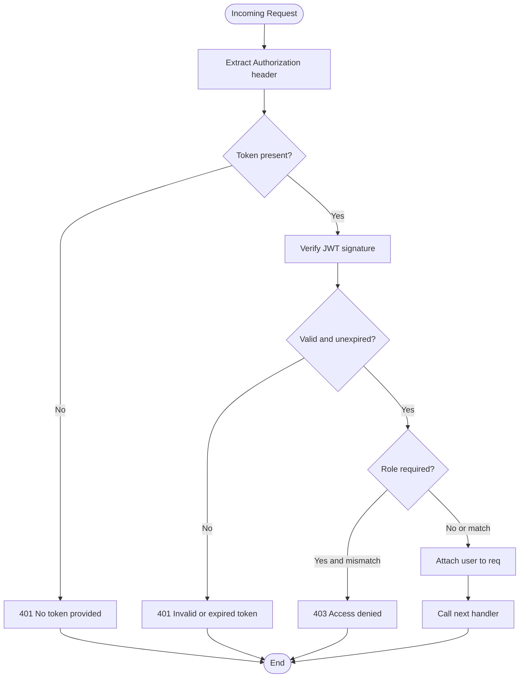
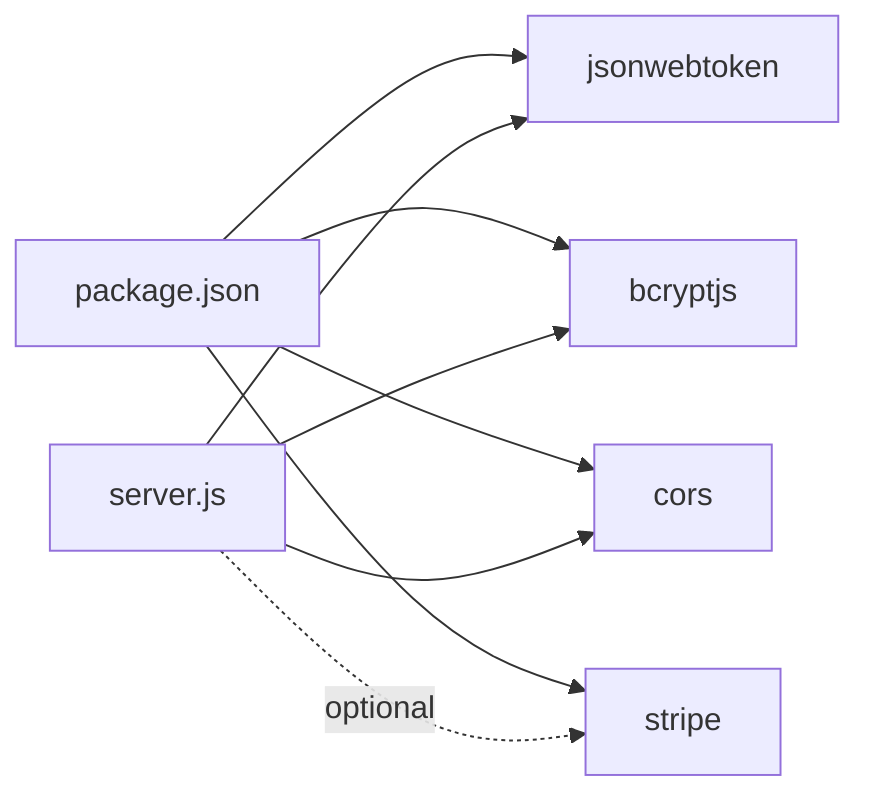

# JWT Token Management

<cite>
**Referenced Files in This Document**
- [AuthContext.jsx](file://AuthContext.jsx)
- [api.js](file://api.js)
- [server.js](file://server.js)
- [App.jsx](file://App.jsx)
- [UI.jsx](file://UI.jsx)
- [package.json](file://package.json)
- [README.md](file://README.md)
</cite>

## Table of Contents
1. [Introduction](#introduction)
2. [Project Structure](#project-structure)
3. [Core Components](#core-components)
4. [Architecture Overview](#architecture-overview)
5. [Detailed Component Analysis](#detailed-component-analysis)
6. [Dependency Analysis](#dependency-analysis)
7. [Performance Considerations](#performance-considerations)
8. [Troubleshooting Guide](#troubleshooting-guide)
9. [Conclusion](#conclusion)
10. [Appendices](#appendices)

## Introduction
This document explains the JWT-based authentication system used by the application. It covers how tokens are generated during registration and login, how they are validated on the backend, how they are attached to API requests in the frontend, and how they are persisted across browser sessions. It also documents the token lifecycle, expiration handling, and security considerations such as secure storage practices and protection against token theft. Practical examples show how to integrate token handling in frontend components and API services.

## Project Structure
The authentication system spans three main areas:
- Frontend React application with an authentication context that manages user state and stores tokens in localStorage.
- Axios-based API service that centralizes HTTP calls and automatically attaches Authorization headers when a token exists.
- Backend Express server that issues signed JWTs and validates them via a middleware enforcing role-based access control.

**Diagram sources**
- [AuthContext.jsx](file://AuthContext.jsx#L1-L41)
- [api.js](file://api.js#L1-L44)
- [App.jsx](file://App.jsx#L1-L44)
- [UI.jsx](file://UI.jsx#L1-L182)
- [server.js](file://server.js#L47-L62)

**Section sources**
- [AuthContext.jsx](file://AuthContext.jsx#L1-L41)
- [api.js](file://api.js#L1-L44)
- [server.js](file://server.js#L47-L62)
- [App.jsx](file://App.jsx#L1-L44)
- [UI.jsx](file://UI.jsx#L1-L182)

## Core Components
- Authentication Context (frontend): Provides login/logout actions, persists user and token to localStorage, and injects Authorization headers into outgoing requests.
- API Service (frontend): Encapsulates HTTP endpoints and uses a shared axios instance configured with base URL and Authorization header propagation.
- Backend Middleware (server): Extracts JWT from Authorization header, verifies signature, enforces optional role checks, and attaches user info to the request object.

Key behaviors:
- Token storage: localStorage keys include the token and user data.
- Header injection: Authorization header is set globally on axios defaults when a token is present.
- Role enforcement: Middleware supports role-specific routes (patient, doctor, admin).

**Section sources**
- [AuthContext.jsx](file://AuthContext.jsx#L6-L31)
- [api.js](file://api.js#L3-L37)
- [server.js](file://server.js#L49-L62)

## Architecture Overview
The token lifecycle follows a predictable flow: issuance, propagation, validation, and cleanup.

**Diagram sources**
- [AuthContext.jsx](file://AuthContext.jsx#L21-L31)
- [api.js](file://api.js#L3-L37)
- [server.js](file://server.js#L49-L62)

## Detailed Component Analysis

### Frontend Authentication Context
Responsibilities:
- Initialize state from localStorage on mount.
- Persist token and user data to localStorage upon login.
- Remove token and user data from localStorage upon logout.
- Dynamically attach or remove Authorization header on axios defaults based on token presence.

Implementation highlights:
- Uses localStorage keys for token and user persistence.
- Updates axios defaults to include Authorization header when a token exists.
- Exposes login and logout functions to child components.

Security considerations:
- Storing tokens in localStorage exposes them to XSS attacks. Prefer HttpOnly cookies for production or use short-lived tokens with refresh mechanisms.

**Section sources**
- [AuthContext.jsx](file://AuthContext.jsx#L6-L31)

### API Service Layer
Responsibilities:
- Centralizes HTTP endpoints under a single axios instance with a base URL pointing to the backend API.
- Exposes named functions for each route, enabling consistent request construction across components.

Integration with authentication:
- Relies on axios defaults to include Authorization header when set by the authentication context.

Usage examples (paths only):
- Registration: [api.js](file://api.js#L6)
- Login flows: [api.js](file://api.js#L7-L9)
- Protected routes: [api.js](file://api.js#L17-L18), [api.js](file://api.js#L22-L23), [api.js](file://api.js#L26-L27), [api.js](file://api.js#L31-L33), [api.js](file://api.js#L41-L43)

**Section sources**
- [api.js](file://api.js#L3-L37)

### Backend JWT Middleware and Routes
Responsibilities:
- Verify JWT signature and decode payload.
- Enforce optional role-based access control.
- Attach user information to the request object for downstream handlers.

Token issuance:
- Tokens are signed with a secret and expire in seven days for all login/register endpoints.

Protected routes:
- Patient-only endpoints: profile, appointments, booking, reviews.
- Doctor-only endpoints: doctor panel.
- Admin-only endpoints: admin dashboards and management.

**Diagram sources**
- [server.js](file://server.js#L49-L62)

**Section sources**
- [server.js](file://server.js#L49-L62)
- [server.js](file://server.js#L68-L110)
- [server.js](file://server.js#L133-L164)
- [server.js](file://server.js#L204-L239)
- [server.js](file://server.js#L244-L280)

### Token Storage and Propagation
- Frontend storage: token and user are stored in localStorage and restored on initial load.
- Header propagation: axios defaults include Authorization: Bearer <token> when available.

Practical usage:
- Components can call protected APIs via the centralized service methods.
- Navbar and routing integrate with the authentication context to show/hide links and trigger logout.

**Section sources**
- [AuthContext.jsx](file://AuthContext.jsx#L6-L14)
- [AuthContext.jsx](file://AuthContext.jsx#L21-L31)
- [UI.jsx](file://UI.jsx#L97-L138)

## Dependency Analysis
External libraries and their roles:
- jsonwebtoken: backend JWT signing and verification.
- bcryptjs: password hashing for user records.
- cors: cross-origin support for development.
- stripe: optional payment integration (not required for JWT auth).

**Diagram sources**
- [package.json](file://package.json#L14-L22)
- [server.js](file://server.js#L5-L24)

**Section sources**
- [package.json](file://package.json#L14-L22)
- [server.js](file://server.js#L5-L24)

## Performance Considerations
- Token lifetime: Tokens expire in seven days. Shorter lifetimes reduce risk but increase re-auth frequency.
- Middleware overhead: Signature verification is lightweight; avoid verifying tokens unnecessarily by gating protected routes early.
- Axios defaults: Setting Authorization header globally avoids repetitive header management across components.

[No sources needed since this section provides general guidance]

## Troubleshooting Guide
Common token-related issues and resolutions:
- Missing Authorization header:
  - Symptom: 401 “No token provided”.
  - Cause: Token not present in localStorage or axios defaults not updated.
  - Resolution: Ensure login sets token and localStorage, and that the effect updating axios defaults runs.
  - References:
    - [AuthContext.jsx](file://AuthContext.jsx#L11-L14)
    - [AuthContext.jsx](file://AuthContext.jsx#L21-L25)

- Invalid or expired token:
  - Symptom: 401 “Invalid or expired token”.
  - Cause: Token tampering, wrong secret, or expiration exceeded.
  - Resolution: Re-authenticate to obtain a new token; verify JWT_SECRET on the server.
  - References:
    - [server.js](file://server.js#L49-L62)

- Access denied due to role mismatch:
  - Symptom: 403 “Access denied”.
  - Cause: Attempting a doctor/admin-only endpoint without proper role.
  - Resolution: Redirect to appropriate role page or prevent access via UI guards.
  - References:
    - [server.js](file://server.js#L49-L62)

- Logout does not clear state:
  - Symptom: UI still shows authenticated state.
  - Cause: localStorage not cleared or axios defaults not reset.
  - Resolution: Ensure logout removes token and user from localStorage and clears axios defaults.
  - References:
    - [AuthContext.jsx](file://AuthContext.jsx#L27-L31)
    - [AuthContext.jsx](file://AuthContext.jsx#L11-L14)

**Section sources**
- [AuthContext.jsx](file://AuthContext.jsx#L11-L14)
- [AuthContext.jsx](file://AuthContext.jsx#L21-L31)
- [server.js](file://server.js#L49-L62)

## Conclusion
The application implements a straightforward JWT-based authentication system:
- Tokens are issued on successful registration/login and stored in localStorage.
- The frontend automatically attaches Authorization headers to requests.
- The backend validates tokens and enforces role-based access control.
- The system is easy to extend for additional roles and endpoints.

For production, consider enhancing security with shorter token lifetimes, refresh token mechanisms, and secure cookie storage.

[No sources needed since this section summarizes without analyzing specific files]

## Appendices

### Token Structure and Lifecycle
- Payload fields: id, role, name.
- Signature algorithm: HS256 using a shared secret.
- Expiration: Seven days.
- Issuance endpoints: register, login, doctor-login, admin-login.
- Validation: Middleware extracts token from Authorization header and verifies signature.

References:
- [server.js](file://server.js#L78)
- [server.js](file://server.js#L88)
- [server.js](file://server.js#L98)
- [server.js](file://server.js#L108)
- [server.js](file://server.js#L49-L62)

**Section sources**
- [server.js](file://server.js#L49-L62)
- [server.js](file://server.js#L68-L110)

### Frontend Integration Examples (Paths Only)
- Login and logout:
  - [AuthContext.jsx](file://AuthContext.jsx#L21-L31)
- Protected API calls:
  - [api.js](file://api.js#L17-L18)
  - [api.js](file://api.js#L22-L23)
  - [api.js](file://api.js#L26-L27)
  - [api.js](file://api.js#L31-L33)
  - [api.js](file://api.js#L41-L43)
- Auth provider setup:
  - [App.jsx](file://App.jsx#L17-L18)
- Navbar integration:
  - [UI.jsx](file://UI.jsx#L97-L138)

**Section sources**
- [AuthContext.jsx](file://AuthContext.jsx#L21-L31)
- [api.js](file://api.js#L17-L18)
- [api.js](file://api.js#L22-L23)
- [api.js](file://api.js#L26-L27)
- [api.js](file://api.js#L31-L33)
- [api.js](file://api.js#L41-L43)
- [App.jsx](file://App.jsx#L17-L18)
- [UI.jsx](file://UI.jsx#L97-L138)

### Security Best Practices
- Avoid storing long-lived tokens in localStorage due to XSS risks. Prefer HttpOnly cookies or short-lived tokens with a secure refresh mechanism.
- Use HTTPS in production to protect tokens in transit.
- Rotate JWT_SECRET regularly and manage it via environment variables.
- Implement rate limiting and consider adding refresh token rotation for advanced protection.

[No sources needed since this section provides general guidance]