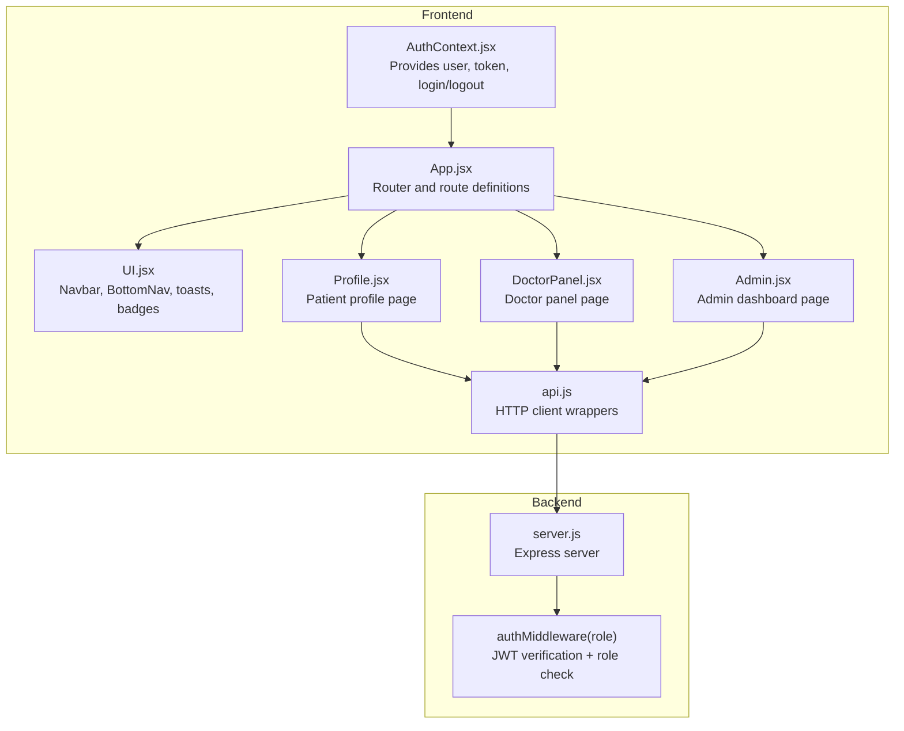
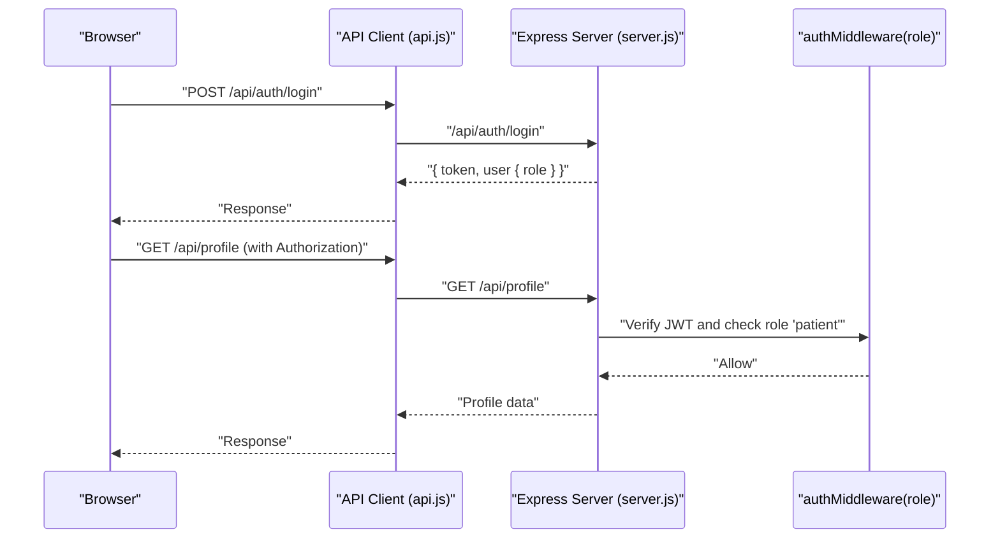
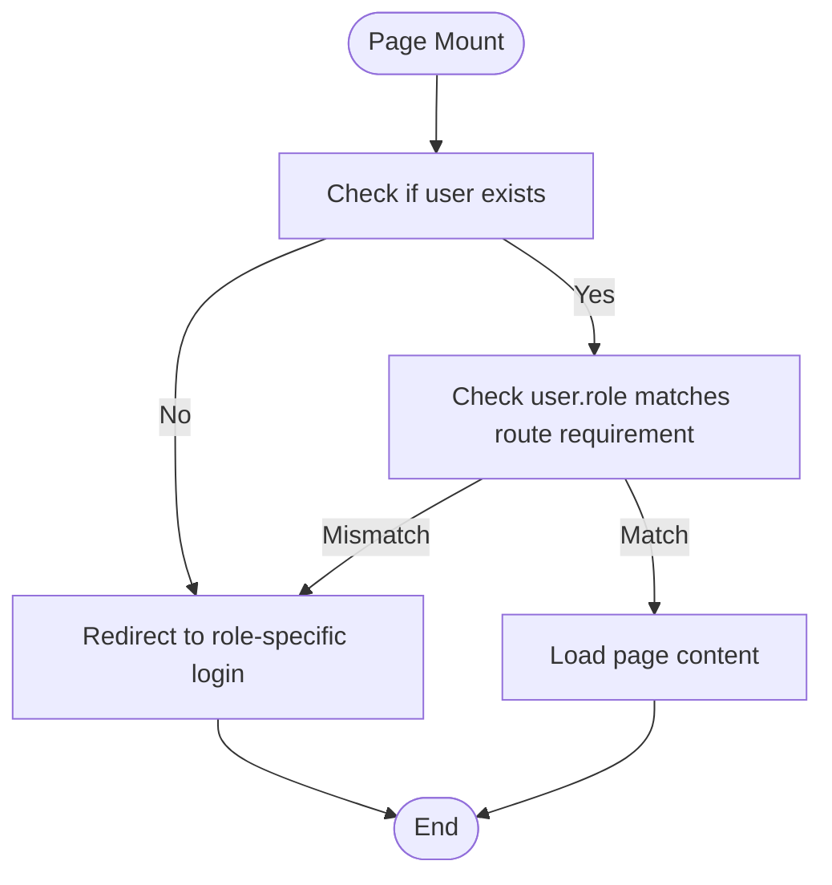
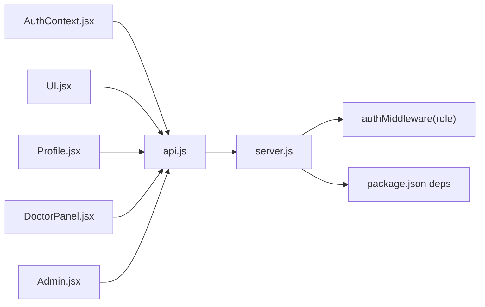

# Role-Based Access Control

<cite>
**Referenced Files in This Document**
- [AuthContext.jsx](file://AuthContext.jsx)
- [App.jsx](file://App.jsx)
- [UI.jsx](file://UI.jsx)
- [Admin.jsx](file://Admin.jsx)
- [DoctorPanel.jsx](file://DoctorPanel.jsx)
- [BookAppointment.jsx](file://BookAppointment.jsx)
- [Profile.jsx](file://Profile.jsx)
- [api.js](file://api.js)
- [server.js](file://server.js)
- [package.json](file://package.json)
</cite>

## Table of Contents
1. [Introduction](#introduction)
2. [Project Structure](#project-structure)
3. [Core Components](#core-components)
4. [Architecture Overview](#architecture-overview)
5. [Detailed Component Analysis](#detailed-component-analysis)
6. [Dependency Analysis](#dependency-analysis)
7. [Performance Considerations](#performance-considerations)
8. [Troubleshooting Guide](#troubleshooting-guide)
9. [Conclusion](#conclusion)

## Introduction
This document explains the role-based access control (RBAC) system implemented in the application. It covers how users are authenticated and assigned roles during login, how those roles are enforced on the frontend via route guards and UI components, and how backend authorization middleware validates roles for sensitive operations. The system supports three roles:
- Patient: can book appointments, view and manage personal profile, leave reviews, and pay for appointments.
- Doctor: can view and update their own appointments.
- Administrator: can view system statistics, manage appointments, manage patients, manage doctors, and view payments.

## Project Structure
The application follows a clear separation of concerns:
- Frontend (React): Authentication context, routing, UI components, and role-aware pages.
- Backend (Node.js/Express): Authentication endpoints, protected routes, and JWT-based authorization middleware.

**Diagram sources**
- [App.jsx](file://App.jsx#L15-L42)
- [AuthContext.jsx](file://AuthContext.jsx#L6-L38)
- [UI.jsx](file://UI.jsx#L96-L138)
- [Profile.jsx](file://Profile.jsx#L7-L43)
- [DoctorPanel.jsx](file://DoctorPanel.jsx#L7-L34)
- [Admin.jsx](file://Admin.jsx#L7-L44)
- [api.js](file://api.js#L1-L44)
- [server.js](file://server.js#L49-L62)

**Section sources**
- [App.jsx](file://App.jsx#L1-L44)
- [AuthContext.jsx](file://AuthContext.jsx#L1-L41)
- [UI.jsx](file://UI.jsx#L1-L182)
- [api.js](file://api.js#L1-L44)
- [server.js](file://server.js#L1-L390)

## Core Components
- Authentication Context: Stores user, token, theme preference, and exposes login/logout functions. Persists user and token in local storage and sets Authorization header globally for HTTP requests.
- Protected Pages: Each role-specific page enforces role checks on mount and redirects unauthenticated or unauthorized users to appropriate login pages.
- UI Navigation: The navbar and bottom navigation render role-specific links and actions.
- Backend Middleware: A single middleware verifies JWT and enforces role-based access to routes.

Key implementation references:
- Authentication context provider and hooks: [AuthContext.jsx](file://AuthContext.jsx#L6-L40)
- Global Authorization header setup: [AuthContext.jsx](file://AuthContext.jsx#L11-L14)
- Role-aware navigation: [UI.jsx](file://UI.jsx#L96-L138), [UI.jsx](file://UI.jsx#L140-L176)
- Protected admin page: [Admin.jsx](file://Admin.jsx#L19-L24)
- Protected doctor panel: [DoctorPanel.jsx](file://DoctorPanel.jsx#L15-L20)
- Protected patient profile: [Profile.jsx](file://Profile.jsx#L16-L21)
- API client wrappers: [api.js](file://api.js#L1-L44)
- Backend auth middleware: [server.js](file://server.js#L49-L62)
- Protected routes on backend: [server.js](file://server.js#L133-L153), [server.js](file://server.js#L204-L217), [server.js](file://server.js#L242-L280)

**Section sources**
- [AuthContext.jsx](file://AuthContext.jsx#L6-L40)
- [UI.jsx](file://UI.jsx#L96-L176)
- [Admin.jsx](file://Admin.jsx#L19-L24)
- [DoctorPanel.jsx](file://DoctorPanel.jsx#L15-L20)
- [Profile.jsx](file://Profile.jsx#L16-L21)
- [api.js](file://api.js#L1-L44)
- [server.js](file://server.js#L49-L62)
- [server.js](file://server.js#L133-L153)
- [server.js](file://server.js#L204-L217)
- [server.js](file://server.js#L242-L280)

## Architecture Overview
The RBAC architecture combines frontend and backend enforcement:
- Frontend: Uses React Router to define routes and role checks to protect pages. Navigation menus adapt to the logged-in user’s role.
- Backend: Uses a JWT-based middleware to enforce role requirements on protected endpoints.

**Diagram sources**
- [api.js](file://api.js#L6-L27)
- [server.js](file://server.js#L82-L90)
- [server.js](file://server.js#L222-L239)
- [server.js](file://server.js#L49-L62)

## Detailed Component Analysis

### Authentication and Role Determination
- Roles are embedded in the JWT issued by the backend upon successful login. The frontend receives the token and user object and stores them locally.
- The Authorization header is automatically attached to outgoing requests when a token exists.

Implementation references:
- Token and user persistence, Authorization header setup: [AuthContext.jsx](file://AuthContext.jsx#L21-L25), [AuthContext.jsx](file://AuthContext.jsx#L11-L14)
- Login endpoints and role assignment on backend: [server.js](file://server.js#L68-L110)

**Section sources**
- [AuthContext.jsx](file://AuthContext.jsx#L11-L25)
- [server.js](file://server.js#L68-L110)

### Protected Routes and Role Checks
- Admin dashboard: Enforces role check on mount and redirects to admin login if role is not admin.
- Doctor panel: Enforces role check on mount and redirects to doctor login if role is not doctor.
- Patient profile: Enforces role check on mount and redirects to patient login if not logged in.

**Diagram sources**
- [Admin.jsx](file://Admin.jsx#L19-L24)
- [DoctorPanel.jsx](file://DoctorPanel.jsx#L15-L20)
- [Profile.jsx](file://Profile.jsx#L16-L21)

**Section sources**
- [Admin.jsx](file://Admin.jsx#L19-L24)
- [DoctorPanel.jsx](file://DoctorPanel.jsx#L15-L20)
- [Profile.jsx](file://Profile.jsx#L16-L21)

### Role-Specific UI Components and Navigation
- Navbar and BottomNav render role-specific links and actions. For example, admin sees the dashboard link; doctor sees the doctor panel link; patients see doctors, appointments, and profile.
- Badges and status indicators are used consistently across pages.

References:
- Role-aware navbar: [UI.jsx](file://UI.jsx#L96-L138)
- Role-aware bottom navigation: [UI.jsx](file://UI.jsx#L140-L176)
- Status badge component: [UI.jsx](file://UI.jsx#L178-L181)

**Section sources**
- [UI.jsx](file://UI.jsx#L96-L181)

### Backend Authorization Middleware
- The middleware extracts the token from the Authorization header, verifies it, and ensures the user’s role matches the required role for the endpoint.
- Protected endpoints include doctor appointments, patient profile, admin dashboards, and payment operations.

References:
- Middleware definition: [server.js](file://server.js#L49-L62)
- Protected doctor routes: [server.js](file://server.js#L133-L153)
- Protected patient routes: [server.js](file://server.js#L204-L217), [server.js](file://server.js#L222-L239)
- Protected admin routes: [server.js](file://server.js#L242-L280)
- Payment routes (patient-only): [server.js](file://server.js#L297-L353)

**Section sources**
- [server.js](file://server.js#L49-L62)
- [server.js](file://server.js#L133-L153)
- [server.js](file://server.js#L204-L239)
- [server.js](file://server.js#L242-L280)
- [server.js](file://server.js#L297-L353)

### Role-Specific Page Permissions

#### Admin Dashboard
- Accessible only to users with role admin.
- Provides overview, appointments, patients, doctors, and payments tabs.
- Allows updating appointment status and removing doctors.

References:
- Role check and redirect: [Admin.jsx](file://Admin.jsx#L19-L24)
- Tabbed interface and actions: [Admin.jsx](file://Admin.jsx#L45-L193)

**Section sources**
- [Admin.jsx](file://Admin.jsx#L19-L193)

#### Doctor Panel
- Accessible only to users with role doctor.
- Displays doctor’s appointments, filtering by status, and allows approving/rejecting pending appointments.

References:
- Role check and redirect: [DoctorPanel.jsx](file://DoctorPanel.jsx#L15-L20)
- Appointment updates: [DoctorPanel.jsx](file://DoctorPanel.jsx#L22-L28)

**Section sources**
- [DoctorPanel.jsx](file://DoctorPanel.jsx#L15-L28)

#### Patient Features
- Profile page: Accessible to logged-in patients; allows updating personal details and password.
- Booking and payment: Accessible to logged-in patients; integrates with payment endpoints.

References:
- Profile protection: [Profile.jsx](file://Profile.jsx#L16-L21)
- Booking flow and redirection to login if unauthenticated: [BookAppointment.jsx](file://BookAppointment.jsx#L39-L42), [BookAppointment.jsx](file://BookAppointment.jsx#L62-L63)

**Section sources**
- [Profile.jsx](file://Profile.jsx#L16-L41)
- [BookAppointment.jsx](file://BookAppointment.jsx#L39-L63)

### Practical Examples

#### Role-Based Conditional Rendering
- Navbar conditionally renders links based on user role.
- Bottom navigation adapts to role-specific items.

References:
- Navbar role conditions: [UI.jsx](file://UI.jsx#L117-L125)
- Bottom navigation role selection: [UI.jsx](file://UI.jsx#L162-L162)

**Section sources**
- [UI.jsx](file://UI.jsx#L117-L125)
- [UI.jsx](file://UI.jsx#L162-L162)

#### Protected Route Implementation
- Each page enforces a role check on mount and navigates to the appropriate login page if the user lacks the required role.

References:
- Admin page guard: [Admin.jsx](file://Admin.jsx#L19-L24)
- Doctor panel guard: [DoctorPanel.jsx](file://DoctorPanel.jsx#L15-L20)
- Patient profile guard: [Profile.jsx](file://Profile.jsx#L16-L21)

**Section sources**
- [Admin.jsx](file://Admin.jsx#L19-L24)
- [DoctorPanel.jsx](file://DoctorPanel.jsx#L15-L20)
- [Profile.jsx](file://Profile.jsx#L16-L21)

#### Permission Checking in Backend
- Middleware verifies JWT and enforces role requirements for each route.

References:
- Middleware: [server.js](file://server.js#L49-L62)
- Example protected route: [server.js](file://server.js#L133-L153)

**Section sources**
- [server.js](file://server.js#L49-L62)
- [server.js](file://server.js#L133-L153)

## Dependency Analysis
- Frontend depends on the backend for authentication and protected resources. The API client wraps endpoints for each role.
- Backend depends on JWT and bcrypt for secure authentication and password hashing.

**Diagram sources**
- [AuthContext.jsx](file://AuthContext.jsx#L1-L41)
- [UI.jsx](file://UI.jsx#L1-L182)
- [Profile.jsx](file://Profile.jsx#L1-L97)
- [DoctorPanel.jsx](file://DoctorPanel.jsx#L1-L96)
- [Admin.jsx](file://Admin.jsx#L1-L194)
- [api.js](file://api.js#L1-L44)
- [server.js](file://server.js#L1-L390)
- [package.json](file://package.json#L14-L22)

**Section sources**
- [api.js](file://api.js#L1-L44)
- [server.js](file://server.js#L1-L390)
- [package.json](file://package.json#L14-L22)

## Performance Considerations
- JWT verification occurs on every protected request; caching tokens reduces redundant logins.
- Avoid unnecessary re-renders by memoizing role checks and navigation callbacks in UI components.
- Batch API calls (as seen in admin dashboard) improve perceived performance.

## Troubleshooting Guide
Common RBAC scenarios and resolutions:
- Unauthorized access attempts:
  - Frontend: Unauthenticated users are redirected to the appropriate login page.
  - Backend: Requests without a valid token receive a 401; requests with insufficient role receive a 403.
- Role mismatch:
  - Frontend: If a user navigates directly to a role-specific page, they are redirected to the login page for that role.
  - Backend: Protected endpoints reject requests where the user’s role does not match the required role.
- Token expiration or invalidation:
  - Frontend: On logout or token removal, Authorization header is cleared and user state reset.
  - Backend: Expired or invalid tokens fail verification and return 401.

References:
- Frontend redirects and guards: [Admin.jsx](file://Admin.jsx#L19-L24), [DoctorPanel.jsx](file://DoctorPanel.jsx#L15-L20), [Profile.jsx](file://Profile.jsx#L16-L21)
- Backend middleware and errors: [server.js](file://server.js#L49-L62), [server.js](file://server.js#L82-L90), [server.js](file://server.js#L102-L110)

**Section sources**
- [Admin.jsx](file://Admin.jsx#L19-L24)
- [DoctorPanel.jsx](file://DoctorPanel.jsx#L15-L20)
- [Profile.jsx](file://Profile.jsx#L16-L21)
- [server.js](file://server.js#L49-L62)
- [server.js](file://server.js#L82-L110)

## Conclusion
The application implements a robust RBAC system with clear role boundaries enforced on both the frontend and backend. Users are authenticated once, roles are embedded in JWTs, and subsequent requests are gated by middleware. Role-specific UI components and navigation ensure users only see relevant features, while protected pages prevent unauthorized access. The design supports straightforward extension to additional roles or permissions by adding new routes and middleware checks.