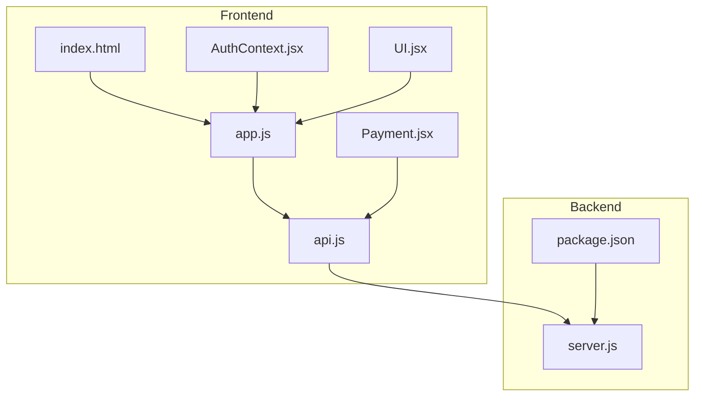
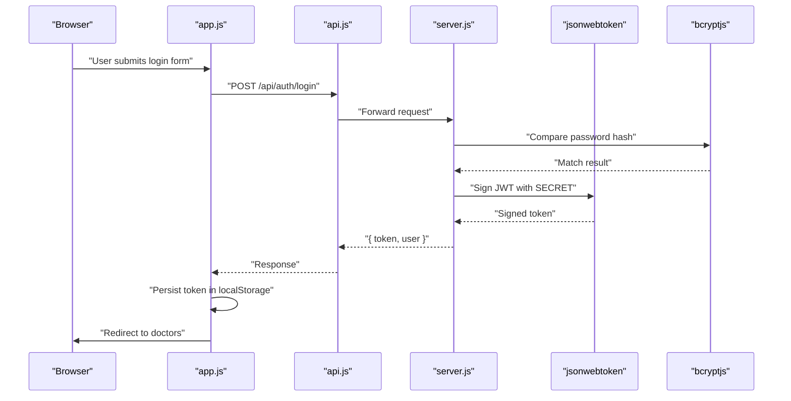
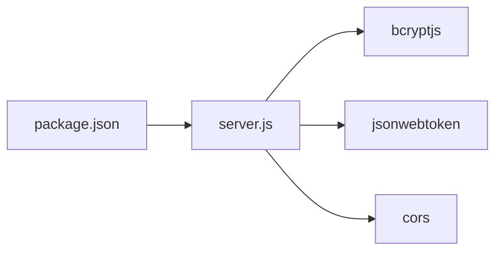

# Security Implementations

<cite>
**Referenced Files in This Document**
- [server.js](file://server.js)
- [AuthContext.jsx](file://AuthContext.jsx)
- [api.js](file://api.js)
- [package.json](file://package.json)
- [README.md](file://README.md)
- [index.html](file://index.html)
- [app.js](file://app.js)
- [Payment.jsx](file://Payment.jsx)
- [UI.jsx](file://UI.jsx)
</cite>

## Table of Contents
1. [Introduction](#introduction)
2. [Project Structure](#project-structure)
3. [Core Components](#core-components)
4. [Architecture Overview](#architecture-overview)
5. [Detailed Component Analysis](#detailed-component-analysis)
6. [Dependency Analysis](#dependency-analysis)
7. [Performance Considerations](#performance-considerations)
8. [Troubleshooting Guide](#troubleshooting-guide)
9. [Conclusion](#conclusion)
10. [Appendices](#appendices)

## Introduction
This document provides comprehensive security documentation for the authentication system, focusing on protective measures and best practices implemented in the codebase. It covers password hashing with bcryptjs, token-based authentication with JWT, input validation and sanitization, protection against common vulnerabilities, CORS and transport security, session/token lifecycle management, rate limiting and brute-force protections, secure storage of tokens and sensitive data, and operational security practices. Guidance also includes HIPAA-compliant considerations for healthcare applications and secure development/testing methodologies.

## Project Structure
The application follows a classic full-stack layout:
- Frontend: Static HTML/CSS/JS with embedded React-like logic and a dedicated API client module.
- Backend: Node.js/Express REST API with in-memory storage and JWT-based authentication middleware.

**Diagram sources**
- [index.html](file://index.html#L1-L552)
- [app.js](file://app.js#L1-L200)
- [api.js](file://api.js#L1-L44)
- [AuthContext.jsx](file://AuthContext.jsx#L1-L41)
- [UI.jsx](file://UI.jsx#L1-L182)
- [Payment.jsx](file://Payment.jsx#L1-L350)
- [server.js](file://server.js#L1-L390)
- [package.json](file://package.json#L1-L24)

**Section sources**
- [README.md](file://README.md#L1-L159)
- [package.json](file://package.json#L1-L24)

## Core Components
- Authentication server: Implements JWT signing and verification, bcrypt-based password hashing, and role-based protected routes.
- Frontend authentication state: Manages JWT lifecycle, persists tokens and user data in localStorage, and attaches Authorization headers automatically.
- API client: Centralized axios-based client with automatic bearer token inclusion.
- Payment flow: Demonstrates client-side validation and secure presentation of payment details; Stripe integration is present but requires a secret key.

Key security-relevant implementations:
- Password hashing with bcryptjs and salt generation handled by the library.
- JWT issuance with expiration and middleware enforcing token presence and validity.
- Frontend stores tokens and user data in localStorage and sets Authorization header for protected requests.
- Basic input validation occurs in the frontend registration/login flows.

**Section sources**
- [server.js](file://server.js#L6-L19)
- [server.js](file://server.js#L49-L62)
- [server.js](file://server.js#L69-L110)
- [AuthContext.jsx](file://AuthContext.jsx#L1-L41)
- [api.js](file://api.js#L1-L44)
- [app.js](file://app.js#L1-L33)
- [app.js](file://app.js#L401-L489)

## Architecture Overview
The authentication architecture integrates frontend state management, a centralized API client, and backend endpoints secured by JWT middleware.

**Diagram sources**
- [app.js](file://app.js#L423-L438)
- [api.js](file://api.js#L6-L9)
- [server.js](file://server.js#L82-L90)
- [server.js](file://server.js#L54-L61)
- [server.js](file://server.js#L19-L19)

## Detailed Component Analysis

### Password Hashing and Salt Generation
- Implementation: bcryptjs is used for hashing and verifying passwords on the backend.
- Salt generation: Provided by bcryptjs; the salt is embedded within the resulting hash.
- Storage: Hashed passwords are persisted in the in-memory database.

Best practices evidenced:
- Use of a strong hashing algorithm with a per-password salt.
- Never storing plaintext passwords.

Recommendations:
- Use environment variables for the bcrypt cost factor and consider rotating secrets periodically.
- Replace in-memory storage with a secure database and enforce unique constraints on identifiers.

**Section sources**
- [server.js](file://server.js#L6-L6)
- [server.js](file://server.js#L29-L44)
- [server.js](file://server.js#L75-L75)
- [server.js](file://server.js#L86-L86)
- [server.js](file://server.js#L96-L96)
- [server.js](file://server.js#L105-L105)

### Token-Based Authentication and Middleware
- Issuance: JWT tokens are signed with a shared secret and include user role and id claims with a fixed expiration.
- Verification: A middleware extracts the Authorization header, splits the Bearer token, verifies the signature, and enforces role-based access.
- Frontend: Stores token in localStorage and attaches Authorization header to all subsequent requests.

Security considerations:
- Token storage in localStorage exposes the application to XSS risks.
- Expiration policy is enforced server-side; ensure clients handle invalid/expired tokens gracefully.

**Section sources**
- [server.js](file://server.js#L19-L19)
- [server.js](file://server.js#L49-L62)
- [server.js](file://server.js#L78-L78)
- [server.js](file://server.js#L88-L88)
- [server.js](file://server.js#L98-L98)
- [server.js](file://server.js#L108-L108)
- [AuthContext.jsx](file://AuthContext.jsx#L1-L41)
- [api.js](file://api.js#L1-L44)
- [app.js](file://app.js#L11-L17)

### Input Validation and Sanitization
- Frontend validation: Registration and login forms validate presence of required fields and basic format checks (email regex, minimum password length).
- Backend validation: Minimal validation is performed (presence checks for required fields). There is no ORM or parameterized query abstraction in the backend.

Vulnerability risks:
- SQL injection is mitigated by the absence of direct database queries; however, the in-memory DB pattern does not inherently protect against injection in a production environment.
- XSS risk is elevated due to localStorage usage and potential DOM manipulation.

Recommendations:
- Implement strict input validation and sanitization on the backend.
- Use parameterized queries or an ORM with query builders.
- Sanitize and escape all user-generated content rendered to the DOM.

**Section sources**
- [app.js](file://app.js#L402-L421)
- [app.js](file://app.js#L423-L438)
- [server.js](file://server.js#L69-L80)
- [server.js](file://server.js#L82-L90)
- [server.js](file://server.js#L92-L110)

### Protection Against Common Vulnerabilities
- SQL Injection: Not applicable to the in-memory implementation; however, production deployments must avoid string concatenation and use prepared statements or ORMs.
- XSS: Risk exists due to localStorage usage and direct DOM updates. Mitigations include Content-Security-Policy headers, secure cookie flags (when cookies are used), and avoiding innerHTML for user data.
- CSRF: Not implemented; CSRF protection is typically achieved via anti-CSRF tokens and SameSite cookie policies.

Recommendations:
- Enforce CSP headers and use secure, httpOnly cookies for session tokens if switching to cookie-based sessions.
- Implement CSRF tokens for state-changing requests and SameSite=Lax/Strict policies.

**Section sources**
- [server.js](file://server.js#L29-L44)
- [AuthContext.jsx](file://AuthContext.jsx#L1-L41)
- [index.html](file://index.html#L1-L552)

### CORS Configuration, HTTPS Enforcement, and Secure Headers
- CORS: Enabled globally without restrictions; this is acceptable for development but insecure for production.
- HTTPS: Not enforced in the backend; development runs on HTTP.
- Secure headers: Not configured; missing security headers (e.g., CSP, HSTS, X-Content-Type-Options).

Recommendations:
- Configure CORS with allowed origins and credentials policies.
- Enforce HTTPS in production and set HSTS.
- Add CSP, X-Content-Type-Options, X-Frame-Options, and Referrer-Policy headers.

**Section sources**
- [server.js](file://server.js#L22-L22)
- [server.js](file://server.js#L389-L390)

### Session Management, Token Expiration, and Automatic Logout
- Token expiration: Fixed TTL is set during JWT signing; middleware validates expiration.
- Automatic logout: Implemented by removing tokens from localStorage and clearing Authorization headers.
- Frontend persistence: Tokens and user data are persisted in localStorage.

Recommendations:
- Implement refresh token rotation and sliding expiration.
- Add token blacklisting or short-lived access tokens with refresh tokens.
- Consider secure, httpOnly cookies for tokens to mitigate XSS.

**Section sources**
- [server.js](file://server.js#L78-L78)
- [server.js](file://server.js#L88-L88)
- [server.js](file://server.js#L98-L98)
- [server.js](file://server.js#L108-L108)
- [AuthContext.jsx](file://AuthContext.jsx#L27-L31)
- [app.js](file://app.js#L482-L489)

### Rate Limiting, Account Lockout, and Brute Force Protection
- Current implementation: No rate limiting or lockout mechanisms are present.
- Recommendations:
  - Implement request throttling per IP and per identifier.
  - Add exponential backoff and temporary lockout after failed attempts.
  - Use a persistent store (Redis/Memcached) for counters.

[No sources needed since this section provides general guidance]

### Secure Storage of Tokens and Local Storage Encryption
- Current implementation: Tokens and user data are stored in localStorage.
- Risks: localStorage is vulnerable to XSS; sensitive data can be extracted.
- Recommendations:
  - Prefer httpOnly, secure cookies for tokens.
  - If localStorage is unavoidable, encrypt sensitive data with a key derived from user credentials and hardware attestation where possible.
  - Clear sensitive data promptly after logout.

**Section sources**
- [AuthContext.jsx](file://AuthContext.jsx#L7-L31)
- [app.js](file://app.js#L474-L489)

### Payment Security and PCI Compliance Considerations
- Frontend validation: Performs basic checks for card numbers, expiry, and CVV.
- Backend integration: Stripe SDK is imported and used; however, the secret key is loaded from environment variables and guarded by a try/catch block.
- Recommendations:
  - Never transmit primary account numbers (PAN) to the backend; use Stripe Elements and Payment Intents.
  - Ensure PCI DSS compliance by not storing sensitive card data.
  - Validate payment amounts server-side and reconcile with Stripe events.

**Section sources**
- [server.js](file://server.js#L11-L15)
- [server.js](file://server.js#L297-L316)
- [server.js](file://server.js#L318-L353)
- [Payment.jsx](file://Payment.jsx#L62-L98)

### Healthcare-Specific Security and HIPAA Considerations
- PHI handling: The application does not implement explicit PHI safeguards (e.g., audit logs, access controls, data loss prevention).
- Recommendations:
  - Implement audit logging for PHI access and modifications.
  - Enforce role-based access controls and least privilege.
  - Encrypt at rest and in transit; use secure channels for all communications.
  - Provide data minimization and retention policies aligned with regulatory requirements.

[No sources needed since this section provides general guidance]

### Secure Development Practices and Security Testing Methodologies
- Secure coding:
  - Validate and sanitize all inputs.
  - Use parameterized queries or ORMs.
  - Enforce HTTPS and secure headers.
- Security testing:
  - Static analysis for cryptographic misuse and XSS.
  - Dynamic scanning for OWASP Top Ten vulnerabilities.
  - Penetration testing with emphasis on authentication and authorization.
  - Dependency review for known vulnerabilities.

[No sources needed since this section provides general guidance]

## Dependency Analysis
External libraries impacting security:
- bcryptjs: Used for password hashing.
- jsonwebtoken: Used for JWT signing and verification.
- cors: Enables cross-origin requests; requires careful configuration.
- stripe: Optional payment integration requiring secret key management.

**Diagram sources**
- [package.json](file://package.json#L14-L22)
- [server.js](file://server.js#L6-L9)

**Section sources**
- [package.json](file://package.json#L14-L22)
- [server.js](file://server.js#L6-L9)

## Performance Considerations
- bcrypt cost factor: Affects CPU usage during login/signup; tune for acceptable latency while maintaining security.
- JWT overhead: Lightweight; ensure minimal payload to reduce bandwidth.
- Frontend token caching: Avoid redundant re-authentication by leveraging cached tokens and proactive refresh strategies.

[No sources needed since this section provides general guidance]

## Troubleshooting Guide
Common issues and resolutions:
- Invalid or expired token errors: Verify SECRET consistency and token TTL; ensure clients renew tokens before expiration.
- CORS errors: Configure allowed origins and credentials in production.
- Stripe errors: Ensure STRIPE_SECRET_KEY is set; otherwise, payment endpoints will return unavailability messages.

**Section sources**
- [server.js](file://server.js#L54-L61)
- [server.js](file://server.js#L22-L22)
- [server.js](file://server.js#L11-L15)
- [server.js](file://server.js#L297-L316)

## Conclusion
The application demonstrates sound foundational practices: bcrypt-based password hashing, JWT-based authentication, and basic frontend validation. However, several production-grade security enhancements are required: stricter CORS configuration, HTTPS enforcement, secure headers, CSRF protection, rate limiting, secure token storage, and robust input validation. For healthcare deployments, additional HIPAA-aligned safeguards are essential. Adopting secure development practices and continuous security testing will further strengthen the system’s resilience.

## Appendices
- Environment variable guidance:
  - JWT_SECRET: Strong random secret for signing tokens.
  - STRIPE_SECRET_KEY: Secret key for Stripe integration.
- Deployment checklist:
  - Enforce HTTPS and HSTS.
  - Configure CORS with allowed origins.
  - Add CSP and other security headers.
  - Store tokens in secure cookies (httpOnly, secure).
  - Implement rate limiting and lockout policies.
  - Audit and monitor access to PHI.

[No sources needed since this section provides general guidance]