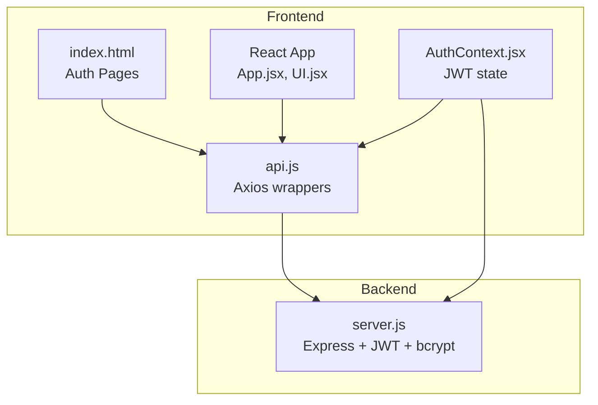
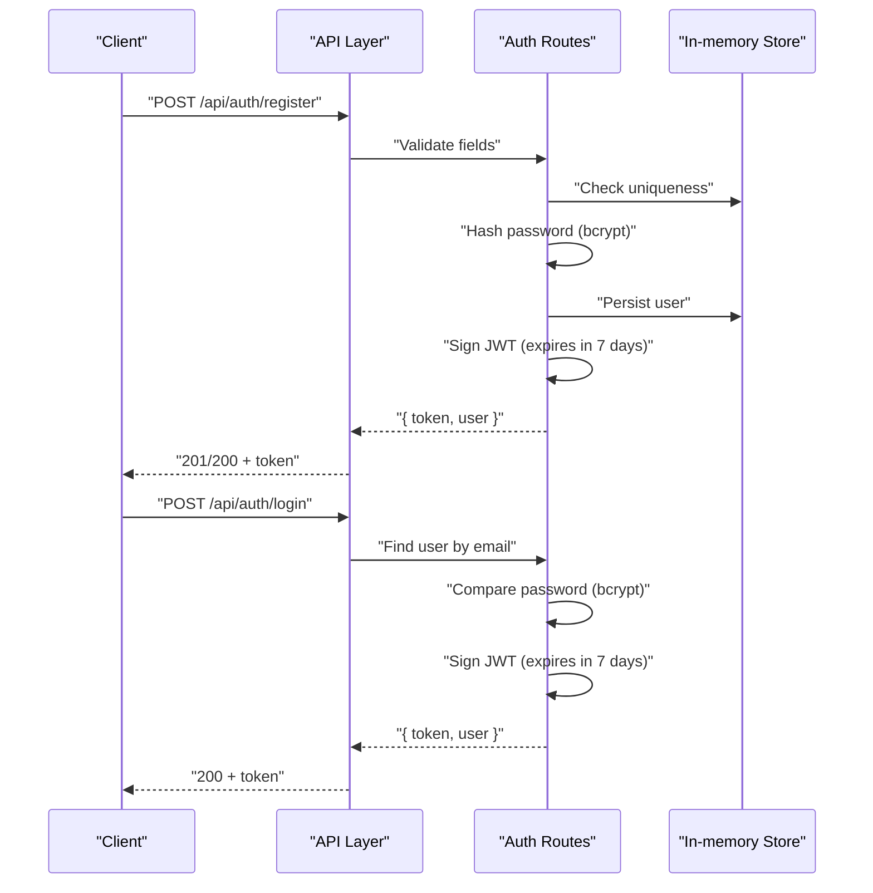
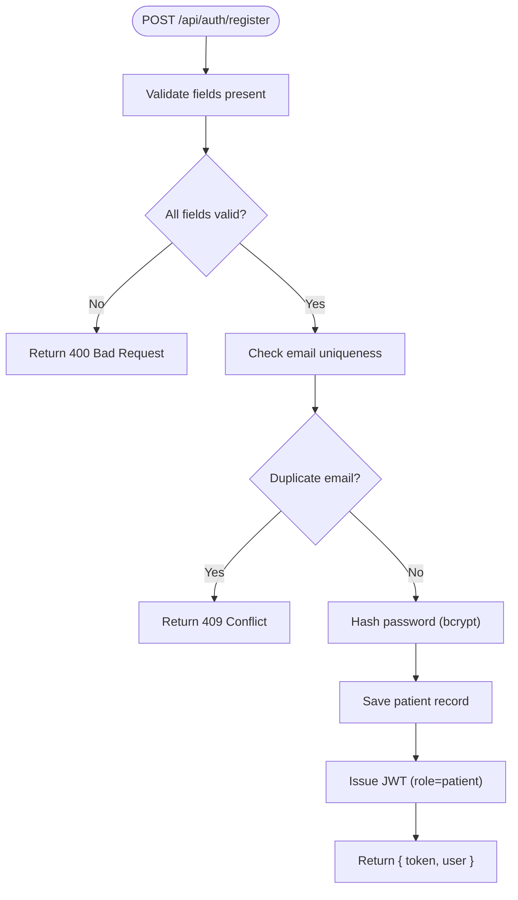
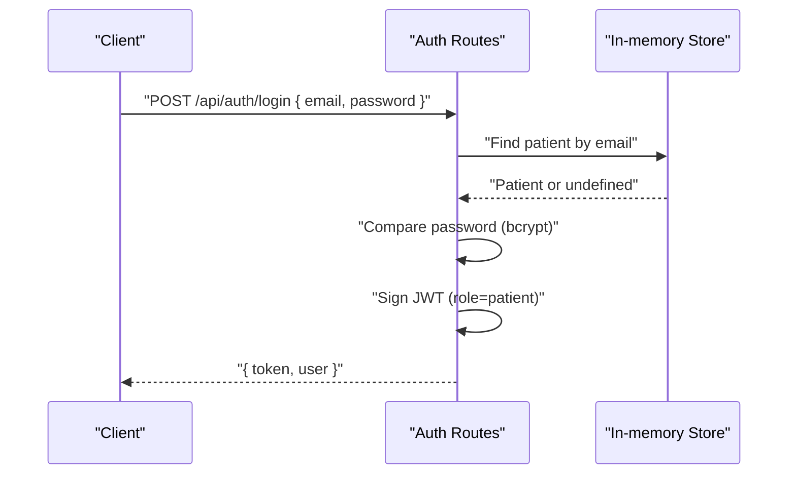
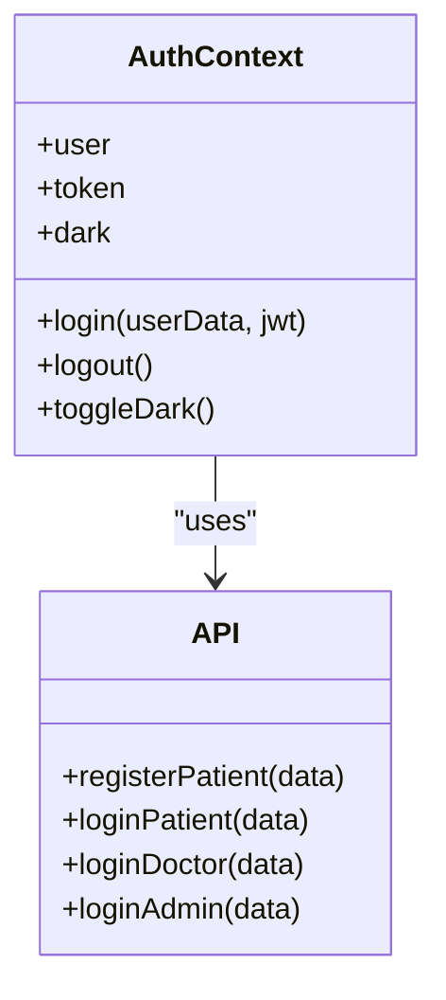
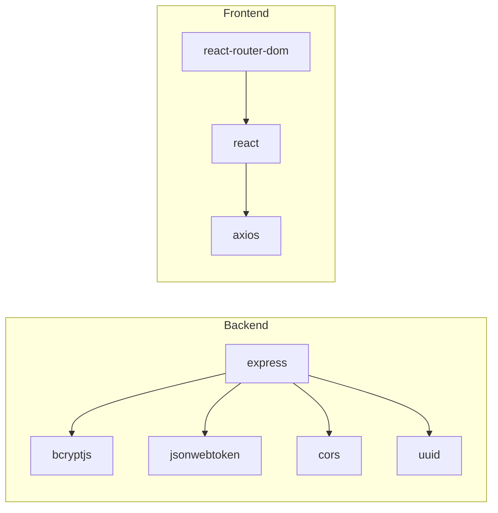

# User Registration and Login

<cite>
**Referenced Files in This Document**
- [server.js](file://server.js)
- [AuthContext.jsx](file://AuthContext.jsx)
- [api.js](file://api.js)
- [App.jsx](file://App.jsx)
- [UI.jsx](file://UI.jsx)
- [index.html](file://index.html)
- [package.json](file://package.json)
- [README.md](file://README.md)
</cite>

## Table of Contents
1. [Introduction](#introduction)
2. [Project Structure](#project-structure)
3. [Core Components](#core-components)
4. [Architecture Overview](#architecture-overview)
5. [Detailed Component Analysis](#detailed-component-analysis)
6. [Dependency Analysis](#dependency-analysis)
7. [Performance Considerations](#performance-considerations)
8. [Troubleshooting Guide](#troubleshooting-guide)
9. [Conclusion](#conclusion)
10. [Appendices](#appendices)

## Introduction
This document explains the user registration and login functionality for the Doctor appointment booking system. It covers the complete authentication flow for patients, doctors, and administrators, including form validation, credential processing, JWT token generation, and session establishment. It also documents the backend endpoints, request/response schemas, security measures (bcrypt hashing, JWT), and the frontend integration with the backend APIs. Practical examples and troubleshooting guidance are included for common issues.

## Project Structure
The authentication system spans the backend (Node.js/Express) and the frontend (HTML/CSS/JS and React). The backend exposes REST endpoints for registration and login, while the frontend provides user interfaces and integrates with the backend via Axios.

**Diagram sources**
- [server.js](file://server.js#L1-L390)
- [api.js](file://api.js#L1-L44)
- [AuthContext.jsx](file://AuthContext.jsx#L1-L41)
- [App.jsx](file://App.jsx#L1-L44)
- [UI.jsx](file://UI.jsx#L1-L182)
- [index.html](file://index.html#L1-L531)

**Section sources**
- [README.md](file://README.md#L1-L159)
- [package.json](file://package.json#L1-L24)

## Core Components
- Backend authentication endpoints:
  - Patient registration and login
  - Doctor login
  - Admin login
- Frontend authentication state and API wrappers:
  - Axios-based API module
  - React context for JWT and user state
  - HTML-based auth pages and JS handlers
- Security:
  - bcrypt hashing for passwords
  - JWT tokens with role claims
  - Middleware enforcing authorization per role

Key implementation references:
- Authentication routes and middleware: [server.js](file://server.js#L49-L110)
- Patient registration and login: [server.js](file://server.js#L68-L90)
- Doctor login: [server.js](file://server.js#L92-L100)
- Admin login: [server.js](file://server.js#L102-L110)
- JWT middleware: [server.js](file://server.js#L49-L62)
- Frontend API wrappers: [api.js](file://api.js#L1-L44)
- React auth context: [AuthContext.jsx](file://AuthContext.jsx#L1-L41)
- HTML auth pages and handlers: [index.html](file://index.html#L129-L249)

**Section sources**
- [server.js](file://server.js#L49-L110)
- [api.js](file://api.js#L1-L44)
- [AuthContext.jsx](file://AuthContext.jsx#L1-L41)
- [index.html](file://index.html#L129-L249)

## Architecture Overview
The authentication flow follows a standard pattern:
- Clients submit credentials to backend endpoints
- Backend validates inputs, checks existing records, hashes passwords when registering, and compares passwords when logging in
- On success, backend returns a signed JWT with role and user identifiers
- Frontend stores the JWT and attaches it to subsequent requests

**Diagram sources**
- [server.js](file://server.js#L68-L90)
- [api.js](file://api.js#L6-L9)
- [AuthContext.jsx](file://AuthContext.jsx#L21-L31)

## Detailed Component Analysis

### Backend Authentication Endpoints

#### Patient Registration
- Endpoint: POST /api/auth/register
- Request body:
  - name: string (required)
  - email: string (required)
  - phone: string (required)
  - age: number (required)
  - password: string (required)
- Validation:
  - All fields required
  - Duplicate email check
- Processing:
  - Hash password using bcrypt
  - Persist new patient record
  - Issue JWT with role "patient", expires in 7 days
- Response:
  - token: string
  - user: { id, name, email, phone, age, role: "patient" }

**Diagram sources**
- [server.js](file://server.js#L68-L80)

**Section sources**
- [server.js](file://server.js#L68-L80)

#### Patient Login
- Endpoint: POST /api/auth/login
- Request body:
  - email: string (required)
  - password: string (required)
- Validation:
  - Find patient by email
  - Compare password using bcrypt
- Processing:
  - Issue JWT with role "patient", expires in 7 days
- Response:
  - token: string
  - user: { id, name, email, phone, age, role: "patient" }

**Diagram sources**
- [server.js](file://server.js#L82-L90)

**Section sources**
- [server.js](file://server.js#L82-L90)

#### Doctor Login
- Endpoint: POST /api/auth/doctor-login
- Request body:
  - email: string (required)
  - password: string (required)
- Validation:
  - Find doctor by email
  - Compare password using bcrypt
- Processing:
  - Issue JWT with role "doctor", expires in 7 days
- Response:
  - token: string
  - user: { id, name, email, specialization, role: "doctor" }

**Section sources**
- [server.js](file://server.js#L92-L100)

#### Admin Login
- Endpoint: POST /api/auth/admin-login
- Request body:
  - username: string (required)
  - password: string (required)
- Validation:
  - Find admin by username
  - Compare password using bcrypt
- Processing:
  - Issue JWT with role "admin", expires in 7 days
- Response:
  - token: string
  - user: { id, name: "Administrator", role: "admin" }

**Section sources**
- [server.js](file://server.js#L102-L110)

### Frontend Authentication Integration

#### React Context (JWT and User State)
- Stores:
  - user: current logged-in user
  - token: JWT string
  - dark: theme preference
- Methods:
  - login(userData, jwt): persist and attach Authorization header
  - logout(): clear state and header
- Axios defaults:
  - Automatically attaches Authorization: Bearer <token> when present

**Diagram sources**
- [AuthContext.jsx](file://AuthContext.jsx#L1-L41)
- [api.js](file://api.js#L1-L44)

**Section sources**
- [AuthContext.jsx](file://AuthContext.jsx#L1-L41)
- [api.js](file://api.js#L1-L44)

#### HTML Auth Pages and Handlers
- Pages:
  - Register: collects name, email, phone, age, password
  - Login: collects email and password
  - Doctor Login: collects email and password
  - Admin Login: collects username and password
- Handlers:
  - doRegister(), doLogin(), doDoctorLogin(), doAdminLogin()
  - Display errors in dedicated error containers
  - Switch between auth pages

References:
- Register page and form fields: [index.html](file://index.html#L129-L171)
- Login page and form fields: [index.html](file://index.html#L173-L218)
- Doctor login page and form fields: [index.html](file://index.html#L220-L234)
- Admin login page and form fields: [index.html](file://index.html#L236-L249)

**Section sources**
- [index.html](file://index.html#L129-L249)

#### Router and Navigation
- Routes include:
  - /register, /login, /doctor-login, /admin-login
- Navigation adapts based on user role (patient/doctor/admin)

**Section sources**
- [App.jsx](file://App.jsx#L1-L44)
- [UI.jsx](file://UI.jsx#L96-L138)

### JWT Middleware and Role-Based Access
- Middleware extracts token from Authorization header and verifies it
- Enforces role-based access when specified
- Attaches decoded user info to request for protected routes

**Section sources**
- [server.js](file://server.js#L49-L62)

## Dependency Analysis
- Backend dependencies:
  - bcryptjs: password hashing
  - jsonwebtoken: JWT signing and verification
  - cors: cross-origin support
  - uuid: generating IDs
- Frontend dependencies:
  - axios: HTTP client
  - react-router-dom: routing
  - react: context and components

**Diagram sources**
- [package.json](file://package.json#L14-L22)
- [server.js](file://server.js#L5-L19)
- [api.js](file://api.js#L1-L3)

**Section sources**
- [package.json](file://package.json#L14-L22)

## Performance Considerations
- Token expiration: JWTs expire in 7 days, reducing long-lived session risks
- bcrypt cost: hashing uses a moderate cost suitable for development; adjust in production
- In-memory storage: suitable for demos; consider persistent databases for production
- Network overhead: keep request bodies minimal; avoid sending unnecessary fields

## Troubleshooting Guide
Common issues and resolutions:
- Duplicate registration:
  - Symptom: 409 Conflict with email already registered
  - Resolution: Use a different email address
  - Reference: [server.js](file://server.js#L73-L74)
- Invalid credentials:
  - Symptom: 401 Unauthorized on login
  - Resolution: Verify email/password or username/password depending on role
  - References: [server.js](file://server.js#L86-L87), [server.js](file://server.js#L96-L97), [server.js](file://server.js#L106-L107)
- Missing fields during registration:
  - Symptom: 400 Bad Request
  - Resolution: Ensure name, email, phone, age, password are provided
  - Reference: [server.js](file://server.js#L71-L72)
- Token not attached:
  - Symptom: 401 No token provided or Invalid/expired token
  - Resolution: Re-authenticate; ensure Authorization header is set
  - References: [server.js](file://server.js#L51-L52), [server.js](file://server.js#L58-L59), [AuthContext.jsx](file://AuthContext.jsx#L11-L14)
- Frontend not receiving token:
  - Symptom: Not redirected after login
  - Resolution: Confirm login handler persists token and user; check browser console for errors
  - References: [AuthContext.jsx](file://AuthContext.jsx#L21-L31), [index.html](file://index.html#L129-L249)

**Section sources**
- [server.js](file://server.js#L51-L59)
- [server.js](file://server.js#L71-L74)
- [server.js](file://server.js#L86-L87)
- [server.js](file://server.js#L96-L97)
- [server.js](file://server.js#L106-L107)
- [AuthContext.jsx](file://AuthContext.jsx#L11-L31)
- [index.html](file://index.html#L129-L249)

## Conclusion
The authentication system provides secure, role-based access for patients, doctors, and administrators. It leverages bcrypt for password hashing, JWT for session tokens, and a clear separation between frontend and backend concerns. The frontend integrates seamlessly with backend endpoints via Axios and React context, enabling smooth user experiences across registration and login flows.

## Appendices

### API Definitions

- Patient Registration
  - Method: POST
  - Path: /api/auth/register
  - Request: { name, email, phone, age, password }
  - Response: { token, user: { id, name, email, phone, age, role: "patient" } }

- Patient Login
  - Method: POST
  - Path: /api/auth/login
  - Request: { email, password }
  - Response: { token, user: { id, name, email, phone, age, role: "patient" } }

- Doctor Login
  - Method: POST
  - Path: /api/auth/doctor-login
  - Request: { email, password }
  - Response: { token, user: { id, name, email, specialization, role: "doctor" } }

- Admin Login
  - Method: POST
  - Path: /api/auth/admin-login
  - Request: { username, password }
  - Response: { token, user: { id, name: "Administrator", role: "admin" } }

**Section sources**
- [server.js](file://server.js#L68-L110)

### Security Measures
- Password hashing: bcrypt with salt rounds
- Token issuance: JWT with role and expiration
- Token verification: middleware checks presence and validity
- Input handling: basic validation in backend; consider adding sanitization and rate limiting in production

**Section sources**
- [server.js](file://server.js#L6-L19)
- [server.js](file://server.js#L49-L62)