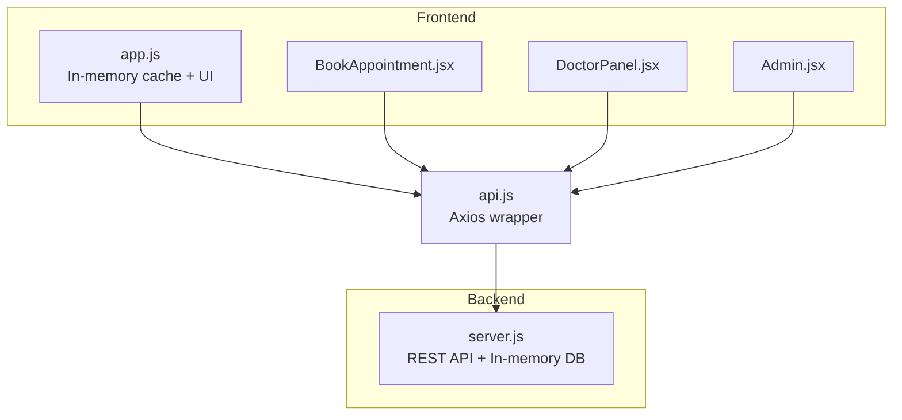
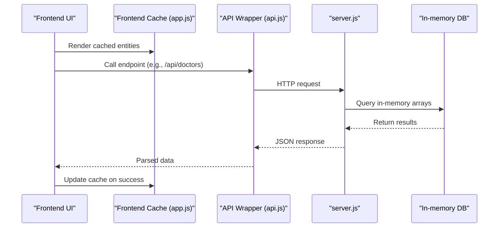
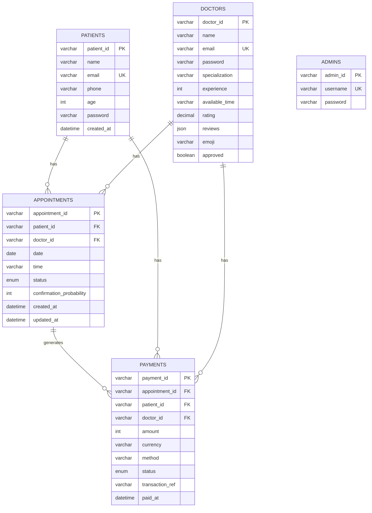
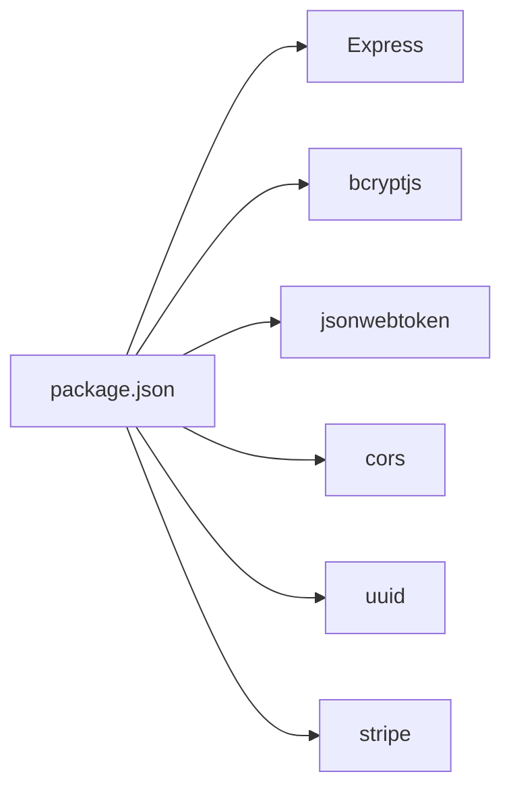

# Database Design

<cite>
**Referenced Files in This Document**
- [README.md](file://README.md)
- [server.js](file://server.js)
- [data.js](file://data.js)
- [app.js](file://app.js)
- [api.js](file://api.js)
- [BookAppointment.jsx](file://BookAppointment.jsx)
- [DoctorPanel.jsx](file://DoctorPanel.jsx)
- [Admin.jsx](file://Admin.jsx)
- [package.json](file://package.json)
</cite>

## Table of Contents
1. [Introduction](#introduction)
2. [Project Structure](#project-structure)
3. [Core Components](#core-components)
4. [Architecture Overview](#architecture-overview)
5. [Detailed Component Analysis](#detailed-component-analysis)
6. [Dependency Analysis](#dependency-analysis)
7. [Performance Considerations](#performance-considerations)
8. [Troubleshooting Guide](#troubleshooting-guide)
9. [Conclusion](#conclusion)
10. [Appendices](#appendices)

## Introduction
This document describes the database design for the Doctor appointment booking system. It covers the current in-memory data model used for development and testing, the intended persistent schema for MySQL/PostgreSQL, and the migration path to production-grade storage. It also documents entity relationships, constraints, validation rules, indexing strategies, data lifecycle management, and operational considerations such as security, backups, and disaster recovery.

## Project Structure
The system consists of:
- A Node.js/Express backend that exposes REST APIs and maintains an in-memory database.
- A frontend application that consumes the backend APIs and also maintains a small in-memory cache for offline-friendly UX.
- A README that defines the target relational schema and future enhancements.

**Diagram sources**
- [server.js](file://server.js#L1-L390)
- [app.js](file://app.js#L1-L840)
- [api.js](file://api.js#L1-L44)
- [BookAppointment.jsx](file://BookAppointment.jsx#L1-L171)
- [DoctorPanel.jsx](file://DoctorPanel.jsx#L1-L96)
- [Admin.jsx](file://Admin.jsx#L1-L194)

**Section sources**
- [README.md](file://README.md#L1-L159)
- [server.js](file://server.js#L1-L390)
- [app.js](file://app.js#L1-L840)
- [api.js](file://api.js#L1-L44)

## Core Components
The in-memory database is represented as a JavaScript object with arrays for each entity. The backend initializes and manages this structure, while the frontend maintains a lightweight in-memory cache.

- Backend in-memory store (server-side):
  - Entities: patients, doctors, appointments, payments, admins
  - Seed data for doctors and admins
  - UUID-based identifiers for patients and appointments
  - Passwords hashed with bcrypt
  - JWT-based authentication middleware

- Frontend in-memory cache:
  - Mirrors backend entities for offline UX and reduced network calls
  - Used for rendering lists, filtering, and local state updates

- API surface:
  - Authentication endpoints for patients, doctors, and admins
  - Doctor listings, reviews, and availability
  - Appointment creation, cancellation, and status updates
  - Payment simulation and receipts
  - Admin dashboards for stats, management, and reporting

**Section sources**
- [server.js](file://server.js#L29-L44)
- [server.js](file://server.js#L69-L110)
- [server.js](file://server.js#L117-L164)
- [server.js](file://server.js#L170-L217)
- [server.js](file://server.js#L287-L377)
- [app.js](file://app.js#L35-L40)
- [api.js](file://api.js#L1-L44)

## Architecture Overview
The backend acts as the single source of truth for persisted data. The frontend caches frequently accessed entities to improve responsiveness and enable offline-like behavior. The README outlines the target relational schema for MySQL/PostgreSQL.

**Diagram sources**
- [app.js](file://app.js#L35-L40)
- [api.js](file://api.js#L1-L44)
- [server.js](file://server.js#L117-L164)

## Detailed Component Analysis

### Entity Model and Relationships
The system’s entities and relationships are defined in the README and mirrored in the backend’s in-memory store. The frontend also maintains a simplified cache of entities.

- Patients
  - Fields: patient_id (UUID), name, email (unique), phone, age, password (hashed), created_at
  - Primary key: patient_id
  - Indexes: email uniqueness enforced by DB layer
  - Constraints: email uniqueness, password hashing, created_at default

- Doctors
  - Fields: doctor_id (UUID), name, email (unique), password (hashed), specialization, experience, available_time, rating, reviews, emoji, approved
  - Primary key: doctor_id
  - Indexes: email uniqueness
  - Constraints: email uniqueness, rating defaults, approved flag

- Appointments
  - Fields: appointment_id (UUID), patient_id (FK), doctor_id (FK), date, time, status (pending, approved, cancelled, completed), confirmation_probability, created_at, updated_at
  - Primary key: appointment_id
  - Foreign keys: patient_id -> patients, doctor_id -> doctors
  - Constraints: status enum, uniqueness of doctor_slot per date, timestamps

- Payments
  - Fields: payment_id (UUID), appointment_id (FK), patient_id (FK), doctor_id (FK), amount, currency, method, status, transaction_ref, paid_at
  - Primary key: payment_id
  - Foreign keys: appointment_id -> appointments, patient_id -> patients, doctor_id -> doctors
  - Constraints: amount and currency, status enum, transaction_ref uniqueness

- Admins
  - Fields: admin_id (UUID), username (unique), password (hashed)
  - Primary key: admin_id
  - Indexes: username uniqueness
  - Constraints: username uniqueness, password hashing

**Diagram sources**
- [README.md](file://README.md#L105-L148)
- [server.js](file://server.js#L29-L44)

**Section sources**
- [README.md](file://README.md#L103-L148)
- [server.js](file://server.js#L29-L44)

### Data Validation Rules and Business Logic Constraints
- Authentication
  - Emails must be unique for patients and doctors.
  - Passwords are hashed with bcrypt before storage.
  - JWT tokens carry role-based claims and expire after configurable time.

- Appointment booking
  - doctor_id, date, and time are required.
  - Conflicts are prevented by checking existing non-cancelled appointments for the same doctor, date, and time.
  - Confirmation probability is computed based on current load vs. available slots.

- Payment
  - Stripe integration is supported; a fallback simulation route is available for development.
  - Payment records link to appointments and update appointment status upon success.

- Reviews
  - Patients can submit ratings and comments for doctors; average rating is recalculated.

- Admin operations
  - Admins can view stats, manage appointment statuses, and remove doctors.

**Section sources**
- [server.js](file://server.js#L69-L110)
- [server.js](file://server.js#L170-L217)
- [server.js](file://server.js#L287-L377)
- [server.js](file://server.js#L155-L164)
- [server.js](file://server.js#L244-L280)

### Current In-Memory Implementation Details and Mock Data Structures
- Backend initialization
  - DB object holds arrays for patients, doctors, appointments, payments, admins.
  - Seed data for doctors and admins is included.
  - UUIDs are generated for new entities; bcrypt hashes passwords.

- Frontend cache
  - DB object mirrors backend entities for quick rendering and offline UX.
  - Local state updates are reflected in the cache and synced to the backend via API.

- API wrappers
  - Axios-based client encapsulates base URL and auth headers.
  - Exposes typed functions for all major operations.

**Section sources**
- [server.js](file://server.js#L29-L44)
- [app.js](file://app.js#L35-L40)
- [api.js](file://api.js#L1-L44)

### Migration Path to Persistent Databases (MySQL/PostgreSQL)
- Target schema
  - The README defines the relational schema with primary keys, foreign keys, enums, and defaults.
  - Unique constraints are enforced at the database level for emails and usernames.

- Migration steps
  - Choose a persistence layer (e.g., MySQL or PostgreSQL).
  - Create tables matching the schema in README.
  - Replace in-memory stores with ORM/SQL clients (e.g., Sequelize, Prisma, Knex).
  - Migrate seed data to SQL inserts.
  - Preserve JWT secrets and bcrypt rounds for backward compatibility.
  - Maintain API contracts to minimize frontend changes.

- Indexing strategies
  - Ensure unique indexes on email (patients, doctors) and username (admins).
  - Consider composite indexes for appointment conflicts (doctor_id, date, time, status != 'cancelled').
  - Add indexes on foreign keys for joins (appointments.patient_id, appointments.doctor_id, payments.appointment_id).

- Data types and constraints
  - Use UUIDs for primary keys (VARCHAR/CHAR with length) or native UUID types if supported.
  - Use ENUM or CHECK constraints for status fields.
  - Store amounts as integers (cents/paisa) to avoid floating-point precision issues.

- Operational considerations
  - Enable foreign key checks and cascading deletes as needed.
  - Use migrations for schema evolution.
  - Implement soft deletes if historical audit is required.

**Section sources**
- [README.md](file://README.md#L103-L148)
- [server.js](file://server.js#L29-L44)

### Data Lifecycle Management, Retention, and Archival
- Retention
  - Keep patient profiles indefinitely; enforce data subject rights for deletion.
  - Archive old appointments after a policy-defined period (e.g., 2 years) and mark as archived.

- Archival
  - Move archived records to separate tables or partitions.
  - Maintain referential integrity by keeping foreign keys intact.

- Audit logging
  - Track changes to sensitive fields (profile updates, admin actions).
  - Log authentication events and payment attempts.

- GDPR/privacy alignment
  - Provide data portability and erasure mechanisms.
  - Secure personal data with encryption at rest and in transit.

[No sources needed since this section provides general guidance]

### Data Access Patterns, Query Optimization, and Performance Considerations
- Access patterns
  - Frequent reads: doctor listings, availability, patient appointments.
  - Writes: registration, booking, payment, admin updates.
  - Aggregations: admin stats, revenue totals.

- Optimizations
  - Use indexes on frequently filtered columns (email, username, doctor_id, patient_id).
  - Denormalize computed fields (e.g., doctor rating) if read-heavy and acceptable staleness.
  - Batch updates for admin operations.
  - Pagination for large lists (doctors, appointments, payments).

- Caching
  - Frontend cache reduces latency; ensure cache invalidation on writes.
  - Consider Redis for shared caching across instances.

- Concurrency
  - Use database-level uniqueness checks to prevent race conditions during booking.
  - Implement optimistic locking for profile edits.

[No sources needed since this section provides general guidance]

### Security, Backup, and Disaster Recovery
- Security
  - Enforce HTTPS and secure cookies for JWT.
  - Rotate JWT secrets and bcrypt rounds periodically.
  - Sanitize inputs and escape outputs; use parameterized queries.
  - Limit admin privileges and log all admin actions.

- Backups
  - Schedule automated logical backups (mysqldump/pg_dump).
  - Test restore procedures regularly.

- DR
  - Maintain hot standby or replica for HA.
  - Automate failover and monitor replication lag.

[No sources needed since this section provides general guidance]

### Examples of Data Manipulation Operations and API Integration
- Create a patient account
  - Endpoint: POST /api/auth/register
  - Payload: name, email, phone, age, password
  - Behavior: Hash password, ensure unique email, issue JWT

- Book an appointment
  - Endpoint: POST /api/appointments
  - Payload: doctor_id, date, time
  - Behavior: Check conflicts, compute confirmation probability, create appointment

- Approve an appointment (doctor)
  - Endpoint: PATCH /api/doctor/appointments/:id
  - Payload: status (approved or cancelled)

- Make a payment
  - Endpoint: POST /api/payments/simulate
  - Payload: appointment_id, doctor_id, card details (when applicable)
  - Behavior: Create payment record and set appointment status to approved

- Admin actions
  - GET /api/admin/stats, /api/admin/appointments, /api/admin/patients, /api/admin/doctors
  - PATCH /api/admin/appointments/:id, DELETE /api/admin/doctors/:id

**Section sources**
- [server.js](file://server.js#L69-L110)
- [server.js](file://server.js#L170-L217)
- [server.js](file://server.js#L287-L377)
- [server.js](file://server.js#L244-L280)
- [api.js](file://api.js#L1-L44)

## Dependency Analysis
The backend depends on Express, bcrypt, JWT, CORS, UUID, and Stripe. The frontend depends on React, React Router, and Axios.

**Diagram sources**
- [package.json](file://package.json#L14-L22)

**Section sources**
- [package.json](file://package.json#L1-L24)

## Performance Considerations
- Database-level
  - Use appropriate indexes and avoid N+1 queries.
  - Normalize carefully; consider denormalization for read-heavy reports.
  - Use connection pooling and limit concurrent writes.

- Application-level
  - Cache frequently accessed doctor lists and static data.
  - Debounce search/filter operations.
  - Paginate long lists and lazy-load images/emojis.

- Network
  - Minimize payload sizes; send only required fields.
  - Use compression and keep-alive connections.

[No sources needed since this section provides general guidance]

## Troubleshooting Guide
- Authentication failures
  - Verify email uniqueness and correct password hash.
  - Check JWT secret and expiration.

- Booking conflicts
  - Ensure uniqueness constraint on doctor_slot per date.
  - Confirm that cancelled appointments are excluded from conflict checks.

- Payment errors
  - Validate card details and Stripe key.
  - Check payment status transitions and receipt retrieval.

- Admin permissions
  - Confirm role-based middleware and token verification.

**Section sources**
- [server.js](file://server.js#L69-L110)
- [server.js](file://server.js#L170-L217)
- [server.js](file://server.js#L287-L377)

## Conclusion
The system currently uses an in-memory store for rapid development and testing. The README outlines a clear relational schema suitable for MySQL or PostgreSQL. By replacing the in-memory store with a persistent database, adding proper indexes, enforcing constraints, and maintaining API compatibility, the system can scale to production. Careful attention to security, backups, and performance will ensure a robust platform for doctor appointment bookings.

## Appendices

### Appendix A: In-Memory vs Persistent Mapping
- In-memory arrays mirror relational tables.
- UUIDs replace auto-increment IDs; ensure consistent generation.
- Enums are represented as strings; map to database enums or CHECK constraints.

**Section sources**
- [server.js](file://server.js#L29-L44)
- [README.md](file://README.md#L103-L148)