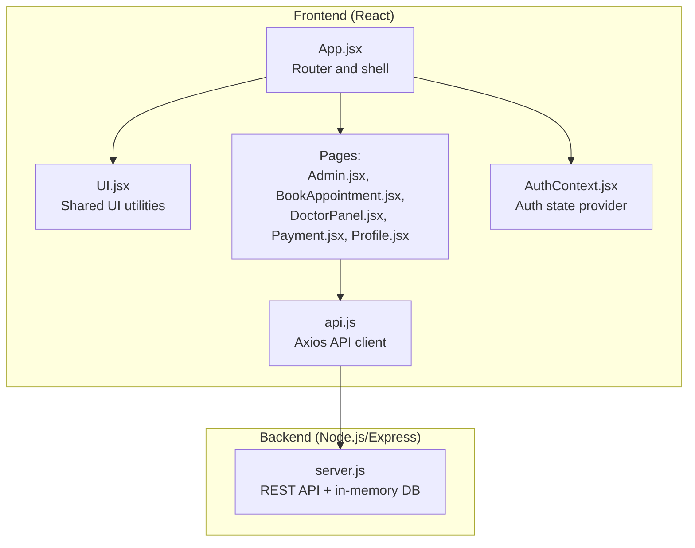
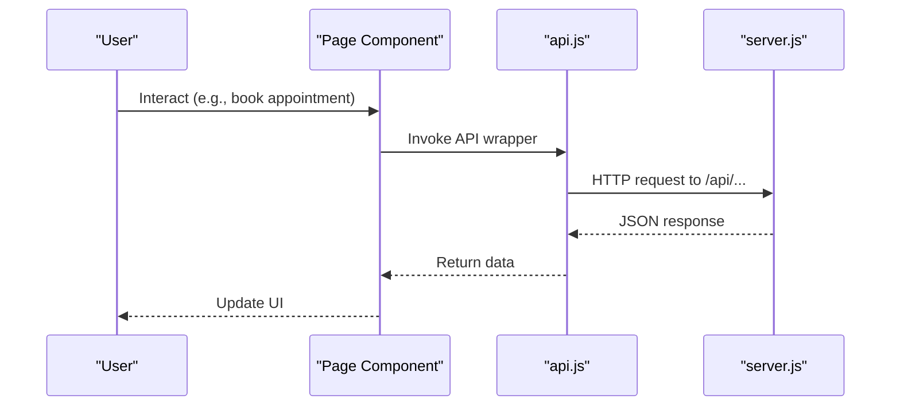
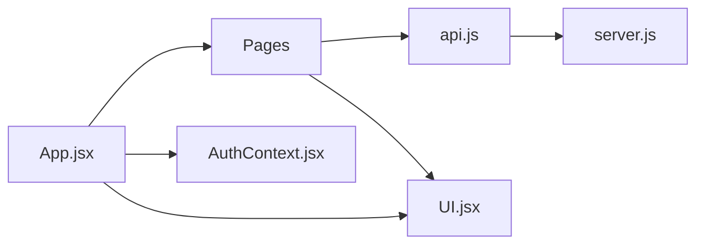

# Code Standards and Organization

<cite>
**Referenced Files in This Document**
- [README.md](file://README.md)
- [package.json](file://package.json)
- [App.jsx](file://App.jsx)
- [AuthContext.jsx](file://AuthContext.jsx)
- [UI.jsx](file://UI.jsx)
- [api.js](file://api.js)
- [server.js](file://server.js)
- [Admin.jsx](file://Admin.jsx)
- [BookAppointment.jsx](file://BookAppointment.jsx)
- [DoctorPanel.jsx](file://DoctorPanel.jsx)
- [Payment.jsx](file://Payment.jsx)
- [Profile.jsx](file://Profile.jsx)
</cite>

## Table of Contents
1. [Introduction](#introduction)
2. [Project Structure](#project-structure)
3. [Core Components](#core-components)
4. [Architecture Overview](#architecture-overview)
5. [Detailed Component Analysis](#detailed-component-analysis)
6. [Dependency Analysis](#dependency-analysis)
7. [Performance Considerations](#performance-considerations)
8. [Troubleshooting Guide](#troubleshooting-guide)
9. [Conclusion](#conclusion)
10. [Appendices](#appendices)

## Introduction
This document defines code standards and organizational conventions for the Doctor appointment booking system. It covers file structure conventions, JavaScript coding standards, React component development standards, Express.js server conventions, formatting and documentation practices, and examples from the existing codebase. The goal is to ensure readability, maintainability, and consistency across the team’s development efforts.

## Project Structure
The project follows a hybrid structure combining a single-page application front end and a Node.js/Express back end. The front end uses React with a centralized router and shared UI utilities. The back end exposes REST endpoints for authentication, doctor listings, appointments, reviews, payments, and administrative controls.

**Diagram sources**
- [App.jsx](file://App.jsx#L1-L44)
- [UI.jsx](file://UI.jsx#L1-L182)
- [api.js](file://api.js#L1-L44)
- [server.js](file://server.js#L1-L390)
- [Admin.jsx](file://Admin.jsx#L1-L194)
- [BookAppointment.jsx](file://BookAppointment.jsx#L1-L171)
- [DoctorPanel.jsx](file://DoctorPanel.jsx#L1-L96)
- [Payment.jsx](file://Payment.jsx#L1-L350)
- [Profile.jsx](file://Profile.jsx#L1-L97)

**Section sources**
- [README.md](file://README.md#L7-L33)
- [package.json](file://package.json#L1-L24)

## Core Components
- Frontend routing and layout: App.jsx orchestrates routing, authentication provider, and shared UI components.
- Authentication context: AuthContext.jsx centralizes JWT state, persistence, and theme switching.
- Shared UI utilities: UI.jsx provides reusable components (Navbar, BottomNav, ToastContainer, Spinner, Stars, ProbBar, Countdown, StatusBadge).
- API client: api.js exports typed wrappers for all backend endpoints.
- Pages: Feature-specific pages (Admin, BookAppointment, DoctorPanel, Payment, Profile) encapsulate page logic and UI.

Key conventions observed:
- File naming: PascalCase for React components (e.g., Admin.jsx), lowercase for utility modules (e.g., api.js).
- Component organization: Pages under a pages directory, shared UI under a components directory, and context under a context directory.
- Single responsibility: Each page focuses on a single feature domain.

**Section sources**
- [App.jsx](file://App.jsx#L1-L44)
- [AuthContext.jsx](file://AuthContext.jsx#L1-L41)
- [UI.jsx](file://UI.jsx#L1-L182)
- [api.js](file://api.js#L1-L44)
- [Admin.jsx](file://Admin.jsx#L1-L194)
- [BookAppointment.jsx](file://BookAppointment.jsx#L1-L171)
- [DoctorPanel.jsx](file://DoctorPanel.jsx#L1-L96)
- [Payment.jsx](file://Payment.jsx#L1-L350)
- [Profile.jsx](file://Profile.jsx#L1-L97)

## Architecture Overview
The system uses a thin client architecture:
- Frontend: React SPA with React Router for navigation and Axios for API communication.
- Backend: Express server with in-memory storage and JWT-based authentication middleware.
- Data flow: Pages call api.js functions, which delegate to axios endpoints mapped to server routes.

**Diagram sources**
- [App.jsx](file://App.jsx#L1-L44)
- [api.js](file://api.js#L1-L44)
- [server.js](file://server.js#L1-L390)
- [BookAppointment.jsx](file://BookAppointment.jsx#L39-L60)

## Detailed Component Analysis

### React Component Development Standards
- Functional components with hooks: Prefer functional components with useState, useEffect, and custom hooks.
- Context usage: Centralize cross-cutting concerns (auth, theme) in contexts; consume via dedicated hooks.
- Prop validation: Use TypeScript in future iterations; for JS, rely on defensive checks and comments.
- Composition: Break UI into small, composable utilities (UI.jsx) consumed by pages.
- State locality: Keep state local to the smallest component that needs it; lift only when necessary.

Examples from the codebase:
- Auth provider and consumer pattern: [AuthContext.jsx](file://AuthContext.jsx#L6-L41)
- Shared UI utilities: [UI.jsx](file://UI.jsx#L11-L25), [UI.jsx](file://UI.jsx#L97-L138), [UI.jsx](file://UI.jsx#L141-L176)
- Page composition: [Admin.jsx](file://Admin.jsx#L7-L44), [BookAppointment.jsx](file://BookAppointment.jsx#L7-L72), [DoctorPanel.jsx](file://DoctorPanel.jsx#L7-L33), [Payment.jsx](file://Payment.jsx#L23-L102), [Profile.jsx](file://Profile.jsx#L7-L42)

**Section sources**
- [AuthContext.jsx](file://AuthContext.jsx#L1-L41)
- [UI.jsx](file://UI.jsx#L1-L182)
- [Admin.jsx](file://Admin.jsx#L1-L194)
- [BookAppointment.jsx](file://BookAppointment.jsx#L1-L171)
- [DoctorPanel.jsx](file://DoctorPanel.jsx#L1-L96)
- [Payment.jsx](file://Payment.jsx#L1-L350)
- [Profile.jsx](file://Profile.jsx#L1-L97)

### Express.js Server Conventions
- Middleware-first design: Centralized CORS and JSON parsing; JWT verification middleware enforces roles.
- Endpoint grouping: Clear separation by domain (auth, doctors, appointments, admin, payments).
- Error handling: Consistent HTTP status codes and JSON error payloads; guarded against missing or invalid tokens.
- In-memory database: Structured as a plain object mirroring relational schema for demonstration.

Representative patterns:
- Auth routes: [server.js](file://server.js#L68-L110)
- Doctor routes: [server.js](file://server.js#L116-L164)
- Appointment routes: [server.js](file://server.js#L170-L217)
- Admin routes: [server.js](file://server.js#L244-L280)
- Payment routes: [server.js](file://server.js#L298-L377)
- Middleware: [server.js](file://server.js#L49-L62)

**Section sources**
- [server.js](file://server.js#L1-L390)

### API Client Standards
- Centralized base URL and headers: api.js configures axios defaults and exports typed functions per endpoint.
- Cohesion: Group related endpoints (auth, doctors, appointments, admin, payments) into logical blocks.

Example patterns:
- Auth wrappers: [api.js](file://api.js#L6-L9)
- Doctor wrappers: [api.js](file://api.js#L11-L14)
- Appointment wrappers: [api.js](file://api.js#L16-L19)
- Admin wrappers: [api.js](file://api.js#L29-L35)
- Payment wrappers: [api.js](file://api.js#L40-L43)

**Section sources**
- [api.js](file://api.js#L1-L44)

### File Naming and Organization Conventions
- React components: PascalCase (e.g., Admin.jsx, BookAppointment.jsx, DoctorPanel.jsx, Payment.jsx, Profile.jsx).
- Utility modules: lowercase with descriptive names (e.g., api.js, AuthContext.jsx, UI.jsx).
- Directory structure: pages for routeable screens, components for shared UI, context for providers.

Evidence:
- Component files: [Admin.jsx](file://Admin.jsx#L1-L194), [BookAppointment.jsx](file://BookAppointment.jsx#L1-L171), [DoctorPanel.jsx](file://DoctorPanel.jsx#L1-L96), [Payment.jsx](file://Payment.jsx#L1-L350), [Profile.jsx](file://Profile.jsx#L1-L97)
- Shared utilities: [AuthContext.jsx](file://AuthContext.jsx#L1-L41), [UI.jsx](file://UI.jsx#L1-L182)
- API client: [api.js](file://api.js#L1-L44)

**Section sources**
- [README.md](file://README.md#L7-L33)
- [Admin.jsx](file://Admin.jsx#L1-L194)
- [BookAppointment.jsx](file://BookAppointment.jsx#L1-L171)
- [DoctorPanel.jsx](file://DoctorPanel.jsx#L1-L96)
- [Payment.jsx](file://Payment.jsx#L1-L350)
- [Profile.jsx](file://Profile.jsx#L1-L97)
- [AuthContext.jsx](file://AuthContext.jsx#L1-L41)
- [UI.jsx](file://UI.jsx#L1-L182)
- [api.js](file://api.js#L1-L44)

### JavaScript Coding Standards
- ES6+ syntax: Use const/let, arrow functions, destructuring, template literals, and spread/rest operators.
- Function declarations: Prefer function expressions for module exports; keep pure functions for helpers.
- Imports/exports: Use named exports for utilities and default export for components; group external and internal imports.
- Comments: Inline comments explain non-obvious logic; avoid redundant comments for self-explanatory code.

Examples:
- Destructuring and constants: [App.jsx](file://App.jsx#L1-L13)
- Arrow functions and template literals: [AuthContext.jsx](file://AuthContext.jsx#L21-L25)
- Named exports: [api.js](file://api.js#L6-L43)
- Inline comments: [server.js](file://server.js#L298-L316)

**Section sources**
- [App.jsx](file://App.jsx#L1-L44)
- [AuthContext.jsx](file://AuthContext.jsx#L1-L41)
- [api.js](file://api.js#L1-L44)
- [server.js](file://server.js#L1-L390)

### React Hook Usage Guidelines
- useState: Manage local UI state (e.g., form inputs, loading flags).
- useEffect: Encapsulate side effects (e.g., fetching data, setting up intervals).
- Custom hooks: Extract reusable logic into hooks (e.g., useAuth, useToast).
- useCallback: Memoize callbacks passed to child components to prevent unnecessary re-renders.

Examples:
- Local state and effects: [BookAppointment.jsx](file://BookAppointment.jsx#L13-L37), [Payment.jsx](file://Payment.jsx#L32-L55)
- Custom hooks: [AuthContext.jsx](file://AuthContext.jsx#L40-L41), [UI.jsx](file://UI.jsx#L7-L9)
- Callback memoization: [UI.jsx](file://UI.jsx#L13-L17)

**Section sources**
- [BookAppointment.jsx](file://BookAppointment.jsx#L1-L171)
- [Payment.jsx](file://Payment.jsx#L1-L350)
- [AuthContext.jsx](file://AuthContext.jsx#L1-L41)
- [UI.jsx](file://UI.jsx#L1-L182)

### Component Composition Principles
- Presentational vs. container: Pages orchestrate data and UI; shared UI utilities remain presentational.
- Props: Pass minimal props; derive derived data inside components when appropriate.
- Children composition: Providers wrap the app shell; pages render within the shared layout.

Examples:
- Provider wrapping: [App.jsx](file://App.jsx#L17-L41)
- Page composition: [Admin.jsx](file://Admin.jsx#L47-L192), [BookAppointment.jsx](file://BookAppointment.jsx#L76-L169), [DoctorPanel.jsx](file://DoctorPanel.jsx#L35-L94), [Payment.jsx](file://Payment.jsx#L104-L295), [Profile.jsx](file://Profile.jsx#L44-L95)

**Section sources**
- [App.jsx](file://App.jsx#L1-L44)
- [Admin.jsx](file://Admin.jsx#L1-L194)
- [BookAppointment.jsx](file://BookAppointment.jsx#L1-L171)
- [DoctorPanel.jsx](file://DoctorPanel.jsx#L1-L96)
- [Payment.jsx](file://Payment.jsx#L1-L350)
- [Profile.jsx](file://Profile.jsx#L1-L97)

### Express Route Organization and Middleware
- Route grouping: Organize endpoints by domain (auth, doctors, appointments, admin, payments).
- Middleware: Centralize CORS, JSON parsing, and JWT verification; enforce role-based access.
- Error handling: Return structured errors with appropriate HTTP status codes.

Patterns:
- Auth routes: [server.js](file://server.js#L68-L110)
- Doctor routes: [server.js](file://server.js#L116-L164)
- Appointment routes: [server.js](file://server.js#L170-L217)
- Admin routes: [server.js](file://server.js#L244-L280)
- Payment routes: [server.js](file://server.js#L298-L377)
- Middleware: [server.js](file://server.js#L22-L24), [server.js](file://server.js#L49-L62)

**Section sources**
- [server.js](file://server.js#L1-L390)

### API Endpoint Design
- RESTful paths: Use plural nouns for collections, resource IDs for single resources.
- HTTP verbs: GET for retrieval, POST for creation, PATCH for partial updates, DELETE for removal.
- Status codes: 200 OK, 201 Created, 400 Bad Request, 401 Unauthorized, 403 Forbidden, 404 Not Found, 409 Conflict, 500 Internal Server Error.

Examples:
- Create appointment: [server.js](file://server.js#L170-L202)
- Update appointment status: [server.js](file://server.js#L144-L153)
- Admin update appointment: [server.js](file://server.js#L267-L272)
- Payment simulation: [server.js](file://server.js#L319-L353)

**Section sources**
- [server.js](file://server.js#L1-L390)

### Code Formatting and Comment Standards
- Formatting: Use consistent indentation and spacing; align JSX attributes for readability.
- Comments: Add concise comments for complex logic or non-obvious decisions; avoid over-commenting.

Examples:
- Indented JSX: [App.jsx](file://App.jsx#L16-L42)
- Inline comments: [server.js](file://server.js#L298-L316)

**Section sources**
- [App.jsx](file://App.jsx#L1-L44)
- [server.js](file://server.js#L1-L390)

### Documentation Practices
- README: Provides project overview, structure, setup, features, and schema.
- In-code comments: Brief explanations for complex logic or middleware behavior.

**Section sources**
- [README.md](file://README.md#L1-L159)

## Dependency Analysis
The frontend depends on shared UI utilities and a centralized API client. The API client depends on the backend server. Pages depend on the API client and shared UI utilities.

**Diagram sources**
- [App.jsx](file://App.jsx#L1-L44)
- [UI.jsx](file://UI.jsx#L1-L182)
- [api.js](file://api.js#L1-L44)
- [server.js](file://server.js#L1-L390)
- [Admin.jsx](file://Admin.jsx#L1-L194)
- [BookAppointment.jsx](file://BookAppointment.jsx#L1-L171)
- [DoctorPanel.jsx](file://DoctorPanel.jsx#L1-L96)
- [Payment.jsx](file://Payment.jsx#L1-L350)
- [Profile.jsx](file://Profile.jsx#L1-L97)

**Section sources**
- [App.jsx](file://App.jsx#L1-L44)
- [api.js](file://api.js#L1-L44)
- [server.js](file://server.js#L1-L390)

## Performance Considerations
- Minimize re-renders: Use useCallback and useMemo for expensive computations or callback props.
- Lazy loading: Consider code-splitting for large pages.
- Efficient state updates: Batch state updates and avoid unnecessary deep copies.
- Network efficiency: Debounce search/filter inputs; cache small datasets in memory where appropriate.

## Troubleshooting Guide
Common issues and resolutions:
- Authentication failures: Verify JWT presence and validity; check middleware logic and token storage.
- Endpoint errors: Inspect HTTP status codes and error messages returned by the server.
- UI state inconsistencies: Ensure proper cleanup of intervals and subscriptions in useEffect.

References:
- Auth middleware: [server.js](file://server.js#L49-L62)
- Error responses: [server.js](file://server.js#L70-L80), [server.js](file://server.js#L147-L153), [server.js](file://server.js#L313-L315)

**Section sources**
- [server.js](file://server.js#L1-L390)

## Conclusion
The Doctor appointment booking system demonstrates clean separation of concerns with a React front end and Express back end. Adhering to the standards outlined here will improve consistency, readability, and maintainability across the codebase. Team members should follow the established conventions for file naming, component composition, API design, and error handling.

## Appendices
- Example of a well-structured page: [Admin.jsx](file://Admin.jsx#L7-L44)
- Example of a well-structured component: [UI.jsx](file://UI.jsx#L97-L138)
- Example of a well-structured API module: [api.js](file://api.js#L6-L43)
- Example of a well-structured server route: [server.js](file://server.js#L170-L202)