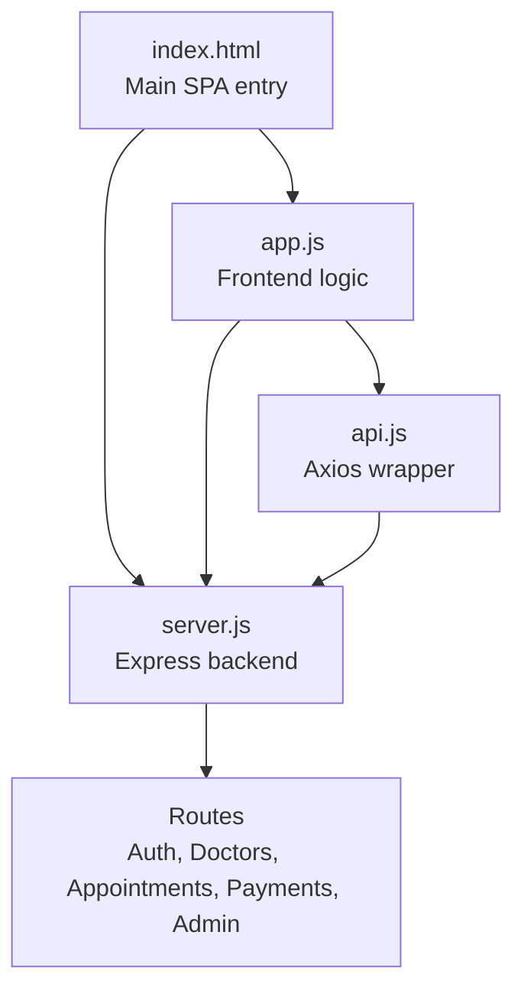
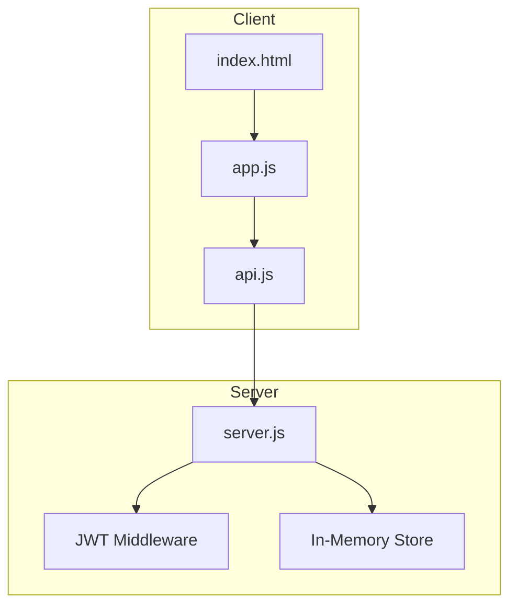

# Deployment Procedures

<cite>
**Referenced Files in This Document**
- [package.json](file://package.json)
- [server.js](file://server.js)
- [index.html](file://index.html)
- [app.js](file://app.js)
- [api.js](file://api.js)
- [AuthContext.jsx](file://AuthContext.jsx)
- [README.md](file://README.md)
- [API_REFERENCE.md](file://API_REFERENCE.md)
</cite>

## Table of Contents
1. [Introduction](#introduction)
2. [Project Structure](#project-structure)
3. [Core Components](#core-components)
4. [Architecture Overview](#architecture-overview)
5. [Development Environment Setup](#development-environment-setup)
6. [Staging Deployment](#staging-deployment)
7. [Production Deployment](#production-deployment)
8. [Containerization with Docker](#containerization-with-docker)
9. [CI/CD Pipeline Configuration](#cicd-pipeline-configuration)
10. [Environment-Specific Configurations](#environment-specific-configurations)
11. [Secrets Management](#secrets-management)
12. [Backup and Disaster Recovery](#backup-and-disaster-recovery)
13. [Performance Considerations](#performance-considerations)
14. [Troubleshooting Guide](#troubleshooting-guide)
15. [Rollback Procedures](#rollback-procedures)
16. [Conclusion](#conclusion)

## Introduction
This document provides end-to-end deployment procedures for the Doctor appointment booking system. It covers development environment setup, staging and production deployment, containerization, CI/CD configuration, environment-specific settings, secrets management, backups, disaster recovery, and rollback procedures. The system is a full-stack web application built with a Node.js/Express backend and a vanilla JavaScript single-page application frontend.

## Project Structure
The repository contains a compact full-stack application:
- Backend: Node.js/Express server exposing REST APIs
- Frontend: Single-page application served statically by the backend
- Shared configuration and deployment-related artifacts

**Diagram sources**
- [index.html](file://index.html#L1-L552)
- [app.js](file://app.js#L1-L800)
- [api.js](file://api.js#L1-L44)
- [server.js](file://server.js#L1-L390)

**Section sources**
- [README.md](file://README.md#L7-L33)
- [index.html](file://index.html#L1-L552)
- [server.js](file://server.js#L1-L390)

## Core Components
- Backend server: Express application with in-memory data store, JWT authentication middleware, and REST endpoints for authentication, doctor listings, appointments, payments, and admin operations.
- Frontend SPA: Single-page application that communicates with the backend via an Axios-based API wrapper.
- Static asset serving: The backend serves the frontend index.html for all non-API routes, enabling client-side routing.

Key runtime dependencies include Express, bcryptjs, jsonwebtoken, uuid, cors, and stripe (optional for payments).

**Section sources**
- [server.js](file://server.js#L1-L390)
- [api.js](file://api.js#L1-L44)
- [package.json](file://package.json#L1-L24)

## Architecture Overview
The system follows a classic client-server architecture:
- The browser loads index.html and executes app.js.
- app.js uses api.js to call server.js endpoints.
- server.js enforces JWT-based authentication and exposes CRUD endpoints backed by an in-memory store.

**Diagram sources**
- [index.html](file://index.html#L1-L552)
- [app.js](file://app.js#L1-L800)
- [api.js](file://api.js#L1-L44)
- [server.js](file://server.js#L49-L62)

## Development Environment Setup
Prerequisites:
- Node.js runtime installed
- npm package manager

Steps:
1. Install dependencies
   - Run npm install in the project root.
2. Start the backend server
   - The backend listens on the port defined by the PORT environment variable (default 5000).
3. Frontend behavior
   - The backend serves index.html for all non-API routes, enabling client-side routing.
4. Environment variables
   - JWT_SECRET: Secret key for signing JWT tokens (default provided in code).
   - STRIPE_SECRET_KEY: Stripe secret key for payment processing (optional; fallback behavior documented).

Debugging tips:
- Enable verbose logging by setting environment variables as needed.
- Use browser developer tools to inspect network requests and console logs.
- Verify CORS is enabled (already configured in server.js).

**Section sources**
- [README.md](file://README.md#L37-L54)
- [server.js](file://server.js#L13-L19)
- [API_REFERENCE.md](file://API_REFERENCE.md#L697-L702)

## Staging Deployment
Pre-production testing:
- Deploy the backend to a staging environment with the same in-memory store configuration for parity.
- Validate authentication flows, doctor listings, appointment booking, and payment simulation.
- Test admin dashboards and data consistency.

Environment configuration:
- Set environment variables for JWT_SECRET and STRIPE_SECRET_KEY (if integrating payments).
- Configure reverse proxy or load balancer to forward /api requests to the backend server.

Gradual rollout strategies:
- Canary release: Route a small percentage of traffic to the new staging instance.
- Blue-green deployment: Keep two identical environments and switch traffic upon validation.

Monitoring and rollforward:
- Monitor error rates, latency, and user acceptance tests.
- Roll forward only after confirming stability.

[No sources needed since this section provides general guidance]

## Production Deployment
Build processes:
- No separate build step is required; the backend serves static assets directly.
- Ensure dependencies are installed and the server is started via npm start.

Server configuration:
- Port: Default 5000; override via PORT environment variable.
- CORS: Enabled globally.
- Static serving: index.html served for all non-API routes.

SSL certificate setup:
- Place SSL certificates in your reverse proxy or load balancer.
- Terminate TLS at the proxy and route plain HTTP to the backend.

CDN integration:
- Serve static assets (CSS, JS) via CDN for improved performance.
- Ensure proper caching headers and origin pull configuration.

Scalability:
- Horizontal scaling: Run multiple backend instances behind a load balancer.
- Session affinity: Not required since JWT tokens are stateless.

[No sources needed since this section provides general guidance]

## Containerization with Docker
Image building:
- Create a minimal Docker image containing the Node.js runtime and application files.
- Copy package.json and install dependencies, then copy application code and set the start command to npm start.

Container orchestration:
- Use Docker Compose to define services for the backend and optional supporting services (e.g., a reverse proxy).
- Define environment variables for JWT_SECRET and STRIPE_SECRET_KEY via secrets or environment files.

Scaling considerations:
- Scale the backend service horizontally.
- Persist application logs and configure health checks.

[No sources needed since this section provides general guidance]

## CI/CD Pipeline Configuration
Automated testing integration:
- Add unit and integration tests to validate authentication, booking, and payment flows.
- Use npm test to execute tests in CI runners.

Deployment automation scripts:
- Use deployment scripts to build images, push to registry, and deploy to staging/production.
- Automate environment variable injection via CI secrets.

Pipeline stages:
- Build: Install dependencies and prepare artifacts.
- Test: Run automated tests.
- Deploy: Deploy to staging, run smoke tests, then promote to production.

[No sources needed since this section provides general guidance]

## Environment-Specific Configurations
Development:
- PORT=5000
- JWT_SECRET=dev-secret
- STRIPE_SECRET_KEY=sk_test_your_key (optional)

Staging:
- PORT=5000
- JWT_SECRET=staging-secret
- STRIPE_SECRET_KEY=sk_test_staging_key (optional)

Production:
- PORT=5000
- JWT_SECRET=strong-random-secret
- STRIPE_SECRET_KEY=sk_live_production_key

Reverse proxy configuration:
- Forward /api* to the backend server.
- Serve index.html for SPA routing fallback.

[No sources needed since this section provides general guidance]

## Secrets Management
Secrets to protect:
- JWT_SECRET: Used for signing and verifying tokens.
- STRIPE_SECRET_KEY: Used for payment processing (optional).

Management practices:
- Store secrets in environment variables managed by your platform or secrets manager.
- Never commit secrets to version control.
- Rotate secrets periodically and revoke compromised ones.

[No sources needed since this section provides general guidance]

## Backup and Disaster Recovery
Backup procedures:
- For in-memory store: Implement periodic snapshots or export endpoints to persist state externally.
- For production-grade deployments: Replace in-memory store with a persistent database and enable database backups.

Disaster recovery:
- Maintain multiple replicas across availability zones.
- Automate failover and restore procedures.
- Test recovery drills regularly.

[No sources needed since this section provides general guidance]

## Performance Considerations
Current limitations:
- In-memory store is suitable for development and small-scale usage but loses data on restarts.
- O(n) lookups for filtering/searching.

Recommendations:
- Replace in-memory store with a relational or document database.
- Add rate limiting, pagination, and indexing.
- Introduce caching for frequently accessed resources.

[No sources needed since this section provides general guidance]

## Troubleshooting Guide
Common issues:
- CORS errors: Ensure cors middleware is active (already configured).
- JWT token expired: Require users to re-authenticate.
- Payment service unavailable: Use payment simulation endpoint when Stripe is not configured.

Debug mode:
- Set JWT_SECRET and STRIPE_SECRET_KEY environment variables for explicit control during testing.

**Section sources**
- [API_REFERENCE.md](file://API_REFERENCE.md#L678-L702)
- [server.js](file://server.js#L22-L24)

## Rollback Procedures
Steps:
- Re-deploy the last known stable version.
- Switch traffic back to the previous healthy instance.
- Validate endpoints and user flows.
- Monitor metrics and user feedback before finalizing rollback.

[No sources needed since this section provides general guidance]

## Conclusion
This guide outlines a practical deployment strategy for the Doctor appointment booking system, covering development, staging, production, containerization, CI/CD, environment configuration, secrets management, backups, and rollback procedures. For production readiness, replace the in-memory store with a persistent database and implement robust monitoring, alerting, and security controls.