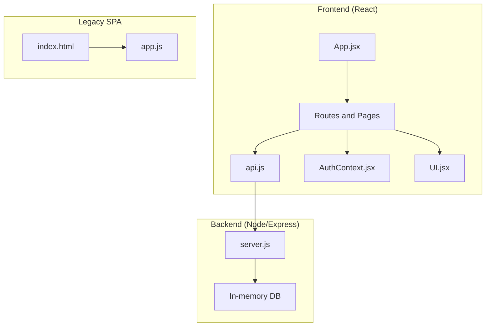
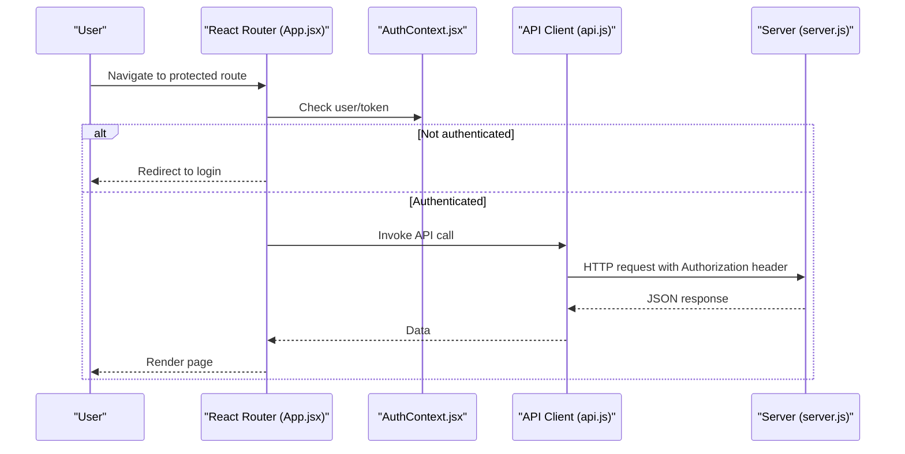
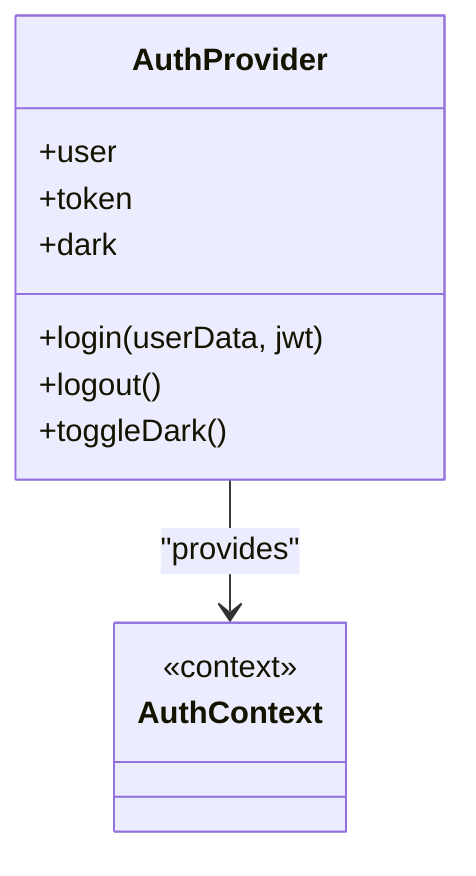
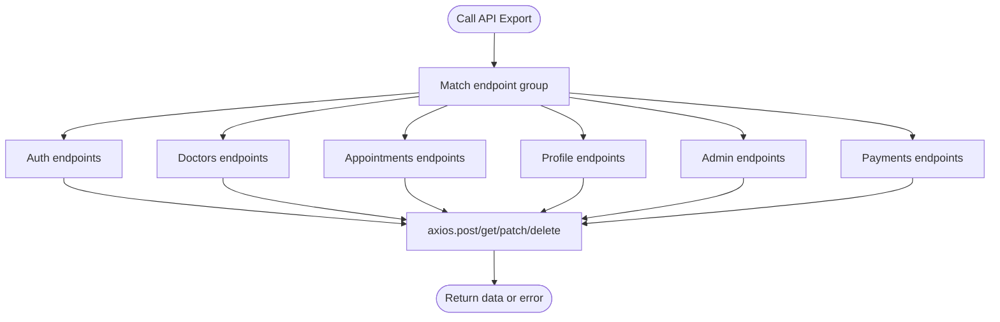
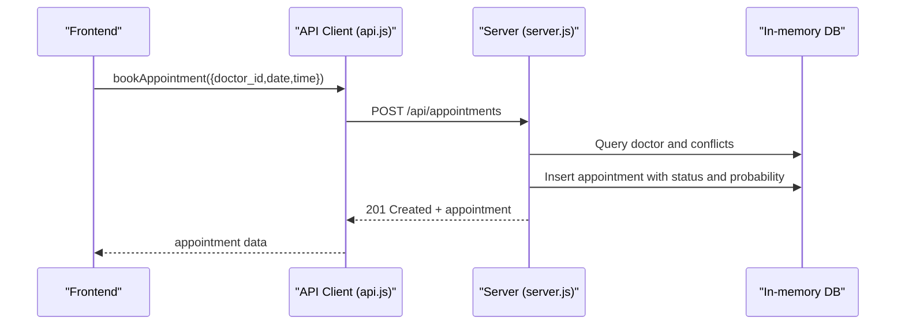
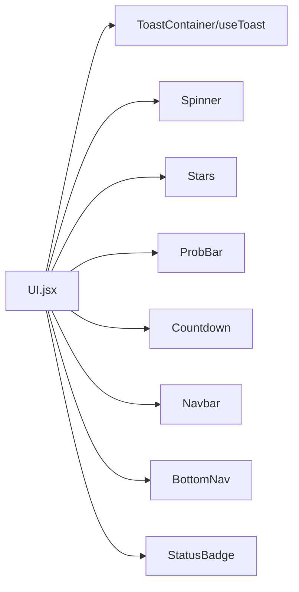
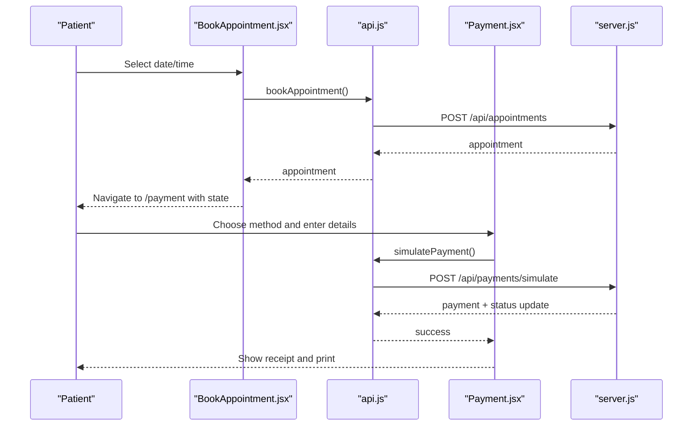
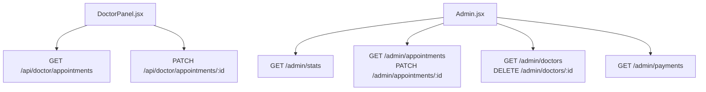
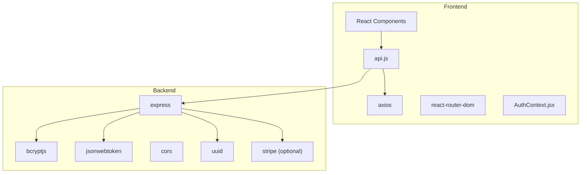

# Development Guidelines

<cite>
**Referenced Files in This Document**
- [README.md](file://README.md)
- [package.json](file://package.json)
- [App.jsx](file://App.jsx)
- [AuthContext.jsx](file://AuthContext.jsx)
- [UI.jsx](file://UI.jsx)
- [api.js](file://api.js)
- [server.js](file://server.js)
- [App.jsx](file://App.jsx)
- [BookAppointment.jsx](file://BookAppointment.jsx)
- [DoctorPanel.jsx](file://DoctorPanel.jsx)
- [Admin.jsx](file://Admin.jsx)
- [Profile.jsx](file://Profile.jsx)
- [Payment.jsx](file://Payment.jsx)
- [index.html](file://index.html)
- [app.js](file://app.js)
- [style.css](file://style.css)
</cite>

## Table of Contents
1. [Introduction](#introduction)
2. [Project Structure](#project-structure)
3. [Core Components](#core-components)
4. [Architecture Overview](#architecture-overview)
5. [Detailed Component Analysis](#detailed-component-analysis)
6. [Dependency Analysis](#dependency-analysis)
7. [Performance Considerations](#performance-considerations)
8. [Testing Strategies](#testing-strategies)
9. [Deployment Procedures](#deployment-procedures)
10. [Code Review and CI Practices](#code-review-and-ci-practices)
11. [Security Best Practices](#security-best-practices)
12. [Accessibility Compliance](#accessibility-compliance)
13. [Adding New Features and Maintaining Compatibility](#adding-new-features-and-maintaining-compatibility)
14. [Debugging, Logging, and Monitoring](#debugging-logging-and-monitoring)
15. [Team Collaboration and Version Control](#team-collaboration-and-version-control)
16. [Conclusion](#conclusion)

## Introduction
This document defines comprehensive development guidelines for the Doctor appointment booking system. It covers code organization, React component development, API design, testing, deployment, security, accessibility, and operational practices. The system currently consists of a React frontend and a Node.js/Express backend with an in-memory store, and a legacy HTML/JS single-page application that demonstrates routing and UI patterns.

## Project Structure
The repository follows a hybrid structure combining modern React with a legacy single-page application. The React application uses a conventional split into pages, components, and context. The backend exposes REST endpoints for authentication, doctor listings, appointments, payments, and admin operations. The legacy app.js and index.html demonstrate routing and UI rendering patterns that align with the React components.

**Diagram sources**
- [App.jsx](file://App.jsx#L1-L44)
- [api.js](file://api.js#L1-L44)
- [AuthContext.jsx](file://AuthContext.jsx#L1-L41)
- [UI.jsx](file://UI.jsx#L1-L182)
- [server.js](file://server.js#L1-L390)
- [index.html](file://index.html#L1-L531)
- [app.js](file://app.js#L1-L857)

**Section sources**
- [README.md](file://README.md#L7-L33)
- [App.jsx](file://App.jsx#L1-L44)
- [server.js](file://server.js#L1-L390)
- [index.html](file://index.html#L1-L531)
- [app.js](file://app.js#L1-L857)

## Core Components
- Application shell and routing: [App.jsx](file://App.jsx#L15-L43)
- Authentication state and persistence: [AuthContext.jsx](file://AuthContext.jsx#L6-L38)
- Shared UI primitives and navigation: [UI.jsx](file://UI.jsx#L11-L176)
- API client facade: [api.js](file://api.js#L3-L43)
- Backend server and endpoints: [server.js](file://server.js#L68-L377)
- Page components:
  - Booking flow: [BookAppointment.jsx](file://BookAppointment.jsx#L7-L170)
  - Doctor panel: [DoctorPanel.jsx](file://DoctorPanel.jsx#L7-L95)
  - Admin dashboard: [Admin.jsx](file://Admin.jsx#L7-L193)
  - Patient profile: [Profile.jsx](file://Profile.jsx#L7-L96)
  - Payment flow: [Payment.jsx](file://Payment.jsx#L23-L350)
- Legacy SPA entry points: [index.html](file://index.html#L1-L531), [app.js](file://app.js#L1-L857)

**Section sources**
- [App.jsx](file://App.jsx#L1-L44)
- [AuthContext.jsx](file://AuthContext.jsx#L1-L41)
- [UI.jsx](file://UI.jsx#L1-L182)
- [api.js](file://api.js#L1-L44)
- [server.js](file://server.js#L1-L390)
- [BookAppointment.jsx](file://BookAppointment.jsx#L1-L171)
- [DoctorPanel.jsx](file://DoctorPanel.jsx#L1-L96)
- [Admin.jsx](file://Admin.jsx#L1-L194)
- [Profile.jsx](file://Profile.jsx#L1-L97)
- [Payment.jsx](file://Payment.jsx#L1-L350)
- [index.html](file://index.html#L1-L531)
- [app.js](file://app.js#L1-L857)

## Architecture Overview
The system uses a thin-client React frontend communicating with a Node/Express backend via REST. Authentication relies on JWT tokens stored in local storage and attached to requests via Axios defaults. The backend maintains an in-memory database and exposes endpoints for all major features. The legacy SPA demonstrates similar patterns for routing and state management.

**Diagram sources**
- [App.jsx](file://App.jsx#L15-L43)
- [AuthContext.jsx](file://AuthContext.jsx#L6-L38)
- [api.js](file://api.js#L3-L43)
- [server.js](file://server.js#L49-L62)

**Section sources**
- [App.jsx](file://App.jsx#L1-L44)
- [AuthContext.jsx](file://AuthContext.jsx#L1-L41)
- [api.js](file://api.js#L1-L44)
- [server.js](file://server.js#L1-L390)

## Detailed Component Analysis

### Authentication and State Management
- Centralized auth state and persistence in a context provider with token injection into Axios defaults.
- Dark mode preference persisted in local storage and applied via a theme attribute.
- Provider exposes login/logout and theme toggling.

**Diagram sources**
- [AuthContext.jsx](file://AuthContext.jsx#L6-L38)

**Section sources**
- [AuthContext.jsx](file://AuthContext.jsx#L1-L41)

### API Client and Endpoint Contracts
- Centralized API client with typed exports for all domain operations.
- Endpoints cover auth, doctors, appointments, profiles, admin, and payments.

**Diagram sources**
- [api.js](file://api.js#L5-L43)

**Section sources**
- [api.js](file://api.js#L1-L44)

### Backend Endpoints and Validation
- Authentication endpoints with field validation and bcrypt password hashing.
- Doctor listing with filtering and individual retrieval.
- Appointment creation with conflict checks and probability calculation.
- Payment simulation with validation and status updates.
- Admin dashboards for stats, management, and reporting.

**Diagram sources**
- [api.js](file://api.js#L17-L19)
- [server.js](file://server.js#L170-L202)

**Section sources**
- [server.js](file://server.js#L68-L377)
- [api.js](file://api.js#L16-L20)

### UI Primitives and Navigation
- Toast container and hook for notifications.
- Spinner, stars, probability bar, countdown timer, badges, and navigation bars.
- Mobile-first bottom navigation tailored per role.

**Diagram sources**
- [UI.jsx](file://UI.jsx#L11-L176)

**Section sources**
- [UI.jsx](file://UI.jsx#L1-L182)

### Booking and Payment Workflows
- Booking page fetches doctor details, selects date/slot, computes probability, and navigates to payment.
- Payment page supports multiple methods, client-side validation, and a success flow with receipt printing.

**Diagram sources**
- [BookAppointment.jsx](file://BookAppointment.jsx#L39-L60)
- [Payment.jsx](file://Payment.jsx#L62-L98)
- [api.js](file://api.js#L39-L43)
- [server.js](file://server.js#L318-L353)

**Section sources**
- [BookAppointment.jsx](file://BookAppointment.jsx#L1-L171)
- [Payment.jsx](file://Payment.jsx#L1-L350)
- [api.js](file://api.js#L1-L44)
- [server.js](file://server.js#L282-L377)

### Admin and Doctor Panels
- Doctor panel filters and updates appointment statuses.
- Admin dashboard aggregates stats, manages appointments, patients, and doctors, and views payments.

**Diagram sources**
- [DoctorPanel.jsx](file://DoctorPanel.jsx#L15-L28)
- [Admin.jsx](file://Admin.jsx#L19-L41)
- [server.js](file://server.js#L133-L280)

**Section sources**
- [DoctorPanel.jsx](file://DoctorPanel.jsx#L1-L96)
- [Admin.jsx](file://Admin.jsx#L1-L194)
- [server.js](file://server.js#L112-L280)

## Dependency Analysis
- Frontend dependencies include React, react-router-dom, axios, and UI libraries.
- Backend depends on Express, bcryptjs, jsonwebtoken, cors, uuid, and optional stripe.
- The API client encapsulates base URL and exports cohesive functions per domain.

**Diagram sources**
- [package.json](file://package.json#L14-L22)
- [api.js](file://api.js#L1-L3)
- [server.js](file://server.js#L5-L21)

**Section sources**
- [package.json](file://package.json#L1-L24)
- [api.js](file://api.js#L1-L4)
- [server.js](file://server.js#L1-L30)

## Performance Considerations
- Minimize re-renders by using local state and avoiding unnecessary prop drilling (context for auth).
- Debounce or batch UI updates for forms and filters.
- Lazy-load heavy components and images.
- Use efficient list rendering with stable keys and virtualization for large lists.
- Cache API responses where appropriate and invalidate on mutations.
- Optimize rendering of countdown timers and probability bars with minimal updates.

## Testing Strategies
- Unit tests
  - React: Jest + React Testing Library for components, hooks, and context.
  - Node: Jest for server endpoints, middleware, and utilities.
- Integration tests
  - End-to-end API coverage for auth, CRUD, and workflows.
  - Component integration tests verifying context and API interactions.
- End-to-end tests
  - Playwright/Cypress to automate user journeys (booking, payment, admin actions).
- Test data
  - Use in-memory DB snapshots or factories for deterministic tests.
- Coverage
  - Aim for high coverage of critical paths, error branches, and edge cases.

## Deployment Procedures
- Local development
  - Frontend: npm start on port 3000.
  - Backend: npm start on port 5000.
- Staging
  - Containerize backend with environment variables for JWT secret and Stripe key.
  - Serve static React build via backend or CDN.
- Production
  - Environment variables: JWT_SECRET, STRIPE_SECRET_KEY, PORT.
  - HTTPS termination at reverse proxy or CDN.
  - Health checks and readiness probes.
  - Database migration to persistent storage (MySQL/MongoDB) before production.

## Code Review and CI Practices
- Pull request template
  - Summary, changes, testing notes, breaking changes, and screenshots for UI.
- Linting and formatting
  - ESLint (React recommended rules), Prettier, husky/pre-commit hooks.
- CI pipeline
  - Lint, unit tests, integration tests, and build verification.
  - Security scanning for dependencies.
  - Automated deployment to staging and manual promotion to production.

## Security Best Practices
- Authentication
  - Enforce HTTPS, secure cookies, CSRF protection, and short-lived tokens.
  - Validate and sanitize all inputs; enforce strong password policies.
- Authorization
  - Role-based access control (RBAC) with middleware enforcing roles.
- Data protection
  - Hash secrets, avoid logging sensitive data, encrypt at rest.
- Dependencies
  - Keep packages updated; monitor advisories; use audit and lockfiles.

## Accessibility Compliance
- Semantic HTML and ARIA roles where custom components are used.
- Keyboard navigation and focus management.
- Sufficient color contrast and scalable text.
- Screen reader support for dynamic content and modals.
- Alt text for icons and images.

## Adding New Features and Maintaining Compatibility
- Feature branches with small, focused commits.
- Backward-compatible API design: version endpoints or deprecation notices.
- Extending UI: add new components under components/ and pages/, export from api.js.
- Migration strategy: introduce new endpoints, keep old ones, and deprecate after a grace period.

## Debugging, Logging, and Monitoring
- Frontend
  - Console logging, React DevTools, network tab inspection.
  - Error boundaries and global error handlers.
- Backend
  - Structured logs with timestamps, correlation IDs, and levels.
  - Metrics: request latency, error rates, throughput.
- Observability
  - Centralized logging and alerting.
  - Tracing for end-to-end request flows.

## Team Collaboration and Version Control
- Git workflow
  - Feature branches merged via pull requests with approvals.
  - Commit messages: present tense, imperative, concise.
- Code ownership
  - Define owners for core modules (auth, booking, payments).
- Documentation
  - Keep README updated with setup, API docs, and contribution guidelines.

## Conclusion
These guidelines establish a consistent, secure, and maintainable development process for the Doctor appointment booking system. They emphasize modular React architecture, robust API design, comprehensive testing, and operational excellence across environments.