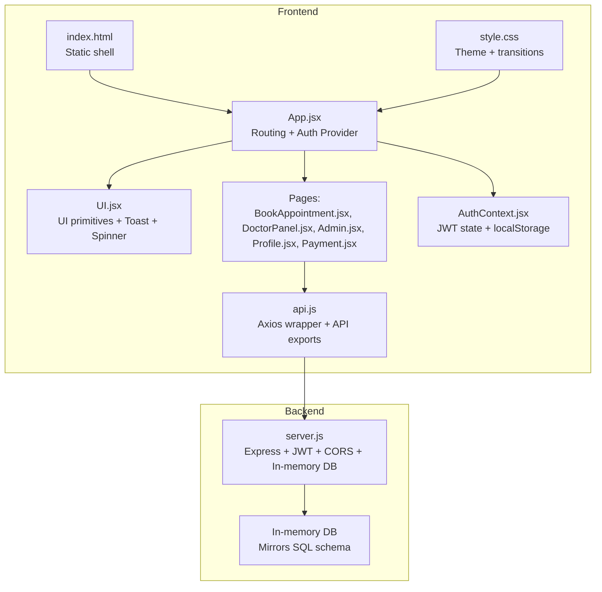
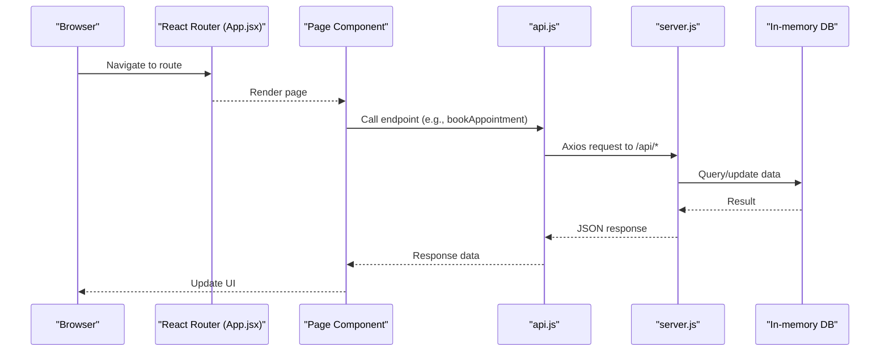
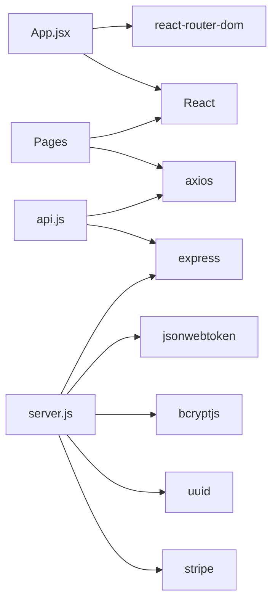

# Performance Optimization

<cite>
**Referenced Files in This Document**
- [README.md](file://README.md)
- [package.json](file://package.json)
- [App.jsx](file://App.jsx)
- [AuthContext.jsx](file://AuthContext.jsx)
- [api.js](file://api.js)
- [server.js](file://server.js)
- [UI.jsx](file://UI.jsx)
- [BookAppointment.jsx](file://BookAppointment.jsx)
- [DoctorPanel.jsx](file://DoctorPanel.jsx)
- [Admin.jsx](file://Admin.jsx)
- [Profile.jsx](file://Profile.jsx)
- [Payment.jsx](file://Payment.jsx)
- [style.css](file://style.css)
- [index.html](file://index.html)
- [data.js](file://data.js)
</cite>

## Table of Contents
1. [Introduction](#introduction)
2. [Project Structure](#project-structure)
3. [Core Components](#core-components)
4. [Architecture Overview](#architecture-overview)
5. [Detailed Component Analysis](#detailed-component-analysis)
6. [Dependency Analysis](#dependency-analysis)
7. [Performance Considerations](#performance-considerations)
8. [Troubleshooting Guide](#troubleshooting-guide)
9. [Conclusion](#conclusion)
10. [Appendices](#appendices)

## Introduction
This document provides a comprehensive performance optimization guide for the Doctor appointment booking system. It covers frontend optimization (React component optimization, bundle size reduction, lazy loading, memory management), backend improvements (database query optimization, caching, load balancing, response time), network optimization (API call efficiency, data fetching patterns, real-time communication), monitoring and profiling, critical rendering path optimization, re-render minimization, user experience metrics, scalability, resource management, performance budgets, and testing/benchmarking methodologies.

## Project Structure
The system is a full-stack application with a React frontend and a Node.js/Express backend. The frontend uses a single-page application architecture with React Router for navigation and a centralized AuthContext for authentication state. The backend exposes REST endpoints for authentication, doctor listings, appointments, payments, and administrative functions. Styling is handled via a single stylesheet with theme support.

**Diagram sources**
- [App.jsx](file://App.jsx#L1-L44)
- [AuthContext.jsx](file://AuthContext.jsx#L1-L41)
- [api.js](file://api.js#L1-L44)
- [server.js](file://server.js#L1-L390)
- [style.css](file://style.css#L1-L200)
- [index.html](file://index.html#L1-L552)

**Section sources**
- [README.md](file://README.md#L1-L159)
- [package.json](file://package.json#L1-L24)
- [App.jsx](file://App.jsx#L1-L44)
- [AuthContext.jsx](file://AuthContext.jsx#L1-L41)
- [api.js](file://api.js#L1-L44)
- [server.js](file://server.js#L1-L390)
- [style.css](file://style.css#L1-L200)
- [index.html](file://index.html#L1-L552)

## Core Components
- Routing and Shell: App.jsx orchestrates routing, layout, and global UI elements.
- Authentication: AuthContext manages JWT tokens, user state, and persists preferences to localStorage.
- API Layer: api.js centralizes HTTP calls to backend endpoints.
- UI Primitives: UI.jsx provides reusable components (toasts, spinners, stars, probability bar, countdown, badges, navbar, bottom nav).
- Pages:
  - BookAppointment.jsx: Doctor selection, slot selection, booking flow, review submission.
  - DoctorPanel.jsx: Doctor dashboard with filtering and status updates.
  - Admin.jsx: Admin overview, stats, and management panels.
  - Profile.jsx: Patient profile editing.
  - Payment.jsx: Multi-method payment flow with simulated processing.
- Backend: server.js implements REST endpoints, middleware, and in-memory storage.

Key performance levers:
- Centralized API client reduces duplication and enables caching.
- UI primitives encapsulate rendering logic and reduce repeated DOM work.
- Single-page navigation avoids full-page reloads.

**Section sources**
- [App.jsx](file://App.jsx#L1-L44)
- [AuthContext.jsx](file://AuthContext.jsx#L1-L41)
- [api.js](file://api.js#L1-L44)
- [UI.jsx](file://UI.jsx#L1-L182)
- [BookAppointment.jsx](file://BookAppointment.jsx#L1-L171)
- [DoctorPanel.jsx](file://DoctorPanel.jsx#L1-L96)
- [Admin.jsx](file://Admin.jsx#L1-L194)
- [Profile.jsx](file://Profile.jsx#L1-L97)
- [Payment.jsx](file://Payment.jsx#L1-L350)
- [server.js](file://server.js#L1-L390)

## Architecture Overview
The frontend communicates with the backend via REST endpoints. Authentication relies on JWT tokens propagated via Authorization headers. The backend performs in-memory operations and serves static assets.

**Diagram sources**
- [App.jsx](file://App.jsx#L1-L44)
- [api.js](file://api.js#L1-L44)
- [server.js](file://server.js#L1-L390)

## Detailed Component Analysis

### Frontend Performance: React Component Optimization
- Minimize unnecessary renders:
  - Use stable references for callbacks and handlers to avoid prop drift.
  - Prefer memoization for expensive computations and derived data.
  - Keep state local to the smallest scope necessary.
- Optimize lists:
  - Ensure unique keys for list items to enable efficient reconciliation.
  - Virtualize long lists if applicable.
- Event handling:
  - Attach event listeners efficiently; avoid inline function creation in render.
- Conditional rendering:
  - Defer heavy components until needed.
- Image and asset optimization:
  - Preload critical fonts and defer non-critical resources.
  - Compress and reuse icons and illustrations.

Practical guidance for current components:
- AuthContext: Token and user state updates trigger axios defaults; ensure minimal re-renders by avoiding redundant providers.
- UI.jsx: ToastContainer maintains a small state; ensure timeouts are cleared properly to prevent lingering nodes.
- BookAppointment.jsx: Uses local state for form inputs; consider debouncing or batching updates for large forms.
- DoctorPanel.jsx and Admin.jsx: Fetch data on mount; consider caching and optimistic updates for smoother UX.
- Payment.jsx: Multi-step wizard with conditional rendering; ensure steps unmount unused DOM nodes.

**Section sources**
- [AuthContext.jsx](file://AuthContext.jsx#L1-L41)
- [UI.jsx](file://UI.jsx#L1-L182)
- [BookAppointment.jsx](file://BookAppointment.jsx#L1-L171)
- [DoctorPanel.jsx](file://DoctorPanel.jsx#L1-L96)
- [Admin.jsx](file://Admin.jsx#L1-L194)
- [Payment.jsx](file://Payment.jsx#L1-L350)

### Frontend Performance: Bundle Size Reduction and Lazy Loading
- Code splitting:
  - Split routes into separate chunks using dynamic imports per route.
  - Lazy-load heavy components (e.g., Payment) only when needed.
- Tree shaking:
  - Remove unused imports and rely on ES modules.
- External libraries:
  - Audit axios usage; consolidate to a single instance.
  - Avoid duplicate polyfills or large dependencies.
- Build optimization:
  - Enable production builds with minification and dead-code elimination.
  - Analyze bundle composition to identify large dependencies.

Current state:
- Single-page app with route-based rendering; dynamic imports can be introduced at route level.
- api.js consolidates endpoints; consider further modularization if routes grow.

**Section sources**
- [App.jsx](file://App.jsx#L1-L44)
- [api.js](file://api.js#L1-L44)

### Frontend Performance: Memory Management
- Cleanup timers and intervals:
  - UI.jsx Countdown component sets intervals; ensure cleanup on unmount.
- Clear timeouts:
  - ToastContainer clears toasts after a delay; ensure removal on unmount.
- Avoid memory leaks:
  - Do not store large arrays or objects in global state.
  - Dispose of event listeners and subscriptions.

**Section sources**
- [UI.jsx](file://UI.jsx#L61-L86)
- [UI.jsx](file://UI.jsx#L11-L25)

### Backend Performance: Database Query Optimization
- Current implementation:
  - In-memory arrays are searched linearly; operations scale O(n).
  - Filtering and mapping occur on the server for each request.
- Optimization opportunities:
  - Normalize queries with indexing-like structures (e.g., maps keyed by ID).
  - Batch operations to reduce repeated scans.
  - Limit result sets and paginate when appropriate.
  - Cache frequently accessed data (e.g., doctor lists) with TTL.

**Section sources**
- [server.js](file://server.js#L29-L44)
- [server.js](file://server.js#L117-L123)
- [server.js](file://server.js#L134-L142)
- [server.js](file://server.js#L204-L208)

### Backend Performance: Caching Strategies
- Application-level caching:
  - Cache doctor lists and static data with short TTLs.
  - Invalidate cache on write operations (e.g., appointment updates).
- Response caching:
  - Use ETag/Last-Modified headers for GET endpoints.
  - Leverage CDN for static assets.
- Redis/Memcached:
  - Introduce caching for high-frequency reads (e.g., /api/doctors).

**Section sources**
- [server.js](file://server.js#L22-L24)

### Backend Performance: Load Balancing and Scaling
- Horizontal scaling:
  - Stateless backend allows easy replication behind a load balancer.
- Health checks:
  - Add readiness/liveness probes.
- Rate limiting:
  - Protect endpoints from abuse (e.g., booking).
- Asynchronous tasks:
  - Offload non-critical work (e.g., notifications) to background workers.

[No sources needed since this section provides general guidance]

### Backend Performance: Server Response Time Optimization
- Middleware:
  - Keep CORS and JSON parsing lightweight.
- Endpoint design:
  - Return only required fields (projection).
  - Avoid N+1 queries by precomputing related data.
- Compression:
  - Enable gzip/deflate for responses.
- Concurrency:
  - Tune Node.js worker threads and cluster mode if needed.

**Section sources**
- [server.js](file://server.js#L22-L24)

### Network Optimization: API Call Efficiency and Data Fetching Patterns
- Centralized client:
  - api.js wraps axios; configure base URL and interceptors for retries and timeouts.
- Interceptors:
  - Add request/response logging and retry logic for transient failures.
- Request deduplication:
  - Debounce rapid requests (e.g., search).
- Pagination and filtering:
  - Support server-side pagination and filters to limit payload sizes.
- Real-time updates:
  - Consider WebSockets or Server-Sent Events for live status updates (e.g., appointment approvals).

**Section sources**
- [api.js](file://api.js#L1-L44)
- [server.js](file://server.js#L117-L123)

### Monitoring and Profiling
- Frontend:
  - Use browser devtools (Performance, Memory, Lighthouse).
  - Instrument API calls with timing metrics.
  - Track Core Web Vitals (LCP, FID, CLS).
- Backend:
  - Monitor response times, error rates, and throughput.
  - Use APM tools (e.g., profiling Node.js processes).
- Observability:
  - Structured logs with correlation IDs.
  - Metrics for endpoint latency and cache hit ratios.

[No sources needed since this section provides general guidance]

### Critical Rendering Path and UX Metrics
- Critical CSS and fonts:
  - Inline critical CSS; preload fonts.
- Deferred loading:
  - Defer non-critical JavaScript and images.
- UX metrics:
  - Target sub-200ms TTFB, <100ms FID, and LCP <2.5s.
  - Use service workers for caching and offline readiness.

**Section sources**
- [style.css](file://style.css#L1-L200)
- [index.html](file://index.html#L1-L552)

## Dependency Analysis
The frontend depends on React, React Router, and a centralized API client. The backend depends on Express, JWT, bcrypt, UUID, and Stripe (optional). There is a tight coupling between API endpoints and page components.

**Diagram sources**
- [App.jsx](file://App.jsx#L1-L44)
- [api.js](file://api.js#L1-L44)
- [server.js](file://server.js#L1-L390)
- [package.json](file://package.json#L14-L22)

**Section sources**
- [package.json](file://package.json#L14-L22)
- [App.jsx](file://App.jsx#L1-L44)
- [api.js](file://api.js#L1-L44)
- [server.js](file://server.js#L1-L390)

## Performance Considerations
- Frontend:
  - Reduce re-renders by using stable refs and memoization.
  - Lazy-load heavy components and split bundles.
  - Optimize CSS and defer non-critical assets.
- Backend:
  - Replace linear scans with indexed lookups.
  - Add caching and pagination.
  - Enable compression and optimize middleware.
- Network:
  - Centralize API calls, add retries, and deduplicate requests.
  - Consider real-time updates for critical statuses.
- Monitoring:
  - Track metrics and set SLOs for latency and errors.

[No sources needed since this section provides general guidance]

## Troubleshooting Guide
Common performance issues and remedies:
- Slow doctor listing:
  - Implement caching and pagination; avoid full scans.
- Excessive re-renders:
  - Verify stable props and memoization; inspect component trees.
- Long payment processing:
  - Add progress indicators and handle errors gracefully; avoid blocking UI.
- Toast and interval leaks:
  - Ensure cleanup on unmount.

**Section sources**
- [UI.jsx](file://UI.jsx#L61-L86)
- [UI.jsx](file://UI.jsx#L11-L25)
- [BookAppointment.jsx](file://BookAppointment.jsx#L1-L171)
- [Payment.jsx](file://Payment.jsx#L1-L350)

## Conclusion
Optimizing the Doctor appointment booking system requires coordinated efforts across the frontend and backend. Focus on reducing re-renders, splitting bundles, implementing caching, optimizing queries, and monitoring performance. Adopt progressive enhancements such as lazy loading, pagination, and real-time updates to improve user experience and system scalability.

[No sources needed since this section summarizes without analyzing specific files]

## Appendices

### Performance Testing and Benchmarking
- Frontend:
  - Lighthouse audits, WebPageTest, and synthetic tests.
  - Measure TTI, LCP, and CLS across devices.
- Backend:
  - wrk or Artillery for load tests; monitor CPU, memory, and latency.
- End-to-end:
  - Simulate booking and payment flows under load.
- Post-release:
  - Establish SLOs and alerting for latency and error rates.

[No sources needed since this section provides general guidance]