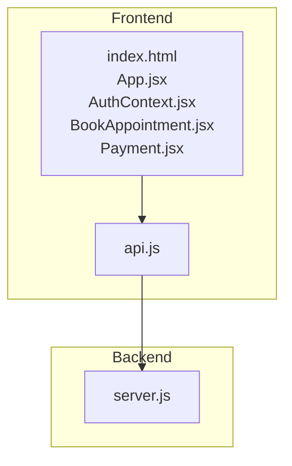
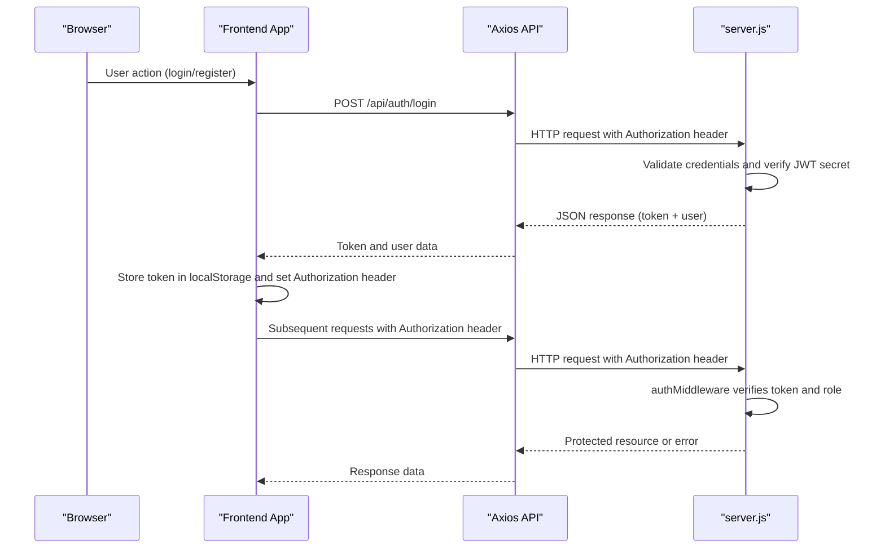
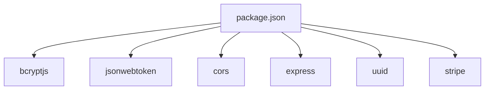

# Security Best Practices

<cite>
**Referenced Files in This Document**
- [server.js](file://server.js)
- [AuthContext.jsx](file://AuthContext.jsx)
- [app.js](file://app.js)
- [api.js](file://api.js)
- [index.html](file://index.html)
- [App.jsx](file://App.jsx)
- [BookAppointment.jsx](file://BookAppointment.jsx)
- [Payment.jsx](file://Payment.jsx)
- [package.json](file://package.json)
- [README.md](file://README.md)
</cite>

## Table of Contents
1. [Introduction](#introduction)
2. [Project Structure](#project-structure)
3. [Core Components](#core-components)
4. [Architecture Overview](#architecture-overview)
5. [Detailed Component Analysis](#detailed-component-analysis)
6. [Dependency Analysis](#dependency-analysis)
7. [Performance Considerations](#performance-considerations)
8. [Troubleshooting Guide](#troubleshooting-guide)
9. [Conclusion](#conclusion)
10. [Appendices](#appendices)

## Introduction
This document provides comprehensive security best practices tailored for the Doctor appointment booking system. It focuses on authentication and authorization, JWT token management, password hashing with bcryptjs, session security, role-based access control, input validation and sanitization, XSS and CSRF protections, data protection (encryption at rest and in transit), GDPR considerations, API security (rate limiting, request validation, secure endpoints), monitoring and logging, incident response, secure dependency management, vulnerability assessments, and secure coding patterns. The guidance is grounded in the actual implementation present in the repository.

## Project Structure
The system comprises:
- Backend: Node.js/Express REST API with in-memory storage and JWT-based authentication.
- Frontend: Single-page application built with vanilla JavaScript and HTML/CSS, integrated with Axios for API communication and local storage for session persistence.

**Diagram sources**
- [index.html](file://index.html#L1-L552)
- [App.jsx](file://App.jsx#L1-L44)
- [AuthContext.jsx](file://AuthContext.jsx#L1-L41)
- [BookAppointment.jsx](file://BookAppointment.jsx#L1-L171)
- [Payment.jsx](file://Payment.jsx#L1-L350)
- [api.js](file://api.js#L1-L44)
- [server.js](file://server.js#L1-L390)

**Section sources**
- [README.md](file://README.md#L1-L159)
- [package.json](file://package.json#L1-L24)

## Core Components
- Authentication and Authorization:
  - JWT-based authentication with bcryptjs for password hashing.
  - Role-based access control via middleware enforcing roles.
- Session Management:
  - Frontend stores JWT in local storage and attaches Authorization header automatically.
- Input Validation and Sanitization:
  - Basic client-side validation for forms; server-side validation for required fields.
- Data Protection:
  - Passwords hashed with bcryptjs; in-memory storage; no TLS termination in backend.
- API Security:
  - CORS enabled; no rate limiting; basic request validation.
- Monitoring and Logging:
  - Minimal logging in backend; no structured audit logs.
- Incident Response:
  - No explicit incident response procedures.

**Section sources**
- [server.js](file://server.js#L49-L62)
- [server.js](file://server.js#L69-L110)
- [AuthContext.jsx](file://AuthContext.jsx#L6-L31)
- [app.js](file://app.js#L9-L33)

## Architecture Overview
The frontend communicates with the backend via HTTPS endpoints. Authentication tokens are transmitted in the Authorization header. The backend enforces role-based access control for protected routes.

**Diagram sources**
- [AuthContext.jsx](file://AuthContext.jsx#L11-L14)
- [api.js](file://api.js#L6-L9)
- [server.js](file://server.js#L49-L62)
- [server.js](file://server.js#L83-L90)

## Detailed Component Analysis

### Authentication and Authorization
- JWT Secret Management:
  - The JWT secret is loaded from an environment variable; otherwise defaults to a hardcoded value. This is a critical security risk and must be remediated immediately.
- Password Hashing:
  - bcryptjs is used for hashing passwords during registration and login verification.
- Role-Based Access Control:
  - Middleware checks the presence and validity of the JWT and enforces role-based restrictions on routes.

Security Recommendations:
- Never hardcode secrets. Use environment variables and rotate secrets regularly.
- Enforce HTTPS/TLS termination at the edge/proxy to prevent token interception.
- Implement short-lived access tokens with refresh tokens and secure cookie storage for enhanced session security.
- Add token revocation and re-authentication on sensitive operations.

**Section sources**
- [server.js](file://server.js#L19)
- [server.js](file://server.js#L69-L90)
- [server.js](file://server.js#L49-L62)
- [AuthContext.jsx](file://AuthContext.jsx#L21-L31)

### JWT Token Management
- Token Storage:
  - Frontend stores JWT in localStorage. This is vulnerable to XSS. Prefer HttpOnly cookies with SameSite and Secure flags for token storage.
- Authorization Header:
  - Authorization header is dynamically attached when a token exists.

Security Recommendations:
- Replace localStorage with HttpOnly cookies for tokens.
- Enforce Content-Security-Policy to mitigate XSS.
- Implement token rotation and sliding expiration.

**Section sources**
- [AuthContext.jsx](file://AuthContext.jsx#L7-L14)
- [AuthContext.jsx](file://AuthContext.jsx#L21-L31)
- [app.js](file://app.js#L7-L17)

### Session Security
- Local Storage Persistence:
  - User data and tokens are persisted in localStorage, increasing XSS attack surface.
- Theme and UI State:
  - Additional localStorage entries for UI preferences.

Security Recommendations:
- Move tokens to HttpOnly cookies with SameSite=Lax|Strict and Secure flags.
- Sanitize and escape all user-generated content rendered in the UI.
- Implement CSRF protection at the backend using anti-CSRF tokens or SameSite cookies.

**Section sources**
- [AuthContext.jsx](file://AuthContext.jsx#L7-L19)
- [index.html](file://index.html#L1-L552)

### Role-Based Access Control Implementation
- Middleware:
  - authMiddleware validates JWT and enforces role checks for routes like doctor and admin panels.
- Protected Routes:
  - Patient-only routes, doctor-only routes, and admin-only routes are guarded.

Security Recommendations:
- Add granular permissions and least privilege enforcement.
- Log unauthorized access attempts for auditing.

**Section sources**
- [server.js](file://server.js#L49-L62)
- [server.js](file://server.js#L134-L153)
- [server.js](file://server.js#L244-L280)

### Input Validation and Sanitization
- Client-Side Validation:
  - Forms enforce presence and basic format checks (e.g., email regex, password length).
- Server-Side Validation:
  - Required field checks and basic existence validations.

Security Recommendations:
- Implement comprehensive input validation and sanitization on the backend.
- Use allowlists for specializations and statuses.
- Sanitize and escape all user-generated content to prevent XSS.
- Add CSRF protection for state-changing requests.

**Section sources**
- [app.js](file://app.js#L402-L421)
- [app.js](file://app.js#L423-L455)
- [server.js](file://server.js#L69-L90)
- [server.js](file://server.js#L171-L202)

### XSS Prevention
- Current State:
  - No CSP headers are set; localStorage-based token storage increases XSS risk.
- Recommendations:
  - Add Content-Security-Policy headers.
  - Sanitize and escape user-generated content.
  - Use DOM-safe templating or frameworks with built-in escaping.

**Section sources**
- [index.html](file://index.html#L1-L552)

### CSRF Protection
- Current State:
  - No CSRF protection mechanisms are implemented.
- Recommendations:
  - Use SameSite cookies for state-changing requests.
  - Implement anti-CSRF tokens for cross-origin requests.
  - Validate Origin and Referer headers for state-changing endpoints.

**Section sources**
- [server.js](file://server.js#L22)
- [server.js](file://server.js#L49-L62)

### Data Protection: Encryption at Rest and in Transit
- Encryption at Rest:
  - In-memory storage; no encryption at rest.
- Encryption in Transit:
  - No HTTPS/TLS termination in backend; tokens and sensitive data could be intercepted.

Security Recommendations:
- Enable HTTPS/TLS termination at the edge/proxy.
- Encrypt sensitive data at rest using industry-standard encryption.
- Rotate encryption keys periodically.

**Section sources**
- [server.js](file://server.js#L1-L390)

### GDPR Compliance Considerations
- Data Minimization:
  - Collect only necessary patient data.
- Consent and Transparency:
  - Provide clear privacy policy and obtain consent for data processing.
- Right to Erasure:
  - Implement deletion mechanisms for patient data upon request.
- Data Portability:
  - Allow export of personal data in a structured, machine-readable format.

**Section sources**
- [server.js](file://server.js#L29-L44)

### API Security: Rate Limiting, Request Validation, Secure Endpoints
- Rate Limiting:
  - Not implemented; susceptible to brute force and abuse.
- Request Validation:
  - Basic validation; enhance with schema validation and allowlists.
- Secure Endpoints:
  - CORS enabled; consider restricting origins and adding preflight handling.

Security Recommendations:
- Implement rate limiting per IP and per user.
- Add schema validation and input sanitization.
- Restrict CORS origins and add HSTS.

**Section sources**
- [server.js](file://server.js#L22)
- [server.js](file://server.js#L69-L110)
- [server.js](file://server.js#L171-L202)

### Payment Security
- Payment Simulation:
  - Payment details are collected and sent to backend for simulation.
- Recommendations:
  - Use PCI-compliant payment processors (Stripe).
  - Never store sensitive payment data; rely on payment intents and tokens.
  - Implement end-to-end encryption for payment data.

**Section sources**
- [server.js](file://server.js#L298-L353)
- [Payment.jsx](file://Payment.jsx#L62-L98)

### Monitoring, Logging, and Incident Response
- Logging:
  - Minimal logging in backend; no structured audit logs.
- Recommendations:
  - Implement structured logging with sensitive data redaction.
  - Centralize logs and monitor for anomalies.
  - Define incident response procedures and escalation paths.

**Section sources**
- [server.js](file://server.js#L389)

### Secure Coding Patterns and Pitfalls
- Secure Coding Patterns:
  - Use bcryptjs for password hashing.
  - Implement JWT-based authentication with role checks.
  - Centralize API calls via a dedicated module.
- Common Pitfalls:
  - Hardcoded JWT secret.
  - Storing tokens in localStorage.
  - Missing HTTPS/TLS termination.
  - Lack of rate limiting and input validation.
  - No CSRF protection.

**Section sources**
- [server.js](file://server.js#L19)
- [AuthContext.jsx](file://AuthContext.jsx#L21-L31)
- [api.js](file://api.js#L1-L44)

## Dependency Analysis
Key runtime dependencies include bcryptjs, jsonwebtoken, cors, express, uuid, and stripe. These introduce security considerations around credential handling, token verification, and payment processing.

**Diagram sources**
- [package.json](file://package.json#L14-L22)

**Section sources**
- [package.json](file://package.json#L1-L24)

## Performance Considerations
- Token Verification:
  - JWT verification is lightweight; ensure minimal overhead.
- Database Operations:
  - In-memory operations are fast; consider caching and indexing for production databases.
- Frontend Responsiveness:
  - Debounce and throttle user interactions to reduce unnecessary API calls.

[No sources needed since this section provides general guidance]

## Troubleshooting Guide
Common issues and resolutions:
- Invalid or Expired Token:
  - Ensure JWT secret is configured and tokens are refreshed as needed.
- CORS Errors:
  - Configure allowed origins and credentials appropriately.
- Payment Failures:
  - Validate payment details and ensure Stripe integration is correctly configured.

**Section sources**
- [server.js](file://server.js#L53-L60)
- [server.js](file://server.js#L22)
- [server.js](file://server.js#L298-L353)

## Conclusion
The Doctor appointment booking system demonstrates foundational authentication and authorization patterns with JWT and bcryptjs. However, several critical security gaps exist, including hardcoded secrets, insecure token storage, lack of HTTPS/TLS, missing rate limiting, and absence of CSRF protection. Immediate remediation is required to align with healthcare application security standards and regulatory compliance.

## Appendices
- Security Checklist:
  - Replace hardcoded secrets with environment variables.
  - Store tokens in HttpOnly cookies with Secure and SameSite flags.
  - Enable HTTPS/TLS termination.
  - Implement rate limiting and comprehensive input validation.
  - Add CSRF protection and Content-Security-Policy.
  - Encrypt sensitive data at rest and in transit.
  - Establish structured logging and incident response procedures.

[No sources needed since this section provides general guidance]