# Testing Strategies

<cite>
**Referenced Files in This Document**
- [package.json](file://package.json)
- [README.md](file://README.md)
- [App.jsx](file://App.jsx)
- [AuthContext.jsx](file://AuthContext.jsx)
- [api.js](file://api.js)
- [server.js](file://server.js)
- [UI.jsx](file://UI.jsx)
- [BookAppointment.jsx](file://BookAppointment.jsx)
- [DoctorPanel.jsx](file://DoctorPanel.jsx)
- [Admin.jsx](file://Admin.jsx)
- [Payment.jsx](file://Payment.jsx)
- [Profile.jsx](file://Profile.jsx)
- [data.js](file://data.js)
- [app.js](file://app.js)
</cite>

## Table of Contents
1. [Introduction](#introduction)
2. [Project Structure](#project-structure)
3. [Core Components](#core-components)
4. [Architecture Overview](#architecture-overview)
5. [Detailed Component Analysis](#detailed-component-analysis)
6. [Dependency Analysis](#dependency-analysis)
7. [Performance Considerations](#performance-considerations)
8. [Troubleshooting Guide](#troubleshooting-guide)
9. [Conclusion](#conclusion)
10. [Appendices](#appendices)

## Introduction
This document defines a comprehensive testing strategy for the Doctor appointment booking system. It covers frontend testing with unit and integration tests, backend API testing, authentication flow verification, and best practices for React hooks, context providers, and asynchronous operations. It also outlines setup configuration, test organization, naming conventions, data management, mock implementations, and CI testing workflows.

## Project Structure
The system comprises:
- Frontend (React SPA) with routing, context, UI components, and pages for booking, payments, profiles, and dashboards
- Backend (Node.js/Express) with in-memory storage and REST endpoints
- Shared API client module for HTTP calls
- Authentication context managing JWT state and persistence

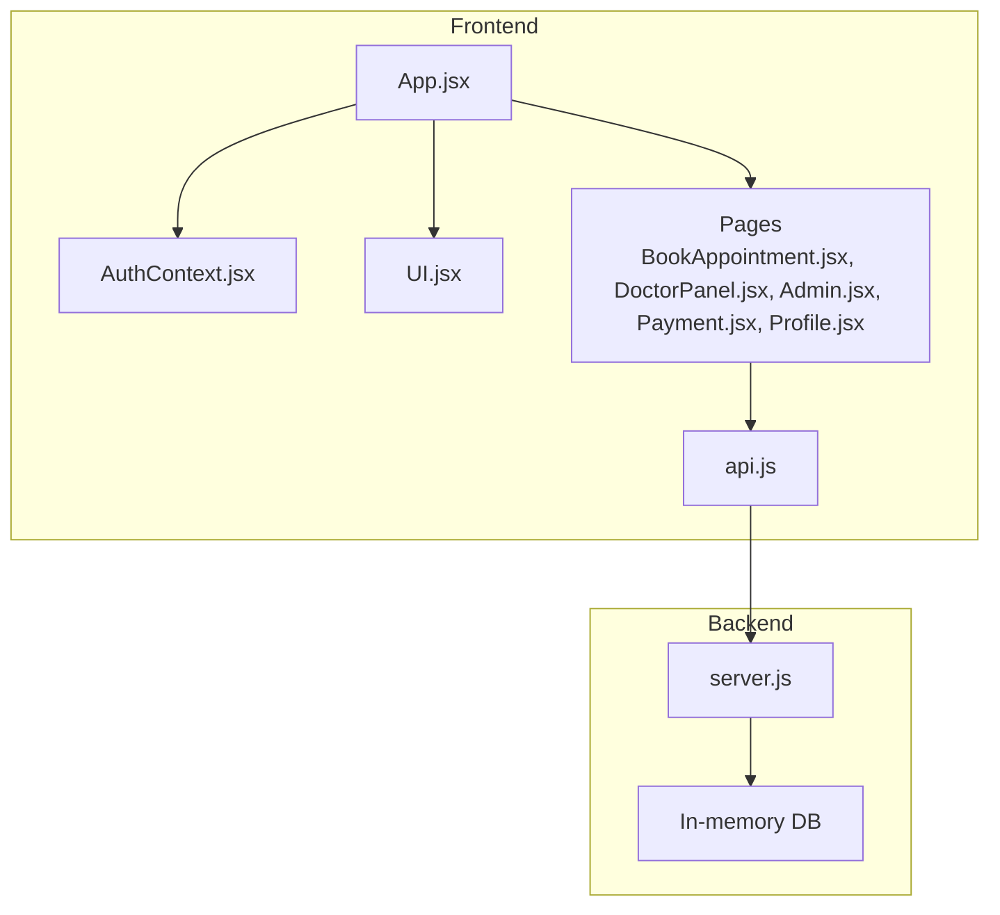

**Diagram sources**
- [App.jsx](file://App.jsx#L1-L44)
- [AuthContext.jsx](file://AuthContext.jsx#L1-L41)
- [UI.jsx](file://UI.jsx#L1-L182)
- [BookAppointment.jsx](file://BookAppointment.jsx#L1-L171)
- [DoctorPanel.jsx](file://DoctorPanel.jsx#L1-L96)
- [Admin.jsx](file://Admin.jsx#L1-L194)
- [Payment.jsx](file://Payment.jsx#L1-L350)
- [Profile.jsx](file://Profile.jsx#L1-L97)
- [api.js](file://api.js#L1-L44)
- [server.js](file://server.js#L1-L390)

**Section sources**
- [README.md](file://README.md#L1-L159)
- [App.jsx](file://App.jsx#L1-L44)
- [AuthContext.jsx](file://AuthContext.jsx#L1-L41)
- [api.js](file://api.js#L1-L44)
- [server.js](file://server.js#L1-L390)

## Core Components
- Authentication context manages user state, JWT token, and theme persistence; exposes login/logout and dark mode toggling
- API client encapsulates base URL and exports typed functions per endpoint
- UI components provide reusable building blocks (toasts, spinner, stars, probability bar, countdown, badges)
- Pages implement domain logic: booking, doctor panel, admin dashboard, payment, and profile
- Backend server implements JWT middleware, in-memory DB, and REST endpoints for auth, doctors, appointments, payments, and admin

Key testing targets:
- AuthContext behavior (state updates, persistence, Authorization header propagation)
- API client functions (request shape, response mapping)
- Page components (effects, state transitions, async operations)
- UI components (props-driven rendering, event handlers)
- Backend endpoints (validation, authorization, data mutations)

**Section sources**
- [AuthContext.jsx](file://AuthContext.jsx#L1-L41)
- [api.js](file://api.js#L1-L44)
- [UI.jsx](file://UI.jsx#L1-L182)
- [BookAppointment.jsx](file://BookAppointment.jsx#L1-L171)
- [DoctorPanel.jsx](file://DoctorPanel.jsx#L1-L96)
- [Admin.jsx](file://Admin.jsx#L1-L194)
- [Payment.jsx](file://Payment.jsx#L1-L350)
- [Profile.jsx](file://Profile.jsx#L1-L97)
- [server.js](file://server.js#L1-L390)

## Architecture Overview
The frontend communicates with the backend via Axios-based API functions. Authentication relies on JWT tokens stored in local storage and injected into HTTP headers. The backend enforces role-based access using a JWT middleware.

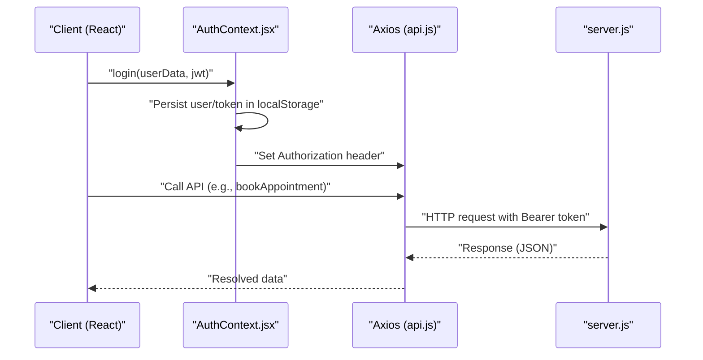

**Diagram sources**
- [AuthContext.jsx](file://AuthContext.jsx#L1-L41)
- [api.js](file://api.js#L1-L44)
- [server.js](file://server.js#L49-L62)

## Detailed Component Analysis

### Authentication Context Testing
Focus areas:
- Initial state hydration from localStorage
- Token presence sets Authorization header globally
- Theme persistence and attribute updates
- Login persists user/token and updates defaults
- Logout clears state and removes persisted items

Recommended tests:
- Unit: verify initial state, header injection, theme attribute, login persistence, logout cleanup
- Integration: verify header propagation across API calls during a session

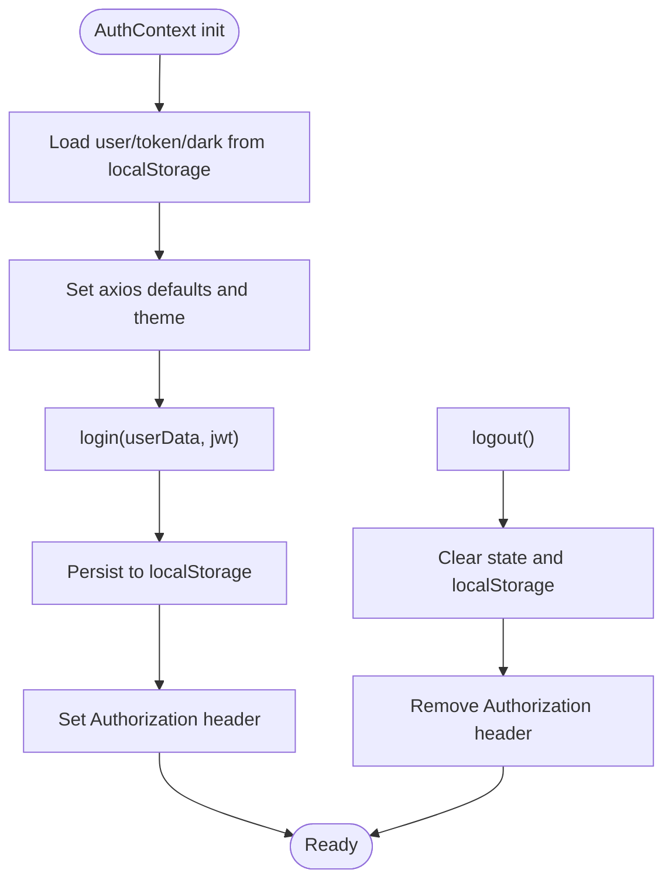

**Diagram sources**
- [AuthContext.jsx](file://AuthContext.jsx#L6-L38)

**Section sources**
- [AuthContext.jsx](file://AuthContext.jsx#L1-L41)

### API Client Testing
Focus areas:
- Base URL configuration
- Exported functions for each endpoint
- Request/response mapping and error handling

Recommended tests:
- Unit: assert correct endpoint URLs and method signatures
- Integration: mock backend responses and verify resolved data

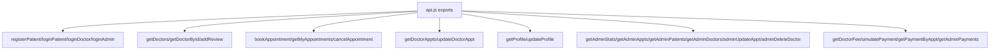

**Diagram sources**
- [api.js](file://api.js#L1-L44)

**Section sources**
- [api.js](file://api.js#L1-L44)

### UI Components Testing
Focus areas:
- Props-driven rendering (Stars, ProbBar, StatusBadge)
- Side effects (Countdown timers, toast lifecycle)
- Event handlers (Star rating, button clicks)

Recommended tests:
- Unit: snapshot/render props, event handler triggers
- Integration: toast container lifecycle, spinner visibility

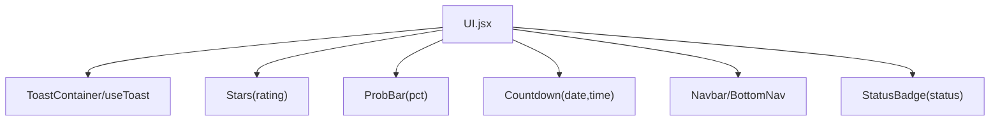

**Diagram sources**
- [UI.jsx](file://UI.jsx#L1-L182)

**Section sources**
- [UI.jsx](file://UI.jsx#L1-L182)

### Booking Page Testing
Focus areas:
- Doctor data loading and error handling
- Slot selection and probability simulation
- Booking flow and navigation to payment
- Review submission

Recommended tests:
- Unit: state transitions, error messages, navigation conditions
- Integration: API calls, toast notifications, router navigation

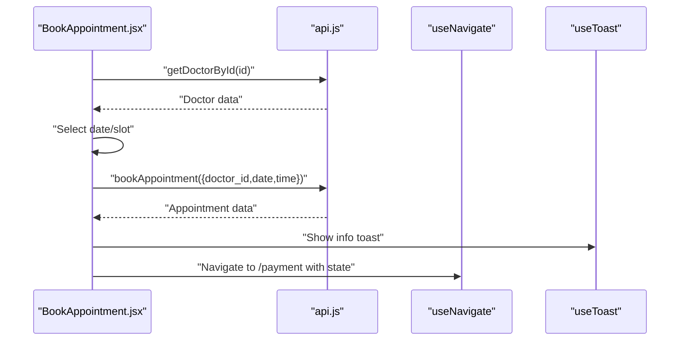

**Diagram sources**
- [BookAppointment.jsx](file://BookAppointment.jsx#L1-L171)
- [api.js](file://api.js#L1-L44)

**Section sources**
- [BookAppointment.jsx](file://BookAppointment.jsx#L1-L171)

### Doctor Panel Testing
Focus areas:
- Role guard and redirect
- Fetching appointments and filtering
- Updating statuses and toast feedback

Recommended tests:
- Unit: filter logic, status updates, counts
- Integration: API calls, toast messages

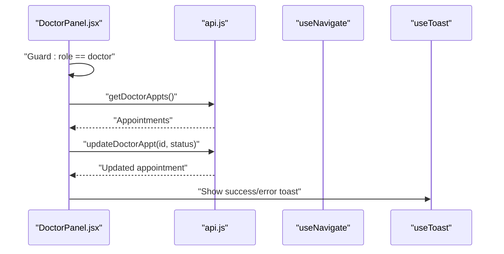

**Diagram sources**
- [DoctorPanel.jsx](file://DoctorPanel.jsx#L1-L96)
- [api.js](file://api.js#L1-L44)

**Section sources**
- [DoctorPanel.jsx](file://DoctorPanel.jsx#L1-L96)

### Admin Dashboard Testing
Focus areas:
- Role guard and redirect
- Parallel data fetching
- Status updates and deletion actions

Recommended tests:
- Unit: tab switching, counts, confirm dialogs
- Integration: API calls, toast messages

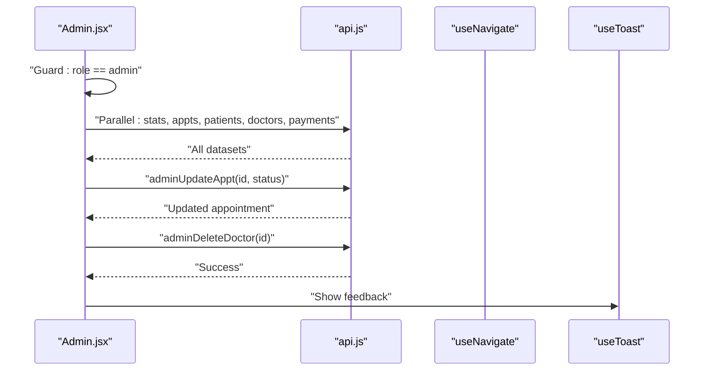

**Diagram sources**
- [Admin.jsx](file://Admin.jsx#L1-L194)
- [api.js](file://api.js#L1-L44)

**Section sources**
- [Admin.jsx](file://Admin.jsx#L1-L194)

### Payment Page Testing
Focus areas:
- Method selection and validation
- Front-end formatting helpers
- Simulation flow and success state

Recommended tests:
- Unit: formatting helpers, validation rules, step transitions
- Integration: API calls, toast messages, navigation

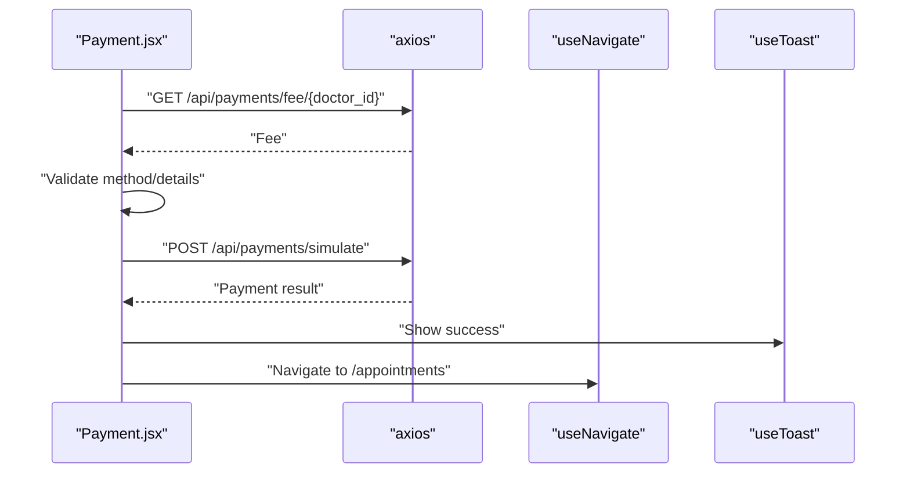

**Diagram sources**
- [Payment.jsx](file://Payment.jsx#L1-L350)

**Section sources**
- [Payment.jsx](file://Payment.jsx#L1-L350)

### Profile Page Testing
Focus areas:
- Guard and data loading
- Update logic and password validation
- Auth state refresh after updates

Recommended tests:
- Unit: form validation, saving state, error handling
- Integration: API calls, toast messages, auth state update

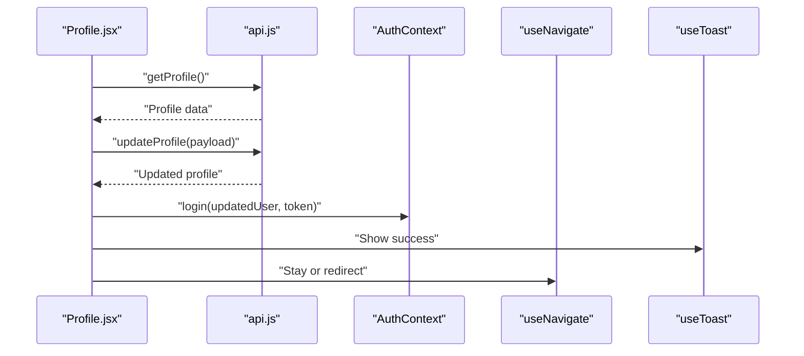

**Diagram sources**
- [Profile.jsx](file://Profile.jsx#L1-L97)
- [api.js](file://api.js#L1-L44)
- [AuthContext.jsx](file://AuthContext.jsx#L1-L41)

**Section sources**
- [Profile.jsx](file://Profile.jsx#L1-L97)

### Backend API Testing
Focus areas:
- JWT middleware (token extraction, verification, role enforcement)
- Auth routes (registration, login, doctor login, admin login)
- Doctor routes (listing, reviews)
- Appointment routes (booking, cancellation)
- Admin routes (stats, management)
- Payment routes (fee lookup, simulation)

Recommended tests:
- Unit: middleware behavior, route handlers, validation logic
- Integration: database invariants, cross-entity relations, error responses

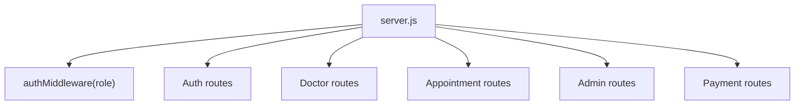

**Diagram sources**
- [server.js](file://server.js#L49-L62)
- [server.js](file://server.js#L68-L110)
- [server.js](file://server.js#L116-L164)
- [server.js](file://server.js#L170-L217)
- [server.js](file://server.js#L244-L280)
- [server.js](file://server.js#L298-L377)

**Section sources**
- [server.js](file://server.js#L1-L390)

## Dependency Analysis
- Frontend depends on AuthContext for state and on API client for HTTP
- API client depends on Axios and base URL
- Backend depends on JWT, bcrypt, UUID, and in-memory DB
- UI components depend on AuthContext for navigation and theme

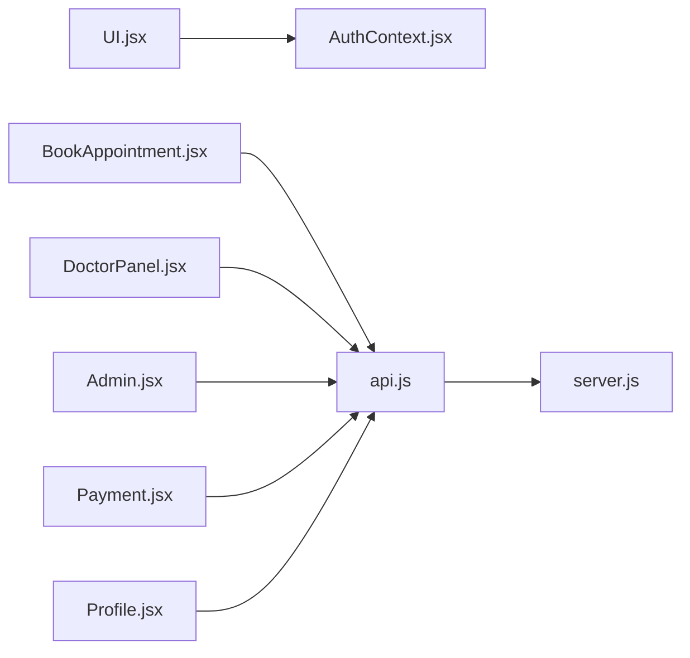

**Diagram sources**
- [UI.jsx](file://UI.jsx#L1-L182)
- [AuthContext.jsx](file://AuthContext.jsx#L1-L41)
- [BookAppointment.jsx](file://BookAppointment.jsx#L1-L171)
- [DoctorPanel.jsx](file://DoctorPanel.jsx#L1-L96)
- [Admin.jsx](file://Admin.jsx#L1-L194)
- [Payment.jsx](file://Payment.jsx#L1-L350)
- [Profile.jsx](file://Profile.jsx#L1-L97)
- [api.js](file://api.js#L1-L44)
- [server.js](file://server.js#L1-L390)

**Section sources**
- [App.jsx](file://App.jsx#L1-L44)
- [AuthContext.jsx](file://AuthContext.jsx#L1-L41)
- [api.js](file://api.js#L1-L44)
- [server.js](file://server.js#L1-L390)

## Performance Considerations
- Prefer shallow rendering for UI components to reduce overhead
- Mock network calls to avoid real HTTP latency
- Use deterministic timeouts for timers and intervals in tests
- Limit heavy DOM queries; target specific nodes by data attributes
- Batch API calls where appropriate (e.g., Promise.all in Admin)

## Troubleshooting Guide
Common issues and remedies:
- Missing Authorization header: verify AuthContext login and header injection
- Stale state after logout: ensure localStorage removal and default cleanup
- Toast not appearing: check toast container mount and lifecycle
- Router navigation failures: verify useNavigate and route guards
- Backend errors: inspect middleware, validation, and error responses

**Section sources**
- [AuthContext.jsx](file://AuthContext.jsx#L11-L14)
- [AuthContext.jsx](file://AuthContext.jsx#L27-L31)
- [UI.jsx](file://UI.jsx#L11-L25)
- [Admin.jsx](file://Admin.jsx#L19-L24)

## Conclusion
A robust testing strategy balances unit, integration, and end-to-end tests across frontend and backend. Prioritize authentication flows, API interactions, and asynchronous state management. Use mocks judiciously, maintain clear test organization, and enforce coverage thresholds to ensure reliability and maintainability.

## Appendices

### Testing Setup and Configuration
- Install testing libraries and matchers for React
- Configure test environment (DOM, globals, polyfills)
- Set up test runner and coverage collection
- Define global mocks for localStorage, crypto, and timers

**Section sources**
- [package.json](file://package.json#L6-L8)

### Test Organization and Naming Conventions
- Place tests alongside source files (e.g., Component.test.jsx)
- Use descriptive filenames and suites
- Group tests by component, hook, or feature area
- Name assertions to reflect behavior under test

### Mock Implementations
- Frontend: mock Axios interceptors and API functions
- Backend: replace in-memory DB with isolated test fixtures
- Authentication: stub JWT verification and role checks

### Test Environment Configuration
- Frontend: configure DOM environment, router, and context providers
- Backend: configure environment variables (JWT_SECRET, STRIPE keys), CORS, and static serving

### Continuous Integration Testing Workflows
- Run unit and integration tests on push and pull requests
- Enforce coverage thresholds
- Run backend tests against a clean in-memory state
- Snapshot and lint checks as preconditions