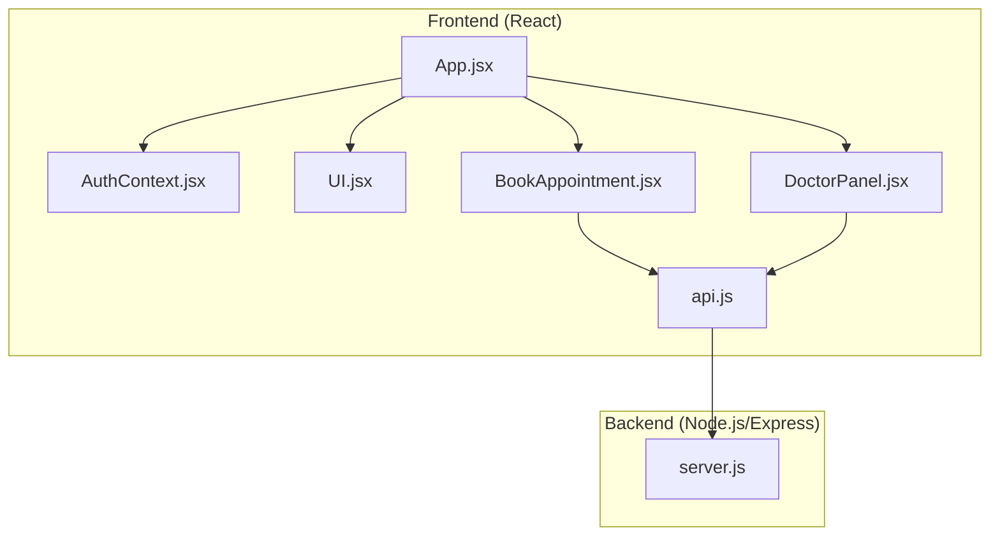
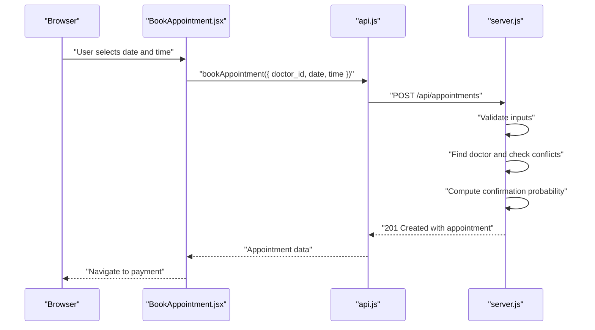
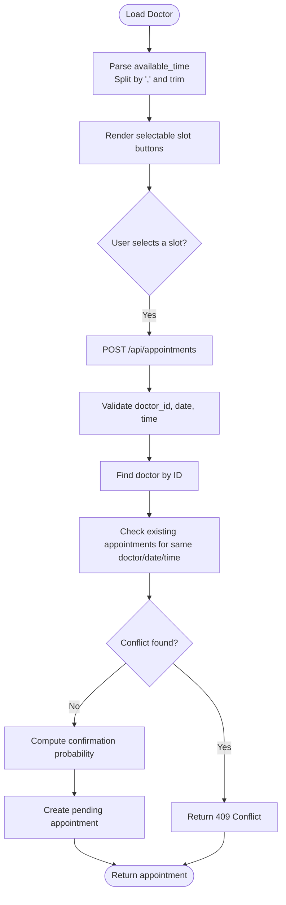
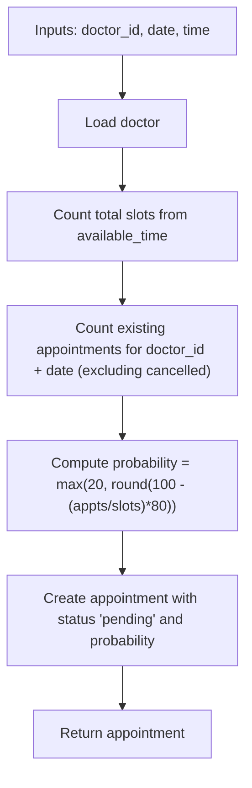
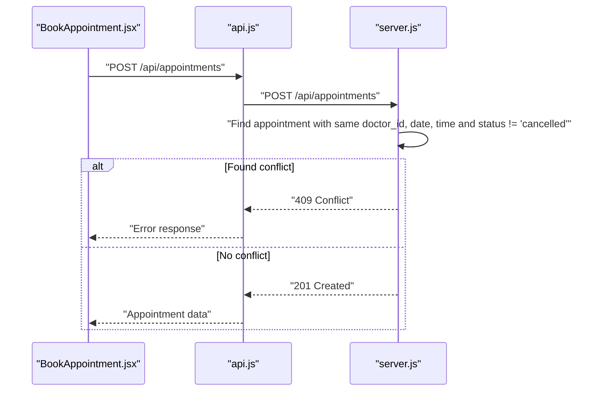
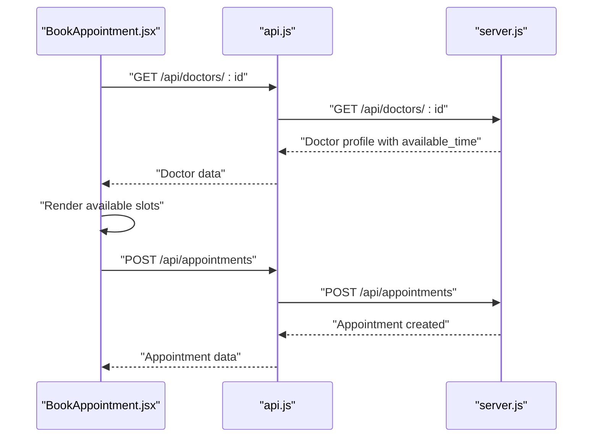
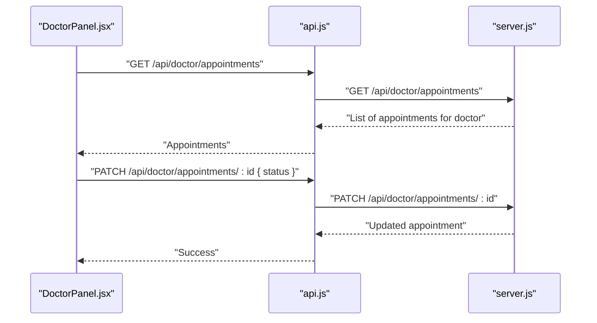
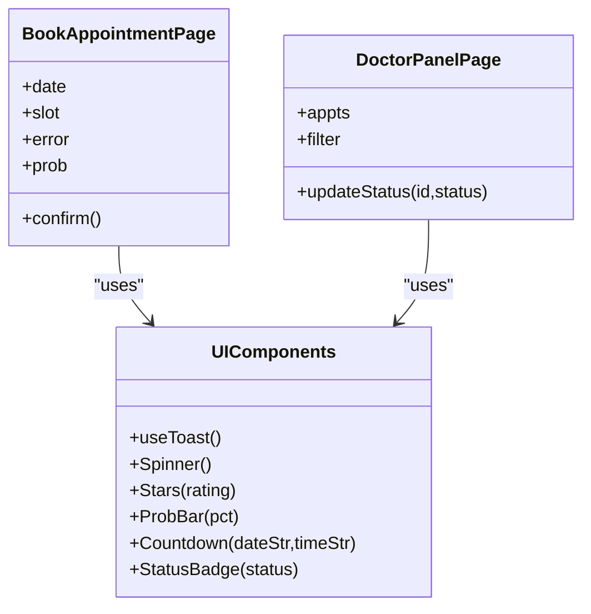
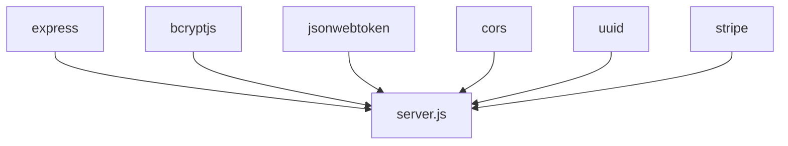

# Doctor Availability and Scheduling

<cite>
**Referenced Files in This Document**
- [server.js](file://server.js)
- [api.js](file://api.js)
- [BookAppointment.jsx](file://BookAppointment.jsx)
- [DoctorPanel.jsx](file://DoctorPanel.jsx)
- [UI.jsx](file://UI.jsx)
- [AuthContext.jsx](file://AuthContext.jsx)
- [App.jsx](file://App.jsx)
- [README.md](file://README.md)
- [package.json](file://package.json)
- [index.html](file://index.html)
</cite>

## Table of Contents
1. [Introduction](#introduction)
2. [Project Structure](#project-structure)
3. [Core Components](#core-components)
4. [Architecture Overview](#architecture-overview)
5. [Detailed Component Analysis](#detailed-component-analysis)
6. [Dependency Analysis](#dependency-analysis)
7. [Performance Considerations](#performance-considerations)
8. [Troubleshooting Guide](#troubleshooting-guide)
9. [Conclusion](#conclusion)
10. [Appendices](#appendices)

## Introduction
This document explains the doctor availability and scheduling system implemented in the MediBook application. It covers how time slots are configured and parsed, how appointments are allocated and validated, how confirmation probabilities are calculated based on doctor workload, and how conflicts are prevented. It also documents the integration between the doctor schedule and the patient booking flow, including real-time availability checks and updates. Edge cases such as time zone handling, daylight saving adjustments, and schedule modifications are addressed.

## Project Structure
The system consists of:
- A Node.js/Express backend that exposes REST APIs for authentication, doctor listings, appointments, and payments.
- A React frontend that renders the UI, handles user interactions, and communicates with the backend via Axios.
- Shared UI components for toast notifications, spinner, stars, and a confirmation probability bar.
- Authentication state persisted in local storage and propagated via a React context provider.

**Diagram sources**
- [App.jsx](file://App.jsx#L15-L44)
- [AuthContext.jsx](file://AuthContext.jsx#L6-L38)
- [UI.jsx](file://UI.jsx#L1-L182)
- [BookAppointment.jsx](file://BookAppointment.jsx#L1-L171)
- [DoctorPanel.jsx](file://DoctorPanel.jsx#L1-L96)
- [api.js](file://api.js#L1-L44)
- [server.js](file://server.js#L17-L390)

**Section sources**
- [README.md](file://README.md#L7-L33)
- [App.jsx](file://App.jsx#L1-L44)
- [AuthContext.jsx](file://AuthContext.jsx#L1-L41)
- [UI.jsx](file://UI.jsx#L1-L182)
- [BookAppointment.jsx](file://BookAppointment.jsx#L1-L171)
- [DoctorPanel.jsx](file://DoctorPanel.jsx#L1-L96)
- [api.js](file://api.js#L1-L44)
- [server.js](file://server.js#L1-L390)

## Core Components
- Backend API endpoints for:
  - Authentication (patients, doctors, admins)
  - Doctor discovery and reviews
  - Appointment creation, cancellation, and status updates
  - Payment intents and simulated payments
- Frontend pages:
  - BookAppointment page for selecting date and time slots
  - DoctorPanel for approving/rejecting appointments
  - UI components for probability bars, countdown timers, and toast notifications
- Shared API wrapper for centralized HTTP calls
- Authentication context for JWT-based sessions

Key backend routes and flows:
- POST /api/appointments validates doctor existence, checks for conflicts, computes confirmation probability, and creates a pending appointment.
- GET /api/doctors and GET /api/doctors/:id expose doctor profiles including available_time.
- PATCH /api/doctor/appointments/:id updates appointment status for doctors.
- POST /api/payments/simulate marks an appointment as approved upon successful payment simulation.

**Section sources**
- [server.js](file://server.js#L67-L110)
- [server.js](file://server.js#L116-L131)
- [server.js](file://server.js#L170-L202)
- [server.js](file://server.js#L144-L153)
- [server.js](file://server.js#L297-L353)
- [api.js](file://api.js#L6-L44)

## Architecture Overview
The system follows a classic client-server architecture:
- The React frontend renders the UI and interacts with the backend through Axios.
- The backend enforces business rules (conflict detection, confirmation probability computation) and stores data in memory.
- Authentication middleware ensures only authorized users can access protected routes.

**Diagram sources**
- [BookAppointment.jsx](file://BookAppointment.jsx#L39-L60)
- [api.js](file://api.js#L16-L19)
- [server.js](file://server.js#L170-L202)

## Detailed Component Analysis

### Time Slot Management and Parsing
- Doctor availability is stored as a comma-separated string of time entries in the doctor record.
- The frontend splits this string into an array of slot strings and displays them as selectable buttons.
- The backend similarly parses the available_time string to compute the total number of slots for confirmation probability calculations.

Implementation highlights:
- Frontend parsing and rendering of slots:
  - Split by comma and trim whitespace for each slot.
  - Render interactive buttons for selection.
- Backend parsing and conflict detection:
  - Split available_time to count total slots.
  - Filter existing appointments for the same doctor and date to detect conflicts.

**Diagram sources**
- [BookAppointment.jsx](file://BookAppointment.jsx#L74-L127)
- [server.js](file://server.js#L170-L202)

**Section sources**
- [BookAppointment.jsx](file://BookAppointment.jsx#L74-L127)
- [server.js](file://server.js#L170-L202)

### Appointment Scheduling Algorithm and Confirmation Probability
The algorithm computes a dynamic confirmation probability based on:
- Total number of slots available for the doctor on the selected date.
- Number of currently scheduled appointments for the same doctor on the same date.
- Probability formula: clamp to a minimum percentage and round to nearest integer.

Key steps:
- Count total slots from available_time.
- Count current confirmed/pending appointments for the same doctor and date.
- Compute probability using a linear formula and clamp to a minimum threshold.
- Store the computed probability in the appointment record.

**Diagram sources**
- [server.js](file://server.js#L181-L184)
- [server.js](file://server.js#L186-L199)

**Section sources**
- [server.js](file://server.js#L181-L184)
- [server.js](file://server.js#L186-L199)

### Availability Checking and Double Booking Prevention
The system prevents double bookings by:
- Verifying that no appointment exists for the same doctor, date, and time with a non-cancelled status.
- Returning a conflict error if a matching appointment is found.

**Diagram sources**
- [server.js](file://server.js#L170-L202)
- [api.js](file://api.js#L16-L19)

**Section sources**
- [server.js](file://server.js#L178-L179)

### Integration Between Doctor Schedules and Patient Booking
- Doctor availability is part of the doctor record and is exposed via GET /api/doctors and GET /api/doctors/:id.
- The booking page loads a doctor’s profile and renders available slots.
- On confirmation, the frontend posts the chosen slot to the backend, which validates and creates the appointment.

**Diagram sources**
- [BookAppointment.jsx](file://BookAppointment.jsx#L28-L32)
- [BookAppointment.jsx](file://BookAppointment.jsx#L74-L127)
- [server.js](file://server.js#L125-L131)
- [server.js](file://server.js#L170-L202)

**Section sources**
- [BookAppointment.jsx](file://BookAppointment.jsx#L28-L32)
- [BookAppointment.jsx](file://BookAppointment.jsx#L74-L127)
- [server.js](file://server.js#L125-L131)
- [server.js](file://server.js#L170-L202)

### Doctor Panel and Appointment Approval Workflow
- Doctors can view incoming appointments for their profile.
- They can approve or reject pending appointments, updating the status accordingly.

**Diagram sources**
- [DoctorPanel.jsx](file://DoctorPanel.jsx#L15-L28)
- [api.js](file://api.js#L21-L23)
- [server.js](file://server.js#L133-L153)

**Section sources**
- [DoctorPanel.jsx](file://DoctorPanel.jsx#L15-L28)
- [api.js](file://api.js#L21-L23)
- [server.js](file://server.js#L133-L153)

### Time Zone Handling, Daylight Saving, and Schedule Modifications
- Time zone handling:
  - The frontend uses ISO date strings for the date picker and converts time strings to 24-hour format internally for countdown calculations.
  - There is no explicit time zone conversion in the frontend or backend; all dates and times are treated as local or ISO strings.
- Daylight saving adjustments:
  - The countdown timer relies on the browser’s local time and does not adjust for DST transitions.
- Schedule modifications:
  - The current implementation does not expose endpoints to modify a doctor’s available_time. Any changes would require backend updates to support editing the available_time field.

Recommendations:
- Normalize all timestamps to UTC on the backend and expose a dedicated endpoint to update doctor availability.
- Provide a time zone-aware date/time picker in the frontend and convert to UTC before sending to the backend.
- Implement a schedule modification endpoint for doctors to add/remove slots.

**Section sources**
- [UI.jsx](file://UI.jsx#L60-L94)
- [BookAppointment.jsx](file://BookAppointment.jsx#L26-L26)
- [server.js](file://server.js#L170-L202)

### Real-Time Slot Updates and UI Feedback
- The frontend displays a confirmation probability bar that reflects the current load on the selected date.
- The UI includes a spinner during loading and toast notifications for user feedback.
- The doctor panel shows counts and filters appointments by status.

**Diagram sources**
- [UI.jsx](file://UI.jsx#L5-L182)
- [BookAppointment.jsx](file://BookAppointment.jsx#L1-L171)
- [DoctorPanel.jsx](file://DoctorPanel.jsx#L1-L96)

**Section sources**
- [UI.jsx](file://UI.jsx#L5-L182)
- [BookAppointment.jsx](file://BookAppointment.jsx#L1-L171)
- [DoctorPanel.jsx](file://DoctorPanel.jsx#L1-L96)

## Dependency Analysis
External libraries and their roles:
- Express: Web framework for the backend.
- bcryptjs: Password hashing for secure credentials.
- jsonwebtoken: JWT-based authentication.
- cors: Cross-origin resource sharing.
- stripe: Payment processing (optional; fallback provided).
- uuid: Unique identifiers for records.

**Diagram sources**
- [package.json](file://package.json#L14-L22)
- [server.js](file://server.js#L5-L21)

**Section sources**
- [package.json](file://package.json#L1-L24)
- [server.js](file://server.js#L5-L21)

## Performance Considerations
- In-memory storage:
  - The backend uses an in-memory object for persistence. For production, replace with a relational database to improve scalability and reliability.
- Conflict detection:
  - Filtering appointments by doctor_id and date is O(n) in the number of appointments. Consider indexing or partitioning by date for large datasets.
- Confirmation probability:
  - Computation is constant time; however, frequent re-computation could be optimized by caching per-doctor-per-day counts.
- Frontend responsiveness:
  - Use debouncing for date changes and avoid unnecessary re-renders by memoizing derived values.

[No sources needed since this section provides general guidance]

## Troubleshooting Guide
Common issues and resolutions:
- Authentication errors:
  - Ensure Authorization header is present and valid for protected routes.
- Missing inputs:
  - The backend requires doctor_id, date, and time for appointment booking; missing fields return a 400 error.
- Double booking:
  - If a slot is already taken, the backend returns a 409 Conflict. Prompt the user to select another slot.
- Payment simulation:
  - Ensure the appointment_id and doctor_id match the logged-in user; otherwise, the backend returns a 404 Not Found.
- Time parsing:
  - The frontend expects time in 12-hour format and converts to 24-hour internally for countdown calculations.

**Section sources**
- [server.js](file://server.js#L69-L90)
- [server.js](file://server.js#L170-L202)
- [server.js](file://server.js#L297-L353)
- [UI.jsx](file://UI.jsx#L88-L94)

## Conclusion
The MediBook system provides a functional foundation for doctor availability and scheduling with:
- Clear time slot configuration and parsing
- Robust conflict prevention
- Dynamic confirmation probability based on workload
- Integrated doctor and patient workflows
- UI feedback for user experience

Future enhancements should focus on persistent storage, time zone awareness, schedule modification endpoints, and improved scalability.

[No sources needed since this section summarizes without analyzing specific files]

## Appendices

### API Definitions
- Patient authentication
  - POST /api/auth/register
  - POST /api/auth/login
- Doctor authentication
  - POST /api/auth/doctor-login
- Admin authentication
  - POST /api/auth/admin-login
- Doctors
  - GET /api/doctors
  - GET /api/doctors/:id
  - POST /api/doctors/:id/review
- Appointments
  - POST /api/appointments
  - GET /api/appointments
  - PATCH /api/appointments/:id/cancel
  - GET /api/doctor/appointments
  - PATCH /api/doctor/appointments/:id
- Payments
  - POST /api/payments/create-intent
  - POST /api/payments/simulate
  - GET /api/payments/:appointment_id
  - GET /api/payments/fee/:doctor_id

**Section sources**
- [api.js](file://api.js#L6-L44)
- [server.js](file://server.js#L67-L110)
- [server.js](file://server.js#L116-L164)
- [server.js](file://server.js#L168-L217)
- [server.js](file://server.js#L286-L377)

### Data Model Notes
- Doctor availability is stored as a comma-separated string of time entries.
- Confirmation probability is stored per appointment.
- Status values include pending, approved, cancelled, and completed.

**Section sources**
- [server.js](file://server.js#L29-L44)
- [server.js](file://server.js#L186-L199)
- [server.js](file://server.js#L133-L153)