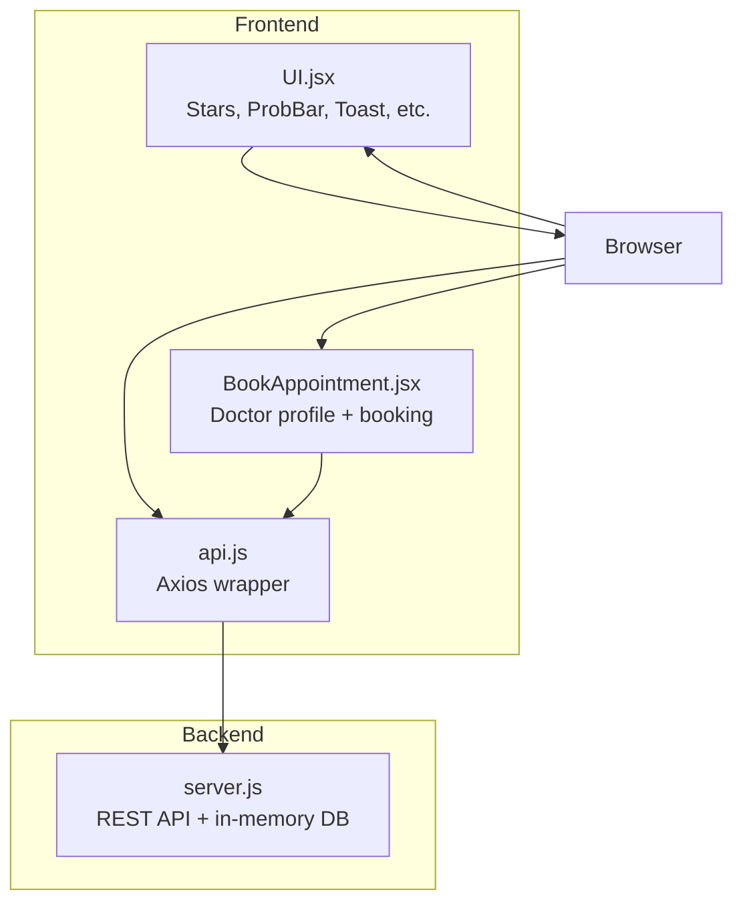
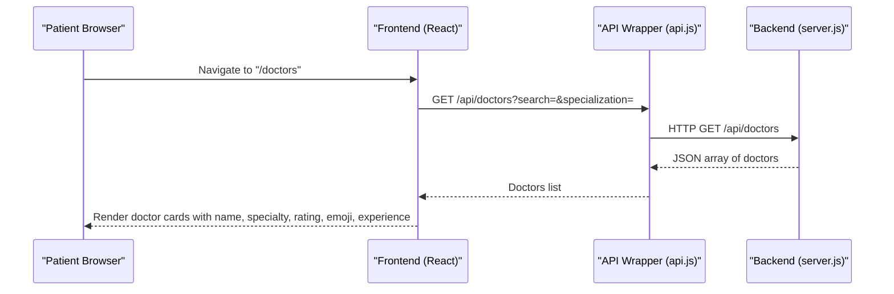
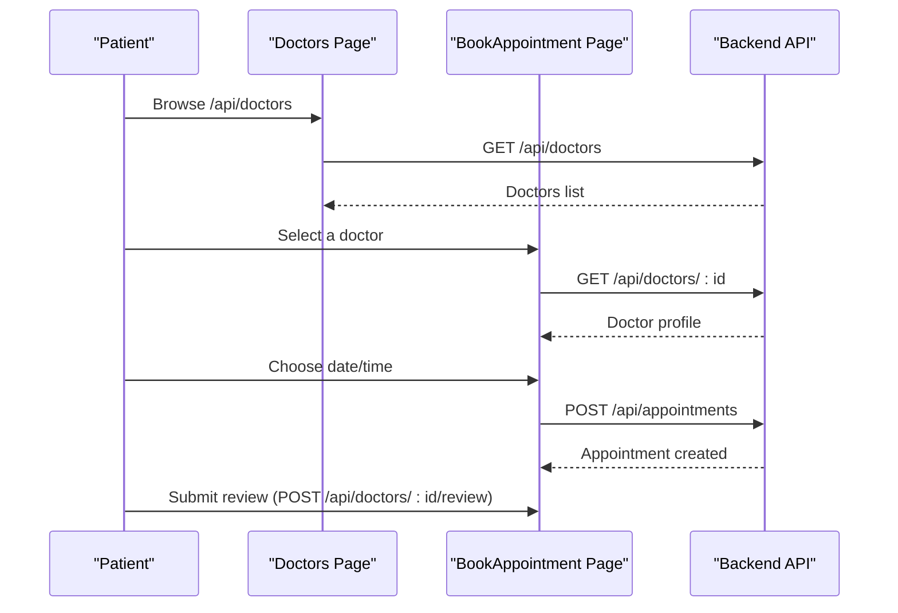
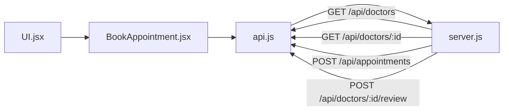

# Doctor Directory and Search

<cite>
**Referenced Files in This Document**
- [server.js](file://server.js)
- [api.js](file://api.js)
- [BookAppointment.jsx](file://BookAppointment.jsx)
- [UI.jsx](file://UI.jsx)
- [README.md](file://README.md)
</cite>

## Table of Contents
1. [Introduction](#introduction)
2. [Project Structure](#project-structure)
3. [Core Components](#core-components)
4. [Architecture Overview](#architecture-overview)
5. [Detailed Component Analysis](#detailed-component-analysis)
6. [Dependency Analysis](#dependency-analysis)
7. [Performance Considerations](#performance-considerations)
8. [Troubleshooting Guide](#troubleshooting-guide)
9. [Conclusion](#conclusion)

## Introduction
This document explains the doctor directory and search functionality of the MediBook system. It covers how patients discover doctors, how search and filtering work, how doctor profiles are presented, and how the doctor directory integrates with the appointment booking system. It also documents the public API endpoints for retrieving doctor listings and individual doctor details, along with examples and response formats.

## Project Structure
The system consists of:
- A Node.js/Express backend that exposes REST APIs and serves static frontend files
- A React frontend that consumes the backend APIs via an axios wrapper
- Shared UI components for common elements like stars, toasts, spinners, and navigation

**Diagram sources**
- [server.js](file://server.js#L1-L390)
- [api.js](file://api.js#L1-L44)
- [BookAppointment.jsx](file://BookAppointment.jsx#L1-L171)
- [UI.jsx](file://UI.jsx#L1-L182)

**Section sources**
- [README.md](file://README.md#L1-L159)

## Core Components
- Doctor listing and search endpoint: Returns a filtered list of doctors based on optional query parameters.
- Individual doctor retrieval: Returns a single doctor's profile excluding sensitive fields.
- Booking integration: The doctor directory feeds into the booking flow, where patients select a time slot and proceed to payment.
- UI components: Star ratings, probability bars, and toast notifications support the user experience.

Key implementation references:
- Doctor listing and filtering: [server.js](file://server.js#L116-L131)
- Individual doctor retrieval: [server.js](file://server.js#L125-L131)
- Booking flow and profile display: [BookAppointment.jsx](file://BookAppointment.jsx#L1-L171)
- UI helpers: [UI.jsx](file://UI.jsx#L33-L58)

**Section sources**
- [server.js](file://server.js#L116-L131)
- [BookAppointment.jsx](file://BookAppointment.jsx#L1-L171)
- [UI.jsx](file://UI.jsx#L33-L58)

## Architecture Overview
The doctor directory is a public resource accessed by patients to browse and filter available doctors. The frontend fetches data from the backend, displays it, and allows users to navigate to the booking flow for a selected doctor.

**Diagram sources**
- [api.js](file://api.js#L12-L13)
- [server.js](file://server.js#L116-L131)

## Detailed Component Analysis

### Doctor Listing and Search
- Public access: Anyone can retrieve the list of doctors.
- Filtering:
  - Name-based search: Case-insensitive substring match against the doctor's name.
  - Specialization-based search: Exact match against the doctor's specialization.
- Response: Array of doctor objects without sensitive fields (e.g., password).

Implementation highlights:
- Query parameter handling and filtering logic: [server.js](file://server.js#L116-L131)
- Example query parameters:
  - search: e.g., "cardio" matches "Cardiologist"
  - specialization: e.g., "Cardiologist"

Response format (example):
- Array of objects with fields: doctor_id, name, email, specialization, experience, available_time, rating, reviews, emoji, approved

Notes:
- The current implementation performs in-memory filtering on the entire dataset. For large databases, consider indexing and server-side pagination.

**Section sources**
- [server.js](file://server.js#L116-L131)

### Individual Doctor Profile
- Endpoint: Retrieve a single doctor by ID.
- Access: Public endpoint returning a safe subset of fields.
- Response: Doctor object without sensitive fields.

Implementation highlights:
- Single doctor retrieval: [server.js](file://server.js#L125-L131)
- Example URL: GET /api/doctors/:id

Response format (example):
- Object with fields: doctor_id, name, email, specialization, experience, available_time, rating, reviews, emoji, approved

**Section sources**
- [server.js](file://server.js#L125-L131)

### Doctor Profile Display Format
The frontend renders doctor profiles with:
- Name
- Email
- Specialization
- Experience (years)
- Rating (with star visualization)
- Emoji representation
- Availability times (comma-separated)

Implementation references:
- Profile rendering and slot selection: [BookAppointment.jsx](file://BookAppointment.jsx#L74-L90)
- Star rating component: [UI.jsx](file://UI.jsx#L33-L41)

**Section sources**
- [BookAppointment.jsx](file://BookAppointment.jsx#L74-L90)
- [UI.jsx](file://UI.jsx#L33-L41)

### Search and Filtering Mechanisms
- Name-based search: Case-insensitive substring match across name and specialization.
- Specialization filter: Exact match on specialization field.
- Combined filters: Both query parameters can be used together.

Implementation references:
- Filtering logic: [server.js](file://server.js#L116-L131)

Example scenarios:
- Search for "derma": Matches "Dermatologist" regardless of case.
- Filter by specialization: "Cardiologist" returns only cardiologists.

**Section sources**
- [server.js](file://server.js#L116-L131)

### API Endpoints Summary
- GET /api/doctors
  - Query parameters:
    - search: case-insensitive substring match on name or specialization
    - specialization: exact match on specialization
  - Response: Array of doctor objects (without password)
- GET /api/doctors/:id
  - Response: Single doctor object (without password)
- POST /api/doctors/:id/review (authenticated as patient)
  - Request body: { rating, comment }
  - Response: { message, rating }

Integration points:
- Frontend API wrapper: [api.js](file://api.js#L12-L14)
- Booking flow uses GET /api/doctors/:id and POST /api/doctors/:id/review

**Section sources**
- [server.js](file://server.js#L116-L131)
- [api.js](file://api.js#L12-L14)

### Relationship Between Doctor Directory and Appointment Booking
- Discovery: Patients browse doctors via the directory.
- Selection: Clicking a doctor navigates to the booking page.
- Booking: The booking page retrieves the selected doctor, shows available slots, and proceeds to payment.
- Reviews: After booking, patients can leave reviews for the doctor.

**Diagram sources**
- [server.js](file://server.js#L116-L131)
- [BookAppointment.jsx](file://BookAppointment.jsx#L28-L60)
- [api.js](file://api.js#L12-L14)

## Dependency Analysis
- Frontend depends on the API wrapper for all backend calls.
- The booking page depends on the doctor profile endpoint and the appointment creation endpoint.
- UI components (stars, probability bar, toasts) support the presentation and UX.

**Diagram sources**
- [BookAppointment.jsx](file://BookAppointment.jsx#L1-L171)
- [api.js](file://api.js#L1-L44)
- [server.js](file://server.js#L116-L131)
- [UI.jsx](file://UI.jsx#L1-L182)

**Section sources**
- [BookAppointment.jsx](file://BookAppointment.jsx#L1-L171)
- [api.js](file://api.js#L1-L44)
- [server.js](file://server.js#L116-L131)
- [UI.jsx](file://UI.jsx#L1-L182)

## Performance Considerations
Current state:
- Filtering is performed in-memory on the entire dataset.
- There is no pagination or server-side indexing.

Recommendations for large datasets:
- Pagination: Introduce limit and offset query parameters to split results into pages.
- Indexing: Maintain indices on name and specialization for efficient filtering.
- Caching: Cache frequently accessed doctor lists with appropriate invalidation.
- Sorting: Allow sorting by rating, experience, or name to improve discoverability.

[No sources needed since this section provides general guidance]

## Troubleshooting Guide
Common issues and resolutions:
- Doctor not found:
  - Verify the doctor ID exists in the system.
  - Endpoint: GET /api/doctors/:id
- Invalid search/filter parameters:
  - Ensure search is a non-empty string and specialization matches existing values.
- Booking conflicts:
  - The system prevents double-booking the same slot; choose another time.
- Review submission errors:
  - Ensure the patient is authenticated and the rating/comment are valid.

**Section sources**
- [server.js](file://server.js#L125-L131)
- [server.js](file://server.js#L170-L202)
- [server.js](file://server.js#L155-L164)

## Conclusion
The doctor directory and search system provides a straightforward, case-insensitive way for patients to discover and filter doctors. The integration with the booking flow is seamless, enabling users to select a doctor, pick an available time slot, and proceed to payment. For production deployments with larger datasets, consider adding pagination, indexing, and caching to maintain responsiveness.