# Doctor Management System

<cite>
**Referenced Files in This Document**
- [README.md](file://README.md)
- [server.js](file://server.js)
- [App.jsx](file://App.jsx)
- [AuthContext.jsx](file://AuthContext.jsx)
- [api.js](file://api.js)
- [UI.jsx](file://UI.jsx)
- [Admin.jsx](file://Admin.jsx)
- [DoctorPanel.jsx](file://DoctorPanel.jsx)
- [Profile.jsx](file://Profile.jsx)
- [BookAppointment.jsx](file://BookAppointment.jsx)
- [Payment.jsx](file://Payment.jsx)
- [index.html](file://index.html)
- [app.js](file://app.js)
- [data.js](file://data.js)
- [package.json](file://package.json)
</cite>

## Table of Contents
1. [Introduction](#introduction)
2. [Project Structure](#project-structure)
3. [Core Components](#core-components)
4. [Architecture Overview](#architecture-overview)
5. [Detailed Component Analysis](#detailed-component-analysis)
6. [Dependency Analysis](#dependency-analysis)
7. [Performance Considerations](#performance-considerations)
8. [Troubleshooting Guide](#troubleshooting-guide)
9. [Conclusion](#conclusion)
10. [Appendices](#appendices)

## Introduction
This document provides comprehensive documentation for the Doctor Management System within the MediBook online doctor appointment platform. It covers the doctor directory functionality (listing, searching, filtering), doctor profile management, availability scheduling, appointment booking integration, rating and review system, doctor dashboard for managing requests, administrative controls, and onboarding workflows. The system is implemented as a full-stack application using React for the frontend and Node.js/Express for the backend, with an in-memory database during development.

## Project Structure
The project follows a modular structure separating frontend and backend concerns:
- Frontend (React): Pages, components, routing, and UI utilities
- Backend (Node.js/Express): REST API endpoints, middleware, and in-memory data storage
- Shared API client and authentication context bridge the frontend and backend

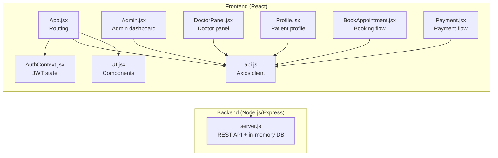

**Diagram sources**
- [App.jsx](file://App.jsx#L1-L44)
- [AuthContext.jsx](file://AuthContext.jsx#L1-L41)
- [api.js](file://api.js#L1-L44)
- [UI.jsx](file://UI.jsx#L1-L182)
- [Admin.jsx](file://Admin.jsx#L1-L194)
- [DoctorPanel.jsx](file://DoctorPanel.jsx#L1-L96)
- [Profile.jsx](file://Profile.jsx#L1-L97)
- [BookAppointment.jsx](file://BookAppointment.jsx#L1-L171)
- [Payment.jsx](file://Payment.jsx#L1-L350)
- [server.js](file://server.js#L1-L390)

**Section sources**
- [README.md](file://README.md#L7-L33)
- [App.jsx](file://App.jsx#L1-L44)
- [server.js](file://server.js#L1-L30)

## Core Components
- Authentication and Authorization: JWT-based authentication for patients, doctors, and admins with role-specific routes and middleware protection
- Doctor Directory: Public listing with search by name/specialization and filtering by specialization
- Doctor Profile Management: Specialization-based organization, availability scheduling, and rating/review aggregation
- Appointment Booking: Time slot selection, conflict detection, and confirmation probability calculation
- Doctor Dashboard: Viewing and managing incoming appointment requests with status updates
- Administrative Controls: System overview, appointment management, patient listing, doctor removal
- Rating and Review System: Patient feedback collection and aggregated doctor ratings
- Payment Integration: Multiple payment methods with simulated processing and receipt generation

**Section sources**
- [server.js](file://server.js#L49-L62)
- [server.js](file://server.js#L116-L123)
- [server.js](file://server.js#L133-L153)
- [server.js](file://server.js#L155-L164)
- [server.js](file://server.js#L170-L202)
- [Admin.jsx](file://Admin.jsx#L1-L194)
- [DoctorPanel.jsx](file://DoctorPanel.jsx#L1-L96)
- [BookAppointment.jsx](file://BookAppointment.jsx#L1-L171)
- [Payment.jsx](file://Payment.jsx#L1-L350)

## Architecture Overview
The system employs a client-server architecture with React frontend and Node.js/Express backend. The frontend handles UI rendering, user interactions, and state management, while the backend manages data persistence (in-memory), business logic, and external integrations (Stripe simulation).

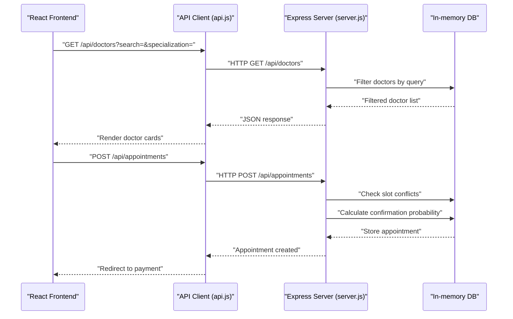

**Diagram sources**
- [api.js](file://api.js#L11-L23)
- [server.js](file://server.js#L116-L123)
- [server.js](file://server.js#L170-L202)
- [BookAppointment.jsx](file://BookAppointment.jsx#L28-L60)
- [Payment.jsx](file://Payment.jsx#L79-L98)

## Detailed Component Analysis

### Doctor Directory and Search
The doctor directory supports:
- Listing all doctors with public-safe attributes
- Search by name or specialization
- Filtering by specialization
- Display optimization with star ratings and slot counts

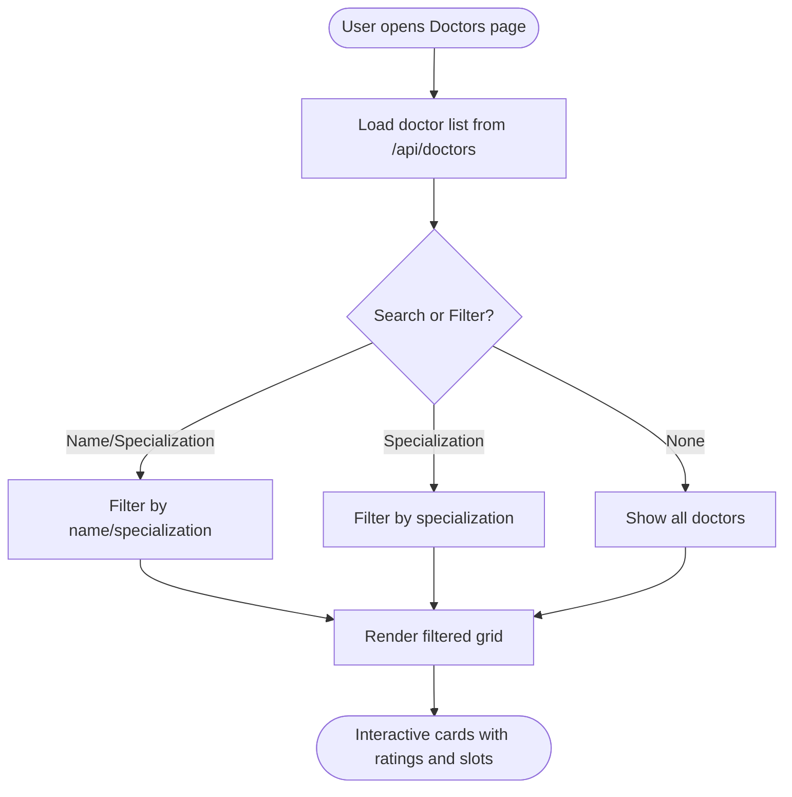

**Diagram sources**
- [server.js](file://server.js#L116-L123)
- [index.html](file://index.html#L251-L267)
- [app.js](file://app.js#L374-L401)

**Section sources**
- [server.js](file://server.js#L116-L123)
- [index.html](file://index.html#L251-L267)
- [app.js](file://app.js#L374-L401)

### Doctor Profile Management and Availability
Doctor profiles include:
- Specialization-based organization
- Experience and emoji representation
- Available time slots stored as comma-separated strings
- Rating aggregation from patient reviews
- Doctor panel for managing appointment requests

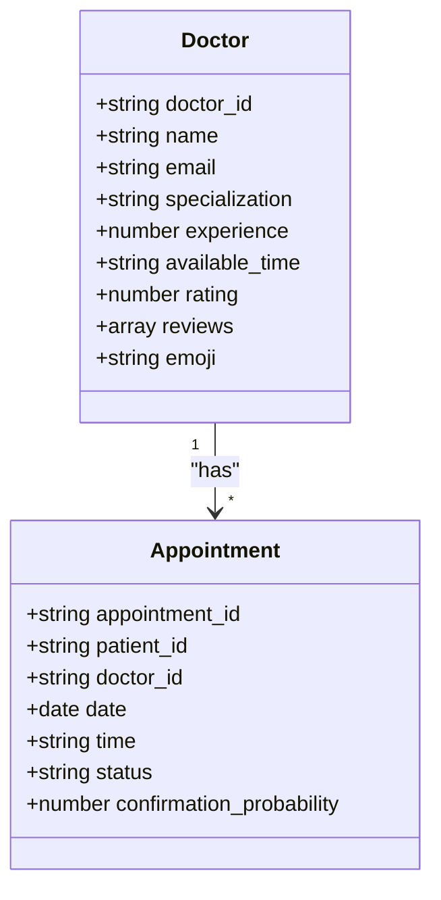

**Diagram sources**
- [server.js](file://server.js#L118-L127)
- [server.js](file://server.js#L133-L142)
- [server.js](file://server.js#L155-L164)

**Section sources**
- [server.js](file://server.js#L118-L127)
- [server.js](file://server.js#L133-L142)
- [server.js](file://server.js#L155-L164)

### Appointment Booking and Conflict Resolution
The booking system:
- Validates doctor existence and slot availability
- Prevents double-booking through conflict checks
- Calculates confirmation probability based on doctor load vs. available slots
- Integrates with payment processing

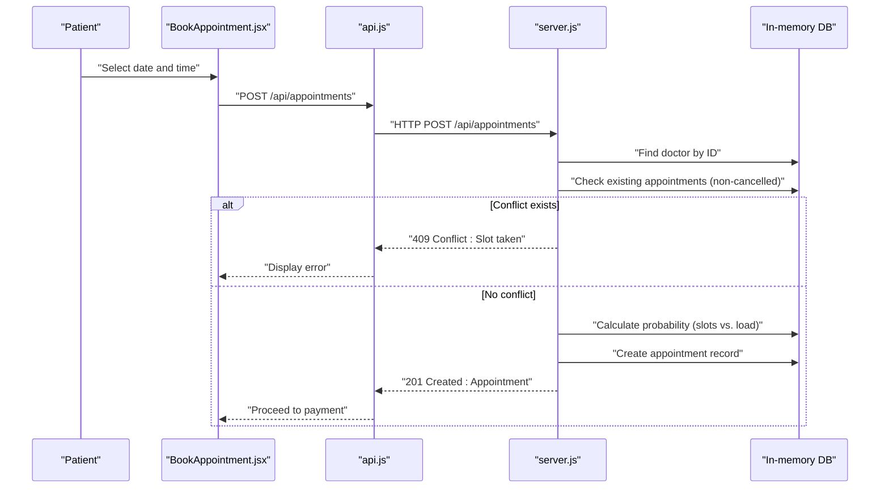

**Diagram sources**
- [BookAppointment.jsx](file://BookAppointment.jsx#L39-L60)
- [api.js](file://api.js#L17-L19)
- [server.js](file://server.js#L170-L202)

**Section sources**
- [BookAppointment.jsx](file://BookAppointment.jsx#L39-L60)
- [server.js](file://server.js#L170-L202)

### Rating and Review System
The rating and review system:
- Collects patient feedback with star ratings and optional comments
- Aggregates average ratings per doctor
- Displays reviews on doctor profile pages

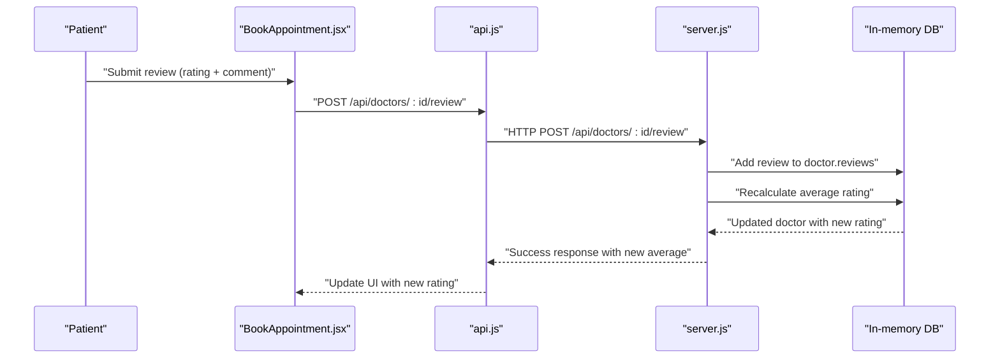

**Diagram sources**
- [BookAppointment.jsx](file://BookAppointment.jsx#L62-L69)
- [api.js](file://api.js#L14)
- [server.js](file://server.js#L155-L164)

**Section sources**
- [BookAppointment.jsx](file://BookAppointment.jsx#L62-L69)
- [server.js](file://server.js#L155-L164)

### Doctor Dashboard and Request Management
The doctor dashboard enables:
- Viewing incoming appointment requests
- Filtering by status (pending, approved, cancelled)
- Approving or rejecting appointments
- Real-time statistics on appointment counts

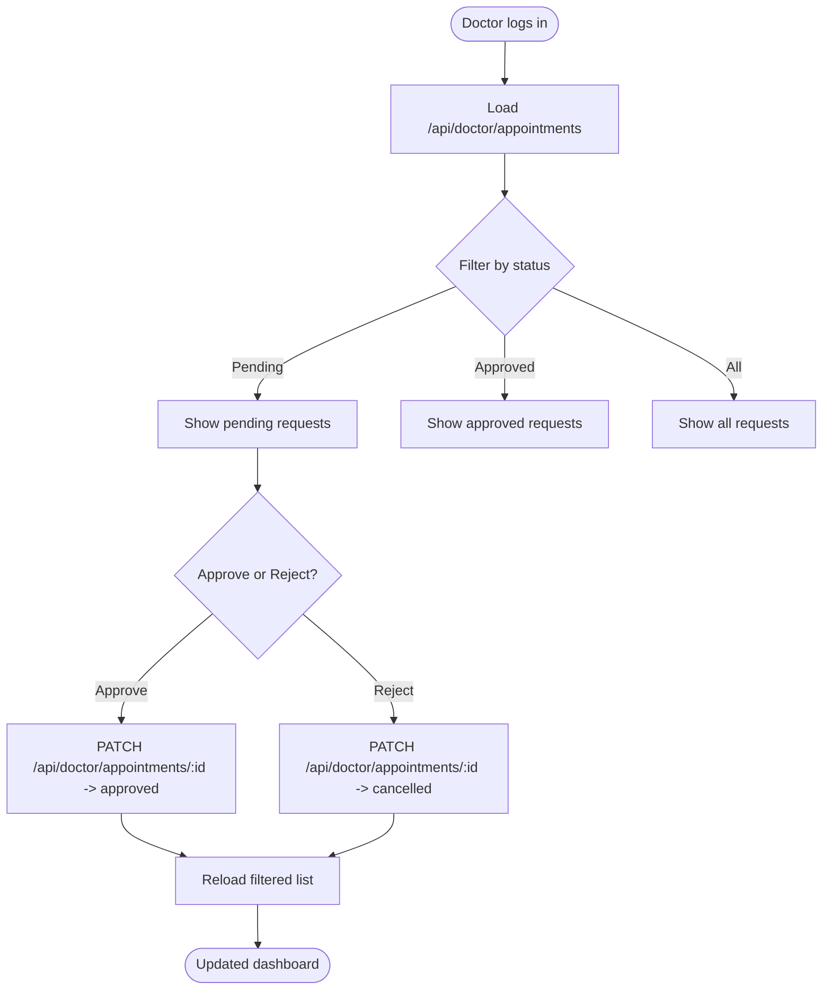

**Diagram sources**
- [DoctorPanel.jsx](file://DoctorPanel.jsx#L15-L31)
- [api.js](file://api.js#L22-L23)
- [server.js](file://server.js#L133-L153)

**Section sources**
- [DoctorPanel.jsx](file://DoctorPanel.jsx#L15-L31)
- [server.js](file://server.js#L133-L153)

### Administrative Functions
Administrative controls include:
- System overview with statistics
- Appointment management (status updates)
- Patient listing
- Doctor listing and removal
- Payment reconciliation

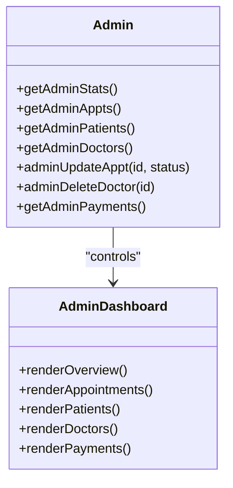

**Diagram sources**
- [Admin.jsx](file://Admin.jsx#L19-L41)
- [api.js](file://api.js#L30-L36)
- [server.js](file://server.js#L244-L280)

**Section sources**
- [Admin.jsx](file://Admin.jsx#L19-L41)
- [server.js](file://server.js#L244-L280)

### Payment Integration and Receipt Generation
The payment system supports:
- Multiple payment methods (card, EasyPaisa, JazzCash, bank transfer)
- Simulated payment processing
- Receipt generation and printing
- Automatic appointment approval upon successful payment

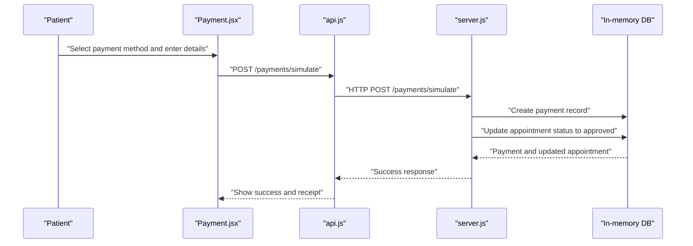

**Diagram sources**
- [Payment.jsx](file://Payment.jsx#L79-L98)
- [api.js](file://api.js#L41-L43)
- [server.js](file://server.js#L297-L353)

**Section sources**
- [Payment.jsx](file://Payment.jsx#L79-L98)
- [server.js](file://server.js#L297-L353)

### Conceptual Overview
The system integrates doctor profiles with the appointment booking workflow, enabling seamless search, selection, booking, and payment processes. Administrators oversee system-wide operations, while doctors manage their individual schedules and requests.

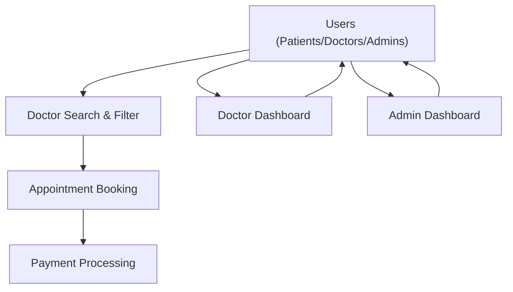

[No sources needed since this diagram shows conceptual workflow, not actual code structure]

[No sources needed since this section doesn't analyze specific source files]

## Dependency Analysis
The frontend depends on:
- Axios for HTTP requests
- React Router for navigation
- Local storage for authentication tokens and theme preferences
- Stripe SDK for payment processing (optional)

The backend depends on:
- Express for HTTP server
- Bcrypt for password hashing
- JWT for authentication tokens
- UUID for generating unique identifiers

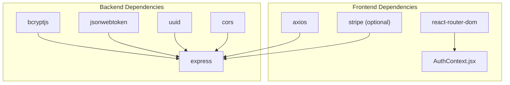

**Diagram sources**
- [package.json](file://package.json#L14-L22)
- [AuthContext.jsx](file://AuthContext.jsx#L1-L41)
- [api.js](file://api.js#L1-L44)

**Section sources**
- [package.json](file://package.json#L14-L22)
- [AuthContext.jsx](file://AuthContext.jsx#L1-L41)
- [api.js](file://api.js#L1-L44)

## Performance Considerations
- In-memory database: Suitable for development/demo; consider migrating to a persistent database (MySQL/MariaDB) for production
- Frontend filtering: Client-side filtering is efficient for small datasets; consider server-side pagination for larger doctor inventories
- Image loading: Doctor avatars and icons are embedded; optimize image sizes for production deployment
- Payment processing: Stripe integration requires proper environment configuration; ensure secure handling of sensitive payment data
- Token management: JWT tokens are stored in local storage; implement refresh token mechanisms for enhanced security

[No sources needed since this section provides general guidance]

## Troubleshooting Guide
Common issues and resolutions:
- Authentication failures: Verify JWT token presence and expiration; check role-based route access
- Doctor search/filter errors: Ensure query parameters are properly formatted; validate backend filtering logic
- Booking conflicts: Confirm slot availability checks and non-cancelled status filtering
- Payment processing: Validate payment method selection and required fields; check simulated payment endpoint
- Admin permissions: Verify admin role validation and protected routes

**Section sources**
- [AuthContext.jsx](file://AuthContext.jsx#L21-L31)
- [server.js](file://server.js#L49-L62)
- [server.js](file://server.js#L170-L202)
- [Payment.jsx](file://Payment.jsx#L62-L98)

## Conclusion
The Doctor Management System provides a comprehensive solution for managing doctor directories, profiles, availability, and appointment workflows. Its modular architecture supports scalability, while the integrated rating and review system enhances transparency and trust. The administrative dashboard ensures centralized oversight, and the payment integration streamlines financial transactions. For production deployment, focus on database migration, enhanced security measures, and performance optimizations.

[No sources needed since this section summarizes without analyzing specific files]

## Appendices

### API Endpoint Reference
- Authentication: POST /api/auth/register, POST /api/auth/login, POST /api/auth/doctor-login, POST /api/auth/admin-login
- Doctors: GET /api/doctors, GET /api/doctors/:id, POST /api/doctors/:id/review
- Appointments: POST /api/appointments, GET /api/appointments, PATCH /api/appointments/:id/cancel
- Doctor Panel: GET /api/doctor/appointments, PATCH /api/doctor/appointments/:id
- Admin: GET /api/admin/stats, GET /api/admin/appointments, GET /api/admin/patients, GET /api/admin/doctors, PATCH /api/admin/appointments/:id, DELETE /api/admin/doctors/:id
- Payments: POST /api/payments/create-intent, POST /api/payments/simulate, GET /api/payments/:appointment_id, GET /api/admin/payments, GET /api/payments/fee/:doctor_id

**Section sources**
- [server.js](file://server.js#L68-L110)
- [server.js](file://server.js#L116-L164)
- [server.js](file://server.js#L170-L218)
- [server.js](file://server.js#L244-L280)
- [server.js](file://server.js#L297-L377)

### Database Schema (In-Memory)
- Patients: patient_id, name, email, phone, age, password, created_at
- Doctors: doctor_id, name, email, password, specialization, experience, available_time, rating
- Appointments: appointment_id, patient_id, doctor_id, date, time, status, confirmation_probability, created_at, updated_at
- Admins: admin_id, username, password

**Section sources**
- [README.md](file://README.md#L103-L148)
- [server.js](file://server.js#L29-L44)