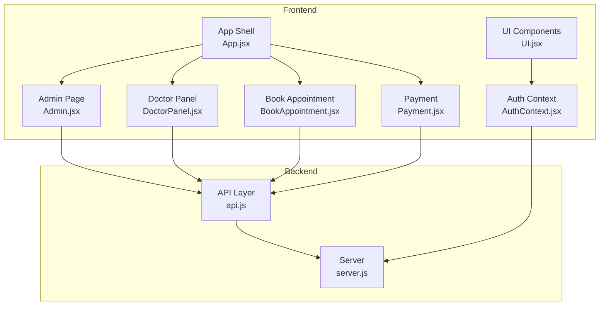
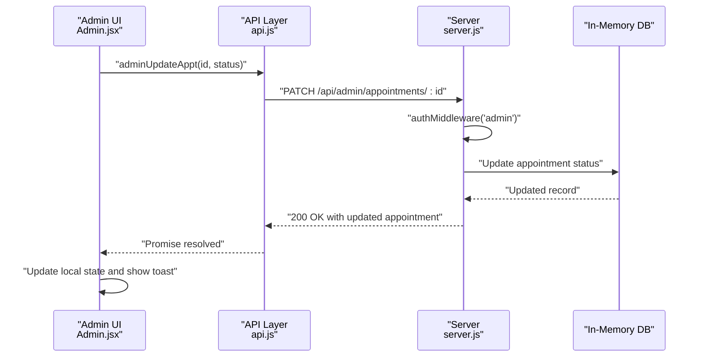
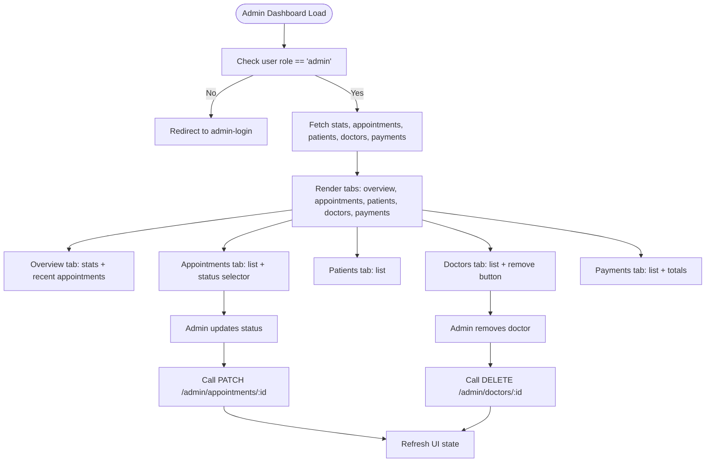
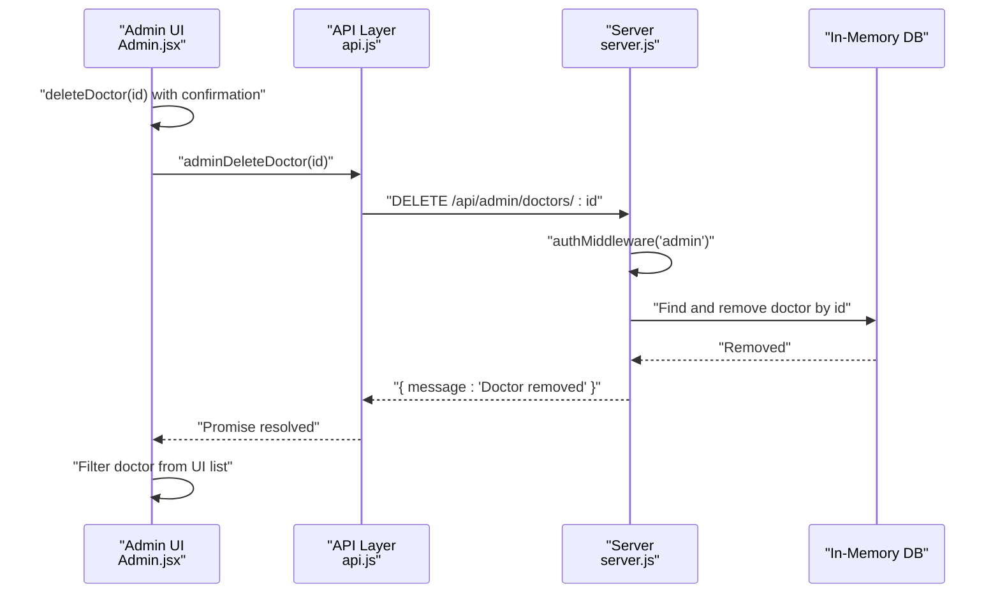
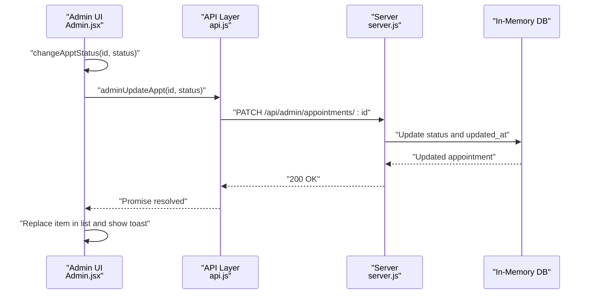
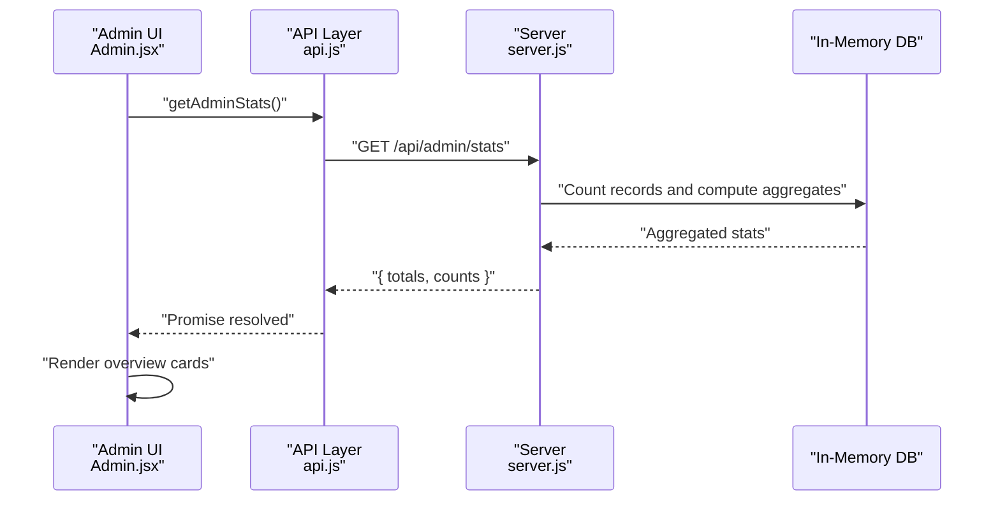
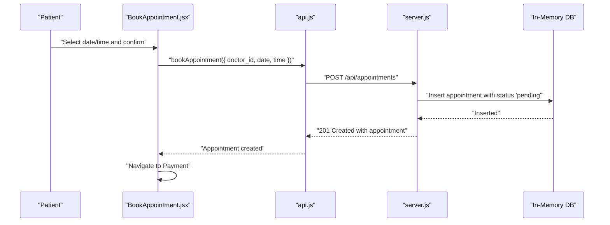
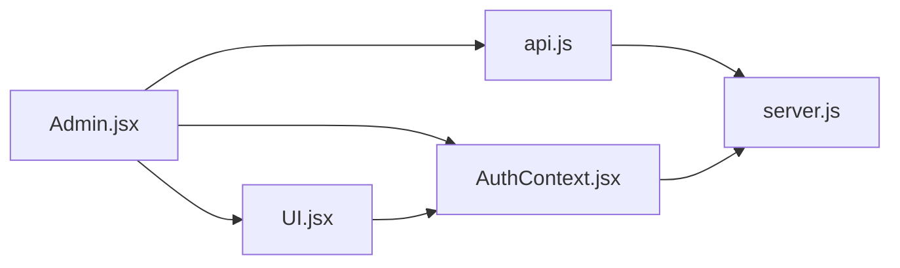

# Administrator Doctor Management

<cite>
**Referenced Files in This Document**
- [Admin.jsx](file://Admin.jsx)
- [server.js](file://server.js)
- [api.js](file://api.js)
- [AuthContext.jsx](file://AuthContext.jsx)
- [UI.jsx](file://UI.jsx)
- [DoctorPanel.jsx](file://DoctorPanel.jsx)
- [BookAppointment.jsx](file://BookAppointment.jsx)
- [Payment.jsx](file://Payment.jsx)
- [App.jsx](file://App.jsx)
- [README.md](file://README.md)
- [package.json](file://package.json)
</cite>

## Table of Contents
1. [Introduction](#introduction)
2. [Project Structure](#project-structure)
3. [Core Components](#core-components)
4. [Architecture Overview](#architecture-overview)
5. [Detailed Component Analysis](#detailed-component-analysis)
6. [Dependency Analysis](#dependency-analysis)
7. [Performance Considerations](#performance-considerations)
8. [Troubleshooting Guide](#troubleshooting-guide)
9. [Conclusion](#conclusion)
10. [Appendices](#appendices)

## Introduction
This document describes the administrator doctor management system within a full-stack healthcare appointment platform. It focuses on the administrative controls for managing doctors, including approval workflows, account status management, oversight functions, and integration with system-wide updates. It also covers administrative statistics, monitoring features, security considerations for administrative access, and audit trail requirements.

## Project Structure
The system comprises a React frontend and a Node.js/Express backend. The admin module resides in the frontend under the Admin page and interacts with backend endpoints secured by JWT middleware. The backend maintains an in-memory database and exposes REST endpoints for administrative tasks.

**Diagram sources**
- [App.jsx](file://App.jsx#L15-L43)
- [Admin.jsx](file://Admin.jsx#L1-L194)
- [DoctorPanel.jsx](file://DoctorPanel.jsx#L1-L96)
- [BookAppointment.jsx](file://BookAppointment.jsx#L1-L171)
- [Payment.jsx](file://Payment.jsx#L1-L350)
- [server.js](file://server.js#L1-L390)
- [api.js](file://api.js#L1-L44)
- [AuthContext.jsx](file://AuthContext.jsx#L1-L41)
- [UI.jsx](file://UI.jsx#L1-L182)

**Section sources**
- [README.md](file://README.md#L1-L159)
- [App.jsx](file://App.jsx#L1-L44)

## Core Components
- Admin Dashboard: Provides administrative overview, appointment management, patient listing, doctor listing, and payment monitoring.
- Authentication Context: Manages JWT tokens and user roles for route protection and UI behavior.
- API Layer: Centralizes HTTP calls to backend endpoints for admin operations.
- Backend Middleware: Enforces role-based access control for admin-only endpoints.

Key responsibilities:
- Admin-only endpoints for stats, appointments, patients, doctors, and payments.
- Doctor removal action and its impact on related data.
- Appointment status updates triggered by admin actions.
- Audit-ready operations with timestamps and status transitions.

**Section sources**
- [Admin.jsx](file://Admin.jsx#L1-L194)
- [AuthContext.jsx](file://AuthContext.jsx#L1-L41)
- [api.js](file://api.js#L29-L44)
- [server.js](file://server.js#L49-L62)

## Architecture Overview
The admin module integrates frontend UI with backend APIs through a JWT-secured pipeline. Administrative actions trigger backend updates that propagate system-wide changes (e.g., appointment status updates).

**Diagram sources**
- [Admin.jsx](file://Admin.jsx#L26-L32)
- [api.js](file://api.js#L34-L34)
- [server.js](file://server.js#L267-L273)

## Detailed Component Analysis

### Admin Dashboard
The Admin page renders an overview tab with system metrics and recent appointments, plus dedicated tabs for appointments, patients, doctors, and payments. It enforces admin-only access and preloads data on mount.

Key features:
- Overview cards for totals and statuses.
- Appointment list with inline status selector for admin updates.
- Doctor listing with removal action.
- Patient listing and payment listing with totals.

Administrative actions:
- Change appointment status via a dropdown and a single API call.
- Remove a doctor, which deletes the doctor record and affects future bookings.

**Diagram sources**
- [Admin.jsx](file://Admin.jsx#L19-L41)
- [Admin.jsx](file://Admin.jsx#L100-L120)
- [Admin.jsx](file://Admin.jsx#L142-L159)
- [api.js](file://api.js#L30-L36)
- [server.js](file://server.js#L267-L280)

**Section sources**
- [Admin.jsx](file://Admin.jsx#L1-L194)

### Doctor Removal Workflow
Removing a doctor triggers a backend deletion endpoint. The frontend confirms the action and updates the UI accordingly.

Impact on related data:
- Future booking attempts for the removed doctor will fail.
- Reviews and ratings remain attached to the doctor record in memory.
- No cascading deletions occur for existing appointments or payments.

**Diagram sources**
- [Admin.jsx](file://Admin.jsx#L34-L41)
- [api.js](file://api.js#L35-L35)
- [server.js](file://server.js#L275-L280)

**Section sources**
- [Admin.jsx](file://Admin.jsx#L34-L41)
- [server.js](file://server.js#L275-L280)

### Appointment Status Management
Admins can change appointment statuses directly from the admin dashboard. The operation updates the in-memory database and reflects immediately in the UI.

**Diagram sources**
- [Admin.jsx](file://Admin.jsx#L26-L32)
- [api.js](file://api.js#L34-L34)
- [server.js](file://server.js#L267-L273)

**Section sources**
- [Admin.jsx](file://Admin.jsx#L26-L32)
- [server.js](file://server.js#L267-L273)

### Administrative Statistics and Monitoring
The admin overview tab displays key metrics derived from the backend stats endpoint. These include totals for patients, doctors, appointments, and counts for pending, approved, and cancelled statuses.

**Diagram sources**
- [Admin.jsx](file://Admin.jsx#L11-L24)
- [api.js](file://api.js#L30-L30)
- [server.js](file://server.js#L244-L253)

**Section sources**
- [Admin.jsx](file://Admin.jsx#L62-L97)
- [server.js](file://server.js#L244-L253)

### Doctor Administration Interface
The admin doctor listing page allows administrators to:
- View doctor profiles (name, specialization, experience, rating).
- Remove a doctor with confirmation.

Integration points:
- Uses the admin doctors endpoint to populate the list.
- Calls the admin delete endpoint upon confirmation.

**Section sources**
- [Admin.jsx](file://Admin.jsx#L142-L159)
- [api.js](file://api.js#L33-L35)
- [server.js](file://server.js#L263-L265)

### Administrative Payments Monitoring
The admin payments tab lists all payments, enriching each record with patient and doctor names. It also computes a total revenue figure.

**Section sources**
- [Admin.jsx](file://Admin.jsx#L161-L189)
- [server.js](file://server.js#L362-L370)

### Doctor Approval Workflow (System Integration)
While the doctor approval workflow is primarily handled by the doctor panel, the admin module ensures system-wide consistency by:
- Monitoring appointment statuses.
- Removing doctors who violate policies.
- Observing payment and review trends.

**Diagram sources**
- [BookAppointment.jsx](file://BookAppointment.jsx#L39-L60)
- [api.js](file://api.js#L17-L17)
- [server.js](file://server.js#L170-L202)

**Section sources**
- [DoctorPanel.jsx](file://DoctorPanel.jsx#L22-L28)
- [server.js](file://server.js#L144-L153)

## Dependency Analysis
The admin module depends on:
- API layer for backend communication.
- Authentication context for role checks and token propagation.
- UI components for notifications and badges.

**Diagram sources**
- [Admin.jsx](file://Admin.jsx#L1-L10)
- [api.js](file://api.js#L1-L44)
- [AuthContext.jsx](file://AuthContext.jsx#L1-L41)
- [UI.jsx](file://UI.jsx#L1-L182)
- [server.js](file://server.js#L1-L390)

**Section sources**
- [Admin.jsx](file://Admin.jsx#L1-L10)
- [AuthContext.jsx](file://AuthContext.jsx#L1-L41)
- [api.js](file://api.js#L1-L44)
- [server.js](file://server.js#L1-L390)

## Performance Considerations
- In-memory storage: Suitable for development/demo; consider replacing with a persistent database for production to improve reliability and scalability.
- Batch operations: The admin dashboard preloads multiple datasets concurrently; ensure backend response times remain acceptable.
- UI responsiveness: Local state updates (e.g., changing appointment status) provide immediate feedback; network latency may vary.

[No sources needed since this section provides general guidance]

## Troubleshooting Guide
Common issues and resolutions:
- Access denied errors: Ensure the admin user is logged in and the Authorization header is present.
- Token expiration: Re-authenticate to refresh the JWT token.
- Network failures: Verify backend availability and CORS configuration.
- Doctor removal failures: Confirm the doctor exists and the admin role is enforced.

Security and audit:
- Admin endpoints are protected by JWT middleware enforcing the admin role.
- Timestamps are updated on status changes for auditability.
- Payment simulation does not persist sensitive card data; real Stripe integration would require secure PCI compliance.

**Section sources**
- [server.js](file://server.js#L49-L62)
- [server.js](file://server.js#L267-L273)
- [server.js](file://server.js#L318-L353)

## Conclusion
The administrator doctor management system provides a comprehensive control plane for overseeing the platform’s operations. Administrators can monitor system health, manage appointments, oversee doctors, and track payments. The system’s design emphasizes role-based access control, immediate UI feedback, and straightforward integration with backend updates. For production readiness, integrate a persistent database, enforce stricter audit logging, and implement robust payment security measures.

[No sources needed since this section summarizes without analyzing specific files]

## Appendices

### Admin-Only API Endpoints
- GET /api/admin/stats
- GET /api/admin/appointments
- GET /api/admin/patients
- GET /api/admin/doctors
- PATCH /api/admin/appointments/:id
- DELETE /api/admin/doctors/:id
- GET /api/admin/payments

These endpoints are protected by the admin middleware and require a valid JWT bearer token.

**Section sources**
- [server.js](file://server.js#L244-L280)
- [server.js](file://server.js#L362-L370)

### Security Considerations
- JWT-based authentication with role enforcement.
- Authorization header propagation via Axios defaults.
- Admin-only routes prevent unauthorized access.
- Payment simulation avoids storing sensitive card data; Stripe integration requires environment configuration.

**Section sources**
- [AuthContext.jsx](file://AuthContext.jsx#L11-L14)
- [server.js](file://server.js#L49-L62)
- [server.js](file://server.js#L13-L15)
- [server.js](file://server.js#L298-L353)

### Integration Notes
- Admin actions update the in-memory database; for persistence, connect to a relational database.
- Appointment status changes propagate to downstream UI components and payment flows.
- Doctor removal impacts future bookings and visibility but does not automatically cancel existing appointments.

**Section sources**
- [server.js](file://server.js#L267-L280)
- [server.js](file://server.js#L170-L202)