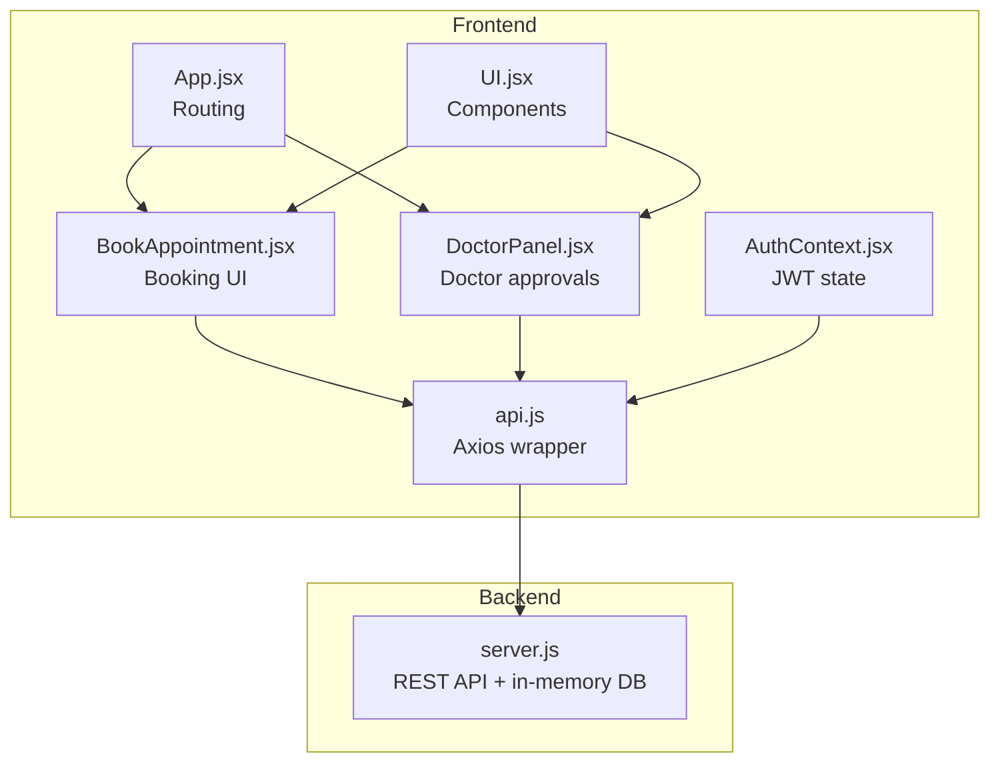
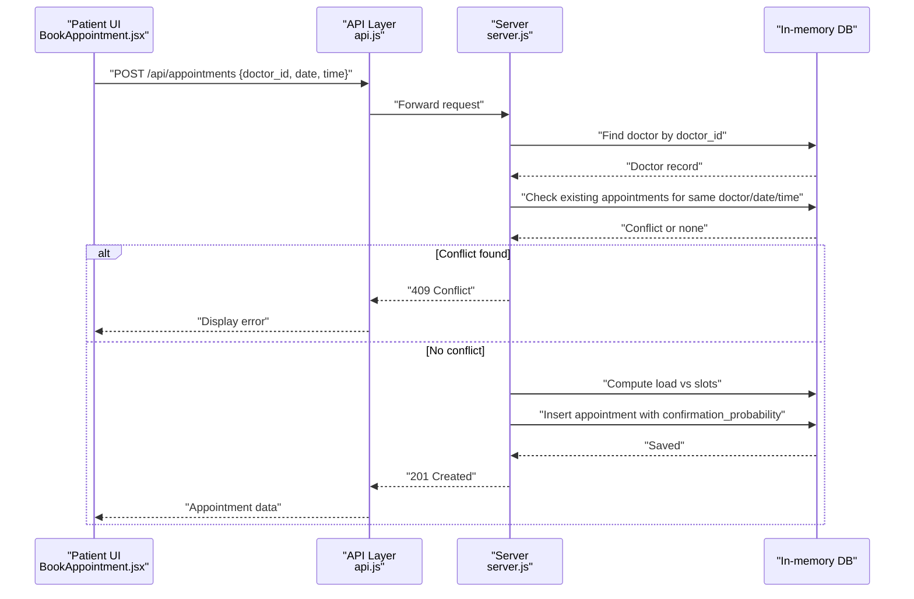
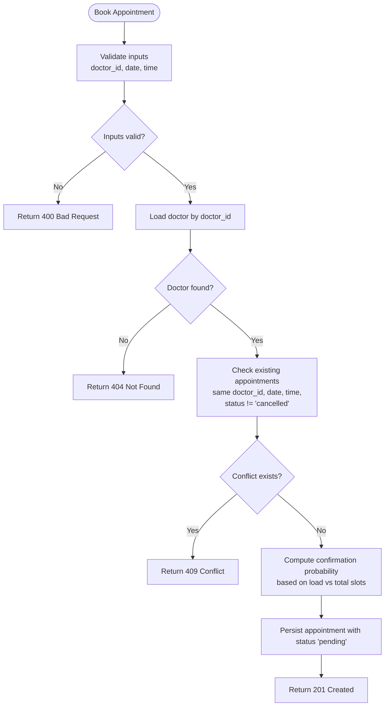
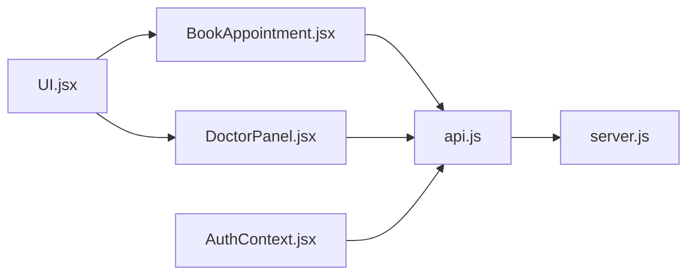

# Doctor Availability and Scheduling Management

<cite>
**Referenced Files in This Document**
- [server.js](file://server.js)
- [BookAppointment.jsx](file://BookAppointment.jsx)
- [DoctorPanel.jsx](file://DoctorPanel.jsx)
- [api.js](file://api.js)
- [AuthContext.jsx](file://AuthContext.jsx)
- [UI.jsx](file://UI.jsx)
- [README.md](file://README.md)
- [index.html](file://index.html)
- [package.json](file://package.json)
</cite>

## Table of Contents
1. [Introduction](#introduction)
2. [Project Structure](#project-structure)
3. [Core Components](#core-components)
4. [Architecture Overview](#architecture-overview)
5. [Detailed Component Analysis](#detailed-component-analysis)
6. [Dependency Analysis](#dependency-analysis)
7. [Performance Considerations](#performance-considerations)
8. [Troubleshooting Guide](#troubleshooting-guide)
9. [Conclusion](#conclusion)
10. [Appendices](#appendices)

## Introduction
This document explains the doctor availability and scheduling system implemented in the MediBook application. It focuses on how time slots are configured via the available_time string, how scheduling conflicts are detected, how appointment booking integrates with doctor availability, and how real-time confirmation probabilities are calculated. It also covers scheduling updates for doctors, impact on existing appointments, and operational procedures for maintaining schedules.

## Project Structure
The system comprises:
- Backend: Node.js/Express REST API with in-memory storage for patients, doctors, appointments, and admins.
- Frontend: React SPA with routing and UI components for booking, doctor panel, and admin dashboards.
- Shared API layer: Axios-based client wrapper for all HTTP calls.
- Authentication: JWT-based context with persisted tokens and theme preferences.

**Diagram sources**
- [App.jsx](file://App.jsx#L15-L44)
- [BookAppointment.jsx](file://BookAppointment.jsx#L1-L171)
- [DoctorPanel.jsx](file://DoctorPanel.jsx#L1-L96)
- [api.js](file://api.js#L1-L44)
- [AuthContext.jsx](file://AuthContext.jsx#L1-L41)
- [UI.jsx](file://UI.jsx#L1-L182)
- [server.js](file://server.js#L1-L390)

**Section sources**
- [README.md](file://README.md#L1-L159)
- [package.json](file://package.json#L1-L24)

## Core Components
- Doctor availability model: Each doctor record stores an available_time string containing comma-separated time entries (e.g., "9:00 AM,11:00 AM,2:00 PM,4:30 PM").
- Appointment booking: Patients select a date and a time slot from the doctor’s available_time list; the system checks for conflicts and computes a confirmation probability based on current load vs. total slots.
- Doctor panel: Doctors can view incoming requests and approve/reject them.
- Real-time probability: The frontend displays a dynamic probability bar reflecting load-based likelihood of confirmation.

Key implementation references:
- Doctor availability parsing and slot rendering: [BookAppointment.jsx](file://BookAppointment.jsx#L74-L114)
- Booking endpoint and conflict detection: [server.js](file://server.js#L170-L202)
- Doctor load-based probability calculation: [server.js](file://server.js#L181-L184)
- Doctor panel approval flow: [DoctorPanel.jsx](file://DoctorPanel.jsx#L22-L28)

**Section sources**
- [BookAppointment.jsx](file://BookAppointment.jsx#L74-L127)
- [server.js](file://server.js#L170-L202)
- [DoctorPanel.jsx](file://DoctorPanel.jsx#L22-L28)

## Architecture Overview
The system follows a classic client-server architecture:
- Clients (React SPA) communicate with the backend via REST endpoints.
- Authentication middleware enforces role-based access.
- In-memory database simulates persistence; production deployments should connect to MySQL/MongoDB.

**Diagram sources**
- [BookAppointment.jsx](file://BookAppointment.jsx#L39-L60)
- [api.js](file://api.js#L17-L19)
- [server.js](file://server.js#L170-L202)

## Detailed Component Analysis

### Time Slot Configuration Mechanism
- Data model: Doctor records include an available_time field storing a comma-separated list of time strings.
- Frontend parsing: The UI splits available_time by commas and trims whitespace to present selectable slots.
- Backend parsing: The booking endpoint splits available_time to compute total slots for probability calculations.

Implementation highlights:
- Frontend slot rendering: [BookAppointment.jsx](file://BookAppointment.jsx#L74-L114)
- Backend slot count and probability: [server.js](file://server.js#L182-L184)

Edge cases handled:
- Whitespace normalization during split and trim ensures robust parsing regardless of spacing in the stored string.

**Section sources**
- [BookAppointment.jsx](file://BookAppointment.jsx#L74-L114)
- [server.js](file://server.js#L182-L184)

### Schedule Management and Conflict Detection
- Conflict detection: Before creating an appointment, the backend filters appointments by doctor_id, date, and time, excluding cancelled entries.
- Outcome: If a match exists, the system returns a conflict error; otherwise, the appointment is created.

**Diagram sources**
- [server.js](file://server.js#L170-L202)

**Section sources**
- [server.js](file://server.js#L170-L202)

### Appointment Scheduling Integration
- Doctor availability drives booking possibilities: Only slots present in available_time can be selected.
- Real-time probability: The frontend displays a dynamic probability bar; the backend calculates a load-based percentage and attaches it to the appointment record.

References:
- Frontend probability display: [BookAppointment.jsx](file://BookAppointment.jsx#L116-L121)
- Backend probability computation: [server.js](file://server.js#L181-L184)

**Section sources**
- [BookAppointment.jsx](file://BookAppointment.jsx#L116-L121)
- [server.js](file://server.js#L181-L184)

### Availability Checking Logic
- Real-time slot validation: The system validates that the chosen slot exists in the doctor’s available_time and is not already booked.
- Capacity management: The confirmation probability decreases as the number of existing appointments on the same day increases relative to total slots.
- Load-based confirmation probability: The formula caps the minimum probability and scales based on the ratio of occupied slots to total slots.

References:
- Slot existence and conflict checks: [server.js](file://server.js#L178-L179)
- Probability calculation: [server.js](file://server.js#L181-L184)

**Section sources**
- [server.js](file://server.js#L178-L184)

### Scheduling Update Workflows for Doctors
- Doctor panel: Doctors can view incoming requests and change statuses to approved or cancelled.
- Impact on existing appointments: Updating status does not alter previously booked slots; it only changes the appointment’s lifecycle state.

References:
- Doctor panel UI and actions: [DoctorPanel.jsx](file://DoctorPanel.jsx#L22-L28)
- Doctor panel rendering and filtering: [DoctorPanel.jsx](file://DoctorPanel.jsx#L30-L31)

**Section sources**
- [DoctorPanel.jsx](file://DoctorPanel.jsx#L22-L28)
- [DoctorPanel.jsx](file://DoctorPanel.jsx#L30-L31)

### Examples of Availability Data Structures and Algorithms
- Availability data structure:
  - Doctor record includes available_time as a comma-separated string of time entries.
  - Example: "9:00 AM,11:00 AM,2:00 PM,4:30 PM".
- Scheduling algorithms:
  - Slot parsing: Split by comma and trim whitespace.
  - Conflict detection: Exact match on doctor_id, date, and time with status exclusion.
  - Confirmation probability: Load-based percentage derived from occupied slots vs total slots.

References:
- Availability parsing: [BookAppointment.jsx](file://BookAppointment.jsx#L74-L74), [server.js](file://server.js#L182-L184)
- Conflict detection: [server.js](file://server.js#L178-L179)
- Probability calculation: [server.js](file://server.js#L181-L184)

**Section sources**
- [BookAppointment.jsx](file://BookAppointment.jsx#L74-L74)
- [server.js](file://server.js#L178-L184)
- [server.js](file://server.js#L181-L184)

### Conflict Resolution Strategies
- Immediate rejection: If a slot is already booked, the system returns a conflict error and prevents double-booking.
- Load-based mitigation: Lower confirmation probability signals lower likelihood of approval; patients can choose alternative dates or times.

References:
- Conflict response: [server.js](file://server.js#L179-L179)

**Section sources**
- [server.js](file://server.js#L179-L179)

### Edge Cases and Operational Procedures
- Overlapping schedules: The system prevents overlapping by enforcing exact matches on doctor_id, date, and time. If a doctor needs multiple concurrent sessions, adjust available_time accordingly.
- Timezone considerations: The current implementation uses local date/time strings. For multi-timezone support, normalize to UTC on the backend and convert for display.
- Schedule maintenance:
  - Update doctor.available_time to reflect new schedules.
  - Ensure available_time entries match the time format expected by the UI and backend.
  - After changes, re-validate existing appointments to ensure they still align with the updated schedule.

References:
- Time conversion helper (frontend): [UI.jsx](file://UI.jsx#L88-L94)
- Doctor availability parsing (frontend): [BookAppointment.jsx](file://BookAppointment.jsx#L74-L74)
- Doctor availability parsing (backend): [server.js](file://server.js#L182-L184)

**Section sources**
- [UI.jsx](file://UI.jsx#L88-L94)
- [BookAppointment.jsx](file://BookAppointment.jsx#L74-L74)
- [server.js](file://server.js#L182-L184)

## Dependency Analysis
- Frontend-to-backend communication:
  - React components call api.js methods which forward to server endpoints.
  - Authentication context injects JWT headers for protected routes.
- Backend dependencies:
  - Express for routing and middleware.
  - bcrypt for password hashing.
  - jsonwebtoken for JWT signing/verification.
  - uuid for generating IDs.
  - stripe for payment intents (optional).

**Diagram sources**
- [BookAppointment.jsx](file://BookAppointment.jsx#L1-L171)
- [DoctorPanel.jsx](file://DoctorPanel.jsx#L1-L96)
- [api.js](file://api.js#L1-L44)
- [AuthContext.jsx](file://AuthContext.jsx#L1-L41)
- [UI.jsx](file://UI.jsx#L1-L182)
- [server.js](file://server.js#L1-L390)

**Section sources**
- [package.json](file://package.json#L14-L22)

## Performance Considerations
- In-memory storage: Suitable for development/demo; for production, migrate to a relational database to improve scalability and reliability.
- Conflict detection: Linear scan by doctor_id, date, and time; consider indexing on these fields if moving to a persistent store.
- Probability computation: O(1) operation; negligible overhead.
- Frontend rendering: Slot rendering is lightweight; ensure minimal re-renders by memoizing computed values.

[No sources needed since this section provides general guidance]

## Troubleshooting Guide
Common issues and resolutions:
- Invalid or missing inputs: Ensure doctor_id, date, and time are provided before submitting the booking form.
- Doctor not found: Verify doctor_id correctness and that the doctor record exists.
- Slot already booked: Choose another time or date; the system prevents double-booking.
- Token errors: Ensure JWT is present and valid for protected routes; check AuthContext for token handling.
- Payment processing: If Stripe is unavailable, the system falls back to a simulated payment route; ensure environment variables are configured.

References:
- Input validation and error responses: [server.js](file://server.js#L170-L173)
- Doctor not found: [server.js](file://server.js#L175-L176)
- Conflict detection: [server.js](file://server.js#L178-L179)
- Auth middleware: [server.js](file://server.js#L49-L62)
- Stripe configuration: [server.js](file://server.js#L11-L15)

**Section sources**
- [server.js](file://server.js#L170-L179)
- [server.js](file://server.js#L49-L62)
- [server.js](file://server.js#L11-L15)

## Conclusion
The MediBook scheduling system provides a clear, extensible foundation for managing doctor availability and appointments. Its design centers on a simple, human-readable available_time string, robust conflict detection, and load-aware confirmation probabilities. While the current implementation uses in-memory storage, the modular architecture supports straightforward migration to a persistent database and enhancement for advanced scheduling features such as timezone handling and concurrent sessions.

[No sources needed since this section summarizes without analyzing specific files]

## Appendices

### API Definitions
- Patient registers and logs in; JWT is stored for subsequent requests.
- Doctor and admin logins are role-specific.
- Booking endpoint requires authenticated patient; returns 409 if slot is already booked; otherwise creates a pending appointment with a confirmation probability.

References:
- Auth endpoints: [server.js](file://server.js#L67-L110)
- Booking endpoint: [server.js](file://server.js#L170-L202)
- Doctor panel endpoints: [server.js](file://server.js#L133-L153)

**Section sources**
- [server.js](file://server.js#L67-L110)
- [server.js](file://server.js#L170-L202)
- [server.js](file://server.js#L133-L153)

### UI Components Used in Scheduling
- Confirmation probability bar: Renders a colored bar with percentage and label based on computed probability.
- Countdown timer: Converts 12-hour time to 24-hour format for accurate countdown calculations.

References:
- Probability bar: [UI.jsx](file://UI.jsx#L44-L58)
- Time conversion: [UI.jsx](file://UI.jsx#L88-L94)

**Section sources**
- [UI.jsx](file://UI.jsx#L44-L58)
- [UI.jsx](file://UI.jsx#L88-L94)