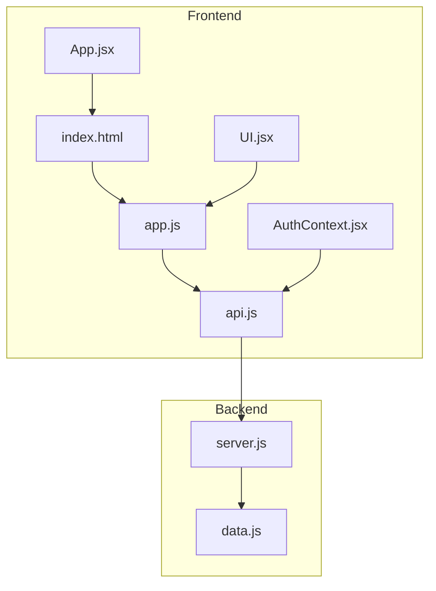
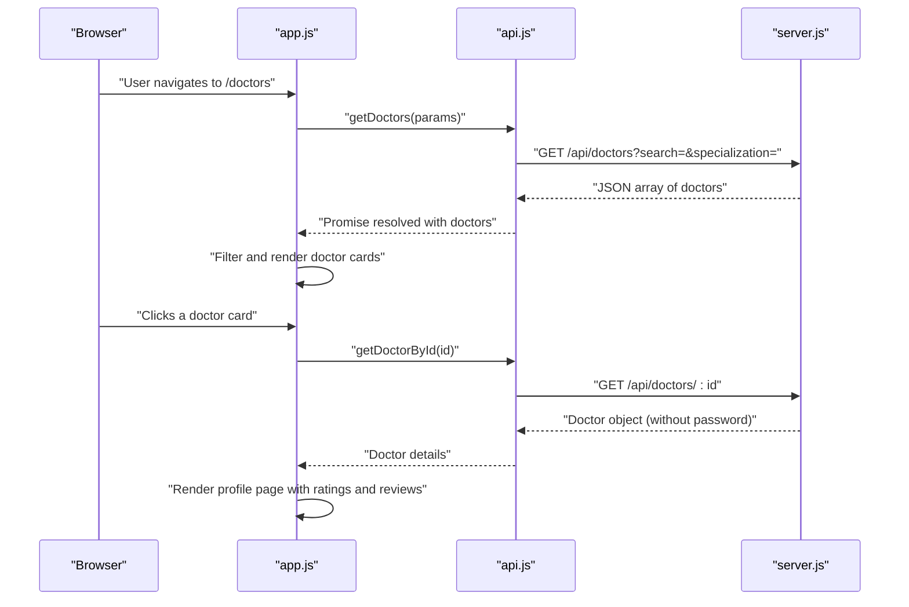
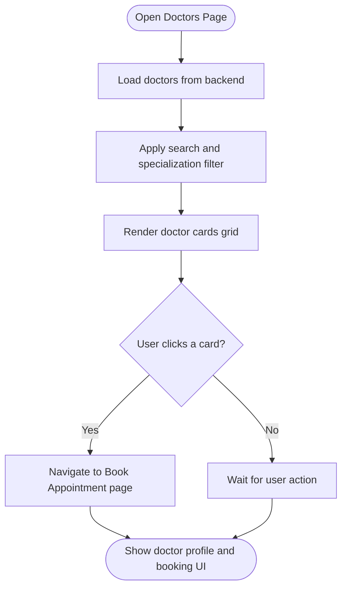
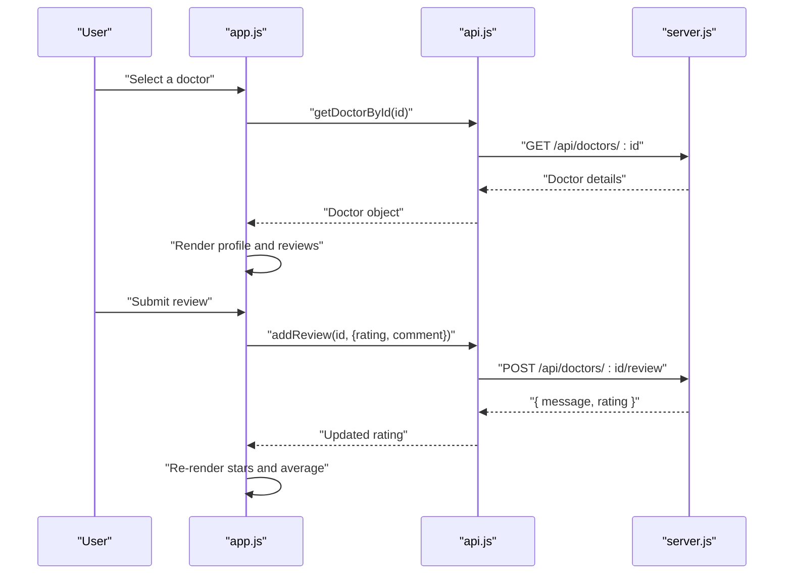
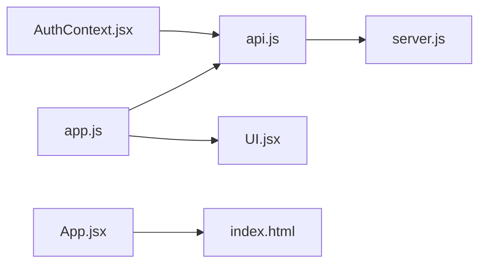

# Doctor Profile Display and Information

<cite>
**Referenced Files in This Document**
- [README.md](file://README.md)
- [App.jsx](file://App.jsx)
- [api.js](file://api.js)
- [server.js](file://server.js)
- [UI.jsx](file://UI.jsx)
- [AuthContext.jsx](file://AuthContext.jsx)
- [index.html](file://index.html)
- [app.js](file://app.js)
- [data.js](file://data.js)
</cite>

## Table of Contents
1. [Introduction](#introduction)
2. [Project Structure](#project-structure)
3. [Core Components](#core-components)
4. [Architecture Overview](#architecture-overview)
5. [Detailed Component Analysis](#detailed-component-analysis)
6. [Dependency Analysis](#dependency-analysis)
7. [Performance Considerations](#performance-considerations)
8. [Troubleshooting Guide](#troubleshooting-guide)
9. [Conclusion](#conclusion)

## Introduction
This document explains the doctor profile display system implemented in the MediBook application. It covers:
- Public doctor directory with search and filtering by name/specialization
- Doctor listing organization by specialization
- Doctor profile page displaying personal information, credentials, experience, and availability
- Rating and review system with star ratings and review counts
- Emoji representation and visual indicators for enhanced UX
- API response structures and display formatting patterns
- Performance considerations for large doctor directories and efficient retrieval strategies

## Project Structure
The application is a single-page application with a frontend logic file and a backend server. The frontend renders pages and manages state, while the backend exposes REST APIs for authentication, doctor listings, booking, and reviews.

**Diagram sources**
- [index.html](file://index.html#L1-L552)
- [app.js](file://app.js#L1-L120)
- [UI.jsx](file://UI.jsx#L1-L182)
- [api.js](file://api.js#L1-L44)
- [AuthContext.jsx](file://AuthContext.jsx#L1-L41)
- [App.jsx](file://App.jsx#L1-L44)
- [server.js](file://server.js#L1-L390)
- [data.js](file://data.js#L1-L21)

**Section sources**
- [README.md](file://README.md#L1-L159)
- [index.html](file://index.html#L1-L552)
- [app.js](file://app.js#L1-L120)
- [server.js](file://server.js#L1-L60)

## Core Components
- Doctor listing page: renders a grid of doctor cards with search and specialization filters.
- Doctor profile page: displays doctor details, availability, ratings, and reviews.
- Rating and review system: shows star ratings and allows submitting reviews.
- Emoji and visual indicators: uses emoji avatars and color-coded probability bars.
- API layer: centralized axios wrapper for backend calls.
- Authentication context: manages JWT tokens and persisted theme.

Key implementation references:
- Doctor listing and filtering: [app.js](file://app.js#L491-L540)
- Doctor profile rendering and booking: [app.js](file://app.js#L541-L604)
- Star rating component: [UI.jsx](file://UI.jsx#L32-L41)
- API endpoints for doctors and reviews: [api.js](file://api.js#L11-L14)
- Backend doctor listing and filtering: [server.js](file://server.js#L116-L131)
- Backend review submission: [server.js](file://server.js#L155-L164)

**Section sources**
- [app.js](file://app.js#L491-L604)
- [UI.jsx](file://UI.jsx#L32-L41)
- [api.js](file://api.js#L11-L14)
- [server.js](file://server.js#L116-L164)

## Architecture Overview
The frontend uses a central API client to communicate with the backend. The backend serves in-memory data and exposes endpoints for:
- Listing doctors with optional search and specialization filters
- Fetching a specific doctor by ID
- Adding reviews to a doctor
- Managing appointments and payments

**Diagram sources**
- [app.js](file://app.js#L491-L540)
- [api.js](file://api.js#L11-L14)
- [server.js](file://server.js#L116-L131)

## Detailed Component Analysis

### Doctor Listing Page
The listing page provides:
- Search box to filter by name or specialization
- Dropdown to filter by specialization
- Grid of doctor cards with emoji avatar, name, specialization, experience, rating, review count, available slots, and fee

Rendering logic:
- Loads doctors from backend and caches locally
- Filters by query and specialization
- Renders cards with star ratings and fee tag

**Diagram sources**
- [app.js](file://app.js#L491-L540)
- [index.html](file://index.html#L251-L267)

**Section sources**
- [app.js](file://app.js#L491-L540)
- [index.html](file://index.html#L251-L267)

### Doctor Profile Page
The profile page displays:
- Doctor avatar emoji
- Name and specialization
- Experience and rating (via star component)
- Available time slots
- Fee per specialization
- Reviews section with star ratings and comments
- Booking form with date/time selection and confirmation probability

**Diagram sources**
- [app.js](file://app.js#L28-L72)
- [api.js](file://api.js#L12-L14)
- [server.js](file://server.js#L155-L164)
- [UI.jsx](file://UI.jsx#L32-L41)

**Section sources**
- [app.js](file://app.js#L28-L72)
- [api.js](file://api.js#L12-L14)
- [server.js](file://server.js#L155-L164)
- [UI.jsx](file://UI.jsx#L32-L41)

### Rating and Review System
- Star display component renders filled/empty stars and numeric rating
- Reviews are stored on the doctor object and recalculated when a new review is added
- Average rating is computed from all reviews

Display patterns:
- Star component usage in profile and reviews list
- Numeric rating shown alongside stars
- Review count displayed beneath rating

**Section sources**
- [UI.jsx](file://UI.jsx#L32-L41)
- [server.js](file://server.js#L155-L164)
- [app.js](file://app.js#L922-L941)

### Emoji Representation and Visual Indicators
- Each doctor has an emoji avatar used in cards, profile, and admin views
- Confirmation probability bar uses color-coded labels (high/medium/low)
- Status badges for appointment states

**Section sources**
- [index.html](file://index.html#L149-L150)
- [server.js](file://server.js#L155-L164)
- [app.js](file://app.js#L569-L582)
- [UI.jsx](file://UI.jsx#L43-L58)

### API Responses and Data Structures
Backend endpoints and typical responses:
- GET /api/doctors
  - Query params: search, specialization
  - Returns array of doctor objects (without sensitive fields)
- GET /api/doctors/:id
  - Returns a single doctor object
- POST /api/doctors/:id/review
  - Body: { rating, comment }
  - Returns { message, rating }

Frontend data structures:
- Doctor object includes: doctor_id, name, specialization, experience, available_time, rating, reviews[], emoji, fee
- Reviews include: id, patient_id, patient_name, rating, comment, created_at

**Section sources**
- [server.js](file://server.js#L116-L164)
- [app.js](file://app.js#L491-L505)
- [data.js](file://data.js#L10-L21)

## Dependency Analysis
The frontend depends on:
- API client for HTTP requests
- UI components for reusable elements (stars, spinner, probability bar)
- Authentication context for JWT and theme persistence

**Diagram sources**
- [api.js](file://api.js#L1-L44)
- [server.js](file://server.js#L1-L390)
- [app.js](file://app.js#L1-L120)
- [UI.jsx](file://UI.jsx#L1-L182)
- [AuthContext.jsx](file://AuthContext.jsx#L1-L41)
- [App.jsx](file://App.jsx#L1-L44)
- [index.html](file://index.html#L1-L552)

**Section sources**
- [api.js](file://api.js#L1-L44)
- [server.js](file://server.js#L1-L60)
- [app.js](file://app.js#L1-L120)
- [UI.jsx](file://UI.jsx#L1-L182)
- [AuthContext.jsx](file://AuthContext.jsx#L1-L41)
- [App.jsx](file://App.jsx#L1-L44)
- [index.html](file://index.html#L1-L552)

## Performance Considerations
- Client-side caching: Doctors are fetched once and cached in memory for fast filtering and rendering.
- Minimal re-renders: Filtering is applied in-memory on the cached list.
- Pagination: Not implemented; for large datasets, consider backend pagination or virtualized lists.
- Debouncing: Search could benefit from debounced input to reduce frequent filtering.
- Lazy loading: Images/emojis are lightweight; avoid heavy assets.
- Network optimization: Use query parameters efficiently and avoid redundant requests.

[No sources needed since this section provides general guidance]

## Troubleshooting Guide
Common issues and resolutions:
- Token errors: Ensure Authorization header is set in API client when logged in.
- CORS errors: Backend enables CORS; verify origin and headers.
- Doctor not found: Verify doctor_id correctness and route parameters.
- Review submission failures: Ensure user is logged in and rating/comment are valid.

**Section sources**
- [AuthContext.jsx](file://AuthContext.jsx#L11-L14)
- [server.js](file://server.js#L22-L24)
- [server.js](file://server.js#L155-L164)

## Conclusion
The doctor profile display system integrates a responsive frontend with a compact backend to deliver a smooth user experience. The listing supports search and specialization filtering, the profile page presents essential information and reviews, and the rating system encourages engagement. With careful attention to caching and potential future scaling needs, the system can handle larger datasets effectively.