# Doctor Profile Management

<cite>
**Referenced Files in This Document**
- [README.md](file://README.md)
- [server.js](file://server.js)
- [App.jsx](file://App.jsx)
- [AuthContext.jsx](file://AuthContext.jsx)
- [api.js](file://api.js)
- [UI.jsx](file://UI.jsx)
- [BookAppointment.jsx](file://BookAppointment.jsx)
- [DoctorPanel.jsx](file://DoctorPanel.jsx)
- [Admin.jsx](file://Admin.jsx)
- [Profile.jsx](file://Profile.jsx)
- [Payment.jsx](file://Payment.jsx)
- [data.js](file://data.js)
</cite>

## Table of Contents
1. [Introduction](#introduction)
2. [Project Structure](#project-structure)
3. [Core Components](#core-components)
4. [Architecture Overview](#architecture-overview)
5. [Detailed Component Analysis](#detailed-component-analysis)
6. [Dependency Analysis](#dependency-analysis)
7. [Performance Considerations](#performance-considerations)
8. [Troubleshooting Guide](#troubleshooting-guide)
9. [Conclusion](#conclusion)
10. [Appendices](#appendices)

## Introduction
This document explains the doctor profile management system implemented in the MediBook application. It covers the doctor registration and login flows, JWT-based authentication and role-based access control, doctor profile display, rating and review mechanisms, availability scheduling, appointment management, and the administrator approval workflow. It also includes data model structures, update operations, display formatting, and security considerations.

## Project Structure
The application is a full-stack React + Node.js/Express system with:
- Frontend routing and authentication context
- API client module encapsulating REST endpoints
- Backend routes for authentication, doctor profiles, appointments, reviews, payments, and admin operations
- In-memory database schema mirroring SQL tables

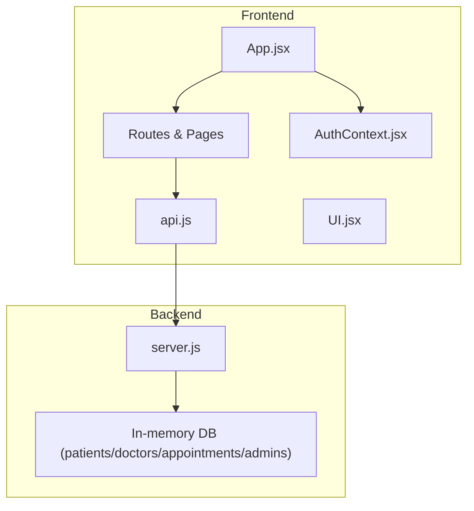

**Diagram sources**
- [App.jsx](file://App.jsx#L15-L43)
- [AuthContext.jsx](file://AuthContext.jsx#L6-L37)
- [api.js](file://api.js#L3-L44)
- [server.js](file://server.js#L29-L44)

**Section sources**
- [README.md](file://README.md#L7-L33)
- [App.jsx](file://App.jsx#L1-L44)
- [AuthContext.jsx](file://AuthContext.jsx#L1-L41)
- [api.js](file://api.js#L1-L44)
- [server.js](file://server.js#L29-L44)

## Core Components
- Authentication and Authorization
  - JWT middleware enforces role-based access control for doctor and admin routes
  - Frontend stores tokens and user state in local storage and sets Authorization headers globally
- API Layer
  - Centralized axios instance with typed endpoints for auth, doctors, appointments, reviews, payments, and admin
- UI Utilities
  - Toast notifications, star ratings, confirmation probability bar, countdown timers, and status badges
- Doctor Availability and Reviews
  - Doctor availability stored as comma-separated time slots
  - Reviews aggregated to compute average rating per doctor
- Payments
  - Consultation fee lookup by specialization and simulated payment flow

**Section sources**
- [server.js](file://server.js#L49-L62)
- [AuthContext.jsx](file://AuthContext.jsx#L6-L37)
- [api.js](file://api.js#L1-L44)
- [UI.jsx](file://UI.jsx#L33-L58)
- [BookAppointment.jsx](file://BookAppointment.jsx#L74-L127)
- [server.js](file://server.js#L155-L164)
- [server.js](file://server.js#L288-L295)

## Architecture Overview
The system follows a layered architecture:
- Presentation layer: React pages and components
- Application layer: API client module and route handlers
- Domain layer: Business logic for authentication, availability, reviews, and payments
- Data layer: In-memory database representing normalized tables

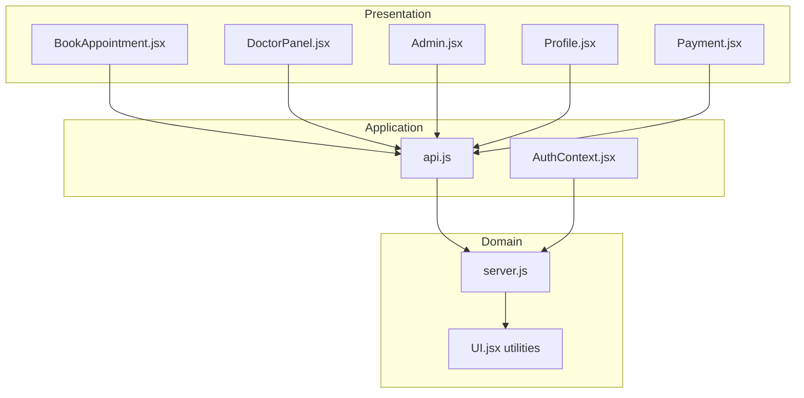

**Diagram sources**
- [BookAppointment.jsx](file://BookAppointment.jsx#L1-L171)
- [DoctorPanel.jsx](file://DoctorPanel.jsx#L1-L96)
- [Admin.jsx](file://Admin.jsx#L1-L194)
- [Profile.jsx](file://Profile.jsx#L1-L97)
- [Payment.jsx](file://Payment.jsx#L1-L350)
- [api.js](file://api.js#L1-L44)
- [AuthContext.jsx](file://AuthContext.jsx#L1-L41)
- [server.js](file://server.js#L1-L390)
- [UI.jsx](file://UI.jsx#L1-L182)

## Detailed Component Analysis

### Doctor Registration and Login Workflows
- Doctor login endpoint verifies credentials against in-memory doctor records and issues a signed JWT with role “doctor”
- The frontend stores the JWT and attaches it to subsequent requests via Authorization header
- Middleware enforces role-based access control for protected routes

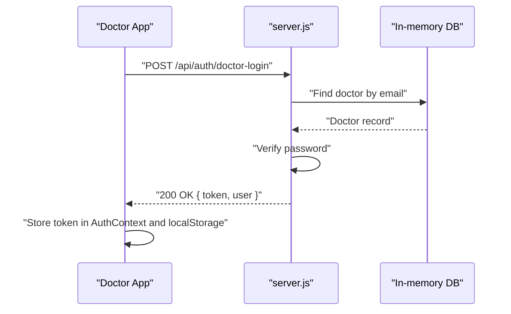

**Diagram sources**
- [server.js](file://server.js#L92-L110)
- [AuthContext.jsx](file://AuthContext.jsx#L21-L31)

**Section sources**
- [server.js](file://server.js#L92-L110)
- [AuthContext.jsx](file://AuthContext.jsx#L6-L37)

### JWT Token Generation and Role-Based Access Control
- JWT secret is configurable via environment variable
- Middleware extracts token from Authorization header, verifies signature, and checks role
- Protected routes enforce roles: doctor, admin

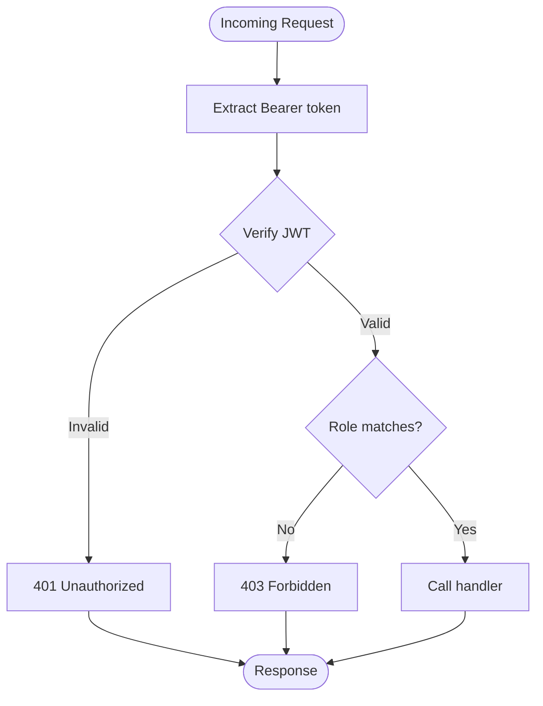

**Diagram sources**
- [server.js](file://server.js#L49-L62)

**Section sources**
- [server.js](file://server.js#L19-L20)
- [server.js](file://server.js#L49-L62)

### Doctor Profile Display
- Public listing and filtering by name or specialization
- Single doctor retrieval returns sanitized profile excluding sensitive fields
- UI displays doctor’s name, specialty, experience, emoji, rating, and available time slots

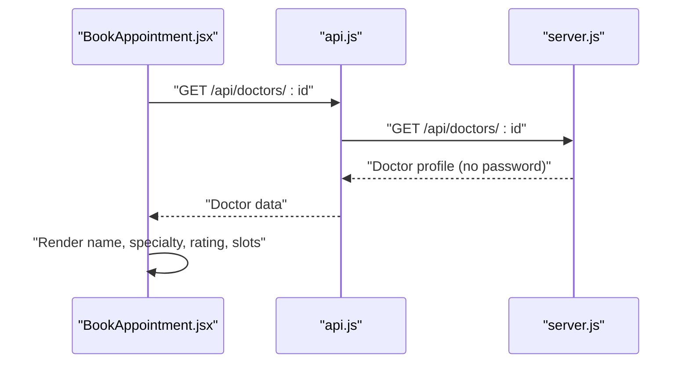

**Diagram sources**
- [BookAppointment.jsx](file://BookAppointment.jsx#L28-L32)
- [api.js](file://api.js#L12-L14)
- [server.js](file://server.js#L125-L131)

**Section sources**
- [server.js](file://server.js#L117-L131)
- [BookAppointment.jsx](file://BookAppointment.jsx#L80-L90)

### Doctor Rating and Review System
- Patients can submit reviews with rating and optional comment
- Backend appends review and recalculates average rating
- UI renders existing reviews and allows new submissions

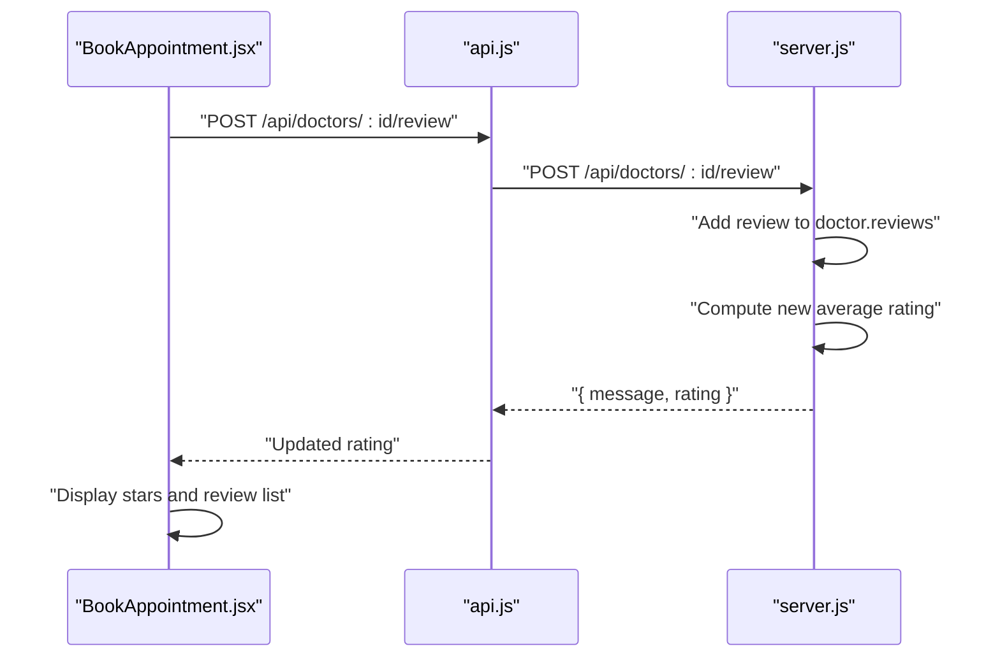

**Diagram sources**
- [BookAppointment.jsx](file://BookAppointment.jsx#L62-L69)
- [api.js](file://api.js#L14)
- [server.js](file://server.js#L155-L164)
- [UI.jsx](file://UI.jsx#L33-L41)

**Section sources**
- [server.js](file://server.js#L155-L164)
- [BookAppointment.jsx](file://BookAppointment.jsx#L129-L167)
- [UI.jsx](file://UI.jsx#L33-L41)

### Doctor Availability Management
- Availability is stored as a comma-separated string of time slots
- Booking logic validates conflicts and computes confirmation probability based on current load vs. total slots
- UI presents selectable time slots for booking

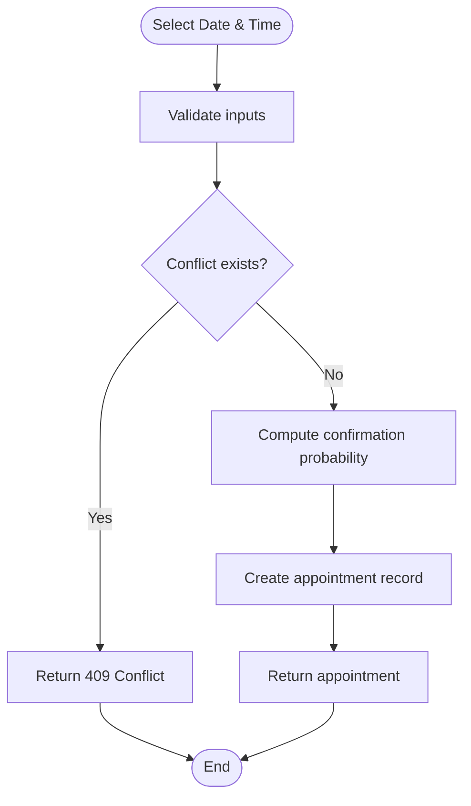

**Diagram sources**
- [BookAppointment.jsx](file://BookAppointment.jsx#L39-L60)
- [server.js](file://server.js#L170-L202)

**Section sources**
- [server.js](file://server.js#L125-L131)
- [BookAppointment.jsx](file://BookAppointment.jsx#L74-L127)
- [server.js](file://server.js#L170-L202)

### Doctor Approval Workflow for Administrators
- Admin dashboard lists all appointments and allows changing status
- Admin can remove doctors from the system
- Doctor panel shows incoming appointment requests and allows approval/rejection

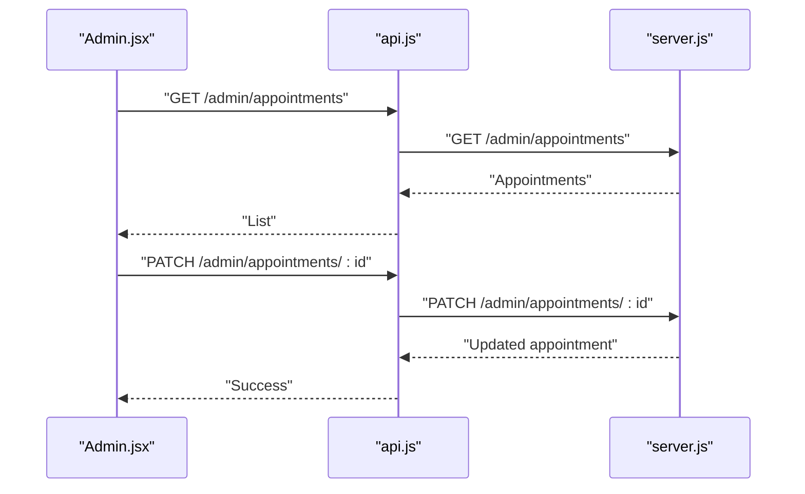

**Diagram sources**
- [Admin.jsx](file://Admin.jsx#L19-L32)
- [api.js](file://api.js#L34-L35)
- [server.js](file://server.js#L255-L273)

**Section sources**
- [Admin.jsx](file://Admin.jsx#L26-L41)
- [server.js](file://server.js#L255-L280)
- [DoctorPanel.jsx](file://DoctorPanel.jsx#L22-L28)

### Doctor Login System and JWT
- Doctor login endpoint authenticates credentials and returns a signed JWT with role “doctor”
- Frontend persists token and user data, and sets Authorization header for all requests

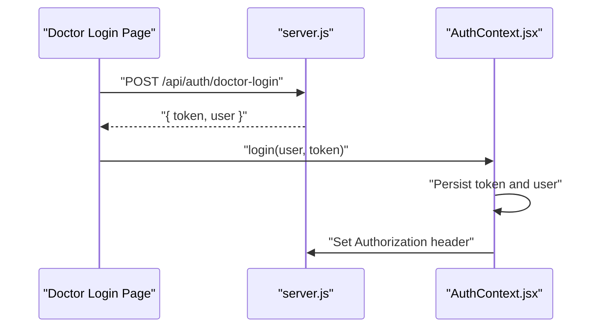

**Diagram sources**
- [server.js](file://server.js#L92-L110)
- [AuthContext.jsx](file://AuthContext.jsx#L21-L31)

**Section sources**
- [server.js](file://server.js#L92-L110)
- [AuthContext.jsx](file://AuthContext.jsx#L6-L37)

### Doctor Profile Display Functionality
- Public doctor listing supports search and specialization filters
- Individual doctor profile excludes sensitive fields and includes availability and reviews

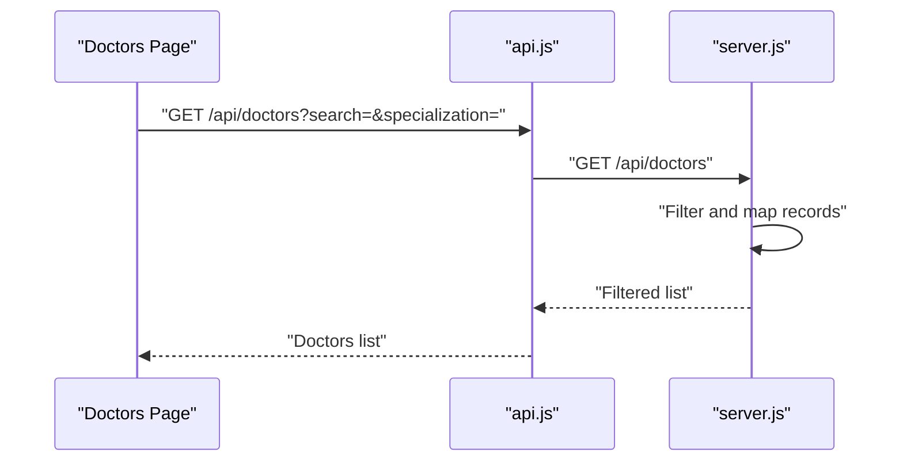

**Diagram sources**
- [server.js](file://server.js#L117-L123)
- [api.js](file://api.js#L12)

**Section sources**
- [server.js](file://server.js#L117-L123)

### Payment and Appointment Confirmation
- Consultation fee lookup by doctor specialization
- Simulated payment flow updates appointment status to approved upon successful payment
- UI displays order summary, payment methods, and success receipt

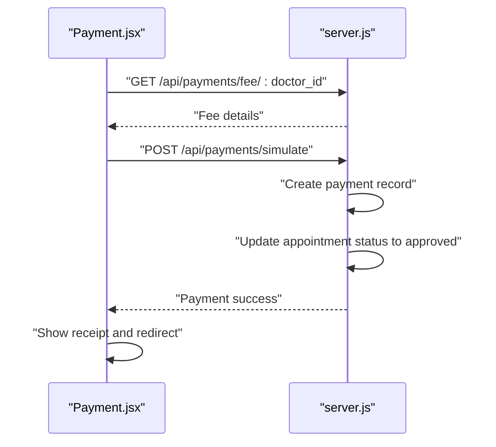

**Diagram sources**
- [Payment.jsx](file://Payment.jsx#L49-L98)
- [server.js](file://server.js#L287-L353)

**Section sources**
- [Payment.jsx](file://Payment.jsx#L49-L98)
- [server.js](file://server.js#L287-L353)

## Dependency Analysis
- Frontend depends on:
  - AuthContext for JWT lifecycle and persisted theme
  - API module for centralized endpoint calls
  - UI utilities for rendering and UX
- Backend depends on:
  - bcrypt for password hashing
  - jsonwebtoken for JWT signing and verification
  - Stripe SDK for payment intents (optional)
  - In-memory store mirroring SQL schema

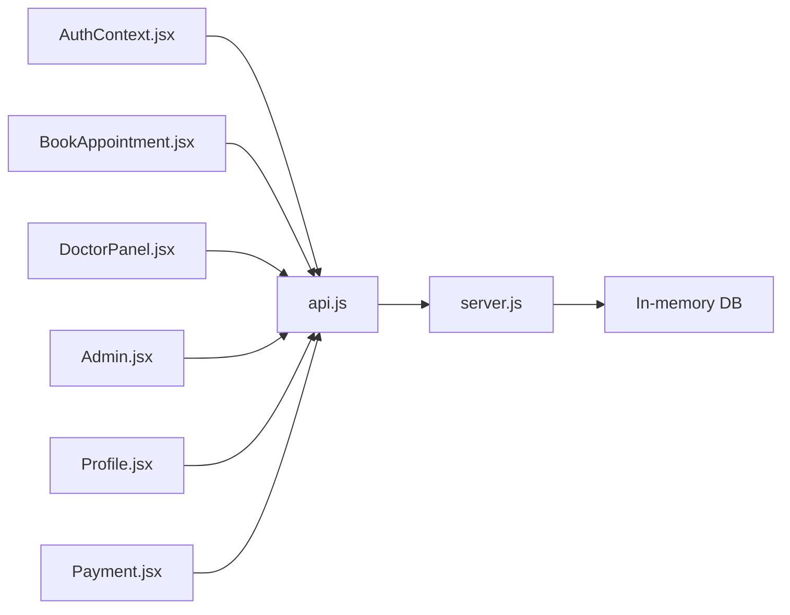

**Diagram sources**
- [AuthContext.jsx](file://AuthContext.jsx#L1-L41)
- [api.js](file://api.js#L1-L44)
- [BookAppointment.jsx](file://BookAppointment.jsx#L1-L171)
- [DoctorPanel.jsx](file://DoctorPanel.jsx#L1-L96)
- [Admin.jsx](file://Admin.jsx#L1-L194)
- [Profile.jsx](file://Profile.jsx#L1-L97)
- [Payment.jsx](file://Payment.jsx#L1-L350)
- [server.js](file://server.js#L1-L390)

**Section sources**
- [AuthContext.jsx](file://AuthContext.jsx#L1-L41)
- [api.js](file://api.js#L1-L44)
- [server.js](file://server.js#L1-L390)

## Performance Considerations
- In-memory storage is suitable for development/demo but not production-scale
- Recommendation: Replace in-memory store with a relational database (e.g., MySQL) and add indexing on foreign keys and frequently queried columns
- Optimize frontend rendering by memoizing computed values (e.g., confirmation probability) and debouncing API calls
- Use pagination for large lists (doctors, appointments, payments)

## Troubleshooting Guide
Common issues and resolutions:
- Invalid or expired JWT
  - Symptom: 401 Unauthorized on protected routes
  - Resolution: Re-authenticate; ensure Authorization header is present
- Access denied due to role mismatch
  - Symptom: 403 Forbidden when accessing doctor/admin endpoints
  - Resolution: Verify user role and token
- Doctor not found
  - Symptom: 404 when fetching doctor profile or adding review
  - Resolution: Validate doctor ID and network connectivity
- Appointment conflict
  - Symptom: 409 Conflict when booking
  - Resolution: Choose another time slot or date
- Payment simulation errors
  - Symptom: Payment failure messages
  - Resolution: Check required fields and format card/mobile/account numbers

**Section sources**
- [server.js](file://server.js#L53-L61)
- [server.js](file://server.js#L127-L129)
- [server.js](file://server.js#L158-L159)
- [server.js](file://server.js#L178-L179)
- [Payment.jsx](file://Payment.jsx#L62-L98)

## Conclusion
The doctor profile management system integrates authentication, availability scheduling, reviews, and administrative controls within a cohesive React + Node.js architecture. While the current implementation uses an in-memory store, the modular design enables straightforward migration to persistent storage and enhanced security measures.

## Appendices

### Data Model Structures
- Patients
  - Fields: patient_id, name, email, phone, age, password, created_at
- Doctors
  - Fields: doctor_id, name, email, password, specialization, experience, available_time, rating, reviews, emoji, approved
- Appointments
  - Fields: appointment_id, patient_id, doctor_id, date, time, status, confirmation_probability, created_at, updated_at
- Admins
  - Fields: admin_id, username, password

**Section sources**
- [README.md](file://README.md#L103-L148)

### Example Update Operations
- Update patient profile
  - Endpoint: PUT /api/profile
  - Payload: { name, phone, age, password? }
  - Behavior: Updates fields; hashes new password if provided
- Approve/reject doctor appointment
  - Endpoint: PATCH /api/doctor/appointments/:id
  - Payload: { status: "approved" | "cancelled" }
- Admin update appointment status
  - Endpoint: PATCH /api/admin/appointments/:id
  - Payload: { status }

**Section sources**
- [server.js](file://server.js#L229-L239)
- [server.js](file://server.js#L144-L153)
- [server.js](file://server.js#L267-L272)

### Display Formatting Examples
- Star ratings
  - Component renders filled and half-stars based on numeric rating
- Confirmation probability bar
  - Renders percentage with color-coded label
- Status badges
  - Displays human-readable status with appropriate styling

**Section sources**
- [UI.jsx](file://UI.jsx#L33-L41)
- [UI.jsx](file://UI.jsx#L44-L58)
- [UI.jsx](file://UI.jsx#L179-L181)

### Security Considerations
- Password hashing
  - bcrypt is used for hashing passwords on registration and updates
- Token management
  - JWT secret is configurable; tokens are stored in secure HTTP-only cookies in production (current implementation stores in localStorage)
- CORS and headers
  - CORS enabled; Authorization header is set automatically by AuthContext
- Payment security
  - Stripe SDK integration is supported; frontend warns if Stripe is unavailable

**Section sources**
- [server.js](file://server.js#L6)
- [server.js](file://server.js#L19)
- [AuthContext.jsx](file://AuthContext.jsx#L11-L14)
- [Payment.jsx](file://Payment.jsx#L284-L287)