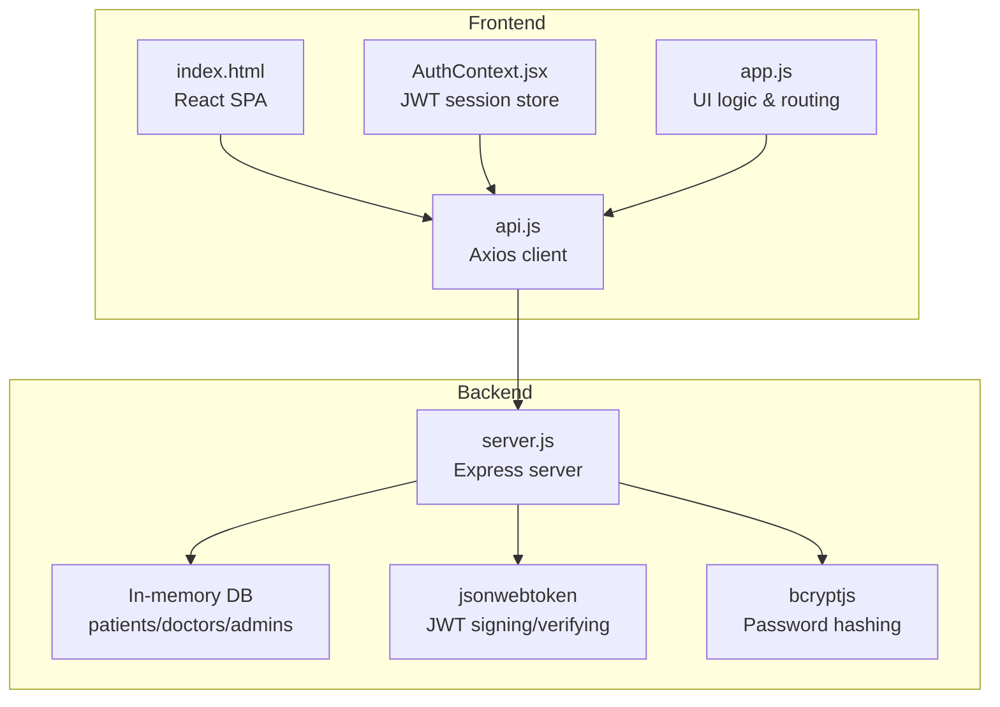
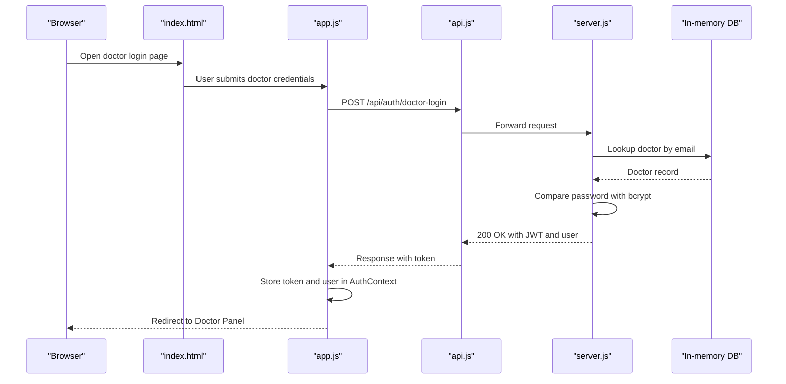
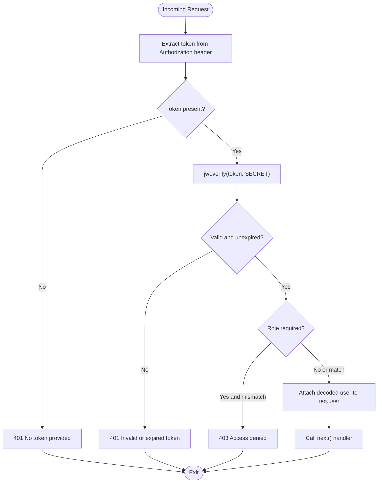
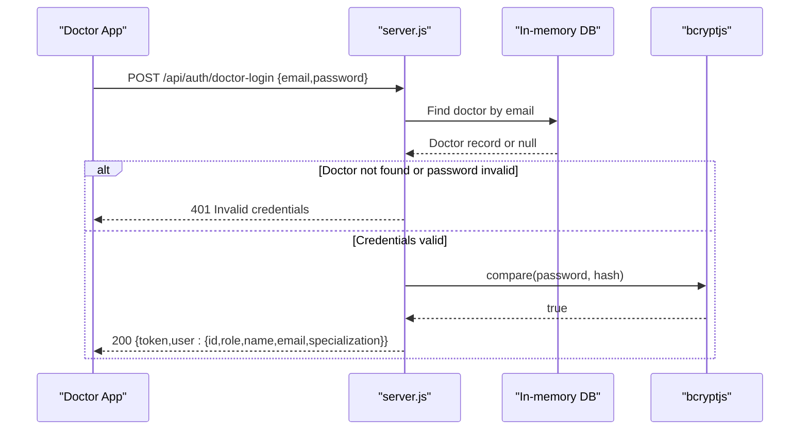
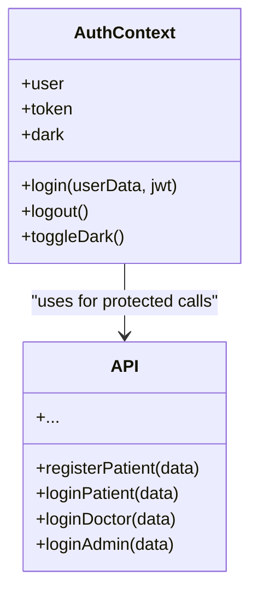
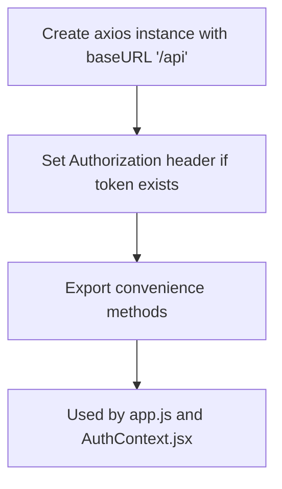
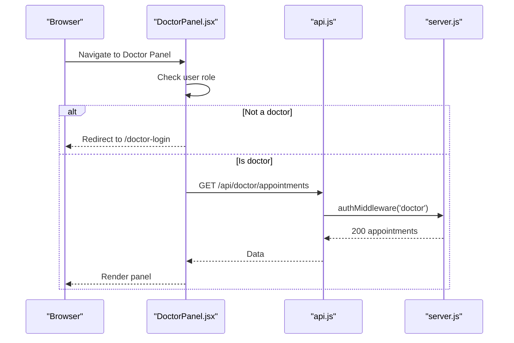
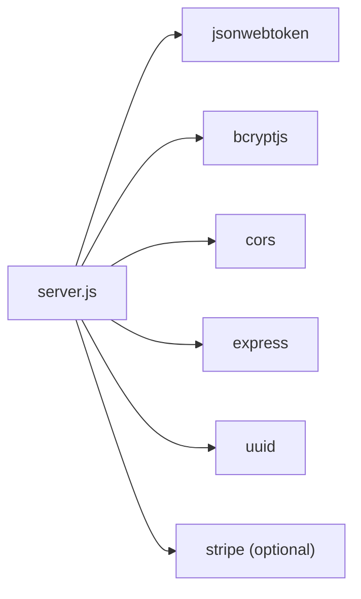

# Doctor Registration and Authentication

<cite>
**Referenced Files in This Document**
- [server.js](file://server.js)
- [AuthContext.jsx](file://AuthContext.jsx)
- [api.js](file://api.js)
- [package.json](file://package.json)
- [index.html](file://index.html)
- [app.js](file://app.js)
- [README.md](file://README.md)
</cite>

## Table of Contents
1. [Introduction](#introduction)
2. [Project Structure](#project-structure)
3. [Core Components](#core-components)
4. [Architecture Overview](#architecture-overview)
5. [Detailed Component Analysis](#detailed-component-analysis)
6. [Dependency Analysis](#dependency-analysis)
7. [Performance Considerations](#performance-considerations)
8. [Troubleshooting Guide](#troubleshooting-guide)
9. [Conclusion](#conclusion)

## Introduction
This document explains the doctor registration and authentication system implemented in the MediBook application. It covers the doctor login flow, JWT token generation, password hashing with bcrypt, role-based access control, and the authentication middleware. It also documents the doctor account lifecycle, including registration, login, and access control enforcement across roles (patient, doctor, admin). Security considerations such as password encryption, token expiration, and unauthorized access prevention are addressed.

## Project Structure
The application follows a split frontend/backend architecture:
- Backend: Node.js/Express server exposing REST endpoints for authentication, doctor management, appointments, and payments.
- Frontend: React-based single-page application with a custom lightweight API client and authentication context.

**Diagram sources**
- [server.js](file://server.js#L1-L390)
- [api.js](file://api.js#L1-L44)
- [AuthContext.jsx](file://AuthContext.jsx#L1-L41)
- [app.js](file://app.js#L1-L965)
- [index.html](file://index.html#L1-L552)

**Section sources**
- [server.js](file://server.js#L1-L390)
- [api.js](file://api.js#L1-L44)
- [AuthContext.jsx](file://AuthContext.jsx#L1-L41)
- [app.js](file://app.js#L1-L965)
- [index.html](file://index.html#L1-L552)

## Core Components
- Authentication middleware: Verifies JWT tokens and enforces role-based access control.
- Doctor login endpoint: Validates credentials against in-memory doctor records and issues a signed JWT.
- Frontend authentication context: Stores JWT and user state, injects Authorization header for protected requests.
- Axios API client: Centralized HTTP client for API calls and protected route access.

Key implementation references:
- Middleware and routes: [server.js](file://server.js#L49-L110)
- Doctor login: [server.js](file://server.js#L92-L100)
- Frontend auth context: [AuthContext.jsx](file://AuthContext.jsx#L1-L41)
- Axios client: [api.js](file://api.js#L1-L44)

**Section sources**
- [server.js](file://server.js#L49-L110)
- [AuthContext.jsx](file://AuthContext.jsx#L1-L41)
- [api.js](file://api.js#L1-L44)

## Architecture Overview
The authentication flow integrates frontend and backend components:
- Frontend collects doctor credentials and calls the backend login endpoint.
- Backend verifies credentials using bcrypt and issues a JWT with role claims.
- Frontend stores the JWT and attaches it to subsequent requests.
- Backend middleware validates the token and enforces role-based access.

**Diagram sources**
- [index.html](file://index.html#L220-L234)
- [app.js](file://app.js#L440-L455)
- [api.js](file://api.js#L8)
- [server.js](file://server.js#L92-L100)

## Detailed Component Analysis

### Authentication Middleware
The middleware enforces token-based authentication and role checks:
- Extracts the Bearer token from the Authorization header.
- Verifies the token using the shared JWT secret.
- Enforces optional role-based access control.
- Attaches decoded user info to the request object for downstream handlers.

**Diagram sources**
- [server.js](file://server.js#L49-L62)

**Section sources**
- [server.js](file://server.js#L49-L62)

### Doctor Login Endpoint
The doctor login endpoint performs:
- Input validation.
- Doctor lookup by email.
- Password verification using bcrypt.
- JWT issuance with role claim and expiration.

**Diagram sources**
- [server.js](file://server.js#L92-L100)

**Section sources**
- [server.js](file://server.js#L92-L100)

### Frontend Authentication Context
The React context manages:
- Persisted user and token state in localStorage.
- Authorization header injection for Axios requests.
- Theme persistence.

**Diagram sources**
- [AuthContext.jsx](file://AuthContext.jsx#L1-L41)
- [api.js](file://api.js#L1-L44)

**Section sources**
- [AuthContext.jsx](file://AuthContext.jsx#L1-L41)
- [api.js](file://api.js#L1-L44)

### Axios API Client
The centralized client:
- Base URL set to /api.
- Automatically attaches Authorization header when a token exists.
- Exposes typed methods for auth, doctors, appointments, payments, and admin operations.

**Diagram sources**
- [api.js](file://api.js#L1-L44)

**Section sources**
- [api.js](file://api.js#L1-L44)

### Doctor Panel Access Control
The doctor panel enforces role-based access:
- On mount, checks if the current user is a doctor.
- Redirects to the doctor login page if not authorized.
- Uses the auth middleware for protected routes on the backend.

**Diagram sources**
- [DoctorPanel.jsx](file://DoctorPanel.jsx#L1-L96)
- [server.js](file://server.js#L133-L142)

**Section sources**
- [DoctorPanel.jsx](file://DoctorPanel.jsx#L1-L96)
- [server.js](file://server.js#L133-L142)

### Doctor Account Lifecycle
- Registration: The frontend supports OAuth-style registration that posts to the backend registration endpoint. The backend hashes the password and issues a JWT for the newly created patient account. While the repository does not include a dedicated doctor registration endpoint, the pattern follows the same token issuance and bcrypt hashing.
- Login: The doctor login endpoint authenticates credentials and issues a JWT with role claim.
- Active Status Management: The backend maintains an in-memory database of doctors with an approved flag. Access control ensures only approved doctors can log in and access protected routes.

References:
- Doctor login: [server.js](file://server.js#L92-L100)
- In-memory doctor records: [server.js](file://server.js#L29-L44)
- Protected routes using auth middleware: [server.js](file://server.js#L133-L142)

**Section sources**
- [server.js](file://server.js#L29-L44)
- [server.js](file://server.js#L92-L100)
- [server.js](file://server.js#L133-L142)

### Token-Based Authentication Patterns
- Header Injection: The frontend sets the Authorization header for all protected requests when a token is present.
- Token Storage: The token and user data are persisted in localStorage and restored on page load.
- Logout: Removes token and user from localStorage and clears the Authorization header.

References:
- Authorization header setup: [AuthContext.jsx](file://AuthContext.jsx#L11-L14)
- Token storage and restoration: [AuthContext.jsx](file://AuthContext.jsx#L7-L9)
- Logout behavior: [AuthContext.jsx](file://AuthContext.jsx#L27-L31)

**Section sources**
- [AuthContext.jsx](file://AuthContext.jsx#L11-L14)
- [AuthContext.jsx](file://AuthContext.jsx#L7-L9)
- [AuthContext.jsx](file://AuthContext.jsx#L27-L31)

## Dependency Analysis
External libraries and their roles:
- jsonwebtoken: JWT signing and verification for secure token-based authentication.
- bcryptjs: Password hashing and comparison for secure credential verification.
- cors: Cross-origin support for development.
- express: Web server and route handling.
- uuid: Unique identifiers for entities.
- stripe: Payment processing integration (optional; requires secret key).

**Diagram sources**
- [server.js](file://server.js#L5-L15)
- [package.json](file://package.json#L14-L22)

**Section sources**
- [server.js](file://server.js#L5-L15)
- [package.json](file://package.json#L14-L22)

## Performance Considerations
- In-memory database: Suitable for development/demo but not recommended for production. Consider migrating to a persistent database for scalability and reliability.
- Token expiration: JWT tokens are issued with a fixed expiration. For long sessions, consider refresh tokens or sliding expiration strategies.
- Password hashing cost: bcrypt cost factor is set to a standard value. Adjust according to hardware capabilities and security requirements.

## Troubleshooting Guide
Common issues and resolutions:
- Invalid or expired token: Ensure the frontend persists and re-injects the Authorization header. Verify the JWT secret and expiration settings on the backend.
- Access denied errors: Confirm the user’s role matches the route requirement enforced by the middleware.
- Stripe integration: If payment processing fails, verify the STRIPE_SECRET_KEY environment variable and package installation.

References:
- Token verification and role enforcement: [server.js](file://server.js#L49-L62)
- Doctor login response shape: [server.js](file://server.js#L92-L100)
- Stripe configuration: [server.js](file://server.js#L11-L15)

**Section sources**
- [server.js](file://server.js#L49-L62)
- [server.js](file://server.js#L92-L100)
- [server.js](file://server.js#L11-L15)

## Conclusion
The MediBook application implements a clear, layered authentication system:
- Frontend handles user interactions and token lifecycle.
- Backend enforces JWT verification and role-based access control.
- Passwords are securely hashed, and tokens carry role claims for fine-grained permissions.
For production, replace the in-memory database with a persistent store, configure environment-specific secrets, and implement robust error handling and logging.