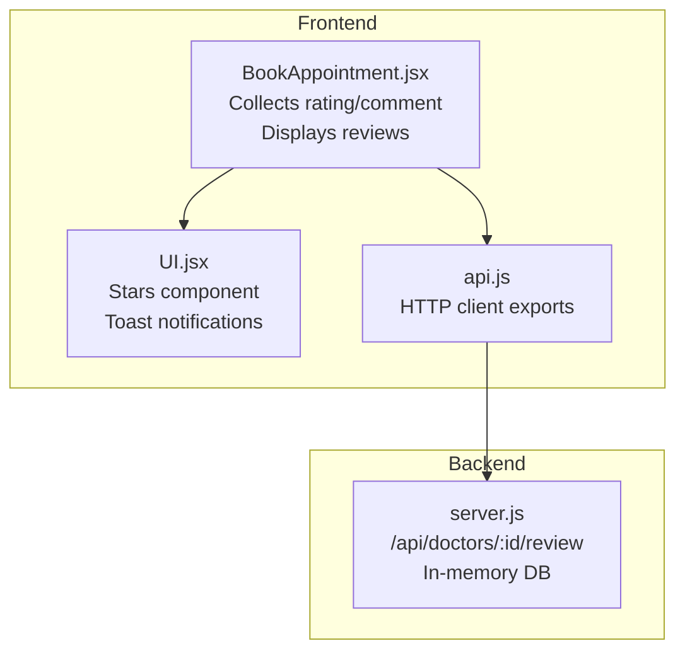
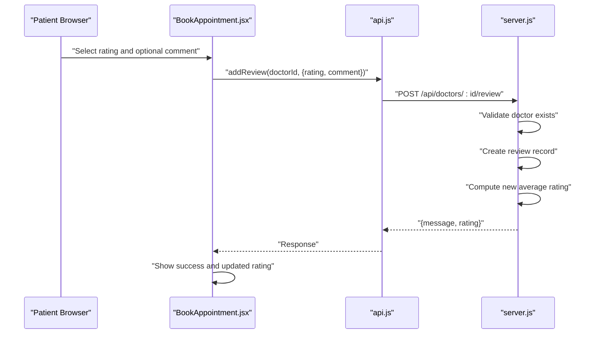
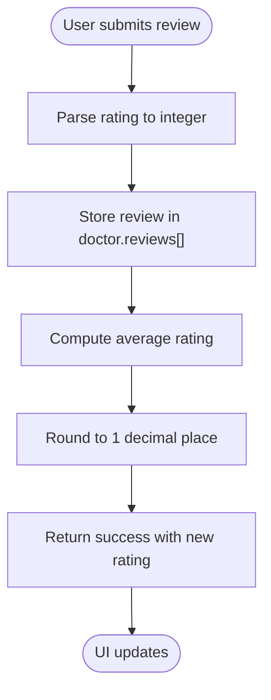
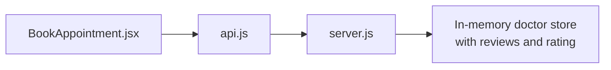

# Doctor Reviews and Rating System

<cite>
**Referenced Files in This Document**
- [server.js](file://server.js)
- [api.js](file://api.js)
- [BookAppointment.jsx](file://BookAppointment.jsx)
- [UI.jsx](file://UI.jsx)
- [README.md](file://README.md)
</cite>

## Table of Contents
1. [Introduction](#introduction)
2. [Project Structure](#project-structure)
3. [Core Components](#core-components)
4. [Architecture Overview](#architecture-overview)
5. [Detailed Component Analysis](#detailed-component-analysis)
6. [Dependency Analysis](#dependency-analysis)
7. [Performance Considerations](#performance-considerations)
8. [Troubleshooting Guide](#troubleshooting-guide)
9. [Conclusion](#conclusion)

## Introduction
This document explains the doctor reviews and rating system implemented in the MediBook application. It covers the end-to-end review submission process, rating validation and calculation, review display, and the relationship between reviews/ratings and doctor approval status. It also outlines moderation and spam prevention considerations, privacy safeguards for patient anonymity, and the API endpoints used for reviews.

## Project Structure
The review system spans the backend REST API and the frontend React components:
- Backend: Express server exposes a review endpoint and maintains in-memory doctor records with embedded reviews and ratings.
- Frontend: React pages collect user input, submit reviews, and render existing reviews and ratings.

**Diagram sources**
- [BookAppointment.jsx](file://BookAppointment.jsx#L129-L170)
- [UI.jsx](file://UI.jsx#L32-L41)
- [api.js](file://api.js#L14)
- [server.js](file://server.js#L155-L164)

**Section sources**
- [README.md](file://README.md#L1-L159)

## Core Components
- Review submission flow:
  - Patient selects a rating (1–5 stars) and optionally adds a comment.
  - The frontend posts to the backend review endpoint with the doctor ID, rating, and comment.
  - The backend validates the doctor exists, creates a review record, recalculates the doctor’s average rating, and returns the updated rating.
- Rating display:
  - The frontend renders the doctor’s current rating and a star visualization.
  - The frontend lists all existing reviews with patient name and star rating.
- Rating calculation:
  - Average rating equals the sum of all review ratings divided by the number of reviews, rounded to one decimal place.

Key implementation references:
- Review submission endpoint and logic: [server.js](file://server.js#L155-L164)
- Frontend review UI and submission: [BookAppointment.jsx](file://BookAppointment.jsx#L129-L170)
- Star rendering component: [UI.jsx](file://UI.jsx#L32-L41)
- API export for adding reviews: [api.js](file://api.js#L14)

**Section sources**
- [server.js](file://server.js#L155-L164)
- [BookAppointment.jsx](file://BookAppointment.jsx#L129-L170)
- [UI.jsx](file://UI.jsx#L32-L41)
- [api.js](file://api.js#L14)

## Architecture Overview
The review workflow connects the frontend UI to the backend API and in-memory storage.

**Diagram sources**
- [BookAppointment.jsx](file://BookAppointment.jsx#L62-L69)
- [api.js](file://api.js#L14)
- [server.js](file://server.js#L155-L164)

## Detailed Component Analysis

### Review Submission Process
- Input validation and sanitization:
  - Rating is parsed to an integer before being stored.
  - Comment is stored as provided; no server-side filtering is implemented.
- Persistence:
  - Reviews are appended to the doctor’s in-memory reviews array.
  - Ratings are recalculated immediately after each submission.
- Feedback:
  - On success, the frontend displays a success toast and marks the review as submitted.

**Diagram sources**
- [server.js](file://server.js#L155-L164)

**Section sources**
- [server.js](file://server.js#L155-L164)
- [BookAppointment.jsx](file://BookAppointment.jsx#L62-L69)

### Rating Calculation Algorithm
- Formula:
  - New average = Sum of all review ratings ÷ Count of reviews
  - Rounded to 1 decimal place
- Edge cases:
  - First review sets the rating equal to that single rating.
  - No explicit zero-reviews guard is present; division by zero would yield NaN in JavaScript.

Implementation reference:
- [server.js](file://server.js#L162)

**Section sources**
- [server.js](file://server.js#L162)

### Review Display System
- Individual reviews:
  - Rendered below the booking form with patient name and star rating.
  - Optional comments are shown beneath the rating.
- Aggregated rating:
  - The doctor’s overall rating is displayed prominently in the doctor card.
- Sorting:
  - Reviews are displayed in insertion order (oldest first).

References:
- [BookAppointment.jsx](file://BookAppointment.jsx#L153-L167)
- [UI.jsx](file://UI.jsx#L32-L41)

**Section sources**
- [BookAppointment.jsx](file://BookAppointment.jsx#L153-L167)
- [UI.jsx](file://UI.jsx#L32-L41)

### Review Moderation and Spam Prevention
- Current implementation:
  - No moderation queue or approval workflow for reviews.
  - No spam detection or rate limiting on submissions.
  - Comments are stored as-is without filtering.
- Recommended enhancements (not implemented):
  - Add a review status field (pending/approved/rejected).
  - Implement rate limiting per patient per doctor/time window.
  - Add profanity/content filtering for comments.
  - Require verified appointment completion before allowing reviews.

[No sources needed since this section provides general guidance]

### Privacy and Authenticity
- Patient anonymity:
  - Reviews include a masked patient name; full identity is not exposed.
- Authenticity:
  - Reviews are not tied to verified appointments in the current implementation.
  - Consider linking reviews to appointment IDs and requiring payment/completion before enabling reviews.

[No sources needed since this section provides general guidance]

### Relationship Between Reviews/Ratings and Doctor Approval Status
- Doctor approval status is managed separately (doctor registration/approval is outside the reviewed scope).
- Reviews and ratings are independent of doctor approval status; they are stored and recalculated within the doctor record.

[No sources needed since this section provides general guidance]

## Dependency Analysis
The frontend depends on the backend API for review operations. The backend stores reviews and ratings in memory.

**Diagram sources**
- [BookAppointment.jsx](file://BookAppointment.jsx#L62-L69)
- [api.js](file://api.js#L14)
- [server.js](file://server.js#L155-L164)

**Section sources**
- [api.js](file://api.js#L14)
- [server.js](file://server.js#L155-L164)

## Performance Considerations
- In-memory calculation:
  - Rating recalculation iterates over all reviews; for large review volumes, consider caching the sum/count and updating incrementally.
- Rendering:
  - Listing all reviews on the doctor page can become expensive with many entries; consider pagination or virtualization.

[No sources needed since this section provides general guidance]

## Troubleshooting Guide
- Review not saved:
  - Verify the doctor ID is valid and the patient is logged in.
  - Check network errors in the browser console.
- Rating not updating:
  - Ensure the rating value is a valid integer between 1 and 5.
  - Confirm the doctor has at least one review before expecting a calculated average.
- Duplicate or malformed reviews:
  - The current implementation does not prevent duplicate submissions; consider adding uniqueness checks (e.g., per-patient-per-doctor).

**Section sources**
- [server.js](file://server.js#L155-L164)
- [BookAppointment.jsx](file://BookAppointment.jsx#L62-L69)

## Conclusion
The current review system provides a straightforward submission and display mechanism with immediate rating recalculation. To enhance trust and quality, consider integrating moderation workflows, spam controls, and stronger authenticity checks linked to verified appointments.