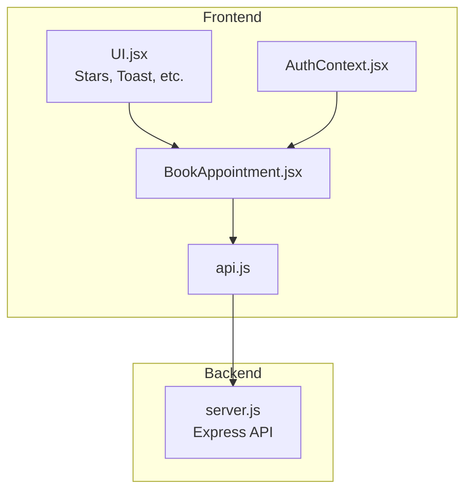
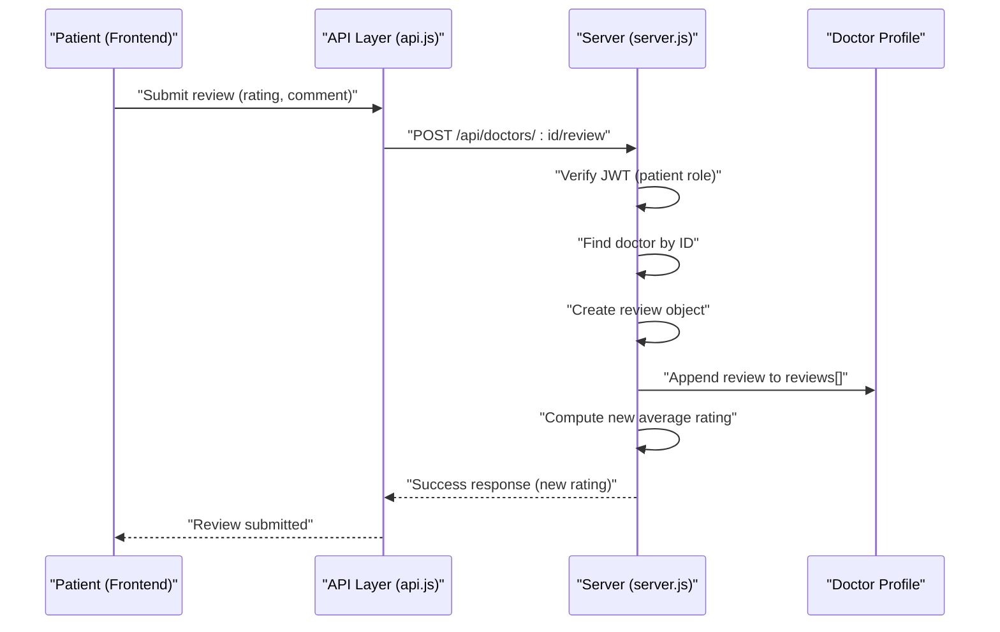
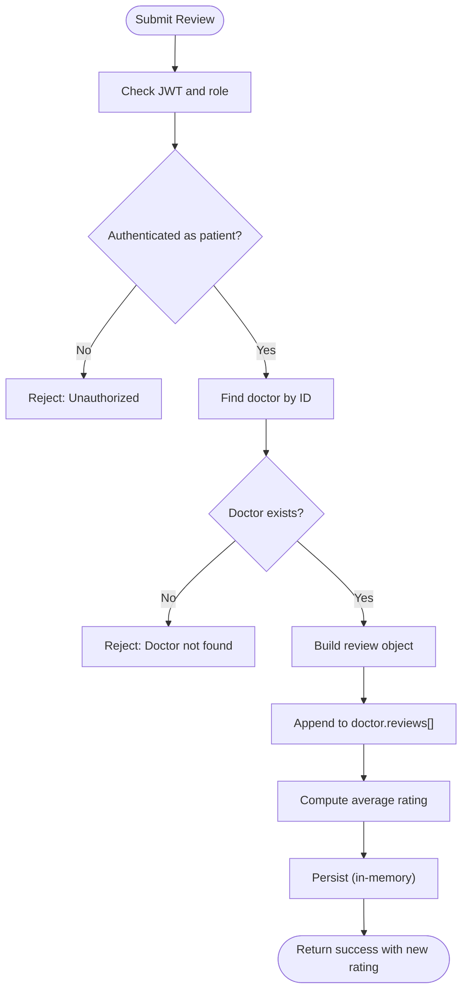
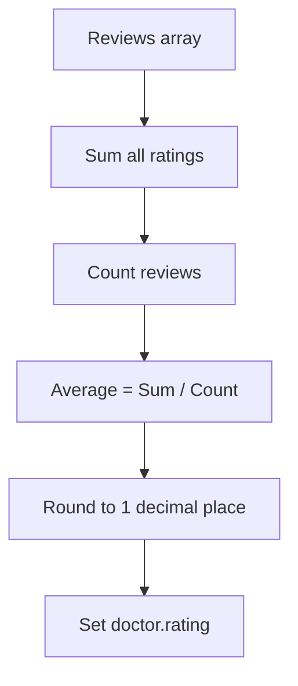
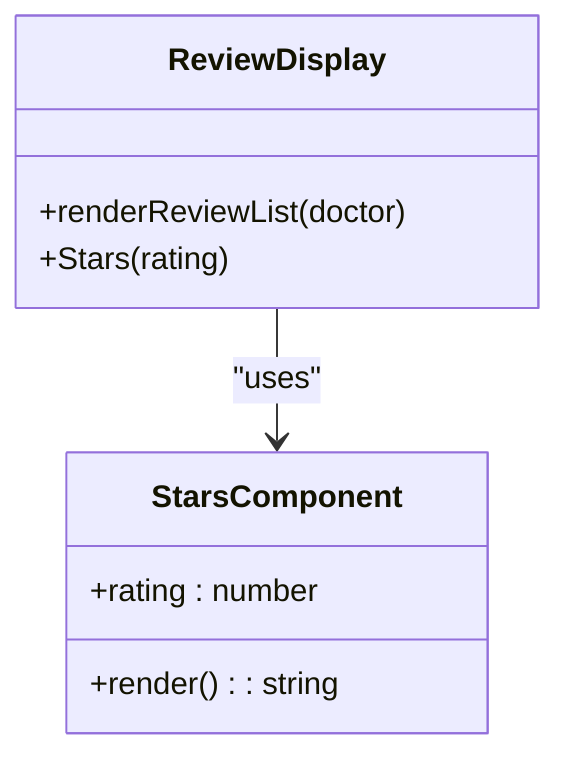
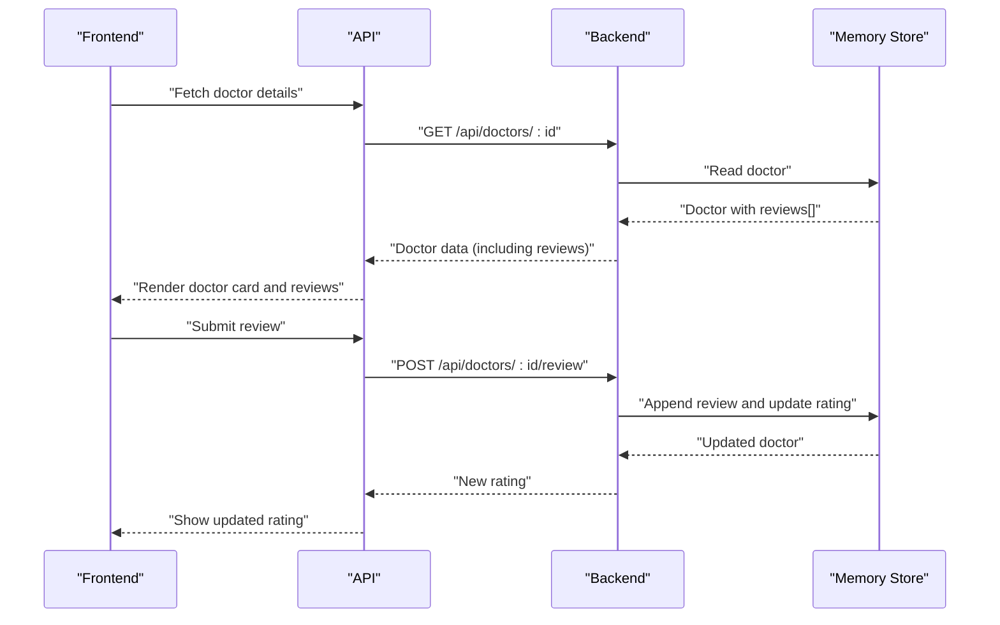
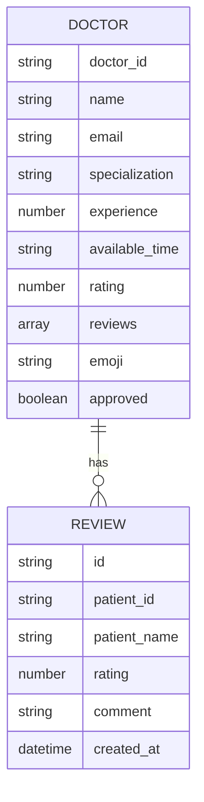
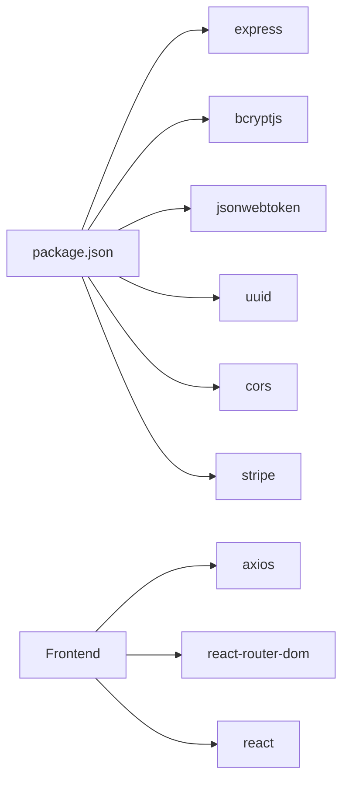

# Rating and Review System

<cite>
**Referenced Files in This Document**
- [server.js](file://server.js)
- [api.js](file://api.js)
- [BookAppointment.jsx](file://BookAppointment.jsx)
- [AuthContext.jsx](file://AuthContext.jsx)
- [UI.jsx](file://UI.jsx)
- [index.html](file://index.html)
- [package.json](file://package.json)
</cite>

## Table of Contents
1. [Introduction](#introduction)
2. [Project Structure](#project-structure)
3. [Core Components](#core-components)
4. [Architecture Overview](#architecture-overview)
5. [Detailed Component Analysis](#detailed-component-analysis)
6. [Dependency Analysis](#dependency-analysis)
7. [Performance Considerations](#performance-considerations)
8. [Troubleshooting Guide](#troubleshooting-guide)
9. [Conclusion](#conclusion)

## Introduction
This document describes the rating and review system for the MediBook application. It covers the end-to-end workflow from patient authentication and appointment completion to review submission, rating aggregation, and display. It also outlines moderation and management capabilities for administrators, and the integration between reviews and doctor profiles, including real-time rating updates.

## Project Structure
The system spans a Node.js/Express backend and a React frontend. The backend exposes REST endpoints for authentication, doctor listings, appointments, payments, and reviews. The frontend includes React pages and components for booking, reviewing, and displaying doctor information, along with shared UI utilities for star ratings and toast notifications.

**Diagram sources**
- [BookAppointment.jsx](file://BookAppointment.jsx#L1-L171)
- [UI.jsx](file://UI.jsx#L33-L41)
- [AuthContext.jsx](file://AuthContext.jsx#L1-L41)
- [api.js](file://api.js#L1-L44)
- [server.js](file://server.js#L1-L390)

**Section sources**
- [server.js](file://server.js#L1-L390)
- [api.js](file://api.js#L1-L44)
- [BookAppointment.jsx](file://BookAppointment.jsx#L1-L171)
- [AuthContext.jsx](file://AuthContext.jsx#L1-L41)
- [UI.jsx](file://UI.jsx#L1-L182)

## Core Components
- Authentication and Authorization
  - Patient, doctor, and admin login endpoints with JWT-based middleware.
  - Frontend stores tokens and sets Authorization headers automatically.
- Reviews
  - Submission endpoint protected by patient role.
  - Real-time rating recalculation and update on the doctor profile.
- Display
  - Star rendering component for numeric ratings.
  - Review list rendering with patient name and optional comment.
- Moderation and Management
  - Admin dashboard endpoints for managing appointments, patients, and doctors.

**Section sources**
- [server.js](file://server.js#L49-L62)
- [server.js](file://server.js#L155-L164)
- [AuthContext.jsx](file://AuthContext.jsx#L6-L37)
- [UI.jsx](file://UI.jsx#L33-L41)
- [BookAppointment.jsx](file://BookAppointment.jsx#L129-L170)
- [api.js](file://api.js#L11-L14)
- [server.js](file://server.js#L242-L280)

## Architecture Overview
The review system integrates with the appointment lifecycle. After a successful consultation, the frontend enables review submission. The patient must be authenticated; the backend validates the JWT and ensures the patient had an appointment with the doctor. Reviews are appended to the doctor’s record and the average rating is recalculated immediately.

**Diagram sources**
- [BookAppointment.jsx](file://BookAppointment.jsx#L62-L69)
- [api.js](file://api.js#L14)
- [server.js](file://server.js#L155-L164)

## Detailed Component Analysis

### Review Submission Workflow
- Authentication requirement
  - The review endpoint requires a valid JWT with role “patient”.
- Validation and persistence
  - The backend verifies the doctor exists and creates a review object with patient identity, rating, and comment.
- Rating recalculation
  - The backend computes a new average rating from the updated review list and returns it to the frontend.

**Diagram sources**
- [server.js](file://server.js#L155-L164)

**Section sources**
- [server.js](file://server.js#L155-L164)
- [BookAppointment.jsx](file://BookAppointment.jsx#L62-L69)
- [AuthContext.jsx](file://AuthContext.jsx#L6-L37)

### Rating Calculation Algorithm
- Input
  - Array of reviews for a doctor, each containing a numeric rating.
- Process
  - Sum all ratings and divide by the count of reviews.
  - Round to one decimal place.
- Output
  - Updated doctor rating field.

**Diagram sources**
- [server.js](file://server.js#L162)

**Section sources**
- [server.js](file://server.js#L162)

### Review Display System
- Individual review formatting
  - Each review displays the patient name and star rating.
  - Optional comment is shown below the rating.
- Star rendering
  - A reusable component renders filled stars up to the rating value, with half-star support and a numeric label.
- Timestamp handling
  - Reviews include a creation timestamp; the frontend currently displays patient name and rating per review. No explicit timestamp formatting is shown in the reviewed components.

**Diagram sources**
- [BookAppointment.jsx](file://BookAppointment.jsx#L156-L166)
- [UI.jsx](file://UI.jsx#L33-L41)

**Section sources**
- [BookAppointment.jsx](file://BookAppointment.jsx#L156-L166)
- [UI.jsx](file://UI.jsx#L33-L41)

### Review Moderation and Management (Admin)
- Admin endpoints enable oversight of system data.
- While direct review moderation is not implemented in the reviewed code, administrators can:
  - View all appointments and patients.
  - Remove doctors.
  - Access administrative statistics.

Note: There are no dedicated endpoints for editing or deleting reviews in the reviewed backend code.

**Section sources**
- [server.js](file://server.js#L242-L280)

### Integration with Doctor Profiles
- Real-time rating updates
  - After a review is submitted, the backend recalculates and returns the new rating to the frontend.
- Display optimization
  - The frontend displays the doctor’s emoji, name, specialization, experience, and current rating using the star component.

**Diagram sources**
- [BookAppointment.jsx](file://BookAppointment.jsx#L28-L32)
- [BookAppointment.jsx](file://BookAppointment.jsx#L62-L69)
- [server.js](file://server.js#L126-L131)
- [server.js](file://server.js#L155-L164)

**Section sources**
- [BookAppointment.jsx](file://BookAppointment.jsx#L28-L32)
- [BookAppointment.jsx](file://BookAppointment.jsx#L88)
- [server.js](file://server.js#L126-L131)
- [server.js](file://server.js#L155-L164)

### Review Data Structure
- Review object fields
  - Identifier, patient identifier and name, rating score, comment, and creation timestamp.
- Doctor profile integration
  - Doctor records include an array of reviews and a computed rating.

**Diagram sources**
- [server.js](file://server.js#L29-L44)
- [server.js](file://server.js#L155-L164)

**Section sources**
- [server.js](file://server.js#L29-L44)
- [server.js](file://server.js#L155-L164)

### Examples

- Review submission workflow
  - Patient selects a rating and optional comment, then submits.
  - The frontend calls the review endpoint; the backend validates and recalculates the rating.
  - The frontend acknowledges success and shows the updated rating.

- Rating calculation formula
  - Average = sum of ratings / count of ratings, rounded to 1 decimal place.

- Display formatting
  - Reviews list shows patient name and star rating; optional comment appears beneath.

**Section sources**
- [BookAppointment.jsx](file://BookAppointment.jsx#L62-L69)
- [server.js](file://server.js#L162)
- [BookAppointment.jsx](file://BookAppointment.jsx#L156-L166)
- [UI.jsx](file://UI.jsx#L33-L41)

### Quality Control Measures
- Current protections observed in the codebase
  - Patient-only access to review submission via JWT middleware.
  - Doctor lookup and existence check before appending a review.
- Additional safeguards not present in the reviewed code
  - No duplicate review detection for the same doctor and patient.
  - No review moderation interface for administrators.
  - No anti-fraud heuristics (e.g., IP checks, device fingerprinting, or behavioral analytics).
- Recommendations for future enhancements
  - Enforce uniqueness of reviews per patient-doctor pair.
  - Implement admin moderation controls (approve/delete/edit reviews).
  - Add rate limiting and anomaly detection for review submissions.

**Section sources**
- [server.js](file://server.js#L49-L62)
- [server.js](file://server.js#L155-L164)
- [server.js](file://server.js#L242-L280)

## Dependency Analysis
- Frontend dependencies
  - React, react-router-dom, axios, and local storage for auth state.
- Backend dependencies
  - Express, bcryptjs, jsonwebtoken, uuid, cors, and Stripe (optional).
- API surface
  - Patient-facing endpoints for authentication, doctor listings, appointments, payments, and reviews.
  - Admin endpoints for stats, appointments, patients, and doctors.

**Diagram sources**
- [package.json](file://package.json#L14-L22)

**Section sources**
- [package.json](file://package.json#L1-L24)

## Performance Considerations
- In-memory storage
  - The backend uses an in-memory store; performance scales with data size and concurrent requests.
- Rating recalculation
  - O(n) per review submission; acceptable for small datasets but consider caching or indexed reads for larger volumes.
- Frontend rendering
  - Star rendering and review lists are lightweight; ensure virtualization for very long review lists.

[No sources needed since this section provides general guidance]

## Troubleshooting Guide
- Authentication errors
  - Missing or invalid JWT token leads to unauthorized responses during review submission.
- Doctor not found
  - Submitting a review for a non-existent doctor returns a not-found error.
- Network issues
  - Verify API base URL and CORS configuration if requests fail.

**Section sources**
- [server.js](file://server.js#L49-L62)
- [server.js](file://server.js#L155-L164)

## Conclusion
The rating and review system integrates tightly with the appointment lifecycle, enforcing patient authentication and performing immediate rating updates upon review submission. The frontend provides a clean UI for submitting reviews and viewing existing ones with star ratings. Administrators can oversee system data, though direct review moderation is not implemented in the reviewed code. Future enhancements should focus on preventing duplicate reviews, adding moderation controls, and implementing anti-fraud measures.