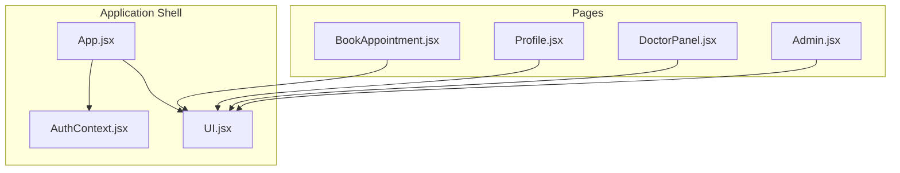
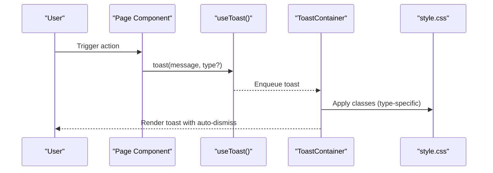
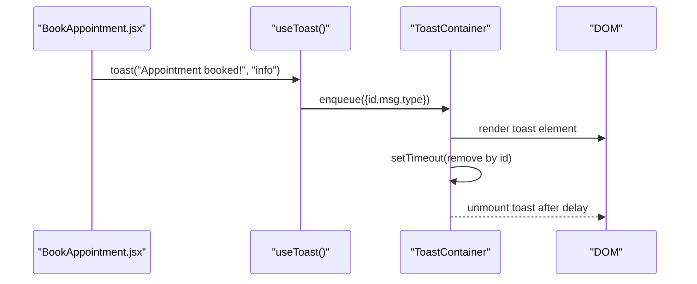
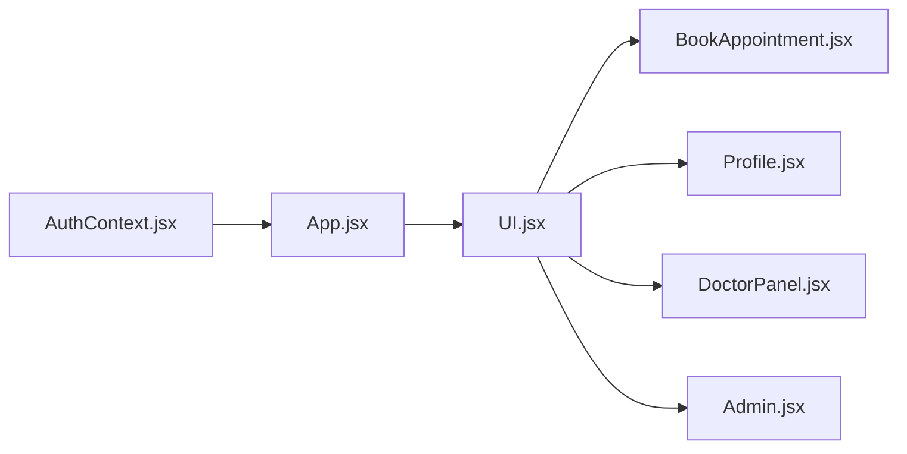

# Core UI Components

<cite>
**Referenced Files in This Document**
- [UI.jsx](file://UI.jsx)
- [App.jsx](file://App.jsx)
- [AuthContext.jsx](file://AuthContext.jsx)
- [BookAppointment.jsx](file://BookAppointment.jsx)
- [Profile.jsx](file://Profile.jsx)
- [DoctorPanel.jsx](file://DoctorPanel.jsx)
- [Admin.jsx](file://Admin.jsx)
- [style.css](file://style.css)
- [README.md](file://README.md)
</cite>

## Table of Contents
1. [Introduction](#introduction)
2. [Project Structure](#project-structure)
3. [Core Components](#core-components)
4. [Architecture Overview](#architecture-overview)
5. [Detailed Component Analysis](#detailed-component-analysis)
6. [Dependency Analysis](#dependency-analysis)
7. [Performance Considerations](#performance-considerations)
8. [Troubleshooting Guide](#troubleshooting-guide)
9. [Conclusion](#conclusion)

## Introduction
This document describes the core reusable UI components library used across the application. It focuses on:
- Toast notification system with useToast hook and ToastContainer
- Spinner for loading states
- Stars for rating displays
- ProbBar for confirmation probability visualization with dynamic coloring
- Countdown timer with date/time parsing and real-time updates
- StatusBadge for displaying appointment statuses

It also covers component props, usage patterns, styling integration, accessibility considerations, and examples of component composition with the authentication system.

## Project Structure
The UI components live in a single module and are consumed by multiple pages. The application bootstraps global providers and mounts the UI components at the top level.

**Diagram sources**
- [App.jsx](file://App.jsx#L15-L42)
- [AuthContext.jsx](file://AuthContext.jsx#L6-L38)
- [UI.jsx](file://UI.jsx#L1-L182)
- [BookAppointment.jsx](file://BookAppointment.jsx#L1-L171)
- [Profile.jsx](file://Profile.jsx#L1-L97)
- [DoctorPanel.jsx](file://DoctorPanel.jsx#L1-L96)
- [Admin.jsx](file://Admin.jsx#L1-L194)

**Section sources**
- [App.jsx](file://App.jsx#L1-L44)
- [README.md](file://README.md#L1-L159)

## Core Components
This section summarizes each component’s purpose, props, behavior, and styling integration.

- ToastContainer
  - Purpose: Renders toast notifications with auto-dismiss.
  - Props: None (managed internally via hook).
  - Behavior: Maintains an internal queue and auto-removes toasts after a delay.
  - Styling: Uses CSS classes for container and per-type borders.
  - Accessibility: Notably does not manage focus or ARIA live regions; consider adding ARIA attributes for assistive technologies.

- useToast
  - Purpose: Provides a simple API to enqueue toasts.
  - Usage pattern: Destructure toast from the hook and call with a message and optional type.
  - Types: Supports info, success, and error categories (mapped to CSS classes).

- Spinner
  - Purpose: Loading indicator during async operations.
  - Props: None.
  - Styling: Uses a rotating border animation.

- Stars
  - Purpose: Visual star rating display with numeric value.
  - Props: rating (number).
  - Styling: Uses a dedicated class and inline styles for the numeric label.

- ProbBar
  - Purpose: Confirmation probability visualization with dynamic color and label.
  - Props: pct (percentage number).
  - Behavior: Selects color and label based on thresholds.
  - Styling: Uses a wrapper and inner bar with CSS transitions.

- Countdown
  - Purpose: Real-time countdown until a target datetime.
  - Props: dateStr (YYYY-MM-DD), timeStr ("HH:MM AM/PM").
  - Behavior: Parses date/time, computes difference, updates every minute.
  - Styling: Uses a dedicated class and numeric font family for readability.

- StatusBadge
  - Purpose: Displays appointment status with role-appropriate styling.
  - Props: status (string).
  - Styling: Uses CSS classes mapped to status values.

**Section sources**
- [UI.jsx](file://UI.jsx#L6-L25)
- [UI.jsx](file://UI.jsx#L28-L30)
- [UI.jsx](file://UI.jsx#L33-L41)
- [UI.jsx](file://UI.jsx#L44-L58)
- [UI.jsx](file://UI.jsx#L61-L94)
- [UI.jsx](file://UI.jsx#L179-L181)
- [style.css](file://style.css#L235-L267)

## Architecture Overview
The UI components are composed at the application shell level and used by page components. Authentication state is centralized and consumed by both pages and UI components.

**Diagram sources**
- [App.jsx](file://App.jsx#L19-L21)
- [UI.jsx](file://UI.jsx#L6-L25)
- [style.css](file://style.css#L235-L245)

## Detailed Component Analysis

### Toast Notification System
- useToast hook
  - Returns an object with a toast method that accepts a message and type.
  - Internally stores a reference to the container’s add function.
  - Supports multiple toast types via CSS class mapping.

- ToastContainer
  - Manages an internal array of toasts with unique ids.
  - Adds a new toast and schedules removal after a fixed delay.
  - Renders each toast with a type-specific class.

- Usage patterns
  - Pages import useToast and call toast with appropriate messages.
  - Common patterns: info for progress, success for completion, error for failures.

- Styling integration
  - Container and individual toast elements use CSS classes.
  - Type-specific borders are applied via classes.

- Accessibility considerations
  - No ARIA live region or focus management is implemented.
  - Recommendation: Add an aria-live region and ensure keyboard operability.

**Diagram sources**
- [BookAppointment.jsx](file://BookAppointment.jsx#L46-L46)
- [UI.jsx](file://UI.jsx#L7-L17)
- [style.css](file://style.css#L235-L245)

**Section sources**
- [UI.jsx](file://UI.jsx#L6-L25)
- [BookAppointment.jsx](file://BookAppointment.jsx#L46-L46)
- [Profile.jsx](file://Profile.jsx#L35-L35)
- [DoctorPanel.jsx](file://DoctorPanel.jsx#L26-L27)
- [Admin.jsx](file://Admin.jsx#L30-L31)
- [style.css](file://style.css#L235-L245)

### Spinner Component
- Purpose: Visual feedback while data loads.
- Props: None.
- Styling: Centered spinner with rotation animation.

Usage example
- Pages show Spinner while fetching data or performing async operations.

**Section sources**
- [UI.jsx](file://UI.jsx#L28-L30)
- [BookAppointment.jsx](file://BookAppointment.jsx#L71-L71)
- [Profile.jsx](file://Profile.jsx#L42-L42)
- [DoctorPanel.jsx](file://DoctorPanel.jsx#L33-L33)
- [Admin.jsx](file://Admin.jsx#L43-L43)
- [style.css](file://style.css#L247-L251)

### Stars Component
- Purpose: Display star-based ratings with numeric label.
- Props: rating (number).
- Styling: Uses a dedicated class for stars and inline styles for the numeric label.

Usage example
- Displays doctor ratings and allows interactive rating submission.

**Section sources**
- [UI.jsx](file://UI.jsx#L33-L41)
- [BookAppointment.jsx](file://BookAppointment.jsx#L88-L88)
- [BookAppointment.jsx](file://BookAppointment.jsx#L160-L160)

### ProbBar Component
- Purpose: Visualize confirmation probability with dynamic color and label.
- Props: pct (percentage number).
- Behavior: Chooses color and label based on thresholds.
- Styling: Wrapper and inner bar with CSS transitions.

Usage example
- Shown during booking to indicate likelihood of appointment confirmation.

**Section sources**
- [UI.jsx](file://UI.jsx#L44-L58)
- [BookAppointment.jsx](file://BookAppointment.jsx#L119-L119)
- [style.css](file://style.css#L257-L260)

### Countdown Timer Component
- Purpose: Show remaining time until a scheduled appointment.
- Props: dateStr (YYYY-MM-DD), timeStr ("HH:MM AM/PM").
- Behavior: Parses date/time, computes difference, updates every minute.
- Styling: Uses a dedicated class and numeric font for readability.

Usage example
- Integrated into appointment-related pages to show countdown.

**Section sources**
- [UI.jsx](file://UI.jsx#L61-L94)
- [style.css](file://style.css#L262-L267)

### StatusBadge Component
- Purpose: Display appointment status with role-appropriate styling.
- Props: status (string).
- Styling: Uses CSS classes mapped to status values.

Usage example
- Used in doctor and admin panels to reflect appointment state.

**Section sources**
- [UI.jsx](file://UI.jsx#L179-L181)
- [DoctorPanel.jsx](file://DoctorPanel.jsx#L81-L81)
- [Admin.jsx](file://Admin.jsx#L92-L92)
- [style.css](file://style.css#L159-L164)

## Dependency Analysis
- Component dependencies
  - UI.jsx exports all reusable components and hooks.
  - App.jsx imports and renders ToastContainer globally.
  - Pages import UI components and use useToast via destructuring.

- Provider integration
  - AuthContext manages authentication state and persists theme preference.
  - UI components rely on AuthContext for user-aware navigation and actions.

**Diagram sources**
- [AuthContext.jsx](file://AuthContext.jsx#L6-L38)
- [App.jsx](file://App.jsx#L15-L42)
- [UI.jsx](file://UI.jsx#L1-L182)
- [BookAppointment.jsx](file://BookAppointment.jsx#L1-L171)
- [Profile.jsx](file://Profile.jsx#L1-L97)
- [DoctorPanel.jsx](file://DoctorPanel.jsx#L1-L96)
- [Admin.jsx](file://Admin.jsx#L1-L194)

**Section sources**
- [App.jsx](file://App.jsx#L1-L44)
- [AuthContext.jsx](file://AuthContext.jsx#L1-L41)
- [UI.jsx](file://UI.jsx#L1-L182)

## Performance Considerations
- Toast auto-dismiss
  - Each toast sets a timeout; avoid excessive concurrent toasts to prevent memory pressure.
- Countdown updates
  - Updates every minute; acceptable for low frequency; ensure cleanup on unmount.
- ProbBar rendering
  - Simple reflow; negligible cost.
- Spinner usage
  - Keep visible only during meaningful operations to avoid perceived slowness.

## Troubleshooting Guide
- Toasts not appearing
  - Ensure ToastContainer is rendered in the application shell.
  - Verify useToast is imported and called correctly.

- Toasts not disappearing
  - Confirm the auto-dismiss timeout is not blocked by long-running operations.

- Spinner remains visible
  - Ensure loading state is toggled appropriately after async operations.

- Stars not updating
  - Verify rating prop is passed and updated on state changes.

- ProbBar color not changing
  - Confirm pct prop meets threshold conditions.

- Countdown not updating
  - Ensure dateStr and timeStr props change when the target time changes.

- StatusBadge not styled
  - Confirm status matches a supported value and CSS classes are present.

**Section sources**
- [App.jsx](file://App.jsx#L19-L21)
- [UI.jsx](file://UI.jsx#L6-L25)
- [UI.jsx](file://UI.jsx#L28-L30)
- [UI.jsx](file://UI.jsx#L33-L41)
- [UI.jsx](file://UI.jsx#L44-L58)
- [UI.jsx](file://UI.jsx#L61-L94)
- [UI.jsx](file://UI.jsx#L179-L181)

## Conclusion
The core UI components provide a cohesive, reusable foundation for the application. They integrate cleanly with the routing and provider architecture, enabling consistent user feedback, loading states, ratings, probability visualization, countdowns, and status indicators. Extending these components with accessibility enhancements (e.g., ARIA live regions for toasts) would further improve inclusivity.