# Frontend Components

<cite>
**Referenced Files in This Document**
- [App.jsx](file://App.jsx)
- [UI.jsx](file://UI.jsx)
- [AuthContext.jsx](file://AuthContext.jsx)
- [BookAppointment.jsx](file://BookAppointment.jsx)
- [Profile.jsx](file://Profile.jsx)
- [Admin.jsx](file://Admin.jsx)
- [DoctorPanel.jsx](file://DoctorPanel.jsx)
- [Payment.jsx](file://Payment.jsx)
- [api.js](file://api.js)
- [style.css](file://style.css)
- [index.html](file://index.html)
</cite>

## Table of Contents
1. [Introduction](#introduction)
2. [Project Structure](#project-structure)
3. [Core Components](#core-components)
4. [Architecture Overview](#architecture-overview)
5. [Detailed Component Analysis](#detailed-component-analysis)
6. [Dependency Analysis](#dependency-analysis)
7. [Performance Considerations](#performance-considerations)
8. [Troubleshooting Guide](#troubleshooting-guide)
9. [Conclusion](#conclusion)
10. [Appendices](#appendices)

## Introduction
This document describes the frontend component architecture for the Doctor appointment booking system. It covers the main App shell with routing, the reusable UI component library, state management via React Context, styling with CSS variables and dark mode, and page-specific components for booking, profile, admin, and doctor panel. It also includes guidelines for component development, reusability, and API integration.

## Project Structure
The frontend is a React application bootstrapped with Vite and served via a simple Express server. Routing is handled client-side with react-router-dom. Global state is centralized using a custom AuthProvider. Styling leverages CSS variables and a dark mode system applied to the document root.

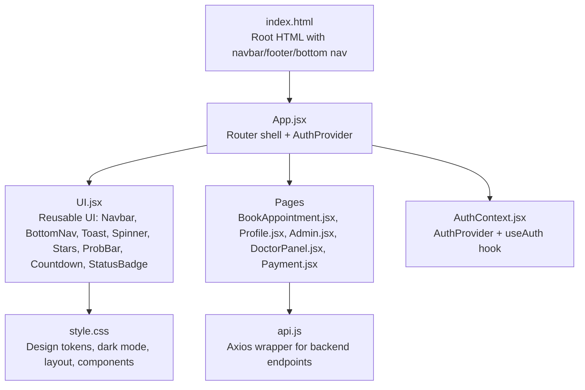

**Diagram sources**
- [App.jsx](file://App.jsx#L1-L44)
- [UI.jsx](file://UI.jsx#L1-L182)
- [AuthContext.jsx](file://AuthContext.jsx#L1-L41)
- [BookAppointment.jsx](file://BookAppointment.jsx#L1-L171)
- [Profile.jsx](file://Profile.jsx#L1-L97)
- [Admin.jsx](file://Admin.jsx#L1-L194)
- [DoctorPanel.jsx](file://DoctorPanel.jsx#L1-L96)
- [Payment.jsx](file://Payment.jsx#L1-L350)
- [api.js](file://api.js#L1-L44)
- [style.css](file://style.css#L1-L765)
- [index.html](file://index.html#L1-L531)

**Section sources**
- [App.jsx](file://App.jsx#L1-L44)
- [index.html](file://index.html#L1-L531)

## Core Components
- App shell and routing: Declares routes for public and protected pages, wraps children in AuthProvider, and renders shared UI (Navbar, ToastContainer, BottomNav).
- UI library: Provides composable, presentational components (Navbar, BottomNav, ToastContainer, Spinner, Stars, ProbBar, Countdown, StatusBadge).
- Auth provider: Centralizes user session, JWT token, and dark mode preference with persistence in localStorage and effect-driven theme application.
- API layer: Axios-based service module exporting typed endpoints for auth, doctors, appointments, doctor panel, admin, and payments.

Key implementation references:
- App routing and navigation: [App.jsx](file://App.jsx#L15-L42)
- UI components: [UI.jsx](file://UI.jsx#L97-L182)
- Auth provider and theme: [AuthContext.jsx](file://AuthContext.jsx#L6-L38)
- API endpoints: [api.js](file://api.js#L3-L44)

**Section sources**
- [App.jsx](file://App.jsx#L15-L42)
- [UI.jsx](file://UI.jsx#L1-L182)
- [AuthContext.jsx](file://AuthContext.jsx#L1-L41)
- [api.js](file://api.js#L1-L44)

## Architecture Overview
The system follows a layered pattern:
- Presentation layer: App shell and page components
- UI library: Shared presentational components
- State layer: AuthProvider via Context
- Data layer: api.js Axios wrapper
- Styling: CSS variables with dark mode and responsive breakpoints

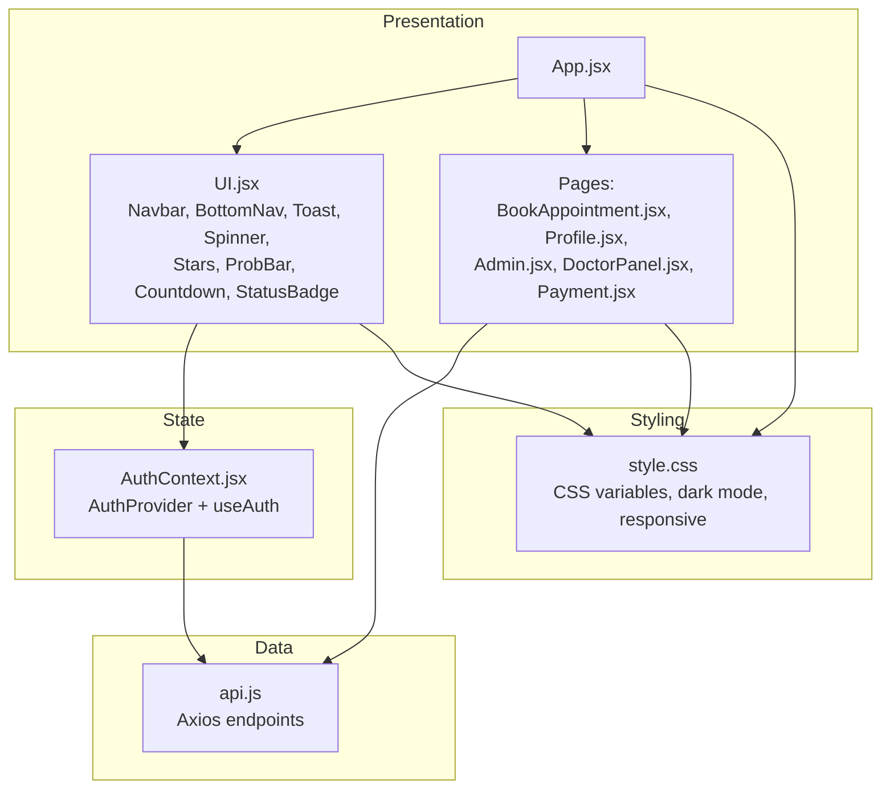

**Diagram sources**
- [App.jsx](file://App.jsx#L1-L44)
- [UI.jsx](file://UI.jsx#L1-L182)
- [AuthContext.jsx](file://AuthContext.jsx#L1-L41)
- [BookAppointment.jsx](file://BookAppointment.jsx#L1-L171)
- [Profile.jsx](file://Profile.jsx#L1-L97)
- [Admin.jsx](file://Admin.jsx#L1-L194)
- [DoctorPanel.jsx](file://DoctorPanel.jsx#L1-L96)
- [Payment.jsx](file://Payment.jsx#L1-L350)
- [api.js](file://api.js#L1-L44)
- [style.css](file://style.css#L1-L765)

## Detailed Component Analysis

### App Shell and Routing
- Wraps the entire app with AuthProvider and BrowserRouter.
- Renders Navbar, ToastContainer, and BottomNav outside the Routes.
- Defines routes for Home, Auth pages, Doctors, BookAppointment, Appointments, Profile, DoctorPanel, Admin, and Payment.
- Uses route parameters (e.g., /book/:id) and navigates programmatically.

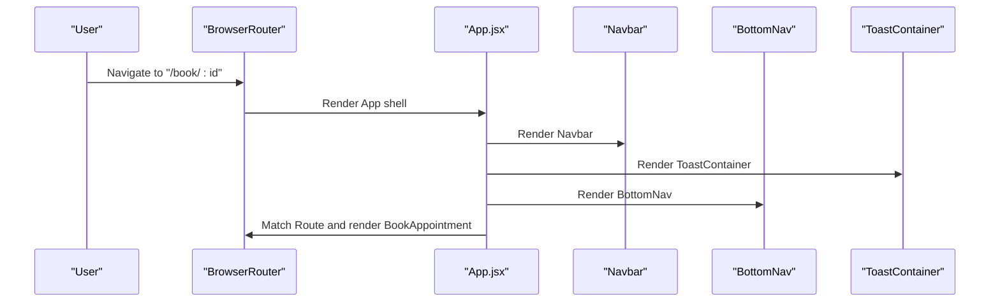

**Diagram sources**
- [App.jsx](file://App.jsx#L15-L42)
- [UI.jsx](file://UI.jsx#L97-L182)

**Section sources**
- [App.jsx](file://App.jsx#L15-L42)

### UI Library Components
- Toast system: useToast hook and ToastContainer manage transient messages with auto-dismiss.
- Spinner: loading indicator for async operations.
- Stars: displays star ratings with half-star support and numeric label.
- ProbBar: confidence probability bar with dynamic color and label.
- Countdown: live countdown timer computed from date/time props.
- Navbar: role-aware links, dark mode toggle, user actions.
- BottomNav: mobile-first bottom navigation with active state.
- StatusBadge: semantic status indicators.

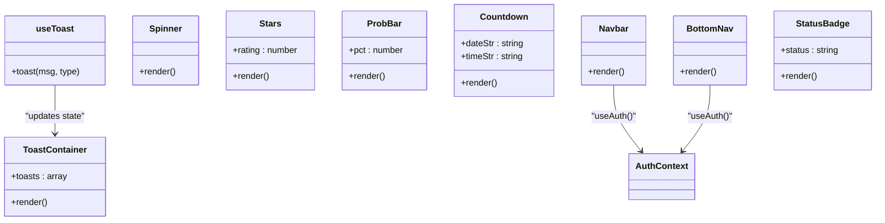

**Diagram sources**
- [UI.jsx](file://UI.jsx#L6-L182)
- [AuthContext.jsx](file://AuthContext.jsx#L1-L41)

**Section sources**
- [UI.jsx](file://UI.jsx#L1-L182)

### Authentication and Theme Management
- AuthProvider stores user, token, and dark preference in state and persists to localStorage.
- Applies Authorization header automatically when token exists.
- Sets data-theme on documentElement for CSS variable switching.
- Exposes login/logout and toggleDark via useAuth.

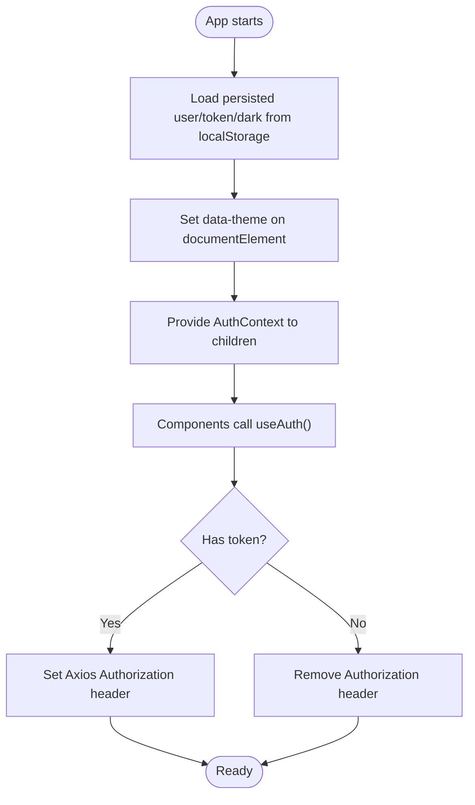

**Diagram sources**
- [AuthContext.jsx](file://AuthContext.jsx#L6-L38)

**Section sources**
- [AuthContext.jsx](file://AuthContext.jsx#L1-L41)

### Styling Architecture and Dark Mode
- CSS variables define a cohesive palette and typography.
- Dark mode toggles data-theme on the root element, enabling cascading theme changes.
- Responsive breakpoints adapt layout for mobile and tablet.
- Component-specific styles leverage shared base classes and semantic class names.

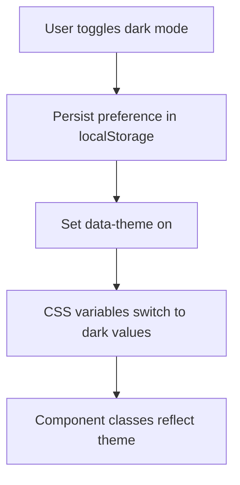

**Diagram sources**
- [AuthContext.jsx](file://AuthContext.jsx#L16-L19)
- [style.css](file://style.css#L35-L58)
- [style.css](file://style.css#L659-L679)

**Section sources**
- [style.css](file://style.css#L1-L765)
- [AuthContext.jsx](file://AuthContext.jsx#L16-L19)

### Page-Specific Components

#### BookAppointment
- Fetches doctor details by ID, manages date/slot selection, simulates confirmation probability, and navigates to Payment with state.
- Integrates review submission and displays existing reviews.
- Uses Spinner while loading, Stars for ratings, ProbBar for confirmation likelihood.

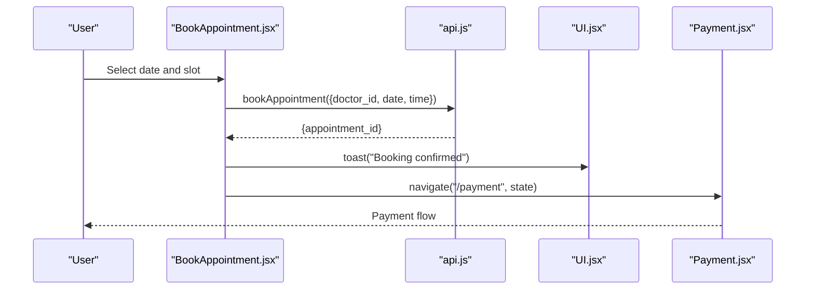

**Diagram sources**
- [BookAppointment.jsx](file://BookAppointment.jsx#L39-L60)
- [api.js](file://api.js#L17-L19)
- [UI.jsx](file://UI.jsx#L11-L25)
- [Payment.jsx](file://Payment.jsx#L23-L55)

**Section sources**
- [BookAppointment.jsx](file://BookAppointment.jsx#L1-L171)
- [api.js](file://api.js#L11-L27)

#### Profile
- Loads current profile, supports updating name/age/phone and optional password change.
- Validates minimum password length and shows errors.
- Persists updates via API and refreshes user context.

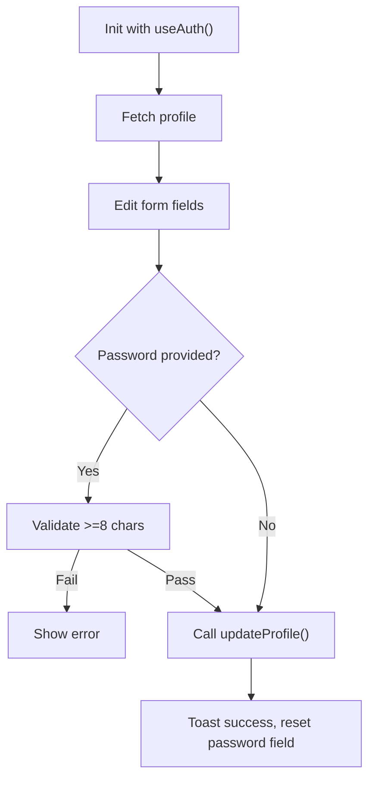

**Diagram sources**
- [Profile.jsx](file://Profile.jsx#L16-L40)
- [api.js](file://api.js#L25-L27)
- [UI.jsx](file://UI.jsx#L11-L25)

**Section sources**
- [Profile.jsx](file://Profile.jsx#L1-L97)
- [api.js](file://api.js#L25-L27)

#### Admin
- Enforces admin role and loads stats, appointments, patients, doctors, and payments concurrently.
- Updates appointment status and removes doctors with confirmation.
- Tabs-based UI for overview, appointments, patients, doctors, and payments.

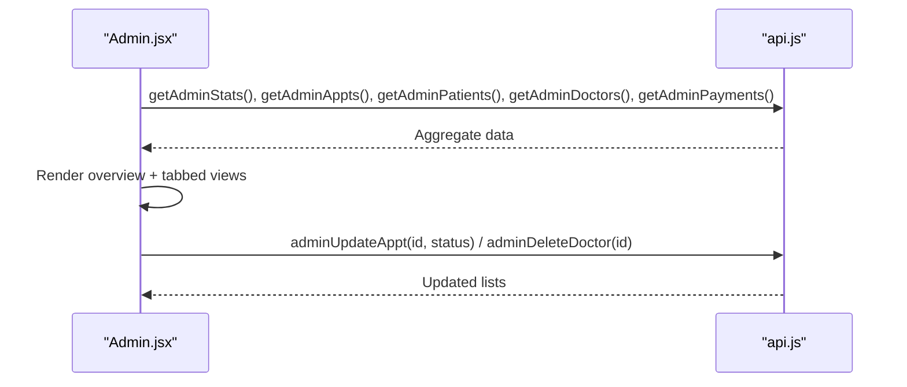

**Diagram sources**
- [Admin.jsx](file://Admin.jsx#L19-L41)
- [api.js](file://api.js#L29-L36)

**Section sources**
- [Admin.jsx](file://Admin.jsx#L1-L194)
- [api.js](file://api.js#L29-L36)

#### DoctorPanel
- Loads doctor’s appointments, filters by status, and updates statuses with toast feedback.
- Shows counts for total, pending, and approved.

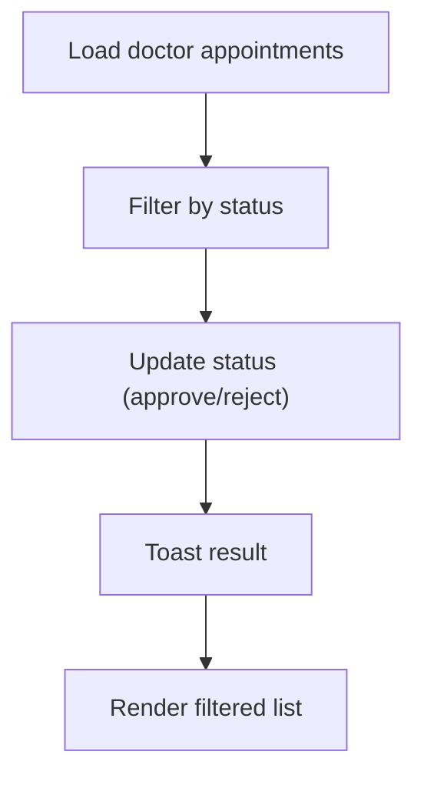

**Diagram sources**
- [DoctorPanel.jsx](file://DoctorPanel.jsx#L15-L28)
- [api.js](file://api.js#L21-L23)

**Section sources**
- [DoctorPanel.jsx](file://DoctorPanel.jsx#L1-L96)
- [api.js](file://api.js#L21-L23)

#### Payment
- Receives booking state from BookAppointment.
- Supports multiple payment methods with method-specific forms.
- Simulates payment processing and shows success with receipt.

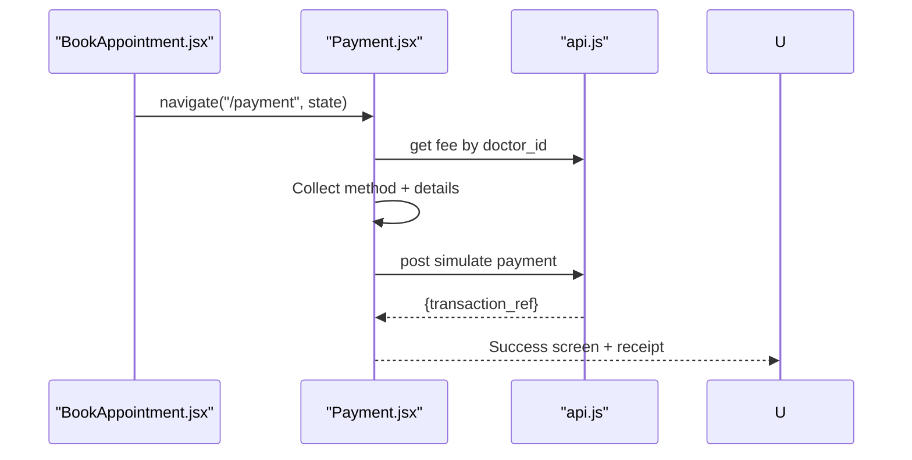

**Diagram sources**
- [BookAppointment.jsx](file://BookAppointment.jsx#L47-L56)
- [Payment.jsx](file://Payment.jsx#L23-L98)
- [api.js](file://api.js#L39-L43)

**Section sources**
- [Payment.jsx](file://Payment.jsx#L1-L350)
- [api.js](file://api.js#L39-L43)

## Dependency Analysis
- App.jsx depends on UI.jsx for shared UI and AuthContext.jsx for global state.
- Pages depend on api.js for data fetching and UI.jsx for presentational helpers.
- UI.jsx depends on AuthContext.jsx for user and theme state.
- style.css is consumed globally and drives component visuals.

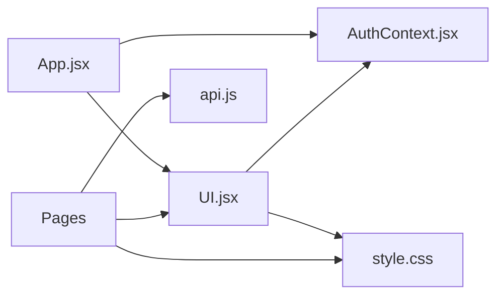

**Diagram sources**
- [App.jsx](file://App.jsx#L1-L13)
- [UI.jsx](file://UI.jsx#L1-L4)
- [AuthContext.jsx](file://AuthContext.jsx#L1-L41)
- [api.js](file://api.js#L1-L44)
- [style.css](file://style.css#L1-L765)

**Section sources**
- [App.jsx](file://App.jsx#L1-L13)
- [UI.jsx](file://UI.jsx#L1-L4)
- [AuthContext.jsx](file://AuthContext.jsx#L1-L41)
- [api.js](file://api.js#L1-L44)

## Performance Considerations
- Prefer memoized selectors and minimal re-renders in pages using local state and controlled components.
- Debounce or throttle heavy UI updates (e.g., search/filter) in list-heavy pages.
- Lazy-load images and avoid unnecessary reflows; rely on CSS transitions for animations.
- Keep toast auto-dismiss timers reasonable to prevent DOM thrash.
- Use CSS containment and isolation for complex lists to improve rendering performance.

## Troubleshooting Guide
- Authentication issues:
  - Verify token presence and Authorization header propagation via AuthProvider effects.
  - Check localStorage keys for user/token/dark persistence.
- Styling anomalies:
  - Ensure data-theme is correctly set on the root element.
  - Confirm CSS variable fallbacks and dark-mode overrides.
- API errors:
  - Inspect response shapes and error messages returned by endpoints.
  - Validate route parameters (e.g., /book/:id) and state passed during navigation.
- Toast visibility:
  - Confirm ToastContainer is rendered and toasts are cleared after timeout.

**Section sources**
- [AuthContext.jsx](file://AuthContext.jsx#L11-L19)
- [style.css](file://style.css#L35-L58)
- [api.js](file://api.js#L3-L44)
- [UI.jsx](file://UI.jsx#L11-L25)

## Conclusion
The frontend employs a clean separation of concerns: a robust App shell with routing, a reusable UI library, centralized authentication and theme via Context, and a strongly typed API layer. Styling is consistent and theme-aware, with responsive design baked in. Pages are cohesive, stateful, and integrate seamlessly with the API and shared UI components.

## Appendices

### Component Composition and Prop Passing Patterns
- App.jsx composes routes and renders shared UI around page components.
- Pages consume useAuth for user and theme state, and useToast for feedback.
- UI components accept small, focused props (e.g., rating, status, pct) and render consistently.

### Guidelines for Component Development
- Reusability:
  - Keep components pure and props-driven.
  - Extract presentational helpers (Stars, ProbBar, StatusBadge) into UI.jsx.
- State management:
  - Use Context for cross-cutting concerns (auth, theme).
  - Keep page-level state minimal and scoped.
- Styling:
  - Use CSS variables and semantic class names.
  - Add dark mode variants for interactive elements.
- API integration:
  - Centralize endpoints in api.js.
  - Handle errors gracefully and surface user-friendly messages via toasts.