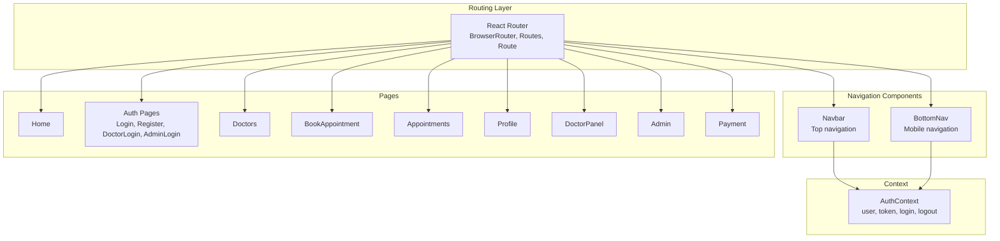
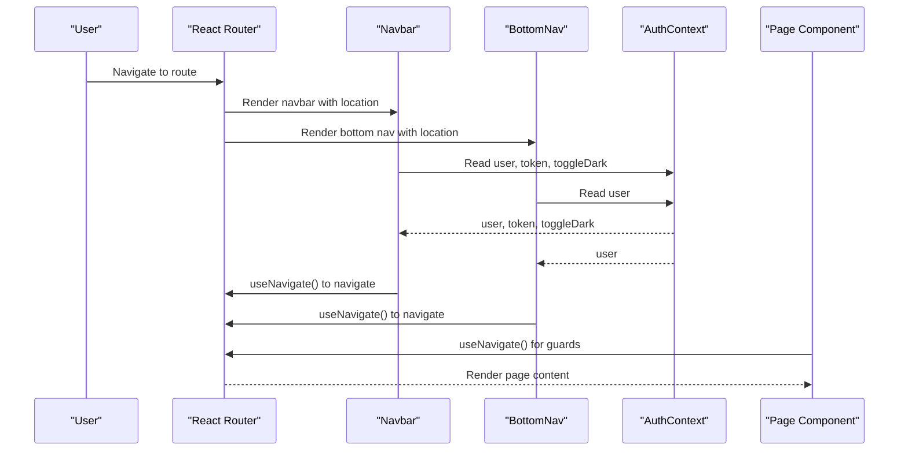
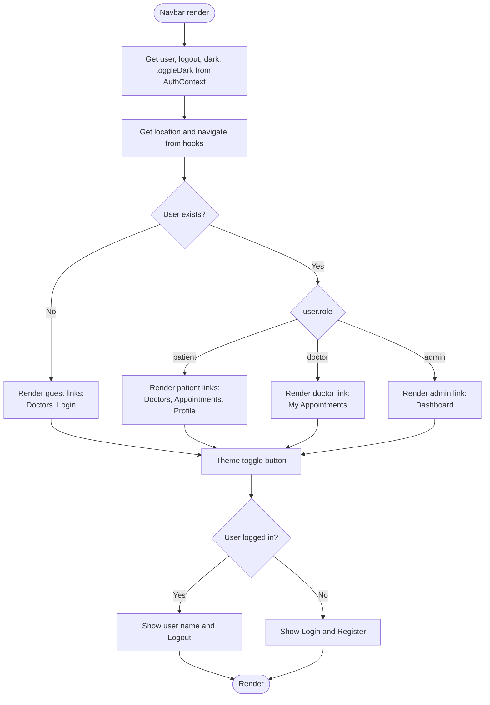
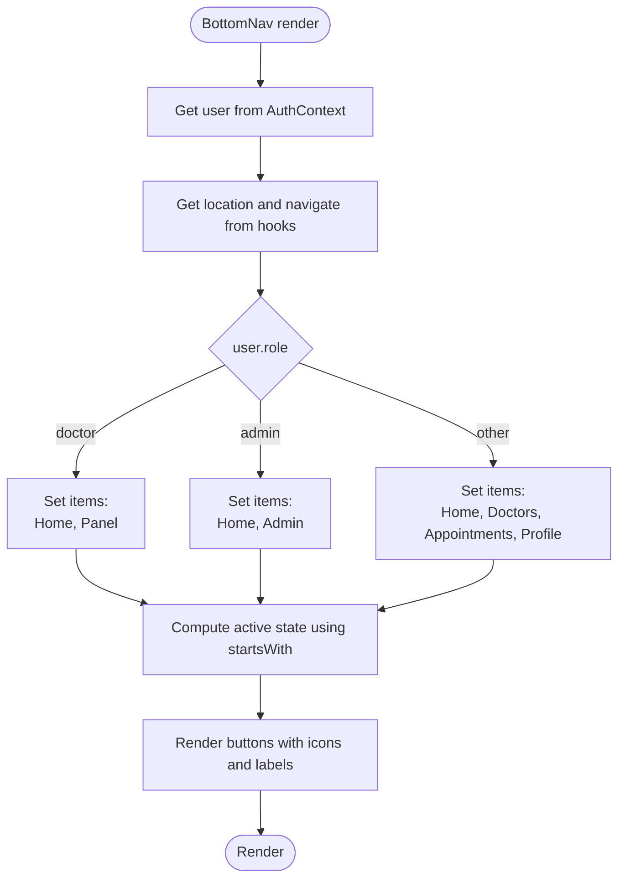
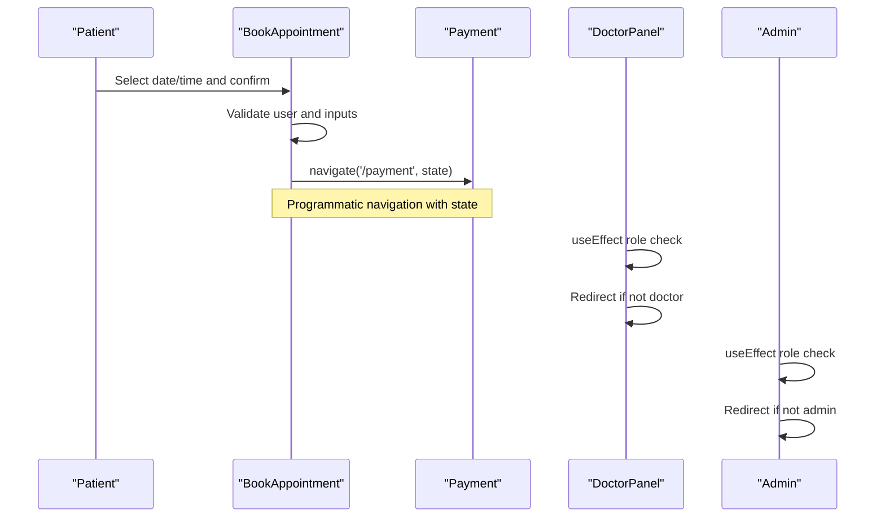
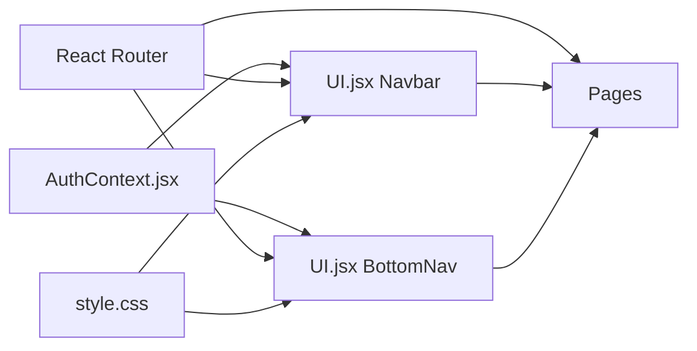

# Navigation System

<cite>
**Referenced Files in This Document**
- [App.jsx](file://App.jsx)
- [AuthContext.jsx](file://AuthContext.jsx)
- [UI.jsx](file://UI.jsx)
- [Admin.jsx](file://Admin.jsx)
- [DoctorPanel.jsx](file://DoctorPanel.jsx)
- [BookAppointment.jsx](file://BookAppointment.jsx)
- [Profile.jsx](file://Profile.jsx)
- [style.css](file://style.css)
- [api.js](file://api.js)
</cite>

## Table of Contents
1. [Introduction](#introduction)
2. [Project Structure](#project-structure)
3. [Core Components](#core-components)
4. [Architecture Overview](#architecture-overview)
5. [Detailed Component Analysis](#detailed-component-analysis)
6. [Dependency Analysis](#dependency-analysis)
7. [Performance Considerations](#performance-considerations)
8. [Troubleshooting Guide](#troubleshooting-guide)
9. [Conclusion](#conclusion)

## Introduction
This document describes the navigation system architecture for the MediBook online doctor appointment system. It covers the top-level Navbar component with role-based menu items and active state management, the mobile-first BottomNav component with role-specific item sets, routing integration with React Router, navigation functions, location-based active state detection, navigation patterns for different user roles (patient, doctor, admin), integration with authentication context for conditional rendering, examples of navigation guards, programmatic navigation, and responsive breakpoint handling.

## Project Structure
The navigation system spans several key files:
- App.jsx: Application shell with React Router setup, route definitions, and mounting of Navbar and BottomNav
- AuthContext.jsx: Authentication provider managing user state, JWT token, and theme persistence
- UI.jsx: Contains Navbar, BottomNav, and shared UI utilities
- Role-specific pages: Admin.jsx, DoctorPanel.jsx, BookAppointment.jsx, Profile.jsx demonstrate navigation guards and programmatic navigation
- style.css: Defines responsive breakpoints and mobile bottom navigation styles
- api.js: Axios wrapper used by pages for authenticated requests

**Diagram sources**
- [App.jsx](file://App.jsx#L15-L42)
- [UI.jsx](file://UI.jsx#L96-L176)
- [AuthContext.jsx](file://AuthContext.jsx#L6-L38)

**Section sources**
- [App.jsx](file://App.jsx#L1-L44)
- [UI.jsx](file://UI.jsx#L1-L182)
- [AuthContext.jsx](file://AuthContext.jsx#L1-L41)

## Core Components
- Navbar: Desktop navigation bar with role-aware links and active state detection
- BottomNav: Mobile-first bottom navigation with role-specific item sets and active state detection
- AuthContext: Provides authentication state and theme preferences to navigation components
- Programmatic navigation: useNavigate hook used across pages for navigation guards and stateful navigation

Key responsibilities:
- Role-based visibility: Links appear conditionally based on user role
- Active state management: Uses location-based detection to highlight current page
- Responsive design: Desktop nav hides on small screens; BottomNav appears
- Navigation guards: Pages redirect unauthenticated users to login routes

**Section sources**
- [UI.jsx](file://UI.jsx#L96-L176)
- [AuthContext.jsx](file://AuthContext.jsx#L1-L41)
- [Admin.jsx](file://Admin.jsx#L19-L24)
- [DoctorPanel.jsx](file://DoctorPanel.jsx#L15-L20)
- [BookAppointment.jsx](file://BookAppointment.jsx#L39-L60)
- [Profile.jsx](file://Profile.jsx#L16-L21)

## Architecture Overview
The navigation system integrates React Router with a custom authentication context to provide role-aware navigation. The Navbar and BottomNav components consume the AuthContext to render role-specific menus and active states. Pages implement navigation guards using the useNavigate hook to enforce role-based access.

**Diagram sources**
- [App.jsx](file://App.jsx#L15-L42)
- [UI.jsx](file://UI.jsx#L96-L176)
- [AuthContext.jsx](file://AuthContext.jsx#L1-L41)

## Detailed Component Analysis

### Navbar Component
The Navbar renders desktop navigation with role-aware items and active state detection.

Implementation highlights:
- Role-aware link sets:
  - Guest links: Doctors, Login
  - Patient links: Doctors, My Appointments, Profile
  - Doctor link: My Appointments
  - Admin link: Dashboard
- Active state detection: Compares current location pathname with target path
- Theme toggle: Uses AuthContext to switch dark/light mode
- Conditional rendering: Shows user name and logout when logged in; shows login/register otherwise

**Diagram sources**
- [UI.jsx](file://UI.jsx#L96-L138)

**Section sources**
- [UI.jsx](file://UI.jsx#L96-L138)

### BottomNav Component
The BottomNav provides mobile-first navigation with role-specific item sets and active state detection.

Implementation highlights:
- Role-specific item sets:
  - Patient: Home, Doctors, Appointments, Profile
  - Doctor: Home, Panel
  - Admin: Home, Admin
- Active state detection: Uses startsWith to match base paths and special-case for home
- Mobile-first: Hidden on desktop, shown on small screens via CSS media queries

**Diagram sources**
- [UI.jsx](file://UI.jsx#L140-L176)

**Section sources**
- [UI.jsx](file://UI.jsx#L140-L176)

### Routing Integration and Active State Detection
Active state detection differs between Navbar and BottomNav:
- Navbar: Exact pathname match for active state
- BottomNav: Base path match with special-case for home

Programmatic navigation patterns:
- useNavigate(): Used for role checks and redirects
- useLocation(): Used for active state computation
- useAuth(): Used for user role and theme toggling

**Section sources**
- [UI.jsx](file://UI.jsx#L96-L176)

### Role-Based Navigation Patterns
Navigation patterns vary by role:

Patient:
- Access to Doctors, Appointments, Profile
- Programmatic navigation to payment after booking
- Profile updates trigger AuthContext login to refresh user data

Doctor:
- Access to DoctorPanel for managing appointments
- Navigation guard prevents non-doctors from accessing DoctorPanel

Admin:
- Access to Admin dashboard
- Navigation guard prevents non-admins from accessing Admin

**Diagram sources**
- [BookAppointment.jsx](file://BookAppointment.jsx#L39-L60)
- [DoctorPanel.jsx](file://DoctorPanel.jsx#L15-L20)
- [Admin.jsx](file://Admin.jsx#L19-L24)

**Section sources**
- [BookAppointment.jsx](file://BookAppointment.jsx#L39-L60)
- [DoctorPanel.jsx](file://DoctorPanel.jsx#L15-L20)
- [Admin.jsx](file://Admin.jsx#L19-L24)

### Authentication Context Integration
AuthContext provides:
- User state and JWT token
- Persisted theme preference
- Login/logout functions that update localStorage and axios defaults
- Dark mode toggle that persists user preference

Navbar and BottomNav consume:
- user for role-aware rendering
- logout for sign-out actions
- toggleDark for theme switching

**Section sources**
- [AuthContext.jsx](file://AuthContext.jsx#L1-L41)
- [UI.jsx](file://UI.jsx#L96-L176)

### Responsive Design and Breakpoints
Responsive behavior:
- Desktop: Navbar visible, BottomNav hidden
- Mobile: BottomNav visible, Navbar links hidden
- Safe area insets handled for mobile devices

Breakpoint implementation:
- Media query at 900px hides desktop nav and shows bottom nav
- Additional adjustments at 600px for smaller screens

**Section sources**
- [style.css](file://style.css#L658-L679)
- [UI.jsx](file://UI.jsx#L140-L176)

## Dependency Analysis
The navigation system exhibits clear separation of concerns:
- UI.jsx depends on React Router hooks and AuthContext
- Pages depend on AuthContext for role checks and on React Router for navigation
- App.jsx orchestrates routing and mounts navigation components
- style.css provides responsive behavior independent of JavaScript

**Diagram sources**
- [App.jsx](file://App.jsx#L15-L42)
- [UI.jsx](file://UI.jsx#L96-L176)
- [AuthContext.jsx](file://AuthContext.jsx#L1-L41)
- [style.css](file://style.css#L658-L679)

**Section sources**
- [App.jsx](file://App.jsx#L15-L42)
- [UI.jsx](file://UI.jsx#L96-L176)
- [AuthContext.jsx](file://AuthContext.jsx#L1-L41)
- [style.css](file://style.css#L658-L679)

## Performance Considerations
- Efficient active state detection: Both exact match (Navbar) and prefix match (BottomNav) are O(1) operations
- Minimal re-renders: Navigation components only subscribe to user state changes via AuthContext
- CSS-driven responsive behavior reduces JavaScript overhead
- useNavigate is memoized and lightweight for programmatic navigation

## Troubleshooting Guide
Common issues and resolutions:

Active state not updating:
- Verify useLocation is used for active state detection
- Ensure path comparisons match the intended behavior (exact vs prefix)

Navigation guards not working:
- Confirm useEffect runs on user changes
- Check that redirects use navigate('/route') without blocking the render cycle

Mobile navigation missing:
- Verify media queries at 900px and 600px
- Ensure bottom-nav display property is set to block on small screens

Authentication state not persisting:
- Confirm AuthContext persists user and token to localStorage
- Check axios defaults are updated when token changes

**Section sources**
- [UI.jsx](file://UI.jsx#L96-L176)
- [AuthContext.jsx](file://AuthContext.jsx#L1-L41)
- [Admin.jsx](file://Admin.jsx#L19-L24)
- [DoctorPanel.jsx](file://DoctorPanel.jsx#L15-L20)
- [BookAppointment.jsx](file://BookAppointment.jsx#L39-L60)
- [Profile.jsx](file://Profile.jsx#L16-L21)

## Conclusion
The navigation system provides a cohesive, role-aware, and responsive user interface. Navbar and BottomNav share common patterns while adapting to different screen sizes. Authentication context enables conditional rendering and navigation guards, while React Router handles programmatic navigation and active state detection. The design balances simplicity with flexibility, supporting future enhancements such as additional roles or navigation patterns.