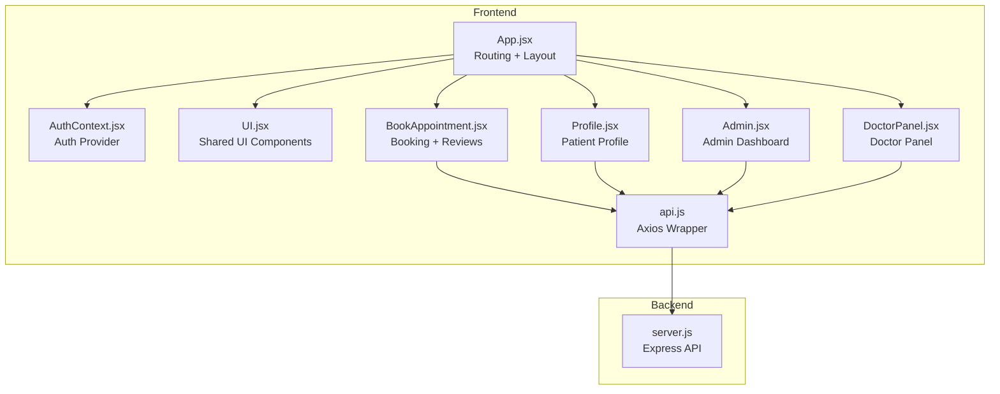
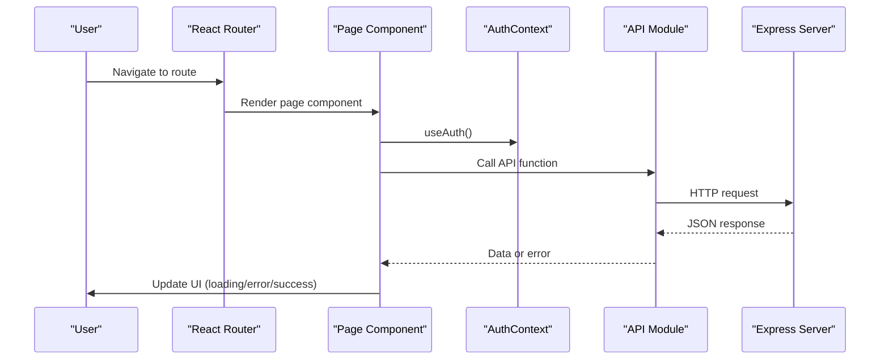
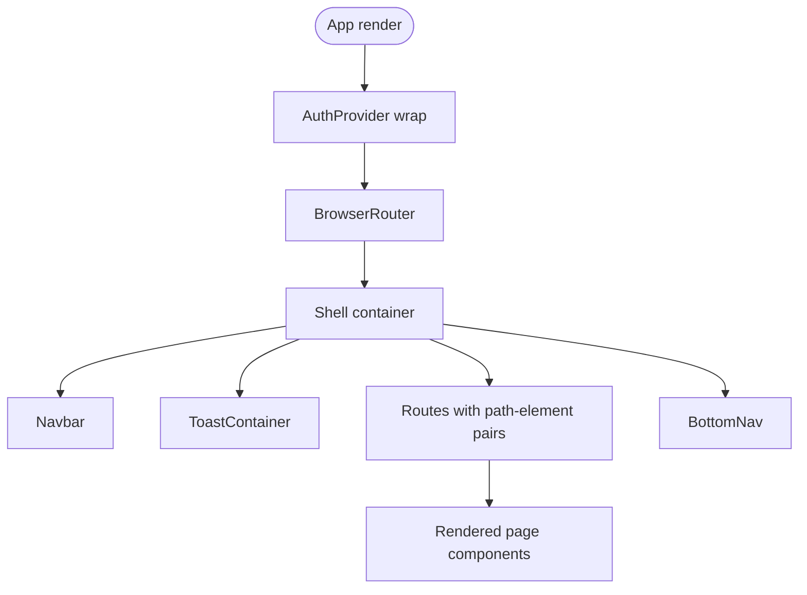
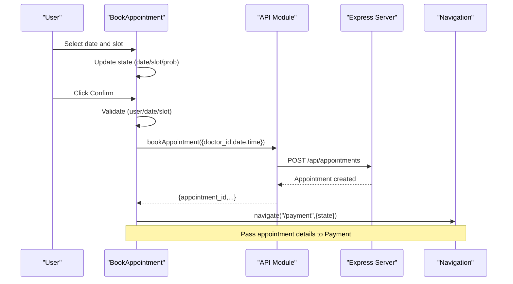
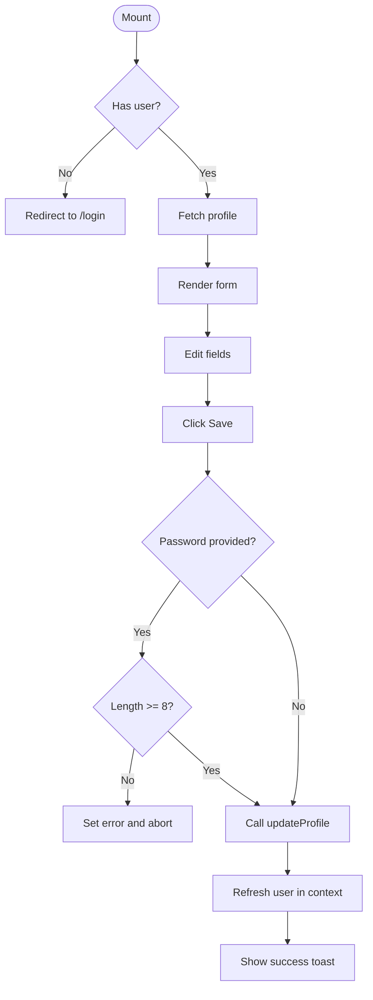
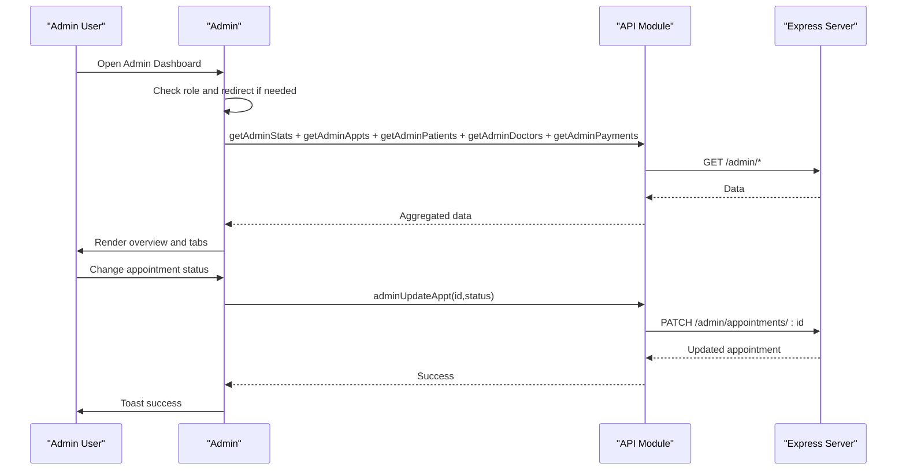
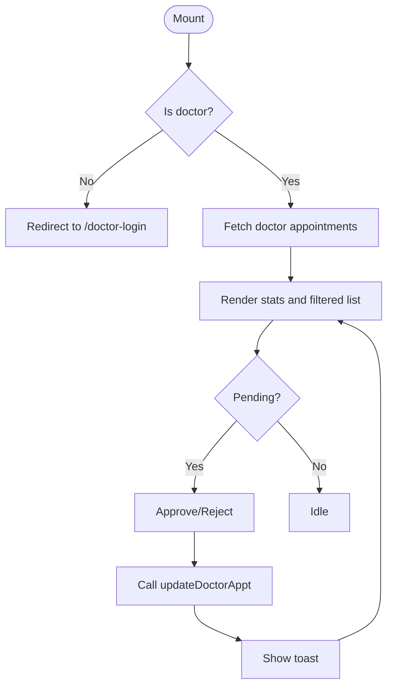
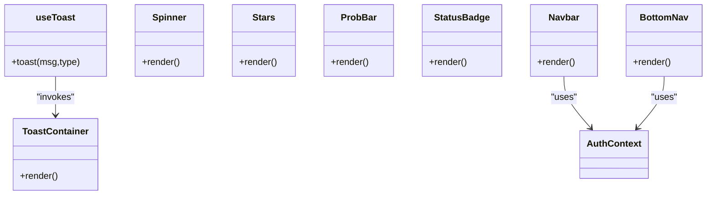
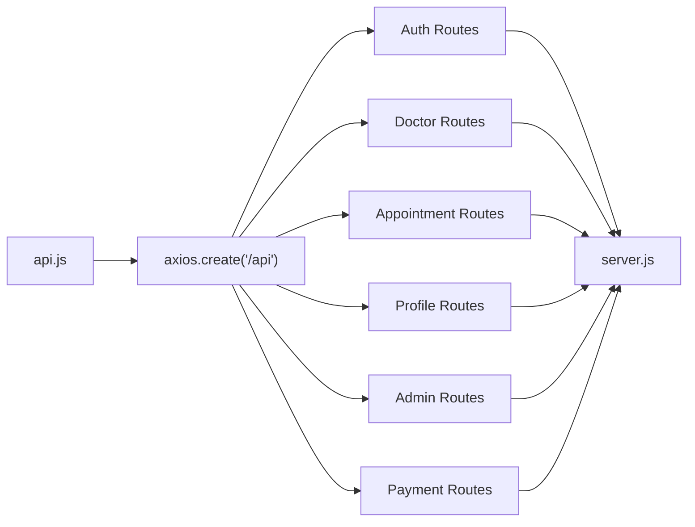
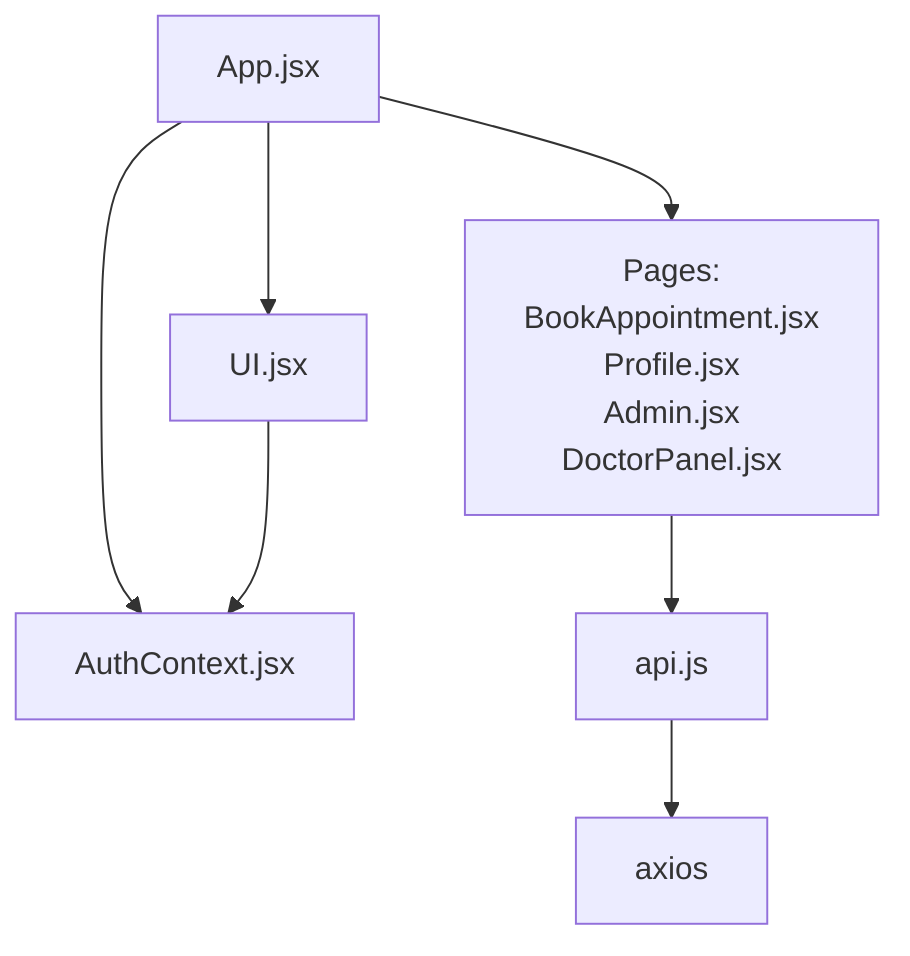

# Page Components

<cite>
**Referenced Files in This Document**
- [App.jsx](file://App.jsx)
- [AuthContext.jsx](file://AuthContext.jsx)
- [UI.jsx](file://UI.jsx)
- [BookAppointment.jsx](file://BookAppointment.jsx)
- [Profile.jsx](file://Profile.jsx)
- [Admin.jsx](file://Admin.jsx)
- [DoctorPanel.jsx](file://DoctorPanel.jsx)
- [api.js](file://api.js)
- [server.js](file://server.js)
- [README.md](file://README.md)
</cite>

## Table of Contents
1. [Introduction](#introduction)
2. [Project Structure](#project-structure)
3. [Core Components](#core-components)
4. [Architecture Overview](#architecture-overview)
5. [Detailed Component Analysis](#detailed-component-analysis)
6. [Dependency Analysis](#dependency-analysis)
7. [Performance Considerations](#performance-considerations)
8. [Troubleshooting Guide](#troubleshooting-guide)
9. [Conclusion](#conclusion)

## Introduction
This document provides comprehensive documentation for the page-specific React components of the MediBook online doctor appointment system. It covers the App component’s routing and layout, the BookAppointment component’s doctor selection and slot booking with confirmation probability, the Profile component’s user information management, the Admin component’s dashboard and administrative controls, and the DoctorPanel component’s doctor-specific appointment management. The guide explains component props, state management patterns, form handling, API integration, and user interaction flows, along with lifecycle examples, error handling, and data fetching patterns.

## Project Structure
The application is structured around a React frontend and a Node.js/Express backend. The frontend uses React Router for navigation and a custom UI library for shared components. Authentication state is managed via a context provider and persisted in local storage. API calls are centralized in a dedicated module that wraps axios.

**Diagram sources**
- [App.jsx](file://App.jsx#L15-L42)
- [AuthContext.jsx](file://AuthContext.jsx#L6-L37)
- [UI.jsx](file://UI.jsx#L11-L25)
- [BookAppointment.jsx](file://BookAppointment.jsx#L1-L171)
- [Profile.jsx](file://Profile.jsx#L1-L97)
- [Admin.jsx](file://Admin.jsx#L1-L194)
- [DoctorPanel.jsx](file://DoctorPanel.jsx#L1-L96)
- [api.js](file://api.js#L1-L44)
- [server.js](file://server.js#L1-L390)

**Section sources**
- [README.md](file://README.md#L7-L33)
- [App.jsx](file://App.jsx#L1-L44)
- [AuthContext.jsx](file://AuthContext.jsx#L1-L41)
- [UI.jsx](file://UI.jsx#L1-L182)
- [api.js](file://api.js#L1-L44)
- [server.js](file://server.js#L1-L390)

## Core Components
- App: Sets up routing, layout, and global providers. Defines all public and protected routes and renders the top-level navbar and bottom navigation.
- AuthContext: Provides authentication state, JWT token handling, and theme persistence.
- UI: Shared UI primitives including Navbar, BottomNav, ToastContainer, Spinner, Stars, ProbBar, StatusBadge, and Countdown.
- BookAppointment: Doctor selection, slot booking, confirmation probability display, and review submission.
- Profile: Patient profile editing, password change, and saving updates.
- Admin: Administrative dashboard with statistics, appointment management, patient listing, doctor management, and payment overview.
- DoctorPanel: Doctor-side appointment requests, status updates, and filtering.

**Section sources**
- [App.jsx](file://App.jsx#L15-L42)
- [AuthContext.jsx](file://AuthContext.jsx#L6-L41)
- [UI.jsx](file://UI.jsx#L97-L182)
- [BookAppointment.jsx](file://BookAppointment.jsx#L7-L171)
- [Profile.jsx](file://Profile.jsx#L7-L97)
- [Admin.jsx](file://Admin.jsx#L7-L194)
- [DoctorPanel.jsx](file://DoctorPanel.jsx#L7-L96)

## Architecture Overview
The frontend uses React Router for declarative routing and a context provider for authentication. Components communicate with the backend via axios-based API functions. The backend exposes REST endpoints for authentication, doctor listings, appointments, profiles, admin operations, and payments.

**Diagram sources**
- [App.jsx](file://App.jsx#L23-L36)
- [AuthContext.jsx](file://AuthContext.jsx#L21-L31)
- [api.js](file://api.js#L3-L44)
- [server.js](file://server.js#L67-L110)

## Detailed Component Analysis

### App Component
- Purpose: Central router and layout shell. Wraps children in AuthProvider, renders Navbar and BottomNav, and defines all routes.
- Routing:
  - Public: Home, Register, Login, DoctorLogin, AdminLogin, Doctors
  - Protected: BookAppointment (with doctor id param), Appointments, Profile, DoctorPanel, Admin, Payment
- Layout:
  - Top-level container with column direction
  - Navbar at the top
  - ToastContainer for notifications
  - Routes inside a flexible content area
  - BottomNav at the bottom
- Authentication:
  - Uses AuthProvider to supply user/token/dark mode to all pages
- Navigation:
  - Uses react-router-dom hooks for programmatic navigation

**Diagram sources**
- [App.jsx](file://App.jsx#L15-L42)
- [UI.jsx](file://UI.jsx#L97-L176)

**Section sources**
- [App.jsx](file://App.jsx#L15-L42)
- [AuthContext.jsx](file://AuthContext.jsx#L6-L37)
- [UI.jsx](file://UI.jsx#L97-L176)

### BookAppointment Component
- Props: None (uses react-router params and hooks)
- State:
  - Doctor data and loading flag
  - Selected date and slot
  - Booking state and error
  - Confirmation probability
  - Review rating/comment and submission state
- Lifecycle:
  - Fetches doctor by id on mount
  - Updates probability when slot/date changes
  - Validates inputs before booking
- Interaction:
  - Select preferred date (min today)
  - Choose available time slot
  - Confirm appointment (redirects to Payment with state)
  - Submit review with rating and optional comment
- API Integration:
  - getDoctorById
  - bookAppointment
  - addReview
- UI Elements:
  - Doctor card with name, specialization, experience, rating
  - Slot selection grid
  - ProbBar for confirmation probability
  - Review section with existing reviews

**Diagram sources**
- [BookAppointment.jsx](file://BookAppointment.jsx#L39-L60)
- [api.js](file://api.js#L17-L18)
- [server.js](file://server.js#L170-L202)

**Section sources**
- [BookAppointment.jsx](file://BookAppointment.jsx#L7-L171)
- [api.js](file://api.js#L11-L18)
- [server.js](file://server.js#L116-L131)

### Profile Component
- Props: None
- State:
  - Form fields: name, phone, age, password
  - Loading, saving, and error flags
- Lifecycle:
  - Redirects to login if not authenticated
  - Loads profile on mount
- Interaction:
  - Editable fields except email
  - Optional password change with length validation
  - Save updates and refreshes auth context
- API Integration:
  - getProfile
  - updateProfile

**Diagram sources**
- [Profile.jsx](file://Profile.jsx#L16-L40)
- [api.js](file://api.js#L26-L27)
- [AuthContext.jsx](file://AuthContext.jsx#L21-L31)

**Section sources**
- [Profile.jsx](file://Profile.jsx#L7-L97)
- [api.js](file://api.js#L26-L27)
- [AuthContext.jsx](file://AuthContext.jsx#L21-L31)

### Admin Component
- Props: None
- State:
  - Active tab (overview, appointments, patients, doctors, payments)
  - Stats, appointments, patients, doctors, payments lists
  - Loading flag
- Lifecycle:
  - Redirects to admin-login if not admin
  - Parallel fetches stats, appointments, patients, doctors, payments
- Interaction:
  - Change appointment status via select
  - Remove doctor with confirmation
- API Integration:
  - getAdminStats, getAdminAppts, getAdminPatients, getAdminDoctors, getAdminPayments
  - adminUpdateAppt, adminDeleteDoctor

**Diagram sources**
- [Admin.jsx](file://Admin.jsx#L19-L32)
- [api.js](file://api.js#L30-L35)
- [server.js](file://server.js#L244-L280)

**Section sources**
- [Admin.jsx](file://Admin.jsx#L7-L194)
- [api.js](file://api.js#L29-L35)
- [server.js](file://server.js#L244-L280)

### DoctorPanel Component
- Props: None
- State:
  - Appointments list and loading
  - Filter (pending, approved, cancelled, all)
- Lifecycle:
  - Redirects to doctor-login if not doctor
  - Fetches doctor’s appointments on mount
- Interaction:
  - Filter by status
  - Approve or reject pending appointments
- API Integration:
  - getDoctorAppts
  - updateDoctorAppt

**Diagram sources**
- [DoctorPanel.jsx](file://DoctorPanel.jsx#L15-L28)
- [api.js](file://api.js#L22-L23)
- [server.js](file://server.js#L134-L153)

**Section sources**
- [DoctorPanel.jsx](file://DoctorPanel.jsx#L7-L96)
- [api.js](file://api.js#L22-L23)
- [server.js](file://server.js#L134-L153)

### Shared UI Components
- ToastContainer and useToast: Global toast notification system with auto-dismiss.
- Spinner: Centered loading indicator.
- Stars: Renders star ratings with half-stars and numeric label.
- ProbBar: Confirmation probability bar with color-coded label.
- StatusBadge: Badge indicating appointment status.
- Navbar and BottomNav: Role-aware navigation with active state and dark mode toggle.

**Diagram sources**
- [UI.jsx](file://UI.jsx#L11-L25)
- [UI.jsx](file://UI.jsx#L28-L41)
- [UI.jsx](file://UI.jsx#L44-L58)
- [UI.jsx](file://UI.jsx#L179-L181)
- [UI.jsx](file://UI.jsx#L97-L138)
- [UI.jsx](file://UI.jsx#L141-L176)

**Section sources**
- [UI.jsx](file://UI.jsx#L11-L182)

### API Layer and Backend Integration
- API module centralizes axios calls for auth, doctors, appointments, profiles, admin, and payments.
- Backend routes handle JWT-protected endpoints, validation, and data shaping.
- Example endpoints:
  - Auth: register, login, doctor-login, admin-login
  - Doctors: list, by-id, add-review
  - Appointments: book, list, cancel
  - Profiles: get, update
  - Admin: stats, appointments, patients, doctors, payments, update-appt, delete-doctor
  - Payments: create-intent, simulate, receipt, fee

**Diagram sources**
- [api.js](file://api.js#L3-L44)
- [server.js](file://server.js#L67-L110)
- [server.js](file://server.js#L116-L131)
- [server.js](file://server.js#L170-L202)
- [server.js](file://server.js#L222-L239)
- [server.js](file://server.js#L244-L280)
- [server.js](file://server.js#L298-L377)

**Section sources**
- [api.js](file://api.js#L1-L44)
- [server.js](file://server.js#L67-L110)
- [server.js](file://server.js#L116-L131)
- [server.js](file://server.js#L170-L202)
- [server.js](file://server.js#L222-L239)
- [server.js](file://server.js#L244-L280)
- [server.js](file://server.js#L298-L377)

## Dependency Analysis
- Component dependencies:
  - App depends on AuthProvider, UI components, and page components.
  - Page components depend on AuthContext for user state and useAuth hook.
  - Page components depend on API module for data fetching and mutations.
  - UI module depends on AuthContext for theme and navigation.
- Coupling and cohesion:
  - Strong cohesion within each page component around a single responsibility.
  - Low coupling via shared API module and context provider.
- External dependencies:
  - axios for HTTP requests
  - react-router-dom for routing and navigation
  - Local storage for auth and theme persistence

**Diagram sources**
- [App.jsx](file://App.jsx#L1-L13)
- [AuthContext.jsx](file://AuthContext.jsx#L1-L41)
- [UI.jsx](file://UI.jsx#L1-L4)
- [BookAppointment.jsx](file://BookAppointment.jsx#L1-L6)
- [Profile.jsx](file://Profile.jsx#L1-L6)
- [Admin.jsx](file://Admin.jsx#L1-L6)
- [DoctorPanel.jsx](file://DoctorPanel.jsx#L1-L6)
- [api.js](file://api.js#L1-L3)

**Section sources**
- [App.jsx](file://App.jsx#L1-L13)
- [AuthContext.jsx](file://AuthContext.jsx#L1-L41)
- [UI.jsx](file://UI.jsx#L1-L4)
- [api.js](file://api.js#L1-L3)

## Performance Considerations
- UseEffect dependencies: Ensure minimal re-renders by including only necessary dependencies in useEffect arrays.
- Parallel data fetching: Admin component uses Promise.all to reduce loading time.
- Conditional rendering: Show loading spinners while fetching data to prevent unnecessary computations.
- Memoization: Consider memoizing expensive computations (e.g., probability calculation) if reused frequently.
- Debouncing: For search/filter operations, debounce input handlers to limit API calls.

## Troubleshooting Guide
- Authentication errors:
  - Verify JWT token presence and validity in AuthContext.
  - Check Authorization header propagation in axios defaults.
- Route protection:
  - Ensure redirects occur when roles mismatch (Admin, DoctorPanel).
- API failures:
  - Inspect error messages returned by API and display user-friendly messages.
  - Confirm backend endpoints are reachable and CORS is configured.
- UI feedback:
  - Use toast notifications for success/error states.
  - Provide clear error messages in forms and during booking.

**Section sources**
- [AuthContext.jsx](file://AuthContext.jsx#L11-L19)
- [Admin.jsx](file://Admin.jsx#L20-L23)
- [DoctorPanel.jsx](file://DoctorPanel.jsx#L16-L19)
- [UI.jsx](file://UI.jsx#L11-L25)

## Conclusion
The page components are well-structured with clear separation of concerns. Routing is centralized in App.jsx, authentication is handled via a context provider, and shared UI components promote consistency. Each page component follows predictable patterns for data fetching, state management, form handling, and API integration. The Admin and DoctorPanel dashboards demonstrate robust administrative and doctor-specific workflows, while BookAppointment and Profile provide intuitive user experiences for booking and profile management.