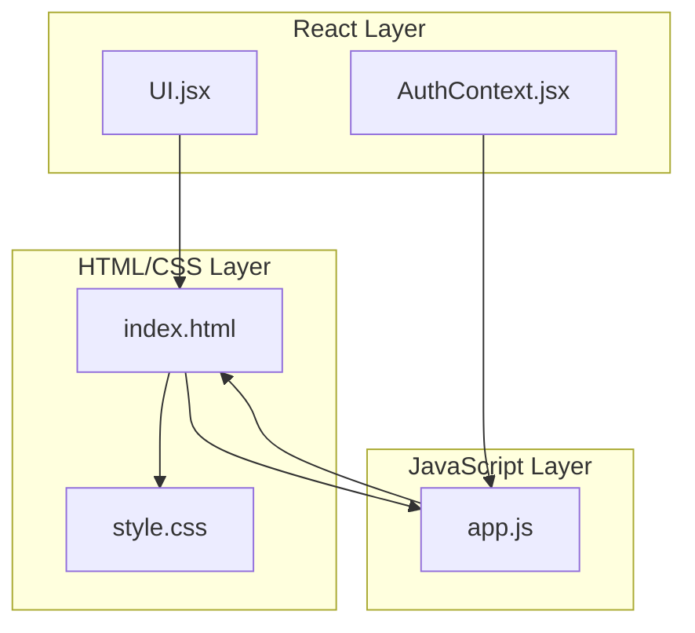
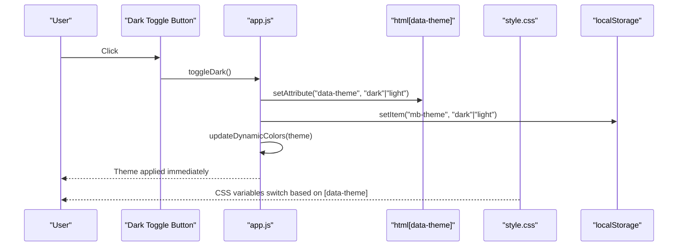
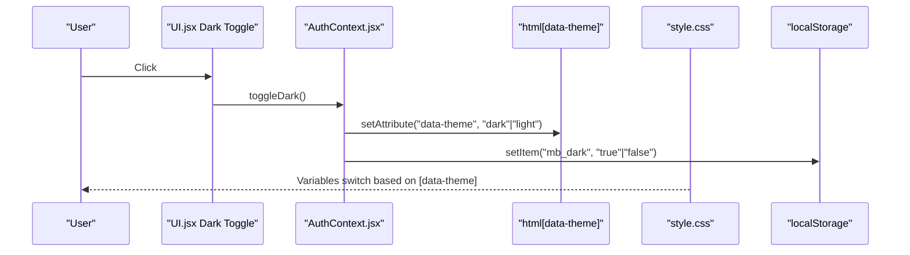
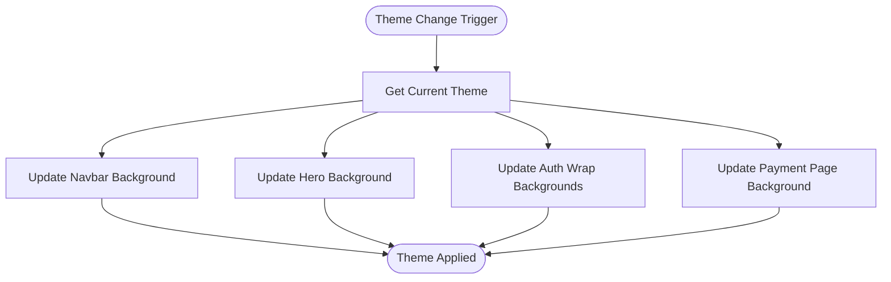
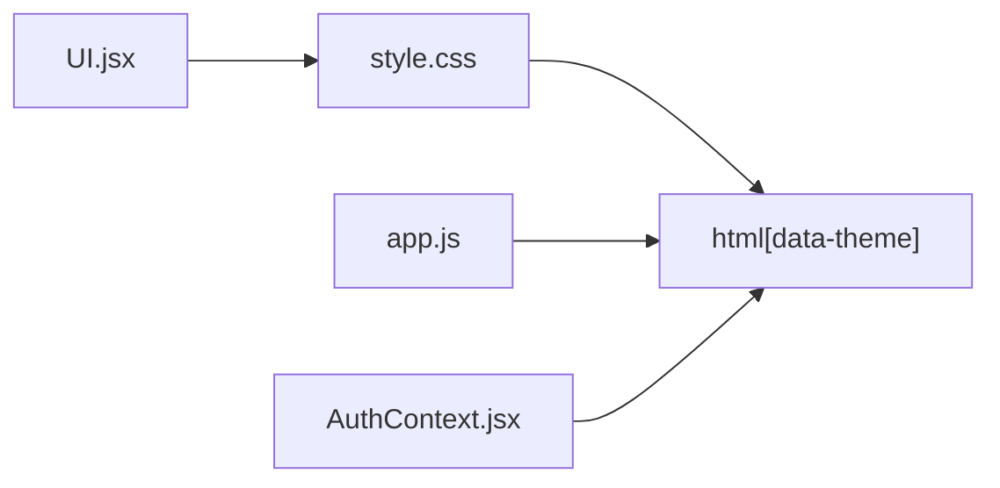

# Styling and Theming

<cite>
**Referenced Files in This Document**
- [style.css](file://style.css)
- [index.html](file://index.html)
- [AuthContext.jsx](file://AuthContext.jsx)
- [UI.jsx](file://UI.jsx)
- [app.js](file://app.js)
</cite>

## Table of Contents
1. [Introduction](#introduction)
2. [Project Structure](#project-structure)
3. [Core Components](#core-components)
4. [Architecture Overview](#architecture-overview)
5. [Detailed Component Analysis](#detailed-component-analysis)
6. [Dependency Analysis](#dependency-analysis)
7. [Performance Considerations](#performance-considerations)
8. [Troubleshooting Guide](#troubleshooting-guide)
9. [Conclusion](#conclusion)

## Introduction
This document explains the styling and theming architecture of the application. It covers the CSS design system, custom properties for theming, component-specific styles, responsive design patterns, dark mode implementation, and integration between vanilla HTML/CSS and React components. It also documents spacing systems, color schemes, typography scales, interactive states, and animation systems. Finally, it provides guidelines for theme customization and best practices for consistent component styling.

## Project Structure
The styling system spans both a global stylesheet and inline/injected styles:
- Global CSS defines design tokens, layout helpers, components, and responsive rules.
- Inline styles and JavaScript dynamically apply theme attributes and update dynamic backgrounds.
- React components integrate with the global design system via CSS classes and CSS variables.

**Diagram sources**
- [index.html](file://index.html#L1-L552)
- [style.css](file://style.css#L1-L979)
- [app.js](file://app.js#L1-L965)
- [AuthContext.jsx](file://AuthContext.jsx#L1-L41)
- [UI.jsx](file://UI.jsx#L1-L182)

**Section sources**
- [index.html](file://index.html#L1-L552)
- [style.css](file://style.css#L1-L979)
- [app.js](file://app.js#L1-L965)
- [AuthContext.jsx](file://AuthContext.jsx#L1-L41)
- [UI.jsx](file://UI.jsx#L1-L182)

## Core Components
- Design tokens: CSS custom properties define color palette, shadows, radii, and spacing.
- Theme switching: CSS variables switch via a data attribute on the root element; JavaScript persists state and updates dynamic backgrounds.
- Component styles: Buttons, forms, cards, badges, navigation, and page sections use consistent design tokens.
- Responsive patterns: Media queries and grid helpers adapt layouts for mobile and tablet.
- Animations and transitions: Transitions on hover/focus and keyframes for loading and page effects.

**Section sources**
- [style.css](file://style.css#L7-L58)
- [style.css](file://style.css#L658-L765)
- [app.js](file://app.js#L47-L84)
- [AuthContext.jsx](file://AuthContext.jsx#L16-L19)

## Architecture Overview
The theming architecture centers on CSS custom properties and a data attribute on the root element. JavaScript toggles the attribute and persists the preference. CSS selectors react to the attribute to switch palettes and backgrounds. Some dynamic backgrounds require JS updates because CSS variables cannot be interpolated into certain properties.

**Diagram sources**
- [app.js](file://app.js#L47-L84)
- [style.css](file://style.css#L35-L58)
- [index.html](file://index.html#L2-L2)

## Detailed Component Analysis

### CSS Design System and Tokens
- Color palette: Deep forest green, warm cream, gold accents, muted grays, and danger/warn/success states.
- Shadows: Small, medium, and large elevation shadows using alpha-blended colors.
- Radii: Pill, small, and base radii for rounded corners.
- Typography: Headings use a serif font; body uses a sans-serif font.
- Spacing: Consistent gaps and paddings derived from a base scale.

These tokens are defined as CSS custom properties and consumed throughout the stylesheet.

**Section sources**
- [style.css](file://style.css#L7-L33)
- [style.css](file://style.css#L83-L91)

### Dark Mode Implementation
- CSS variables switch inside a scoped selector targeting the theme attribute.
- A universal transition is defined for smooth color and shadow changes.
- Explicit overrides exist for gradients and rgba backgrounds to ensure contrast and readability.
- Scrollbar styling adapts to dark mode.

**Section sources**
- [style.css](file://style.css#L35-L58)
- [style.css](file://style.css#L63-L80)
- [style.css](file://style.css#L682-L765)

### Theme Persistence and React Integration
- React’s AuthContext reads and writes a theme flag to localStorage and applies it to the root element.
- The toggle function updates the data attribute and persists the choice.
- On load, the theme is restored from localStorage or inferred from system preference.

**Section sources**
- [AuthContext.jsx](file://AuthContext.jsx#L6-L19)
- [app.js](file://app.js#L86-L105)

### Component Styles and Patterns
- Buttons: Primary, outline, ghost, gold, danger, sizes, and icon variants.
- Forms: Inputs, selects, textareas with focus states and error messaging.
- Cards: Surface, borders, shadows, and hover states.
- Badges: Status-based color variants.
- Navigation: Sticky navbar with backdrop blur, brand, links, and actions.
- Bottom navigation: Mobile-first navigation with active states.
- Toasts: Animated notifications with left-side colored indicators.
- Progress bars: Probability bar with dynamic width and color.
- Count-down timers: Compact inline counters.
- Pages: Hero, features, payment methods, auth cards, doctor listings, booking, appointments, profile, doctor panel, admin dashboard.

**Section sources**
- [style.css](file://style.css#L109-L133)
- [style.css](file://style.css#L134-L151)
- [style.css](file://style.css#L152-L157)
- [style.css](file://style.css#L158-L165)
- [style.css](file://style.css#L169-L217)
- [style.css](file://style.css#L221-L234)
- [style.css](file://style.css#L235-L245)
- [style.css](file://style.css#L257-L261)
- [style.css](file://style.css#L262-L267)
- [style.css](file://style.css#L287-L373)
- [style.css](file://style.css#L377-L431)
- [style.css](file://style.css#L435-L537)
- [style.css](file://style.css#L558-L651)

### Responsive Design Patterns
- Breakpoints: Two primary max-width thresholds drive layout changes.
- Grid helpers: 2, 3, 4 column grids and auto-fill grids for flexible content.
- Mobile navigation: Desktop links collapse into a bottom navigation bar.
- Typography scaling: Clamp-based headings for fluid sizing.
- Safe areas: Bottom navigation accounts for device insets.

**Section sources**
- [style.css](file://style.css#L658-L680)
- [style.css](file://style.css#L96-L107)
- [style.css](file://style.css#L304-L309)

### Animation Systems
- Transitions: Smooth color, background, border, and shadow transitions across components.
- Keyframes: Floating card, spinner, slide-in, shimmer, dot bounce, and pop-in animations.
- Page transitions: Fade-up animation for page content.

**Section sources**
- [style.css](file://style.css#L63-L80)
- [style.css](file://style.css#L107-L107)
- [style.css](file://style.css#L249-L251)
- [style.css](file://style.css#L245-L245)
- [style.css](file://style.css#L421-L424)
- [style.css](file://style.css#L645-L651)
- [style.css](file://style.css#L628-L630)

### Integration Between Styled Components and CSS Classes
- React components use CSS classes for styling and rely on global CSS variables for theming.
- Inline styles are used sparingly for dynamic values (e.g., progress bar width, card visuals).
- The UI component library exports reusable building blocks (toasts, spinner, stars, probability bar, countdown) that consume CSS classes and variables.

**Section sources**
- [UI.jsx](file://UI.jsx#L11-L25)
- [UI.jsx](file://UI.jsx#L28-L30)
- [UI.jsx](file://UI.jsx#L33-L41)
- [UI.jsx](file://UI.jsx#L44-L58)
- [UI.jsx](file://UI.jsx#L61-L86)

### Example: Theme Switching Flow

**Diagram sources**
- [UI.jsx](file://UI.jsx#L127-L129)
- [AuthContext.jsx](file://AuthContext.jsx#L34-L34)
- [AuthContext.jsx](file://AuthContext.jsx#L16-L19)
- [style.css](file://style.css#L35-L58)

### Example: Dynamic Background Updates
Some backgrounds cannot be expressed purely via CSS variables and require JavaScript to update computed styles. The app updates navbar, hero, auth wrap, and payment page backgrounds on theme change.

**Diagram sources**
- [app.js](file://app.js#L47-L84)

## Dependency Analysis
- CSS depends on custom properties for theming and media queries for responsiveness.
- JavaScript toggles the root data attribute and updates dynamic backgrounds.
- React components depend on CSS classes and CSS variables for consistent appearance.

**Diagram sources**
- [style.css](file://style.css#L35-L58)
- [app.js](file://app.js#L47-L84)
- [AuthContext.jsx](file://AuthContext.jsx#L16-L19)
- [UI.jsx](file://UI.jsx#L1-L182)

**Section sources**
- [style.css](file://style.css#L35-L58)
- [app.js](file://app.js#L47-L84)
- [AuthContext.jsx](file://AuthContext.jsx#L16-L19)
- [UI.jsx](file://UI.jsx#L1-L182)

## Performance Considerations
- CSS transitions are scoped to relevant properties to minimize layout thrash.
- Keyframes are lightweight and only animate visual properties.
- Avoid excessive reflows by batching DOM updates when applying theme changes.
- Prefer CSS variables over recalculating colors in JavaScript.

[No sources needed since this section provides general guidance]

## Troubleshooting Guide
- Theme not persisting: Ensure the data attribute is set on the root element and localStorage keys match expectations.
- Dynamic backgrounds not updating: Verify the dynamic color update function runs after DOMContentLoaded and targets the correct elements.
- Hover/focus states not smooth: Confirm transition properties are defined for the affected components.
- Mobile navigation missing: Check that bottom navigation is rendered and active states are applied.

**Section sources**
- [AuthContext.jsx](file://AuthContext.jsx#L16-L19)
- [app.js](file://app.js#L86-L105)
- [style.css](file://style.css#L63-L80)
- [style.css](file://style.css#L658-L680)

## Conclusion
The styling and theming architecture combines a robust CSS design system with CSS custom properties and a data-attribute-driven theme switch. JavaScript ensures persistence and handles dynamic background updates. The result is a cohesive, responsive, and accessible UI with consistent design tokens, smooth transitions, and clear component boundaries.