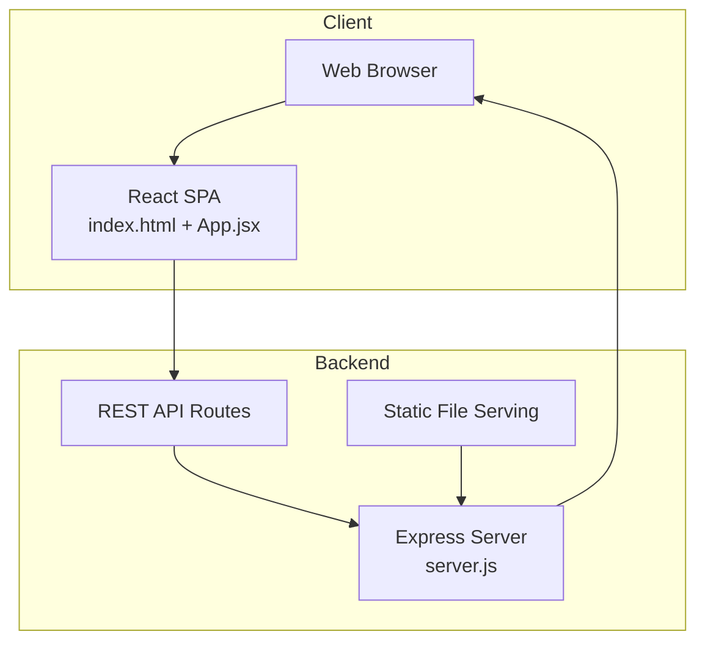
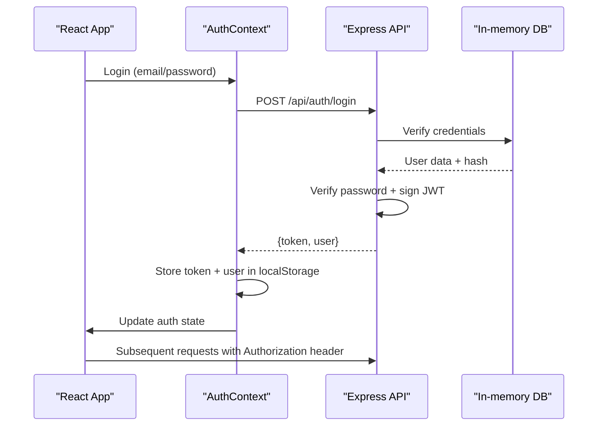
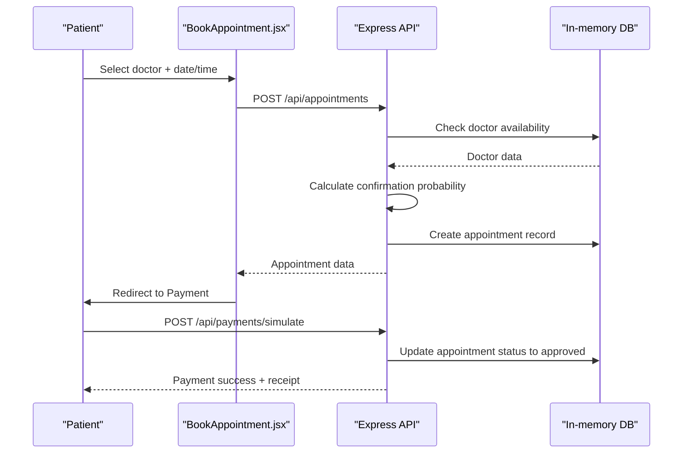
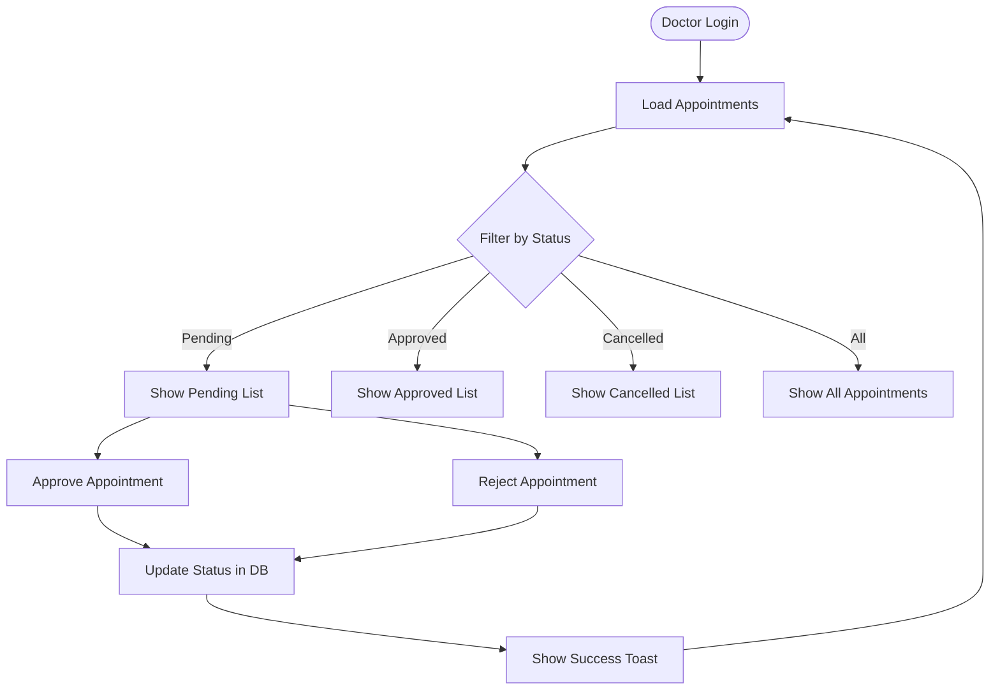
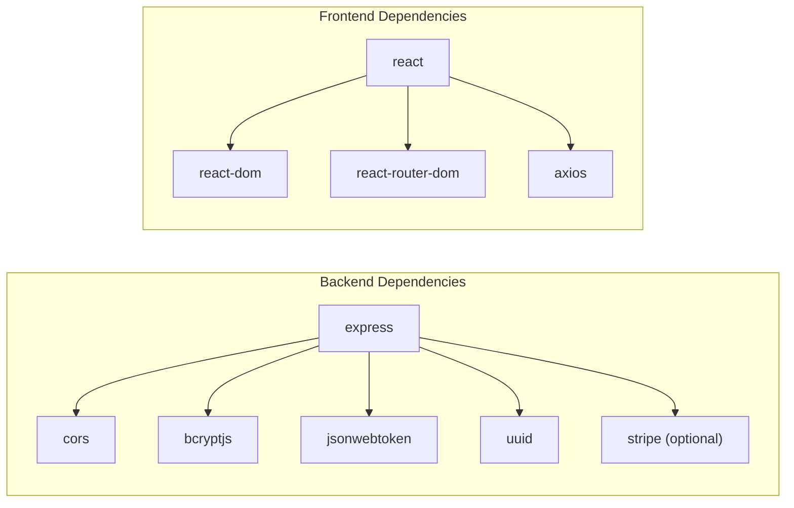

# Getting Started

<cite>
**Referenced Files in This Document**
- [README.md](file://README.md)
- [package.json](file://package.json)
- [server.js](file://server.js)
- [index.html](file://index.html)
- [App.jsx](file://App.jsx)
- [api.js](file://api.js)
- [AuthContext.jsx](file://AuthContext.jsx)
- [BookAppointment.jsx](file://BookAppointment.jsx)
- [Payment.jsx](file://Payment.jsx)
- [DoctorPanel.jsx](file://DoctorPanel.jsx)
- [style.css](file://style.css)
</cite>

## Table of Contents
1. [Introduction](#introduction)
2. [Prerequisites](#prerequisites)
3. [Installation](#installation)
4. [Development Setup](#development-setup)
5. [Project Structure](#project-structure)
6. [Quick Start](#quick-start)
7. [System Requirements](#system-requirements)
8. [IDE Recommendations](#ide-recommendations)
9. [Browser Compatibility](#browser-compatibility)
10. [Architecture Overview](#architecture-overview)
11. [Detailed Component Analysis](#detailed-component-analysis)
12. [Dependency Analysis](#dependency-analysis)
13. [Performance Considerations](#performance-considerations)
14. [Troubleshooting Guide](#troubleshooting-guide)
15. [Conclusion](#conclusion)

## Introduction
MediBook is a full-stack web application for online doctor appointment booking. It consists of:
- Backend: Node.js + Express REST API with in-memory storage
- Frontend: React SPA served statically by the backend

The system supports three roles:
- Patient: register, login, search doctors, book appointments, manage profile, pay via multiple methods
- Doctor: view and approve/reject appointment requests
- Admin: dashboard for system overview and administrative controls

## Prerequisites
- Node.js: 18.x or later recommended
- npm: 8.x or later
- Git (recommended)
- Modern web browser (Chrome, Firefox, Edge, Safari)

Notes:
- The project uses ES Modules and modern JavaScript features. Ensure your Node.js version supports these features.
- The backend serves static assets, so no separate frontend build step is required.

**Section sources**
- [README.md](file://README.md#L37-L53)
- [package.json](file://package.json#L1-L24)

## Installation
Follow these steps to install and run the application locally.

### Backend Setup
1. Navigate to the backend directory and install dependencies:
   - cd backend
   - npm install
2. Start the backend server:
   - npm start
   - The API will run on http://localhost:5000

### Frontend Setup
1. Navigate to the frontend directory and install dependencies:
   - cd frontend
   - npm install
2. Start the frontend development server:
   - npm start
   - The React app will run on http://localhost:3000

Important:
- The backend serves the React app at the root route (/). Requests to /api/* are proxied to the backend server.
- The frontend expects the backend to be running on http://localhost:5000.

**Section sources**
- [README.md](file://README.md#L37-L53)
- [server.js](file://server.js#L18-L24)
- [index.html](file://index.html#L529-L531)

## Development Setup
- Backend development server: http://localhost:5000
- Frontend development server: http://localhost:3000
- The React app is served statically by the backend server.

Environment variables:
- JWT_SECRET: Secret key for JWT signing (default included in backend)
- STRIPE_SECRET_KEY: Optional Stripe secret key for payment integration

Port configuration:
- Backend port: 5000 (default)
- Frontend port: 3000 (default)
- The frontend proxy forwards API calls from http://localhost:3000/api to http://localhost:5000/api

**Section sources**
- [server.js](file://server.js#L18-L19)
- [index.html](file://index.html#L529-L531)

## Project Structure
The repository follows a monorepo-like layout with backend and frontend directories. The backend serves static files from the project root.

Key directories and files:
- backend/server.js: Express server with all API routes and in-memory database
- frontend/src/App.jsx: React router and application shell
- frontend/src/api.js: Axios wrapper for API calls
- frontend/src/context/AuthContext.jsx: Authentication state management
- frontend/public/index.html: Static HTML entry point serving the React app
- frontend/public/style.css: Global styles and theme

**Section sources**
- [README.md](file://README.md#L7-L33)
- [index.html](file://index.html#L1-L531)
- [App.jsx](file://App.jsx#L1-L44)
- [api.js](file://api.js#L1-L44)
- [AuthContext.jsx](file://AuthContext.jsx#L1-L41)

## Quick Start
1. Install dependencies for both backend and frontend
2. Start the backend server
3. Start the frontend development server
4. Open http://localhost:3000 in your browser

Initial demo credentials:
- Admin: username admin, password admin123
- Doctors: sarah@medibook.com (doctor123) and bilal@medibook.com (doctor123)
- New patients can register via the frontend

**Section sources**
- [README.md](file://README.md#L57-L64)
- [index.html](file://index.html#L226-L248)

## System Requirements
- Operating systems: Windows, macOS, Linux
- Memory: Minimum 2 GB RAM recommended
- Disk space: ~50 MB free space
- Network: Internet connection for npm packages and optional Stripe integration

## IDE Recommendations
- VS Code: Recommended with extensions for React, ESLint, Prettier
- WebStorm: Full-featured IDE with excellent React support
- Sublime Text: Lightweight option with JSX support

## Browser Compatibility
- Chrome: Latest version
- Firefox: Latest version
- Safari: Latest version
- Edge: Latest version

Note: The application uses modern JavaScript features and CSS variables. Older browsers may not render correctly.

## Architecture Overview
The application uses a simple full-stack architecture where the backend serves both API endpoints and static frontend files.

**Diagram sources**
- [server.js](file://server.js#L17-L24)
- [index.html](file://index.html#L1-L531)

## Detailed Component Analysis

### Authentication Flow
The authentication system uses JWT tokens stored in localStorage and attached to API requests via Axios interceptors.

**Diagram sources**
- [AuthContext.jsx](file://AuthContext.jsx#L6-L37)
- [server.js](file://server.js#L82-L90)
- [api.js](file://api.js#L6-L9)

### Appointment Booking Flow
The booking process involves selecting a doctor, choosing a date/time, confirming booking, and processing payment.

**Diagram sources**
- [BookAppointment.jsx](file://BookAppointment.jsx#L39-L60)
- [server.js](file://server.js#L170-L202)
- [Payment.jsx](file://Payment.jsx#L79-L98)

### Doctor Panel Workflow
Doctors can view and manage incoming appointment requests.

**Diagram sources**
- [DoctorPanel.jsx](file://DoctorPanel.jsx#L15-L28)
- [server.js](file://server.js#L133-L153)

## Dependency Analysis
The application has minimal external dependencies focused on core functionality.

Backend dependencies:
- express: Web framework
- cors: Cross-origin resource sharing
- bcryptjs: Password hashing
- jsonwebtoken: JWT token generation/verification
- uuid: Unique identifier generation
- stripe: Optional payment processing (can be removed if not needed)

Frontend dependencies (via package.json):
- react: Core library
- react-dom: DOM rendering
- react-router-dom: Client-side routing
- axios: HTTP client for API calls

**Diagram sources**
- [package.json](file://package.json#L14-L22)

**Section sources**
- [package.json](file://package.json#L1-L24)

## Performance Considerations
- In-memory database: Suitable for development/demo but not for production scale
- Static asset serving: Efficient for small to medium applications
- JWT tokens: Lightweight authentication without server-side session storage
- Stripe integration: Optional; remove dependency if not needed to reduce bundle size

## Troubleshooting Guide

### Common Setup Issues

**Backend fails to start**
- Ensure Node.js version is compatible (18.x or later)
- Check if port 5000 is available
- Verify all dependencies are installed

**Frontend not loading**
- Confirm backend is running on http://localhost:5000
- Check browser console for CORS errors
- Verify index.html is being served correctly

**API requests failing**
- Ensure Authorization header is present for protected routes
- Check JWT_SECRET environment variable
- Verify API endpoints match expected paths

**Payment integration issues**
- Stripe dependency missing: Install stripe package or use simulation endpoint
- Check STRIPE_SECRET_KEY environment variable
- Use simulation endpoint for testing without Stripe

**Authentication problems**
- Verify localStorage contains token and user data
- Check JWT_SECRET consistency between frontend and backend
- Ensure bcrypt hashes are properly generated

**Section sources**
- [server.js](file://server.js#L11-L15)
- [AuthContext.jsx](file://AuthContext.jsx#L11-L14)
- [api.js](file://api.js#L3-L3)

## Conclusion
MediBook provides a solid foundation for a doctor appointment booking system with clear separation between frontend and backend concerns. The in-memory database and static file serving make it easy to develop and deploy quickly. For production use, consider replacing the in-memory store with a proper database and adding HTTPS, rate limiting, and comprehensive error handling.